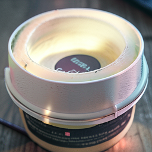

# Debugging FLUX like software

We treat Black Forest Labs' FLUX image models as programs we can stop, inspect, edit and resume. A
generation can be paused at any denoising step, saved bit-for-bit, forked into branches, edited at a
named internal location, and finished by the unmodified model. Every claim is judged on the final
image the real denoiser, scheduler and decoder produce, never on an internal similarity score alone.

| Native FLUX.2 encoder | Foreign encoder (SmolLM2) | Native state donated back |
|---|---|---|
|  |  |  |

*Swap FLUX.2's text encoder for a different language model and the frozen image generator still
draws a clean picture, just the wrong one. Feed the native encoder's output back through the same
interface and the exact native image returns. The defect lives entirely on the text side.
[Full experiment](demos/swapping-the-text-encoder.md).*

## Start here

The full write-up of the core result is the paper
**[The Circuit That Survived Its Coordinates](docs/certified-semantic-circuits/paper.md)**: a
recurring route through FLUX.2 Klein 4B that carries prompt meaning into the image, tested with nine
pre-registered causal checks across twenty prompt edits. It also reports seven measurement
traps we think affect published interpretability results.

The demos below are shorter, visual reports. Read them in this order:

| | Demo | What it shows |
|---:|---|---|
| 1 | [Bitwise-exact state cuts and replay](demos/exact-serving-and-replay.md) | A generation can be saved mid-flight and resumed with zero error across five checkpoints (64/64 images byte-identical). This is what makes every edit below trustworthy. |
| 2 | [One route carries twenty prompt edits](demos/certified-semantic-route.md) | Visual companion to the paper. Six of twenty contrasts pass all nine tests; eleven more pass all but the strict pixel thresholds. Single-step patching misses the route because FLUX re-reads the prompt at every step. |
| 3 | [Forking a generation mid-flight](demos/forking-a-generation.md) | Early edits move the image to the donor's content (0.90–0.97), a hostile donor pulls toward its own content, and the parent is recovered bit-for-bit. Includes a control against simply swapping the prompt. |
| 4 | [Editing one object by writing its prompt rows](demos/objects-as-editable-values.md) | A fox turns white (0.92 / 0.94 on two seeds) while its neighbour stays put. Subtracting two row values and writing the difference turns a different scene's mug blue. |
| 5 | [The object interface across FLUX models](demos/objects-across-flux-models.md) | The same interface works on FLUX.2 base, distilled and 9B, and on FLUX.1. The text encoder sets the grain: one token row in FLUX.2 (Qwen3), a noun-phrase window in FLUX.1 (T5). |
| 6 | [Swapping the text encoder](demos/swapping-the-text-encoder.md) | SmolLM2 and Mamba adapters give clean but semantically wrong images; native donation restores them exactly. Held-out semantics remain incomplete. |
| 7 | [Steering which camera a character reaches for](demos/scene-relations.md) | Adding one non-action direction to hidden state switches which of two cameras a character touches, while the action rows stay byte-identical. |
| 8 | [Small, targeted repairs](demos/small-targeted-repairs.md) | A 104 KB write fixes a counting error (three apples → five) in the distilled model; the collateral damage on ordinary prompts is reported alongside. |
| 9 | [Searching for edits that help the image](demos/searching-for-edits.md) | Propose internal edits, keep only those that improve the final image, roll back the rest exactly. A selector abstains when it is outside its calibrated range. |
| 10 | [What seven FLUX checkpoints share](demos/flux-family-anatomy.md) | Provenance and structure across the family: the conditioners are stock Qwen3 and Mistral models, the 9B-KV denoiser is a structured rewrite of 9B, and counting accuracy collapses past four objects. |
| — | [Learning where to read before writing](demos/learning-where-to-read.md) | A language-model companion (Pythia, Qwen): separating "where to read" from "what to write" in an intervention. |

Earlier report names map to these pages in the [index of former report names](index.md).

## Terms used throughout

| term | meaning |
|---|---|
| `joint.i`, `single.i` | The i-th dual-stream (text + image) transformer block, and the i-th later block where the two streams are merged. Numbering is per checkpoint: Klein 4B has 5 joint blocks, Schnell has 19. |
| route | The internal locations an edit writes to. The recurring one: the text-stream outputs of `joint.2`–`joint.4` plus the text rows of `single.0`, at every denoising step. |
| source, donor, target | The source is the image being edited; the donor is a second run (same seed, different prompt) whose hidden state is copied in; the target is the donor's own image. |
| dose | How much of the donor difference is written: `h_source + dose · (h_donor − h_source)`. Dose 0 is an exact no-op. |
| progress `P` | `1 − MAD(I, I_target) / MAD(I_source, I_target)` on RGB pixels: 0 = unchanged, 1 = the target image. |
| sham | A control edit with the same size as the real one but a random or wrong direction. |
| hostile donor | A donor that differs on a different attribute (a blue fox when the edit is "desert"). A real effect should follow the donor's own content. |
| exact replay | Resuming a saved state with no edit reproduces the original pixels and latent byte-for-byte. |
| register | A saved slice of hidden state (for example the prompt rows that carry one object) that we can read and write. |

## Models

All runs pin a Hugging Face revision. Most causal work uses distilled FLUX.2 Klein 4B at 256² or 512²,
four denoising steps, guidance 1.0, BF16, on one RTX 4080 (16 GB).

| checkpoint | revision | blocks | used for |
|---|---|---|---|
| `black-forest-labs/FLUX.2-klein-4B` | `e7b7dc27f91deacad38e78976d1f2b499d76a294` | 5 joint + 20 single | Most demos |
| `black-forest-labs/FLUX.2-klein-base-4B` | `a3b4f4849157f664bdbc776fd7453c2783562f4d` | 5 joint + 20 single | Base vs distilled comparisons, object replication |
| `black-forest-labs/FLUX.2-klein-9B` | `92196c8e11f7b6cf2b7493e037d8c5345c559216` | 8 joint + 24 single | Object replication, family anatomy, exact replay |
| `black-forest-labs/FLUX.2-klein-9b-kv` | `a6dfb36eca3a3906eb2fd460795adfb844e5fcce` | 8 joint + 24 single | Family anatomy, replay boundary |
| `black-forest-labs/FLUX.2-dev` | `26afe3a78bb242c0a8bb181dcc8937bb16e5c66c` | 8 joint + 48 single | Paged execution, family anatomy |
| `black-forest-labs/FLUX.1-schnell` | `741f7c3ce8b383c54771c7003378a50191e9efe9` | 19 joint + 38 single | Object interface across encoders, encoder swap |
| `black-forest-labs/FLUX.2-small-decoder` | `a3efc24f613ef42d9428af62fdbd6f5fd8856c4a` | decoder only | Decoder substitution |

## Speed numbers and their baselines

Speed is a side benefit of exact state handling, not the result. Each number below names what it is
compared against.

| number | what it measures | baseline |
|---|---|---|
| 10.66× (12.73× in a later same-day panel) | Per-image denoise time after encoding every prompt once and keeping the denoiser resident | The diffusers pipeline's CPU-offload schedule on a 16 GB card, where encoder and denoiser cannot both stay resident |
| 6.25× (7.02×) | The same, including model load and prompt encoding | Same offload baseline |
| 7.993× | Replaying one remaining denoiser call instead of all eight | A full eight-call trajectory; saving the checkpoint is not counted |
| 2× | Editing from a saved step-2 reference state (0.175 s vs 0.350 s) | Rendering the edit from scratch |

## Scope

Results hold for the pinned checkpoints, resolutions and seeds each page states. Internal locations,
saved values and doses are local to one checkpoint: the address *scheme* transfers across the FLUX
family, but a saved edit does not, and every new checkpoint has to earn its own evidence. Each page ends
with its own list of limits and open questions.

## Reproduce

Each demo links an artifact bundle in [`artifacts/`](artifacts/) with run records, reports, images and,
where available, an offline `verify.py`. The paper ships a single-file CPU verifier. Public
re-runs of selected controls use [saturn-pub](https://github.com/JHollenb/saturn-pub). Per-checkpoint
structural profiles are in [`docs/tracer/`](docs/tracer/README.md).
