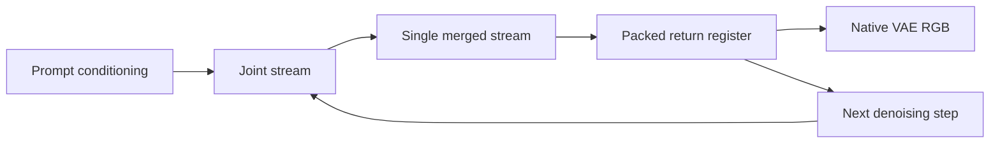

# Tracer Finds a Physical Circuit Signal in FLUX

> [!warning] WIP
> This post reports measured observations and working inferences from a targeted intervention panel. It does not certify a minimal, semantic, or complete FLUX circuit.

## The short version

We took four attention heads that looked interesting in Tracer's static Flux microprofiles and asked a harder question: if we remove each head from the real FLUX.2 Klein denoiser, does the change reach the actual output image?

The answer was yes, in a structured way.

We ran matched head ablations on the real Klein 9B and Klein 9B-KV models. For each model we used two nearly identical prompts, two seeds, four denoising steps, and a 256×256 native VAE decode. Every ablated branch used the same initial noise as its prompt/seed baseline. The final panel contained 20 generations per model: four baselines and sixteen ablations.

Across both models and all four prompt/seed conditions, the same physical ranking appeared:

`D0H29 > D0H27 > S5H26 >> S22H25`

The strongest head, `D0H29`, produced large changes in the packed return register and visible changes in the rendered lantern geometry. `S22H25`, despite appearing in the KV model's static backward shortlist, was nearly image-silent in this task.

This is exactly the kind of result we want from a Rosetta-style discovery tool: a cheap weight/backward screen generated suspects, and a causal output-grounded experiment showed which suspects matter downstream. It is not yet enough to say that `D0H29` is a “lantern head,” a “color head,” or the circuit. The experiment establishes physical sensitivity, not semantic ownership.

The complete receipts are the [Klein 9B panel](../../experiments/20260806-192537-bfl-full-suite-tracer-mapper/results/flux2-klein-9b-head-ablation-panel.json) and [Klein 9B-KV panel](../../experiments/20260806-192537-bfl-full-suite-tracer-mapper/results/flux2-klein-9b-kv-head-ablation-panel.json). The [visual montage](../../experiments/20260806-192537-bfl-full-suite-tracer-mapper/results/flux2-klein-9b-head-ablation-montage.png) makes the most important distinction visible: the largest numeric effects are also structural image changes, not merely imperceptible floating-point drift.

## Why run this experiment?

Tracer began with known circuits. Tracr, TransformerLens toy models, induction heads, and modular-addition models give us Rosetta stones because the intended mechanism is available before we measure it. They let us ask whether a tool can recover a known route without being told where to look.

FLUX is a more difficult organism. It is a diffusion/flow model with a text stream, an image stream, joint and single transformer blocks, a scheduler-updated latent return register, and a VAE consumer. The “circuit” is therefore not necessarily a small chain of language-model heads. It may be a time-expanded hypergraph:



The practical problem is search cost. A full image generation is expensive. Ablating every component under many prompts and seeds is even more expensive. We therefore want a funnel:

1. inspect weights and architecture without a forward pass;
2. run a small backward or activation screen;
3. rank physical addresses;
4. intervene only on the most promising candidates;
5. validate against the real downstream consumer, the decoded image.

The present experiment tests whether that funnel is already useful on a real model.

## How the suspects were chosen

The [Flux microprofile receipts](../../experiments/20260806-192537-bfl-full-suite-tracer-mapper/results/flux2-klein-9b.microprofile.v1.json) and [9B-KV microprofile](../../experiments/20260806-192537-bfl-full-suite-tracer-mapper/results/flux2-klein-9b-kv.microprofile.v1.json) were produced by the Flux-compatible manalysis stack. They expose the physical component address space: eight double/joint blocks, twenty-four single blocks, thirty-two attention heads per block, and MLP boundaries.

The backward probe measured activation-only grad×activation importance against the model's flow-output target. It is not a semantic label. It is a prioritization signal: which physical component carries a large local contribution to the selected target under the probe context?

The leading 9B candidates included:

- `D0H29`: `0.002186`
- `S5H26`: `0.001915`
- `D0H27`: `0.001740`

The 9B-KV shortlist included:

- `D0H29`: `0.000933`
- `S22H25`: `0.000893`
- `D0H27`: `0.000846`

We selected the union-like four-head panel `D0H29`, `D0H27`, `S5H26`, and `S22H25`. This detail matters: the final intervention was targeted, not a blind all-1,056-component sweep. The experiment tests whether the static screen can find real downstream-sensitive heads; it does not estimate the full model's global ranking.

The implementation uses the native [manalysis `FluxBridge`](../../manalysis/src/manalysis/decoder/flux.py), specifically its physical manifest and `hooks_for_disabled` intervention hooks. The reusable [panel script](../../experiments/20260806-192537-bfl-full-suite-tracer-mapper/src/head_ablation_payload/flux_head_ablation_panel.py) runs the stock Diffusers pipeline and records both the packed scheduler return register and the final PIL/RGB image.

## The intervention design

The prompts were deliberately simple:

```text
a small amber paper lantern on a rain-soaked wooden table at night
a small cyan paper lantern on a rain-soaked wooden table at night
```

Only the color word changed. We used seeds `17` and `53`, four denoising steps, 256×256 output, and guidance `1.0` on the standard Klein 9B pipeline. The KV pipeline is a no-CFG call path and therefore omits the standard `guidance_scale` argument; that is an implementation difference recorded in the receipt, not silently treated as identical sampling.

For every prompt and seed:

- run an unmodified baseline;
- disable one physical attention head for all denoising steps;
- run the same prompt with the same seed;
- compare the branch to its own baseline.

The four primary measurements were:

| Measurement | What it tells us |
| --- | --- |
| Final-register relative L2 | How much the packed latent state moved before VAE decoding |
| Per-step mean token L2 | Whether the perturbation propagates or disappears over time |
| Image MAD/RMS | How much the rendered RGB image changed pixelwise |
| RGB cosine and luma MAD | Whether the change is mostly geometric/color structure or a smaller texture perturbation |

The return register is the right place to measure first because it is the model's native iterative state. The image is the right place to validate second because it is the user-visible consumer. A latent-only result can be numerically impressive and visually irrelevant; an image-only result can hide where in the computation the effect entered.

## Results: both models agree on the ordering

### Klein 9B

| Ablated head | Mean image MAD | Mean final-register relative L2 | Mean luma MAD |
| --- | ---: | ---: | ---: |
| `D0H29` | **13.54** | **0.636** | **12.90** |
| `D0H27` | 7.30 | 0.383 | 7.06 |
| `S5H26` | 4.39 | 0.242 | 4.18 |
| `S22H25` | 1.03 | 0.070 | 0.98 |

### Klein 9B-KV

| Ablated head | Mean image MAD | Mean final-register relative L2 | Mean luma MAD |
| --- | ---: | ---: | ---: |
| `D0H29` | **11.61** | **0.495** | **11.31** |
| `D0H27` | 7.39 | 0.327 | 7.10 |
| `S5H26` | 5.27 | 0.244 | 5.04 |
| `S22H25` | 0.78 | 0.039 | 0.75 |

The absolute magnitudes differ between 9B and 9B-KV, so we should not pretend that `13.54` and `11.61` are directly comparable semantic effect sizes. The models have different weights and different pipeline behavior. The robust cross-model result is the ordering: the same addresses occupy the same sensitivity tiers.

The effect was also temporally structured. In 9B, the mean per-token register displacement for `D0H29` reached roughly `5.1–7.9` at the final step from initial values around `0.07–0.12`. `D0H27` reached about `3.5–3.8`, `S5H26` about `1.4–2.8`, and `S22H25` about `0.3–0.8`. The perturbation did not appear as a one-off decode glitch; it accumulated through the denoising recurrence.

## What the images show

The [montage](../../experiments/20260806-192537-bfl-full-suite-tracer-mapper/results/flux2-klein-9b-head-ablation-montage.png) is from the 9B seed-17 visual run. The baselines are recognizable amber and cyan lanterns on the same wet table.

The `D0H29` ablations are the striking cases. The amber branch becomes a folded, peaked lantern-like object. The cyan branch becomes a more cube-like object. That is a change in object geometry and scaffold, not only a small color shift.

`D0H27` produces smaller but still visible shape changes. `S5H26` moves the image modestly, especially in the cyan branch. `S22H25` is visually very close to its baseline, consistent with its low MAD and high RGB cosine.

This gives us an important negative result as well: a component can be prominent in a backward or static shortlist and still have little visible effect under a particular task. That does not make it irrelevant. It means its effect may be prompt-dependent, redundant, consumed by a different output feature, or poorly matched to the chosen probe target.

## What we learned about Tracer

### 1. Static-to-causal handoff works

The strongest result is not that one head changed one image. It is that a weight/activation-level screen proposed a small candidate set, and the same addresses then separated cleanly under causal image-grounded intervention. This is the Rosetta workflow working on a real diffusion model:


The search stack is useful even before it can certify a mechanism.

### 2. The strongest signal looks like a scaffold, not yet a color circuit

The prompt pair changed only amber to cyan, but `D0H29` ablation changed geometry. That makes “`D0H29` is the amber/cyan circuit” a poor current interpretation. A better working hypothesis is that `D0H29` participates in an early or broadly reused image-scaffold route whose disruption changes how the model realizes the object.

The result is a reminder that intervention effect is not the same as feature specificity. A head can be causally important to an image while being unrelated to the particular semantic contrast we intended to study.

### 3. The KV model preserved address-level organization

The KV variant attenuated or reshaped some magnitudes, but the address ordering remained. This is a useful lineage clue: the optimization that produced the KV model did not erase the coarse physical sensitivity structure detected here.

That is a trend, not a claim that the KV optimization preserved the same semantic circuit. The next experiment must compare interventions and task-specific readouts under matched controls.

### 4. Return-register and RGB evidence complement each other

The return-register ladder explains propagation. The montage explains whether propagation reaches meaningful image structure. Tracer should keep both. A single scalar is too easy to misread:

- large register movement with no image effect may be a downstream-cancelled or decoder-insensitive direction;
- small pixel MAD with a semantic flip may be a highly concentrated change;
- large MAD caused by texture or geometry is not automatically a concept-level circuit.

## What this does not prove

We should be precise about the claim boundary.

This experiment does **not** prove that:

- `D0H29` is a semantic lantern, color, or object head;
- the four heads form a complete circuit;
- the four heads are necessary for the task;
- `S22H25` is unimportant in general;
- the 9B and 9B-KV absolute magnitudes are directly comparable;
- head ablation isolates a single computation rather than a distributed residual contribution;
- the image effect is caused by a specific lexical address rather than a broad prompt-conditioned state.

The correct current label is **convergent physical sensitivity under a targeted task panel**.

This distinction is the diffusion analogue of a familiar language-model warning: ablating an induction head and seeing loss does not by itself recover the whole induction circuit. It identifies a causal participant. To name the algorithm, we still need specificity, path, rescue, and composition evidence.

## The next best moves: how to prove something

The next move should not be another visually interesting ablation of the same four heads. We need experiments that distinguish a global scaffold from a semantic circuit.

### 1. Run a null-calibrated all-head screen

Run all 1,024 attention heads in each model across a small held-out prompt bank and multiple seeds, but keep the cheap-to-expensive funnel:

- use the static/backward score to order candidates;
- run one-step or low-resolution ablations for the full head set;
- promote only the top candidates to full native VAE renders;
- include matched random-head and random-direction nulls.

The key output should be a per-head effect distribution, not a raw ranking: image MAD z-score, return-register z-score, and task-specific score change relative to null. This tells us whether `D0H29` is genuinely exceptional or merely one of many globally sensitive heads.

### 2. Add semantic specificity tests

For the lantern pair, score at least four separate properties:

1. object presence and object identity;
2. geometry/shape stability;
3. amber-versus-cyan color classification;
4. scene/background preservation.

A color circuit should reduce the color contrast while preserving object and scene scores. A scaffold head should change geometry broadly. The current montage suggests `D0H29` may be the latter, but that is still a working inference.

Use several attribute pairs beyond color: material, object category, spatial relation, and action. A real circuit should show a repeatable task profile rather than simply a large pixel delta.

### 3. Run restoration and path-patching experiments

Ablation is a knockout. The stronger test is rescue:

- run a clean baseline and save the output of `D0H29` at each denoising step;
- ablate `D0H29` and record the damaged image;
- restore the clean head output at the exact head boundary;
- test whether the image and semantic scores return toward baseline.

Then perform donor patching: inject the head output from the cyan run into the amber run while keeping the amber prompt and noise fixed. If the output selectively transfers cyan while preserving lantern geometry, we have evidence for a color-carrying route. If it transfers geometry or destabilizes the entire image, we have evidence for a scaffold or control route instead.

### 4. Localize intervention time, not only propagation time

The current ablation disables a head at every denoising step. Its per-step ladder shows when the consequence becomes large, but not which intervention time is necessary. Run one-step knockouts at each denoising boundary, followed by clean suffix replay. This produces a temporal impulse response:

```text
head disabled at step 0 → clean suffix → image effect
head disabled at step 1 → clean suffix → image effect
head disabled at step 2 → clean suffix → image effect
head disabled at step 3 → clean suffix → image effect
```

That is the missing edge between a static component ID and a time-expanded diffusion circuit.

### 5. Measure coalitions and redundancy

Test `D0H29`, `D0H27`, `S5H26`, and the pair/triple coalitions. Compare observed joint effect to additive predictions under a proper task metric. The important possibilities are:

- strong overlap: one route may compensate for another;
- superadditivity: a real composition or relay may be present;
- subadditivity: the heads may share a common downstream bottleneck;
- prompt-specific interaction: the route may be conditional rather than fixed.

This is where the hypergraph representation becomes useful: a circuit is not necessarily a path containing one head at a time; it may be a coalition of alternative routes that converge on the same return-register consumer.

### 6. Cross-check 9B against 9B-KV with matched internal patches

The identical ordering is encouraging, but the next comparison should use normalized intervention operators and identical task metrics. Measure whether the same head restoration or donor patch has the same directional effect in both models. If the route survives the KV transformation, that is stronger evidence of address-level architectural conservation. If it changes, the difference may reveal what the KV optimization actually rewired.

### 7. Build the fast search loop around evidence, not brute force

The long-term Tracer loop should combine:

- static weight screening;
- backward candidate proposals;
- group testing over head sets;
- temporal one-step probes;
- return-register propagation;
- image semantic readouts;
- min-cut/max-flow over validated edges only.

Graph algorithms should prioritize experiments, not manufacture causality. A min cut can say which measured edges form a low-capacity separator. It cannot make an unmeasured edge causal. Every promoted hyperedge needs an intervention receipt and a consumer-side effect.

## The broader connection

This experiment connects three strands of interpretability work.

First, it is the diffusion counterpart of TransformerLens-style head ablation and activation patching. The difference is that the consumer is an image and the state recurs through a scheduler rather than advancing one token at a time.

Second, it uses the Rosetta strategy from Tracr and toy transformers: begin with a known or strongly constrained physical vocabulary, search anonymously, and use interventions to convert correlations into candidate mechanisms. The real-model case is harder because the “ground truth” is not given, so the proof ladder must be stricter.

Third, it supports the model-as-software view developed in the [real Klein 4B checkpointing work](../../obsidian/blog/2026-08-05-164341-real-flux2-klein4b-multistream-lowering.md): prompts, streams, transformer sites, return-register writes, VAE reads, and images are typed program boundaries. Once those boundaries are stable, circuit discovery becomes a search over executable state transitions rather than a collection of disconnected saliency maps.

The most promising architectural picture is therefore not “find the magic head.” It is:

```text
candidate physical address
        ↓
typed intervention boundary
        ↓
time-expanded return-register route
        ↓
consumer-specific image effect
        ↓
semantic specificity + rescue + coalition evidence
        ↓
named circuit hypothesis
```

We have reached the first two-and-a-half stages for these four heads. The next milestone is a successful semantic rescue: remove a candidate, selectively restore or transfer its state, and recover the intended attribute without restoring unrelated image structure. That is the experiment most likely to turn this promising sensitivity signal into a real circuit discovery.

## Reproduction artifacts

- [Experiment workspace](../../experiments/20260806-192537-bfl-full-suite-tracer-mapper/)
- [Reusable head-ablation panel](../../experiments/20260806-192537-bfl-full-suite-tracer-mapper/src/head_ablation_payload/flux_head_ablation_panel.py)
- [Klein 9B full receipt](../../experiments/20260806-192537-bfl-full-suite-tracer-mapper/results/flux2-klein-9b-head-ablation-panel.json)
- [Klein 9B-KV full receipt](../../experiments/20260806-192537-bfl-full-suite-tracer-mapper/results/flux2-klein-9b-kv-head-ablation-panel.json)
- [Klein 9B seed-17 montage](../../experiments/20260806-192537-bfl-full-suite-tracer-mapper/results/flux2-klein-9b-head-ablation-montage.png)
- [Flux bridge implementation](../../manalysis/src/manalysis/decoder/flux.py)
- [Tracer's broader Rosetta-to-FLUX synthesis](./2026-08-06-tracer-from-rosetta-to-addressed-flux-circuits.md)

The post remains WIP until the all-head null screen, semantic specificity panel, temporal localization, and restoration experiment are complete.
