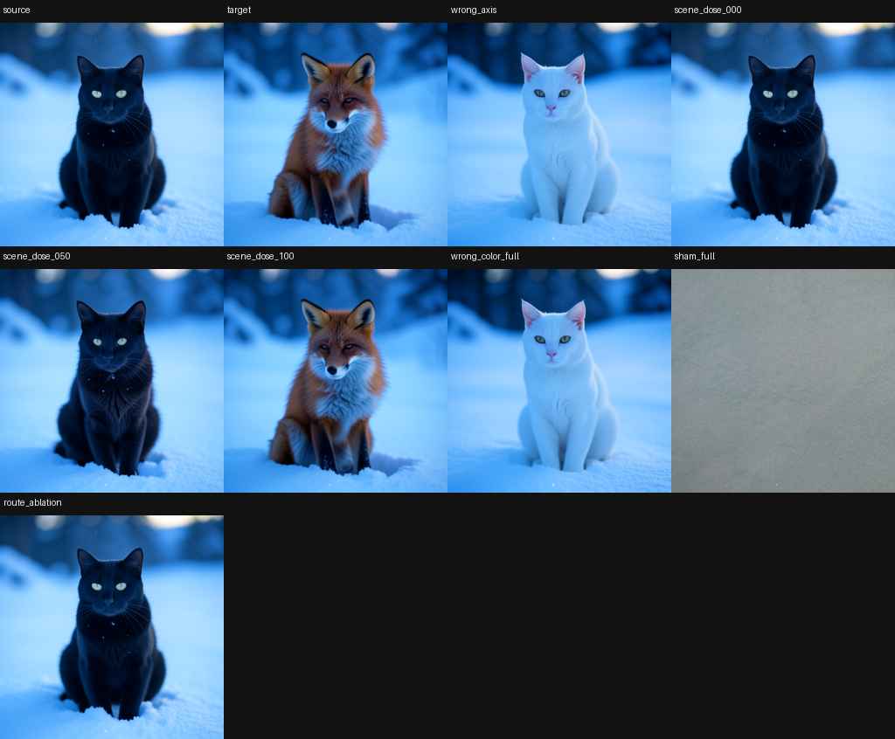
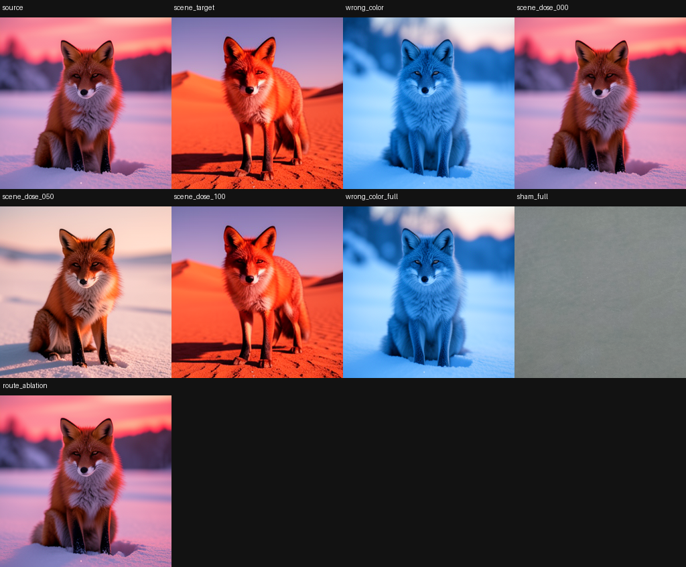

# One route tested against twenty prompt contrasts in a FLUX image

## What we found

In FLUX.2 Klein 4B, a publicly released text-to-image diffusion transformer, one recurring sequence of four transformer blocks carries prompt meaning into the rendered image. We tested that route against twenty single-variable prompt contrasts spanning twelve categories (lighting, identity, weather, appearance, pose, relation, scene, style, material, geometry, action, count) with a nine-test battery frozen before the panel ran. Six contrasts pass all nine tests strictly and eleven more pass every test except the strict pixel-reconstruction thresholds: injecting the route's state closes at least 90% of the pixel distance to the target image on the six strict contrasts, and removing the route leaves at most 9.7% of that distance anywhere in the panel. The route is time-accumulated — a single denoising step's route write is individually dispensable, but writing it at every step is decisive — which is exactly why single-step activation patching reports the circuit as absent. Three further probes (an unprompted structural scan, a standalone compound-scene certificate, and a distributed key/value color-binding panel) converge on the same late route, and even the model's nominally empty conditioning rows turn out to be consumed as positional state.

> This page is the short, visual companion to the paper **[The Circuit That Survived Its Coordinates](../docs/certified-semantic-circuits/paper.md)** (revised 2026-09-22), which holds the full method, the clean-room audit, and every number's provenance. Where this page and the paper differ, the paper is the later word — notably its held-out confirmations on new seeds and prompts (below).

## Why it matters

Activation patching and causal mediation (Meng et al. 2022; Wang et al. 2022; Vig et al. 2020) establish that a component influences a model's state, but rarely that it is necessary, specific, and survives to the model's actual output; Zhang & Nanda (2023) catalogue how patching metrics mislead. Prompt-to-Prompt (Hertz et al. 2022) edits text-to-image models at the cross-attention interface but does not certify an internal route against controls designed to kill the claim. The closest diffusion-circuit program, DifFRACT, traces FLUX.1-schnell with timestep-conditioned sparse transcoders; our battery is complementary — it certifies the model's native computation with no learned surrogate and scores every claim on the decoded image. What is new is the unit of evidence: a bounded causal claim plus the exact battery that would have falsified it, run end-to-end on the rendered pixels.

## Setup

| | |
|---|---|
| Model | FLUX.2 Klein 4B, revision `e7b7dc27…d76a294`; BF16; 256×256; 4 denoising steps; guidance 1.0 |
| Denoiser | width 3,072; five dual-stream (`joint.0`–`joint.4`) then twenty merged single-stream (`single.0`–`single.19`) blocks per step; text positions discarded after the last single block |
| Text encoder | Qwen3-4B, producing a fixed `[512 × 7,680]` conditioning tensor |
| Seeds | panel 4242 / 9001; held-out confirmation 31337 / 60660 and 20260922 |
| Edited | the **route** = the text-stream outputs of `joint.2`, `joint.3`, `joint.4` plus the text-prefix rows of `single.0`, at every denoising step |
| Measured | the decoded RGB image and the latent the scheduler consumes — always both |

**The subtraction.** For a contrast (black cat vs. red fox, identical otherwise) we generate both trajectories, then resume the source run with the route's state moved a dose `d` toward the target's (`d = 1` is a full transplant). Denoiser, scheduler, decoder, and noise are frozen and shared, so the *only* cause of an internal difference is the prompt. **Exact no-op:** resuming with no change reproduces the original pixel-for-pixel (MAD 0.0); every rescue below is read against that.

**Score.** *Progress* `P = 1 − MAD(I, I_target) / (MAD(I_source, I_target) + ε)`: 0 = unmoved source, 1 = target image. A few instruments use a symmetric variant `P±` where an unmoved source scores **−1** (flagged at each use).

**Nine tests, three tiers.** The battery is: cross-seed replication, sufficiency, necessity, wrong-axis specificity, energy-matched sham, dose response, edge mediation (ablate one route edge's upstream site, restore only the downstream site, recover ≥50% of the effect), downstream continuation, and exact-replay integrity. **Strict** = all nine on both seeds; **route-certified** = all causal tests but one or both strict pixel thresholds missed (the route is established; perfect pixel reconstruction is not); **open candidate** = also below the 0.50 mediation bar on some edge. All thresholds were frozen in a config file before the panel ran (the strict pixel thresholds were calibrated during earlier exploration; see Limits).

## Results

### Twenty contrasts ride one route

*One four-block route carries every semantic distinction we tested; failure is graded and lands on reconstruction strength, not route identity.*

| # | Contrast | Category | Tier | Score | Tests | Min. target progress | Max. ablation progress | Min. edge rescue |
|--:|---|---|---|--:|--:|--:|--:|--:|
| 1 | dawn → sunset | lighting | **strict** | .935 | 9/9 | .916 | .017 | .888 |
| 2 | black cat → red fox | identity | **strict** | .920 | 9/9 | .913 | .011 | .811 |
| 3 | clear sky → snowstorm | weather | **strict** | .911 | 9/9 | .901 | .038 | .826 |
| 4 | short fur → long fur | appearance | **strict** | .894 | 9/9 | .903 | .035 | .733 |
| 5 | facing left → facing right | pose | **strict** | .873 | 9/9 | .925 | −.005 | .528 |
| 6 | beside ball → behind ball | relation | **strict** | .866 | 9/9 | .918 | .072 | .603 |
| 7 | solid → tuxedo markings | appearance | route | .877 | 7/9 | .888 | .014 | .819 |
| 8 | snow → beach | scene | route | .869 | 7/9 | .882 | .011 | .792 |
| 9 | photo → oil painting | style | route | .869 | 7/9 | .894 | .002 | .753 |
| 10 | metal robot → wooden robot | material | route | .864 | 7/9 | .896 | .046 | .778 |
| 11 | green eyes → blue eyes | appearance | route | .832 | 7/9 | .838 | .021 | .719 |
| 12 | snow → autumn forest | scene | route | .826 | 7/9 | .839 | .023 | .690 |
| 13 | eyes open → narrowed/closed (ear prompt proxy) | face/pose | route* | .822 | 7/9 | .886 | .028 | .566 |
| 14 | straight → coiled snake | geometry | route | .819 | 7/9 | .851 | .028 | .633 |
| 15 | small → large | appearance | route | .805 | 7/9 | .850 | .094 | .647 |
| 16 | snow → greenhouse | scene | route | .774 | 7/9 | .775 | .007 | .552 |
| 17 | sitting → leaping | action | route | .715 | 7/9 | .634 | .007 | .573 |
| 18 | sitting → lying | pose | open | .753 | 6/9 | .871 | .005 | .394 |
| 19 | one bird → two birds | count | open | .735 | 6/9 | .818 | .023 | .447 |
| 20 | on chair → under table | relation | open | .682 | 6/9 | .751 | .097 | .425 |

The axes that struggle (count, spatial relations, pose transitions) are the compositional ones, and they fail on *reconstruction strength* — their signal still travels the same path, and necessity (ablation leaves ≤ 9.7% progress everywhere) is strong even in the open rows. Row 13's frozen prompt was "upright → folded ears," but pane-level review shows the rendered feature it controls is eyelid state; the ears stay pointed, so it is kept as a route-level measurement, not an ear circuit ([correction](../docs/certified-semantic-circuits/corrections/ears-upright-folded-eye-control.md)). A clean-room auditor (standard library + NumPy + PIL, no pipeline imports) re-derived all twenty tier assignments with zero decision mismatches and caught all five deliberate tamper injections.

**Held out, the route is robust and the pixels are fragile.** Re-running the whole panel on two previously unopened seeds (31337/60660), config byte-identical except the seeds, the causal route replicated essentially completely: the only route-test failure anywhere was one necessity result missing its threshold by 0.0022 (0.1522 vs 0.15, on beside → behind). The strict pixel tier, by contrast, is seed-sensitive — three of six strict contrasts replicated strictly (identity, lighting, orientation) while two previously open rows crossed *up* into certification. A second confirmation on **new prompts written after the route was fixed** met its preregistered bar exactly: **4 of 6** strict axes replicated strictly and **all 6** replicated at the route level ([preregistration](../docs/certified-semantic-circuits/experiments/2026-09-22-prompt-heldout/)). A multi-step mediation probe found the route's edges mediate at 17 of 18 axis×step cells. The honest summary: the transport route survives new seeds and new prompts; the strict image-reconstruction certificate is partly a property of the seed.

### The route is time-accumulated, so single-step patching cannot see it

*Patch the identity route at one denoising step and nothing moves; patch it at every step and the transfer is near-perfect.*

Transplanting the target's `joint.4` state at a single step leaves the output at pixel distance 48.4 from the target (the all-step transplant brings the same distance to 0.47); ablating one site at one step leaves the target image intact. Under the field's default instrument — patch one site at one step — this circuit does not exist. The same transplant applied at every step transfers the identity almost completely (edge rescues .946/.888/.796; donor progress 0.99), and the internal separation between the two trajectories grows monotonically across the four scheduler writes (0.355 → 0.919 → 2.487 → 9.723).

The mechanism is plain and worth stating as a methods caution, not a surprise: FLUX re-reads the *intact prompt conditioning* at every denoising step, so a one-step route write is simply re-derived from that untouched conditioning on the next step. Only an intervention that spans the time axis removes what would otherwise be regenerated. Any iterative architecture that re-reads a fixed input — diffusion models, recurrent models, plausibly chain-of-thought transformers — can hide a circuit from single-step patching this way. A single-step patching null in an iterative setting should be treated as unresolved until an all-step (or all-position) variant has been run.

### The same route, found without any prompt

*A labels-free structural scan rediscovers the route from perturbation propagation alone.*

Perturbing each of 25 block boundaries with a random direction at 5% of the local activation norm under an empty prompt (exact no-ops at 0.0, two seeds) recovers the same late neighborhoods — including three of the four certified route sites and the key `joint.4 → single.0` edge — with no semantic information at all. The strongest promptless route effect reaches RGB MAD 35.89 while norm-matched shams stay at 1.89–3.41. A semantic method and a structural scan find the same skeleton; we do not attach concept names to a direction that merely propagates.

### A standalone certificate for a compound scene change

*The same grammar certifies a four-way compound edit (posture + background + lighting + time) as one route-level scene control.*

A separately run contrast — a fox sitting in snow at dawn → standing in a desert at noon — passed all nine tests as a standalone certificate: minimum scene progress .913, route-ablation progress .023, wrong-color donor −.430, maximum sham .109, weakest edge rescue .771, return progress .982 at alignment .971, with 36/36 branches replaying exactly. A separate collateral check shows subject preservation is incomplete, so this certifies a route-level *scene* effect, not scene/subject disentanglement.

### A second distributed route: color binding in the key/value stream

*Color binding rides a distributed set of twenty attention key/value sites, accumulating over denoising time — but reverse-direction specificity is unresolved.*

Intervening on saved key/value state across a 20-site panel (96 paired color-swap instances, 1,152 rendered endpoints) moves native endpoints toward the intended color world: forward recovery 83/96, reverse 88/96, with color-binding margins +6.740 forward and +8.830 reverse. The full 20-site intervention reproduces the effect while a compact `{8,11}` pair does not, and the all-step graft beats every single-step arm — the same distributed, time-accumulated shape as the text route, on a different variable. (A conditioner audit explains why a Qwen3 assay is the right testbed: Qwen3 keeps a color/non-color norm ratio of 0.936 against T5's 0.10–0.16 and CLIP's 0.269.) The honest limit is adversarial: 45/96 reverse instances suffer donor-color collisions, so the reverse map is a strong assay result but not bilateral semantic specificity.

### Even the "empty" conditioning rows are consumed

*Nominally empty padding in the conditioning tensor is read as positional state, not ignored.*

The Qwen3 conditioning tensor is `[1, 512, 7,680]`, ~28 tokenizer-active rows and ~484 nominally inactive, consumed without an attention mask. Zeroing just 18 active-adjacent rows (3.5% of occupancy) shifts final RGB MAD by 41.9 and 53.2 across two seeds — rivaling whole-prompt swaps (43.5 and 31.7). Position beats occupancy: zeroing 18 active rows costs 42.7/55.5, but zeroing 205 active rows only 16.4/22.1. Content matters too — empty→empty padding costs 12.5–20.2, empty→unrelated 68.6/76.5 — and 80–89% of the damage enters at step 0. So the "empty" rows are a consumed positional scaffold, matching the paper's §7 finding that the 484 positions beyond the tokenizer are contextualized query states, not inert padding.

## Controls

- **Exact no-op** (MAD 0.0): any downstream change is caused by the intervention, not the replay machinery.
- **Wrong-axis donor** (a white-cat donor while testing identity): rules out that any coherent edit reaches the target; this, not the sham, is the informative specificity control.
- **Energy-matched sham** (random vector at the donor's norm): destroys the image, so it rules out only that a perturbation of that size reaches the target.
- **Dose curve** (0 → 1): rules out a step-function artifact; also shows half-doses can land off-manifold.
- **Single-step vs. all-step**: separates a timing artifact from genuine time-accumulation.
- **Compact `{8,11}` vs. all-site (K/V)**: rules out a hidden two-block "magic subset."
- **Matched-position / substitution (scaffold)**: separate row position and content from raw occupancy.
- **Promptless shams and no-ops**: a route candidate must beat norm-matched shams and exact zeros.

## Limits and open questions

| Limitation | Status |
|---|---|
| Minimality / uniqueness | Not claimed; residual signal through untested paths is not excluded. |
| Strict pixel tier | Thresholds were calibrated during exploration; held-out seeds and prompts show the strict tier is partly seed- and prompt-dependent (prompt-held-out verdict sits *exactly* at its bar), while the route itself replicates. A torch-version change between the original and held-out GPU runs was not isolated by a matched-environment baseline. |
| Compositional axes | Count, spatial relations, pose transitions do not pass strict gates; reported as trend. |
| Replay-exactness gate | Metadata-declared per branch (checkpoint tensors are not retained), so it is attested by the worker that produced the numbers; the clean-room audit verifies everything derivable from retained artifacts but cannot re-execute a replay. |
| Scene certificate | Submission record declared 17 branches/seed where 18 ran (the extra being the route ablation) — retained as a documentation defect; subject collateral is not controlled. |
| K/V color route | 45/96 reverse-direction donor-color collisions leave bilateral specificity open; forward direction is the clean result. |
| Empty-context scaffold | Zeroing corrupts the fixed-length context; it does not show that physically removing rows behaves the same, and does not extrapolate to masked transformers. |
| Endogenous use | Evidence is interventional; whether the untouched model's natural computation decomposes along these seams is a separate question. |
| Transfer | No claim beyond this model, revision, resolution, schedule, or the tested contrasts; preliminary FLUX.1 probes show a weaker analogous route (rescues .37/.33/.26), reported as an open question. |
| Not a product | None of this is a validated editing or quality recipe. |

## Reproduce and inspect

- Paper, audit, provenance: [`docs/certified-semantic-circuits/paper.md`](../docs/certified-semantic-circuits/paper.md); held-out prereg [`experiments/2026-09-22-prompt-heldout/`](../docs/certified-semantic-circuits/experiments/2026-09-22-prompt-heldout/); CPU verifier [`verifier/`](../docs/certified-semantic-circuits/verifier/).
- Twenty-axis panel + promptless control: [`artifacts/twenty-axis-semantic-route-circuit/`](../artifacts/twenty-axis-semantic-route-circuit/). Scene certificate: [`artifacts/scene-circuit-certificate/`](../artifacts/scene-circuit-certificate/).
- Color-binding K/V panel: [`artifacts/distributed-kv-causal-route/`](../artifacts/distributed-kv-causal-route/). Empty-context scaffold: [`artifacts/empty-context-positional-scaffold/`](../artifacts/empty-context-positional-scaffold/). Each bundle has a `verify.py`.

Additional internal run logs are available on request.
