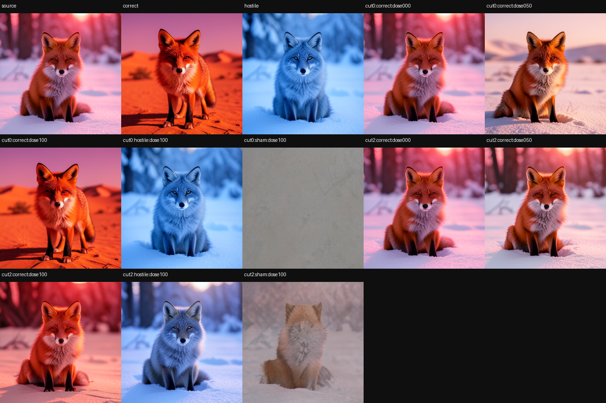
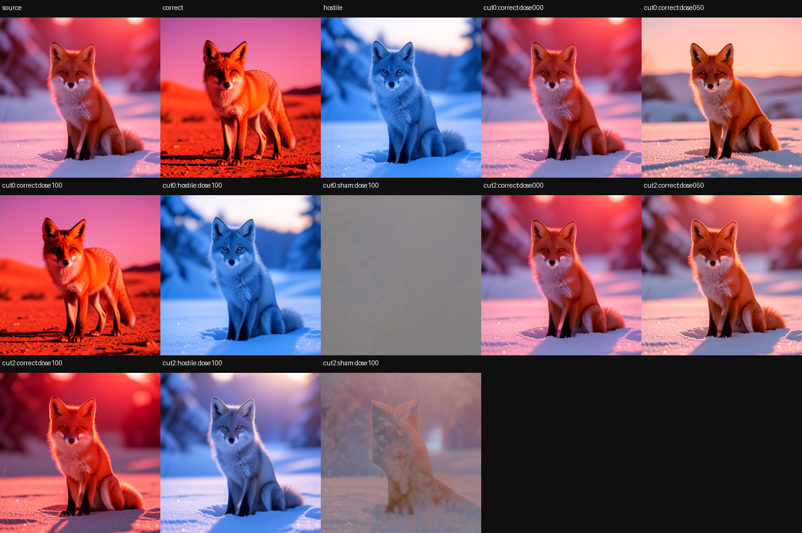
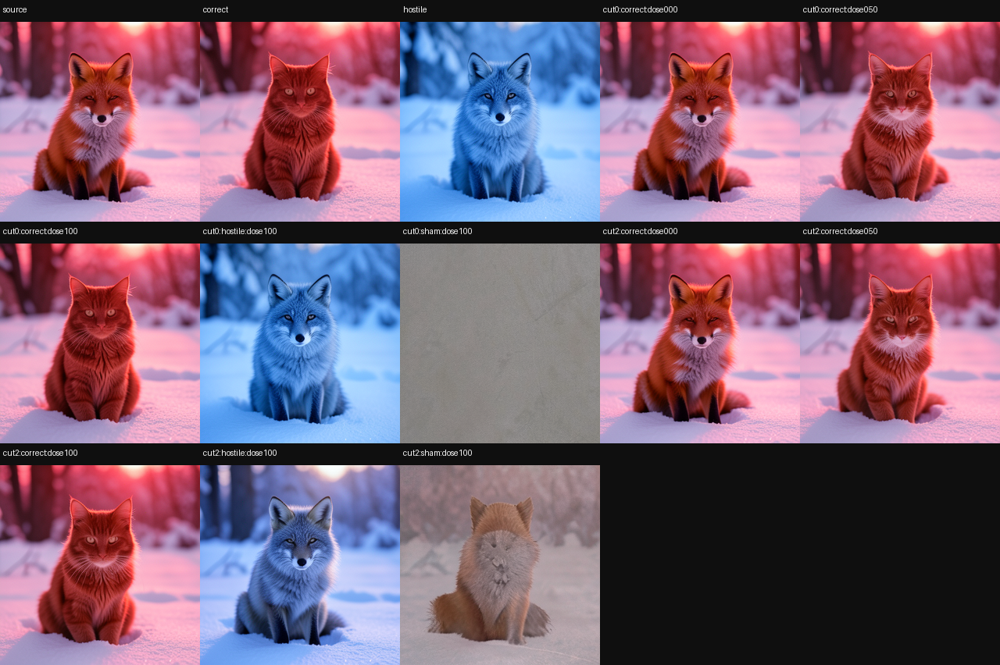

# Counterfactual Diffusion Futures: Selective Editing of Saved FLUX.2 Trajectories

> [!summary]
> A four-step FLUX.2 Klein generation can be paused, forked, edited, and resumed through the unchanged image generator. Across two semantic axes and two seeds per axis, early donor edits move toward the intended scene or subject with progress 0.904–0.971. A hostile donor moves toward its own color target instead, while a same-norm sham stays non-targeted. Applying the same edit halfway through the trajectory is much weaker (0.095–0.358). Exact scalar replay restores the parent image and final latent after every branch. The result is a replicated causal editing trend, not a universal learned editing package or a universal timing law.

## Research question

Diffusion generation is usually treated as one indivisible call: prompt in, image out. This
experiment asks whether a real generation can instead be treated as a saved future that supports controlled counterfactuals:

1. capture an intermediate state of a native generation;
2. compute a donor-specific state difference from another native generation;
3. inject that difference at the saved state;
4. run the original denoising, scheduler, and VAE continuation unchanged;
5. compare the resulting image with the source, intended donor, hostile donor, and sham controls.

The scientific question is not whether any perturbation changes pixels. The decisive question is
whether a content-specific donor moves the future toward its own image, at the right time, while an incompatible donor moves toward a different target and a norm-matched random perturbation does not.

## Specimen and prompt panel

The model is FLUX.2 Klein 4B at revision `e7b7dc27f91deacad38e78976d1f2b499d76a294`, 256×256, four denoising steps, guidance 1.0, and native text conditioning. Each specimen uses the same initial latent for its source, correct donor, and hostile donor.

The source prompt is:

> a photorealistic red fox sitting in fresh snow at dawn, soft red light

The scene donor is:

> a photorealistic red fox standing in a sunlit desert at noon, warm red light

The subject donor is:

> a photorealistic red cat sitting in fresh snow at dawn, soft red light

The hostile donor is:

> a photorealistic blue fox sitting in fresh snow at dawn, soft blue light

The four cells are scene transfer at seeds 9001 and 1337, and subject transfer at seeds 4242 and 9001. The two checkpoint cuts are cut 0, before denoising, and cut 2, halfway through the
four-step trajectory. The dose values are 0, 0.5, and 1.0 for the replicated panel.

## Formal intervention

Let `R_s^t` be the typed route state at site `s` and denoising step `t`. Let `R_source^t` and
`R_donor^t` be the states from the source and correct-donor native runs. The donor factor is:

```text
Δ_donor(s,t) = R_donor(s,t) − R_source(s,t)
R_branch(s,t) = R_source(s,t) + dose × Δ_donor(s,t)
```

The branch then executes the native suffix from the saved source checkpoint. The experiment never uses a learned denoiser or a proxy renderer for the final judgment.

Three controls are required:

- **Hostile donor:** use the same route operation with the blue-fox donor. It tests whether the
  route selects donor content rather than merely amplifying any large change.
- **Norm-matched sham:** replace the donor difference with a random direction with equal norm. It
  controls perturbation energy but not membership in the model's plausible state manifold.
- **Late cut:** apply the correct donor after two of four steps. It tests whether the remaining
  denoising future still has enough authority to express the edit.

Progress is a normalized image-distance score: 0 means source-like, 1 means donor-like, and
negative values mean movement away from the intended donor. For the hostile arm, both progress toward the declared target and progress toward the hostile donor are reported.

## Results

The four-specimen scalar-confirmed panel is:

| Specimen | Early correct progress | Hostile target / hostile own progress | Sham target progress | Late correct progress |
|---|---:|---:|---:|---:|
| Scene, seed 9001 | 0.916 | −0.531 / 0.953 | 0.031 | 0.165 |
| Scene, seed 1337 | 0.907 | −0.508 / 0.950 | 0.029 | 0.095 |
| Subject, seed 4242 | 0.971 | −0.404 / 0.926 | −0.315 | 0.099 |
| Subject, seed 9001 | 0.904 | −2.810 / 0.953 | −2.176 | 0.358 |

All four specimens pass the declared panel gates. The experiment performs 40 logical batched
suffix evaluations in eight physical batched calls, then confirms 20 endpoints with exact scalar
suffixes. One model load is used. The total replication run is 47.45 seconds, with 8,232.6 MB peak VRAM and 18,854.9 MB peak RSS.








## What the controls establish

### Selective content transfer

The hostile donor produces negative progress toward the declared scene/subject target but 0.926–0.953 progress toward its own blue-fox target. This is the strongest causal control in the panel. The branch is not simply “more changed”; it is following the content represented by the donor trajectory.

### Time dependence

The correct donor at cut 0 reaches 0.904–0.971 progress. The same full-dose operation at cut 2
reaches only 0.095–0.358 in every specimen. Early state has more remaining denoising authority over the final image. This is a trend for the declared four-step model and panel, not a universal rule that all edits should happen at the earliest possible step.

### Nonlinear dose

The larger single-specimen dose screen behind the replication found early scene progress of
approximately −0.001, −0.015, 0.060, 0.485, and 0.942 as dose increased. The response turns on late rather than growing smoothly. In the replicated panel, half-dose subject edits can be useful while half-dose scene edits are nearly inert. Dose is therefore semantic- and axis-dependent.

### Exact rollback

For every specimen, the source checkpoint is resumed unchanged before and after intervention. The report marks the parent image bytes and final native latent bytes exact after the branch panel. Rejected futures remain available for comparison, while the source future is recoverable without numeric drift.

## Product and research value

This protocol supports product surfaces that are difficult with ordinary full rerendering:

- preview a scene or subject edit from an already-computed generation;
- show several counterfactual branches from one saved parent;
- defer an edit until its predicted causal window;
- discard a branch and return to the exact source future;
- use hostile and sham branches as regression tests for edit specificity.

For research, it provides a native-consumer test for whether an internal donor difference has causal authority. A high hidden-state similarity would not be enough; the branch must survive the real denoiser, scheduler, and VAE and be judged in final pixels.

## Working inference and claim boundary

**Observation:** content-bound internal differences can steer a frozen FLUX.2 generation toward a
matching scene or subject donor when applied at an early checkpoint.

**Convergent trend:** the effect replicates over two axes and two seeds per axis, hostile donors
select their own content, late installation is weaker, and the parent is exactly recoverable.

**Working inference:** a diffusion trajectory contains time-local windows in which a typed
state-space difference has strong downstream image authority.

**Terminal status:** replicated native-consumer trend. This is not a prompt-independent learned
edit package, not a universal semantic editor, and not a general timing law. The donor factor is
constructed from a paired native trajectory, so portability to unseen prompts, models, or object
families remains open.

The practical value is a controlled future surface: a captured parent can produce early and late
counterfactuals, a hostile donor can test factor specificity, and shams plus exact rollback keep
the comparison honest while the unchanged denoiser, scheduler, and VAE consume every branch. The
timing and donor-specificity findings belong to the declared Klein 4B trajectory; they are not a
claim that the same state difference or address transfers unchanged to another family member or a
newer checkpoint.

The norm-matched sham controls perturbation magnitude but not plausible-manifold membership. Its destructive images should not be interpreted as evidence that arbitrary same-norm edits are unsafe in every regime; they only delimit this experiment's control.

## Local proof bundle

The local bundle contains the four visual panels and the raw receipts:

- [replication report](../artifacts/counterfactual-diffusion-futures/replication-report.json)
- [replication receipt](../artifacts/counterfactual-diffusion-futures/replication-receipt.json)
- [capability vector](../artifacts/counterfactual-diffusion-futures/capability-vector.json)
- [receipt verifier](../artifacts/counterfactual-diffusion-futures/verify.py)

Run `python ../artifacts/counterfactual-diffusion-futures/verify.py` from this directory to check all four specimens, the early/late effect separation, hostile-donor specificity, and exact rollback.
