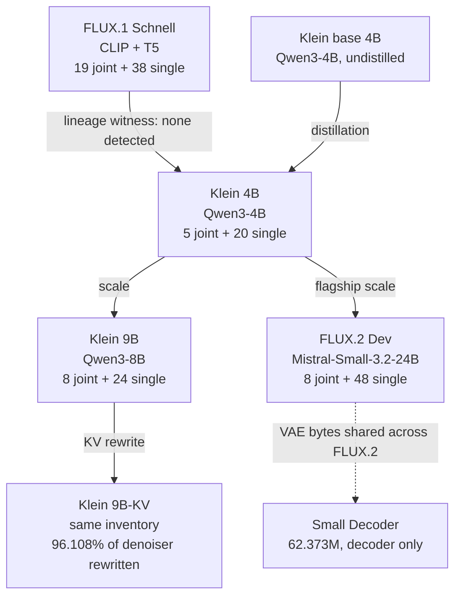

# What seven pinned FLUX checkpoints share and don't

## What we found

We mirrored seven pinned Black Forest Labs checkpoints — 2,883 objects, 17.442 GB, exact hashes — and asked, mechanically, what they share. The conditioners turn out to be stock language models: FLUX.2 Dev's matches the eigenbasis of Mistral-Small-3.2-24B at ≈0.9999997, Klein 9B's matches Qwen3-8B at ≈0.9999992, and Klein 4B uses Qwen3-4B. Every transformer tensor in all six DiT-bearing checkpoints maps into one shared structural vocabulary, and the FLUX.2 denoisers are roughly two-thirds MLP by weight budget. The sharpest single result is that Klein 9B and 9B-KV carry an identical 883-tensor, 17,353,362,980-parameter inventory yet differ on 96.108% of denoiser BF16 values — and the head-sensitivity ordering survives that rewrite intact. Behaviorally the family is not one "understanding" score: exact counting falls from 1.000 at two objects to 0.0625 at seven.

*Figure 1. Measured relationships in the pinned cohort. Solid arrows are established mechanically (exact trajectory match for distillation; scale and the KV rewrite from inventory and weight deltas). The Schnell→Klein arrow is a null: one lineage witness detected no distinctive inherited subspace. The four FLUX.2 VAEs are byte-identical; Schnell's codec shares none of their tensors.*

## Why this matters

Model-family labels ("distilled from", "KV variant of") are usually informal. We test them mechanically with tensor inventories, byte identity, centered kernel alignment (CKA; Kornblith et al. 2019), principal angles, and exact trajectory replay, keeping geometric evidence separate from semantic claims. The closest interpretability analogues — activation patching and head ablation (Wang et al. 2022, IOI) — here run on diffusion-transformer image models and across a whole pinned family rather than one network, which is unusual. The payoff is a concrete search order for circuit work plus a clean line between what is shared (provenance, trajectory contracts, VAE bytes, a head-sensitivity ordering) and what is rewritten (denoiser weights).

## Setup

| subject | revision | conditioner | denoiser program |
| --- | --- | --- | --- |
| FLUX.1 Schnell | `741f7c3c…` | CLIP + T5 | 19 joint + 38 single, width 3,072 |
| Klein base 4B | `a3b4f484…` | Qwen3-4B | 5 joint + 20 single, width 3,072 |
| Klein 4B | `e7b7dc27…` | Qwen3-4B | 5 joint + 20 single, width 3,072 |
| Klein 9B | `92196c8e…` | Qwen3-8B | 8 joint + 24 single, width 4,096 |
| Klein 9B-KV | `a6dfb36e…` | Qwen3-8B | 8 joint + 24 single, width 4,096 |
| FLUX.2 Dev | `26afe3a7…` | Mistral-Small-3.2-24B | 8 joint + 48 single, width 6,144 |
| Small Decoder | `a3efc24f…` | none | decoder boundary only |

Here `joint.i` is the i-th dual-stream (joint) block in a checkpoint's own denoiser and `single.i` is the i-th later merged single-stream block. The same ordinal is a different relative depth in different checkpoints — Schnell has 19 joint blocks, Klein 4B has 5 — so a block index is a local coordinate, not a global address. Every comparison below is bound to the pinned hashes in the local bundles.

## One shared structural vocabulary

A static classifier mapped every tensor in all six DiT-bearing checkpoints (100% mapped) into one coarse vocabulary. Across FLUX.2 the budgets barely move: operation/MLP is 65.75% (4B), 66.53% (9B), and 67.48% (Dev); four interface roles (address, selector, payload, and carrier — the hidden state that carries a block's output to the next) each take about 7.3–7.5%; time-conditioning is 4.40 / 3.34 / 2.24%; literal content is 0.62 / 0.56 / 0.30%. This tells you where to look first — interfaces and early nonlinear operations — not that any tensor has a proven function. The first joint-block MLP is a recurring candidate: a bounded lesion to it changed the output in Klein 4B, 9B, and Dev. That is a search anchor, not a shared concept circuit, because the probe was not a common semantic panel.

## The conditioners are stock checkpoints

The Dev conditioner matches the eigenbasis of Mistral-Small-3.2-24B at ≈0.9999997; the Klein 9B conditioner matches Qwen3-8B at ≈0.9999992; Klein 4B uses Qwen3-4B. These support stock-checkpoint provenance for the conditioner representations. They do not show that the surrounding image model is a stock assembly, nor how the conditioner is transformed downstream.

## Klein 9B → 9B-KV: identical inventory, rewritten weights

The 9B and 9B-KV pair is shape-for-shape identical — 883 tensors, 17,353,362,980 parameters — yet 96.10811065795288% of denoiser BF16 values differ (8,725,252,912 of 9,078,581,248 elements). Q/K deltas dominate the V/output deltas. Activation CKA stays high — 0.9382467 under a linear kernel, 0.9447244 under RBF — so the internal geometry is broadly re-aligned, not locally patched. All text-encoder and VAE shards are byte-identical between the two; only the denoiser changed. The KV variant caches a reference image's K/V once (up to 512 MiB) and reuses it, giving about 1.073× in one 512²/four-step probe — a serving consequence of the rewrite, not evidence the two are interchangeable.

## Head sensitivity survives the rewrite

Ablating one attention head at a time and measuring mean image MAD from the unablated native output, the sensitivity ordering is the same in both variants despite the rewrite:

| head | Klein 9B mean MAD | Klein 9B-KV mean MAD | reading |
| --- | ---: | ---: | --- |
| D0H29 | 13.54 | 11.61 | strongest tested sensitivity |
| D0H27 | below D0H29 | below D0H29 | second in the ordering |
| S5H26 | below D0H27 | below D0H27 | weaker but visible |
| S22H25 | 1.03 | 0.78 | near-silent in this panel |

The absolute MAD shifts down in the KV variant for the strongest and near-silent heads, so the stable object is the ordering — the sensitivity topology — not the exact numbers. Runtime-addressed sensitivity can be more stable than raw weight identity: a finetune can rewrite most values while preserving which heads most influence the final image.

## Base, distilled, and FLUX.1 lineage

Base and distilled Klein 4B share an identical 818-tensor, 7,982,059,044-parameter inventory with adapter gates present at 22/22 locations. Their trajectories match exactly at 31/31 and 658/658 checkpoints once the distilled sigma map `{0,1,3}` is aligned to base steps `{0,10,34}` — an exact tested trajectory-compatibility relation under that mapping. The FLUX.1→FLUX.2 lineage witness (1,425 matched cells) gives a median principal-angle residual-facing alignment of 0.0205 against an analytic null of 0.0208: no distinctive inherited subspace detected. That is a null from one witness, not affirmative evidence of fresh initialization.

## VAE statics

The four FLUX.2 VAEs are byte-identical across all six pairwise comparisons (251/251 tensors matching); Schnell's 244-tensor codec matches none of them. This cleanly separates a shared FLUX.2 decoder boundary from the FLUX.1 artifact. It does not establish that image outputs stay identical after arbitrary surrounding-model or preprocessing changes.

## Behavior is not one "understanding"

A behavior taxonomy keeps four capabilities apart rather than averaging them into a single score.

- **Counting.** Exact-count accuracy for 2 through 7 target objects is 1.000, 0.875, 0.875, 0.4375, 0.1875, and 0.0625 — a clear cliff after four. Object detection itself has a measurement floor, so this is a dose-of-count trend, not a hard capacity boundary.
- **Typography.** A real spelling-transition substrate: plain/specific admission 0.9375 / 0.906 and 39/48 confirmation-family passes over 256 minimal pairs, with headroom on long text, unusual fonts, and dense layouts.
- **Lexical gating.** Word presence is strongly word-specific — "open" renders at ≈0.94–1.0 while "exit" renders at ≈0.00–0.06 under the tested prompts.
- **Semantic substitution.** Asymmetric by pair and family: open↔closed succeeds 0.8125, while push↔pull reaches only 0.125.
- **A demoted causal site.** An early hypothesis called a `joint.4` call-2 site a "counting circuit." Strict wording passes 5/16 and paraphrase 0/16, though a wrong-site rescue rate of 0.609 shows the site is causally live. The right label is "a live site, not the counting bottleneck."

## Controls

- Exact hashes bind every comparison to specific bytes.
- Identical inventory and the weight-delta fraction together rule out both the "same model" and "complete rewrite" illusions.
- Using the same four head addresses with matched prompt pair and two seeds controls the ablation coordinate system; reporting near-silent S22H25 alongside D0H29 prevents cherry-picking dramatic heads.
- Minimal pairs, Wilson intervals, and discovery/confirmation separation keep the behavior numbers honest; scoring from rendered evidence stops prompt-token presence from counting as success.
- CKA and principal angles are geometric instruments: they show alignment or its absence, not a named human-interpretable feature.

## Limits and open questions

- Provenance, inventories, byte identity, parameter counts, and exact trajectories are the terminal-grade parts. Semantic inheritance, a full genealogy, and a causal explanation of behavior are not established; the P1–P4 distillation questions stay open.
- The structural vocabulary is a search prior, not a universal circuit. Block ordinals are local, so a Klein 4B circuit cannot be copied into 9B, Dev, or FLUX.1 by name without fresh recipient-local validation.
- Head sensitivity is four heads, one prompt pair, two seeds, scored by image MAD — a sensitivity ordering, not semantic head ownership or a general ranking. Only D0H29 and S22H25 have absolute numbers; the middle two are ordered qualitatively. It is not evidence of invariance under a different finetune.
- The FLUX.1 lineage null is bounded by its chosen representation and null model; failure to detect an inherited subspace in one witness is not evidence that none exists.
- Behavior numbers are panel-bounded (counting limited by detection, typography by OCR and layout, substitution by prompt construction). No claim of general counting or typography competence, or of human-like symbolic reasoning.
- The 9B-KV cache probe speedup and the base/distilled trajectory match are serving and structural facts, not semantic interchangeability.

## Reproduce and inspect

- Model-family forensic wiki, the seven-artifact report, the conditioner-provenance record, and the verifier: [`../artifacts/model-family-forensics/`](../artifacts/model-family-forensics/README.md).
- Head-ablation record, both variant records, and verifier: [`../artifacts/9b-kv-head-sensitivity/`](../artifacts/9b-kv-head-sensitivity/README.md).
- Count and typography certificates, confirmation report, status notes, and verifier: [`../artifacts/behavior-taxonomy/`](../artifacts/behavior-taxonomy/README.md).
- Cohort revisions, `joint.*` conventions, and portability boundaries: [`../README.md`](../README.md).

The multi-model structural-tracer synthesis and model ledger are internal; the key figures (role budgets, the `mapped_frac = 1.0` classification, and the first-joint lesion) are reported above, and the full notes are available on request.
