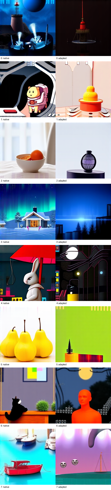

# FLUX.1 Conditioner Causal Controls: Consumer Sensitivity Without Semantic Interchange

> [!summary]
> A SmolLM adapter was evaluated against a frozen FLUX.1 dual conditioner using a corrected held-out causal-control panel. The adapted conditioner changes the consumer in a source-specific way, but held-out image and separation metrics remain far from native equivalence. The clean result rejects semantic interchangeability while preserving evidence that the downstream consumer is sensitive to the adapter.

## Research question

Can a foreign SmolLM conditioner replace the native FLUX.1 dual conditioner while preserving image semantics? FLUX.1 consumes two streams: token-level T5 states and a pooled CLIP state. The adapter is trained to emit that native-shaped pair while the image-producing suffix remains fixed.

The key control problem is generic image movement. An adapted output that differs from the native target is not automatically a semantic failure, and a wrong-source output that differs is not automatically proof of source-specific transfer. The corrected panel therefore includes native target, adapted, zero, wrong-source, native-wrong-source, separate native no-op, held-out compositional pairs, pinned attention settings, and an explicit 32-call execution accounting.

## Specimen and split

The native dual conditioner supplies T5 token states and pooled CLIP states. A 14,378,496-parameter SmolLM adapter targets the same tensor contract. The adapter is fit on its declared training set, then evaluated on two reversed held-out semantic pairs at seeds `4242` and `9001`: lighthouse from corgi, corgi from lighthouse, oranges from cabin, and cabin from oranges.

The downstream FLUX.1 scheduler, denoiser, and decoder are fixed. The held-out control panel is source-specific: each adapted output is compared both with the native target for its requested semantic state and with the native rendering of the wrong source. A zero branch tests the native baseline, a wrong-source branch tests whether the adapter follows donor content, and a separate native no-op checks replay integrity.

## How the experiment works

The adapter maps SmolLM hidden states into the native T5-plus-CLIP conditioner shape. The native consumer renders the adapted tensor without changing its suffix. For every held-out pair, the worker runs the native target, adapted target, zero, wrong-source, and native-wrong-source branches under one resident execution contract. The result is stored with its worker timing, model identity, configuration hash, image artifacts, and receipt.

The image metric is RGB mean absolute difference (MAD). Lower MAD to the native target means closer visual behavior, but the source-specific comparison is needed to distinguish semantic movement from global brightness or texture changes. The experiment deliberately reports hidden-state fit and final-image behavior separately.

## Results

The adapter reached training token cosine `0.944` and pooled cosine `0.9998`. On held-out controls, mean MAD from the native target was:

| branch | mean MAD from native target |
|---|---:|
| adapted | `65.80` |
| zero | `95.27` |
| wrong-source | `114.71` |

The wrong-source output was closer to the native wrong-prompt reference, with MAD `65.57`, than to the native requested target. The separate native no-op was exact with maximum MAD `0`. The causal-control contact sheet shows that adapted and wrong-source branches change scene and semantic content rather than only applying a uniform pixel offset.

The held-out semantic gap remains. Earlier alignment and comparison metrics include held-out token cosine `0.561`, image cosine `0.709`, and red/blue separation preservation `0.511`. Increasing training coverage improved in-distribution fit but did not close the held-out frozen-consumer gap.

## Interpretation

The observation is consumer sensitivity without semantic interchange. The adapter can produce a native-shaped conditioner that changes final images and responds differently to wrong-source inputs. However, the held-out semantic metrics and source-specific comparisons do not support replacing the native dual conditioner as a semantic frontend.

The working inference is that conditioner-coordinate alignment is not the same as downstream semantic alignment. A successful bridge must train through the native consumer with compositional held-outs and independent source-specific controls; more hidden-state cosine alone is unlikely to solve the gap.

## Claim boundary

Established: the corrected control panel is execution-clean, native no-op exact, source-sensitive, and negative for held-out semantic interchangeability.

Not established: that the adapter is useless for all tasks, that no consumer-closed repair can work, or that the failure is unique to FLUX.1. The conclusion is bounded to this adapter, split, checkpoint, and evaluator.

## Local proof bundle

- [Bundle README](../artifacts/flux1-conditioner-causal-controls/README.md)
- [Canonical result](../artifacts/flux1-conditioner-causal-controls/result.json)
- [Execution receipt](../artifacts/flux1-conditioner-causal-controls/run-receipt.json)
- [Artifact manifest](../artifacts/flux1-conditioner-causal-controls/artifact-manifest.json)
- [Artifact verifier](../artifacts/flux1-conditioner-causal-controls/verify.py)

