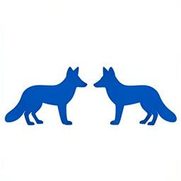
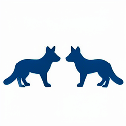
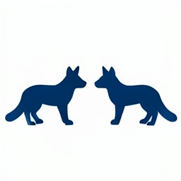

# Four-Frontend Semantic ABI: Independent Conditioners at a Frozen Klein Consumer

> [!summary]
> Qwen, SmolLM, and Mamba conditioners were tested against one frozen FLUX.2 Klein consumer through 72 route × timestep × stream coordinates. The consumer accepted typed tensors and exact replay, but compact token/channel intersections failed; full native-site donor packages were much stronger. This supports a distributed, family-specific carrier boundary rather than a shared semantic tensor ABI.

## Research question

Can multiple language-model frontends independently target the same FLUX.2 Klein image consumer, or do they only appear compatible when a complete native donor tensor is copied? The experiment separates shape compatibility from semantic interchangeability. A shape-compatible conditioner is not considered successful unless its downstream image behavior survives held-out semantic changes and its causal controls distinguish the intended donor from zeros, wrong sites, and norm-matched shams.

## Specimen and contract

The frozen consumer is FLUX.2 Klein 4B with its native denoising schedule and image decoder. The frontends are native Qwen, SmolLM, and Mamba conditioners. The held-out semantic pair requests two blue foxes and a scene change. Source token IDs are not treated as shared coordinates because the frontends have different vocabularies and hidden-state geometries.

The panel records text and image streams separately across four route boundaries and four denoising steps, producing 72 planned causal coordinates under the declared shape contract. The route payload is a complete tensor slice at a chosen boundary, not a scalar feature. Every replay uses exact scalar execution, native no-op branches, full-site donors, compact semantic-token/channel intersections, packed-return intersections, wrong-step controls, same-value shams, and checkpoint rollback.

## How the experiment works

First, the worker captures the same semantic pair under each frontend while retaining typed axis metadata: family, route, step, stream, token axis, channel axis, and packed image-return axis. It then constructs interventions of increasing locality. A full-site donor copies the entire native Qwen state at a selected boundary. Compact candidates copy only the token/channel intersection suggested by cross-family alignment. A norm-matched sham preserves intervention energy but randomizes its direction.

The native Klein suffix consumes each branch and renders an image. The evaluator measures pixel progress toward the native Qwen target, return alignment, and exact no-op behavior. This makes a strong distinction: high conditioner cosine with low final-image progress is evidence of coordinate alignment without consumer closure.

## Results

All 72 planned coordinates were observed with the expected shapes, one resident consumer load, exact checkpoint no-ops, and exact rollback. The compact semantic-token/channel intersections rescued almost nothing. The full-site donor was also weak in this fresh held-out specimen: normalized rescue was about `0.010` for Mamba and `0.122` for SmolLM.

The selected late site applied across all denoising steps was much stronger, reaching approximately `0.821` rescue for Mamba and `0.935` for SmolLM. Those numbers describe a native Qwen donor package delivered through a cross-family route; they do not show that Mamba or SmolLM can produce the package themselves. The same-vendor downstream consumer is therefore compatible with typed transport, while the actual carrier values remain family-specific.

| branch family | observed result | meaning |
|---|---|---|
| full native-site donor | Mamba `0.010`, SmolLM `0.122` on the fresh full-site comparison | weak donor rescue in the fresh specimen |
| selected-site, all-step donor | Mamba `0.821`, SmolLM `0.935` | strong native package transport |
| compact token/channel intersection | near-zero rescue | payload is not a tiny lexical slot |
| same-value or norm-matched sham | separated from selected donor | effect is not explained by norm alone |
| checkpoint no-op | exact | branch and suffix mechanics are intact |

## Interpretation

The observation is a real downstream boundary: independently produced conditioners can be represented and injected at the same typed route, and a full native package can rescue a foreign branch. The convergent trend is that the semantic payload is distributed across route state, timestep, stream, and family-specific coordinates. Compact token or channel masks do not preserve enough of the computation.

The working inference is that the frontends share a consumer-facing interface but not a shared latent codebook. A learned cross-family compiler must be trained against the final image consumer, not only against hidden-state cosine or a hand-selected coordinate intersection.

## Claim boundary

Established: shape-aware cross-family capture, exact rollback, and native consumer closure are operationally measurable; a complete native donor can be effective; and compact token/channel intersections are inadequate in this held-out specimen.

Not established: a universal semantic ABI, donor-free foreign frontend compilation, interchangeability of Qwen/SmolLM/Mamba values, or semantic meaning for any single token, channel, route, or step.

## Local proof bundle

- [Bundle README](../artifacts/four-frontend-semantic-abi/README.md)
- [Raw cross-family report](../artifacts/four-frontend-semantic-abi/report.json)
- [Execution receipt](../artifacts/four-frontend-semantic-abi/run-receipt.json)
- [Detailed analysis](../artifacts/four-frontend-semantic-abi/analysis.md)
- [Artifact verifier](../artifacts/four-frontend-semantic-abi/verify.py)

