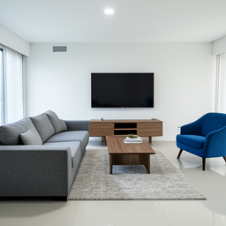
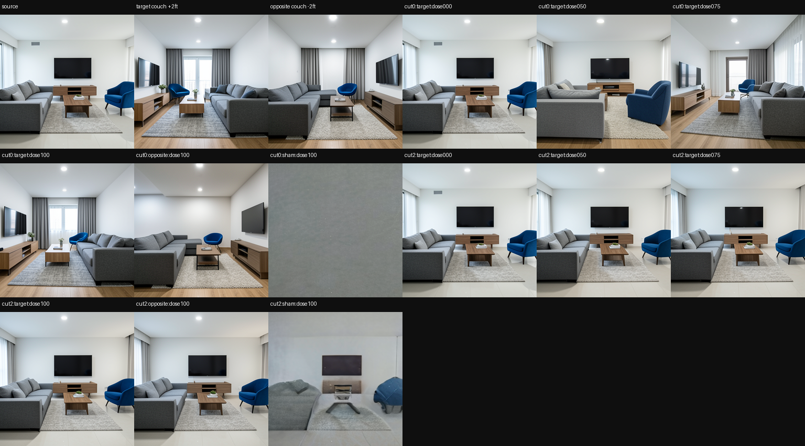
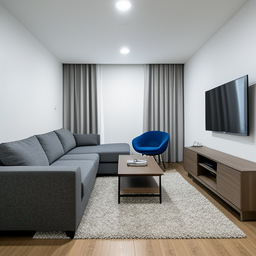

# Living-Room Hotpatch: Move the Couch Through a Native Trajectory

> [!summary]
> Four prompt-paired living-room specimens passed a native-consumer route-state certificate for moving a couch to the right, moving it left under the opposite donor, separating a norm-matched sham, and rewinding the parent exactly. The result is a prompt-level spatial trend with strong timing dependence, not a calibrated two-foot editor.

## Research question

Can a source trajectory containing a couch be hotpatched so the couch moves right while the rest of the living-room scene remains sufficiently stable? The experiment measures direction at the native final register, couch-region progress, opposite-direction behavior, dose response, sham response, scalar/batched agreement, and exact rollback.

The phrase “two feet” is a semantic instruction in the prompt, not a physical unit. The evaluator therefore reports movement direction and couch-region progress rather than claiming a metric distance in the rendered image.

## Specimen and controls

The fixed daylight scene contains a couch, blue accent chair, wall-mounted television, low wooden console, coffee table, and rug. Four seeds are used: `4242`, `9001`, `1337`, and `7217`. Each seed produces a source, a rightward target donor, and an opposite leftward donor from the same initial latent.

Route state is captured at `joint.2 → joint.3 → joint.4 → single.0` and replayed from an early cut and a halfway cut. The controls are target dose, opposite dose, norm-matched sham, zero dose, scalar confirmation, and exact parent replay. Whole-image MAD and chair/TV ROIs are retained as secondary instruments because they can penalize a valid couch move when unrelated room pixels differ.

## How the experiment works

The worker runs the source and donor trajectories to the hotpatch cut, computes the target and opposite route deltas, and applies them to the same source checkpoint. The native schedule and decoder then finish the branch. A dose sweep scales the route delta; a sham preserves its norm but randomizes its direction; the opposite donor tests sign and direction; and the unmodified source is replayed after branch discard.

The final certificate promotes native final-register direction/alignment and target couch ROI progress. This is an instrument correction grounded in a deterministic repeat, not a hidden relaxation: the earlier whole-image gate rejected one branch even though native direction and couch-region evidence agreed.

## Results

| instrument | result across four specimens |
|---|---:|
| target native return progress | `0.943–0.975` |
| target native return alignment | `0.943–0.980` |
| target couch ROI progress | `0.766–0.871` |
| opposite native return progress | `0.877–0.995` |
| opposite native return alignment | `0.893–0.993` |
| opposite-branch target whole-image progress | `0.038–0.325` |
| norm-matched sham target progress | at most `0.176` |
| exact parent replay | `4/4` |

The run used one model load, 48 logical batched suffixes in 8 physical calls, and 20 exact scalar suffixes. The halfway cut was weak, with target whole-image progress only `-0.014–0.043`; the early cut produced the strong directional result. This is direct evidence that the authority window is temporal rather than a static route property.

## Interpretation

The observation is a native-consumer spatial edit with a clear early-cut advantage and a directional opposite control. The working inference is that route-state deltas can influence scene geometry before the later suffix commits, while late patches no longer have enough authority to produce the same change.

The result does not show object/scene disentanglement. Chair and television collateral remain secondary instruments, and the prompt-level distance has no calibrated image-space meaning. The valuable next experiment is a collateral-aware couch evaluator across novel room geometries and seeds.

## Claim boundary

Established: four fixed-seed specimens pass the declared target, opposite, sham, dose, scalar-confirmation, and rollback controls for a prompt-level rightward couch edit in one fixed consumer.

Not established: a calibrated two-foot displacement, prompt-independent spatial semantics, donor-free inference, clean preservation of every other object, or portability across schedules, resolutions, or model revisions.

## Local proof bundle

- [Bundle README](../artifacts/living-room-hotpatch/README.md)
- [Final report](../artifacts/living-room-hotpatch/report.json)
- [Certificate](../artifacts/living-room-hotpatch/certificate.json)
- [Execution receipt](../artifacts/living-room-hotpatch/run-receipt.json)
- [Artifact verifier](../artifacts/living-room-hotpatch/verify.py)

