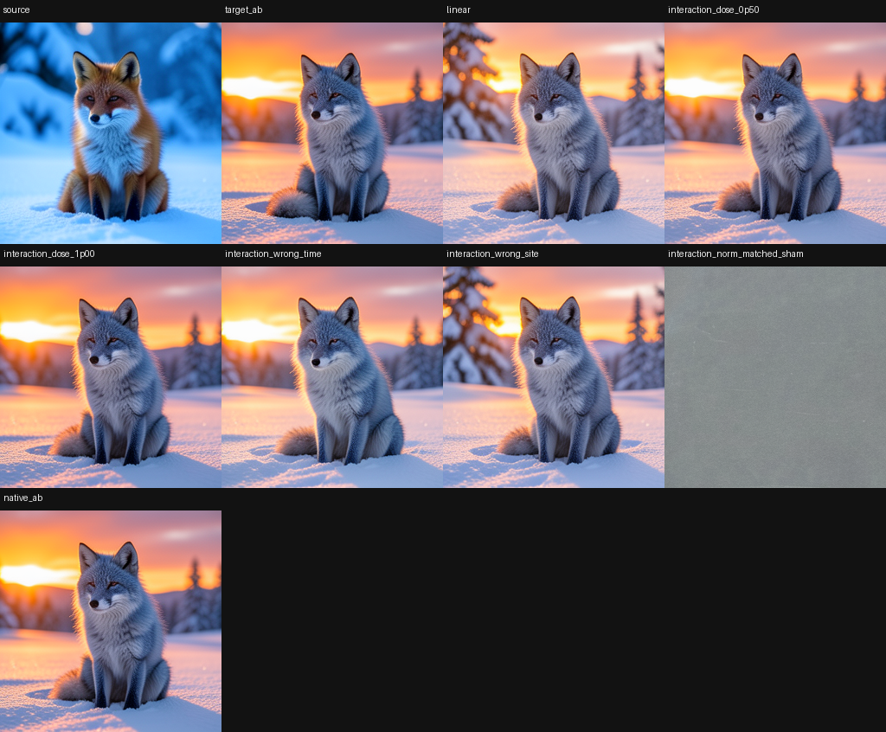

# Nonlinear Interaction Compiler: Native Composition Beats the First Learned Mixer

> [!summary]
> The native pair interaction residual is causally real and dose-sensitive, but a 32-parameter learned mixer trained on two semantic pairs failed to beat simple additive composition on two held-out pairs. The result keeps nonlinear composition as a valuable target while rejecting the first learned composer as a general solution.

## Research question

For two edits A and B, additive composition predicts the pair by adding individual deltas: `ΔA + ΔB`. The native pair may contain an interaction residual `I_AB = ΔAB − ΔA − ΔB`. The experiment asks two separate questions: does the residual affect the final image through a native route, and can a small learned compiler predict that residual for pair-disjoint held-out edits without receiving the native pair as an oracle?

The separation matters because a native residual can be real even when a learned model cannot infer it. A positive causal residual is not evidence that the residual is easy to synthesize.

## Specimen and splits

The learned mixer used two discovery pairs, lighting × identity and weather × fur, and two pair-disjoint held-out pairs, lighting × fur and orientation × relation, across two seeds. The mixer exposed 32 coefficients built from normalized products, signed products, and related pair features. It was compared with additive delta composition and the native AB target.

The companion native residual panel used a lighting × color pair at seeds `52013` and `52019`. It included native AB, linear addition, interaction doses `0.25`, `0.50`, `0.75`, `1.00`, and `1.25`, wrong-site, wrong-time, sign-flip, norm-matched sham, and interaction-only branches. Exact scalar replay verified the algebraic reconstruction.

## How the experiment works

For the native panel, the worker computes each individual edit and the native pair from the same source checkpoint. It forms the residual tensor by subtracting the two individual deltas from the native pair delta. It then injects scaled residuals at the selected route and measures image progress and return progress against the native pair.

For the compiler, the mixer sees only discovery pair features and proposes coefficient updates. Each proposal is evaluated through the native consumer; accepted proposals are promoted and rejected proposals are rolled back. Held-out pair labels remain sealed until the compiler is fixed, so the test measures interpolation across pair structure rather than memorization of the native AB tensor.

## Results

The learned mixer made 32 proposals, promoted 9, rejected 23, and preserved exact rollback for rejected proposals. On the held-out pairs, it lost to the additive baseline:

| method | mean progress to native AB | mean return progress | mean return alignment |
|---|---:|---:|---:|
| additive delta sum | `0.735` | `0.860` | `0.881` |
| learned nonlinear mixer | `0.716` | `0.840` | `0.864` |
| native AB reference | `1.000` | `1.000` | `1.000` |

The native residual itself was strongly dose-sensitive. For the lighting × color panel, additive linear composition reached about `0.596` mean progress, while interaction dose `1.00` reached about `0.894`; interaction-only without the linear terms reached `-0.030`, showing that the residual is not a complete replacement for the individual edits. The residual dose `1.00` reached about `0.931` mean return progress, while wrong-site, wrong-time, sign, and norm-matched controls remained lower.

## Interpretation

The observation is that the native downstream computation contains a nonlinear pair term with a reproducible route and dose window. The negative result is that the first learned mixer did not recover that term on pair-disjoint held-out edits and was worse than addition.

The simplest working inference is that interaction structure is conditional on route, denoising time, and edit identity, so a global low-parameter algebra is under-specified. The next compiler should receive typed edit identities and phase-conditioned features, and it should be evaluated against a held-out native consumer with collateral metrics.

## Claim boundary

Established: native pair composition is not adequately described by vector addition in the tested panel; the interaction residual is causal and dose-sensitive; and the first learned mixer fails the held-out comparison.

Not established: a universal interaction algebra, semantic ownership of the residual, or that learned nonlinear composition is impossible. The negative result only rejects this feature set, split, and 32-parameter compiler.

## Local proof bundle

- [Bundle README](../artifacts/nonlinear-interaction-compiler/README.md)
- [Learned mixer report](../artifacts/nonlinear-interaction-compiler/mixer-report.json)
- [Native residual report](../artifacts/nonlinear-interaction-compiler/interaction-report.json)
- [Mixer receipt](../artifacts/nonlinear-interaction-compiler/mixer-receipt.json)
- [Native residual receipt](../artifacts/nonlinear-interaction-compiler/interaction-receipt.json)
- [Artifact verifier](../artifacts/nonlinear-interaction-compiler/verify.py)
