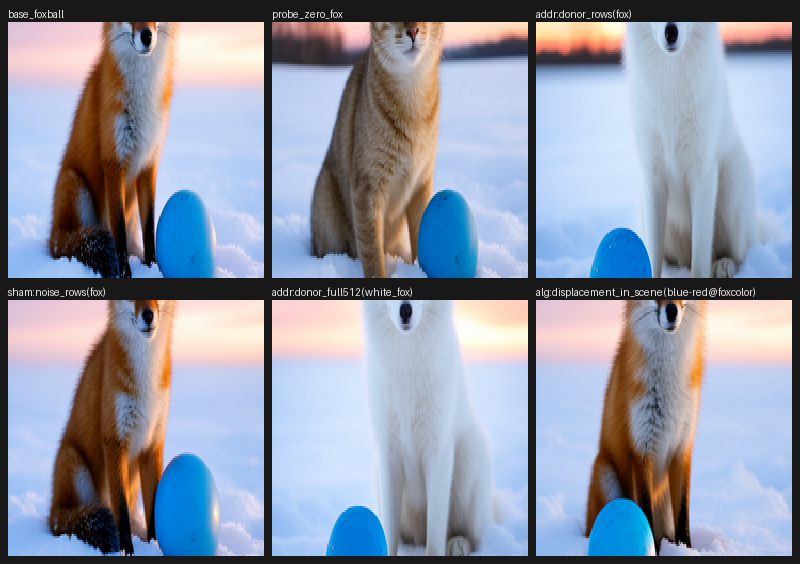
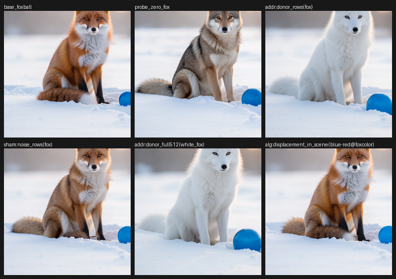
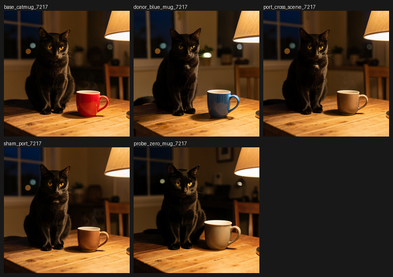
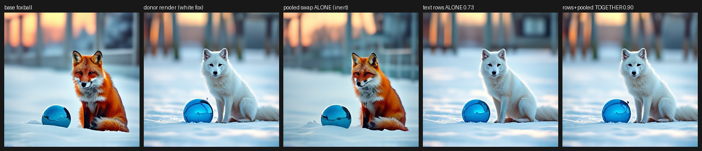
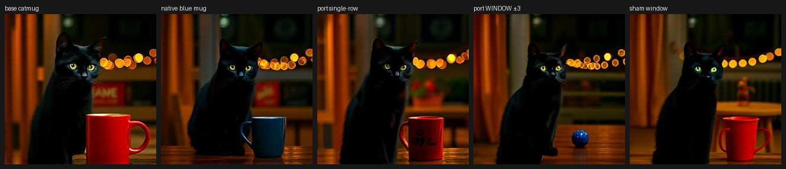
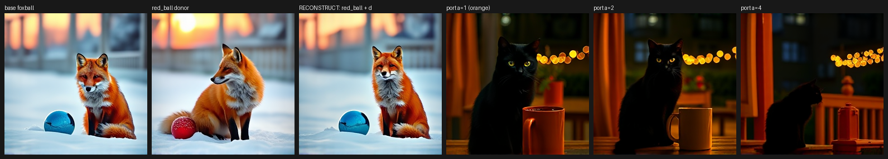
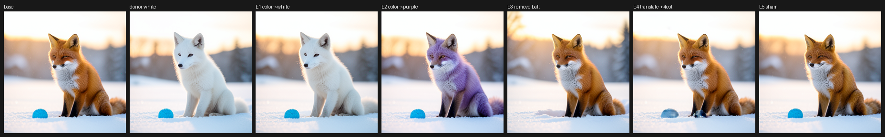
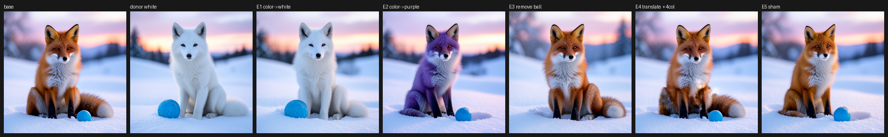
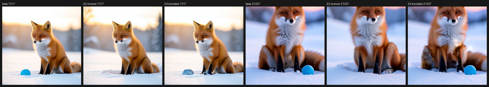

# The object interface ports across FLUX models, at a grain set by the text encoder

*Part 2 of two. Part 1: [editing one object by writing the rows that carry it](objects-as-editable-values.md).*

## What we found

The prompt-row object interface from Part 1 is not specific to one checkpoint: it replicates on undistilled FLUX.2 base-4B (white-fox write 0.888 at seed 7217) and on FLUX.2 9B (0.743, versus a norm-matched sham of 0.043 — more than 15x), and the cross-scene blue-mug displacement ports on both. What changes across the family is the *grain* of the address, and it is set by the text encoder, not the image model. In FLUX.2's causal Qwen conditioner one or two rows carry the object. In FLUX.1 Schnell's bidirectional T5 conditioner a single row is inert (progress -0.05 / 0.03) and the object only moves when you write the whole noun-phrase window (0.56 / 0.63). The same two conditioners also change value algebra: a Qwen row displacement ports a blue mug exactly, while a T5 window displacement carries the whole noun phrase and rotates with sentence context, landing orange rather than blue cross-scene. The object is real in every model; it is a typed address/payload/consumer contract that must be re-localized per recipient, not one portable tensor.

## Why it matters / what is new

Activation patching and causal tracing (Meng et al. 2022 ROME; Wang et al. 2022 IOI) are usually run inside one model. The question here is what survives when the same localized interface is carried across checkpoints, a width change (4B to 9B), a distillation boundary, an operating point (4 distilled steps vs 50-step real CFG), and a text-encoder family change (Qwen to T5). The *grammar* ports — address, payload, route, pooled modulation and position are separable planes in every model — but the address grain and basis are recipient-local, so a layer number, tensor basis, or saved record cannot be copied between models. This matches the coarse address/selector/payload/carrier vocabulary the in-repo [multi-model structural tracer](flux-family-anatomy.md) found across BFL models without claiming aligned bases. A **register** here is a saved slice of hidden state we can read and write, and every edit is judged on the decoded RGB image through the real denoiser, scheduler and VAE against exact-replay and sham controls.

## Cohort

| arm | model | operating point | question |
|---|---|---|---|
| anchor | FLUX.2-klein-4B distilled | 4 steps, guidance 1 | Part 1 interface and value algebra |
| A | FLUX.2-klein-base-4B undistilled | 50 steps, real CFG 4 | family replication at native CFG |
| B | FLUX.2-klein-9B distilled | 4 steps, guidance 1, offload | width replication, cross-scene port |
| C | FLUX.1-schnell, T5 + pooled CLIP | 4 steps, guidance 0 | cross-family address grain and route |
| D | FLUX.1 value algebra | suffix replay | window displacement, pair mining, rotation |
| E | klein-4B cross-conditioner | in-job warm start | whether the *wrong* object is in the same register |
| F | klein-4B struct write | exact single-branch replays | whether a record can drive writes and round-trip |

Every imaging arm ran on one lease with no retries; exact no-op and determinism gates are 0.0 under the scalar contract. The **route** is the text-stream output of blocks `joint.2`, `joint.3`, `joint.4` and `single.0` (dual-stream then merged single-stream blocks) at every step; visual panes are primary when a region scalar is diluted by background or donor-pose mismatch.

## 1. FLUX.2: the same object grammar across checkpoints

The checkpoints differ in distillation, width, block count, conditioner width, steps, guidance, and memory strategy, yet the object tests line up.

| test | klein-4B anchor | base-4B undistilled, 50-step CFG | klein-9B, 4-step |
|---|---|---|---|
| subject rows -> white fox | 0.92–0.94 | both seeds; 0.888 @ 7217 | 0.743; sham 0.043 |
| attribute rows -> green ball | yes | 0.784 / 0.836 | 0.713; fox collateral 0.074 |
| norm-matched sham | inert | inert, <=0.13 | inert, <=0.05 |
| zero subject rows | generic-animal backfill | generic tan animal | whitened/genericized fox |
| `row(blue) - row(red)` -> mug | blue mug | blue mug in pane | blue mug; 0.471 vs sham 0.076 |
| scale one color row x2 | no-op | MAD 0.75 / 0.94 | MAD 0.55 |
| same displacement at fox color row | fox stays red | fox stays red | fox stays red |

The shams and the species-prior control (the fox resists the same displacement at its own color row) separate a semantic write from a norm effect. Route concentration shifts with operating point — base-4B at 50 steps and 9B are both route-redundant across joint bands, with `single.0` weaker on 9B — but the lexical address stays sharp. The 9B first pass at 256² made small crops look blurry; repeating at 512² reproduced the write and the mug port with exact gates, so the register is carried in the text stream, not the latent grid. The 9B arm is one seed — a replication trend, not a broad gate.

## 2. FLUX.1: the object survives, but the address becomes a window

FLUX.1 Schnell uses a bidirectional T5 conditioner plus pooled CLIP rather than FLUX.2's causal Qwen conditioner. The locality ladder (hero figure) makes the change legible:

| donor patch | seed 7217 / 31337 | result |
|---|---:|---|
| single subject row (`fox`) | -0.05 / 0.03 | red fox unchanged, sham-level |
| noun-phrase window +/-3 | 0.56 / 0.63 | clean white fox, ball untouched |
| all active rows | 0.66 / 0.61 | white fox |
| padding rows only | 0.10 / 0.03 | red fox unchanged |
| full 512 rows | 0.71 / 0.78 | white animal, composition shifts |

T5's bidirectional attention smears lexical content across the noun phrase and masks padding, so the minimal causal address is a local window. The route debug fixes the other half: `joint.2 -> joint.3 -> joint.4 -> single.0` carries 0.6915 progress, 98% of the all-joint 0.7069 ceiling (all 57 text sites reach only 0.7292; single blocks alone are near-inert). The remaining lift comes from the pooled-CLIP modulation (adaLN) state: pooled alone is inert, but rows plus pooled reach 0.895 / 0.876. T5 rows carry object identity; pooled modulation carries pose and global composition when the row content matches.

## 3. The wrong object is in the same kind of register

A cross-conditioner compiler that fits a small text encoder's output into the Qwen input space produces a clean scene with the *wrong* object — a gray wolf in grass where the native target is a red fox in snow. The object interface diagnoses it: copying only the foreign subject's two rows into the native Qwen register writes a wolf into the native snow scene (fox-region 0.48–0.59 toward the foreign render); copying native fox rows into the foreign register turns the wolf into a red fox while its grass scene stays foreign; repairing all active rows returns both fox and snow (0.82 / 0.89 vs a 0.003–0.007 sham). Subject identity and scene context factor along the same axes, and the native model is the authority — a linear template-residual dictionary scores every animal at or below the unrelated-pair floor while the model decodes the rows as wolf. A prompt-disjoint training closure is not a shortcut: training loss falls 81% but the held-out corgi MAD is 87.6044, essentially the 87.63 of a closure that saw the corgi prompt. A register can exist natively even when a cross-conditioner compiler cannot generalize it.

## 4. Value algebra: the carrier changes the grammar

On FLUX.2, `value[row("blue" ball)] - value[row("red" fox)]` added to a second scene's mug row yields a blue mug, sham inert (Part 1). FLUX.1 needs a window-sized version, and it exposes the cost: a +/-3 displacement mined in the foxball prompt is real and sham-controlled (mug region 0.438 vs 0.164), but it turns the red mug into a blue *ball*, because the "blue" window also contains the "ball" rows. Pair mining fixes the identity drag — a donor differing only in `blue ball -> red ball` cancels the neighboring noun, and the cross-scene mug stays a mug — but the color lands orange, not blue. Separating dose from rotation: in the native red-ball context the pair direction reconstructs the blue ball essentially exactly (0.633); in the foreign mug context alpha=1 is orange, alpha=2 turns the mug white, alpha=4 degrades the scene, and blueness never increases. The working account is context rotation in bidirectional T5 coordinates: value algebra is real on both families, but exact cross-scene attribute portability is conditioner-dependent.

## 5. The record writes back

A generic executor reads the parent record (`ckpt-f3aa206b11363598cb7565d2a3af14fb`), applies a diff with no hand-written row lists in the arm code, replays the native suffix, and republishes the edited record (`ckpt-c1d07348cadc709c23a7567f326935e8`) with an identical object-record fingerprint; the roughly 18 exact-contract replays took 34.5 seconds.

| record diff | seed 7217 / 31337 |
|---|---|
| `fox.color: red -> white` | white fox; fox-region 0.838 / 0.745; ball untouched |
| `fox.color: red -> purple` | fully purple fox both seeds; one region scalar lied at -0.106 |
| `remove ball` | ball deleted; snow continues; ball-region MAD 76.1 / 134.3 |
| norm-matched `sham_property` | inert; fox stays red |
| `translate ball blocks +4 columns` | negative; ball stays or ghosts in place |

The coordinate negative is informative: the executor moved image-stream content between packed latent slots at four route sites, yet the ball did not relocate (on seed 31337 all eight target blocks were valid). Position looks pinned by latent-id/RoPE geometry and un-patched downstream blocks — content-slot relocation is not the position-write primitive. Removal, by contrast, works from the text side.

## Controls

- **Exact no-op / determinism gates = 0.0** on every imaging arm — rules out numerical drift.
- **Norm-matched shams** inert across checkpoints (<=0.13 base-4B, <=0.05 9B, 0.003–0.007 xcond repair) — rules out norm/magnitude effects.
- **Species-prior control**: the fox resists the mug displacement at its own color row — rules out a global color transform.
- **Native consumer as authority**: a linear dictionary cannot identify the foreign subject, but the model decodes the rows as wolf — rules out reading the register by carrier-space cosine.
- **Prompt-disjoint closure** (corgi MAD 87.60 ~ 87.63) — rules out a general cross-conditioner compiler behind the per-prompt repair.

## Limits and open questions

- Anchor and most arms use two seeds; the 9B arm is one seed, and no arm establishes arbitrary-prompt or arbitrary-resolution generalization.
- Single-row addressing is not universal: on the T5 (non-Qwen) conditioner the minimal address is a noun-phrase window, not a row.
- Exact cross-scene attribute algebra does not hold on T5 — coordinates rotate with sentence context (lands orange, not blue).
- There is no writable position field here: image-token slot relocation leaves the ball in place or ghosted; a latent-id remapping or another position carrier remains open.
- Struct property donors are synthesized from the requested diff, so those edits are still donor-backed, not donor-free.
- General prompt-disjoint cross-conditioner compilation fails; the closure is a per-prompt repair capacity.
- Ordinal route names are topology-local, not aligned layers across models; a saved record, layer number, or tensor basis must not be copied between recipients.
- This is a convergent portability trend, not a universal object-algebra certificate or proof of a shared basis across FLUX families.

## Reproduce and inspect

The compact bundle is [semantic-object-registers](../artifacts/semantic-object-registers/README.md): copied run receipts (one per arm, by job id), the corrected proof strips, and a receipt-level verifier. Run `python ../artifacts/semantic-object-registers/verify.py` from `research/bfl/demos/`. Additional internal run logs and the full per-branch reports are available on request.

Related: [Part 1: editing one object by writing the rows that carry it](objects-as-editable-values.md) and the [multi-model structural tracer](flux-family-anatomy.md).
