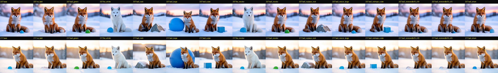
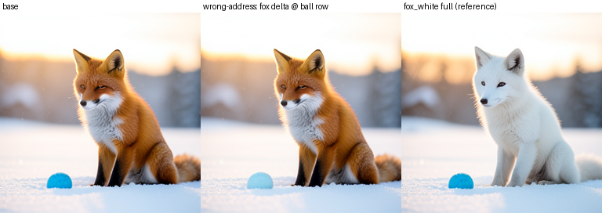
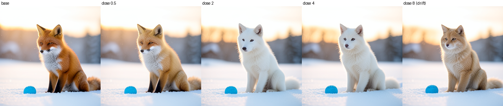
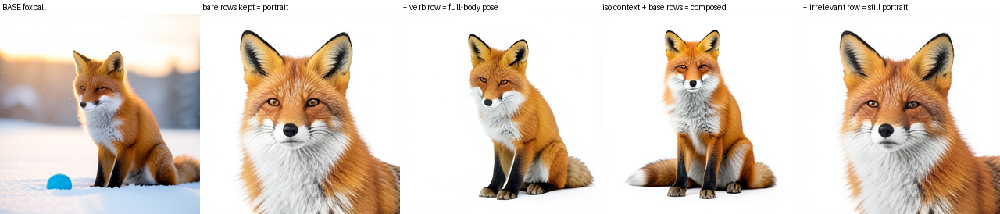
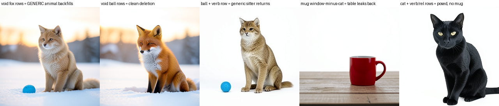
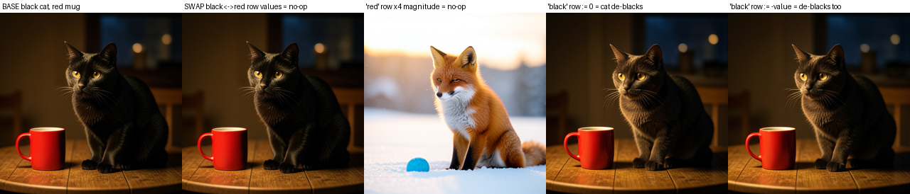

# Editing one object in FLUX.2 by writing the prompt rows that carry it

*Part 1 of two. Part 2: [the same interface across FLUX models](objects-across-flux-models.md).*

## What we found

A single object in a FLUX.2 image is carried by a handful of prompt-token rows in the text stream, and we can edit the object by overwriting only those rows and letting the unmodified model finish the picture. Writing the two "red fox" rows toward a "white fox" donor turns the fox white at progress **0.92 and 0.94** on two seeds while leaving the companion ball almost untouched (**13.7x and 9.6x** selectivity); the exact no-op replay is RGB MAD 0.0, so the change is real and not numerical drift. The sharpest result is value-level: we read the "blue ball" and "red fox" row values, subtract them, add the difference to a *second* scene's "mug" row, and get a blue mug on both seeds — with no blue-mug prompt anywhere — moving the mug region 59.8 and 65.0 MAD while the cat region moves 1.9 and 3.6. The addresses can be saved as a typed, fingerprinted record attached to a checkpoint and read back exactly (11/11 record tests), so the edit survives across processes. The edits are selective enough that a payload written at the *wrong* address edits the wrong object, which is the control that makes "object address" mean something.


## Why it matters / what is new

Prompt-to-Prompt (Hertz et al. 2022) edits a single generation at prompt-token granularity via cross-attention maps, and activation patching / causal tracing (Meng et al. 2022 ROME; Wang et al. 2022 IOI) copies hidden states between runs to locate a causal effect. This builds on both and adds three things: the located rows are packaged as a *saved, typed record* (rows, route, spatial blocks, and the measurements that justify them) attached to a durable checkpoint and recovered by fingerprint, so an address found in one process is reusable in another; the record is validated by *wrong-address* writes, which separate "where" (address) from "what" (payload); and the same addresses drive *isolation and deletion*, not only recolors. We honor the patching-pitfalls caution (Zhang & Nanda 2023): every edit is judged on the decoded RGB image through the real denoiser, scheduler and VAE against sham, wrong-address and exact-replay controls, not by hidden-state similarity.

## Setup

| field | value |
|---|---|
| model | FLUX.2 Klein 4B (distilled), revision `e7b7dc27f91deacad38e78976d1f2b499d76a294` |
| text conditioner | Qwen3-4B, 36 layers |
| resolution / steps / guidance | 256x256 / 4 denoising steps / guidance 1.0 |
| seeds | 7217 and 31337 |
| base scene | "a photorealistic red fox sitting beside a small blue ball in fresh snow at dawn, soft light" |
| held-out scenes | black cat + red mug; parrot + bicycle |
| what we edit | text-stream rows at the route `joint.2 -> joint.3 -> joint.4 -> single.0`, all 4 steps |
| what we measure | progress, selectivity, locality ratio, dose, isolation retention |

The **route** is the text-stream output of blocks `joint.2`, `joint.3`, `joint.4` and `single.0` at every denoising step, where `joint.i` is the *i*th dual-stream block (image and text attend jointly) and `single.i` is the *i*th merged single-stream block. An edit is a hidden-state splice at those coordinates, then an unchanged denoising-suffix replay; it is never a prompt rewrite or a weight change. **Progress** is the object region's movement toward the model's own rendering of the donor prompt, normalized so 0 = unchanged base and 1 = the native donor image (`P = 1 - MAD(I, I_donor)/MAD(I_base, I_donor)`). **Selectivity** is the object's own-region movement divided by the largest movement in another object's region. Before naming any object we confirmed the route is causal, not merely correlated: a scene-level intervention reached minimum progress 0.9133, route ablation dropped it to 0.0225, a wrong-color control went negative (-0.4303), and exact replay returned the parent bit-for-bit.

## Results

### The rows that carry one object

Replacing only an object's naming rows at the route sites moves that object and leaves the other one alone. In the fox-and-ball scene the fox resolves to rows `[7, 8]` ("red fox"), the ball to `[12, 13]` ("blue ball"), and the ground to `[14, 15, 16]`.

| write | seed 7217 | seed 31337 | reading |
|---|---:|---:|---|
| fox rows -> white fox | 0.92 (13.7x) | 0.94 (9.6x) | object-selective |
| ball rows -> green ball | 0.77 (9.2x) | 0.65 (8.4x) | object-selective |
| ground rows -> autumn | 0.31 | 0.37 | distributed, not row-local |
| norm-matched sham | ~0 | ~0 | not a donor effect |

The exact no-op is RGB MAD 0.0 and the batched floor 0.4–0.8 MAD for this scene (0.4–1.5 across jobs), two orders below the edits. The ground result is the useful negative: a background is not one compact phrase, so an object address does not imply that every scene property is row-local.

### Editing through the address: color, material, shape, composition

Compact properties edit cleanly; relational ones need surrounding rows.

| edit | address | seed 7217 / 31337 |
|---|---|---|
| fox red -> white | fox rows `[7, 8]` | 0.910 / 0.876; both pass |
| ball blue -> green | ball rows `[12, 13, 14]` | both pass; fox retained |
| ball -> gray rock | ball rows `[12, 13, 14]` | both pass; a rock replaces the ball |
| ball -> blue cube | noun row `[14]` | both pass; geometry class changes |
| ball small -> large | size row `[12]` | -0.16 / -0.03; single-row fails |

Out-of-distribution attributes (purple fox, transparent glass ball, chrome sphere) render through the object rows, and white-fox + green-ball and white-fox + blue-cube both compose on both seeds. The single-row size failure is expected: the native large-ball target renders correctly, so size is relational, and a +/-3-row phrase window recovers 0.52–0.63 of it. Whole-scene route writes reverse the two objects' positions (0.906 / 0.871) and flip which is in front (0.944 / 0.951) — genuine re-renders, not latent cut-and-paste.



An escalating window makes the attribute/relation split explicit. Color and noun identity are compact; size, position and occlusion draw on neighboring phrase and padding rows:

| intervention | resize | move | layering |
|---|---:|---:|---:|
| changed row(s) only | ~0 | ~0 | -0.16 to +0.13 |
| +/-1 row | ~0.1 | ~0 | 0.03–0.47 |
| +/-3 rows | 0.52–0.63 | 0.51–0.60 | 0.13–0.64 |
| all active rows | 0.56–0.81 | 0.74–0.78 | 0.58–0.78 |
| all 512 rows | 0.75–0.96 | 0.87–0.91 | 0.94–0.95 |

Tracing each contrast through all 36 conditioner layers predicts this: final-layer locality ratio (changed-row delta norm over the mean of other active rows) is 17.2x for ball color, 15.2x/12.5x for glass/chrome material, 11.7x for fox color, 10.7x for shape, and 8.7x for size — size is least local and was exactly the single-row failure. Same-property directions are related but not identical (glass vs chrome cosine 0.47; red-white vs red-purple 0.56), while color-vs-material is 0.22–0.29 and cross-object comparisons are near the floor.

### Address versus payload: the wrong-address control

A `red fox -> white fox` payload written into the **ball's** color row whitens the ball and leaves the fox at sham-level movement (~1.3–6.3 MAD) on both seeds. The address selects the recipient; the payload selects the transform. The model does not apply "whitening" wherever it was learned — it applies the write where the record points.



### Dose

Sweeping the payload multiplier over {0.25, 0.5, 1, 2, 4, 8}, edits rise through alpha 1–2, stay visually coherent at 4, and at 8 collapse into coherent semantic drift (the overdriven fox becomes a tan or gray animal) rather than pixel noise. Ball edits saturate earlier and leak into the fox region more — the most extreme ball branch moves the fox region up to 106 MAD. A payload that is safe at 1x is not automatically safe at 8x, which is why the record keeps dose and collateral.



### Isolation and deletion

Keeping only an object's rows and replacing everything else with a white-void context re-binds the object alone on white: fox isolation retains progress 0.9159 / 0.9152 and ball isolation 0.9950 / 0.9968 (native full-route isolation is the 0.92–1.00 ceiling). But bare identity rows lose pose and composition. Keeping the verb row "sitting" restores the fox's full-body pose without the companion; keeping the relation row "beside" improves placement; an irrelevant row does neither. Subject rows can be voided and backfilled by a generic animal role, while attribute objects delete cleanly — writing no-ball image states into eight late-band latent blocks removes the ball at progress 0.822 on seed 7217 (seed 31337 loses the silhouette but leaves a blue-teal residue in the fox paw, 0.685).

The control that gives this meaning: a norm-matched sham context kills the object, and an image-side complement write can make the background near-white while destroying the object. The object survives because the *kept rows* carry void-compatible identity, not because a rectangle of pixels was copied. Under this assay, isolation is a text-route capability; the latent image field is not a self-sufficient object representation.





### Reading and writing values, not just inserting donors

The blue-mug result (hero figure) upgrades the address from "a slot a donor can fill" to "a value you can read, transform, and write." The operation uses one base prompt per scene, auto-extracted addresses, and arithmetic on captured route values:

```text
d = value_foxball[row("blue" of ball)] - value_foxball[row("red" of fox)]
value_catmug[row("mug" color)] += d
```

Copying the raw "red" value into the mug row instead drifts to terracotta/beige, so the *displacement* carries the color, not the raw value as a setpoint. Direct value probes show color-row swaps are largely tolerated, upward scaling by 2x or 4x is nearly normalized away, and zeroing a row is deletion-like. The write is temporally typed too: later route sites are authoritative within a step, but the semantic decision commits early in the 4-step schedule. A closed-loop replay that tuned the displacement scale found an interior optimum at alpha=1.0 and overshoot at alpha=2.0 on seed 31337, while seed 7217 sat below the noise scale.



### Saving the address as a typed record

The measured rows, route, spatial blocks, pixel-box join and evidence are built into a record, validated (it rejects bad indices, malformed blocks and token-length mismatches), fingerprinted, attached to a durable checkpoint (`ckpt-f3aa206b11363598cb7565d2a3af14fb`), and read back in-process with an identical fingerprint — 11/11 record tests pass. A later capture-time extractor derives the rows straight from the token manifest, matching the hand registry at Jaccard 1.0 on the foxball and catmug grammars (adding one legitimate wooden-table candidate). On held-out scenes (black cat + red mug, parrot + bicycle) the row-local edits and cross-scene ports replicate, including a magenta bicycle, though all tested scenes share a grammar.


## Controls

- **Exact no-op replay = RGB MAD 0.0** — rules out numerical drift masquerading as an edit; effects are read against the 0.4–1.5 MAD batched floor.
- **Norm-matched sham** (payload with matched norm, wrong content) is inert — rules out a norm/magnitude artifact.
- **Wrong-address write** edits the addressed object, not the payload's origin — rules out a learned global transform.
- **Wrong-color / route-ablation** controls go negative / to ~0.02 — rules out a route that merely correlates with the prompt.
- **Raw-value copy vs displacement** (terracotta vs blue mug) — rules out the raw value being a portable setpoint.
- **Sham void context** kills the isolated object — rules out "the background just got whiter."

## Limits and open questions

- Two seeds, one pinned FLUX.2 Klein 4B recipe, 256x256, 4 steps, and a small set of related scene grammars; held-out scenes replicate but share grammar.
- Derived ROI scalars sometimes understate visually clean edits (some composition panes score as low as -0.30 despite correct images); visual panes are primary when they disagree.
- Size, position, occlusion, movement and pose are relational: a single row fails and a +/-3-row window only partly recovers them.
- The value-level mug write lacked a norm-matched sham (the ported version in [Part 2](objects-across-flux-models.md) adds an inert displacement sham); noun-row swaps retain a structured residual; species priors can preserve a red fox after its color row is perturbed; and a sparsity result was seed-inconsistent. The value algebra is a working inference, not a clean algebra of independent variables.
- Image-side complement / cut-and-paste writes can relocate or delete content but leave ghosts, smudges, or hit the wrong object; they are not a self-sufficient object representation. The two spatial instruments disagree (Jaccard 0.0 on seed 31337, 0.23 on seed 7217).
- The record is durable for the recorded checkpoint; the capture extractor is tested only on the shared grammar and is not yet validated to fail closed on arbitrary prompts.
- This is not a certified universal object API, a prompt-independent address space, or proof of clean disentanglement. The strongest next test is a preregistered value-arithmetic battery that predicts output hue before rendering and breaks the shared row-position and scene-grammar confound.

## Reproduce and inspect

Two local proof bundles hold the ledgers, receipts, records, and panes:

- [semantic-circuit-object-interface](../artifacts/semantic-circuit-object-interface/README.md) — route circuit, inverse map, source-address registry, record proof, held-out and value-level reports and panes. Run `python ../artifacts/semantic-circuit-object-interface/verify.py` from `demos/`.
- [objects-debugger-io-structs-stress-isolation](../artifacts/objects-debugger-io-structs-stress-isolation/README.md) — the three-stage inverse-map / registry / stress-and-isolation bundle with its own [verifier](../artifacts/objects-debugger-io-structs-stress-isolation/verify.py).

Additional internal run logs are available on request. Part 2 follows the same interface across FLUX.2 base/distilled/9B and FLUX.1: [the same interface across FLUX models](objects-across-flux-models.md).
