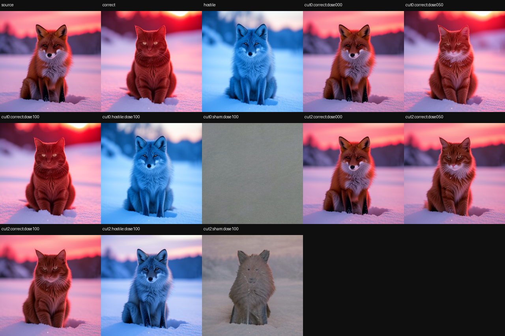

# Real FLUX Hotpatch Cinema: Counterfactual Futures Through the Native Consumer

> [!summary]
> We pause real FLUX.2 generations, apply a content-specific route-state difference at a declared denoising cut, and resume the unchanged image process. The latest four-specimen replication passes `4/4`: early full-dose edits reach `0.904–0.971` progress toward the intended scene or subject, hostile donors move toward their own incompatible factor at `0.926–0.953`, and the same edit installed halfway through denoising falls to `0.095–0.358`. The parent checkpoint, native latent, and image are exactly recoverable after every branch. This is a replicated, donor-assisted causal editing trend—not a portable learned image editor.

## What we are testing

Ordinary diffusion inference treats a generation as one opaque call: prompt in, image out. We test a different interface. We capture a real FLUX.2 trajectory, retain an immutable intermediate state, fork several counterfactual futures from that same parent, and let the original model finish each future.

The decisive question is whether a donor-specific state difference transfers the donor's content through the native denoiser, scheduler, and decoder. A generic perturbation could change the image without carrying the intended scene or subject. The experiment therefore includes a hostile donor, a norm-matched sham, a dose panel, a later intervention cut, scalar confirmation, and exact parent replay.

## Specimen and prompt panel

The specimen is `black-forest-labs/FLUX.2-klein-4B`, revision `e7b7dc27f91deacad38e78976d1f2b499d76a294`, rendered at `256×256` with four denoising steps and guidance `1.0`. Each source, correct donor, and hostile donor uses the same initial latent.

The panel has two semantic axes and two seeds per axis:

| axis | source | correct donor | seeds |
| --- | --- | --- | --- |
| scene | red fox sitting in snow at dawn | red fox standing in a sunlit desert at noon | `9001`, `1337` |
| subject | red fox sitting in snow at dawn | red cat sitting in snow at dawn | `4242`, `9001` |

The hostile donor is a blue fox sitting in snow at dawn. It preserves much of the source scene and pose while changing color, so a branch that follows it demonstrates selective donor execution rather than generic image disruption.

## How the intervention works

Let `R(s,t)` be the typed route state at route site `s` and denoising step `t`. For each source and correct-donor pair, we form a donor factor:

```text
delta(s,t) = R_donor(s,t) - R_source(s,t)
R_branch(s,t) = R_source(s,t) + dose * delta(s,t)
```

The branch then runs the unchanged native suffix from the saved source checkpoint. The same operation with the hostile donor tests factor specificity. The route is `joint.2 → joint.3 → joint.4 → single.0`.

The replication evaluates cuts `0` and `2`, where cut `0` is before the four-step future and cut `2` is halfway through it. The dose panel uses `0`, `0.5`, and `1.0`. Batched suffixes provide the efficient screen; exact scalar suffixes confirm the selected endpoints and numerical authority.

The sham replaces the correct donor difference with an equal-norm random direction. It controls perturbation energy, but not plausible-manifold membership, so a destructive sham is evidence only that the random direction was not the intended donor factor.

## Results

The latest replication is the four-specimen panel in the local proof bundle:

| specimen | early correct | hostile target / own | sham target | late correct |
| --- | ---: | ---: | ---: | ---: |
| scene, seed `9001` | `0.916` | `−0.531 / 0.953` | `0.031` | `0.165` |
| scene, seed `1337` | `0.907` | `−0.508 / 0.950` | `0.029` | `0.095` |
| subject, seed `4242` | `0.971` | `−0.404 / 0.926` | `−0.315` | `0.099` |
| subject, seed `9001` | `0.904` | `−2.810 / 0.953` | `−2.176` | `0.358` |

All four specimens pass the declared correct, hostile, sham, dose, scalar, and rollback gates. The run used one model load, `40` logical batched suffixes in `8` physical calls, and `20` exact scalar suffixes. It completed in `47.45` seconds with peak VRAM of `8,232.6 MB` and peak RSS of `18,854.9 MB`.





## What the controls establish

### The donor content is selective

The hostile donor moves strongly toward its own color target while moving away from the declared scene or subject target. The effect is therefore not simply “the branch changed more.” It follows the content represented by the selected donor trajectory.

### Timing is causal in this panel

The early full-dose branch reaches `0.904–0.971`; the same operation at cut `2` reaches only `0.095–0.358` in every specimen. For this model, route, and four-step panel, the early state has more remaining authority over the final image. This is not a universal timing law: other carrier coordinates and semantic axes can have different authority windows.

### Dose is nonlinear and semantic-axis dependent

The larger single-specimen dose screen rises late rather than smoothly. In the replication, half dose is useful for some subject cells but nearly inert for the scene cells. A scalar dose should therefore not be treated as a universal linear edit-strength control.

### The parent is recoverable

Every intervention branches from an immutable source checkpoint. After the branch panel, exact scalar replay restores the source image and final native latent bytes. Rejected futures remain available for comparison instead of being overwritten by the accepted branch.

## What this does and does not prove

This experiment demonstrates that a real FLUX.2 trajectory can be paused, modified with a content-bound donor factor, resumed through the native image consumer, and audited with selective controls and exact rollback. It opens counterfactual previews, trajectory-level debugging, and efficient search over image futures.

It does not demonstrate a prompt-independent learned editor. The route and donor factor are supplied from paired native trajectories for the declared prompts and seeds. No optimizer learns a reusable edit package in this run, and the donor is present during discovery and intervention. Portability to unseen prompts, objects, model revisions, and donor-free serving remains open.

The correct status is a **replicated native-consumer trend**. The evidence is stronger than a single attractive image because it includes the opposite direction, sham, dose, timing, scalar, and rollback controls, but it remains bounded to the measured FLUX.2 organism and prompt panel.

The supporting result is specifically the conjunction of timing and donor specificity: the same
route state has strong authority at the early cut, much weaker authority at the later cut, and a
hostile donor steers the branch toward its own factor. That exposes a time-local native editing
window in the pinned Klein 4B checkpoint. It does not provide a checkpoint-independent address or
a reusable editor; a different FLUX family member or revision needs its own trajectory capture,
route validation, and native-consumer check.

## Local proof bundle

- [Bundle README](../artifacts/real-hotpatch-cinema/README.md)
- [Replication report](../artifacts/real-hotpatch-cinema/replication-report.json)
- [Replication receipt](../artifacts/real-hotpatch-cinema/replication-receipt.json)
- [Capability vector](../artifacts/real-hotpatch-cinema/capability-vector.json)
- [Bundle verifier](../artifacts/real-hotpatch-cinema/verify.py)
- [Original single-specimen report](../artifacts/real-hotpatch-cinema/original-report.json)

The four-seed replication is the canonical result for this demo. The original single-seed report is retained as the development precursor so that the larger result does not erase how the controls and timing claim were established.
