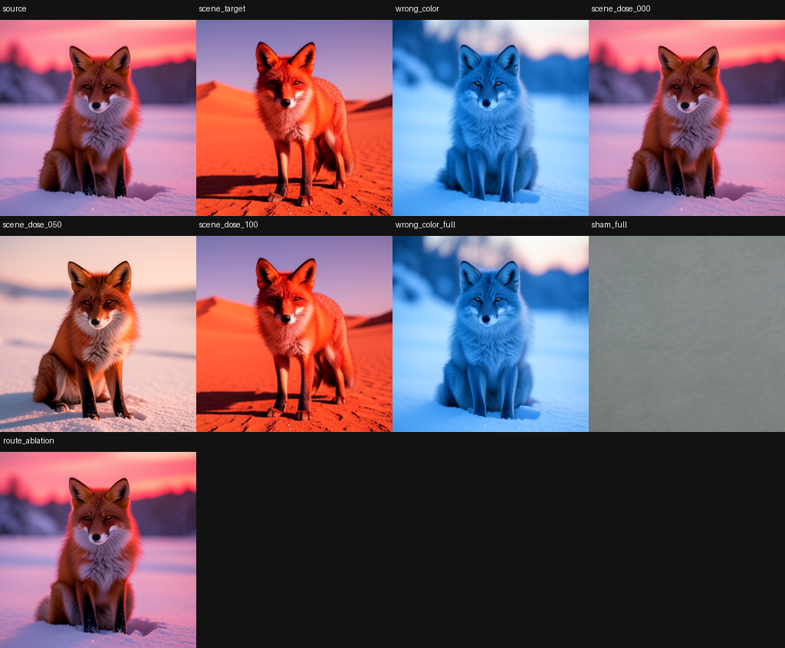

# Scene Circuit Certificate: Native Route Control with Subject-Coupling Limits

> [!summary]
> A two-seed route certificate established reproducible scene edits with minimum scene progress `0.9133`, route-ablation progress `0.0225`, wrong-color progress `-0.4303`, and exact replay. A separate collateral evaluation still shows subject preservation is incomplete, so the result certifies a route-level scene effect rather than a clean scene-only semantic circuit.

## Research question

Can a native route intervention change scene context while controls show that the effect is causal, dose-sensitive, and consumer-visible? The more ambitious claim would be scene/subject disentanglement. This experiment separates those claims: first certify that a route can drive the declared scene change; then measure whether the subject and other image factors remain unchanged.

## Specimen and controls

The fixed FLUX.2 Klein 4B panel uses two seeds, `4242` and `9001`, with a scene edit and a color-mismatched donor. The declared route spans the native text/image carrier boundary under the fixed inference schedule. Each seed has source, target scene donor, half-dose, zero-dose, wrong-color, route-ablation, norm-matched sham, and exact replay branches.

The primary instrument is scene progress toward the native target. Necessity is the maximum scene progress after route ablation. Wrong-color and sham branches test donor specificity; half-dose tests dose response; mediation and consumer return scores check that the route effect survives into the final image rather than remaining a hidden-state artifact.

## How the experiment works

The worker captures source and native scene-target trajectories from the same initial conditions, computes the route payload, and applies it to the source branch. The native schedule and decoder finish every branch. Scene progress is computed from the declared scene evaluator, while exact scalar replay compares the modified and unmodified suffixes under the same checkpoint.

The certificate is intentionally route-level. It does not claim a minimal token/channel subcircuit or semantic ownership of a single address. The collateral panel separately evaluates subject preservation so that a visually convincing scene change cannot be promoted as disentanglement without evidence.

## Results

The certificate gates are all positive for the declared route-level claim:

| gate | observed result |
|---|---:|
| reproducibility | 2 independent seeds |
| minimum scene sufficiency | `0.9132605916` |
| maximum route-ablation scene progress | `0.0224780594` |
| wrong-color scene progress | `-0.4303` |
| maximum sham progress | `0.1086` |
| minimum mediation | `0.7705` |
| consumer return progress | `0.9824` |
| consumer return alignment | `0.9708` |
| exact scalar replay | pass |

The target scene branches visibly move toward the native scene donor, while route-ablation and wrong-color branches remain near or below the source. The half-dose branch is weaker, consistent with a dose-responsive native route.

## Interpretation

The observation is a convergent native-consumer scene-route effect with strong necessity, wrong-donor, sham, mediation, and replay controls. The collateral boundary is equally important: scene progress alone does not establish that identity, geometry, and subject attributes are preserved.

The working inference is that scene context is controllable through a distributed route but remains globally coupled to other image factors. A subject-preserving scene editor must optimize scene progress and collateral jointly, likely with overlap-aware route supports rather than a single broad image-state transplant.

## Claim boundary

Established: the declared route is reproducible and consumer-closed for the bounded scene edit under two seeds and the listed controls.

Not established: scene-only disentanglement, minimal semantic addresses, universal scene transfer, or preservation of every non-scene factor.

## Local proof bundle

- [Bundle README](../artifacts/scene-circuit-certificate/README.md)
- [Raw report](../artifacts/scene-circuit-certificate/report.json)
- [Certificate](../artifacts/scene-circuit-certificate/certificate.json)
- [Certificate text](../artifacts/scene-circuit-certificate/certificate.md)
- [Execution receipt](../artifacts/scene-circuit-certificate/run-receipt.json)
- [Artifact verifier](../artifacts/scene-circuit-certificate/verify.py)

