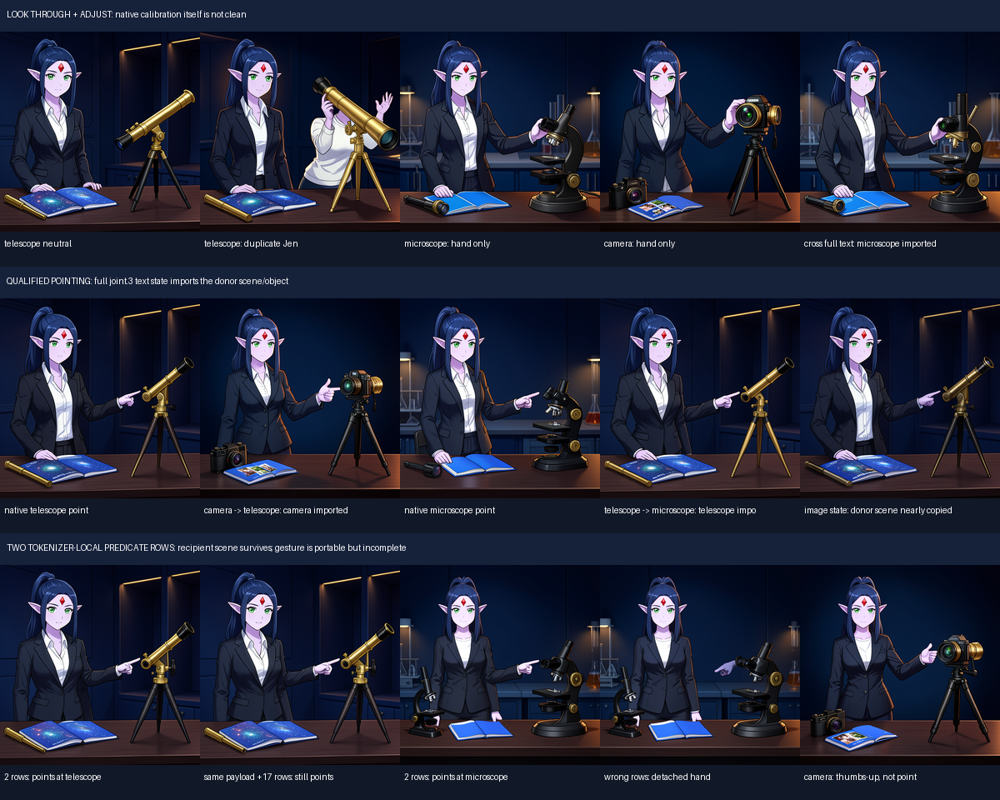
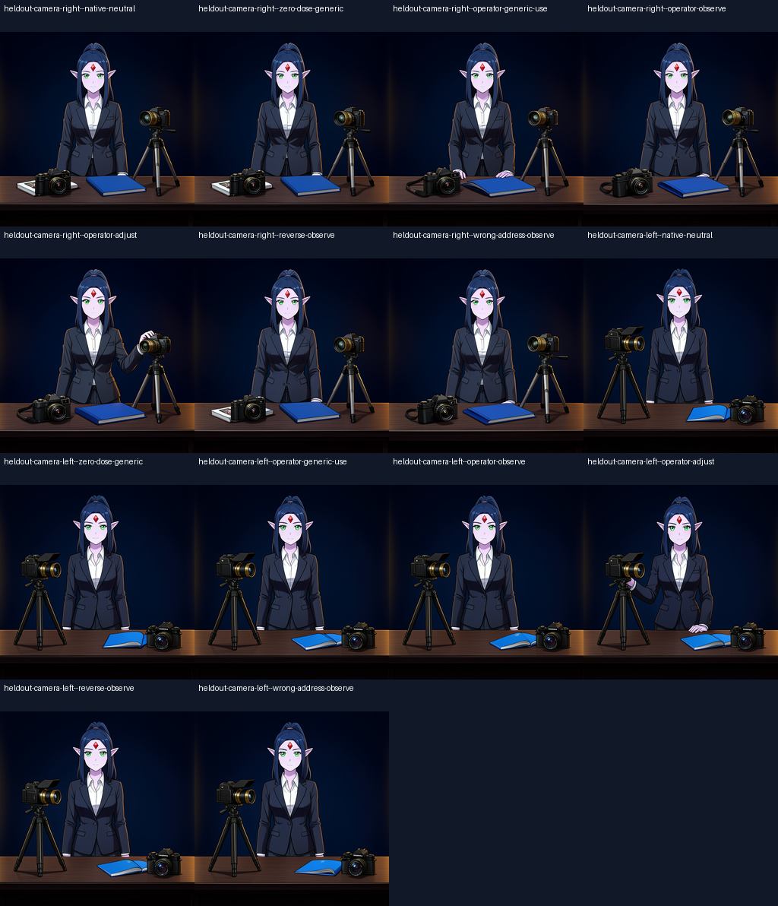
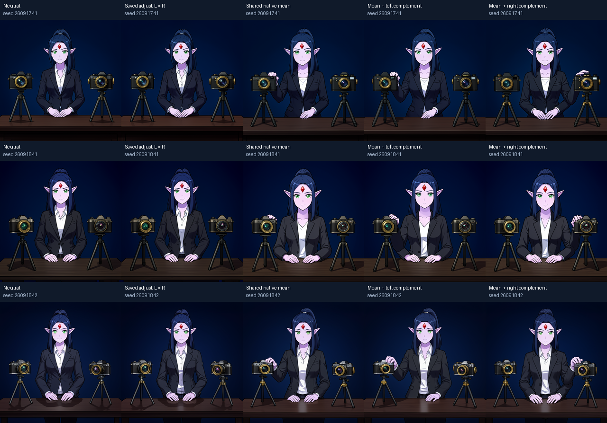
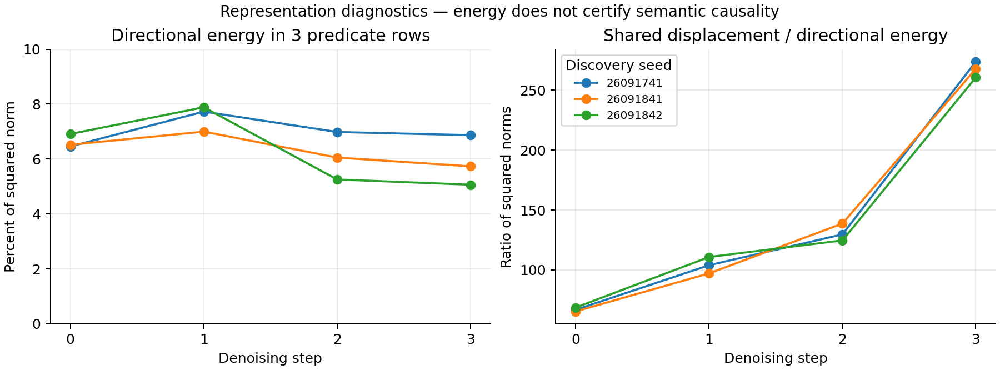

# Scene Relations: A Portable Action Signal and the Missing Instance Binding

We extracted a small internal action pattern from telescope and microscope scenes and reused it in a frozen FLUX.2 Klein 4B to make Jen reach toward a camera. The reaching arm changes with the camera's side. This is evidence that the saved pattern recruits the recipient scene's geometry. It does not yet establish a general `use` operation or independent selection of a particular object among equivalent candidates.

The experiment turns an internal intervention into a saved artifact: ordered predicate states, a declared insertion boundary, a dose, source hashes, and fresh-process execution. Its strongest semantic result is the specific `adjust` mode. Generic `use` does not consistently select an action, and `observe` does not bring the character's eye to the viewfinder.

**September 18 follow-up:** two completed Saturn cuts rendered 63 images across three discovery seeds. They confirmed that the old object ID does not influence the numerical writer, exposed a context in which its compact action is inactive, and found a donor-assisted target-control route: with shared native action state present, changing only the non-predicate directional state switches visible contact between cameras in 6/6 target/seed cases. The experiments and limitations are reported below.

## How scene generation works

FLUX supplies the visual prior and the actual image synthesis. Text conditioning and optional reference operands guide successive updates to an image latent; the native decoder produces RGB. Saturn makes this computation addressable: capture a parent state, fork controlled futures, intervene at a declared boundary, continue through the original model, and record the resulting images and state identities.

The scene program combines three developing capabilities. A saved character register reuses Jen's native reference representation. Scene records describe entities, spatial information, and intended relationships. Typed operations change selected internal state during generation and preserve receipts of their writes. These layers have different evidence boundaries: a valid relation record does not prove that the neural renderer obeys its subject and object arguments.

Exact replay establishes that we can reproduce the computation. It can reproduce an incorrect face or an unbound action equally well. Visual identity, action, object preservation, and relationship correctness therefore require separate observations.

## How we found the action signal

Early action programs exposed the problem: Jen could look through a newly invented handheld telescope while the original tripod telescope remained unused. An apparent relationship-binding fix was subsequently identified as donor-present latent compositing and corrected in an additive record. The native picture had to adjudicate the claim, not the software operation's name.

The subsequent Rosetta investigation compared neutral and action-conditioned telescope, microscope, and camera futures from matched immutable parents. It traced text and image streams through the denoiser, installed action state into neutral branches, deleted that state with neutral replacements, and continued through the unchanged native consumer.

Whole-state text transplantation imported the donor's instrument and room. Even a stream called "text" held contextual scene information. A smaller intervention, just the two contextual rows associated with `points toward`, transferred a pointing-like gesture while retaining the recipient scene. It produced attached pointing for telescope and microscope and a thumbs-up near the camera. An object-noun row alone did not act as an object pointer.

The working mechanism is an interaction: predicate content enters through the text route, recipient image state supplies candidate geometry, and downstream computation completes or fails to complete the pose and contact. There is no established standalone `bind(subject, predicate, object)` symbol at the tested boundary.

## Compiling and serving the operator

The successful compiler keeps the absolute predicate states at `joint.3`, preserves slot order, and averages corresponding slots across telescope and microscope development scenes separately at each denoising step. The modes use one slot for `uses`, two for `looks through`, and three for `adjusts the focus`. The saved float32 kernel bank is approximately 295 KB. No optimizer or weight update is involved.

A separate process loads this artifact and Jen's register. It encodes only neutral camera scene descriptions, resolves insertion rows with the tokenizer, and writes the saved values into the text stream at `joint.3` during each of four denoising steps. It does not encode an action prompt or load raw development states. The neutral prompt and lexical resolver remain dependencies; "donor-free serving" does not mean "language-free" or "learned grounding."

Let \(H_{t}\in\mathbb R^{N\times d}\) be the recipient text state at the selected layer and denoising step, \(S\) an ordered row-selection matrix, and \(K_{m,t}\in\mathbb R^{r\times d}\) the saved kernel for mode \(m\). The intervention is

\[
H'_t=H_t+\alpha S^\top(K_{m,t}-SH_t).
\]

For distinct selected rows, \(SS^\top=I_r\). Thus \(\alpha=0\) is an exact no-op, \(\alpha=1\) installs the saved rows, and unselected rows remain unchanged at this boundary. The rest of the model may still change pixels anywhere in the image. State-local writing is not a guarantee of pixel-local editing.

In the historical panel, `adjust` creates hand contact with the existing tripod camera on both sides. Generic use is inconsistent, and observe leaves Jen upright. Zero dose reproduces native-neutral pixels exactly. The result is one checkpoint, one seed, four steps, 512 × 512, and two layouts. The neutral images already contain an extra camera, and camera appearance and nearby props change between branches.

## Weaknesses that define the next experiments

| Weakness | Current evidence | Discriminating measurement |
|---|---|---|
| Instance binding | Reach follows the salient tripod instrument across two layouts | Hold scene and predicate fixed; switch only the selected instance among two comparable cameras |
| Predicate address | Shifting the pointing payload by 17 rows often preserves the gesture | Same payload, matched perturbation energy, distinct insertion addresses, and contact/ownership review |
| General use | Generic use does not select a stable affordance | Separate action selection from execution of a specified action |
| Observe source | Development renders themselves lacked successful eye contact | Qualify source behavior before attributing failure to compilation |
| Preservation | Object appearance, nearby props, and some character traits change | Separate target contact, unselected object, identity, and background measurements |
| Replication | Strongest operator panel has one seed and checkpoint | Replicate signed contact trends across seeds before expanding claims |
| Instrument validity | Pixel change and exact hashes can certify the wrong semantic story | Use native images and independently recorded contact judgments; preserve disagreement |

The September 18 audit also weakened earlier claims of topology-specific edits and reference-address sensitivity because controls confounded address with perturbation magnitude or mask coverage. Historical outcomes remain unchanged; these are corrections to interpretation.

## Spectral addresses and the mathematical binding question

Saturn separates a canonical symbol from a scene-local instance, an ordered role, and a coordinate frame:

\[
\mathcal A=\mathcal K_{identity}\times\mathcal I_{instance/scope}\times\mathcal R_{role}\times\mathcal F_{frame}.
\]

Two cameras can share the camera symbol while having distinct instance keys. An exact spectral read can select the corresponding payload without confusing the two. That is useful address machinery, but native binding additionally requires the selected payload to influence the numerical writer consumed by FLUX.

Write the final image as \(Y=F(P,W(H,K,a))\), where \(P\) is the common parent, \(K\) the predicate payload, and \(a\) the instance address. If changing \(a\) changes only a receipt and neither \(K\), \(S\), nor any downstream numerical operand, then

\[
W(H,K,a_L)=W(H,K,a_R),\qquad Y(a_L)=Y(a_R).
\]

This is an execution-graph property, not a statement that FLUX cannot bind objects. The first follow-up must determine whether the current object argument has such a numerical path. The next experiment can then introduce a separately declared native lowering and test it instead of treating metadata as a causal pointer.

For a candidate spatial lowering, a supplied object mask may be stored in an independent spectral slot. Integer translation has the Fourier action

\[
\widehat M_{\Delta}(k_x,k_y)=e^{-2\pi i(k_x\Delta x/N_x+k_y\Delta y/N_y)}\widehat M(k_x,k_y).
\]

This preserves Fourier magnitude and, under the declared periodic discrete transform, the mask's norm. It provides a controlled spatial-address contrast without increasing the mask dose. It does not create a learned object locator, and periodic wrap must be excluded from semantic interpretation. Native token support must be derived from the actual image-ID grid, not guessed from flattened row order.

The planned causal cut holds the predicate fixed and crosses target selection with layout, recording target contact and unselected-object change separately. A predicate × address interaction can be measured as

\[
I=[Y(K,a_L)-Y(0,a_L)]-[Y(K,a_R)-Y(0,a_R)].
\]

Image-space interaction is diagnostic; contact with the selected instance supplies semantic evidence. Mechanics status, instrument status, trend status, and terminal status remain separate. An unsuccessful branch is retained as evidence and used to choose a smaller or different next cut.

## Follow-up: spectral selection needs a numerical consumer

The source trace suggested that the original writer's target parameter was metadata-only. A minimal CPU check used Saturn's actual spectral address reader and saved operator. The two cameras shared a canonical symbol but had different scene-local instance keys. The reader selected different addresses; their typed relation programs had different fingerprints. The writer nevertheless returned byte-identical tensors. An unknown instance abstained.

The first native job, `job-47589b8693dc`, tested that prediction through the full FLUX consumer. It used three seeds, one two-camera scene template, and eleven branches per seed. Changing only the old operator's declared target produced identical writes at **12/12 seed × denoising-step boundaries** and identical final images at **3/3 seeds**. The left/right labels are duplicate interventions here and do not supply six independent samples.

This is a bounded structural conclusion: for this writer, target selection has no numerical path when the parent, predicate kernel, insertion rows, and dose remain fixed. It is not a conclusion that the model lacks an internal binding mechanism.

The compact `adjust` pattern also produced no camera contact in the three distinct two-camera outputs. Native left/right prompts did produce contact in all six target/seed source images, though four of those images added a third hand. The new scene changes both prompt context and geometry, so the loss of compact-action authority cannot be attributed to object count alone.

The compact interventions still changed pixels and some pose details. "Inactive" in this follow-up means that they did not create the tested camera contact; it does not mean zero internal or visual effect.

## Follow-up: separate shared action state from target direction

Let \(H_{L,t}\) and \(H_{R,t}\) be native `joint.3` text states from matched left-target and right-target futures. Define

\[
M_t=\tfrac12(H_{L,t}+H_{R,t}),\qquad D_t=\tfrac12(H_{R,t}-H_{L,t}).
\]

\(M\) is the shared contextual state. Calling it a shared action state is a working interpretation: it also contains scene and instruction information. \(D\) is a target-conditioned difference, not an already-proven pure object pointer. With \(P=S^\top S\) projecting onto the three predicate rows, split it as

\[
D_t^{pred}=PD_t,\qquad D_t^{rest}=(I-P)D_t.
\]

The first cut added opposite signs of \(D^{rest}\) to neutral state, with and without the saved compact action. The spectral instance read selected the sign. This changed pixels but created no contact. Because the compact action was itself inactive in this context, that result could not tell us whether the target information was usable with a working action.

The second completed job, `job-6386d22db7c1`, therefore retained \(M\) and tested \(M\pm D^{rest}\) and \(M\pm D^{pred}\), along with the shared mean and full native source controls. In the complement pair,

\[
P H'_{L,t}=PM_t=PH'_{R,t}.
\]

The predicate-slot values are identical while the remainder of the text state changes with the selected camera. This is a direct causal test of target information outside the compact predicate slots.

| Intervention | Native visual observation |
|---|---|
| Old compact operator, target metadata switched | Byte-identical left/right outputs in 3/3 seeds; no contact |
| Directional complement added to neutral or compact-action state | Pixel changes, but no contact in either six-image signed panel |
| Full native left/right text state | Requested-side contact in 6/6 images |
| Shared native mean \(M\) | Left-camera contact in 3/3 seeds despite a zero directional term |
| \(M\pm D^{rest}\), predicate values fixed | Requested-side contact in 6/6 images |
| \(M\pm D^{pred}\), complementary values fixed | Requested-side contact in 5/6 images; one right request still touches left |

The working inference is that useful target direction is distributed across contextual state, and its effect depends on the action-bearing context in which it is consumed. A compact predicate can be useful without being a self-contained action program. A valid instance address becomes causal only when its selected payload affects a native numerical operand.

The mean's consistent left bias is also informative. Averaging left and right hidden states does not average their semantic outcomes into neutral behavior. The downstream image generator makes a nonlinear completion, and a zero directional coefficient is not an abstention mechanism.

## Geometry, numerical controls, and scope

Across twelve captured seed × step states, the predicate rows contain **5.07–7.89%** of the left/right difference's squared norm. The complementary rows contain **92.11–94.93%**. The shared displacement from neutral has **65.39–273.81 times** the directional energy. These measurements suggest a large contextual change plus a smaller directional contrast, but energy is not semantic authority. The two projections have unequal energy and are not matched controls for information per unit norm.

Spectral instance reads selected actual numerical operands in the new writer: the left and right bindings returned opposite signs of the same target contrast, giving equal pre-cast directional norm. This used Saturn's exact scene/instance/role/frame addressing. Fourier mask translation was independently checked for norm preservation and exact integer-shift undo in a procedural CPU organism; it was **not** used as a native image-space writer in these runs. No learned mask or part locator has been demonstrated.

All nine native calibration images and all 36 recorded source-state hashes replayed exactly across the completed jobs. The first job's three zero-dose images were exact. The full-route controls in the second job used the original source tensors.

An intermediate attempt, `job-05bf22c65854`, stopped after thirteen image events because an overly strict arithmetic reconstruction check failed. At one step, float32 mean/difference cancellation changed one of 1,572,864 values by \(2.98\times10^{-8}\). The corrected run preserves that error as a diagnostic and uses direct source tensors for exact controls. The incomplete attempt's logs, scheduler receipt, and source are retained; its images were not recovered into the durable bundle and are excluded from semantic denominators. This is an instrument correction, not a scientific failure rewritten into a pass.

The completed cuts used one model load each, scalar BF16 CUDA at 512 × 512, four denoising steps, three cached text encodes, zero fresh reference encodes, and zero training. They took 75.59 and 65.65 worker seconds; both peaked at 9,086 MB VRAM. mrun selected their resource envelope without a manual reservation.

The positive contact result remains donor-assisted: \(M\) and \(D\) came from target-conditioned futures in the same scene. The three seeds were opened during adaptive discovery. Cameras requested as identical still differ in the generated images; identity preservation, the untouched camera, and physical focus-ring manipulation are uncertified. Extra hands persist in several branches. All contact judgments are from one unblinded model reviewer, with no independent keypoint judge. A general donor-free instance binder is still open.

The next causal cut should keep this working action context fixed and replace the target-conditioned difference with a recipient-derived image/part address. Crossing that address with a layout permutation, while using a qualified two-arm source and matched spatial controls, would test whether target control can be separated from its captured contextual pose.

## Sources and evidence custody

- September 18 program audit\*
- Cross-object causal synthesis\*
- Historical operator findings\*
- Historical visual audit\*, with the September 18 audit's weaker address interpretation taking precedence
- Compiler and typed writer\*
- Compiler/serve experiment\*
- Spectral Address ABI\*
- [Local image custody manifest](../artifacts/scene-relations-and-instance-binding/manifest.json)
- Follow-up experiment and execution instructions\*
- [First-cut findings](../artifacts/scene-relations-and-instance-binding/first-cut-FINDINGS.md) and [raw report](../artifacts/scene-relations-and-instance-binding/first-cut-report.json)
- [Route-factorization findings](../artifacts/scene-relations-and-instance-binding/route-factorization-FINDINGS.md) and [raw report](../artifacts/scene-relations-and-instance-binding/route-factorization-report.json)
- [Follow-up artifact manifest](../artifacts/scene-relations-and-instance-binding/followup-manifest.json) and [offline summary-bundle verifier](../artifacts/scene-relations-and-instance-binding/verify.py)

The local summary bundle contains reports, judgments, scheduler and evidence receipts, and proof figures. Full individual images, immutable executed-source snapshots, logs, and Saturn custody ledgers remain in the linked experiment's result directories. Historical results and incomplete attempts are retained separately from these follow-up interpretations.

\* Unpublished internal document. Ask the publisher for more information.
