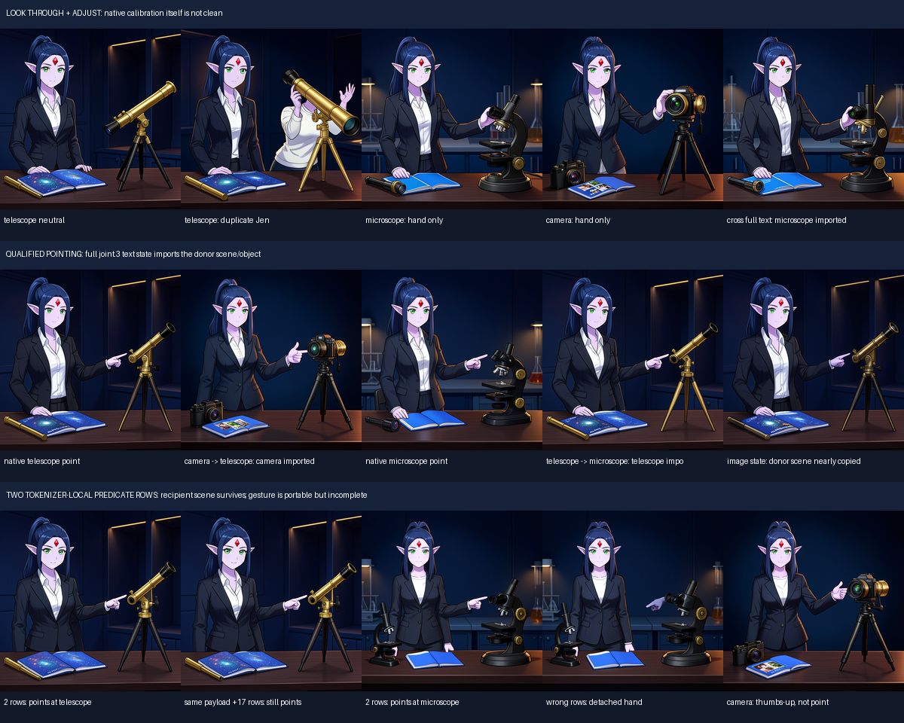
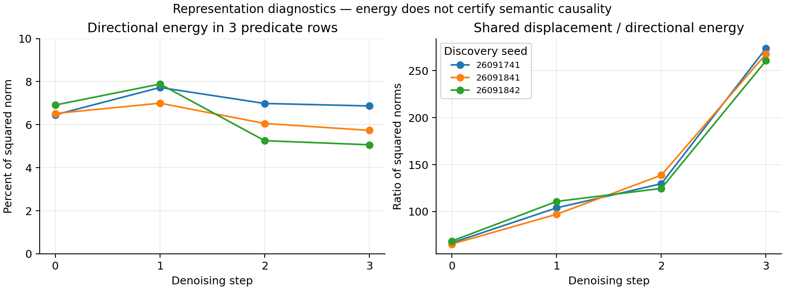

# Steering which camera a character reaches for, from one direction in hidden state

## What we found

We put a character — Jen, a saved character reference (a reusable embedding of one character's
appearance) — at a desk between two cameras and start from two matched futures in which she reaches
for the left camera or the right one. Averaging their hidden text states gives a shared state M and
a target direction D. Keeping M and the three action rows byte-identical, and adding only the
*non-action* part of that direction, **D_rest**, switches which camera Jen touches in **6/6**
target-and-seed cases. The shared state M on its own makes her reach **left in 3/3** seeds even
though its directional term is exactly zero — averaging two opposite hidden states does not average
their rendered outcomes, a clean nonlinearity in the decoder. Two supporting results frame this: we
located the action signal in a few text rows tied to the phrase "points toward," and the original
operator's object-target argument turned out to have **no numerical path to the image at all**
(switching only the target gave byte-identical outputs).

## Why it matters

Causal-tracing and mediation work (Vig et al. 2020; Meng et al. 2022; Wang et al. 2022) shows a
behavior can live in a few hidden rows and be moved by overwriting them. Instance binding — making a
relation attach to *this* object rather than an equivalent one — is the harder, less-settled case,
and we sharpen it with two negatives and a positive. The negatives: an address that looks right (a
reader selects different internal keys for the two cameras) does **nothing** unless its payload
reaches a numerical operand the renderer consumes. The positive: what decides *which* camera is
touched is not a single symbol but a distributed, non-action direction in hidden state, and it acts
only inside an action-bearing context. Every claim is judged on the final rendered image, not an
internal score.

## Setup

Frozen FLUX.2 Klein 4B, 512², four denoising steps, editing the text stream at `joint.3` (the third
dual-stream block), across three discovery seeds (26091741 / 26091841 / 26091842). We capture matched
left- and right-target futures, decompose their `joint.3` text states, write edited states back at
each step, and continue through the unchanged denoiser, scheduler and decoder. "Contact" — whether
Jen's hand reaches a camera — is judged on the final image by one model reviewer; all source states
replay exactly for controls.

The write is H′ = H + αS⊤(K − SH), with S selecting the action rows and K the saved payload: α = 0 is
an exact no-op, α = 1 an exact install, and unselected rows are untouched *at this boundary* — though
the rest of the model may still move pixels anywhere.

## Results

### How the action signal was found

Early action programs exposed the trap: Jen could "look through" a freshly invented telescope while
the real tripod telescope went unused — an apparent binding fix that was really donor-present
compositing. Comparing neutral and action-conditioned telescope, microscope and camera futures from
matched parents, we found that transplanting the whole text state imports the donor's instrument and
room, but transplanting just the two rows tied to "points toward" transfers the pointing gesture
while keeping the recipient scene. An object-noun row alone is not an object pointer. The mechanism
is an interaction: predicate content enters through the text route, the recipient's image state
supplies candidate geometry, and the downstream computation completes (or fails to complete) the
pose. There is no standalone `bind(subject, predicate, object)` symbol at this boundary.

### The old operator's target argument had no numerical effect

A source trace suggested the original writer's *target* parameter was metadata only. On CPU, the two
cameras share one canonical symbol but have different scene-local instance keys, and the reader
selects different addresses — yet the writer returned **byte-identical tensors**. The first native
job, `job-47589b8693dc`, tested this through the full renderer (three seeds, one two-camera scene):
switching only the declared target gave identical writes at **12/12** seed × step boundaries and
identical final images at **3/3** seeds. Formally, if changing the address *a* changes neither the
payload, the row selection, nor any downstream operand, then W(H, K, a_L) = W(H, K, a_R) and
Y(a_L) = Y(a_R) — an execution-graph property of that writer, not a claim that FLUX cannot bind
objects. (The compact "adjust" operator also produced no camera contact in this new scene;
"inactive" means no tested contact, not zero visual effect.)

### Separating shared action state from target direction

From the matched futures define the shared state and the target direction at step *t*:

M_t = ½(H_L,t + H_R,t),  D_t = ½(H_R,t − H_L,t).

With P projecting onto the three action rows, split D into its action part D_pred = P·D and its
remainder D_rest = (I − P)·D. The decisive test, `job-6386d22db7c1`, keeps M and adds signed
complements, with an exact spectral read selecting the sign. In the D_rest pair the action-row values
are identical on both sides (P·H′_L = P·M = P·H′_R) while the rest of the text state changes with the
requested camera — a direct test of target information *outside* the action slots.

| intervention | native visual observation |
|---|---|
| old compact operator, target metadata switched | byte-identical left/right outputs in 3/3 seeds; no contact |
| directional complement added with no action context | pixel changes, but no contact in either six-image signed panel |
| full native left/right text state | requested-side contact in **6/6** images |
| shared native mean M | left-camera contact in **3/3** seeds despite a zero directional term |
| M ± D_rest, action values fixed | requested-side contact in **6/6** images |
| M ± D_pred, complementary values fixed | requested-side contact in 5/6 images; one right request still touches left |

<!-- REPLICATION -->

So useful target direction is distributed across contextual state and acts only inside the
action-bearing context that consumes it: a compact predicate can be useful without being a
self-contained action program, and an address becomes causal only when its payload reaches a
numerical operand. The mean's steady left bias is the nonlinearity — a zero directional coefficient
is not an abstention.

### Geometry and numerical controls

Across twelve captured seed × step states the action rows hold only **5.07–7.89%** of the left/right
difference's squared norm; the complementary rows hold **92.11–94.93%**; the shared displacement from
neutral carries **65.39–273.81×** the directional energy. These are descriptive — a large energy
share is not semantic influence, and the two projections are not matched controls. All nine
calibration images and
36 source-state hashes replayed exactly, and zero-dose images were byte-exact. A Fourier mask
translation was checked for norm preservation and exact integer-shift undo on CPU, but was **not**
used as an image-space writer here; no learned mask or part locator has been demonstrated.

## Limits and open questions

- **Donor-assisted.** M and D come from target-conditioned futures in the same scene; a general
  donor-free instance binder is still open.
- **Three seeds, opened during adaptive discovery** — not a preregistered seed set.
- **One unblinded model reviewer** judged all contact; no independent keypoint judge; disagreement is
  preserved rather than averaged away.
- **Uncertified preservation.** Cameras requested as identical still differ in the renders; identity
  preservation, the untouched camera, and physical focus-ring manipulation are not certified. Extra
  hands (sometimes a third) persist in several branches.
- **D_pred is weaker:** M ± D_pred switched contact in 5/6, with one right request still touching left.
- **Instance binding unresolved.** Reach follows the salient instrument; switching only the selected
  instance among two comparable cameras — holding scene and predicate fixed — is the next cut.
- **Predicate address is not sharply localized.** Shifting the pointing payload by 17 rows often
  still preserves the gesture, so the insertion address is loose; a matched-energy address contrast
  is needed.
- **Other operator modes are weak.** Generic "use" does not select a stable affordance, and
  "observe" did not bring Jen's eye to the viewfinder — partly because the development source renders
  themselves lacked eye contact, so that failure cannot be cleanly blamed on compilation.
- **Superseded interpretations.** An intermediate run, `job-05bf22c65854`, stopped after 13 image
  events when a too-strict reconstruction check tripped on a float32 cancellation (one of 1,572,864
  values off by 2.98×10⁻⁸); its images are excluded from denominators and it is kept as a diagnostic.
  The September 18 audit also weakened earlier claims of topology-specific edits and
  reference-address sensitivity, where controls had confounded address with perturbation magnitude or
  mask coverage; the historical outcomes are unchanged, only their interpretation.

## Reproduce and inspect

All evidence is in the [local bundle](../artifacts/scene-relations-and-instance-binding/):
[first-cut findings](../artifacts/scene-relations-and-instance-binding/first-cut-FINDINGS.md) and
[report](../artifacts/scene-relations-and-instance-binding/first-cut-report.json),
[route-factorization findings](../artifacts/scene-relations-and-instance-binding/route-factorization-FINDINGS.md)
and [report](../artifacts/scene-relations-and-instance-binding/route-factorization-report.json),
the [follow-up manifest](../artifacts/scene-relations-and-instance-binding/followup-manifest.json),
the [image manifest](../artifacts/scene-relations-and-instance-binding/manifest.json), the proof
figures, and the [offline verifier](../artifacts/scene-relations-and-instance-binding/verify.py).
Additional internal run logs are available on request.
