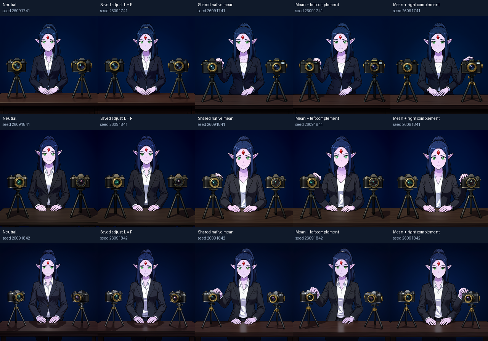
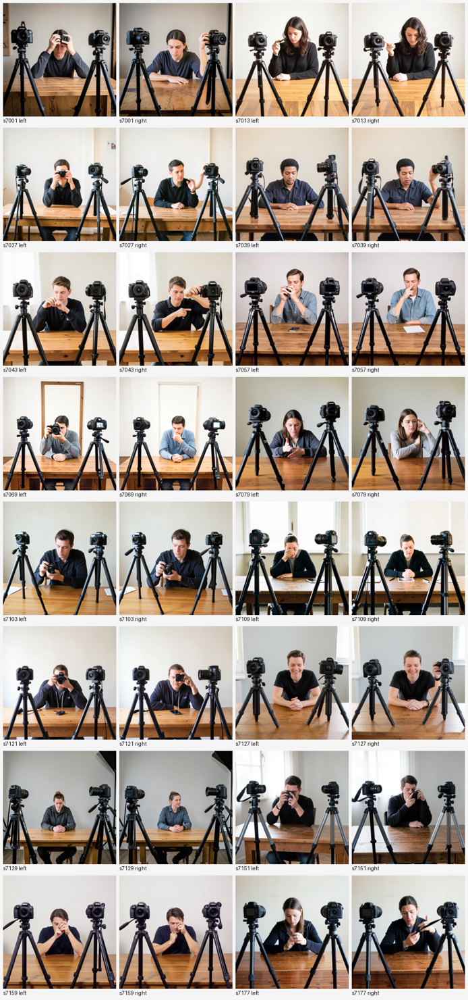

# Scene relations: three lessons from a result we demoted

This page used to headline a claim that one direction in hidden state picks which of two cameras a
character reaches for. On review we no longer think that result shows anything beyond swapping the
prompt, so we moved it out of the main reading list. Three lessons from the work are worth keeping.

## What the experiment was

A character sits at a desk between two cameras. We ran two matched generations: one prompted to
adjust the left camera, one the right. At block `joint.3` we took their text-stream states `H_L` and
`H_R`, formed the mean `M = ½(H_L + H_R)` and the half-difference `D = ½(H_R − H_L)`, and split `D`
into the part on the three action-phrase rows ("adjusts the focus", `D_pred`) and everything else
(`D_rest`). Writing `M ± D_rest` back in (job `job-6386d22db7c1`, three seeds, one unblinded model
reviewer) gave requested-side contact in 6/6 images, with the action rows byte-identical across the
two sides.

## Why we demoted it

`M + D` is exactly `H_R`, the right-prompt's own state. The prompts differ only in the side word, and
the action phrase comes *before* that word. FLUX.2 Klein's text encoder is Qwen3, a decoder-only language model with causal attention, so at the
encoder output the action rows cannot depend on the side word at all; by `joint.3` they hold only
5.07–7.89% of the left/right difference, picked up through joint attention. "The target lives outside
the action rows" was therefore close to guaranteed by the prompt layout, and `M + D_rest` is nearly
"write the right-prompt's text state", which is a prompt swap. (We confirmed the token order in our
text-only replica: in the prompt that passed the scene check the action rows are positions 28–31 and the side word is position 37. The
original prompt strings are not in the local bundle; the 5–8% energy share is consistent with the same
order.) The same conclusion holds for the [fork experiments](forking-a-generation.md): a full-dose
edit there is a near-complete prompt swap.

The evidence was also thin: three seeds opened during discovery, one unblinded reviewer, a saved
character reference, and extra hands in several images.

## Lesson 1: averaging two hidden states is not a neutral state

The mean `M` alone made the character reach for the **left** camera in **3/3** seeds, even though its
directional term is exactly zero. Averaging the internal states of "reach left" and "reach right" does
not average their outcomes; the denoiser completes the pose one way. A zero coefficient is not an
abstention, and interpolation in hidden state should not be read as interpolation in behaviour.

## Lesson 2: check that an argument reaches the computation

The original edit operator took a "which object" argument. On CPU the two cameras resolved to
different addresses and the operator produced different fingerprints, yet the tensors it wrote were
**byte-identical**. Through the full model (`job-47589b8693dc`, three seeds), switching only the target
gave identical writes at 12/12 seed × step boundaries and identical images at 3/3 seeds. The argument
was metadata: it changed the run record, not the arithmetic. A typed, well-logged interface can carry
a parameter that does nothing, and only an end-to-end byte comparison catches it.

## Lesson 3: check the scene before scoring an intervention

We tried a larger, blinded, text-only replication on public code
([saturn-pub](https://github.com/JHollenb/saturn-pub), branch `pub/bfl-demo-controls`). The
pre-registered plan required the plain left/right prompts to produce requested-side contact in at
least 10/16 seeds before any intervention was scored.

- **Attempt 1** (`job-ed0aee67ac23`, "…adjusts the focus of the left/right camera"): the plain prompts
  failed. People mostly held small handheld cameras or touched their face. Contact was about 0/16 left
  and 4/16 right, so the 128 intervention images were not scored.
- **Attempt 2** (`job-b5269d1e902b`, "…firmly gripping the lens of the camera on the left/right side of
  the image"): the plain prompts passed, about 14/16 left and 15/16 right (a quick non-blinded
  read). The full 8-arm blinded run then completed (`job-0047f8f99d61`, 128 images). **We did not score
  it**, because of the circularity above: a clean score would mostly confirm a prompt swap.

The original scene had produced contact in 6/6 native images, but only with a saved character
reference and with extra hands. A behaviour that holds in one hand-built scene may not exist in the
model's default distribution, and a pre-registered scene check costs a few minutes.

## What would make this a real result

Hold the prompt fixed and get the target side from something that is not a prompt, such as a
position read from the recipient's own image state, a spatial mask, or a pointer derived without a
paired donor run. Then compare against a prompt swap, as in the fork control, and score blinded with
more than three seeds.

## Reproduce and inspect

- 2026-09-18 runs: [`../artifacts/scene-relations-and-instance-binding/`](../artifacts/scene-relations-and-instance-binding/)
  ([first cut](../artifacts/scene-relations-and-instance-binding/first-cut-FINDINGS.md),
  [route factorization](../artifacts/scene-relations-and-instance-binding/route-factorization-FINDINGS.md),
  offline `verify.py`).
- 2026-10-09 replication attempts: [`replication-2026-10-09/`](../artifacts/scene-relations-and-instance-binding/replication-2026-10-09/)
  (pre-registration, viability sheets, failure note, run report). The unscored images and the blinding
  key are in saturn-pub `pub/bfl-demo-controls` (commit `c3f7eb7`), under
  `experiments/bfl_demo_controls/results/exp2b/`.
