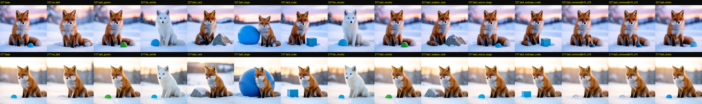
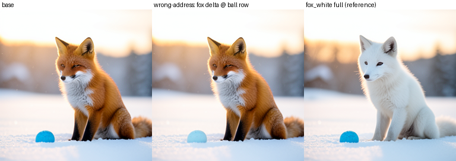
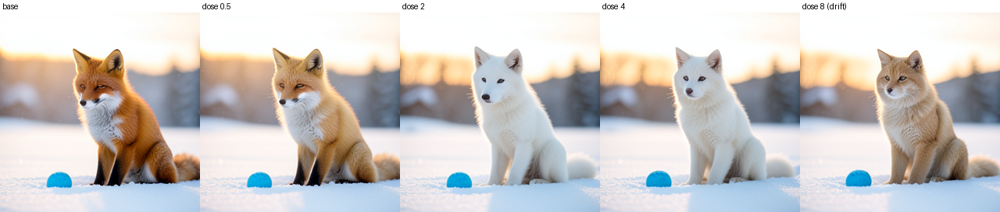
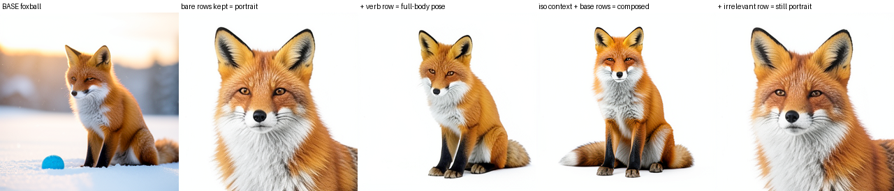
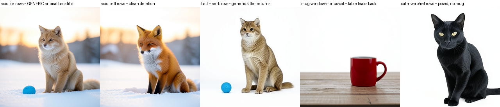
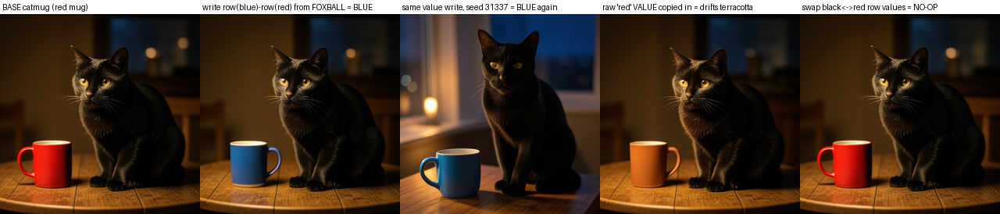
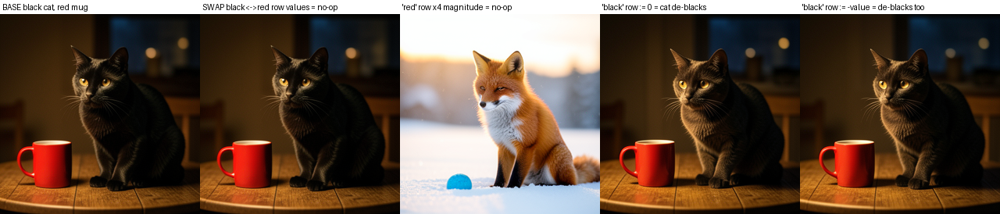

# Semantic Circuit Objects

> [!summary]
> This synthesis explains how a causal semantic circuit becomes a usable object symbol. We first establish a route that changes the native image consumer, then localize the lexical rows and spatial effects that carry one object, package them as a fingerprinted typed record, and use that record to edit, isolate, delete, compose, and numerically steer the object in the model's own state. The strongest result is value-level: reading two captured register values, subtracting them, and writing the displacement into another object's row produces a blue mug without a blue-mug render or edit prompt. The evidence is exploratory, but it is now a coherent model-facing object interface rather than a collection of visual tricks.

## Research question

Can a semantic circuit be compiled into symbols that the model itself can use as objects? The question is stronger than whether a prompt word correlates with an image region. A useful symbol must have a causal address, a native consumer, a payload contract, a writer, a spatial interpretation, and evidence showing what happens when the symbol is edited, moved, deleted, isolated, or applied to the wrong target.

The result is not a claim that FLUX.2 contains a conventional object database. “Object” is an operational abstraction: a typed record that names a bounded set of model-state coordinates and records the interventions that make those coordinates meaningful. The record is useful only because a native image-generation suffix consumes the edited state and produces the expected image-level consequence.

## The big picture

The arc begins with a semantic circuit. A circuit is a causal route-level result: a controlled intervention at declared coordinates changes the native image output, route ablation suppresses the effect, wrong-source or wrong-axis controls fail, and exact replay returns the parent. The twenty-axis route panel produced six strict 9/9 rows, eleven looser carrier-level rows, and three candidates. The separate scene certificate reached minimum scene progress 0.9133, route-ablation progress 0.0225, wrong-color progress -0.4303, and exact replay. These results establish a consumer-visible route, not independent semantic ownership of one token or one hidden unit.

The object work takes the next step. It intersects that causal route with the model's token manifest, asks which rows change when one named object changes, joins those rows to image-side effects, and preserves the result as a typed symbol. In the tested fox-and-ball scene, the fox resolves to lexical rows `[7, 8]`, the ball to `[12, 13]`, and the ground context to `[14, 15, 16]` on the text route `joint.2 → joint.3 → joint.4 → single.0`. Those numbers are not declared as meaningful by fiat; they earn meaning through donor/base contrasts, row-masked suffix replays, shams, wrong-address writes, and image measurements.

The resulting abstraction is a model-facing object record. Its address says where to write. Its property fields say what kind of change was measured there. Its route and timing fields say which native consumer will read the write. Its spatial fields say which image region moved in the probe. Its evidence fields say how selective, dose-sensitive, reproducible, and collateral-heavy the operation was. The record can then be attached to a durable checkpoint, fingerprinted, read back, and used to compile another intervention.

## How the symbols are created

### 1. Establish a causal circuit before naming an object

The first step is to hold the native model and image consumer fixed. We capture a base trajectory, a target or donor trajectory, exact replay, route-ablation, zero-dose, wrong-source, wrong-axis, and norm-matched sham branches. Every candidate change is replayed through the unchanged native suffix and judged at the decoded image, not merely by activation similarity.

This separates a route that is merely correlated with a prompt from a route that can cause a visible result. It also gives the object compiler a declared write boundary: the route, stream, denoising steps, dose, and consumer are part of the symbol's type. A row without a native-consumer result is only a candidate address.

### 2. Localize lexical rows with controlled contrasts

We use a simple base/donor contrast such as `red fox → white fox` or `blue ball → green ball`. The donor is not a new model and does not modify the base prompt. It is a measurement instrument that supplies a known semantic difference. We replay the base checkpoint while replacing only the candidate rows at the declared route sites, then compare the result with the native donor, sham, and wrong-address branches.

For the inverse object map, replacing only the fox rows produced white-fox progress 0.92 and 0.94 on seeds 7217 and 31337, with 13.7× and 9.6× selectivity over the companion object. Replacing only the ball rows produced green-ball progress 0.77 and 0.65, with 9.2× and 8.4× selectivity. The exact no-op replay was RGB MAD 0.0; the batched no-op floor was 0.4–0.8 MAD. That is the evidence that the rows are not just token positions: they are live addresses for the named objects under this recipe.

### 3. Join the route address to image space

An object symbol needs an image-side interpretation, but image coordinates are treated as an instrument rather than as the definition of the object. Attribute contrasts such as blue ball → green ball provide a focused spatial probe. Presence contrasts, such as scene with ball → scene without ball, are retained as a weaker instrument because removing an object changes the whole scene.

The object record therefore stores per-seed spatial blocks, pixel bounding-box joins, the probe method, and the disagreement between instruments. A wrong spatial address can execute cleanly and still edit the wrong object. That is why the address must retain its provenance and quality boundary instead of collapsing into a mask with no explanation.

### 4. Compile a typed object symbol

The symbol combines the pieces that were measured separately:

```text
object = {
  lexical: {
    rows: [...],
    attribute_rows: {color: [...], size: [...], material: [...], noun: [...]}
  },
  route: {stream: "text", sites: ["joint.2", "joint.3", "joint.4", "single.0"], steps: [...]},
  spatial: {blocks_by_seed: {...}, pixel_bboxes: {...}, instrument: "attribute-contrast"},
  payload: {supported: ["color", "material", "shape"], contextual: ["size", "pose", "movement"]},
  evidence: {selectivity: {...}, dose: {...}, collateral: {...}, controls: {...}},
  custody: {checkpoint: "...", manifest_fingerprint: "..."}
}
```

The durable manifest proof in the local bundle records lexical rows, attribute rows, route sites, per-seed spatial blocks, pixel joins, measured evidence, and a property back-map. Its readback fingerprint matches exactly and its manifest test suite passes 11/11. The later capture-time extractor extends the same idea: it derives lexical noun phrases and typed modifiers from the checkpoint's token manifest, attaches a lexical-first sidecar, and then upgrades spatial fields through a removal probe. On the tested foxball and catmug grammars, the extracted rows match the hand registry at Jaccard 1.0, with a legitimate wooden-table candidate added beyond the hand declaration.

## How the model uses an object symbol

The symbol is not a new prompt and it is not a weight update. It is a compile target for a bounded state intervention:

1. Capture or load a parent checkpoint with the model, seed, route, step, and token manifest recorded.
2. Resolve an object and property to lexical rows, route sites, allowed steps, and the relevant spatial/evidence fields.
3. Read a donor payload or compute a value-level transform according to the symbol's payload type.
4. Fork the parent and write only the declared rows at the declared route coordinates, leaving the rest of the parent state unchanged.
5. Replay the native denoising suffix and decode through the unchanged image consumer.
6. Measure the target ROI, collateral ROIs, background, exact replay, and controls before treating the operation as successful.

In pseudocode:

```text
parent = capture(scene, seed)
object = manifest.resolve(name="ball", property="color")
payload = donor_state[property_rows] - base_state[property_rows]
branch = parent.fork()
branch.write(route=object.route, rows=object.lexical.attribute_rows.color, value=parent.value + payload)
image = replay_native_suffix(branch)
```

The important separation is between address and payload. The address selects the recipient. The payload selects the transformation. A fox whitening payload written at the ball row whitens the ball while leaving the fox near sham level. The same operation can therefore be used as a causal address test and as an object edit.

## What the object interface can do

### Property edits and composition

The registry battery changes fox color, ball color, ball material, and noun identity through row-local writes. A blue ball can become a gray rock or a blue cube. Purple foxes, transparent glass balls, and chrome spheres render as out-of-distribution attributes in the tested scene. White-fox plus green-ball and white-fox plus blue-cube compositions also render on both seeds.

The boundary is informative. A single size row does not transfer the native large-ball change, while a ±3 phrase window recovers part of it. Movement, layering, and pose require contextual rows rather than one compact attribute field. The symbol therefore distinguishes compact properties from relational payloads instead of promising that every object field is independently editable.



### Wrong-address and dose controls

The wrong-address experiment is the strongest separation of object address from payload. A red-fox → white-fox payload written into the ball color row changes the ball, not the fox. The model does not simply apply “whitening” wherever it was learned; it applies the write at the recipient selected by the symbol.

Dose is also part of the symbol's contract. Useful visual edits extend through approximately 4× in the original stress battery, while larger doses eventually produce coherent semantic drift rather than ordinary pixel noise. The object record retains dose and collateral because a payload that works at 1× is not automatically safe at 8×.





### Isolation, deletion, and relational context

Text-route isolation replaces the surrounding context with a white-void context while keeping only the selected object's rows. Fox isolation retains progress 0.9159 and 0.9152 across the two seeds; ball isolation retains 0.9950 and 0.9968. The object re-binds alone, but bare identity rows lose pose and composition.

The follow-up isolation battery makes the lost context legible. Keeping the single verb row `sitting` restores the fox's full-body pose without restoring the companion. Keeping the relation row `beside` improves placement. An irrelevant row does not restore the pose. Subject identity rows can be voided and replaced by a generic animal role, while attribute objects such as the ball or mug can delete cleanly. The model's object symbol is therefore not just an identity vector: role, identity, relation, and pose have different carriers.





Image-side complement writes can remove an object or background, but they are not a self-sufficient object representation. They can leave residues, collapse the object to a smudge, or override the route-side object keep. The strongest isolation result comes from the text-route symbol plus the correct synthetic context, not from copying a rectangular image patch.

## Value-level objects: two reads, one subtract, one write

The final experiment changes the status of the object symbol from “a place where a donor can be inserted” to “a place where values can be read and transformed.” It uses one base prompt per scene, auto-extracted addresses, self-derived object ROIs, and arithmetic on captured route values. There is no white-fox donor variant, no blue-mug render, and no edit prompt that names the desired mug color.

The operation is:

```text
d = value_foxball[row("blue" of ball)] - value_foxball[row("red" of fox)]
value_catmug[row("mug" color)] += d
```

The result is a blue mug at both seeds. Mug ROI movement is 59.8/65.0 MAD while cat ROI movement is 1.9/3.6 MAD. Copying a raw red register value into the mug row produces a terracotta/beige material drift rather than a red mug. The displacement is doing the semantic work; the raw value is not a portable setpoint.



Direct value probes show that color-row swaps are largely tolerated, upward scaling by 2× or 4× is nearly normalized away, zero is a deletion-like operation, and non-default colors are more register-dependent than canonical species colors. These are working inferences, not a clean algebra of independent variables: noun-row swaps retain a structured residual, priors can preserve a red fox after its color row is perturbed, and the value-level mug address lacked a norm-matched sham.

The write is also temporally typed. Late route sites are authoritative within a denoising step, while the semantic decision commits early in the four-step schedule. A closed-loop replay measured the object's ROI, adjusted the displacement scale, and replayed again; seed 31337 showed an interior optimum at α=1.0 and an overshoot at α=2.0, while seed 7217 was below the noise scale. A symbol therefore needs a writer, timing, dose, and consumer—not only a row index.



## Capability summary

| capability | what was done | result and boundary |
| --- | --- | --- |
| causal semantic route | native target, route ablation, wrong-color, sham, dose, replay | route-level scene progress 0.9133; ablation 0.0225; not single-token ownership |
| lexical object address | row-masked base/donor suffix replays | fox and ball edits selective on both seeds; exact no-op RGB MAD 0.0 |
| typed object manifest | lexical, route, spatial, evidence fields; fingerprint and readback | 11/11 manifest tests; durable readback matches; universal addresses open |
| property editing | color, material, shape, OOD attributes, two-object composition | strong visual trend; size and relations require context |
| address/payload separation | fox whitening payload written at ball address | ball changes while fox remains near sham level |
| held-out registry | black-cat/mug and parrot/bicycle scenes | row-local edits and cross-scene ports replicate; shared grammar limits generality |
| displacement algebra | cross-object and cross-scene donor deltas | magenta bicycle and near-native ports; base anchor matters |
| direct value editing | blue-ball minus red-fox written at mug color row | blue mug at both seeds; donor-variant-free, not prompt-free |
| isolation and roles | void context, verb/relation keep, role backfill, deletion | objects re-bind; pose and identity are separable but contextual |
| capture-time symbol extraction | article-gated noun/modifier extraction plus probe upgrade | tested grammar rows match hand registry; arbitrary prompt coverage open |

## How the experiments support one another

The semantic circuit supplies the causal route and the consumer contract. The inverse map supplies the first candidate lexical addresses. The object registry tests whether those addresses actually write the intended object. The deep map explains why color and material are more compact than size or movement. The manifest makes the address durable and inspectable. The held-out scenes test whether the behavior belongs to the model rather than one fox prompt. Isolation reveals role and relation carriers. The value debugger then removes the donor-variant crutch and demonstrates that the object rows can be read as data, transformed, and written into another object.

The order matters. Without the circuit, an object symbol would be a visual correlation. Without the object address, a circuit would remain a route-level effect with no user-facing unit. Without wrong-address, sham, dose, and native-consumer controls, a successful image could be an accidental perturbation. Without held-out and value-level tests, the symbol would be a prompt-local donor splice rather than a model-facing interface.

## What this establishes

**Observation:** FLUX.2 object rows can be causally addressed through a native text route; writing selected values and replaying the native suffix changes the intended image object under the tested seeds and controls.

**Convergent trend:** the same interface supports lexical property edits, wrong-address payload transfer, held-out scene edits, typed manifest readback, composition-preserving isolation with contextual rows, and direct value-level displacement across checkpoints.

**Working inference:** the model exposes a distributed object-like conditioning interface. A symbol is a typed address/payload/consumer contract, not a single vector. Attributes can be compact and portable, while pose, relation, size, priors, and image-side geometry remain contextual and coupled.

**Terminal status:** exploratory model-facing object-interface synthesis. It is not a certified universal object API, a prompt-independent address space, a guarantee of clean disentanglement, or proof that all object semantics can be manipulated without a source context.

## What remains open

The strongest next test is a preregistered value-arithmetic battery that predicts the output hue before rendering, separates same-address donor deltas from self-mined deltas, uses per-address shams and dose curves, and breaks the shared row-position and scene-grammar confound. The capture extractor should be tested on grammar-diverse prompts and should fail closed when address confidence is low. A full object editor also needs collateral gates, consumer-closed continuation, and fresh-process reproduction.

These results use two seeds, one pinned FLUX.2 Klein 4B recipe, 256×256 images, four denoising steps, and a small set of related scene grammars. ROI scalars sometimes understate visually clean edits, a value-level mug sham was missing, the complement collateral was non-trivial, and the sparsity result was seed-inconsistent. Those limits narrow the claim; they do not erase the convergent causal trend.

## Local proof bundle

The complete local bundle is [semantic-circuit-object-interface](../artifacts/semantic-circuit-object-interface/README.md). It contains route-circuit ledgers, the inverse map, object edit battery, source-address registry, manifest proof, deep-map and isolation summaries, held-out reports and panes, value-level reports and panes, and representative proof images.

- [Route circuit panel](../artifacts/semantic-circuit-object-interface/circuit-panel-ledger.json) and [route certificate](../artifacts/semantic-circuit-object-interface/route-certificate.json)
- [Inverse object map](../artifacts/semantic-circuit-object-interface/inverse-object-map.json) and [source-address registry](../artifacts/semantic-circuit-object-interface/source-address-registry.json)
- [Manifest proof](../artifacts/semantic-circuit-object-interface/object-manifest-proof.json) and [deep-map summary](../artifacts/semantic-circuit-object-interface/deepmap-summary.json)
- [Held-out algebra report](../artifacts/semantic-circuit-object-interface/heldout-algebra-report.json) and [value debugger report](../artifacts/semantic-circuit-object-interface/value-debugger-report.json)
- [Bundle verifier](../artifacts/semantic-circuit-object-interface/verify.py)

Run `python ../artifacts/semantic-circuit-object-interface/verify.py` from the `demos/` directory to check the local proof bundle.
