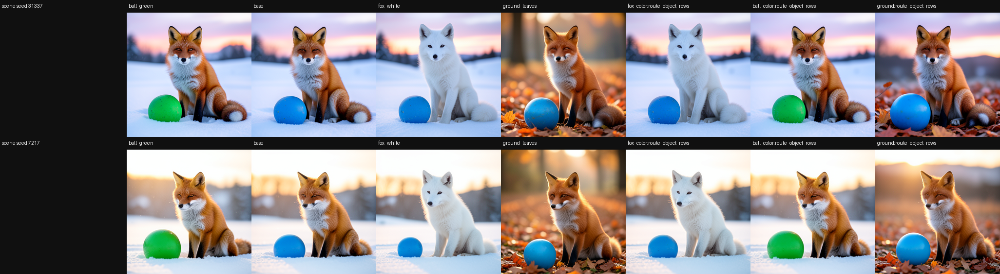
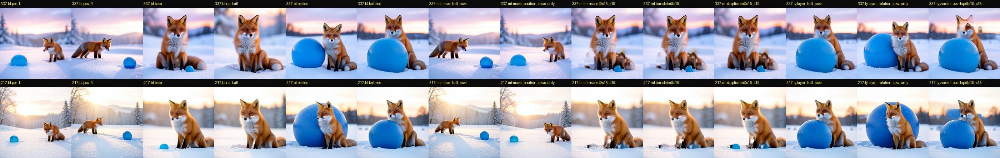
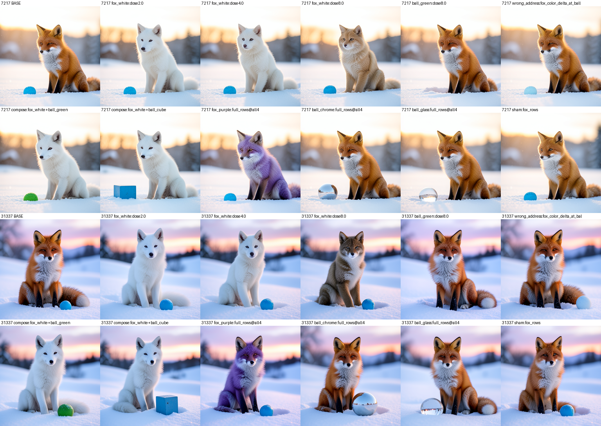
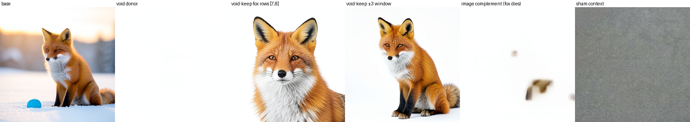
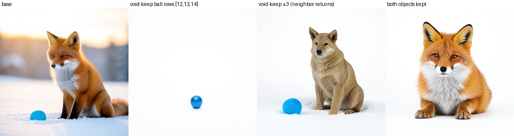
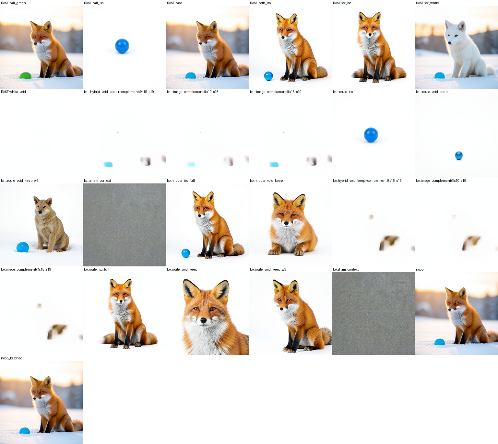
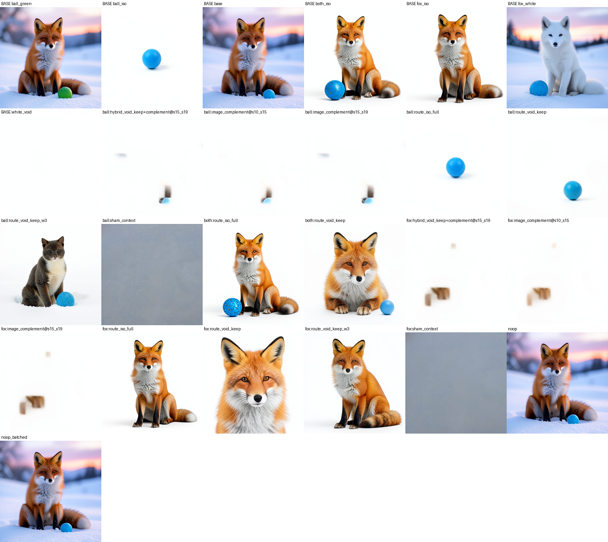

# Semantic Circuit Object Part II: Objects Become Debugger I/O

> [!summary] This integrated experiment turns an image object into an addressable, typed control record. A red fox and a blue ball are first localized to lexical rows and image coordinates, then edited through those addresses, and finally published as a fingerprinted manifest attached to a durable trajectory checkpoint. The stress battery shows row-local property control, route redundancy, useful dose through roughly 4×, out-of-distribution attribute transfer, composition, and payload portability. The isolation battery shows that an object can re-bind alone in a white context through text-route state, while an image-side complement destroys the object. The result is exploratory and limited to one scene family and two seeds, but it is the strongest experiment in this set because it connects discovery, a usable interface, causal edits, durable evidence, and sharply defined failure modes.

## Research question

Can a rendered object be treated like a typed debugger value rather than a vague visual region? A useful answer needs more than a successful recolor. The experiment must identify the object, identify where its information travels, expose the address through a durable interface, show that writes reach the intended consumer, and test what happens when the address is overdriven, applied to the wrong target, combined with another object, or separated from its scene.

This report packages that question as one experiment with three stages. The first stage discovers an inverse map from image regions to lexical addresses. The second stage turns those addresses into a live object registry and runs an edit battery. The third stage makes the registry a typed manifest, maps properties through the full conditioner and route, stress-tests the address, and attempts object isolation. Each stage is fully defined below; the local proof bundle contains the measurements, receipts, registries, and visual panes needed to inspect them.

The two predecessor stages are linked to their local evidence ledgers here: the [inverse object map](../artifacts/objects-debugger-io-structs-stress-isolation/stage-1-inverse-map.json) and the [object registry/edit battery](../artifacts/objects-debugger-io-structs-stress-isolation/stage-2-edit-battery.json). These links stay inside the standalone BFL bundle; the report does not depend on the original notebook posts.

## What the experiment does

The base specimen is a 256×256 FLUX.2 Klein 4B generation from the prompt:

> a photorealistic red fox sitting beside a small blue ball in fresh snow at dawn, soft light

The two objects are useful because they have separate nouns, attributes, and image regions. A donor prompt changes one property at a time, such as red fox → white fox, blue ball → green ball, or ball → cube. The donor and base are run through the same native computation. A branch then replaces only a declared subset of the donor's hidden states into the base trajectory and completes the unchanged suffix.

The transport route is `joint.2 → joint.3 → joint.4 → single.0` on the text stream at all four denoising steps. The route is not treated as a single magic location. The experiment measures lexical rows, route sites, denoising steps, conditioner depth, packed latent blocks, and the final decoded image separately so that a good image cannot hide a wrong address or a wrong consumer.

## How a change is applied

The intervention is a hidden-state splice, not a prompt rewrite and not a weight update. There are three distinct prompt roles:

- The **base prompt** defines the source scene and supplies the parent trajectory that will be edited.
- A **donor prompt** changes one requested property, such as `red fox` → `white fox` or `blue ball` → `green ball`. It is run separately only to obtain the target payload states and, when needed, a native target image for scoring.
- A **control prompt** supplies a sham, wrong object, white-void context, or other negative condition.

For a normal object edit, the operation is:

1. Tokenize the base and donor prompts and verify that the selected lexical rows are compatible. The base prompt remains the source of the branch.
2. Run the base scene once and retain its step-0 trajectory checkpoint. Run the donor condition under the same model, recipe, and seed to obtain donor route states.
3. Resolve the requested object and property through the object struct. For example, `ball.color` resolves to the ball's color row, its route sites, and the steps at which the write is allowed.
4. At those declared route coordinates, copy the donor states for the selected rows into the base checkpoint state. All unselected rows, route sites, image states, and metadata remain from the base parent. A full-object operation can select the object's lexical rows; a relational operation can select a phrase window or the full active state.
5. Replay the unchanged denoising suffix from that intervened state and decode the final image through the native consumer. Compare it with the base, donor target, sham, wrong-address, and collateral ROIs.

In pseudocode, the core operation is:

```text
base_parent = capture(base_prompt, seed)
donor_states = capture(donor_prompt, seed).route_states
address = manifest.resolve(object="ball", property="color")

branch = copy(base_parent)
for site, step, rows in address.route_writes:
    branch.text_state[site, step, rows] = donor_states[site, step, rows]

image = replay_native_suffix(branch)
```

The object struct is therefore an address and evidence record; it is not itself the object payload and it is not mutated as the edit happens. The branch write uses the struct to locate the payload insertion points. The manifest can later be extended with the measured result, but the model weights and the base prompt remain unchanged. The wrong-address control makes this distinction causal: a fox-whitening donor payload written at the ball color row leaves the fox unchanged and whitens the ball.

Object isolation uses the same write primitive with a composite state. A white-void donor supplies every non-object row while the selected object's base rows are kept. The resulting state is intentionally not the hidden state of one ordinary prompt; it is a controlled intervention used to test whether the object's rows can carry identity without the original scene. The image-side isolation control instead writes void donor states into non-object latent blocks, testing whether the image field can preserve the object without text-route support.

An object record contains five kinds of information:

```text
object = {
  lexical: {
    rows: [...],
    attribute_rows: {size: [...], color: [...], material: [...], noun: [...]}
  },
  route: {sites: [...], stream: "text", steps: [...]},
  spatial: {
    blocks_by_seed: {...},
    instrument: "attribute-contrast",
    pixel_bboxes: {...}
  },
  evidence: {measured_edit_scores: {...}},
  properties: {back_map: {...}}
}
```

The manifest is validated and fingerprinted before it is attached to a durable checkpoint. Validation rejects invalid row indices, duplicate or malformed blocks, inconsistent attribute subsets, and token-length mismatches. The sidecar can then be read by an object-inspection command using the checkpoint handle. The in-job readback must reproduce the manifest fingerprint; otherwise the feature is not considered operational.

## Experimental contract

All branches begin from one step-0 trajectory checkpoint per scene and seed. The suffix is replayed in process, so the base, donor, intervention, sham, wrong-address, and continuation branches share a controlled parent. The exact scalar no-op replay is required to have RGB MAD 0.0. The batched approximate contract has a separately measured numerical floor, approximately 0.4–1.5 RGB MAD depending on the job; intervention effects are interpreted against that floor rather than conflated with it.

The tested seeds are 7217 and 31337. The generation uses four denoising steps, guidance 1.0, and the pinned revision named in the front matter. The object masks are derived from attribute contrasts and joined to pixel coordinates through the checkpoint's coordinate manifest. They are instruments, not semantic classifiers. Visual proof panes are therefore primary when a derived ROI scalar disagrees with the rendered result.

The main measurements are:

- **Own-ROI progress:** normalized movement of the object's region toward the native donor target.
- **Selectivity:** own-ROI movement divided by the largest movement in another object's ROI.
- **Locality ratio:** changed-row delta norm divided by the mean delta norm of other active rows at a given conditioner layer.
- **Route progress:** movement toward the native target after writing at one route site, several sites, or all sites.
- **Dose response:** the effect and collateral change as the payload multiplier α varies.
- **Isolation retention:** distance from the base object in its own ROI.
- **Background emptiness:** whiteness and distance from a white-void reference outside the kept object.

## Stage 1: inverse object map ([local ledger](../artifacts/objects-debugger-io-structs-stress-isolation/stage-1-inverse-map.json))

### Setup

The first stage asks whether an image object has a compact lexical address. The base scene is the fox beside a blue ball in snow. Three donor contrasts are prepared: fox red → white, ball blue → green, and snow → autumn leaves. Instead of replacing all 512 text rows, the branch replaces only the rows naming the selected object at every route site and step.

The lexical groups are:

| object | rows | meaning |
| --- | --- | --- |
| fox | `[7, 8]` | `red fox` |
| ball | `[12, 13]` | `blue ball` |
| ground | `[14, 15, 16]` | snow / ground context |

### Results

| branch | seed 7217 | seed 31337 | reading |
| --- | ---: | ---: | --- |
| fox rows only → white fox | 0.92 progress; 13.7× selectivity | 0.94; 9.6× | object-selective |
| ball rows only → green ball | 0.77; 9.2× | 0.65; 8.4× | object-selective |
| ground rows only → autumn | 0.31 | 0.37 | distributed background boundary |
| norm-matched sham | approximately 0 | approximately 0 | not a donor effect |

The fox and ball changes reach the intended object while preserving the other object. The ground contrast is weaker because a background does not occupy one compact region or one compact phrase. This distinction matters: a successful object address is not evidence that every scene property should be row-local.



The exact no-op replay is RGB MAD 0.0. A deliberately batched no-op sits at 0.4–0.8 MAD, two orders below the large object edits. This establishes the first link in the chain: an image region can be mapped back to a small lexical address on the transport route, at least for the tested scene and seeds.

## Stage 2: live object registry and edit battery ([local ledger](../artifacts/objects-debugger-io-structs-stress-isolation/stage-2-edit-battery.json))

### Address representation

The second stage expands an object address into a registry. For the ball, the record is:

```text
ball.SourceAddress = {
  lexical_rows: [12, 13, 14],
  size_row: 12,
  color_row: 13,
  noun_row: 14,
  route: joint.2 → joint.3 → joint.4 → single.0,
  spatial_blocks: 8 of 256 packed latent blocks per seed
}
```

The spatial part is derived from an attribute contrast, such as blue ball → green ball. A presence contrast, such as scene with ball → scene without ball, is retained as a deliberately weaker instrument because removing an object changes the whole scene. In the measured battery, the two spatial instruments have Jaccard agreement of 0.0 on seed 31337 and 0.23 on seed 7217. That disagreement is not hidden: it is the reason the manifest records the instrument and the address-quality caveat.

### Lexical edit battery

Each branch writes the donor's route states only at the target object's rows. The donor differs from the base by the requested property, so the write has a defined semantic payload.

| edit | address | result on seeds 7217 / 31337 |
| --- | --- | --- |
| fox red → white | fox rows `[7, 8]` | progress 0.910 / 0.876; both pass |
| ball blue → green | ball rows `[12, 13, 14]` | both pass; fox retained |
| ball → gray rock | ball rows `[12, 13, 14]` | both pass; a rock replaces the ball |
| ball → blue cube | noun row `[14]` | both pass; geometry class changes |
| ball small → large | size row `[12]` | −0.16 / −0.03; single-row locality fails |

The size negative is informative rather than a contradiction. The native large-ball target renders correctly, and a ±3-row phrase window transfers 0.52–0.63 of the size effect. Size is controllable, but its representation is contextual rather than stored in one isolated row.

Removal uses the spatial part of the address. Writing the no-ball image states into eight late-band latent blocks cleanly removes the ball on seed 7217 with progress 0.822. On seed 31337 the silhouette disappears but a blue-teal residue remains in the fox's paw, with progress 0.685. The address is live, but not yet a minimal or seed-invariant segmentation.


### Movement, layering, and relational context

Whole-scene route writes move both objects coherently when the donor prompt reverses their positions, with image progress 0.906 / 0.871. An occlusion donor flips which object is in front, with progress 0.944 / 0.951. These are genuine route-side re-renders rather than latent cut-and-paste operations.

The image-side cut-and-paste control exposes the cost of a bad spatial address. On seed 7217, ball content is transported to the mirrored location but renders with a ghost and off-manifold fragments. On seed 31337, the presence-derived address points into the fox flank; the write edits the wrong object while leaving the ball untouched. A wrong address can execute cleanly and still be wrong.

Escalating row windows explain the difference between attributes and relations:

| lexical intervention | resize | move | layering |
| --- | ---: | ---: | ---: |
| changed row(s) only | approximately 0 | approximately 0 | −0.16 to +0.13 |
| ±1 row | approximately 0.1 | approximately 0 | 0.03–0.47 |
| ±3 rows | 0.52–0.63 | 0.51–0.60 | 0.13–0.64 |
| all active rows | 0.56–0.81 | 0.74–0.78 | 0.58–0.78 |
| all 512 rows | 0.75–0.96 | 0.87–0.91 | 0.94–0.95 |

Color and noun identity are compact enough for lexical writes. Size, position, and occlusion are relational and draw on surrounding phrase and padding rows. The registry therefore has two different kinds of address: compact property rows and distributed scene-context state.



## Stage 3: typed manifest, deep map, stress, and isolation

### Durable typed I/O

The third stage makes the registry a first-class data object. A manifest is built from the measured lexical rows, route, spatial blocks, coordinate join, and property evidence. It is validated, fingerprinted, attached as a sidecar to a durable trajectory checkpoint, and read back inside the same execution. The recorded checkpoint handle is `ckpt-f3aa206b11363598cb7565d2a3af14fb`.

The readback reproduces the manifest fingerprint exactly. Eleven of eleven manifest tests pass, covering construction, validation, bounding-box joins, tamper rejection, sidecar round-trip, metadata fallback, and missing-manifest errors. This is the feature claim in the experiment: object records are not merely an analysis table; they can be stored with the state that gives them meaning and recovered through the debugging interface.



### Conditioner depth map

The property map traces each contrast through the full 36-layer Qwen3-4B conditioner stack, including the embedding, and compares the changed row against the other active rows. Independent retokenization checks agree on the compared pairs.

| property contrast | final-layer locality ratio |
| --- | ---: |
| ball color blue → green | 17.2× |
| ball material blue → glass | 15.2× |
| ball material blue → chrome | 12.5× |
| fox color red → white | 11.7× |
| ball shape ball → cube | 10.7× |
| ball size small → large | 8.7× |

The ordering predicts the route-side edit behavior: color, material, and noun identity are strongly row-dominant; size is the least local and was the single-row edit failure in the registry. Same-property directions have meaningful but non-identical similarity: glass and chrome have cosine 0.47, while red-white and red-purple have cosine 0.56. Color-versus-material cosines are 0.22–0.29 and cross-object comparisons are near the floor. The conditioner preserves property distinctions while entangling them enough to explain why a row is not a universal independent knob.

### Route redundancy and denoising accumulation

The same fox-color payload is written at each route site separately. Each one of `joint.2`, `joint.3`, `joint.4`, and `single.0` moves the image by roughly half the progress of the full four-site write. The result is route redundancy: the information is not confined to one indispensable site under this intervention.

The denoising-step ladder for fox color on seed 7217 rises approximately 0.08 → 0.20 → 0.43 → 0.47 as later steps are included. Early writes accumulate through continuation; they do not simply disappear after the first denoising transition.

### Dose, OOD attributes, composition, and wrong-address payloads

The dose sweep uses α ∈ {0.25, 0.5, 1, 2, 4, 8}. Progress rises through α 1–2, remains visually coherent at α 4, and collapses at α 8 into semantic drift rather than pixel noise. The overdriven fox is still a coherent animal but drifts toward tan or gray instead of the intended white. Ball edits saturate earlier and leak into the fox ROI more strongly; the most extreme ball branch moves the fox ROI by up to 106 MAD.


Out-of-distribution attributes remain visually meaningful: a purple fox, a transparent refracting glass ball, and a chrome mirror sphere render through the object rows. Simultaneous white-fox + green-ball and white-fox + blue-cube edits render correctly on both seeds. Several ball ROI scalars are as low as −0.30 despite clean panes, reinforcing that derived ROI progress is a diagnostic and not the sole judge of a composition.

The wrong-address control is the sharpest stress result. A red-fox → white-fox payload is written into the ball's color row. The fox remains at sham-level movement, around 1.3–6.3 MAD, while the ball whitens on both seeds. The address selects the target and the payload selects the transform. At the tested row seam, the whitening direction is portable across objects.


### Object isolation

Isolation asks whether the object rows carry an object that can be re-bound into a context with no scene. The donor context is a white background with studio light. The route-side isolation branch writes the void-context states everywhere except the object's own two or three lexical rows. Padding is treated as state, not silently discarded.

The native full-route isolation references provide a ceiling: route-side donor replacement repaints a complete studio isolation image with progress 0.92–1.00 across the tested object/seed cells. The critical branch is the stitched object-row keep:

| strategy | result |
| --- | --- |
| keep only object rows in void context | fox and ball re-bind alone on white on both seeds |
| keep bare rows | identity survives, but pose and composition collapse toward a close-up |
| keep a ±3 phrase window | fox pose returns; ball also pulls back its neighbor and snow context |
| replace 248 non-object image blocks with void | background becomes white, but the object becomes a faint smudge |
| hybrid late image complement | image writes override the route-side keep and suppress the object |
| norm-matched sham context | flat gray field; object dies |
| keep both objects in void context | fox and ball render together on white |





The isolation result is not just “the background got whiter.” The sham context kills the object, so the object survives because the kept rows retain meaningful void-compatible semantics. Conversely, the image-side complement can make the background nearly perfect white while destroying the object. Under this assay, object isolation is a text-route capability; the latent image field does not preserve the object independently of its contextual carrier.





## How the three stages support one another

The inverse map supplies an address from image evidence. The registry proves that the address is live by changing the intended object and retaining controls for shams, wrong addresses, and spatial pollution. The manifest makes the address durable and typed, which turns a one-off analysis into an inspectable interface. The deep map explains why some writes are compact and why relational edits require context. The stress battery tests whether the interface remains useful under dose, novelty, composition, and payload transfer. Isolation then probes the strongest abstraction: whether an object record can stand alone when the surrounding scene is replaced.

The chain also explains the negative results. A wrong spatial address edits the wrong object. A single size row fails even though native size control works. A ±3 window restores pose but leaks neighbors. Image-side complement writes remove context but also remove the object. These are not unrelated failures; they identify the boundary between a lexical property address, a contextual relation address, and a downstream image representation that still depends on the conditioning route.

## What the evidence establishes

**Observation:** object-selective lexical writes move fox and ball attributes while preserving the companion object on two seeds. A validated, fingerprinted object manifest can be attached to a durable checkpoint and read back with an identical fingerprint.

**Convergent trend:** row locality persists through all 36 conditioner layers; final-layer locality predicts which properties are editable by one row; route sites are redundant for property payloads; useful dose extends to about 4×; OOD attributes and two-object composition work visually; wrong-address payloads target the addressed object; and text-route object rows can re-bind objects in a void context.

**Working inference:** the model exposes object-like registers at the text-side route seam. The address identifies a target and the donor delta supplies a transform. Attributes can be compact, while relations and pose are distributed across contextual rows. Image-side latent coordinates are useful for regional effects and deletion attempts but are not a self-sufficient object representation.

## What remains open

This is exploratory evidence for one scene family, two seeds, one pinned model revision, and one 256×256 four-step recipe. It does not establish universal or prompt-independent addresses, minimality of any row or block set, held-out scene or category generalization, clean image-side relocation, certified tiers, or a general object editor. The object manifest is measured and durable for the recorded handle; it is not yet an automatic extractor for arbitrary scenes.

The next decisive tests are held-out scenes and object categories, more seeds, automatic manifest extraction, cross-scene payload transfer, and a composition-preserving isolation instrument that carries pose without carrying neighboring nouns. A successful follow-up would also execute a manifest-resolved edit end to end and compare its output against a native donor target under the same controls.

## Local proof bundle

The standalone Part II proof bundle is [objects-debugger-io-structs-stress-isolation](../artifacts/objects-debugger-io-structs-stress-isolation/README.md). Its [verifier](../artifacts/objects-debugger-io-structs-stress-isolation/verify.py) checks the three stage summaries, the durable manifest fingerprint, receipts, and representative visual artifacts.

Stage summaries:

- [inverse object map ledger](../artifacts/objects-debugger-io-structs-stress-isolation/stage-1-inverse-map.json)
- [object registry and edit battery ledger](../artifacts/objects-debugger-io-structs-stress-isolation/stage-2-edit-battery.json)
- [manifest proof](../artifacts/objects-debugger-io-structs-stress-isolation/manifest-proof.json)
- [deep-map and stress ledger](../artifacts/objects-debugger-io-structs-stress-isolation/stage-3-deepmap-summary.json)
- [isolation ledger](../artifacts/objects-debugger-io-structs-stress-isolation/stage-3-isolation-summary.json)

Run `python ../artifacts/objects-debugger-io-structs-stress-isolation/verify.py` from this directory to check the bundle.
