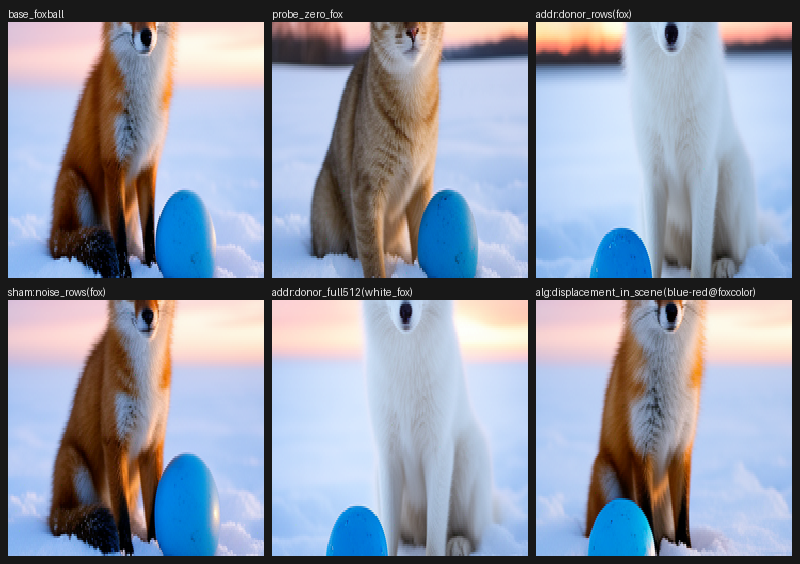
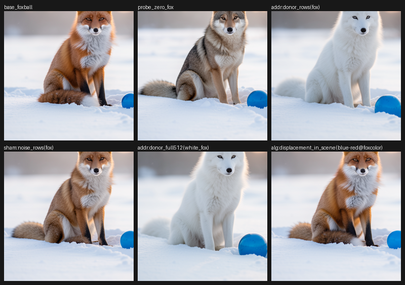
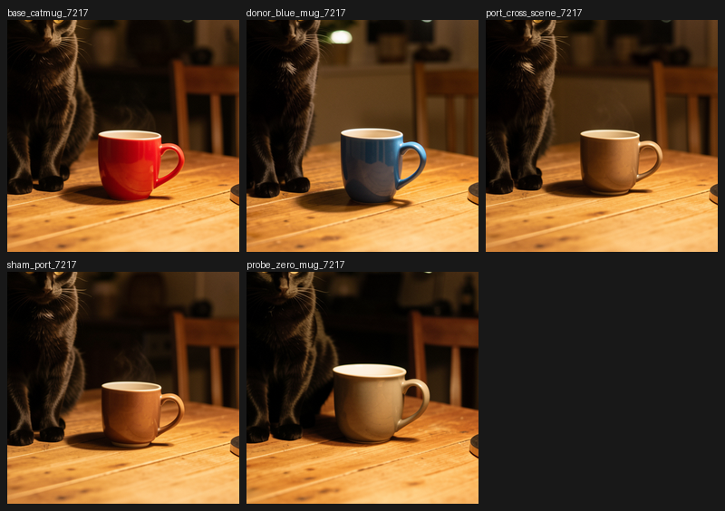
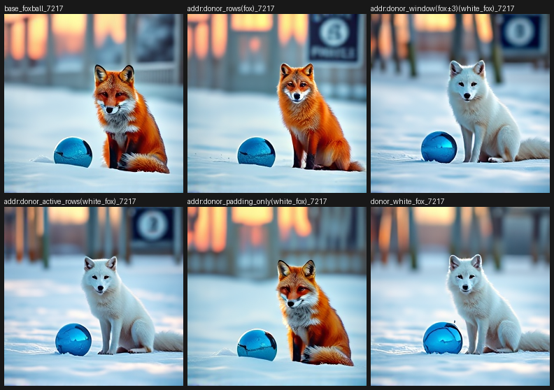
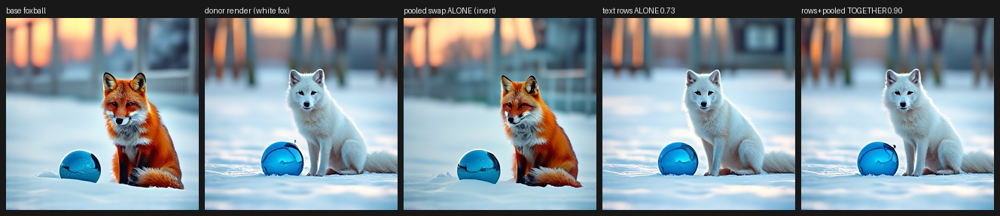
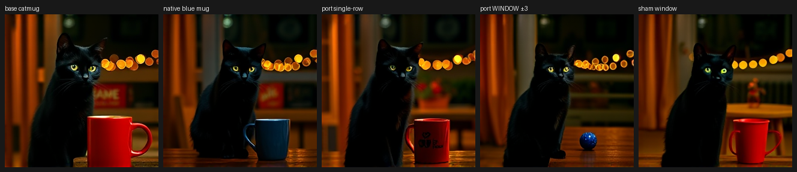
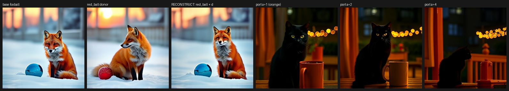
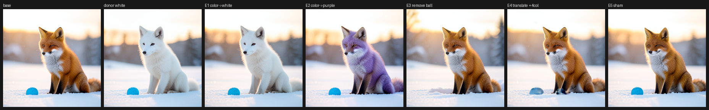
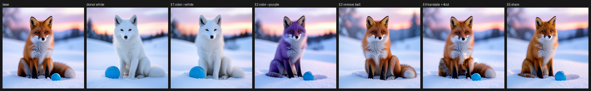
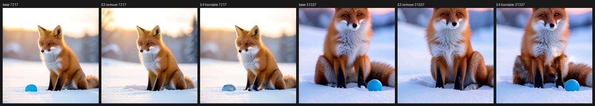

# Semantic Object Registers Across FLUX

> [!summary] The semantic object is present across the tested FLUX models, but it is not one universally portable tensor. In FLUX.2's causal Qwen-conditioned denoiser, object identity and compact properties are carried by sharp lexical register rows: donor writes change the intended object, norm-matched shams stay inert, and a value displacement ports across scenes. In FLUX.1's bidirectional T5 conditioner, the same object survives at noun-phrase-window grain rather than single-row grain. A wrong-object cross-conditioner failure is row-portable in both directions, and a manifest diff can write color or remove an object through the native consumer. The same evidence also gives a useful negative: image-stream coordinate writes do not relocate the ball, and cross-scene T5 attribute algebra rotates into the new context instead of preserving color exactly.

## Research question

The original `semantic-object-registers.md` result was bound to one distilled `FLUX.2-klein-4B` checkpoint at 256², four steps, and guidance 1. It showed a convincing local interface — object rows, a cross-scene displacement, shams, and role backfill — but it did not follow the object through other checkpoints, conditioner families, value-level debugging, or write-back.

The follow-up campaign asks the stronger question:

> Is there a model-facing semantic object across FLUX models, and what parts of that object survive changes in checkpoint, distillation, resolution, conditioner, route, and write mechanism?

Here “object” is operational, not an ontological claim. A useful object must have a measured address, a payload or edit operation, a native consumer, and causal controls. It is not enough for a hidden vector to correlate with a picture. The evidence has to survive a real suffix replay and appear in RGB output, with wrong-address, sham, no-op, and continuation controls where appropriate.

## Cohort and execution contract

| arm | specimen | operating point | evidence question | jobs |
|---|---|---|---|---|
| anchor | FLUX.2-klein-4B distilled | 4 steps, guidance 1 | initial object interface and value algebra | 2026-08-18 predecessor |
| A | FLUX.2-klein-base-4B undistilled | 50 steps, real CFG 4 | family replication at native CFG | `job-17788d5a1b0d` |
| B | FLUX.2-klein-9B distilled | 4 steps, guidance 1, sequential offload | width replication and cross-scene port | `job-638d05dcbff2`, `job-3e1bc534e0eb` |
| C | FLUX.1-schnell, T5 + pooled CLIP | 4 steps, guidance 0 | cross-family addressing grain and route | `job-a676189574d1`, `job-27fef20e82a0`, `job-e920a0e84b37`, `job-ee619dfec24f` |
| D | FLUX.1 value algebra | cut-0 suffix replay | window displacement, pair mining, context rotation | `job-3980f89faa61`, `job-65d315d873dc`, `job-86cb59fb03a0` |
| E | klein-4B cross-conditioner diagnosis | in-job TECM v3 warm start, 900 steps | whether the wrong object occupies the same register | `job-e1ba0cbed889` |
| F | klein-4B struct write | exact single-branch replays | whether the object manifest can drive writes and round-trip | `job-f0edaded5d06` |

Every imaging/replay arm ran on Beast through mrun with one lease and no retries; its exact no-op and determinism gates are 0.0 under the declared scalar contract. Branches replay the native denoiser/scheduler/VAE suffix; visual panes are treated as primary when an ROI scalar is diluted by background or donor-pose mismatch. The complete experiment contract is in the [Saturn preregistration](../../../saturn/experiments/2026-08-19-object-multimodel/PREREGISTRATION.md) and [findings ledger](../../../saturn/experiments/2026-08-19-object-multimodel/FINDINGS.md).

## The result in one view

| question | observation | interpretation |
|---|---|---|
| Does object addressing replicate in FLUX.2? | Yes: white-fox row writes, selective ball edits, role backfill, shams, and blue-mug displacement reproduce on base-4B and 9B. | The register grammar is not specific to one distilled 4B checkpoint. |
| Does it cross the conditioner family? | Yes, but T5 addresses a ±3 noun-phrase window; a single row is sham-level. | The object is present, while the address grain is conditioner-local. |
| Is the wrong object an actual register payload? | Foreign subject rows write a wolf into the native snow scene; native fox rows repair the foreign wolf while leaving the foreign grass scene. | Subject identity and scene context factor across the same object axes. |
| Does value algebra cross? | Yes at the exposed grain. Qwen row displacement ports a blue mug; T5 window displacement ports a blue ball, and pair mining isolates the attribute but lands orange cross-scene. | The algebra is real; T5 coordinates rotate with sentence context. |
| Can the struct write back? | Color→white, color→purple, remove, sham, and durable manifest round-trip work. | The manifest is debugger I/O, not only a readout. |
| Can content-slot coordinates move the object? | No: `translate_blocks(+4 columns)` leaves the ball in place or ghosted. | Position is not established as a writable image-slot field. |

## 1. FLUX.2: the same object grammar across checkpoints

The most direct replication is across distilled klein-4B, undistilled base-4B, and klein-9B. The checkpoints differ in distillation, width, number of blocks, text conditioner width, steps, guidance, and memory strategy. The object tests nevertheless line up:

| property | klein-4B distilled anchor | base-4B undistilled, 50-step CFG | klein-9B, 4-step distilled |
|---|---|---|---|
| subject rows → white fox | yes, 0.92–0.94 | yes, both seeds; 0.888 at seed 7217 | yes, 0.743; sham 0.043 |
| attribute rows → green ball | yes | yes, 0.784 / 0.836 | yes, 0.713; fox collateral 0.074 |
| norm-matched sham | inert | inert, ≤0.13 | inert, ≤0.05 |
| zero subject rows | generic-animal backfill | generic tan animal | whitened/genericized fox |
| `row(blue) − row(red)` → mug | blue mug | blue mug in pane | blue mug; 0.471 vs sham 0.076 |
| scale one color row ×2 | no-op | MAD 0.75 / 0.94 | MAD 0.55 |
| same displacement at fox color row | fox remains red | fox remains red | fox remains red |

This is stronger than “the models have similar activations.” The same intervention grammar reaches the same native image consumer, while the shams and species-prior control separate a semantic write from norm or magnitude effects. On 9B the subject write beats its norm-matched sham by more than 15×. At 50 steps, base-4B has route redundancy: even early joint or `single.0` bands approach the full donor effect. On 9B, joint bands are similarly redundant while `single.0` alone is weaker. Route concentration changes with operating point; the lexical register address remains sharp.







The 9B debug replay matters. The first pass rendered at 256² and made small ROI crops look blurry. Repeating the battery at 512² reproduced the object write and cross-scene mug port with exact gates. The register is carried in the text stream, not defined by the latent grid resolution. The 9B arm is still one seed, so this is a replication trend rather than a broad generalization gate.

## 2. FLUX.1: the object survives, but the address becomes a window

FLUX.1-schnell uses a bidirectional T5 conditioner plus pooled CLIP, rather than the causal Qwen-family conditioner used by the FLUX.2 arms. The locality ladder makes the change legible:

| donor patch | progress, seed 7217 / 31337 | rendered result |
|---|---|---|
| single subject row (`fox`) | −0.05 / 0.03 | red fox unchanged, sham-level |
| noun-phrase window ±3 | 0.56 / 0.63 | clean white fox, ball untouched |
| all active rows | 0.66 / 0.61 | white fox |
| padding rows only | 0.10 / 0.03 | red fox unchanged |
| full 512 rows | 0.71 / 0.78 | white animal, composition shifts |



The same object is therefore not a single-row universal. T5's bidirectional attention smears lexical content across the noun phrase and masks padding rows; the minimal causal address is a local window. The route debug closes the other half of the picture. `joint.2 → joint.3 → joint.4 → single.0` carries 0.6915 image progress, 98% of the all-joint 0.7069 ceiling; the old late-joint prior was simply the wrong route. All 57 text sites rise only to 0.7292, while single blocks alone are near-inert. The remaining jump comes from interaction with pooled-CLIP adaLN state: pooled alone is inert, but rows plus pooled reach 0.895 / 0.876. T5 rows carry the object; pooled modulation carries pose and global composition when the row content matches.



This is the key cross-model distinction: model topology gives a reusable search grammar, but the semantic address and payload are recipient-local. The [multi-model structural tracer](multi-model-structural-tracer.md) found the same coarse address/selector/payload/carrier vocabulary across seven BFL artifacts, while explicitly not claiming aligned bases or portable layer numbers.

## 3. The wrong object is in the same kind of register

The cross-conditioner failure is a useful causal test. A Smol→Qwen TECM compiler produces a clean scene with the wrong object: a gray wolf in grass where the native target is a red fox in snow. The diagnosis uses the object interface rather than a linear probe:

- Copy only the foreign carrier's two subject rows into the native Qwen carrier. A wolf appears in the native snow scene; fox-ROI movement is 0.48–0.59 toward the foreign render on both seeds.
- Copy native fox rows into the foreign carrier. The wolf becomes a red fox while the foreign grass scene stays foreign.
- Repair all active rows. Both fox and snow return, with 0.82 / 0.89 progress versus a 0.003–0.007 norm-matched sham.


The result factorizes the scene: subject identity is in the subject register; scene context is in the remaining active rows. A linear template-residual dictionary cannot identify the foreign subject — every animal score is at or below the unrelated-pair floor — while the native consumer decodes the rows as wolf. The native consumer is the authority. The causal transplant, not carrier-space cosine, tells us what object the register carries.

Prompt-disjoint TECM scheduler closure does not provide a shortcut. Training loss falls 81% on a disjoint panel, but the held-out corgi MAD is 87.6044, essentially the 87.63 of a closure that saw the corgi prompt. The positive result is a per-prompt repair capacity, not a general semantic compiler. This negative is part of the object claim: a register can exist in the native model even when an attempted cross-conditioner compiler cannot generalize it.

## 4. Value-level algebra: the carrier changes the grammar

The value-level question is whether the register is only a slot for donor copying, or whether values can be read, transformed, and written. On FLUX.2, the answer is yes:

```text
d = value_foxball[row("blue" of ball)] - value_foxball[row("red" of fox)]
value_catmug[row("mug" color)] += d
```

The cross-scene result is a blue mug, while a norm-matched displacement sham is inert. The operation reads two native values, subtracts them, and writes the result into a different object's register; no blue-mug prompt is used as the requested edit.

FLUX.1 needs a window-sized version. A ±3 displacement mined within the foxball prompt is real and sham-controlled (mug ROI 0.438 versus 0.164), but it turns the red mug into a blue ball. The “blue” window also contains the “ball” rows: on T5, the portable quantum is the noun phrase, not the attribute.



Pair mining fixes identity drag. A donor prompt that differs only in `blue ball` → `red ball` cancels the neighboring noun content, and the cross-scene mug remains a mug. The color lands orange rather than blue, so the final debug arm separates dose from coordinate rotation:

- In the native red-ball context, the pair direction reconstructs the blue ball essentially exactly (image progress 0.633).
- In the foreign mug context, α=1 lands orange, α=2 turns the mug white, and α=4 degrades the scene; blueness never increases.



The working inference is context rotation in bidirectional T5 coordinates. Value algebra is not Qwen-only, but exact cross-scene attribute portability is conditioner-dependent. This is a positive result with a precise boundary, not a failure of the semantic object.

## 5. The struct writes back

The object manifest began as a read-side record: lexical rows, attribute rows, route sites, spatial blocks, evidence, and checkpoint fingerprint. The struct-write arm asks whether a generic executor can consume a manifest diff and republish the edited object record.

The job reads the parent durable manifest from MinIO (`ckpt-f3aa206b11363598cb7565d2a3af14fb`), applies edits without hand-written row lists in the arm code, replays the native suffix, and publishes the E1-edited manifest as `ckpt-c1d07348cadc709c23a7567f326935e8`. The object-manifest fingerprint read back identically. The full battery of roughly 18 exact-contract replays took 34.5 seconds.

| manifest diff | result, seed 7217 / 31337 |
|---|---|
| `fox.color: red → white` | white fox; fox-ROI 0.838 / 0.745; ball untouched |
| `fox.color: red → purple` | fully purple fox on both seeds, including OOD word; one ROI scalar lied at −0.106 |
| `remove ball` | ball deleted; snow continues; ball-ROI MAD 76.1 / 134.3 |
| norm-matched `sham_property` | inert; fox stays red |
| `translate ball blocks +4 columns` | measured negative; ball stays or ghosts near its original position |





The coordinate negative is informative. The executor moved image-stream content between packed latent slots at four route sites, but the ball did not relocate. On seed 7217 clipping made the write partial; on seed 31337 all eight target blocks were valid, yet the ball remained in place. The simplest current account is that position is pinned by latent-id/RoPE geometry and downstream blocks that were not patched. This is not a proof that position cannot be edited; it is evidence that content-slot relocation is not the position write primitive.



## What “semantic object” means here

The cross-model evidence supports a typed, causal interface rather than a single portable vector:

| object component | measured carrier | portability boundary |
|---|---|---|
| subject identity and compact properties | sharp Qwen rows; T5 noun-phrase window | address grain follows the conditioner |
| native-consumer route | early joint route plus checkpoint-local later blocks | ordinal routes are topology-local, not aligned layers |
| global pose/composition | pooled-CLIP adaLN interaction with T5 rows | pooled state is not an object identity by itself |
| value transform | row displacement on Qwen; window displacement on T5 | cross-scene T5 attributes rotate with context |
| existence/backfill | row zeroing and native suffix continuation | subject deletion backfills a role; attribute-object removal can be clean |
| spatial position | not established by image-token slot relocation | latent-id remapping or another position carrier remains open |

The object is therefore a bundle: address, payload, writer, route, consumer, and evidence contract. The bundle can be carried across models as a research abstraction, but the recipient must be freshly localized and validated. The model-family structural grammar helps choose where to look; it does not license copying a layer number, tensor basis, or manifest between recipients.

## Claim boundary

**Observation:** Across the tested FLUX.2 checkpoints, controlled lexical-row interventions repeatedly change the intended object, norm-matched shams are inert, cross-scene Qwen displacement produces a blue mug, and the fox resists the same displacement at its species-prior-backed row. FLUX.1 shows the same native-consumer object effect at noun-phrase-window grain. Foreign subject rows and native repair rows are causal in the wrong-object diagnosis. Struct property edits and removal work; coordinate translation does not.

**Convergent trend:** A semantic object is present across the tested FLUX models as a consumer-closed, addressable state interface. Its representation is not identical across models: causal Qwen conditioning exposes sharp lexical registers, while bidirectional T5 exposes context-smoothed noun-phrase windows. Address, payload, route, pooled modulation, and spatial position are separable planes.

**Working inference:** The semantic object is best understood as a typed register contract — producer/source address → carrier → writer → native consumer → image behavior — rather than as a single universal hidden-state direction. A model can preserve the object grammar while changing the address grain and the carrier geometry.

**Terminal status:** convergent portability trend across three FLUX.2 checkpoints and one cross-family FLUX.1 conditioner, with exact replay gates, sham controls, causal transplants, value-level edits, and a durable struct round trip. This is not a universal object-algebra certificate or proof of a shared basis across FLUX families.

**Not established:** arbitrary-prompt or arbitrary-resolution generalization; klein-9B beyond the tested seed/panels; universal single-row addressing on non-Qwen conditioners; exact cross-scene attribute algebra on T5; a writable position field; donor-free struct property edits; or general prompt-disjoint cross-conditioner compilation. Struct property donors are synthesized from the requested diff, so those edits remain donor-backed.

## Local proof bundle and reproduction

The compact evidence bundle is [semantic-object-registers](../artifacts/semantic-object-registers/README.md). It contains the copied run receipts, proof panes, the corrected visual strips, and a receipt-level verifier. Run `python ../artifacts/semantic-object-registers/verify.py` from `research/bfl/demos/`.

Representative proof artifacts:

- [FLUX.2 base-4B row write](../artifacts/semantic-object-registers/zoom-fox-base4b-seed31337.png) and [9B 512² proof sheet](../artifacts/semantic-object-registers/proof-sheet-foxball-9b-512-seed7217.png)
- [FLUX.1 locality ladder](../artifacts/semantic-object-registers/locality-strip-flux1.png) and [rows + pooled interaction](../artifacts/semantic-object-registers/rows-pooled-interaction-strip.png)
- [wrong-object causal diagnosis](../artifacts/semantic-object-registers/xcond-diagnosis-strip.png)
- [window algebra](../artifacts/semantic-object-registers/window-algebra-strip.png) and [context-rotation debug](../artifacts/semantic-object-registers/pure-color-debug-strip.png)
- [struct-write battery](../artifacts/semantic-object-registers/struct-write-strip-seed7217.png) and [coordinate negative](../artifacts/semantic-object-registers/zoom-ball-remove-vs-translate.png)

The full per-branch reports remain immutable at the corresponding `saturn/results/` paths: `object-multimodel-flux2`, `object-multimodel-flux1`, `object-xcond-diagnosis`, `object-struct-write`, and `rosetta-cross-family-manalysis/tecm-scheduler-closure`. The bundle README maps each local receipt to its source job.

Related context: [Semantic Circuit Objects](semantic-circuit-object-interface.md), [Objects Become Debugger I/O](objects-debugger-io-structs-stress-isolation.md), and [Multi-Model Structural Tracer](multi-model-structural-tracer.md).
