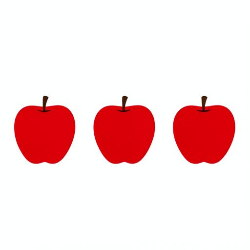
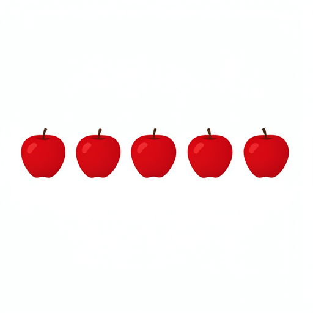

# Small, targeted repairs in a distilled FLUX.2 model

## What we found

A 104 KB, rank-8 write placed at one block, one denoising step and one dose turns a counting
mistake in the distilled four-step FLUX.2 Klein model from **three red apples into five**, and it
keeps working in a fresh process with the full model that supplied the diagnostic signal made
unavailable on disk. The same localized-write recipe repairs an object's shape — a closed green
coil becomes an open S-shaped snake, progress **0.90**, with zero topology holes — and a separate
pair of panels shows the model composes two edits with a large term that plain addition misses
(**0.90 vs 0.40** progress). Two honest limits travel with these wins. The counting patch
over-fires: it visibly rewrites **48%** of ordinary non-counting prompts. And the first learned
"composition compiler" we built **lost** to simple vector addition on held-out edits
(**0.716 vs 0.735**). These are tightly controlled existence proofs and one clean negative, not
shippable modules.

## Why it matters

Activation patching and causal tracing (Meng et al. 2022, ROME; Wang et al. 2022, IOI) localize a
behavior by overwriting hidden states and reading an internal metric. We instead hold every edit to
the final rendered image — the real denoiser, scheduler and VAE decoder judge it — and we make the
edit a small, saved, frozen object with a hash and a declared insertion point, closer to a Git-style
patch than to a probe. The counting study adds a question those papers do not ask: can a capability
weakened by step distillation be restored *after the fact* with a recipient-local write, without
retraining and without shipping the model that diagnosed the gap. Prompt-to-Prompt (Hertz et al.
2022) and SDEdit (Meng et al. 2021) steer images through text or noise; we edit hidden-state rows
directly and measure whether the unchanged model uses them.

## Setup

Two checkpoints of the same 4B model: the **distilled recipient** (`black-forest-labs/FLUX.2-klein-4B`,
revision `e7b7dc27…`, four steps, guidance 1) and a **full-capacity reference**
(`black-forest-labs/FLUX.2-klein-base-4B`, revision `a3b4f484…`, 50 steps, guidance 4). A *donor*
supplies a state difference; the *recipient* is the frozen model we edit, from a *source* state
toward a *target*.

- **`joint.i` / `single.i`** — the *i*th dual-stream (joint) block and the *i*th merged
  single-stream block of the FLUX transformer.
- **route** — a chosen set of block outputs, at chosen denoising steps, that we read from and write
  to.
- **rank-8 write** — a low-rank update added to the hidden state at a named block, step and stream
  (text or image); a scalar *dose* α scales it, α = 0 is an exact no-op.
- **progress P** = 1 − MAD(I, I_target) / MAD(I_source, I_target): P = 0 is the source image, P = 1
  the target (MAD = mean absolute pixel deviation).

| study | resolution | steps | what is edited | what is scored |
|---|---|---|---|---|
| counting patch | 512² | 4 | one rank-8 write at `joint.2`/text/step 0 | red-object count in pixels |
| base↔distilled seam | fixed scalar config | 0–3 | rank-8 write, best of 32 seams | connected-component count |
| snake topology | 256² | 4 | typed route `joint.2→joint.3→joint.4→single.0` | progress P to open-S target |
| composition | 256² | 4 | interaction residual on the same route | progress P to the native joint edit |

## Results

### 1. A counting patch that works — and over-fires

*A frozen rank-8 write turns three apples into five and survives a donor-free fresh process; a
sealed safety gate then shows it transfers but is not collateral-safe.*

The task is deliberately narrow and pixel-visible: render exactly five separate red apples in one
row. Under an independent connected-component evaluator the reference model is exact on all eight
apple cells (1.000) while the distilled model is exact on 4/8 (0.500); a second geometry evaluator
reads 5/8 (0.625). The gaps are 0.500 and 0.375, and the internal route state separates the
trajectories (route cosine falls from ≈0.923 to 0.818) — a neighborhood, not a unique block.

The patch is a rank-8 write at `joint.2`, text stream, step 0: **55,297 FP16 parameters,
104,044 bytes**, hash `f4c49f07a4a19ec689528274822c3585686f00f8b33bff9ca1ca2b91c62d4e83`. It
carries no donor logits, no donor activations and no prompt table. Dose is chosen by running each
candidate through the real decoder and counting apples — and the useful window is non-monotonic:

| dose | 0.25 | 0.50 | 1.00 | 2.00 | 4.00 |
|---|---:|---:|---:|---:|---:|
| apples | 3 | 3 | 3 | **5** | 3 |

Dose 2 is accepted; dose 4 is rejected and the prior state restored exactly. The full control panel:

| branch | result |
|---|---|
| full-capacity reference | 5 apples |
| distilled native | 3 apples |
| distilled + patch | **5 apples** |
| patch at wrong step | 3 apples |
| zero-dose patch | 3 apples |
| uninstall / zero-dose output | byte-exact native output |
| separate preservation prompt | both branches count 5 |
| fresh process, donor path unavailable | **5 apples** |

The fresh-process cell is the serving proof: a new recipient-only process, the donor path pointed
at an unavailable location, still renders five. Nothing silently reloads the full model.

A later **sealed generalization-and-safety gate** expands the test. The repair *transfers*: across
six paraphrases, three held-out seeds, resolutions 256/512/1024, three object families and 6/6
donor-free serving cells, exact-count performance rises from **37% to 72%** on the expanded panel
(+33 points at 1024 px). But the **collateral gate fails**: a binary count detector fires on
**58/120 ≈ 48%** of ordinary prompts, p95 RGB-MAD **41.5** against a ≤ 6.0 bound. The post-mortem is
the useful part — the detector tracks *rendering style*, not object count (style correlation
**0.928**, object-multiplicity correlation **0.029**). The patch repairs the declared capability and
generalizes beyond its first specimen, but the patch-plus-detector pair is not a safe general hotfix.

### 2. Where base and distilled split

*A sealed base "future" plus a 32-seam search picks one early seam; the fix reproduces three of
four discovery cells but transfers to only one of four held-out counts.*

Here the base checkpoint is used **only** as a sealed donor — never loaded during repair, never
consulted for the held-out answer. It renders three red squares and five blue circles for
discovery, four red squares and six blue circles for held-out evaluation, at seeds 31337/31339. The
distilled recipient then searches 32 candidate seams (four blocks × four steps × two streams) for a
single rank-8 repair. The search selects **`joint.2 → step 0 → text`** (discovery scores: `joint.2`
0.500, step 0 0.606, text 0.738 vs image 0.475). Held-out:

| held-out prompt, seed | expected | repaired | exact |
|---|---:|---:|---|
| four red squares, 31337 | 4 | 4 | yes |
| four red squares, 31339 | 4 | 3 | no |
| six blue circles, 31337 | 6 | 5 | no |
| six blue circles, 31339 | 6 | 4 | no |

That is **1/4** held-out exact (and 3/4 discovery cells reproduced), with suffix checkpoint replay
at RGB-MAD **0.0**. The blue-circle misses matter: a count-only score cannot certify a semantic
repair, and the family-dependent failure points to a path that one rank-8 coordinate-local write
does not fully restore.

### 3. Rewiring a shape: coil to open S

*A four-block typed route turns a closed green coil into an open S-shaped snake, progress 0.9008,
zero topology holes, with a full control battery.*

At 256², four steps, on the route `joint.2 → joint.3 → joint.4 → single.0`, a donor-derived state
difference applied at just those four sites moves a closed green coil toward an open S-shaped snake.
Full dose reaches progress **0.9008** (target MAD 4.53), an open shape and **zero** holes; half dose
only 0.1884. Route ablation reaches −1.0 (stays coiled, keeps a hole), and a wrong-axis route reaches
0.2716 and never recovers the green. The route generalizes to held-out seeds (0.8344, 0.8943). One
instrument caveat: an early gallery's S-curve donor was itself coiled and so was not a valid target;
the corrected target-native panel is the evidence.

### 4. Composition is non-additive — and the learned mixer still lost

*The model's joint edit is far from the sum of its parts; a 32-parameter learned compiler trained
to synthesize the missing term lost to plain addition on held-out pairs.*

For edits A and B, additive composition predicts the pair as Δ_A + Δ_B, so the **interaction
residual** is I_AB = Δ_AB − Δ_A − Δ_B. Across three edit pairs and two seeds (102 branch replays in
one resident model), the native joint edit reaches progress **0.901** while the additive estimate
reaches only **0.396**. Injecting the residual at the route and sweeping its dose gives a
rising-then-falling curve — **0.568, 0.697, 0.821, 0.901, 0.8175** at doses 0.25/0.5/0.75/1.0/1.25
— with controls far below: wrong-time 0.657, wrong-site 0.433, sign-flip 0.266, norm-matched sham
−0.401. A second, independent panel (lighting × color, seeds 52013/52019) reproduces the effect:
additive ≈ 0.596, residual at dose 1.00 ≈ 0.894, residual-alone ≈ −0.030 (the residual is not a
replacement for the first-order edits).

So the residual is real, causal and dose-sensitive. Then we tried to *synthesize* it. A 32-coefficient
mixer trained on two discovery pairs (lighting × identity, weather × fur) proposed 32 updates,
promoted 9 and rejected 23 with exact rollback — and on two pair-disjoint held-out pairs it **lost**
to the additive baseline:

| method | progress to native joint | return progress | return alignment |
|---|---:|---:|---:|
| additive delta sum | **0.735** | 0.860 | 0.881 |
| learned nonlinear mixer | 0.716 | 0.840 | 0.864 |
| native joint reference | 1.000 | 1.000 | 1.000 |

The learned compiler was worse than addition. Interaction structure is conditional on route,
denoising time and edit identity, so a global low-parameter algebra is under-specified — not a proof
that learned composition is impossible, but a clean rejection of this feature set, split and
32-parameter compiler.

## Controls

- **Zero dose / uninstall** — byte-exact native output; the machinery itself changes nothing.
- **Wrong step / wrong site / wrong axis** — weakens or kills the effect; time and address are specific.
- **Sign flip** — suppresses or redirects the effect; direction matters.
- **Norm-matched sham** — a random write of equal energy moves *away* from target; energy alone does
  not explain the gain.
- **Fresh donor-free process** — the counting repair fires with the donor path unavailable; no silent
  reload of the full model.
- **Held-out seeds** — the snake repair recovers on unseen noise; not one realization.
- **Suffix checkpoint replay (RGB-MAD 0.0)** — deterministic under the declared contract.

## Limits and open questions

| limitation | status |
|---|---|
| Counting patch over-fires | Fires on 58/120 (≈48%) ordinary prompts, p95 RGB-MAD 41.5 vs ≤6.0; it tracks rendering style (corr 0.928) not object count (0.029). Needs style-balanced negatives and a two-feature abstain rule. |
| Counting patch is a count-5 attractor | It repairs the count-5 class, not a count-preserving operator across N (a count-7 serve rendered 5). |
| Patch portability | Bound to the tested distilled revision, route, stream, step and numerical interface; the base checkpoint only diagnoses the gap. |
| Seam repair generalizes poorly | 1/4 held-out counts; a count-only evaluator cannot certify a semantic repair; likely a family-conditioned path beyond one rank-8 write. |
| Snake donor caveat | The invalid early coiled S-curve donor is kept as an instrument-quality note; result holds for the pinned Klein 4B recipe only, not a universal topology editor. |
| Learned composer | Failed on this feature set, split and seed; does not show learned composition is impossible, and claims no semantic ownership of the residual. |
| Scope | All four are native-consumer trends on pinned Klein 4B checkpoints, not portable modules. |

## Reproduce and inspect

- Counting patch — [bundle](../artifacts/recipient-native-capability-patch/): `gap-report.json`,
  `patch-report.json`, `act-package.npz`, `dose-2-grid.png`, `generalization-gate-results.md`,
  `verify.py`.
- Base↔distilled seam — [bundle](../artifacts/klein-seam-bisection/): stage reports, receipts,
  `verify.py`.
- Snake + interaction — [bundle](../artifacts/typed-snake-topology-interaction/): `report.json`,
  `interaction-residual-analysis.md`, `verify.py`.
- Composition compiler — [bundle](../artifacts/nonlinear-interaction-compiler/): `mixer-report.json`,
  `interaction-report.json`, `verify.py`.

Each `verify.py` checks the package hash and the reported evaluator and control facts; run it from
`demos/`. Additional internal run logs are available on request.
