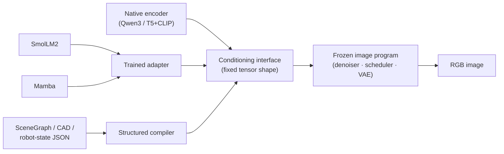
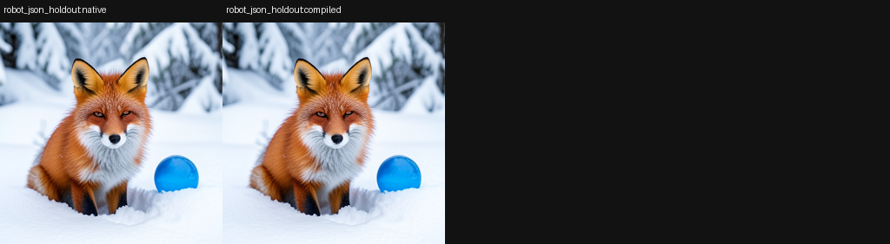
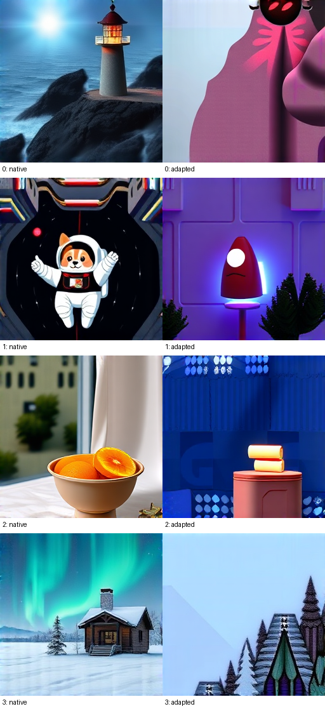
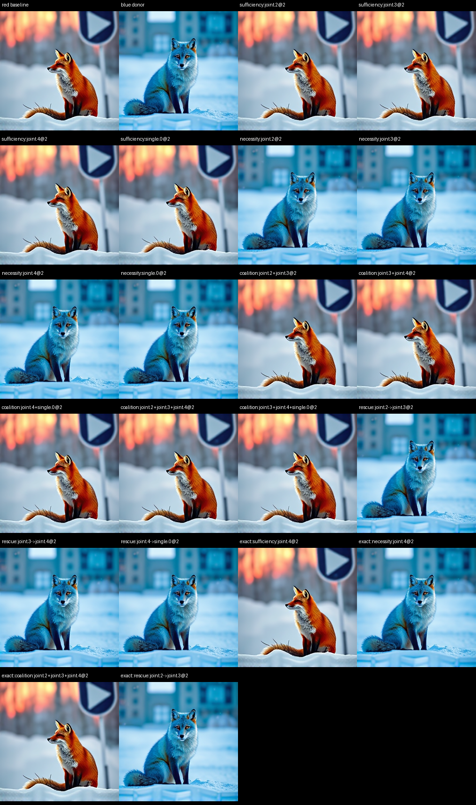

# Swapping the text encoder of a frozen image model

**What we found.** A FLUX image generator — denoiser, scheduler, latent process and VAE
decoder — is a self-contained program whose only semantic input is a fixed-shape conditioning
tensor from a text encoder. We froze that program byte-for-byte and replaced its native encoder
with foreign language models (SmolLM2-1.7B, a transformer; Mamba-1.4B, a state-space model)
through small trained adapters, and separately fed structured inputs (scene graphs, CAD,
robot-state JSON) directly. The foreign-driven images come out sharp and coherent — but often of
the wrong thing. The decisive control settles where the fault is: writing the *complete* native
conditioning tensor into the foreign branch and running the unchanged program recovers the
byte-identical native image — 100% of the pixel distance — from both foreign checkpoints. The
entire defect lives in one argument, the conditioning tensor, not in the image program. Held-out
semantics, however, remain incomplete: foreign-encoder held-out direction cosine to native is
only 0.02–0.06, and a structured-input frontend scores held-out progress from −0.299 to 1.000
(mean 0.364).

| Native FLUX.2 (Qwen3) | SmolLM2 adapter | SmolLM2 branch + native conditioning donated |
|---|---|---|
|  |  |  |

*Figure 1. One held-out prompt ("a photorealistic blue fox sitting in fresh snow at dawn"),
same seed, same frozen program. Left: the native encoder renders the fox. Middle: the SmolLM2
adapter renders a clean, coherent, unrelated object. Right: donate the native encoder's full
conditioning tensor into the SmolLM2 branch and the exact native fox returns — the generator was
fine all along.*

## Why it matters

Activation patching and causal tracing (Meng et al. 2022, ROME; Wang et al. 2022, IOI; Vig et
al. 2020, causal mediation) move single states *within* one model; image editors like
Prompt-to-Prompt (Hertz et al. 2022) and SDEdit (Meng et al. 2021) steer through the native
prompt path. We instead replace an entire upstream subsystem — the text encoder — across
architecture families (transformer, state-space model, structured JSON), keep everything
downstream byte-identical, and localize the failure by repairing it with graded portions of
native state. The point is the clean split between "the adapter produced legal state" and "the
program read it as the intended prompt."

It also yields a sharp, portable instrument warning. The native conditioning state is a large
prompt-*invariant* scaffold (positional and template structure shared by every prompt) plus a
small prompt-*specific* residual. The scaffold alone — the mean native state across prompts —
matches held-out prompts at cosine ≈ 0.997 and renders a coherent wrong image; a bridge trained
to match the native state reaches held-out cosine 0.996 yet renders essentially the same wolf for
fox, blue-fox, cat and corgi (its semantic-direction cosine: 0.139). A channel-wise normalization
"repair" that *raised* whole-state cosine to 0.946–0.962 made images strictly worse. **Any
evaluation of learned state translators, distilled encoders, or embedding bridges that reports
global similarity on states with shared structure should be presumed uninformative until a
semantic-contrast test is run** (cf. Zhang & Nanda 2023 on patching metrics).

## Setup

We change one boundary and freeze everything behind it.

**Terms, defined once.** `joint.i` is the *i*-th dual-stream (joint) block; `single.i` is the
*i*-th merged single-stream block. A **register** is a saved slice of hidden state we can read and
write (e.g. the scheduler's return register, handed to the next step). The **route** we probe is
the text-stream state at `joint.2`, `joint.3`, `joint.4` and `single.0` across the four denoising
steps, feeding the scheduler return register and the VAE. **Donor / recipient** = the arm
supplying / receiving state.

**Progress score.** `P = 1 − MAD(I, I_native) / MAD(I_start, I_native)`, where `I_native` is the
native-encoder render and `I_start` is the arm's own starting image (the foreign render, or the
no-intervention baseline). `P = 0` is the starting image, `P = 1` is the exact native image, and
`P < 0` is worse than the start. "Rescue" and "fraction rescued" are the same quantity.

| | FLUX.2 Klein 4B (primary) | FLUX.1 Schnell (extension) |
|---|---|---|
| Revision | `e7b7dc2…` | `741f7c3…` |
| Native encoder | Qwen3 → `[512, 7680]` | T5 `[512, 4096]` + pooled CLIP `[768]` |
| Transformer blocks | 5 joint, 20 single | 19 joint, 38 single |
| Transformer params | 3,876M | 11,891M |
| Denoising steps | 4 | 4 (256×256, guidance 0.0) |
| Foreign encoders | SmolLM2-1.7B, Mamba-1.4B | SmolLM2-1.7B |
| Adapter params | 14,966,272 (output-fit); 21,074,176 (image-trained) | 14,378,496 |
| Frozen | denoiser, scheduler, latent init, VAE | same |

Adapters are banks of learned output-slot queries that cross-attend into the source model's
hidden states (700 steps against the native encoder's outputs); FLUX.2 runs in
FP8 with sequential CPU offload on one CUDA GPU. Every intervention is an exact scalar
checkpoint-resume, and all no-op replays reproduce the full native run at zero RGB MAD.

## Results

### 1. A frozen image program with a swappable encoder (FLUX.2)

*Takeaway: foreign encoders drive clean images, and the full-state donation localizes the whole
fault to the conditioning tensor.*

Both foreign arms produce sharp, well-formed images of the wrong things. On the held-out prompt
"a lighthouse in a storm…", the native arm renders the lighthouse; the Mamba arm renders a clean
sidewalk-and-planter scene. Flattened-RGB cosine between the two arms is 0.81 (mean absolute pixel
difference 84.0) — respectable pixel statistics with no prompt fidelity.

A repair panel of twenty causal branches (plus four exact duplicate controls) restored subsets of
the native conditioning state into the foreign arms. Partial repairs fail or barely help: the best
partial arm recovers 7.6% of pixel distance, several normalization transports make things *worse*,
and half the native state recovers only 23–31%. The full native state recovers 100%, the
byte-identical image, from both foreign checkpoints (Figure 1). The defect is distributed across
all 512 positions, including the 484 beyond the tokenizer's active range, which turn out to be
contextualized query states rather than inert padding.

The route is present but starved. Under the SmolLM2 arm, feed-forward output separation on the
red-fox/blue-fox contrast is 36.66 native vs 0.86 foreign (~43× damped), downstream attention
amplification is ~5× weaker, and final image contrast is ~6× weaker (pixel difference 70.95 native
vs 11.42 SmolLM2; Mamba 26.99, ~2.6× weaker). Edge-mediation rescues stay positive (.78/.72/.53
foreign vs .977/.970/.931 native) and per-step separation recovers to 71% of native by the last
step (0.039 → 5.255 foreign vs 0.411 → 7.409 native): the machinery runs, fed a starved,
misaligned payload (held-out direction cosine to native 0.02–0.06).

### 2. Where the native semantics live: donor panels

*Takeaway: the recoverable payload is a complete late-route tensor, not a compact lexical slot,
and it is family-specific.*

A 72-coordinate panel (route × 4 steps × stream) captured Qwen3, SmolLM and Mamba on one frozen
Klein suffix for a held-out "two blue foxes, snow → space" pair. Compact token/channel
intersections rescued near zero, and a full native-site donor at a *single* boundary was also weak
here (Mamba 0.010, SmolLM 0.122). The strong effect came from the native state at the selected
late site applied across all steps: rescue 0.821 (Mamba), 0.935 (SmolLM). Same-value and
norm-matched shams separated cleanly from the donor, so energy alone does not explain the move.

The original closure panel (`job-7729cd53b6ff`, red fox "snow → lunar plain" pair) shows the same
pattern. Donating the full native text state at `joint.4` across all steps removed 75.1% of the
SmolLM2 gap and 81.7% of the Mamba gap. Stable-channel and lexical-slot subsets of that same state
removed at most 5.4%. Donating text and image streams together closed the gap exactly (1.000), as
expected for a complete-state transplant. [Closure analysis and images](../artifacts/cross-compiled-conditioner/semantic-bridge-closure-job-7729cd53b6ff/analysis.md).

A second held-out panel (blue-fox prompt, seed 7218; 12 checkpoints, 80 intervention branches, 12
exact no-op replays, 92 evaluations; `job-36639a716923`) replaced the complete late return at one
boundary with the same-step native return:

| Foreign family | Baseline RGB-MAD to native | Native-donor RGB-MAD | Fraction rescued |
|---|---:|---:|---:|
| SmolLM2-1.7B | 82.3186 | 23.4780 | 71.5% |
| Mamba-1.4B | 83.1801 | 23.9645 | 71.2% |

Nulling that same late return is strongly causal (RGB-MAD changes by 46.18 for Smol and 69.00 for
Mamba at `joint.4`), and the effect is time-dependent (step-2 donor distances 38.16/35.38; step-0
much farther at 53.44/45.33). A complete native return is an *oracle* payload, though — it shows
the recipient can consume the right state, not that the adapter can construct it. One follow-up
narrows the gap: a rank-40 bridge let SmolLM2 features *author* anchored symbols (lion, wolf) at
progress 0.523–0.810, matching the native-direction control within ±0.01 (shams −0.56–0.18), while
unanchored symbols stay at sham level.

### 3. Consumer-closed repair: seen prompts repair, held-out does not (FLUX.2)

*Takeaway: training the adapter through the real denoiser and scheduler repairs seen prompts
strongly but moves a fully held-out prompt only slightly.*

The image-trained mapper, fitted against the final image (21,074,176 parameters) trains against the real frozen transformer and
FlowMatch continuation rather than stopping at an embedding loss (scheduler parity: max absolute
error 0). Against the pre-closure mapper it improves the three seen prompts by a mean 33.6831
RGB-MAD points but the held-out corgi by only 8.5993:

| Prompt | Split | Pre-closure MAD | Closed MAD | Improvement |
|---|---|---:|---:|---:|
| Blue fox | seen | 64.2505 | 29.5398 | 34.7108 |
| Cat | seen | 74.4253 | 37.6073 | 36.8180 |
| Fox | seen | 70.4207 | 40.9002 | 29.5205 |
| Corgi | held out | 96.2340 | 87.6347 | 8.5993 |

| Native (seen fox) | Repaired (seen fox) | Native (held-out corgi) | Repaired (held-out corgi) |
|---|---|---|---|
|  |  |  |  |

*Figure 2. The repair reproduces the seen red fox closely (left pair) but turns the held-out
"astronaut corgi in space" into a different dog on a beach (right pair): a compiler can repair a
recipient's trajectory for seen semantics without learning a prompt-disjoint translation.*

### 4. Structured inputs instead of text (FLUX.2, no words)

*Takeaway: typed state compiles directly into the conditioner and transports atoms well, but
held-out composition (relations, negation, multi-object) is heterogeneous.*

A structured compiler mapped SceneGraph, CAD, image-derived JSON and robot/JSON states into the
native conditioner, with the hard rule that held-out structured states are never re-verbalized.
Held-out progress ranged widely:

| Frontend | Held-out state | Progress to native |
|---|---|---:|
| SceneGraph | two red foxes, desert, left-of | −0.299 |
| CAD | two blue cats, forest, right-of | 0.024 |
| image-derived JSON | space, no-circle negation | 0.733 |
| robot/JSON | fox-and-circle composition | 1.000 |

Mean held-out progress was 0.364 while mean native-embedding cosine was 0.984 — again, embedding
closeness did not guarantee image equivalence. Zero-dose averaged ≈ 0.000, the norm-matched sham
0.0003, and a deliberately wrong structured state −0.120.

| SceneGraph held-out (fails, −0.299) | robot/JSON held-out (succeeds, 1.000) |
|---|---|
|  |  |

*Figure 3. Native (left of each pair) vs structured-compiled (right). A single-object robot/JSON
composition transfers exactly; a multi-atom SceneGraph (color + count + relation) drifts in color
and scene. Compiling atomic fields is real transport; compositional semantics is not yet solved.*

### 5. The same result through a different interface (FLUX.1 Schnell)

*Takeaway: a completely different native encoder — T5 plus pooled CLIP, 19/38 blocks — gives the
same clean-but-wrong shape and an addressable but depleted route, which is convergent evidence,
not a shared circuit.*

FLUX.1 Schnell is not the FLUX.2 suffix relabeled — a different native encoder (T5 + pooled CLIP)
and a deeper transformer (Setup). The 14,378,496-parameter adapter maps SmolLM2 `[512, 2048]` into
both streams (8 prompts fit, 4 held out, 700 steps, seed 7217). The fit is good on seen prompts
and weak held-out:

| FLUX.1 adapter (seed 7217) | Value |
|---|---:|
| Training token cosine | 0.9501 |
| Held-out token cosine | 0.5076 |
| Held-out pooled cosine | 0.4460 |
| Held-out native/adapted image cosine | 0.7392 |
| Native red↔blue image MAD | 111.7350 |
| Adapted red↔blue image MAD | 86.2943 |

*Figure 4. FLUX.1 Schnell on four held-out prompts: native encoder (left of each pair) vs the
SmolLM2 adapter (right). Every adapted image is clean and coherent, and none matches its prompt —
the lighthouse, astronaut corgi, bowl of oranges and snowy cabin all collapse into unrelated
scenes. The clean-but-wrong failure is not prompt-specific.*

A separate source-specific control panel (seeds 4242/9001; lighthouse-from-corgi and three more
reversed pairs) confirms the negative read without being fooled by generic image movement: mean
held-out MAD from the native target was 65.80 (adapted) vs 95.27 (zero) vs 114.71 (wrong-source),
and the wrong-source arm tracked *its own* wrong prompt (65.57) rather than the requested target;
the separate native no-op was exact (MAD 0). That panel is a different run and split, with a
slightly different fit (training token cosine 0.944, pooled 0.9998, held-out token cosine 0.561,
image cosine 0.709, red/blue separation 0.511).

The frozen FLUX.1 route is nonetheless live and addressable. Under one prompt/seed/checkpoint, red
and blue separate on cue along `joint.2 → joint.3 → joint.4 → single.0`:

| Intervention | Result | MAD vs red | MAD vs blue |
|---|---|---:|---:|
| Sufficiency `joint.4@2` | stayed red | 1.7893 | 65.5385 |
| Necessity `joint.4@2` | became blue | 65.7333 | 2.6845 |
| Coalition `joint.2+3+4@2` | stayed red | 1.9591 | 65.5420 |
| Rescue `joint.2→joint.3@2` | became blue | 65.2726 | 1.8203 |

Ordered mediation fractions were positive but modest (`joint.2→joint.3` 0.3700,
`joint.3→joint.4` 0.3275, `joint.4→single.0` 0.2626).

*Figure 5. FLUX.1 red/blue interventions with scene and latent held fixed: sufficiency and
coalition keep the red fox, necessity and rescue flip it to blue. The route is addressable under
this recipe; the shared `joint.i` labels are a local address vocabulary, not proof of one shared
circuit.*

## Controls

- **Exact no-op / duplicate replay** — every checkpoint resume reproduces the full native run at
  zero RGB MAD; rules out replay, provenance, or scheduler drift (scheduler parity max abs error 0).
- **Zero / no-intervention branch** — baseline against which any movement is scored; rules out
  "any change counts."
- **Wrong-source / wrong-state branch** — the foreign arm follows its donor's content (FLUX.1
  wrong-source tracks its wrong prompt at 65.57); rules out source-agnostic movement.
- **Norm-matched sham** — preserves intervention energy, randomizes direction; separates from the
  donor (four-frontend 0.000, textless 0.0003); rules out a norm/energy explanation.
- **Compact token/channel masks** — near-zero rescue; rules out a single lexical slot carrying the
  meaning.
- **Semantic-contrast test** (red↔blue, minimal pairs) — distinguishes scaffold reproduction from
  semantic transfer where global cosine cannot.

## Limits and open questions

| Limitation | Note |
|---|---|
| Held-out semantic transfer is incomplete | Structured frontend mean progress 0.364 (−0.299 to 1.000); foreign held-out direction cosine 0.02–0.06. |
| Encoder failure is confounded with adapter capacity | Adapters reach train-token cosine ≈ 0.87 but held-out ≈ 0.19; no capacity or training-budget ablation was run. The closure result is independent of this confound. |
| Donor rescues are oracle interventions | Complete native-state donation shows the recipient can consume the right state, not that the adapter can build it; donor-free semantic address translation is unproven. |
| Consumer-closed repair does not generalize | Strong on seen prompts, +8.5993 MAD on the held-out corgi; a different dog, not the requested character or scene. |
| Compositional structured input unsolved | Atoms transport; relations, negation and multi-object composition need a linker trained against the final image. |
| Address granularity is architecture-dependent | Row-sharp behavior in FLUX.2's Qwen conditioner vs noun-phrase-window behavior in FLUX.1's bidirectional T5 conditioner. |
| No shared-circuit claim | FLUX.1/FLUX.2 agreement is convergent; shared `joint.i` aliases are a coordinate vocabulary, not one circuit, depth, or weight set. |
| Bounded checkpoints | Results hold for the pinned distilled Klein 4B and Schnell revisions; portability to larger or non-distilled FLUX checkpoints is untested. |
| Not semantic equivalence | None of the above establishes universal, prompt-disjoint conditioner interchange or native equivalence. |

## Reproduce and inspect

Each bundle under `../artifacts/` carries the raw report, the run record, representative
images, and a `verify.py` that re-checks counts, exact controls, and reported numbers.

- FLUX.2 cross-family repair + held-out function recovery:
  [`cross-family-conditioner-repair/`](../artifacts/cross-family-conditioner-repair/)
  (`verify.py`, `tecm-v4-report.json`, `function-recovery-heldout-report.json`).
- FLUX.2 four-frontend donor panel:
  [`four-frontend-semantic-abi/`](../artifacts/four-frontend-semantic-abi/)
  (`report.json`, `analysis.md`, `verify.py`).
- FLUX.2 structured / textless frontend:
  [`textless-klein-renderer/`](../artifacts/textless-klein-renderer/) (`report.json`, `verify.py`).
- FLUX.1 conditioner causal controls:
  [`flux1-conditioner-causal-controls/`](../artifacts/flux1-conditioner-causal-controls/)
  (`result.json`, `artifact-manifest.json`, `verify.py`).
- FLUX.1/FLUX.2 narrative figures and montages:
  [`cross-compiled-conditioner/`](../artifacts/cross-compiled-conditioner/).

Additional internal run logs are available on request.
