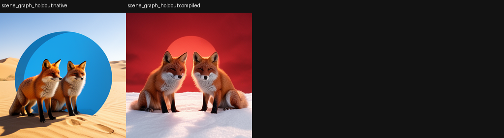
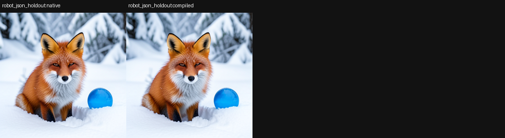

# Textless Klein Renderer: Structured State to a Frozen Image Consumer

> [!summary]
> A structured frontend compiled SceneGraph, CAD, image-derived JSON, and robot/JSON states into a native Klein conditioner without converting held-out states back to text. The atomic transport contract worked, but held-out semantic composition was heterogeneous: progress ranged from `-0.299` to `1.000`, with mean `0.364`. This is evidence for a textless rendering path, not a general structured semantic compiler.

## Research question

Can an image generator consume typed scene state directly rather than requiring natural-language prompts? The experiment defines a structured input interface with fields for objects, colors, scenes, counts, relations, negation, and composition. It asks whether those fields can compile into the native conditioner representation and preserve held-out semantic changes at the final image consumer.

The central anti-leak requirement is that held-out structured states must not be converted back into text. A codebook may be learned from atomic teacher examples, but evaluation must feed the structured representation directly to the compiler.

## Specimen and input interface

The consumer is FLUX.2 Klein 4B with a native schedule and decoder. Four structured frontend families are tested: SceneGraph, CAD, image-derived JSON, and robot/JSON. Discovery uses an atomic codebook built from teacher prompts. Held-out states mix unseen counts, colors, relations, negation, and composition.

The evaluator compares the structured output to the native Qwen rendering for the same semantic state. It also measures native embedding cosine, zero-dose progress, wrong-state progress, norm-matched sham progress, and exact checkpoint replay. These metrics are intentionally separate because embedding similarity can be high while downstream pixels remain wrong.

## How the experiment works

The compiler maps each typed field to a family-local conditioner contribution and combines the contributions into a Klein `PromptEmbeds` tensor. At inference it accepts structured values only; no held-out structured state is verbalized. The compiled tensor enters the same frozen native consumer as a normal prompt-conditioned tensor.

The panel contains isolated and multi-atom held-out states. A zero-dose branch supplies no structured intervention, a wrong-state branch supplies a deliberately mismatched structured state, and a norm-matched sham preserves energy while removing the intended direction. The evaluator derives exactness from replay measurements rather than from a visual label alone.

## Results

Discovery cells were exact by construction because the atomic codebook was fit to those teacher examples. Held-out behavior was heterogeneous:

| frontend | held-out state | progress to native Qwen |
|---|---|---:|
| SceneGraph | two red foxes, desert, left-of relation | `-0.299` |
| CAD | two blue cats, forest, right-of relation | `0.024` |
| image-derived JSON | space, no-circle negation | `0.733` |
| robot/JSON | fox-and-circle composition | `1.000` |

The mean held-out progress was `0.364`. Mean native-embedding cosine was `0.984`, demonstrating that embedding closeness did not guarantee image equivalence. Zero-dose averaged approximately `0.000` progress, the norm-matched sham averaged `0.0003`, and the wrong structured state averaged `-0.120`.

## Interpretation

The observation is a genuine textless rendering trend: an image-derived structured state and a robot/JSON composition transfer strongly, while SceneGraph and CAD states fail to generalize. The transport contract is therefore real, but the codebook is compositionally undercomplete at the native image consumer.

The working inference is that atomic field lowering is insufficient for multi-atom semantics. Relations, negation, and composition need a consumer-closed linker that can learn interactions and family-specific normalization. The result is valuable precisely because it separates typed input transport from downstream semantic success.

## Claim boundary

Established: held-out structured states can be compiled without text regeneration; the native consumer responds selectively; and several independent controls distinguish intended structure from generic perturbation.

Not established: universal textless prompting, compositional generalization, semantic equivalence of the structured frontend and native text, or a portable codebook across model revisions.

## Local proof bundle

- [Bundle README](../artifacts/textless-klein-renderer/README.md)
- [Raw report](../artifacts/textless-klein-renderer/report.json)
- [Execution receipt](../artifacts/textless-klein-renderer/run-receipt.json)
- [Artifact verifier](../artifacts/textless-klein-renderer/verify.py)

