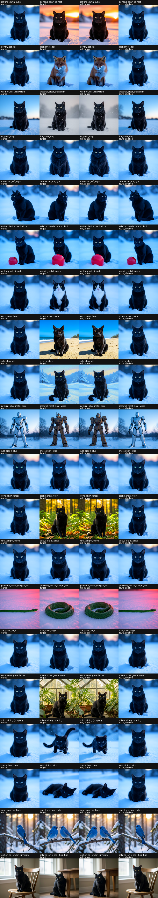
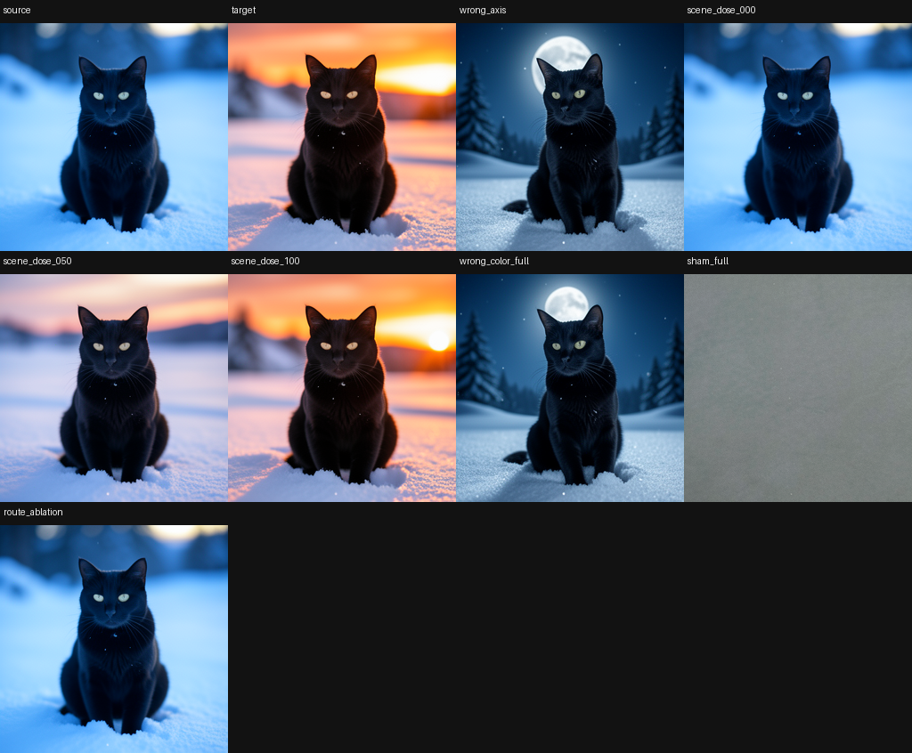
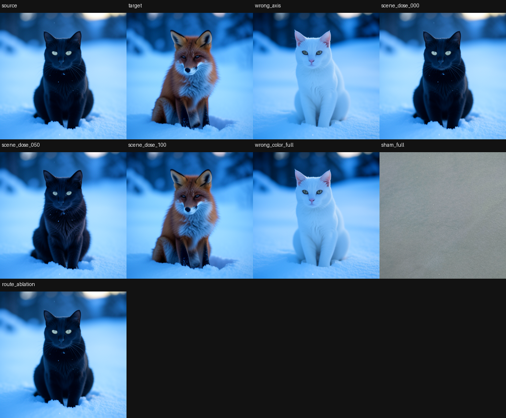
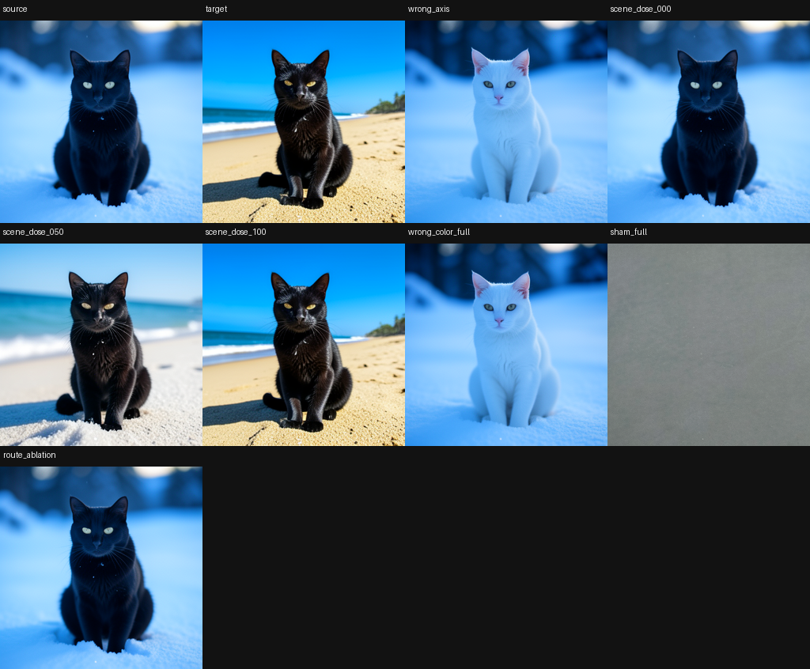
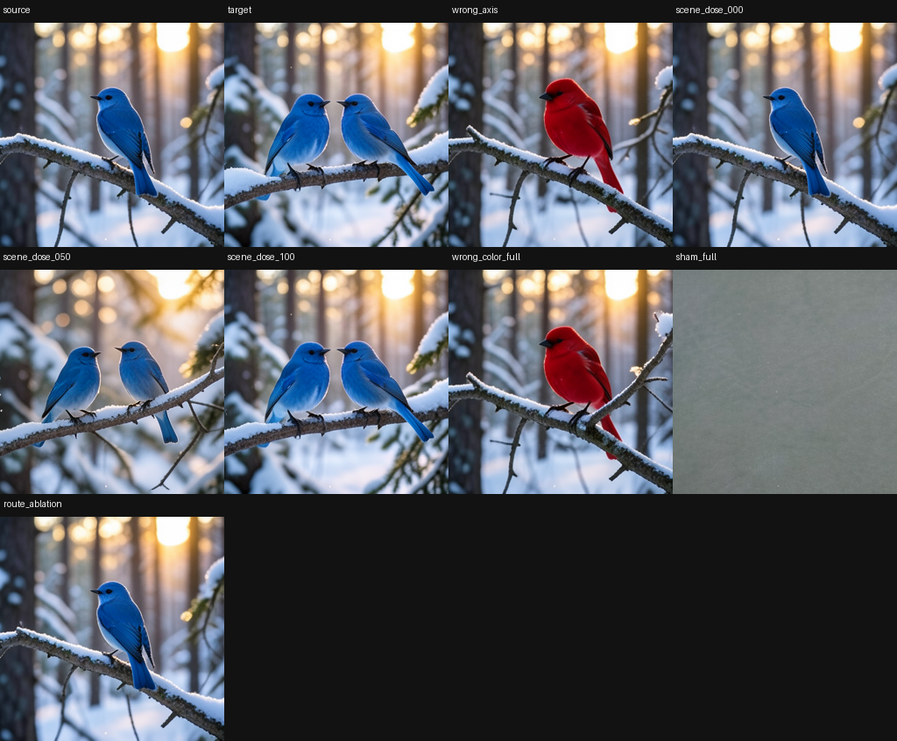

# Twenty-Axis Native Semantic Route Circuit in FLUX.2 Klein 4B

> [!summary]
> A single typed route through the FLUX.2 Klein 4B denoiser was tested against twenty semantic contrasts. Each row used a native source image, a native target image, a route-mediated transfer, and a route-write ablation. Six rows pass the strict 9/9 gate, eleven pass a less strict carrier-level 7/9 gate, three remain candidates, and none are unknown. The strongest strict rows are lighting, identity, weather, fur, orientation, and relation. An independent promptless control shows the route is structurally active even with an empty-string conditioner, but does not assign a semantic label by itself.

## Research question

Does one internal route carry many independently defined image variables to final pixels, or do
route interventions only produce generic disturbances that happen to correlate with a few prompts?

The experiment targets a route-level causal claim. It does not attempt to prove minimality, assign
meaning to a single token, or claim that every block in the route is necessary for every semantic
variable.

## Specimen and route

The specimen is FLUX.2 Klein 4B with native Qwen conditioning, 256×256 output, four denoising steps, guidance 1, and development seeds 4242 and 9001. The route under test is:

```text
joint.2 → joint.3 → joint.4 → single.0 → scheduler return → VAE → RGB
```

The route is treated as an ordered sequence of typed boundaries. A state write at an earlier
boundary is followed by the unchanged downstream computation. The final image, not the size or cosine of an intermediate activation, is the semantic authority.

## Proof protocol

For each semantic axis, construct two prompts that differ in one declared variable while preserving the rest of the scene as much as possible. Render:

1. **Native source:** source prompt, native generation.
2. **Native target:** target prompt, native generation.
3. **Typed transfer:** source generation with the target-directed state difference written through
   the tested route.
4. **Route ablation:** the same transfer with the route write removed or clamped.

Two complementary conditions are required:

- **Sufficiency:** typed transfer should approach the native target rather than remain source-like.
- **Necessity:** route ablation should return toward the native source rather than preserve the
  target change.

The row score is a normalized target-progress measure. Gate summaries also record exact scalar branch counts, maximum ablation progress, and minimum mediation rescue. A strict certificate requires all nine declared gates; a carrier certificate requires the seven carrier/causal gates while leaving two promotion gates open. The categories are evidence labels, not claims that the route is a minimal circuit.

## Complete twenty-axis result

| Rank | Axis | Evidence | Score | Gates | Minimum target | Maximum ablation |
|---:|---|---|---:|---:|---:|---:|
| 1 | Lighting: dawn → sunset | certified | .935 | 9/9 | .916 | .017 |
| 2 | Identity: cat → fox | certified | .920 | 9/9 | .913 | .011 |
| 3 | Weather: clear → snowstorm | certified | .911 | 9/9 | .901 | .038 |
| 4 | Fur: short → long | certified | .894 | 9/9 | .903 | .035 |
| 5 | Orientation: left → right | certified | .873 | 9/9 | .925 | −.005 |
| 6 | Relation: beside → behind ball | certified | .866 | 9/9 | .918 | .072 |
| 7 | Marking: solid → tuxedo | carrier-certified | .877 | 7/9 | .888 | .014 |
| 8 | Scene: snow → beach | carrier-certified | .869 | 7/9 | .882 | .011 |
| 9 | Style: photo → oil | carrier-certified | .869 | 7/9 | .894 | .002 |
| 10 | Material: robot metal → wood | carrier-certified | .864 | 7/9 | .896 | .046 |
| 11 | Eyes: green → blue | carrier-certified | .832 | 7/9 | .838 | .021 |
| 12 | Scene: snow → forest | carrier-certified | .826 | 7/9 | .839 | .023 |
| 13 | Ears: upright → folded | carrier-certified | .822 | 7/9 | .886 | .028 |
| 14 | Geometry: snake straight → coil | carrier-certified | .819 | 7/9 | .851 | .028 |
| 15 | Size: small → large | carrier-certified | .805 | 7/9 | .850 | .094 |
| 16 | Scene: snow → greenhouse | carrier-certified | .774 | 7/9 | .775 | .007 |
| 17 | Action: sitting → jumping | carrier-certified | .715 | 7/9 | .634 | .007 |
| 18 | Pose: sitting → lying | carrier-candidate | .753 | 6/9 | .871 | .005 |
| 19 | Count: one → two birds | carrier-candidate | .735 | 6/9 | .818 | .023 |
| 20 | Relation: on → under furniture | carrier-candidate | .682 | 6/9 | .751 | .097 |

The aggregate evidence counts are:

| Evidence class | Rows |
|---|---:|
| Strict certified | 6 |
| Carrier-certified | 11 |
| Carrier-candidate | 3 |
| Unknown | 0 |

The six strict rows all pass nine of nine gates. The carrier-certified rows show strong route-level
effects but retain one or more unresolved promotion conditions. The three candidate rows are
positive trends with open gates, not null results.











## Promptless structural control

The semantic panel supplies labels by design. A separate control asks whether the route is active before supplying a semantic label.

The promptless procedure uses an empty-string conditioner, two seeds (4242 and 9001), 25 typed boundaries, four denoising steps, and a deterministic random direction at each boundary. The direction is normalized to 5% of the baseline state RMS:

```text
||u(s,t)||_RMS = 0.05 × ||h(s,t)||_RMS
h'(s,t) = h(s,t) + u(s,t)
```

The native suffix and VAE then produce the final image. The control is not semantic labeling: it
only asks whether a boundary has downstream causal sensitivity.

The strongest promptless route effects reach RGB MAD 35.89, while norm-matched sham controls are bounded around 1.89–3.41. No-op branches are exact at zero. The promptless result therefore supports structural activity of the route independently of the twenty semantic labels, while leaving the semantic interpretation to the labeled source/target panel.


## Why this is more than activation correlation

An activation can move because a signal is propagated downstream, because a branch changes the rendering register, or because an instrument is sensitive to norm. The four-column contrast makes three stronger demands:

- the target-directed write must produce a target-like image;
- removing the write must restore the source-like image;
- the effect must survive the unchanged scheduler and decoder.

The promptless controls add a fourth demand: a route candidate should remain distinguishable from norm-matched shams and exact no-ops. Together these tests turn a route from a visually suggestive activation into a bounded native-consumer causal observation.

## Limitations and failure modes

The route address is hand-selected and model-specific. The experiment does not establish a unique semantic address, a minimal set of blocks, or a universal image-editing interface. Several semantic variables may share a distributed carrier, and a successful transfer can depend on the paired prompt geometry, seed, dose, and denoising step.

The ledger uses the primary 20-row evidence counts. Older editorial summaries used a different
held-out denominator; they are not substituted for this ledger. The independent recheck is kept
in the local bundle as an audit artifact, but the row-level claims remain bounded to the declared
panel and controls.

## Working inference and claim boundary

**Observation:** one route carries target-directed changes in at least twenty tested semantic
contrasts, with six strict rows and eleven additional carrier-certified rows.

**Convergent trend:** necessity/sufficiency contrasts, promptless fixed-norm controls, and exact
no-op branches agree that the route is causally active in the native image consumer.

**Working inference:** a dense diffusion model can expose a broad, reusable route-level semantic
carrier even when no single token or channel provides a complete semantic address.

**Terminal status:** bounded route-level trend. This is not a proof of minimality, universality,
or a tokenizer-addressed circuit, and the candidate rows remain open.

The object interface compiled from this circuit — typed object symbols addressed by lexical rows
and consumed by the native suffix — is reported in
[Semantic Circuit Objects](semantic-circuit-object-interface.md).

## Local proof bundle

The full compact evidence is in [the local artifact bundle](../artifacts/twenty-axis-semantic-route-circuit/):

- [twenty-axis ledger](../artifacts/twenty-axis-semantic-route-circuit/circuit-panel-ledger.json)
- [independent recheck](../artifacts/twenty-axis-semantic-route-circuit/independent-recheck.json)
- [promptless control report](../artifacts/twenty-axis-semantic-route-circuit/promptless-control-report.json)
- [proof sheet](../artifacts/twenty-axis-semantic-route-circuit/circuit-panel-proof-sheet.png)
- [receipt verifier](../artifacts/twenty-axis-semantic-route-circuit/verify.py)

Run `python ../artifacts/twenty-axis-semantic-route-circuit/verify.py` from this directory to verify the twenty rows, evidence counts, strict gates, and promptless execution metadata.
