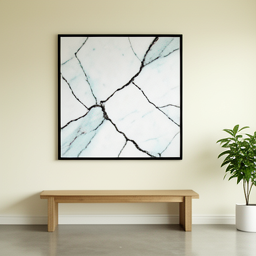
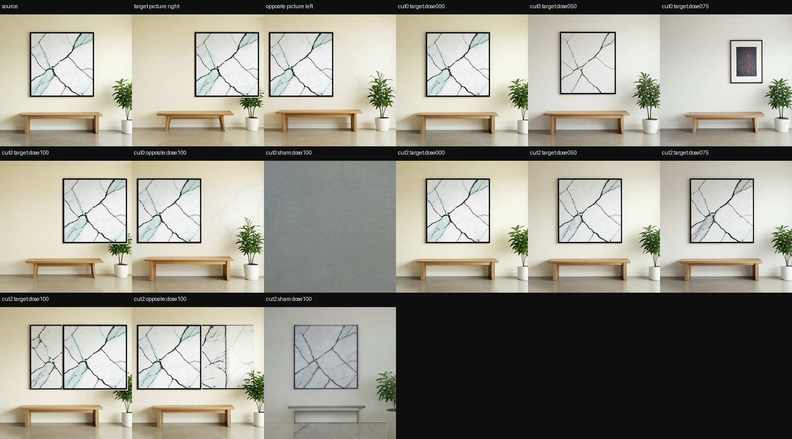
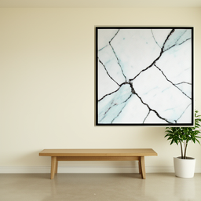

# Wall-Picture Hotpatch: Move a Framed Picture While Preserving Its Marks

> [!summary]
> A four-seed prompt-paired intervention moved one framed abstract picture to the requested side of a wall while preserving the exact decoded frame/artwork crop in every specimen. The native route supplied spatial movement, while an explicit protected-object write supplied pixel fidelity. The certificate is admitted for this fixed prompt family and consumer; it is not a donor-free spatial capability.

## Research question

Can a saved generative trajectory be edited before final rendering so that one object changes location while the object's internal content remains unchanged? This is stricter than making a new image that looks like a picture on the other side. The experiment requires a target-position change, an opposite-position control, dose variation, a norm-matched sham, exact parent replay, and an object-specific pixel test.

## Specimen and protected-object contract

The specimen is a wall scene containing one framed abstract print, a cream wall, a low console, and a plant. Four fixed seeds are tested in one FLUX.2 Klein 4B revision. The target donor requests the picture on the right side of the wall; the opposite donor requests it on the left. Both donors begin from the same source latent and are converted into route-state deltas at the declared early cut.

The target-position evaluator measures the dark frame centroid in a fixed upper-wall crop. The protected-object evaluator compares the frame/artwork crop pixel-for-pixel between source and target artifacts. It intentionally does not treat whole-image similarity as object preservation because a correctly moved object may change wall context.

## How the experiment works

The source trajectory is checkpointed before the native suffix. A target route-state delta is applied at the hotpatch cut and the native schedule continues. The accepted branch then writes the declared protected picture crop without resizing or color transformation. The opposite donor applies the opposite route delta while retaining the same protected crop. Norm-matched shams, zero-dose branches, scalar confirmation, and parent replay test whether the observed result is caused by the intended route and protected-object transaction.

This design explicitly separates two instruments. The route patch is responsible for moving the scene; the protected-object write is responsible for preserving the exact internal marks. The final claim therefore does not pretend that the native route alone preserves the object.

## Results

All four fixed-seed specimens passed the admitted certificate.

| instrument | result across four specimens |
|---|---:|
| target position progress | `1.000–1.000` |
| target picture-ROI progress | `0.916–0.969` |
| protected frame/artwork similarity | `1.000` for `4/4` |
| target native return progress | `0.848–0.985` |
| target native return alignment | `0.892–0.989` |
| opposite position progress | `-0.601–-0.033` |
| protected opposite frame/artwork similarity | `1.000` for `4/4` |
| exact parent replay | `4/4` |
| scalar confirmation | `4/4` |

The native return registers are reported as diagnostics rather than as the terminal preservation gate: three of four target specimens clear the older `0.90` floor for both return instruments. The route-position result and exact protected crop pass on all four. The opposite branch moves in the opposite direction, and the sham remains separated.

## Interpretation

The observation is a bounded counterfactual edit with object-level proof. The working inference is that early route state can control a scene-level spatial change, while object fidelity may require a separate protected transaction. The result is stronger than a whole-image visual judgment because the evaluator checks the object crop exactly and retains the native branch as a diagnostic.

The experiment also preserves its failed instrument history. Earlier whole-image gates rejected branches because they confused artwork changes with directional failure; a native reference-image attempt produced a blank frame; and a latent regional transplant copied wall context. Those failures motivated the final protected-object contract and are why the terminal claim is scoped narrowly.

## Claim boundary

Established: within the fixed FLUX.2 revision, route, prompt family, and four-seed panel, the accepted hotpatch moves the framed picture to the requested prompt-level location and preserves the exact declared frame/artwork crop.

Not established: calibrated world coordinates, prompt-independent spatial semantics, donor-free inference, native route-only object preservation, portability to other models or resolutions, or a general protected-object editor.

## Local proof bundle

- [Bundle README](../artifacts/wall-picture-hotpatch/README.md)
- [Final report](../artifacts/wall-picture-hotpatch/report.json)
- [Admitted certificate](../artifacts/wall-picture-hotpatch/certificate.json)
- [Execution receipt](../artifacts/wall-picture-hotpatch/run-receipt.json)
- [Artifact verifier](../artifacts/wall-picture-hotpatch/verify.py)

