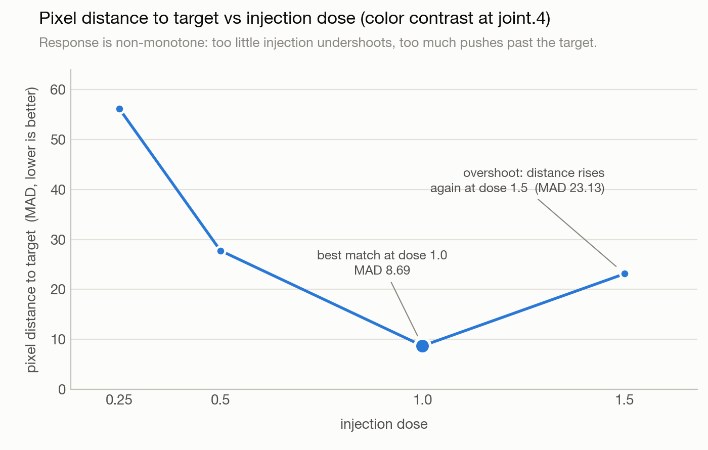

# The Circuit That Survived Its Coordinates

**Causal evidence for distributed semantic routes in a production diffusion transformer**

Jacob Hollenbeck

*2026-08-11; revised 2026-09-22*

---

## Abstract

We present causal evidence for semantic "circuits" in FLUX.2 Klein 4B, a publicly released text-to-image diffusion transformer (~4B-parameter denoiser; ~8B parameters including its text encoder), using an intervention battery with nine promotion gates frozen before the panel ran: sufficiency, necessity, wrong-axis specificity, energy-matched sham, dose response, ordered edge mediation, downstream-consumer continuation, cross-seed replication, and exact-replay integrity. Under a pinned model revision and generation recipe, we certify a recurring four-block route through which injected and removed prompt semantics demonstrably transport into the image: across a panel of twenty semantic contrasts spanning twelve categories (lighting, identity, weather, appearance, pose, relation, scene, style, material, geometry, action, count), six contrasts pass all nine gates strictly and eleven more pass every gate except strict pixel-reconstruction thresholds. A subsequent confirmation on two previously unopened seeds, with every rule frozen in advance, replicated the causal route gates across the whole panel — the only route-gate failure in twenty contrasts missed its threshold by 0.002 — while the strict pixel tier proved seed-sensitive: three of six strict contrasts replicated strictly, and two previously sub-threshold contrasts crossed into certification. Three findings follow. First, the circuit is **time-accumulated rather than localized**: on the identity contrast, single-step interventions at any site fail both necessity and sufficiency, while the same interventions applied across all denoising steps succeed almost perfectly — a result that standard single-step activation patching would misreport as "no necessary component." Second, the circuit is **coordinate-free**: across semantic axes, normalized per-module activation trajectories are nearly collinear (minimum pairwise cosine 0.986) while the physical activation coordinates that carry them barely overlap (mean Jaccard 0.063), and the route survives a token-position shift that relabels every downstream coordinate. Third, the circuit's function is **separable from its substrate**: replacing the model's text encoder with a foreign language model through a trained adapter yields clean, coherent, but semantically wrong images; donating the native text-encoder output through the identical interface restores the byte-identical native image, localizing the defect entirely to one argument of a frozen, still-functional image program. The route can also be recovered *promptlessly* — with no semantic labels at all — from the propagation structure of random perturbations. On a closely related image-stream pathway we show the model's semantic response to intervention is a reproducible **nonlinear dynamical response**: a fitted banded second-order model predicts that response (mean RMSE 0.031) and its optimized envelopes reach mean progress 0.395 in the real model versus 0.056 for a linear controller, on the seeds and axes it was fitted on — but simple fixed-dose envelopes on the same panel do better (full dose 0.493, late dose 0.426), so the fitted model is a compact description of the response, not a better controller. Finally, we demonstrate that the proof grammar (cut, matched-position control, correct-versus-wrong repair, exact no-op, held-out scoring) transfers unchanged to public autoregressive language models, and we provide a single-file verifier that reproduces a complete certified circuit in Pythia-70M on a laptop CPU in under a minute. Along the way we document seven concrete measurement traps — including a "latent-only" false positive and a 0.996-cosine reconstruction of an internal state that renders the wrong animal — that we suspect affect published interpretability results.

---

## 1. Introduction

Interpretability research often claims that a model contains a "circuit": a small set of internal components that computes a specific function. The evidence behind such claims varies enormously. Attention maps and activation statistics are correlational. Single-site activation patching establishes causal influence at one point but rarely establishes necessity, specificity, or that the effect survives to the model's actual output. Sparse-autoencoder features are learned surrogates whose relationship to the model's native computation is itself a hypothesis [5, 9]. It is rare for a claimed circuit to be tested against the question a skeptic would actually ask: *if this is the mechanism, what battery of interventions would fail if you were wrong, and did you run them?*

This paper reports what happened when we imposed that battery on a modern production image generator. We chose a diffusion transformer rather than a language model for three reasons. Diffusion models iterate: the same weights execute several times over an evolving state, so "where" a computation lives has a temporal dimension that single-pass analyses miss. Diffusion models have a natural end-to-end observable — the rendered image — which lets us demand that every internal claim be confirmed by a consumer the model actually serves. And text-to-image models expose a clean interface between two subsystems (a text encoder and an image denoiser), which makes a rare experiment possible: swapping one subsystem entirely while holding the other frozen, then asking which side owns a behavior.

Our claims are deliberately bounded. We do not claim minimal circuits, universal semantic addresses, or mechanisms that transfer across model families (§9). What we do claim, with retained artifacts behind every number:

1. **A certified distributed route.** In FLUX.2 Klein 4B, semantic content is demonstrably transportable from the prompt into the image through a specific, recurring sequence of transformer blocks. Across twenty prompt contrasts, seventeen pass a nine-gate causal battery entirely or up to strict pixel thresholds (§4).
2. **Time accumulation, not localization.** The route's signal is built up across denoising steps. On the identity contrast, interventions at a single step fail necessity *and* sufficiency at every site; all-step interventions at the same sites pass both. Single-step patching — the field's default instrument — would report this circuit as absent (§5).
3. **Coordinate freedom.** Different semantic contrasts reuse the same abstract route while occupying almost disjoint physical coordinates, and the route survives deliberate coordinate relabeling. The durable object is a typed transition between processing stages, not a set of neuron indices (§6).
4. **Function–substrate separation.** A foreign text encoder attached through a trained adapter drives the frozen image pipeline to produce clean but wrong images; injecting the native encoder's output restores the exact native image. The image-generation program and its semantic argument are separable, and similarity metrics on the argument (cosine up to 0.997) can be dominated by a prompt-invariant scaffold that carries no semantics (§7).
5. **A reproducible response law.** On a closely related image-stream pathway, the model's reaction to intervention is nonlinear but lawful: early injections produce almost no progress, late injections produce most of it, dose response is non-monotone, and a fitted second-order response model predicts the real model's response closely enough to drive it targetward — though not better than fixed-dose envelopes (§8.2). The certified route itself can be re-discovered promptlessly, from perturbation propagation alone (§8.3).
6. **A portable proof grammar.** The same certificate structure closes circuits in public autoregressive models (Pythia-70M, Qwen2.5-0.5B, Qwen3-0.6B), with a standalone verifier (§10).

We also catalogue the false positives our gates caught (§11). We believe these traps — not the successes — are the most transferable contribution: each is a way a well-executed analysis produces a confident wrong answer, and each is invisible to the instruments most commonly used.

---

## 2. The model

FLUX.2 Klein 4B is a publicly released text-to-image model from Black Forest Labs [12]. The "4B" in its name refers to the denoiser; the full system is roughly twice that. All experiments pin one revision (`e7b7dc27f91deacad38e78976d1f2b499d76a294` on Hugging Face) and, unless stated otherwise, one generation recipe: bfloat16 precision, 256×256 output, four denoising steps, guidance 1.0, fixed random seeds (4242 and 9001 for the main panel).

The model has three parts, totaling 818 tensors and 7,982,059,044 parameters:

- **A text encoder ("conditioner"), 4.02B parameters.** The prompt is encoded into a fixed-shape tensor of 512 positions × 7,680 channels, which we call the *conditioning state*. A byte-level screen over sampled embedding chunks plus a principal-subspace comparison of matched weight matrices identifies this component as the public Qwen3-4B language model (subspace alignment ≈ 0.9999999). This is an identification screen over sampled tensors, not a full-tensor certification, and it identifies the substrate the encoder was built from — not the denoiser's training history. (The same screen matches the sibling 9B model's encoder to Qwen3-8B at ≈ 0.9999992 and the flagship Dev model's encoder to Mistral-Small-3.2-24B at ≈ 0.9999997; these asides play no role in what follows.)
- **A denoiser, 3.88B parameters.** A diffusion transformer of width 3,072 with two block types executed in order every denoising step: five *joint* blocks (`joint.0`–`joint.4`), in which text tokens and image tokens are processed as two streams that interact through shared attention, followed by twenty *single* blocks (`single.0`–`single.19`), in which the two streams are merged into one sequence. After the last single block the text positions are discarded; only the image positions continue. Each step ends by writing a packed 256-position × 128-channel latent state — we call it the *return state* — which the sampler (a rectified-flow scheduler [10, 11]) uses to compute the next step's input.
- **A decoder (VAE), 84M parameters,** which turns the final latent state into RGB pixels.

Generation runs the denoiser four times (steps 0–3) and decodes once. Two structural facts matter for everything below: the same weights execute at every step over an evolving state, and the text stream has a hard disposal point — anything written into text positions after the final merged block cannot reach the image.

For comparison experiments we also reference FLUX.1 Schnell (an earlier model in the family: 19 joint + 38 single blocks, CLIP+T5 conditioning). A subspace comparison between Klein 4B and Schnell finds median alignment 0.0205 over 25 frozen depth-matched weight pairs, against an analytic null of 0.0208 (maximum 0.0224 over the complete 1,425-cell depth×depth matrix) — no detectable weight inheritance between the two generations, with the stated caveat that a warm start whose subspaces fully rotated away would look identical to a fresh start.

---

## 3. Method: freeze the suffix, replay the branch

All of our causal evidence comes from one experimental scheme.

**Checkpoint and replay.** We built a harness around the model that separates the text-encoding phase from the denoising phase, records the complete state of a generation at any chosen denoising step (latent state, scheduler position and coefficient schedule, positional layout, conditioning state), and can later resume from that checkpoint with any single internal value replaced — without re-running the prefix, and with everything else bit-identical. We call one such resumed generation, under one intervention condition, a *branch*. The critical property is the **exact no-op guarantee**: resuming a checkpoint with *no* change reproduces the original generation with zero pixel difference (mean absolute RGB difference 0.0) and boundary activations replaying at cosine 1.0. Every intervention below is interpreted against that guarantee; a "rescue" or "transfer" result is only trusted because the untouched replay is exact. (An early version of this infrastructure silently failed the guarantee across process restarts — checkpoints preserved the scheduler's step index but not its installed coefficient schedule — which is itself a warning: replay exactness must be *measured*, not assumed.)

**The subtraction.** For a semantic contrast — say, "a photorealistic black cat sitting in fresh snow at dawn" versus the same prompt with "red fox" — we generate both trajectories with identical seeds and identical everything except the prompt. Because the denoiser, scheduler, decoder, and noise are all frozen and shared, the *only* cause of any internal difference between the two runs is the semantic content of the prompt. We call everything downstream of an intervention point, held bit-identical, the *frozen suffix*. The per-site, per-step activation difference Δ between the two runs is the candidate *carrier* of the semantic distinction — the transported signal.

**Interventions.** A *site* is a named module output within a block at a given denoising step. With source run A and target run B, we intervene by resuming A's checkpoint with, at chosen sites and steps, the state replaced by `h_A + d·(h_B − h_A)` for a dose `d` (dose 1 = full transplant of the target's state; we call the injected target state the *donor*). *Sufficiency* asks whether injecting B's state into A's trajectory moves the output to B's image. *Necessity* asks whether writing A's state into B's trajectory (removing the route) reverts B's output toward A.

**Scores and sign conventions.** Let `I_A`, `I_B`, and `I` be the source, target, and intervened renders, and MAD the mean absolute RGB difference. The primary score is *progress*:

> `P = 1 − MAD(I, I_B) / (MAD(I_A, I_B) + ε)`

P = 1 means the branch produced the target image; P = 0 means it stayed at the source; ε is a small stabilizer. Some instruments in §5–§8 use a symmetric variant, `P± = (MAD(I_A, I) − MAD(I_B, I)) / MAD(I_A, I_B)`, which assigns **−1 to an unmoved source** and +1 to the target; we flag every use of that scale explicitly, because a strongly negative P± means "did not move," not "moved away." Three derived quantities recur: *alignment* (the cosine between the branch's return-state displacement `r − r_A` and the target displacement `r_B − r_A`), *rescue* (for an edge u→d in the route, the fraction of the ablation effect recovered by restoring only the downstream site: `R = (M_ablate − M_rescue)/max(M_ablate, ε)`), and the panel ledger's composite *transfer score*, a summary of sufficiency, continuation, and mediation margins that we report for ordering only.

**Two consumers, always.** Every intervention is scored on *two* downstream observables: the return state (the latent the sampler actually consumes) and the decoded RGB image. This rule exists because the two can disagree, and when they do, the disagreement is diagnostic (§11.1).

**The nine gates and three tiers.** A contrast is *strictly certified* when it passes, on both retained seeds, all of: (1) replication across at least two seeds; (2) sufficiency — full-route injection reaches P ≥ 0.90 on the weaker seed; (3) necessity — removing the route leaves progress ≤ 0.15; (4) wrong-axis specificity — a donor differing on a *different* semantic axis (e.g., a white-cat donor while testing pose) must not produce the target, progress ≤ 0.35; (5) energy specificity — a random vector matched to the donor's norm must not produce the target, ≤ 0.35; (6) dose response — progress ≤ 0.15 at dose 0, ≥ 0.90 at dose 1, with bounded non-monotonicity (tolerances 0.10 image / 0.05 return-state); (7) edge mediation — for each consecutive edge in the route, ablating the upstream site and restoring only the downstream site recovers ≥ 50% of the lost effect (the main panel mediates at one denoising step — step 2 — while the sufficiency and necessity branches patch all steps; a follow-up probe measured the remaining steps on the strict axes, §4); (8) consumer continuation — the effect must survive into the return state (progress ≥ 0.75, alignment ≥ 0.80) and the real decoder path; (9) replay integrity — every branch resumes a checkpoint and replays the native suffix exactly (for the twenty-axis panel this gate is currently metadata-declared per branch; see §9). A contrast that passes gates 1, 3, 4, 5, 7, 8, and 9 but misses one or both strict pixel gates (full-dose sufficiency, dose endpoints) is recorded as *carrier-certified*: the causal route is established; strict pixel-level reconstruction is not. A contrast additionally missing the 0.50 mediation-rescue threshold on some edge is an *open candidate*. All thresholds were frozen in a configuration file before the panel ran. The two retained seeds are replication, not held-out confirmation; see §9.

This scheme needs no gradients, no learned probes, no surrogate models, and no labels beyond the prompt pair. Its costs are honesty costs: it can only certify routes it explicitly tests, and it produces bounded existence claims rather than exhaustive maps.

---

## 4. A recurring semantic route, certified across twenty contrasts

The route that recurs across every semantic axis we tested is:

```
conditioning state
  → joint.2 → joint.3 → joint.4     [patched: text-stream output]
  → single.0                         [patched: text-prefix rows]
  → later single blocks              (native, not intervened)
  → return state (scheduler)         (native)
  → VAE → RGB image                  (native)
```

Concretely, the certified intervention patches the text-stream output of blocks `joint.2`, `joint.3`, `joint.4` and the text-prefix rows of `single.0`, at all four denoising steps. Everything else — image stream, later blocks, scheduler, decoder — runs natively; the downstream elements in the diagram are consumers the effect must survive through, not intervention sites.

We ran the full nine-gate battery on twenty prompt contrasts spanning twelve semantic categories. Each contrast used real source/target checkpoints, exact replay for every branch, a five-point dose curve, a wrong-axis donor, an energy-matched sham, full-route and per-site ablations, and three edge-mediation tests. The panel ran as four groups (three groups of six axes and one of two), 252 replayed branches per six-axis group, the model loaded once per group. Results:

| # | Contrast | Category | Tier | Ledger score | Gates | Min. target progress | Max. ablation progress | Min. edge rescue |
|--:|---|---|---|---:|---:|---:|---:|---:|
| 1 | dawn → sunset | lighting | **strict** | .935 | 9/9 | .916 | .017 | .888 |
| 2 | black cat → red fox | identity | **strict** | .920 | 9/9 | .913 | .011 | .811 |
| 3 | clear sky → snowstorm | weather | **strict** | .911 | 9/9 | .901 | .038 | .826 |
| 4 | short fur → long fur | appearance | **strict** | .894 | 9/9 | .903 | .035 | .733 |
| 5 | facing left → facing right | pose | **strict** | .873 | 9/9 | .925 | −.005 | .528 |
| 6 | beside ball → behind ball | relation | **strict** | .866 | 9/9 | .918 | .072 | .603 |
| 7 | solid → tuxedo markings | appearance | carrier | .877 | 7/9 | .888 | .014 | .819 |
| 8 | snow → beach | scene | carrier | .869 | 7/9 | .882 | .011 | .792 |
| 9 | photo → oil painting | style | carrier | .869 | 7/9 | .894 | .002 | .753 |
| 10 | metal robot → wooden robot | material | carrier | .864 | 7/9 | .896 | .046 | .778 |
| 11 | green eyes → blue eyes | appearance | carrier | .832 | 7/9 | .838 | .021 | .719 |
| 12 | snow → autumn forest | scene | carrier | .826 | 7/9 | .839 | .023 | .690 |
| 13 | eyes open → narrowed/closed (ear prompt proxy) | face/pose | carrier* | .822 | 7/9 | .886 | .028 | .566 |
| 14 | straight → coiled snake | geometry | carrier | .819 | 7/9 | .851 | .028 | .633 |
| 15 | small → large | appearance | carrier | .805 | 7/9 | .850 | .094 | .647 |
| 16 | snow → greenhouse | scene | carrier | .774 | 7/9 | .775 | .007 | .552 |
| 17 | sitting → leaping | action | carrier | .715 | 7/9 | .634 | .007 | .573 |
| 18 | sitting → lying | pose | open | .753 | 6/9 | .871 | .005 | .394 |
| 19 | one bird → two birds | count | open | .735 | 6/9 | .818 | .023 | .447 |
| 20 | on chair → under table | relation | open | .682 | 6/9 | .751 | .097 | .425 |

Reading the table: *Min. target progress* is the sufficiency result on the weaker seed — for the six strict rows, injecting the route's state closed ≥ 90% of the pixel distance to the target image. *Max. ablation progress* is the necessity result — removing the route left at most 9.7% residual progress anywhere in the panel, and under 4% in sixteen of twenty rows. *Min. edge rescue* is the weakest of the three within-route mediation edges; the three open rows sit below the 0.50 threshold (.394/.447/.425) while every certified row clears it.

Three observations. First, the same four-block route carries lighting, identity, weather, fur length, orientation, and spatial relation — semantically unrelated distinctions ride one transport mechanism. Second, failure is graded and interpretable: the axes that struggle (count, spatial relations, pose transitions) are exactly the compositional ones, and they fail on *reconstruction strength*, not on route identity — their signal still travels the same path. Third, the necessity numbers are strong everywhere including the failures: this route is how the tested semantic content gets in, whether or not full-dose injection can perfectly reproduce the target rendering.

Correction to row 13: although the frozen prompt contrast was upright → folded ears, pane-level review shows the controlled rendered feature is eye openness/eyelid state (open → narrowed/closed); the ears remain pointed. The historical carrier tier is retained as a route-level measurement, but it is not an established ear semantic circuit. See the [additive correction](corrections/ears-upright-folded-eye-control.md).

A separately run scene contrast (a fox sitting in snow at dawn → standing in a desert at noon — a compound change of posture, background, lighting, and time) passed all nine gates as a standalone certificate with minimum full-route progress .913, maximum ablation progress .023, weakest edge rescue .771, return-state progress ≥ .982, and 36/36 branches (18 per seed) replaying exactly. Its submission record declared 17 branches per seed where 18 ran — the undeclared branch being the route ablation — an off-by-one we retain as a documentation defect (§9).

The panel was re-verified by a clean-room auditor: an independently written script (standard library, NumPy, and PIL only — no imports from the experiment pipeline) that re-derives all nine gate verdicts from the raw branch rows and frozen thresholds, recomputes 1,920 image-side scalars directly from the retained lossless images, and re-hashes declared artifacts. It reproduced all twenty tier assignments with zero decision mismatches, matched every recomputed metric within 1.5×10⁻⁵ (float32 reduction noise), verified 132 of 140 declared hashes (the remaining 8 lack recomputable inputs), and re-derived four of the nine gates from pixels alone. Its sensitivity was measured, not assumed: five deliberate tamper injections (falsified scalars, flipped verdicts, altered tiers, corrupted images, forged config hashes) were all caught. An earlier twelve-contrast panel with the same structure (all twelve at least carrier-certified; four also strict) was audited less independently — its recheck reconstructed certificate inputs and re-ran the *production* certification routine artifact-only (zero mismatches; 104 image metrics recomputed at max discrepancy 1.1×10⁻⁷), a policy audit that could not have caught a bug in the certification code itself. The twenty-axis auditor is the first genuinely independent reimplementation in this line.

**Held-out-seed confirmation.** Because the strict thresholds were calibrated during exploration (§9), we ran the entire twenty-axis panel again on two previously unopened seeds (31337 and 60660), with the configuration byte-identical to the frozen original except for the seeds, and its hash recorded before submission. The causal route replicated essentially completely: across all twenty held-out contrasts, the *only* route-gate failure anywhere in the panel is one necessity result missing its threshold by 0.0022 (0.1522 vs 0.15, on the beside→behind relation). The strict pixel tier, by contrast, is seed-sensitive: three of the six strict contrasts replicated strictly (identity, lighting, orientation), two downgraded to carrier tier on the pixel-sufficiency gate (fur length at 0.732 and weather at 0.787, vs the 0.90 threshold), and one downgraded on the 0.0022 necessity near-miss — while four contrasts moved *up*, including two previously open rows (size and sitting→lying pose) crossing into full certification. The held-out panel totals 5 strict / 14 carrier / 1 open, with exact tier agreement on 13 of 20 axes. The honest summary: the transport route is robust to unopened seeds; the strict image-reconstruction certificate is partly a property of the seed.

**Multi-step mediation.** The main panel's edge-mediation gate tests one denoising step (step 2). A follow-up probe ran the three route edges at steps 0, 1, and 3 for all six strict axes (original seeds, everything else frozen): the mediation chain holds at 17 of 18 axis×step cells, so the certificates are not an artifact of the chosen step. The single failure is localized to one axis (orientation), one seed, one edge, one step (the `joint.4 → single.0` edge at step 1, rescue 0.012, with upstream edges intact at 0.82–0.84 and the same axis clean at step 0). One depth-dependent structure emerged: on the identity axis the terminal edge is the weakest early (rescue ≈ 0.59 at steps 0–1) and strengthens late (≥ 0.84 at steps 2–3) — consistent with §5's accumulation picture.

---

## 5. The circuit is time-accumulated, and single-step patching cannot see it

The most methodologically consequential result came from the identity contrast (black cat ↔ red fox). Alongside the panel contrasts, we also reference a paired *color* contrast (a red fox vs. a blue fox, differing in one word) studied in the earlier campaign; it is not a row of the twenty-axis panel.

**Single-step interventions fail in both directions.** Transplanting the target's `joint.4` state at one denoising step leaves the output at pixel distance (MAD) 48.4 from the target — essentially no transfer, given that the all-step intervention below brings the same distance to 0.47. Ablating the same site at one step leaves the target image intact (distance 7.9). Under the field's standard instrument — patch one site at one step, measure the effect — this circuit does not exist: no necessity, no sufficiency, at any site.

**All-step interventions succeed almost perfectly.** In the earlier identity campaign (a separate run from the §4 panel row), the same transplant applied at every denoising step transfers the identity nearly completely (edge-mediation rescues .946, .888, .796 along the route; exact-replay donor progress 0.99, final pixel distance to target 0.47). And the same ablation applied at every step is devastating: on the symmetric P± scale (−1 = fully reverted to source), per-site all-step ablation scores −0.72 to −0.93, and full-route all-step ablation reaches −0.93 — a near-total reversion. Every site *is* necessary — across time.

The resolution is that the route is a relay that accumulates its effect over the denoising schedule. Each step's contribution is individually dispensable because the surrounding steps re-derive most of the signal from the still-intact conditioning; remove the signal at *every* step and there is nothing left to re-derive from. Direct measurement of the return state confirms the accumulation: the internal separation between the cat and fox trajectories grows monotonically across the four scheduler writes, 0.355 → 0.919 → 2.487 → 9.723 (the color contrast shows the same shape, 0.411 → 0.837 → 1.990 → 7.409; Figure 2).


We initially misread this ourselves. The first single-step panel produced the summary "distributed relay with no necessary node," which is wrong in an instructive way: the nodes are all necessary, but their necessity is only visible to an intervention that spans the time axis. Any iterative architecture — diffusion models, recurrent models, and plausibly chain-of-thought transformers, where the same weights revisit an evolving state — can hide circuits from single-step patching in exactly this way. On the evidence of one contrast in one model, but with a clean mechanism behind it, we suggest that published single-position patching nulls in iterative settings be treated as unresolved until an all-step (or all-position) variant has been run: absence of single-step effect is not absence of mechanism.

---

## 6. The circuit is coordinate-free

If twenty different semantic contrasts all use one route, is the route a fixed set of physical coordinates — particular channels, particular token positions — or something more abstract?

**Same trajectory, different support.** Across the earlier twelve-axis panel we computed, for every pair of axes, (a) the cosine between their normalized per-module activation-difference trajectories, and (b) the Jaccard overlap between their top-k activation coordinates at the route's busiest site (`joint.4`). The trajectories are almost collinear — minimum pairwise cosine **0.986** — while the physical support barely overlaps — mean Jaccard **0.063**. The same modules, in the same temporal pattern, carry every axis; *which channels and positions within those modules do the carrying* is almost entirely axis-specific.

**The route survives coordinate relabeling.** In the identity experiments, "cat," "fox," and "rabbit" all happen to tokenize to two subject tokens at prompt positions 7–8, so one could suspect the route is secretly "positions 7–8." We ran a control with "horse" — a one-token subject that shifts every subsequent token position left by one, relabeling all downstream lexical coordinates. The identical route transported the identity anyway: route progress ≈ 0.988 for all three held-out subjects (horse 0.9879, fox 0.9876, rabbit 0.9873 — differences well inside noise). Control branches without the donor injection stay at the source (−0.986 to −0.984 on the symmetric P± scale, whose value for an unmoved source is −1) — the movement comes from the injection, not the checkpoint machinery. Excluding the `joint.4` text site drops fox/rabbit transfer to 0.59/0.49 — the route matters — but *where the tokens sit* does not. Meanwhile the top-ranked individual coordinate rows are unstable across prompts and even include padding positions, yet the top five *channel families* — groups of channels ranked by contribution to the transported difference — are identical between fox and rabbit (top-ten overlap 9/10): channels are more stable than positions, but neither is the circuit.

The durable object, then, is not "token 8" or "channel 2769." It is a *typed transition*: a declared payload (a semantic contrast established at the conditioning interface), carried through a declared sequence of processing stages, over a declared span of denoising time, into a declared consumer (the scheduler's return state and the decoder). The physical coordinates instantiating that transition redistribute freely across prompts and axes. We believe this reframing matters beyond diffusion models: circuit descriptions pinned to specific neurons or positions may be describing the least stable layer of a phenomenon whose stable layer is one level up.

A promptless experiment makes the same point from the opposite direction (§8.3): the route can be rediscovered with no semantic labels at all, purely as a structural property of how perturbations propagate.

---

## 7. Swapping the text encoder: the image program and its semantic argument are separable

The conditioning state is a fixed-shape tensor, so any encoder that can be adapted to produce a `[512 × 7,680]` output can, in principle, drive the frozen image pipeline. We trained small adapters (14,966,272 parameters: a bank of 512 learned output-slot queries cross-attending into the source model's hidden states; AdamW, learning rate 2×10⁻⁴, 700 steps against the native encoder's outputs as regression targets) to map two foreign language models — SmolLM2-1.7B, a conventional transformer, and Mamba-1.4B [13], a state-space model with a fundamentally different architecture — into the conditioning interface. The entire image side (denoiser, scheduler, decoder, seed, resolution, schedule) stayed frozen and byte-identical across arms; an execution tracer confirms all arms run the same computation graph (112 traced module events per generation — 28 traced modules × 4 steps).

**Clean but wrong.** Both foreign arms produce sharp, coherent, well-formed images — of the wrong things (Figure 1). On a held-out prompt ("a lighthouse in a storm…"), the native arm renders the lighthouse; the Mamba arm renders a clean sidewalk-and-planter scene. Pixel-level statistics look respectable (RGB cosine 0.81 between the arms), which is precisely why they are dangerous: **a strong generative prior renders plausible images from collapsed conditioning, so image quality is not evidence of semantic fidelity.**


**The route is present but depleted.** Measuring the certified route under the SmolLM2 arm: the semantic separation between a red-fox and blue-fox prompt at the route's text-stream entry point is damped ~43× relative to native (feed-forward output separation 36.66 native vs 0.86 foreign); the downstream attention amplification is ~5× weaker; and the final image contrast is ~6× weaker (pixel difference 70.95 native vs 11.42 SmolLM2; the Mamba arm sits at 26.99, ~2.6× weaker). Yet edge-mediation rescues remain positive (.78/.72/.53 foreign vs .977/.970/.931 native), and the per-step separation curve shows the foreign signal starting ~10× weaker but recovering to 71% of native magnitude by the last step (0.039 → 5.255 foreign vs 0.411 → 7.409 native). The transport machinery executes; it is fed a starved and misaligned payload. Direction-level measurements confirm the misalignment: the foreign arms' held-out semantic directions align with the native encoder's at cosine only 0.02–0.06.

**The closure experiment.** Where exactly is the defect? We ran a repair panel with twenty causal branches (plus four exact duplicate controls): restoring subsets of the native conditioning state into the foreign arms — only the token-active rows, only the tokenizer's active range, only the padding complement, various normalization transports, half of the native state, and all of it. Partial repairs fail or barely help (the best partial arm recovers 7.6% of pixel distance; several normalization transports make things *worse*). Half the native state recovers only 23–31%. **The full native conditioning state recovers 100%: the byte-identical native image, from both foreign checkpoints.** The frozen denoiser, scheduler, latent path, and decoder were a fully functional image program all along; the entire defect lives in one argument — and it is distributed across all 512 positions of that argument, including the 484 positions beyond the tokenizer's active range, which turn out to be contextualized query states rather than inert padding.

An honest caveat on the framing: the foreign arms' semantic failure is not separated from adapter undertraining or capacity limits — the adapters reach train-token cosine ≈ 0.87 but held-out cosine ≈ 0.19, and we did not run a capacity or training-budget ablation (§9). The closure result is independent of that confound: whatever the adapters' limitations, the frozen suffix demonstrably renders the exact native image when handed the native argument, so the defect is localized to the argument, not the program.

**Cosine is not meaning.** The repair panel also produced the sharpest instrument warning we know of in this space. The native conditioning state decomposes into a large prompt-*invariant* scaffold (positional and template structure shared by every prompt) plus a much smaller prompt-*specific* semantic residual. The scaffold alone — the mean native state across prompts — matches held-out prompts' states at cosine ≈ 0.997 and renders a coherent wolf in a field. A bridge model trained to match the native state achieves held-out cosine 0.996 — and renders essentially that same wolf for fox, blue-fox, cat, and corgi prompts alike (its *semantic-direction* cosine: 0.139). Global cosine and MSE are dominated by the scaffold; a model can reproduce the scaffold to three nines and carry none of the semantics. Conversely, a channel-wise normalization repair that *raised* whole-state cosine to 0.946–0.962 made the rendered images strictly worse. Any evaluation of learned state translators, distilled encoders, or embedding bridges that reports global similarity metrics on states with shared structure should be presumed uninformative until a semantic-contrast test has been run.

This experiment pattern — freeze everything downstream, swap one upstream subsystem, then repair with graded portions of native state — is not diffusion-specific. It should port to language models (swap the embedding layer or tokenizer family, freeze the transformer) and to any system with a typed internal interface.

---

## 8. The circuit as a dynamical system

If a route accumulates its effect over time, its response to input *shape* over time is measurable. For these experiments we used a closely related **image-stream** pathway (`joint.4 → single.0 → single.10`, patching image positions rather than text positions) identified by the same screening method: it shares two blocks with the certified text route but is itself a convergent trend, not a certified circuit — the appropriate testbed for control experiments precisely because interventions on image positions act directly on the rendered content. We treated it as a plant in the control-theory sense: at site s and step t, inject `u(t)·Δ(t)` where Δ is the semantic contrast state and `u` is a scalar envelope over the four steps, then measure progress in the real rendered image. All progress values in this section are on the symmetric P± scale (−1 = unmoved source, +1 = target).

### 8.1 The response is lawful, nonlinear, and history-dependent

We probed four sites × three semantic axes (color, scene, identity) with thirteen classical envelopes (four impulses, four steps, ramp-up, ramp-down, two sinusoids, one alternating signal) — 159 replayed branches including controls, all no-op controls exact. Findings:

- **Early injections do almost nothing; late injections do most of the work.** An impulse at step 0 leaves progress at −0.91 to −0.99 depending on site — the output barely moves from the source. An impulse at step 3 reaches +0.20 to +0.45. The useful response is concentrated late in the denoising schedule.
- **Order matters at fixed total dose.** Ramp-up (0 → 1 over four steps) yields progress ≈ +0.38 to +0.40; ramp-down (1 → 0), the same total dose in reverse order, stays near the source. The system is not integrating dose; when the dose arrives determines whether it lands.
- **Polarity and continuity matter.** A signed sinusoid or alternating envelope leaves progress deeply negative (−0.80 to −0.96) even though the images often remain visually coherent — sign-flipping the injection forfeits the semantic transfer without breaking the render.
- **Fractional doses can be off-manifold.** At doses 0.25–0.5, effects are frequently weak or negative before turning strongly positive at dose 1.0 — measured directly in one ladder (color contrast, `joint.4`) as pixel distance to target of 56.2 → 27.8 → 8.7 → 23.1 at doses 0.25/0.5/1.0/1.5 (Figure 3). Interpolating hidden states is not a semantic slider; a half-dose state can land off the model's learned manifold and produce a worse image than either endpoint.



### 8.2 A fitted second-order model describes the response but does not beat fixed-dose envelopes

A linear inverse controller fit from impulse responses fails: mean progress 0.056 across the non-terminal sites, with some axes moving the wrong way — a four-step nonlinear iterative system is not a linear filter, and the P± scale has no natural zero for a linear model to expand around. A banded second-order response model (features `[u₀..u₃, u₀²..u₃², u₀u₁, u₁u₂, u₂u₃]` — adjacent cross-terms only; coefficients fit per site and axis from the impulse, step, ramp, and sinusoid probes) fits the measured responses at mean RMSE 0.031 (max 0.061), and its optimized envelopes, executed in the real model with no surrogate anywhere, reach mean progress **0.395** (best cell 0.664), with all no-op controls exact. This is same-seed, same-axis confirmation on an uncertified pathway — not held-out generalization.

The same panel contains fixed-dose baselines that the fitted controller does not beat. On the nine non-terminal axis-site cells, mean contrast progress was:

| controller or envelope | mean contrast progress | mean return progress |
|---|---:|---:|
| Full fixed dose, `[1,1,1,1]` | 0.493 | 0.856 |
| Late fixed dose, `[0,0,1,1]` | 0.426 | 0.811 |
| Fitted second-order optimum | 0.395 | 0.779 |
| Ramp-up | 0.387 | 0.786 |
| Linear inverse | 0.056 | not retained |

The second-order model is therefore a compact, auditable description of a lawful nonlinear response — it predicts measured responses at mean RMSE 0.031 and its solved inputs move the real model targetward — but it is not a demonstrated improvement over the obvious envelopes. Action energy, smoothness, and collateral preservation were not measured in a way that could support a different ranking. What survives is the system-identification result (the response is reproducible and low-order enough to fit), not a control advantage.

The temporal response also cleanly separates transport from readout. A full-dose write at the last merged block (`single.19`, image positions) scores a perfect 1.0 — because it is the *terminal readout*: writing the target's complete state at the last boundary before decoding leaves the model nothing to do but decode it. The same site under a *delta* screen is source-preserving or negative. One experiment finds where semantics are transported; the other finds where the finished state is read out; confusing the two inflates late sites into false "semantic origins."

### 8.3 The route can be found without prompts

Everything above uses semantic contrasts. As a labels-free control, we ran a structural discovery pass with an *empty prompt*: perturb each of 25 block boundaries with a random direction scaled to 5% of the local activation norm, and measure propagation to the return state and pixels (200 exact replays, two seeds). The sensitive-boundary map recovered, with no semantic information whatsoever, the same late-route neighborhoods — including three of the four certified route sites and the route's key edge (`joint.4 → single.0`). A follow-up validation pass (92 exact replays) tested each recovered edge with clamp mediation (perturb upstream while clamping downstream to baseline: removes 83–95% of the effect) and downstream-donor sufficiency (the downstream delta alone reconstructs 95–100%), against exact no-ops (0.0 across all 20 control branches) and norm-matched shams at an off-route site (bounded at ≤ 0.0951 return-state effect vs route effects up to 0.697). One edge (`joint.2 → joint.3`) was seed-asymmetric (0.43 vs 0.86) and was not promoted. The last merged block's text positions showed exactly zero effect for every probe — the architecture's disposal point, serving as a built-in negative control.

The convergence is the point: a semantic method (frozen-suffix contrast) and a structural method (promptless perturbation propagation) independently identify the same transport skeleton. We deliberately do *not* assign semantic names to promptless directions — a random direction that propagates is evidence of a pathway, not of a concept.

---

## 9. What we do not claim

Every claim above is bounded by model (`FLUX.2-klein-4B`, one pinned revision), precision (BF16), resolution (256×256), schedule (four steps, guidance 1.0), the tested prompt contrasts, and the retained seeds. Explicitly **not established**:

- **Minimality or uniqueness.** Exclusion is bounded to the tested route; residual semantic signal through untested paths is not ruled out. No claim that this is the *only* route.
- **Endogenous use.** Our evidence is interventional: injected states transfer, removed states revert. Whether the untouched model's natural computation decomposes along these exact seams is a separate question; successful restoration is not native necessity.
- **Universal addresses.** No token, channel, block, or physical coordinate is claimed as *the* address of any concept (§6 argues the opposite).
- **Transfer.** No claim across prompts beyond the tested contrasts, resolutions, schedules, samplers, or model families. FLUX.1 and FLUX.2 sharing block-naming conventions does not make their circuits the same; our preliminary FLUX.1 probes show an active analogous route with substantially weaker mediation (rescues .37/.33/.26), which we report as an open question, not a correspondence.
- **Population statistics.** Four seeds have now been opened (two exploration, two held-out confirmation — §4); this is replication, not a distribution. Multi-seed necessity for the color contrast, in particular, is still single-seed (rescue is multi-seed). Prompt-held-out replication (new contrasts, not just new seeds) has not been run.
- **Compositional axes.** Count, spatial relations, and pose transitions did not pass strict gates. The trend is evidence; the strict claim is withheld.
- **Adapter capacity (§7).** The foreign-encoder arms' semantic failure is not separated from adapter undertraining or capacity limits; no capacity ablation was run. The full-state closure result is independent of this confound; the "clean but wrong" characterization is not.
- **A quality or editing product.** Nothing here is a validated recipe for improving or editing generations; the control results (§8.2) are laboratory steering on an uncertified pathway, without collateral-preservation guarantees.

Known weaknesses of the current record, retained rather than hidden: strict dose thresholds were calibrated during exploration; the held-out-seed confirmation (§4) has since run with rules frozen in advance and its tier shifts are reported there, but the thresholds themselves still originate in exploration, and prompt-held-out contrasts remain untested. The per-branch replay-exactness gate remains *metadata-based*: checkpoint tensors are not retained in the results tree, so replay declarations — while internally consistent and correctly consumed by the gate arithmetic — are attested by the same worker that produced the numbers; the clean-room auditor (§4) verifies everything derivable from retained artifacts but cannot re-execute a replay, and pixel recomputation proves recorded scalars are the correct function of recorded images, not that the images are genuine. Latent return-state metrics (the consumer-continuation gate and the return half of dose response), mediation-arm pixel distances, and the 0.25/0.75 dose points are likewise verifiable only as recorded scalars, their images not being retained. Edge mediation in the main panel is tested at one denoising step and one wrong-axis/sham realization per seed, not against full null distributions; the multi-step follow-up (§4) covers the strict axes at every step but leaves the carrier-tier axes single-step. Component byte hashes of the pinned revision are recorded for the language models but not yet for every FLUX component. And one scene run's submission record has an off-by-one in its branch count (17 declared per seed, 18 run — the extra being the route ablation).

---

## 10. The proof grammar is portable: certified circuits in public models on a CPU

To demonstrate that the certificate structure — not the harness, not the model family — is the contribution, we applied the same grammar to public autoregressive language models on a task with exact ground truth: 48-way relational recall, an induction-style task (a prefix pairs tokens; the model must emit the token that *followed* an earlier cue, so last-token copying cannot solve it).

**Pythia-70M** [14] (a six-layer public model): a two-head coalition at layer 3 (heads 1 and 6) implements the source-routing edge. On 320 held-out examples: clean accuracy 89.4%; exact no-op byte-identical; cutting both heads' source edges collapses accuracy to 1.9% — statistically at the 2.1% chance floor — while cutting head 1 alone leaves 75.0% and head 6 alone 32.5% (a genuine coalition); the identical cut at a matched *earlier-cue* position leaves 92.8%; restoring the correct head state under the cut recovers 93.8% while a wrong-class repair yields 2.8%. A second certificate localizes the *address computation*: deleting cue geometry from the source-key side collapses attention to the source from 0.91 to 0.00001 (query-side deletion: to 0.079) and accuracy with it, with correct-vs-wrong repair separations of 71.6 (key side) and 78.8 (query side) percentage points. A released checkpoint from earlier in training (step 512) fails the task at chance and is *inert to every intervention* — the circuit measurably does not exist yet at that point in training, a developmental negative control.

**Qwen2.5-0.5B and Qwen3-0.6B** (modern public models): the same grammar closes a direct source-routing circuit at full-model scale — clean 97.9–99.5% across four sealed confirmation panels, source cut 0.0–1.0%, matched-position control > 91%, wrong-donor ≤ 0.52%, and correct repair reproducing the clean decision with *zero* decision mismatches and zero candidate-margin error on all four panels (28/28 preregistered gates passed, each tested against 95% binomial (Wilson) confidence bounds).

The Pythia verifier is a single Python file with no dependency on any of our infrastructure — plain PyTorch and Transformers, CPU, fp32 — that regenerates the frozen workload from seeds, runs the full nine-condition battery, checks the causal gates, and emits a strict pass/fail verdict in 57 seconds and 1.7 GB of RAM. Weights, config, workload, and verifier are pinned by SHA-256 (Appendix B) and released alongside this paper. The role-level mapping between the two settings is structural: address computation ↔ token/spatial/temporal routing; carried state ↔ mixed text–image residual; consumer ↔ LM head / scheduler-plus-VAE; and the identical control battery (clean → exact no-op → cut → matched-position control → correct repair → wrong repair → held-out verdict). What is portable is the *abstract circuit object* — address, select, carry, consume — and the proof obligations attached to it.

---

## 11. Seven ways to be confidently wrong

Each of the following is a failure mode we hit, diagnosed, and now gate against. Each produces a clean-looking positive result. We suspect all seven occur in the wild.

**11.1 The latent-only false positive.** The text positions of the last merged block (`single.19`) show high correlation with intervention outcomes at the return state — alignment cosine 0.964 between the intervened and target return-state displacements — while the rendered image does not change at all, because the architecture discards those positions before output. Any analysis scored purely on internal states would nominate this site as a strong carrier; it is causally void. Hence the two-consumer rule: every internal claim must be confirmed at an observable the model actually serves. Corollary: sites with large activations and zero downstream liveness ("disposal signatures") are a structural class, and activation-magnitude rankings will reliably surface them — the largest raw activation deltas in our screens sat precisely in disposable blocks.

**11.2 Contrast collapse inflates alignment.** When an intervention (or a weak model arm) causes the two contrast conditions to *collapse* toward each other, every subsequent patch scores a *higher* alignment cosine — everything now lives in one basin — while absolute effects are negligible. An alignment-ranked screen then names the collapsed arm the stronger circuit. Discrimination metrics require the discrimination to exist; the gate is to verify baseline contrast viability and report baseline-normalized progress, never raw alignment.

**11.3 The scaffold dominates similarity.** §7's wolf: shared structure across conditions (positional scaffolds, templates, formatting) dominates global similarity metrics between internal states, so a 0.996-cosine reconstruction is compatible with zero semantic content. Test with semantic contrasts, or not at all.

**11.4 A clean output is not a correct output.** Strong generative priors render plausible outputs from degenerate internal states (§7's clean-but-wrong images). Output *quality* checks cannot substitute for output *content* checks.

**11.5 Terminal readout masquerades as origin.** Writing a complete target state at the last pre-output boundary reproduces the target perfectly (§8.2's progress 1.0) — and identifies nothing but the readout. Late-site interventions must be cross-checked with delta-based screens before any "the concept lives late" conclusion.

**11.6 Relaxation artifacts read as structure.** Graph and flow analyses composed over intervention evidence inherit the artifacts of their relaxations: in our flow analysis, an *empty minimum cut* was a property of the relaxation, not evidence that the route has no bottleneck. Derived graph objects are search guides, never certificates.

**11.7 A live site is not a circuit.** An early result named one block-call "the counting circuit" on the strength of a behavioral association; under strict replication it survived 5 of 16 paired tests and was formally demoted. Behavioral liveness at a site, however striking, is a candidate — promotion needs the full battery. The corrective habit behind all seven gates is the same: every instrument must refuse to answer questions it cannot support, and every positive result owes its survival to a control designed to kill it.

---

## 12. Related work

Activation patching and causal mediation are established instruments in language-model interpretability [1, 2, 3], and known illusions in subspace-level patching [4] anticipate our scaffold and collapse traps (§11.2–11.3). Sparse autoencoders and transcoders [5, 6, 9] pursue a complementary strategy — learned decompositions at scale — whose features are surrogates until causally validated; our battery is one candidate validation standard. For diffusion models specifically, the closest related program is DifFRACT [16], which traces circuits in FLUX.1-schnell via timestep-conditioned sparse transcoders and attribution graphs over a local replacement model, with released checkpoints. The approaches are complementary: transcoder features offer a decomposition hypothesis at scale; our battery offers native-computation causal certification without surrogates. A natural bridge — running transcoder decompositions at our certified route coordinates and testing their features against the same nine gates — is future work. Cross-attention attribution and prompt-based editing methods for text-to-image models [7, 8] operate at the interface our conditioner-swap experiment freezes; our results suggest their internal maps should be validated against consumer-level semantic contrasts, not internal similarity alone. Attribution-graph programs for frontier language models [15] share our emphasis on tracing causal structure through native computation.

## 13. Conclusion

A production diffusion transformer contains at least one certifiable semantic transport mechanism: a distributed, time-accumulated, coordinate-free route that carried every semantic distinction we tested — six of twenty at full strictness, eleven more up to strict pixel-reconstruction thresholds. The mechanism is invisible to single-step patching, indifferent to physical coordinates, separable from its substrate, and — on a closely related pathway — lawful enough to describe with a low-order fitted response model, though that model does not out-steer fixed-dose envelopes. None of this required gradients, probes, or surrogate models — only the ability to freeze a computation, replace one value, and replay the rest exactly, with controls designed to kill every claim before promotion.

The broader thesis is about evidence, not architecture. Interpretability's unit of progress is usually the *finding*; we think it should be the *certificate* — a bounded claim plus the intervention battery that would have falsified it plus the artifacts to re-run that battery. The certificates here survived coordinate relabeling, a second seed, and a tamper-tested clean-room re-derivation; the proof grammar — though not the FLUX route itself — survived transplantation to three public language models. That standard, and not any single route, is what we hope others hold this work — and their own — against.

---

## References

[1] K. Meng, D. Bau, A. Andonian, Y. Belinkov. *Locating and Editing Factual Associations in GPT.* arXiv:2202.05262, 2022. [2] K. Wang, A. Variengien, A. Conmy, B. Shlegeris, J. Steinhardt. *Interpretability in the Wild: a Circuit for Indirect Object Identification in GPT-2 small.* arXiv:2211.00593, 2022. [3] F. Zhang, N. Nanda. *Towards Best Practices of Activation Patching in Language Models: Metrics and Methods.* arXiv:2309.16042, 2023. [4] A. Makelov, G. Lange, N. Nanda. *Is This the Subspace You Are Looking For? An Interpretability Illusion for Subspace Activation Patching.* arXiv:2311.17030, 2023. [5] H. Cunningham, A. Ewart, L. Riggs, R. Huben, L. Sharkey. *Sparse Autoencoders Find Highly Interpretable Features in Language Models.* arXiv:2309.08600, 2023. [6] J. Dunefsky, P. Chlenski, N. Nanda. *Transcoders Find Interpretable LLM Feature Circuits.* arXiv:2406.11944, 2024. [7] A. Hertz, R. Mokady, J. Tenenbaum, K. Aberman, Y. Pritch, D. Cohen-Or. *Prompt-to-Prompt Image Editing with Cross Attention Control.* arXiv:2208.01626, 2022. [8] R. Tang et al. *What the DAAM: Interpreting Stable Diffusion Using Cross Attention.* arXiv:2210.04885, 2022. [9] N. Elhage et al. *Toy Models of Superposition.* arXiv:2209.10652, 2022. [10] X. Liu, C. Gong, Q. Liu. *Flow Straight and Fast: Learning to Generate and Transfer Data with Rectified Flow.* arXiv:2209.03003, 2022. [11] Y. Lipman, R. T. Q. Chen, H. Ben-Hamu, M. Nickel, M. Le. *Flow Matching for Generative Modeling.* arXiv:2210.02747, 2022. [12] Black Forest Labs. *FLUX model family.* https://huggingface.co/black-forest-labs (model cards; revisions pinned in Appendix B). [13] A. Gu, T. Dao. *Mamba: Linear-Time Sequence Modeling with Selective State Spaces.* arXiv:2312.00752, 2023. [14] S. Biderman et al. *Pythia: A Suite for Analyzing Large Language Models Across Training and Scaling.* arXiv:2304.01373, 2023. [15] Anthropic. *Tracing the thoughts of a large language model.* https://www.anthropic.com/research/tracing-thoughts-language-model, 2025. [16] A. Mazur, N. Konovalova, A. Alanov. *DifFRACT: Diffusion Feature Reconstruction and Attribution for Circuit Tracing.* arXiv:2606.15796, 2026.

---

## Appendix A: Experimental inventory

| Experiment | Scale | Key controls |
|---|---|---|
| 20-axis certification panel | 20 contrasts × 2 seeds; 252 replayed branches per 6-axis group | no-op, sham, wrong-axis, dose curve, per-site + full-route ablation, 3 mediation edges per axis, replay integrity |
| 20-axis clean-room audit | 20 tiers re-derived; 1,920 pixel-recomputed scalars; 132 hashes | no pipeline imports; 4/9 gates re-derived from pixels alone; 5/5 tamper injections caught |
| Held-out-seed confirmation | full 20-axis panel × 2 unopened seeds (31337/60660) | config byte-identical to frozen original except seeds; hash recorded pre-submission |
| Multi-step mediation probe | 6 strict axes × 3 route edges × steps 0/1/3 | original seeds; all other rules frozen; step-2 panel as reference |
| 12-axis panel + artifact-only recheck | 12 contrasts; 13 nested certificates | production certify re-run on reconstructed inputs (0 mismatches); 104 image metrics recomputed (max err 1.1×10⁻⁷) |
| Identity all-step vs single-step | cat↔fox; 3 seeds for rescue | matched single-step arms, per-site and full-route all-step ablations |
| Coordinate-law controls | fox/rabbit/horse subjects; separate 5-axis screen (71 replays) | one-token subject (position shift), channel-family overlap, uninjected controls |
| Conditioner swap | SmolLM2-1.7B + Mamba-1.4B arms; adapter 14.97M params, 700 steps | identical execution fingerprint + 112-event topology across arms; held-out prompts |
| Conditioning-state repair panel | 20 causal branches + 4 exact duplicate controls | graded native-state restoration incl. full-state closure (100% exact, both arms) |
| Signal/response panel (image-stream pathway) | 13 envelopes × 4 sites × 3 axes; 159 branches incl. controls | exact no-ops; linear-controller negative control |
| Second-order control validation | 12 fitted controllers, real-model execution | predicted-vs-actual records; no-op exact |
| Promptless discovery + validation | 25 boundaries, 200 + 92 exact replays, 2 seeds | exact no-ops (0.0), off-route norm-matched shams, clamp mediation, donor sufficiency |
| Pythia-70M certificate | 640 examples (320 discovery / 320 held-out) | 9-condition battery incl. byte-identical no-op, matched-position, wrong repair, step-512 developmental null |
| Qwen2.5 / Qwen3 closure | 2 models × 2 sealed panels of 192 | 28 preregistered gates, Wilson bounds, zero-margin-error repair |

## Appendix B: Reproducibility anchors

- **Model:** `black-forest-labs/FLUX.2-klein-4B`, revision `e7b7dc27f91deacad38e78976d1f2b499d76a294`; BF16; 256×256; 4 steps; guidance 1.0; seeds 4242/9001 (panel), 7217/7218 (conditioner-swap and coordinate experiments). Initial latent: `torch.randn((1,128,16,16))` from a CPU generator at the stated seed, fp32. Retained runs used Diffusers 0.39.0, Transformers 5.14.1.
- **Pythia verifier:** single-file, standard PyTorch/Transformers, CPU fp32, ~57 s / 1.7 GB; released with this paper as [`verifier/verify_pythia_induction.py`](verifier/verify_pythia_induction.py) (Apache-2.0). Pinned identities — step-1000 weights SHA-256 `09883f90…1ee88`; step-512 weights `a46bd4c2…5bcd4`; workload `3cf98ece…fb325d`; verifier `791e1de5…0b4921`.
- **Qwen closure:** Qwen2.5-0.5B weights SHA-256 `88c14255…0ed342`; Qwen3-0.6B-Base `cd2a5120…9223eba`; BF16 eager attention, report fingerprint `c70382c5…44404`.
- **Scene certificate chain:** config `c7eafe2a…c597c7`, worker `4af37914…0a79c`, raw report `4fa6234e…923ea2`, certificate `1edcb4ec…3f2930e`, run receipt `8aef64b4…86a29c` (SHA-256).
- Certified-panel thresholds were frozen in a JSON configuration before execution; the full 20-axis prompt set is enumerated there verbatim.
- **Held-out confirmation:** config SHA-256 `08af7b62…f90ef` recorded before submission; seeds 31337/60660; byte-identical to the frozen panel config except seeds and experiment name.
