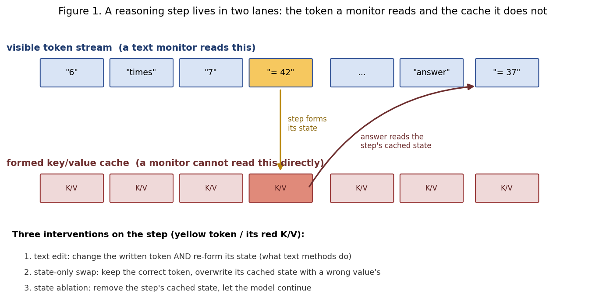
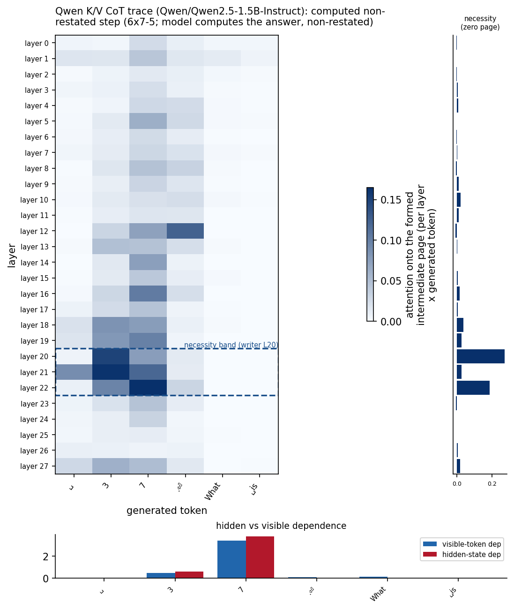
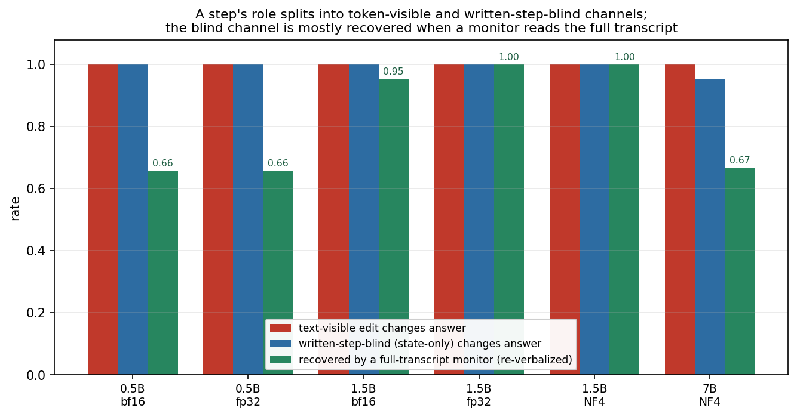
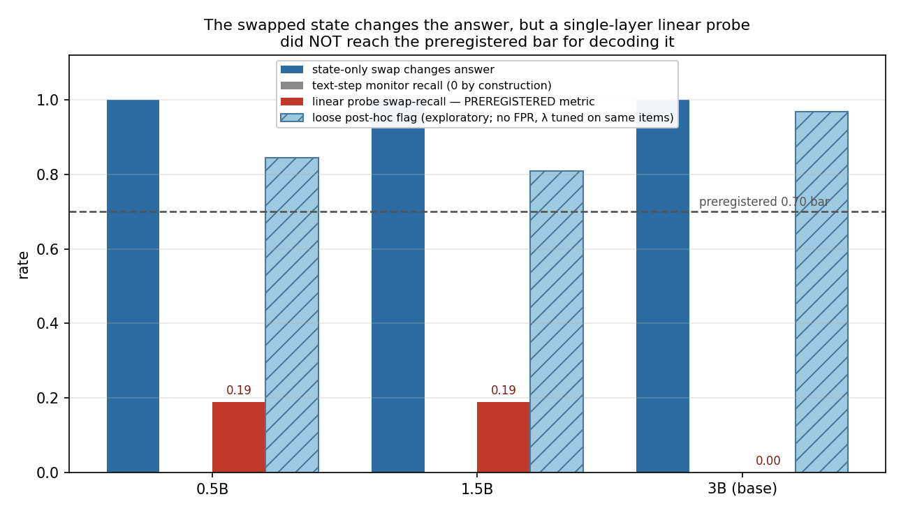
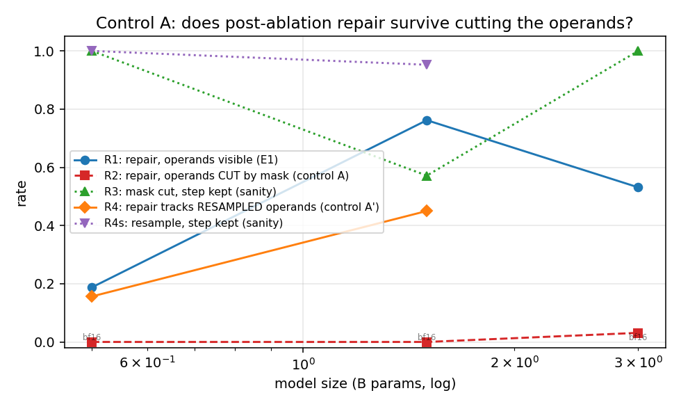
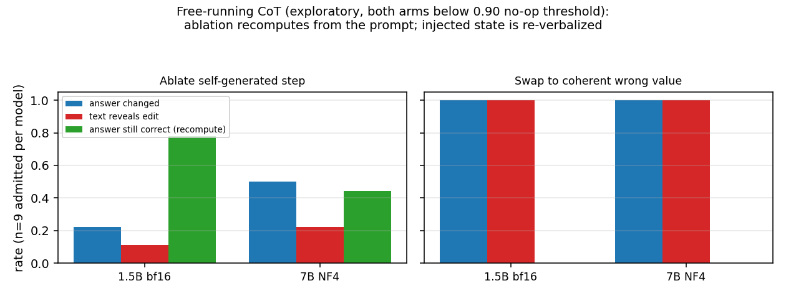

# The Answer Follows the Cache: A Reasoning Step's Formed State Can Override Its Written Token

**Jacob Hollenbeck**

## Abstract

Chain-of-thought monitoring assumes that reading what a model writes reveals what it used. We separate a reasoning step's role into the written token a monitor reads and the key/value cache it forms (Qwen2.5, 0.5B-3B), under a bit-exact restore control. Main pre-registered result: when the two channels disagree, the answer follows the cache. Overwriting only the step's stored state with a wrong value's, leaving the written token correct, changes the answer on 100% of items at 0.5B/1.5B/3B. The disagreement is injected, so it shows the hidden channel can override the token, not that models hide reasoning. A step-reading monitor has zero recall on it by construction, though the model usually re-verbalizes the injected value, so a full-transcript monitor recovers most. We also correct our earlier reading: when a removed step's answer survives, it is recomputed from still-visible operands — two pre-registered controls show the original answer is never reproduced once operands are cut or resampled (0.5B, 1.5B), making this a dispensability caveat for removal-based attribution, not a hidden channel. A single-layer linear probe did not reach its pre-registered detection bar. Natural-task reasoning is the open gap. Scope: synthetic arithmetic, greedy, one seed; a workshop-scale note.

---

## 1. Introduction

A chain-of-thought monitor reads the reasoning a model writes and acts on it: it flags steps that look like reward hacking, deception, or disallowed planning. This only works if the written reasoning is a faithful trace of the computation that produced the answer. Recent position work makes the stakes explicit: chain-of-thought monitorability is a real but fragile property that current training happens to give us and could remove (Korbak et al. 2025), and reasoning models already reach answers for reasons they do not state (Chen et al. 2025; Turpin et al. 2023).

Most faithfulness measurements intervene on the chain's *text* (truncate it, insert a mistake, paraphrase it, add filler) and watch the answer (Lanham et al. 2023; Turpin et al. 2023). These are black-box, which is their strength. But a text intervention changes two things at once: the token a monitor reads, and the internal state that token's position forms in the key/value cache. If the answer moves, a text method cannot say which of the two channels carried the effect.

This note separates the two channels on the same reasoning step, under an exact-restore control, and reports three things honestly, including a correction to our own prior work.

First, the central, pre-registered result. We make the two channels disagree by editing only the cache: we keep the written step correct but overwrite its stored state with a wrong value's. When they disagree, the answer follows the cache. A monitor that reads only the written step cannot see this, by construction. We are explicit that this disagreement is *injected* — no natural generation process writes a correct value into the text while forming a wrong one in the cache — so the result measures that the hidden channel *can* override the token, not that models do so on their own. Whether such a mismatch ever arises naturally, and on natural tasks, is the open gap.

Second, a correction. In an earlier draft we reported that removing a step's cached state and letting the model finish still produced the correct answer more often at larger scale, and read this as the model silently re-deriving the step through hidden state. A reviewer objected that the operands remain in the prompt, so this could be benign recomputation from still-visible inputs. Two pre-registered controls show the reviewer is right: once the operands are cut or resampled, the model never reproduces the original answer. The removal result is therefore a dispensability caveat for removal-based attribution — a step is under-counted when it is redundant with still-visible inputs — not evidence of a hidden channel.

Third, a negative. If the injected channel is dark to a text monitor, can a state-aware monitor read it instead? A single-layer linear probe on the cached state did not reach our pre-registered bar for detecting the swapped value. A state-aware monitor is the natural direction, but this simple version does not yet deliver it.

The practical reading is narrow and, we think, defensible for a workshop note: reading written reasoning steps is an upper bound on monitorability, not a measure of it, because a step's cached state can determine the answer against its written token; and removal-based attribution under-counts steps that are redundant with visible inputs. Both are shown on synthetic arithmetic with small models, and the natural-task version is future work.

---

## 2. Setup

*Formed state*, here, means the key/value cache written at a step's token positions during the forward pass: the internal state a token forms, as opposed to the token text itself.

### 2.1 Task

We study teacher-forced two-operation arithmetic chains. The written intermediate step is non-copied: the model states one value, and the final answer requires one more operation on it, while the answer cue never restates it. For example, the chain states "6 times 7 = 42" and the cue asks for that result minus five; the answer 37 cannot be produced by copying "42" alone. Removing the copy route lets a cache edit on the step be read as an edit to computed, not transcribed, information.

Each item is admitted only if the model's greedy completed answer under the chosen cue is correct and the model is on-policy for the step. Cues are selected per item from candidates that do not restate the step, taking the first the model answers correctly. Admission is per arm, so the admitted count n differs across models; we report n with every rate.

A numeric answer is credited only when the generated text closes it syntactically (end-of-sequence, a line break, an explicit "the answer is N", or terminal punctuation); an unfinished right-hand side such as "= 42 - 5" is not an answer. This conservative readout runs generation to 128 tokens and reads the closed answer.

### 2.2 Models and precision

We use Qwen2.5 at 0.5B, 1.5B, and 3B (and 7B where noted), greedy decoding, one seed, with stock attention and native causal masks. The 0.5B and 1.5B models are Instruct; the 3B is the base model (no 3B-Instruct was cached), so the 0.5B/1.5B-versus-3B comparison mixes Instruct with base and we treat 3B as an interior point only. The 7B-Instruct bfloat16 point is run via paged execution and is pending at the time of writing (job-050706578e6c), so no claim rests on it.

To characterize precision we ran 0.5B and 1.5B in both float32 and bfloat16, and 1.5B additionally in 4-bit (NF4); the precision details are in Appendix G and do not bear on the central dissociation.

### 2.3 The two channels

A reasoning step can influence the answer through two channels. The *token-visible channel* is the written step value as text, which a monitor reads; a text intervention acts on it, but because re-running re-forms the cache from the edited text, it moves the hidden channel too. The *hidden-state channel* is the key/value cache the step's positions form, which a reader of the written chain cannot access; we act on it directly by editing the cached rows while leaving the written tokens unchanged.

### 2.4 The exact-restore intervention and three canaries

All cache interventions operate on the step's token span across every layer and head. *Ablate* replaces the step's rows with the per-position mean. *Swap* overwrites the step's rows with another item's rows for the same span. *Restore* ablates then writes back the exact original rows.

The exact-restore control is the instrument's foundation: for every admitted item, restore reproduces the base answer's token-sequence log-probability to within 1e-3, and does so exactly (observed maximum absolute difference 0.0) on every item of every run. A change under ablate or swap is therefore attributable to the edit, not to replay error. Two further canaries guard against an inert or indiscriminate instrument: a copied point-read family (where the written value is a genuine copy) flips the answer on 100% of items under ablation, and in two-step chains ablating the already-consumed early step changes nothing (0.00) while ablating the decisive late step changes everything (1.00). All canaries pass on every run, including the operand-mask control of Section 7 (mask-identity canary 1.0).

One scope limit: the teacher-forced edit changes the step's *stored* state, which later answer generation reads; it does not rewrite already-formed downstream positions, and the model does not regenerate the earlier text after the edit. Section 8 relaxes this exploratorily.

*Figure 1. A non-copied reasoning step occupies two lanes. The written token "= 42" (yellow) is what a text monitor reads; the key/value state it forms (red) is what a monitor cannot read directly, and the answer reads from that state. The three interventions: a text edit changes the token and re-forms its state (what text methods do); a state-only swap keeps the correct token but overwrites its cached state; a state ablation removes the step's cached state and lets the model continue.*

The same instrument renders one real item concretely (Figure 2). On "6 times 7, minus 5" with scratchpad "6 times 7 = 42" (Qwen2.5-1.5B, bfloat16; the product 42 is never restated and the answer 37 is not the product), per-layer necessity peaks at the writer layer 20 (0.274) with a narrow commit band at layers 20-22, and at the decisive answer digit the answer depends on both the visible scratch token (3.38 nats) and the hidden formed state (3.76 nats). A state-only donor swap flips the answer while the visible text still reads "= 42" (the Section 4 dissociation, on one item); zeroing the page drives the answer wrong (−3.04 nats), consistent with Section 7 — on this item the removed value is not recovered. The exact-restore no-op canary is 0.0.

*Figure 2. What a text monitor reads versus what the cache holds, for one real item (Qwen2.5-1.5B bfloat16; the computed non-restated step 6×7−5, scratchpad "= 42", answer 37; job-e034c77db8d6). Top: a layer × generated-token heatmap of attention onto the formed intermediate page, with the per-layer necessity side panel peaking at the writer layer 20 (0.274) and the necessity/commit band 20-22 marked. Bottom: per generated token, the answer's dependence on the visible scratch token (blue) and on the hidden formed state (red); at the decisive answer digit both are load-bearing (visible 3.38, hidden 3.76 nats). A state-only donor swap flips the answer with the visible text fixed at "= 42". No-op canary 0.0. Trace and job in Appendix A.*

### 2.5 Monitor definition

A *step-reading monitor* reads the written reasoning steps, parses the stated step, and predicts the answer from it; this is the object text-based faithfulness work operates on, and it is blind to the hidden-state channel by construction. A *full-transcript monitor* reads the entire generated output, including the answer continuation. A *state-aware monitor* reads the cache itself (Section 5). We distinguish the three throughout.

---

## 3. The token-visible channel (prior supporting battery)

We first confirm, from a separate prior battery, that the token-visible channel behaves as text methods assume. This battery is not part of the pre-registered panels below: it is an earlier, independently recorded set of runs on a different task (code-trace) and different models (SmolLM2-1.7B, Qwen2.5-0.5B, Qwen3-8B, Qwen3-30B-A3B), measured with receipts and an exact-restore no-op. When a chain writes the answer value itself, swapping the key/value state at that written token flips the answer and shifts its log-probability by 8-14 nats across four families, while swapping the input operand tokens shifts it by under 2 nats and does not flip it; the answer is read from the externalized token, not re-integrated from the inputs, and a worked chain turns an otherwise-incapable model capable. Per-family numbers and provenance are in Appendix E. The point for this note is calibration: on the token-visible channel, a text monitor reads the thing that matters. The rest of the note concerns the case this picture misses.

---

## 4. The answer follows the cache: the token-versus-state dissociation

### 4.1 The dissociation design

We hold the task to the non-copied step and run a two-by-two on the same admitted items, crossing the written step token (correct original versus a wrong value) with the stored step state (correct original versus the wrong value's state): base (both correct); both-wrong (written value edited and re-formed, state wrong); state-only (written value correct, state wrong); and text-only (written value wrong, state restored to correct). The cell that isolates the hidden channel is state-only: the written chain reads the correct value, but the cached state is the wrong value's.

A scale signal appears in the fourth, text-only, cell. With the written value corrupted but the state restored to correct, the answer still changes on 0.47 (0.5B bfloat16) and 0.56 (0.5B float32) of items, but on 0.00 at 1.5B (all precisions) and 0.10 at 7B. At 0.5B the written token still pulls the answer with the state corrected; by 1.5B the corrected state dominates the wrong token. The channels are not only separable; their relative strength shifts toward the hidden channel with scale.

### 4.2 When the channels disagree, the answer follows the cache

Overwriting only the stored state with a wrong value's, with the written value left correct, changes the completed answer on 100% of admitted items at 0.5B, 1.5B, and 3B, and on 95% at 7B (Table 1). A concrete instance at 0.5B: the chain reads "6 times 7 = 42" (correct) while the state of "43" is installed, and the model answers 38 = 43 − 5. The written step is correct and the answer is wrong; a monitor reading only that step sees nothing amiss. This is the note's main, pre-registered result (the pre-registered prediction was a state-only change rate of at least 0.30; it is met with no room for doubt, and the falsifier, an interval including zero, does not fire).

**Table 1. State-only edit changes the answer while the written step stays correct, and the text-visible edit for comparison. Rate [95% bootstrap CI], n admitted single items.**

| Model | Precision | n | State-only change (answer follows cache) | Text-visible change |
|---|---|---:|---|---|
| 0.5B | bfloat16 | 32 | 1.00 [1.00, 1.00] | 1.00 |
| 0.5B | float32 | 32 | 1.00 [1.00, 1.00] | 1.00 |
| 1.5B | bfloat16 | 21 | 1.00 [1.00, 1.00] | 1.00 |
| 1.5B | float32 | 29 | 1.00 [1.00, 1.00] | 1.00 |
| 1.5B | NF4 | 21 | 1.00 [1.00, 1.00] | 1.00 |
| 3B (base) | bfloat16 | 32 | 1.00 [1.00, 1.00] | n/a |
| 7B | NF4 | 22 | 0.955 [0.864, 1.000] | 1.00 |

*3B provenance.* The 3B (base) state-only point comes from the control worker's `swap_changed` field (job-52b8771fc5ef, worker rev 3b4db8d2, pre-resample), not the main 2×2 dissociation panel, which never ran 3B; by definition it is the same monitor-blind swap quantity. The text-visible channel was therefore never measured at 3B (n/a); it was 1.00 on every row where it was run.

*Note on n.* For 1.5B NF4 the dissociation denominator (items with a valid 2×2 cell) is 21, the text-visible denominator 23, and the repair denominator (the Appendix G precision control, job-4a5981fa28fc) 24; the counts differ because the cells have different validity requirements.

The forward pass runs on the cache, so overwriting the step's cache with another value's state and getting that value's answer is close to a sanity check; the surprise would be the opposite. We therefore read this as confirming that the answer region *uses* the step's stored state, and as establishing the dissociation, not as a capacity number in any information-theoretic sense. The visible-token channel is at least as strong (1.00 on every row where it was measured; not measured at 3B), as expected.

### 4.3 The injected value usually reappears in the transcript

The channel is dark to a monitor that reads only the written step, but the model's own answer continuation usually exposes the injected value: with the state of 43 installed, the model continues "43 − 5 = 38", so 43 appears in the generated text. Among items where the state-only edit changed the answer, the continuation re-states the injected value on 21/32 at 0.5B (0.66), 20/21 at 1.5B bfloat16 (0.95), 29/29 at 1.5B float32 (1.00), 21/21 at 1.5B NF4 (1.00), and 14/21 at 7B (0.67). A monitor reading the full generated transcript would therefore catch most of this edit; the residual it misses is the minority of non-re-verbalized items. The defensible statement is that reading the written reasoning *step* is insufficient, because a step's cached state can override its written value, while reading the full transcript restores most of the visibility for this injected edit.

*Figure 3. For each arm, the text-visible edit (red) and the state-only edit (blue) each change the answer on nearly all items; the two channels are separately sufficient. The third series (green) is the fraction of state-only answer changes a full-transcript monitor would recover because the model re-verbalizes the injected value (0.66-1.00).*

### 4.4 Scope, sufficiency, and why text methods cannot isolate this

The state-only edit is injected: no natural generation process writes a correct value into the text while forming a wrong value's state, and we do not claim models do this on their own. Its role is to establish that the hidden channel can determine the answer against the token. A directed variant confirms sufficiency and content-specificity: installing a *different* item's step state (a donor swap) makes the model emit the donor's arithmetic answer on 0.59 of items at 0.5B (bfloat16, [0.41, 0.75], n=32), 0.81 at 1.5B bfloat16 ([0.62, 0.95], n=21), 1.00 at 1.5B float32 ([1.00, 1.00], n=29), and 0.82 at 7B NF4 ([0.64, 0.96], n=22). No text intervention can perform this — the written chain still shows the original step — because text perturbation co-varies token and state (editing the text re-forms the cache), so it cannot attribute an effect to either channel. This is the methodological gap relative to Lanham et al. (2023) and Turpin et al. (2023), whose interventions are our text-visible baselines.

---

## 5. Can a state-aware monitor read the hidden channel? Not yet with a single-layer probe

If the injected channel is invisible to a text monitor, the natural question is whether a monitor that reads the cache can catch it. We tested the simplest such monitor and report a negative result against our own pre-registration.

The channel is invisible to a step-reading monitor by construction: under the state-only edit the written step is the correct original, so a step-reading monitor predicts the base answer and its recall on the state-induced changes is zero. We then fit a cheap linear ridge probe (leave-one-out) on the cached value vectors at the step position (0.7 of depth) and asked whether it flags the state-only swap. The pre-registered detection metric — the probe decodes the installed wrong value (decoded equals the injected value and differs from the visible token) — reached recall 0.19 at 0.5B, 0.19 at 1.5B, and 0.00 at 3B, all well below the pre-registered 0.70 bar (Figure 4). The pre-registered prediction is **not met**: this simple probe does not reliably decode the swapped value.

A looser post-hoc flag (the decoded value merely differs from the visible token by at least two) reaches 0.84 (0.5B), 0.81 (1.5B), and 0.97 (3B), and the probe's base-value decode accuracy is above chance at 0.5B and 3B (0.44 and 0.28 versus a chance of about 0.05) though near chance at 1.5B (0.095 versus 0.062). We report these only as exploratory: the loose flag has no measured false-positive rate on unswapped items, and the ridge penalty was tuned on the same items used to evaluate, so these numbers are optimistic and do not substitute for the pre-registered metric. The honest conclusion is that a state-aware monitor is the right direction, but a single-layer linear probe did not reach the bar; a layer sweep and a proper held-out false-positive evaluation are the obvious next steps.

*Figure 4. The state-only swap changes the answer on all items (blue) and is invisible to a text-step monitor (grey, zero by construction). The pre-registered linear-probe swap-recall (red) is 0.19/0.19/0.00, below the 0.70 bar (dashed). The hatched bars are a looser post-hoc flag (decoded differs from the visible token by at least two), reported as exploratory only: no false-positive-rate control, and the ridge penalty was tuned on the same items.*

---

## 6. What a monitor can and cannot see

For the edit classes we measured, the picture is this. A step-reading monitor has zero recall on the injected state-only edit, by construction — not a discovered property. A full-transcript monitor recovers most of it, because the model usually re-verbalizes the injected value (Section 4.3); the residual is the minority of non-re-verbalized items. A state-aware monitor is the natural way to catch the rest, but our simple single-layer probe did not reach its pre-registered bar (Section 5). The defensible claim is therefore that reading written reasoning *steps* is an upper bound on monitorability rather than a measure of it, and that reading the full transcript is materially better for this injected edit; a cache-reading monitor remains promising but unproven here.

Two recommendations follow for teams that monitor chain-of-thought, stated as directions rather than validated methods. First, prefer full-transcript monitoring to step-parsing where feasible, since the answer continuation here carries most of what the step text omits. Second, a state-aware probe is worth building and evaluating properly (held-out false-positive rate, layer sweep); our negative result is a reason to do it carefully, not a reason to dismiss it. Where decomposition into separately checked sub-questions is feasible, it also narrows the gap between what the chain states and what the answer uses (Radhakrishnan et al. 2023).

---

## 7. Removing a step is dispensability, not concealment

### 7.1 The earlier reading and the objection

In an earlier draft we ablated a step's stored state, let the model complete its answer, and reported the "silent repair" rate — the answer still correct despite the removal — rising with scale, reading it as the model re-deriving the removed step through hidden state. A reviewer objected that the operands remain in the prompt and cache, so a recovered answer could be benign recomputation from still-visible inputs, which has the opposite monitoring implication (the monitor reads the same operands the model used). We tested this directly with two pre-registered controls, and the reviewer is right.

### 7.2 Two controls show it is recompute-from-prompt

The first control cuts the operands. We attention-mask the step's operand key positions in both prefill and generation, so no cue or answer position attends to them. With operands visible the repair rate is the original metric (R1); with operands cut and the step ablated it is R2; with operands cut but the step kept it is a sanity arm R3 that must stay answerable. The second control resamples the operands instead of masking them: we rebuild the item with the first operand changed to a new solvable value whose answer differs, then ablate the step as before, and ask whether the post-ablation answer equals the *new* operands' answer (recompute from the visible resampled operands) or the *original* answer (which would mean the ablated value survived — a hidden channel).

**Table 2. Operand-cut and resample controls. Rate [95% bootstrap CI]; "tracks-original" = the post-ablation answer equals the original answer (a hidden channel would make this large).**

| Model | n | R1 operands visible | R2 operands cut | R3 cut, step kept (sanity) | resample tracks-new | tracks-original | resample sanity |
|---|---:|---|---|---|---|---|---|
| 0.5B | 32 | 0.188 | 0.000 | 1.000 | 0.156 | 0.000 | 1.000 |
| 1.5B | 21 | 0.762 | 0.000 | 0.571 (mask destructive) | 0.450 | 0.000 | 0.952 |
| 3B (base) | 32 | 0.531 | 0.031 | 1.000 | — | — | — |

Where the mask is non-destructive (sanity 1.000 at 0.5B and 3B), repair collapses when the operands are cut: 0.188 to 0.000 at 0.5B, 0.531 to 0.031 at 3B. The written step is redundant given the still-visible operands. At 1.5B the mask proved destructive (sanity 0.571, below the 0.70 validity bar; all other canaries still pass, so the instrument is correct — this checkpoint simply puts more attention mass on the operand keys), so the resample control carries the verdict there: the post-ablation answer never equals the original answer (tracks-original 0.000) and instead tracks the resampled operands. The tracks-original rate is 0.000 at both 0.5B and 1.5B (3B had no resample arm; 7B is pending). The resample at 1.5B is a partial pass — the recompute rate 0.450 misses the pre-registered bound of R1 minus 0.15, because resampled products are recomputed less reliably than the original, often-memorized ones — but it still shows recompute-from-prompt, not survival of the ablated value.

### 7.3 What the removal result actually shows

The silent "repair" is therefore recompute from the still-visible prompt, not hidden re-derivation of the removed value. Its honest content is about *attribution*, not concealment: removal-based importance under-counts a step whenever the step is redundant with still-visible inputs. This is a concrete, directional instance of the general warning that circuit and faithfulness scores depend on ablation methodology (Miller et al. 2024), and a task-answer-grain instance of the self-repair family in which an ablation is compensated downstream (McGrath et al. 2023; Rushing & Nanda 2024). We explicitly retract the scale-growth-of-a-hidden-channel reading: the repair rate is not even monotone in size (0.188, 0.762, 0.531 at 0.5B, 1.5B, 3B), and the 3B point is a base model, so the mid-scale trend confounds instruction-tuning with scale. A clean high-scale point (7B-Instruct, bfloat16, paged) is pending (job-050706578e6c) and will be added when it lands; the dispensability conclusion does not depend on it.

*Figure 5. Does post-ablation repair survive cutting the operands? R1 (blue) is repair with operands visible; R2 (red) collapses to near zero when the operands are attention-masked, wherever the mask is non-destructive (sanity R3, green dotted, at 1.000 for 0.5B and 3B). The non-destructive resample control (R4 orange, sanity R4s purple) tracks the resampled operands, and the original answer is never reproduced (not shown: tracks-original 0.000 at 0.5B and 1.5B). The 1.5B mask is destructive (R3 0.571).*

---

## 8. Free-running chain-of-thought (exploratory)

To probe the deployment-closer setting we let the model write its own chain on natural word problems, admit items where the base answer is correct and a self-generated intermediate is locatable, then edit that intermediate's cached state and continue natively. This panel is exploratory and, by our pre-registered no-op threshold of 0.90, both arms are discounted (a no-edit re-rollout matches the base 8/9 = 0.889 at 1.5B and 5/9 at 7B). Two directional observations: a coherent *injected* value (swap) changes the free-running answer on 100% of items and is re-verbalized on 100% (so it is monitor-visible in free generation), and ablating a self-written step leaves the answer correct 7/9 of the time at 1.5B — which, given Section 7, we now read as the same recompute-from-prompt effect in free generation, not a hidden channel. No confirmatory claim rests on this panel; the table and figure are in Appendix F.

---

## 9. Related work

**Self-repair / the Hydra effect.** Our Section 7 result is a task-answer-grain instance of self-repair: ablating a component is compensated downstream, so the ablation under-states the component's role (McGrath et al. 2023, the Hydra effect; Rushing & Nanda 2024, across families, imperfect and noisy). Our controls additionally localize the compensation to recomputation from still-visible inputs. As a contrast, single-layer edits corrupt factual recall easily but repair it rarely (Bugaud 2026). What is specific here is the operand-cut and resample controls that pin the mechanism.

**Latent / implicit multi-step computation.** The dissociation is adjacent to work on internal intermediate computation. Yu (2024) probes hidden states on implicit multi-step arithmetic and argues models do not robustly compute intermediate steps internally when only prompted; our result is a causal rather than probing counterpart on a meaningful non-copied step, and our own probe negative (Section 5) is consistent with the difficulty that line reports. Yang et al. (2024) find latent multi-hop reasoning in a majority of prompts for some relation types; Biran et al. (2024) show back-patching corrects 32-66% of failed multi-hop answers, a repair-adjacent mechanism.

**Text-perturbation faithfulness and metric robustness.** Lanham et al. (2023) and Turpin et al. (2023) are our text-visible baselines; the methodological difference is that text perturbations cannot isolate the cache channel (Section 4.4). Pfau et al. (2024) show filler tokens' hidden states can carry computation absent from the token identities. Miller et al. (2024) show circuit faithfulness scores are highly sensitive to ablation methodology; our Section 7 gives that sensitivity a direction and a controlled cause. Korbak et al. (2025) and Baker et al. (2025) frame monitorability as valuable and fragile; Chen et al. (2025) show reasoning models often do not verbalize cues they rely on; Paul et al. (2024) and Bentham et al. (2024) study faithfulness metrics directly.

**Our own prior work (overlap statement).** A companion paper on time-formed circuits (its Section 8) reports the *existence* of the ablation-repair phenomenon and the swap-authorship numbers for this chain, with the two models in different precisions and without a strict distributed-circuit certificate. We cite that paper for the prior result and do not re-claim it. New here: the token-versus-state 2×2 dissociation with its donor-authorship and re-verbalization analysis; and the pre-registered operand-cut and resample controls that correct the repair reading to recompute-from-prompt. A separate small study of freely generated lexical bindings corroborates the hidden-state channel for non-arithmetic self-generated content at small n.

---

## 10. Limitations

The task is synthetic two-operation arithmetic, chosen so a non-copied step and a clean cue can be constructed and checked; everything here is arithmetic only, and synthetic arithmetic is the worst case for the removal result because the operands sit in the prompt. The natural-task version (word problems, operands not trivially present as clean tokens) is the main open gap and is future work. The state-only dissociation is *injected* — we construct the token-state disagreement — so it shows the hidden channel can override the token, not that a mismatch arises naturally. The models are small Qwen2.5 (0.5B/1.5B Instruct, 3B base), one greedy seed; the 3B base point confounds instruction-tuning with scale, and a clean 7B-Instruct point is pending. The operand-mask control is destructive at 1.5B (the resample control carries it there, as a partial pass). The probe is a single 0.7-depth layer with the ridge penalty tuned on the evaluated items and no held-out false-positive rate, so its negative result is a lower bound on what a state probe could do, and its loose positive flag is not trustworthy. Mean-ablation may push the cache off-distribution; a zero/resample-ablation comparison would harden Section 7 (the resample control is a first step). This is a workshop-scale note, not a main-venue claim.

---

## 11. Conclusion

A reasoning step influences a model's answer through two channels: the token it writes, which a monitor reads, and the cache it forms, which a monitor does not read directly. When we make them disagree, the answer follows the cache: an injected state-only edit, with the written step left correct, changes the answer on 100% of items at 0.5B/1.5B/3B, invisible to a step-reading monitor by construction — though the model usually re-verbalizes the injected value, so a full-transcript monitor recovers most. We correct our own earlier reading of a second experiment: removing a step and watching the answer survive is recompute from still-visible operands, shown by two pre-registered controls (the original answer is never reproduced once operands are cut or resampled), so it is a dispensability caveat for removal-based attribution, not a hidden channel. A state-aware monitor is the natural way to catch the injected channel, but a single-layer linear probe did not reach our pre-registered bar. Reading written reasoning steps is an upper bound on monitorability, not a measure of it; the natural-task version of these measurements is the next step.

---

## Appendix A. Experiment table

All runs: Qwen2.5, greedy, one seed, stock attention with native causal masks, on a single RTX 4080. CIs are 95% item-level bootstrap (10,000 resamples). The primary record is `saturn/experiments/2026-10-02-cot-formed-state-faithfulness/`.

**Teacher-forced dissociation runs (Sections 4).** 0.5B bf16 `job-8acc379d0951`, 0.5B fp32 `job-bd0bf96a7a27`, 1.5B bf16 `job-d0ad89ab793c`, 1.5B fp32 `job-4861f1f15284`, 1.5B NF4 `job-4a5981fa28fc`, 7B NF4 `job-bc10cd445816`.

**Controls (Section 7) and probe (Section 5), pre-registered in `PREREG-addendum-2.md`.** Operand-cut: 0.5B `job-87c47cb47c2b`, 1.5B `job-e3c984961358`, 3B `job-52b8771fc5ef`; resample smoke `job-2a7348247f9e`; 7B paged (pending) `job-050706578e6c`, 7B smoke `job-0a266818dfcb`. The probe (Section 5) is computed on the same control runs.

**Single-item VM trace (Figure 2).** Qwen2.5-1.5B bf16, item 6×7−5 (scratchpad "= 42", answer 37), `job-e034c77db8d6`; per-layer necessity peak at layer 20 (0.274), band 20-22, state-only donor swap flips the answer with the visible text fixed, no-op canary 0.0. Source: `saturn/experiments/2026-10-02-vm-trace-visualizer/`.

**Supporting prior experiments.** Token-visible battery (Section 3, Appendix E): `saturn/experiments/2026-08-21-ird-fruit-battery/README.md`. Prior ablation-repair precedent (E10): `research/papers/time-formed-circuits/paper.md`; `saturn/experiments/2026-10-01-e10-completed-answer-rerun/FINDINGS.md`. Self-generated-state corroboration: `saturn/experiments/2026-10-01-qwen-alias-binding-feedback/FINDINGS.md`.

## Appendix B. Methods details

**Interventions.** Cache edits act on the step's token span across all layers and heads. Ablate replaces rows with the per-position mean; swap overwrites with another cache's same span; restore writes back the exact original rows. The text-visible edit replaces the written step value with a same-token-length wrong value and re-prefills.

**Operand-cut control (A).** Attention-mask the step's operand key positions (the two operands in both the question and Step 1) during both prefill and generation. Arms: R1 repair with operands visible; R2 operands cut and step ablated; R3 operands cut, step kept (validity sanity, must be at least 0.70). Decision rule: valid only if R3 at least 0.70, then R2 at most half of R1 indicates recompute-from-prompt.

**Operand-resample control (A').** Rebuild the item with the first operand changed to a consistent, solvable value whose answer differs, then mean-ablate the step. tracks-new = the answer equals the resampled operands' answer; tracks-original = the answer equals the original answer; resample sanity = step kept, answerable.

**Probe (B).** Leave-one-out linear ridge probe on the cached value vectors at 0.7 of depth. Pre-registered metric: swap-decode recall = the decoded value equals the injected wrong value and differs from the visible token (bar 0.70). Exploratory loose flag: the decoded value differs from the visible token by at least two, reported with the caveat that it has no false-positive-rate control and the ridge penalty was tuned on the evaluated items.

**Canaries (all runs).** Exact-restore no-op: maximum absolute answer-sequence log-probability difference 0.0 (threshold 1e-3). Copied point-read: 1.00 (n=8; at 7B 6/6 over 7 admitted copied items). Early-versus-late: 0.00 / 1.00 (n=8). Mask-identity canary: 1.0.

**Statistics.** Rates over admitted items (each item one bootstrap cluster); intervals from 10,000 resamples; rates with fewer than 8 items reported as fractions.

## Appendix C. Pre-registration predictions and outcomes

| Prediction (frozen before runs) | Outcome |
|---|---|
| State-only change at least 0.30 at 1.5B and 7B; text-visible at least as large | Met: 1.00 at 0.5B/1.5B/3B, 0.955 at 7B; text-visible 1.00 on every row where it was measured (not measured at 3B). Continuation re-verbalizes the injected value on 0.66-1.00 of changed items, so the blind label is for a step-reading monitor |
| (Addendum 2, control A) R3 ≥ 0.70 for validity; R2 ≤ 0.5·R1 ⇒ recompute-from-prompt | Met and confirmed at 0.5B and 3B (R3 1.000; R2 ≈ 0). 1.5B mask destructive (R3 0.571), resolved by the resample control |
| (Addendum 2, control A') tracks-original ≈ 0 if no hidden channel; R4 ≥ R1 − 0.15 for sanity | tracks-original 0.000 at 0.5B and 1.5B (no hidden channel). R4 bound met at 0.5B; missed at 1.5B (0.450) — partial pass, still recompute-from-prompt |
| (Addendum 2, control B) probe swap-decode recall ≥ 0.70 | NOT met: 0.19 / 0.19 / 0.00 at 0.5B / 1.5B / 3B. A single-layer linear probe does not reliably decode the swapped value |
| Repair rises with scale (original E1 reading) | Retracted: repair is recompute-from-prompt (controls above); the rate is non-monotone and the 3B point is a base model |
| Exact-restore no-op reproduces base answer within 1e-3 | Held exactly (0.0) on every admitted item and run |

## Appendix D. Deviations and provenance

- 3B is Qwen2.5-3B **base** (no 3B-Instruct cached); treated as an interior point; the 3B control row ran under worker revision 3b4db8d2 (not the addendum-2 frozen header 50ebb297); "base" rests on the model directory name, and the loaded config confirms the 3B architecture. The resample control (A') was added after 3B had run, so 3B has no resample arm.
- Addendum-2 pre-registration timing: the frozen UTC is as recorded; the file was rewritten at 02:57 to add the resample arm (additive); no earlier copy of the file exists, so the addendum-2 pre-registration is honestly additive rather than bit-immutable. Predictions and falsifiers for the mask control predate the first control job.
- 7B-Instruct bfloat16 runs via paged offload and is pending (`job-050706578e6c`); no claim rests on it. The 7B NF4 dissociation point (0.955) is from the original panel.
- Probe caveats: single 0.7-depth layer; leave-one-out decode but the ridge penalty tuned on the evaluated items; no held-out false-positive rate for the loose flag.
- VRAM figures for the 7B bfloat16 fit are asserted from model size, not from a saved artifact.
- A custody audit of addendum-2 is in progress; small wording fixes to these numbers may follow and will be folded in with a changelog.

## Appendix E. Token-visible channel: per-family numbers (Section 3)

Prior battery, separate task (code-trace) and models, float32, exact-restore no-op passing, no falsifier firing. Written-token state swap versus input-only swap, as the answer's log-probability shift in nats: SmolLM2-1.7B 8.02 vs 0.94; Qwen2.5-0.5B 9.23 vs 0.88; Qwen3-8B 14.18 vs 0.53; Qwen3-30B-A3B 11.59 vs 1.64 (plain incapable at margin −1.09, chain-capable at +5.82). At 1.7B the plain prompt is answered incorrectly (−0.54) and a worked chain makes it correct (+2.40). Source: `saturn/experiments/2026-08-21-ird-fruit-battery/README.md`. A supporting prior battery, not part of the pre-registered panels.

## Appendix F. Free-running chain-of-thought (discounted panel)

Both arms are below the pre-registered no-op threshold of 0.90 and are reported for completeness only.

| Model | n | Ablate: answer changed | Ablate: still correct | Ablate: text reveals edit | Swap: answer changed | Swap: text reveals edit | Free no-op canary |
|---|---:|---|---|---|---|---|---|
| 1.5B bfloat16 | 9 | 0.222 | 0.778 | 0.111 | 1.000 | 1.000 | 0.889 (8/9), discounted |
| 7B NF4 | 9* | 0.500 | 0.444 | 0.222 | 1.000 | 1.000 | 0.556 (5/9), discounted |

*The 7B ablate rate is over 8 scored items (one of the 9 admitted lacked a scored ablate continuation). Given Section 7, the ablate "still correct" rate is read as recompute-from-prompt, not a hidden channel.

*Figure F1. Free-running chain-of-thought (exploratory; both arms below the 0.90 no-op threshold). Left: ablating a self-generated step changes the answer rarely, the answer is usually still correct (now read as recompute-from-prompt), and the text seldom reveals the edit. Right: swapping to a coherent wrong value always changes the answer and is always re-verbalized.*

## Appendix G. Repair-rate precision controls (supplementary)

These characterize the uncontrolled repair rate (R1), now understood as recompute-from-prompt (Section 7); they do not bear on the dissociation. The float32-versus-bfloat16 control is a null (0.5B 0.188 = 0.188; 1.5B 0.762 vs 0.828, overlapping intervals), so the repair rate is not a bfloat16 artifact. NF4 4-bit quantization lowers it at fixed size (1.5B 0.292 vs 0.762 in bfloat16). Per-arm repair rates and a two-precision-axis plot are in the primary record (`results/analysis-summary.json`, `figures/figG1_repair_vs_scale.png`).

*Figure G1. Supplementary: the uncontrolled repair rate (R1) by size and precision, two precision axes drawn separately, 7B marked NF4. This is the recompute-from-prompt rate of Section 7, retained only to show the precision controls; the scale-growth-of-a-hidden-channel reading is retracted.*

## References

- Baker, B., Huizinga, J., Gao, L., Dou, Z., Guan, M. Y., Madry, A., Zaremba, W., Pachocki, J., Farhi, D. (2025). Monitoring Reasoning Models for Misbehavior and the Risks of Promoting Obfuscation. arXiv:2503.11926.
- Bentham, O., Stringham, N., Marasović, A. (2024). Chain-of-Thought Unfaithfulness as Disguised Accuracy. arXiv:2402.14897.
- Biran, E., Gottesman, D., Yang, S., Geva, M., Globerson, A. (2024). Hopping Too Late: Exploring the Limitations of Large Language Models on Multi-Hop Queries. EMNLP 2024. arXiv:2406.12775.
- Bugaud, Z. (2026). Single-Layer Activation Edits Easily Corrupt Factual Recall but Rarely Repair It. TrustNLP 2026, pp. 515-527.
- Chen, Y., Benton, J., Radhakrishnan, A., Uesato, J., Denison, C., Schulman, J., Somani, A., Hase, P., Wagner, M., Roger, F., Mikulik, V., Bowman, S. R., Leike, J., Kaplan, J., Perez, E. (2025). Reasoning Models Don't Always Say What They Think. arXiv:2505.05410.
- Korbak, T., Balesni, M., Barnes, E., Bengio, Y., Benton, J., Bloom, J., Chen, X., Cooney, A., et al. (2025). Chain of Thought Monitorability: A New and Fragile Opportunity for AI Safety. arXiv:2507.11473.
- Lanham, T., et al. (2023). Measuring Faithfulness in Chain-of-Thought Reasoning. arXiv:2307.13702.
- McGrath, T., Rahtz, M., Kramár, J., Mikulik, V., Legg, S. (2023). The Hydra Effect: Emergent Self-repair in Language Model Computations. arXiv:2307.15771.
- Miller, J., Chughtai, B., Saunders, W. (2024). Transformer Circuit Faithfulness Metrics are not Robust. arXiv:2407.08734.
- Paul, D., West, R., Bosselut, A., Faltings, B. (2024). Making Reasoning Matter: Measuring and Improving Faithfulness of Chain-of-Thought Reasoning. arXiv:2402.13950.
- Pfau, J., Merrill, W., Bowman, S. R. (2024). Let's Think Dot by Dot: Hidden Computation in Transformer Language Models. arXiv:2404.15758.
- Radhakrishnan, A., Nguyen, K., Chen, A., Chen, C., Denison, C., et al. (2023). Question Decomposition Improves the Faithfulness of Model-Generated Reasoning. arXiv:2307.11768.
- Rushing, C., Nanda, N. (2024). Explorations of Self-Repair in Language Models. ICML 2024. arXiv:2402.15390.
- Turpin, M., Michael, J., Perez, E., Bowman, S. R. (2023). Language Models Don't Always Say What They Think: Unfaithful Explanations in Chain-of-Thought Prompting. NeurIPS 2023. arXiv:2305.04388.
- Yang, S., Gribovskaya, E., Kassner, N., Geva, M., Riedel, S. (2024). Do Large Language Models Latently Perform Multi-Hop Reasoning? ACL 2024. arXiv:2402.16837.
- Yu, Y. (2024). LLMs Do Not Think Step-by-step In Implicit Reasoning. arXiv:2411.15862.
