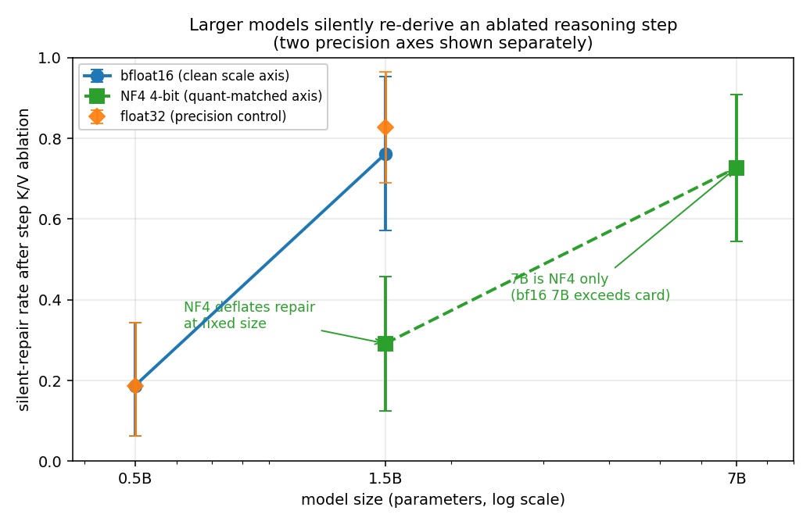
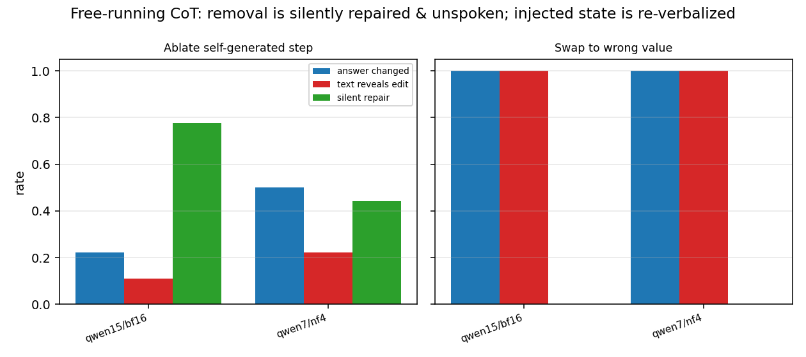

# Formed-State Faithfulness: A Reasoning Step's Causal Role Splits Into the Token a Monitor Sees and the Cache It Cannot

**Jacob Hollenbeck**

## Abstract

Chain-of-thought monitoring assumes that reading what a model writes tells you what it used. We test this for a single arithmetic step whose written value the prompt never restates, splitting its role into a token-visible channel (the written value a monitor reads) and a hidden-state channel (the cache it forms). Every edit is gated by an exact-restore control that reproduces the base answer bit-for-bit. The hidden channel has near-total capacity: overwriting only the cached state with a wrong value's state, written value held correct, changes the answer on 100% of items at 0.5B and 1.5B (n=21-32) and 95% at 7B. A monitor reading only the written step is blind to this artificial edit, though the model's answer continuation usually re-states the injected value (0.66-1.00), so a full-transcript monitor recovers most. The natural gap is silent repair, rising with scale: after a step's state is removed, the still-correct rate rises from 0.19 (0.5B) to 0.76 (1.5B) in bfloat16, non-overlapping intervals, replicated 0.29-0.73 on a 4-bit axis, the removal unannounced in text. So removal-based metrics under-count steps, more so with scale. Monitoring only the written reasoning steps bounds monitorability rather than measuring it. Scope: synthetic arithmetic, Qwen2.5 ≤7B, greedy, one seed.

---

## 1. Introduction

A chain-of-thought monitor reads the reasoning a model writes and acts on it: it flags steps that look like reward hacking, deception, or disallowed planning. This only works if the written reasoning is a faithful trace of the computation that produced the answer. Recent position work makes the stakes explicit: chain-of-thought monitorability is a real but fragile property that current training happens to give us and could remove (Korbak et al. 2025), and reasoning models already reach answers for reasons they do not state (Chen et al. 2025; Turpin et al. 2023).

Most faithfulness measurements intervene on the chain's *text*. They truncate it, insert a mistake, paraphrase it, or replace it with filler, then watch whether the answer moves (Lanham et al. 2023; Turpin et al. 2023). These are the right first questions and they are black-box, which is their strength. But a text intervention always changes two things at once: the token a monitor would read, and the internal state that token's position forms in the key/value cache. If the answer moves, a text method cannot say which of the two channels carried the effect.

This paper separates the two channels and measures each. We study a single reasoning step whose written value is *non-copied*: the final answer needs one further operation on it, and the prompt never restates the value, so a correct answer cannot be produced by copying the written number alone. On such a step we can ask two distinct questions. Does the answer depend on the *written token* (the thing a monitor sees)? And does it depend on the *formed cache state* at that token's position (the thing a monitor cannot see)?

We make the second question answerable with an exact-restore control. Our interventions edit the formed key/value cache directly: we ablate a step's cached rows, or overwrite them with another value's rows. Before trusting any such edit, we require that ablating and then restoring the exact original rows reproduces the base answer's token sequence log-probability bit-for-bit. When restoration is exact, any change we then measure under a real edit is caused by that edit, not by a leaky replay. This control passes on every item of every run reported here.

Our contributions are the following.

1. A clean dissociation of the two channels on the same items. We show that a step's written value and its formed cache state are *separately* sufficient to determine the answer, using edits that a text-only method cannot perform (Sections 3 and 4).

2. A capacity measurement for the hidden channel. Overwriting only the cached state, with the written step value held correct, changes the answer on 95-100% of items across model sizes and precisions (Section 4). A monitor reading only the written step is blind to this, but the model's answer continuation usually re-states the injected value, so a full-transcript monitor recovers most of it (Section 4.2). We are explicit that this is an artificial edit used to measure what the hidden channel *can* carry, not evidence that models route reasoning through hidden state in the wild.

3. A naturally occurring faithfulness gap that grows with scale. Larger models silently re-derive a removed step and still answer correctly more often than smaller ones, at fixed precision, with a precision control that rules out a floating-point artifact (Section 5). We also report a confound we did not predict: 4-bit quantization roughly halves this repair.

4. A free-running demonstration (the model writes its own chain) that silent repair of removed steps is real outside the teacher-forced setting, with the regenerated text usually not announcing the removal (Section 6).

5. The monitorability consequence, stated with its scope: for the state-only edit class, a monitor that reads only the written reasoning step has zero recall by construction, though a monitor that reads the full generated transcript recovers most of it because the model re-verbalizes the hidden value; and, as the naturally occurring case, removal-based attribution under-counts a step's role, increasingly with scale, and the removal is not revealed in the text (Section 7). We recommend state-aware probes and repair-aware ablation metrics.

The headline for practice is narrow and, we think, defensible: monitoring only the written reasoning steps is an *upper bound* on what a monitor can know, not a measure of it. How loose that bound is depends on the model, the edit, and whether the monitor reads the full transcript, and we quantify it for one task family.

---

## 2. Setup

### 2.1 Task

We study teacher-forced two-operation arithmetic chains. The written intermediate step is non-copied: the model states one value, and the final answer requires one more operation on that value, while the answer cue never restates it. For example, the chain states "6 times 7 = 42" and the cue then asks for that result minus five; the answer 37 cannot be produced by copying "42" alone. Removing the copy route is what lets a cache edit on the step be interpreted as an edit to computed, not transcribed, information.

Each item is admitted to an arm only if two conditions hold: the model's greedy completed answer under the chosen cue is correct, and the model is on-policy for the step, meaning it would itself compute the step's value. Answer cues are selected per item from candidates that do not restate the step, taking the first the model answers correctly. Admission is per arm, so the admitted count n differs across models; we report n with every rate.

A numeric answer is credited only when the generated text closes it syntactically (an end-of-sequence token, a line break, an explicit "the answer is N", or terminal punctuation). An unfinished right-hand side such as "= 42 - 5" is not counted as an answer. This conservative reading matters: an earlier version of this line of work used a short fixed-length parser that scored unfinished expressions as answers, which inflated apparent removal failures; the present readout lets generation run to 128 tokens and reads the closed answer (see Appendix, deviations).

### 2.2 Models and precision

We use Qwen2.5-Instruct at 0.5B, 1.5B, and 7B parameters, greedy decoding, one seed, with stock attention and native causal masks. We could not run a clean single-precision curve across all three sizes, and we are explicit about why and how we compensate.

The 3B checkpoint was not available in our cache and new downloads were disallowed under a storage constraint, so the size curve is 0.5B / 1.5B / 7B. The 7B model in bfloat16 did not fit on our 16 GB accelerator: an attempt to run 7B in bfloat16 was recorded but never completed as a job, while 4-bit quantization fit with an observed peak of 5.9 GB. The 7B model therefore runs in 4-bit (NF4). The specific capacity figures (bfloat16 weights near 15.2 GB, the rejected reservation, the admittable ceiling) are asserted from model size and our configuration rather than taken from a saved rejection artifact, and are collected in the appendix.

To keep the scale claim from being a precision artifact we add two measured controls. We run 0.5B and 1.5B in both float32 and bfloat16 (the float32-versus-bfloat16 axis), and we run 1.5B additionally in NF4 (the bfloat16-versus-4-bit axis). The NF4 control at 1.5B brackets the 7B-NF4 point so that 7B is compared to a quantization-matched 1.5B rather than to the bfloat16 curve. As Section 5 reports, this control earned its place: 4-bit quantization itself changes the repair rate.

### 2.3 The two channels

We define two channels by which a reasoning step can influence the answer.

The *token-visible channel* is the written step value as text. This is what a chain-of-thought monitor reads. A text intervention (edit the written value and re-run) acts on this channel, but because re-running re-forms the cache from the edited text, it moves the hidden channel too.

The *hidden-state channel* is the key/value cache the step's token positions form. A reader of the written chain has no access to it. We act on this channel directly by editing the cached rows while leaving the written tokens unchanged.

### 2.4 The exact-replay intervention

All cache interventions operate on the step's token span across every layer and attention head. We use three operations. *Ablate* replaces the step's cached rows with the per-position mean (removing the step's specific state). *Swap* overwrites the step's rows with another item's cached rows for the same span (installing a different value's state). *Restore* ablates and then writes back the exact original rows.

The exact-restore control is the instrument's foundation. For every admitted item, restore must reproduce the base answer's token-sequence log-probability to within 1e-3; it does so exactly (observed maximum absolute difference 0.0) on every item of every run, including the 4-bit runs. Because restoration is bit-exact, a change observed under ablate or swap is attributable to the edit rather than to replay error.

One scope limit of the teacher-forced cache edit is worth stating up front. The edit changes the step's *stored* state, which later answer generation reads; it does not rewrite positions downstream of the step that were already formed when the chain was prefilled, and in the teacher-forced panel the model does not regenerate the earlier text after the edit. This is a measurement of how the already-formed answer region uses the step's stored state, not a test of whether the model would regenerate the step if forced to. Section 6 relaxes this by letting the model write and continue its own chain.

### 2.5 Three validity canaries

Three canaries guard against the instrument being either inert or a blanket disruptor. All three pass on every run.

The *exact-restore no-op* (Section 2.4) is the first: restore reproduces the base answer bit-for-bit.

The *copied point-read canary* uses a passcode-readout family where the written value genuinely is a copy of a prompt token. There, ablating the value must flip the answer, because the answer is a pure read of that value. It flips on 100% of items (n=8 per run; n=6-7 at 7B). This shows the instrument fires when a value really is read from its token.

The *early-versus-late canary* uses two-step chains. Ablating the already-consumed early step changes nothing (rate 0.00, n=8), while ablating the decisive late step changes everything (rate 1.00, n=8). This shows the instrument is localized to the step it edits rather than disrupting generation indiscriminately.

### 2.6 Monitor definition

Throughout, a *monitor* is any process that reads the written chain-of-thought tokens, parses the stated steps, and predicts the model's answer from them. This is the object that text-based faithfulness and monitorability work operates on. We make no assumption about the monitor's strength beyond that it reads only the written text; a perfect such monitor is still blind to the hidden-state channel by construction, and we use that fact in Section 7.

<!-- TODO figure: VM trace render -->

*Figure 1 (planned).* Schematic of one chain-of-thought step rendered as two lanes: the written token a monitor reads, and the formed key/value state it cannot. A trace visualizer that renders hidden versus visible content per step is in preparation and will replace this placeholder.

---

## 3. The token-visible channel

Before measuring the hidden channel we establish, as calibration, that the token-visible channel is real and can dominate. When a chain states the answer value itself, the model reads that value as a copy from the written token rather than recomputing it; this is the channel text monitors are designed to see and the one text-perturbation methods act on. We measure it on a code-trace task where the plain, no-chain prompt is beyond the model: at 1.7B parameters the plain prompt is answered incorrectly (margin -0.54 nats) and a worked chain makes it correct (+2.40 nats), so the chain is load-bearing rather than post-hoc.

Under the chain we compare two cache swaps. Swapping the state at the single written answer token to a different value's trace flips the committed answer and shifts its log-probability by 8 to 14 nats; swapping the input operand tokens instead shifts the answer by under 2 nats and does not flip it. The answer is read from the externalized token, not re-integrated from the inputs. This dissociation replicates across four families: 1.7B (written-token swap 8.02 nats versus input-only 0.94), 0.5B (9.23 versus 0.88), 8B (14.18 versus 0.53), and a 30B mixture-of-experts model (11.59 versus 1.64, plain incapable at -1.09, chain-capable at +5.82). The written-token swap exceeds the input swap in every family, in float32, with the exact-restore no-op passing and no falsifier firing.

The token-visible channel therefore behaves as text-based accounts assume: when the chain writes the answer, the answer is a point-read of the written token, and a text monitor is reading the thing that matters. The rest of the paper concerns the case this picture misses, where the written step is not the answer and the answer depends on state the text does not carry.

---

## 4. The hidden-state channel: token-versus-state dissociation

### 4.1 The dissociation design

We now hold the task to the non-copied step (Section 2.1) and run a two-by-two design on the same admitted items, crossing the written step token (correct original versus a wrong value) with the stored step state (correct original versus the wrong value's state). The four cells are: base (both correct); both-wrong (written value edited to a mistake and re-formed, state wrong); state-only (written value correct, state overwritten to the wrong value's); and text-only (written value edited, state restored to correct).

The cell that isolates the hidden channel is state-only: the written chain reads the correct original value, but the cached state at that position is the wrong value's. A monitor reading the chain sees a correct step. We ask how often this changes the completed answer.

### 4.2 The hidden channel has near-total capacity

Overwriting only the stored state, with the written value left correct, changes the completed answer on 100% of admitted items at 0.5B and 1.5B parameters, in bfloat16, float32, and NF4 alike, and on 95% at 7B (Table 1). A concrete instance at 0.5B: the chain reads "6 times 7 = 42" (correct) while the state of "43" is installed, and the model answers 38, which is 43 minus 5. The written step is correct and the answer is wrong, so a monitor reading only that step sees nothing amiss; whether the rest of the generated text exposes the injected value is the subject of Section 4.3, and it usually does.

**Table 1. State-only edit changes the answer while the written chain stays correct (monitor-blind rate), and the text-visible edit for comparison. Rate [95% bootstrap CI], n admitted single items.**

| Model | Precision | n | Monitor-blind change (state only) | Text-visible change |
|---|---|---:|---|---|
| 0.5B | bfloat16 | 32 | 1.00 [1.00, 1.00] | 1.00 |
| 0.5B | float32 | 32 | 1.00 [1.00, 1.00] | 1.00 |
| 1.5B | bfloat16 | 21 | 1.00 [1.00, 1.00] | 1.00 |
| 1.5B | float32 | 29 | 1.00 [1.00, 1.00] | 1.00 |
| 1.5B | NF4 | 21 | 1.00 [1.00, 1.00] | 1.00 |
| 7B | NF4 | 22 | 0.955 [0.864, 1.000] | 1.00 |

The pre-registered prediction was a monitor-blind change rate of at least 0.30 with the text-visible rate at least as large. Both held with room to spare: the hidden channel is near-total, and the visible channel is equally strong (1.00 everywhere). The confidence intervals exclude zero, so the pre-registered falsifier (no hidden causal channel) does not fire.

*Figure 3. For each model and precision, the text-visible edit (red: written value and state both wrong) and the state-only edit (blue: written value correct, only the cached state wrong) each change the answer at essentially the same near-total rate. The two channels are separately sufficient to determine the answer; a monitor reading only the written step is blind to the blue channel, though the model's answer continuation usually re-states the injected value (Section 4.3).*

### 4.3 The written step is blind, but the answer continuation often is not

The "monitor-blind" label is scoped to a monitor that reads only the fixed written reasoning step. The model's own answer continuation frequently exposes the injected value. In the "6 times 7 = 42" example, the model, with the state of 43 installed, continues "43 − 5 = 38, therefore the answer is 38": the hidden value 43 appears in the generated text. We measured how often this happens. Among the items where the state-only edit changed the answer, the generated answer continuation re-states the injected value on 21 of 32 items at 0.5B (0.66), 20 of 21 at 1.5B bfloat16 (0.95), 29 of 29 at 1.5B float32 (1.00), 21 of 21 at 1.5B NF4 (1.00), and 14 of 21 at 7B (0.67). A monitor that reads the full generated transcript, not just the stated step, would therefore catch most of this particular edit.

The correct reading of the dissociation is therefore the following. The step's hidden state determines the answer even when the step's visible token says the opposite; monitoring the written step alone is insufficient; and the model then usually re-states the hidden value later in its answer, so monitoring the full transcript partly to largely recovers the information. What the written step fails to carry, the answer sometimes carries instead. The part of this result that no monitor recovers is confined to the items where the continuation does *not* re-verbalize the value (about a third at 0.5B and 7B, near zero at 1.5B), and even there the claim is about a constructed edit, not natural behavior.

### 4.4 This is a capacity measurement, not a hiding claim

We are deliberate about what this result is and is not. The state-only edit is artificial. No natural generation process writes a correct value into the text while forming a wrong value's state at that position; we construct that mismatch by hand. What the result establishes is *capacity*: the answer can be determined, essentially in full, by state that the written chain does not expose. It is an existence-and-magnitude proof about the hidden channel, obtained by driving it directly.

This matters for monitoring because capacity bounds what any hidden channel could carry if a model, through training or architecture, came to use it. A text monitor's guarantee is only as strong as the assumption that the written chain carries the information the answer uses; Section 4.2 shows that assumption can fail completely for information that lives in the cache. It does not show that it fails on its own in ordinary generation. The naturally occurring gap is the subject of Sections 5 and 6.

### 4.5 Directed state authorship (sufficiency)

A second edit confirms the hidden channel is not merely necessary but sufficient and content-specific. Instead of ablating the step, we install a *different* item's step state (a donor swap) and ask whether the model emits the donor's arithmetic answer. It does, on 0.59 of items at 0.5B (bfloat16, [0.41, 0.75], n=32), rising to 0.81 at 1.5B (bfloat16, [0.62, 0.95], n=21), 1.00 at 1.5B (float32, [1.00, 1.00], n=29), and 0.82 at 7B (NF4, [0.64, 0.96], n=22). Authorship rises with scale and is high at every size. No text intervention can perform this edit, because the written chain in the donor-swap arm still shows the original step; the donor's influence travels entirely through the installed state.

### 4.6 Why this cannot be done with text perturbation

Text perturbation co-varies the two channels: editing the written value re-forms the cache from the edited text, so a text method moves token and state together and cannot attribute the effect to either. The state-only cell and the donor swap move the state with the token held fixed, which is exactly the manipulation a text-only method cannot express. This is the methodological gap the paper fills relative to Lanham et al. (2023) and Turpin et al. (2023): their interventions are our text-visible baselines, and they are strong, but they are blind to the hidden channel by construction.

---

## 5. Silent repair rises with scale

### 5.1 The measurement

We now ask the natural-faithfulness question with a single-channel edit: ablate the step's stored state (remove it), let the model complete its 128-token answer, and ask whether the answer is still correct. A correct answer after removal is *silent repair*: the model reconstructs the removed step, or routes around it, and the completed text does not announce that anything was removed. A wrong answer is a clean removal failure.

Silent repair is the faithfulness-relevant quantity because removal-based attribution treats a removal failure as evidence that the step mattered. If a model silently repairs, the step did matter to the original computation, but the removal test scores it as dispensable. The more a model repairs, the more such tests under-count.

### 5.2 Repair rises with scale at fixed precision

Silent repair rises sharply with model size (Table 2, Figure 2). On the clean bfloat16 axis it goes from 0.19 at 0.5B to 0.76 at 1.5B, an increase of 0.57 with non-overlapping confidence intervals. On the 4-bit axis it goes from 0.29 at 1.5B to 0.73 at 7B, an increase of 0.44, again with non-overlapping intervals. A single-site ablation that makes the answer wrong 81% of the time at 0.5B is silently repaired about 73-76% of the time at the largest model we ran. The pre-registered prediction (repair increases with scale, 0.5B-to-largest increase at least 0.25) held on both axes, and the falsifier (repair at the largest model no greater than at 0.5B) did not fire.

**Table 2. Silent-repair rate after ablating the step's stored state. Rate [95% bootstrap CI], n admitted single items.**

| Model | Precision | n | Silent-repair rate | Removal-wrong rate |
|---|---|---:|---|---|
| 0.5B | bfloat16 | 32 | 0.188 [0.062, 0.344] | 0.812 |
| 0.5B | float32 | 32 | 0.188 [0.062, 0.344] | 0.812 |
| 1.5B | bfloat16 | 21 | 0.762 [0.571, 0.952] | 0.238 |
| 1.5B | float32 | 29 | 0.828 [0.690, 0.966] | 0.103 |
| 1.5B | NF4 | 24 | 0.292 [0.125, 0.458] | 0.625 |
| 7B | NF4 | 22 | 0.727 [0.545, 0.909] | 0.273 |

### 5.3 The comparison is not paired, but the effect survives on common items

The sizes are not compared on identical items. Admission (base-correct and on-policy) accepts a different subset at each size, and the admitted sets are nested within the 0.5B pool of 32 items: 32 at 0.5B, 21 at 1.5B bfloat16, 29 at 1.5B float32, 24 at 1.5B NF4, 22 at 7B. Differential admission could in principle correlate with item difficulty, so the headline rates are over overlapping but unequal sets rather than a paired comparison, and we say so.

The scale effect survives when restricted to items admitted at both compared sizes. On the 21 items admitted at both 0.5B and 1.5B in bfloat16, silent repair is 2/21 (0.095) at 0.5B and 16/21 (0.762) at 1.5B, a larger gap than the headline because the shared items are the harder ones. On the 17 items admitted at both 1.5B and 7B in NF4, repair is 6/17 (0.353) at 1.5B and 14/17 (0.824) at 7B. On the 11 items admitted at all six arms, repair is 0.091 at 0.5B, 0.818 at 1.5B bfloat16, 0.273 at 1.5B NF4, and 0.818 at 7B NF4, reproducing both the size rise and the 4-bit deflation. The rise with scale and the quantization effect are not artifacts of which items each arm happened to admit.

### 5.4 The effect is not a floating-point artifact

The float32-versus-bfloat16 control is a null, as predicted. At 0.5B the two precisions give identical repair (0.188 versus 0.188); at 1.5B they give 0.762 versus 0.828, a difference of 0.066 with overlapping confidence intervals. Repair is not an artifact of bfloat16 rounding. This de-confounds an earlier two-point observation from our own prior work, in which the smaller model was run in float32 and the larger in bfloat16, so that size and precision were entangled; the present control shows the jump is size, not precision.

### 5.5 A confound we did not predict: 4-bit quantization halves repair

The second precision control was not a null, and we report it straight. At 1.5B, NF4 4-bit quantization gives a repair rate of 0.292 against 0.762 in bfloat16, a difference of 0.47. Four-bit quantization roughly halves the silent-repair rate at fixed model size. This refutes the part of our pre-registration that predicted the bfloat16-versus-4-bit gap would also be within 0.20, and we flag it as a measured confound rather than smoothing it over.

The consequence is a reporting discipline, not a retraction. Because 4-bit quantization deflates repair, the 7B point (which we could only run in 4-bit) is compared to the 4-bit 1.5B point, not to the bfloat16 curve. On that quantization-matched comparison the scale effect is still present and significant (0.29 to 0.73). The pre-registered cross-check also passes: the 4-bit precision gap (0.47) is smaller than the bfloat16 size gap (0.57), so the size effect is not an artifact of precision on either axis. Figure 2 plots the bfloat16 curve with the float32 and NF4 points overlaid; the NF4 1.5B point sits well below the bfloat16 curve, which is the confound made visible.

The quantization result is also a finding in its own right for anyone who monitors quantized deployments: a 4-bit model repairs removed steps about half as often as its bfloat16 counterpart, so removal-based attribution will look more faithful on the quantized model for reasons that have nothing to do with the reasoning being more externalized.

*Figure 2. Silent-repair rate after ablating a step's stored state, versus model size (log scale), with the two precision axes drawn separately. The solid bfloat16 line connects 0.5B (0.19) and 1.5B (0.76); there is no bfloat16 7B point. The dashed 4-bit (NF4) line connects 1.5B (0.29) and 7B (0.73), and the 7B point is labeled NF4-only because bfloat16 7B exceeds the card. The float32 diamonds (0.5B, 1.5B) overlap the bfloat16 line (the float32-vs-bfloat16 null); the 4-bit 1.5B point sits well below it, showing that 4-bit quantization lowers repair. The 7B point is connected to the 1.5B NF4 point, not to the bfloat16 line. Error bars are 95% bootstrap confidence intervals.*

### 5.6 What repair does to removal-based metrics

The practical reading is that removal-based faithfulness attribution under-counts a step's causal role, and increasingly so with scale. A step that a small model needs, a large model re-derives after it is removed, so the same ablation that scores the step as load-bearing at 0.5B scores it as dispensable at 1.5B, even though both models used it. This is a concrete mechanism for the general warning that circuit and faithfulness scores depend on ablation methodology (Miller et al. 2024): here the methodology-dependence has a direction and a cause, namely silent re-derivation that grows with capability.

---

## 6. Free-running chain-of-thought

### 6.1 Relaxing teacher-forcing

The teacher-forced panel prefills the whole chain, so the model never regenerates the written step after an edit (Section 2.4). To test whether silent repair is an artifact of that setup, we let the model write its own chain on natural word problems, admit items where the base answer is correct and a self-generated intermediate value is locatable as a standalone number, then ablate or swap that intermediate's cached state and continue generation natively. This is the setting closest to deployment, where the model authors and continues its own reasoning.

Admission here is strict, and the usable sample is small: nine admitted items of twenty at 1.5B. More importantly, the free-running panel is not bit-exact and, by our own pre-registered rule, does not pass its validity canary at either size. We frozen a free-path no-op threshold of 0.90 (a re-rollout with no edit must match the base at least 90% of the time); the measured no-op match is 8/9 (0.889) at 1.5B and 5/9 (0.556) at 7B. Both fall below 0.90, so under the frozen rule both free-running arms are discounted; 1.5B misses the threshold narrowly and 7B badly. We therefore present the free-running results as exploratory, supporting evidence only. The core results of the paper rest entirely on the exact-gated teacher-forced panel (Sections 4 and 5), whose restore control reproduces the base answer to 0.0.

### 6.2 Self-generated state is causally read, and removal is silently repaired

Two directional observations hold in free generation (Table 3, Figure 4), both from the discounted panel of Section 6.1, so we state them as suggestive rather than certified. First, self-generated state is causally read: swapping a self-written intermediate to a wrong value's state changes the free-running answer on 100% of items at both sizes, so the pre-registered falsifier (state not read downstream) is refuted even under the weak instrument. Second, removal appears to be silently repaired and unspoken: at 1.5B, ablating a self-written step leaves the answer correct 78% of the time (7 of 9 items), while the regenerated text reveals an edit only 11% of the time (1 of 9). This looks like the natural phenomenon of Section 5 reproduced outside teacher-forcing, with the model re-deriving the removed step without saying so in a chain it authored itself, but the sample is nine items and the panel is discounted; it motivates the free-running measurement rather than settling it.

**Table 3. Free-running chain-of-thought. Rate [95% bootstrap CI where n permits]; n admitted and located.**

| Model | n | Ablate: answer changed | Ablate: silent repair | Ablate: text reveals edit | Swap: answer changed | Swap: text reveals edit | Free no-op canary |
|---|---:|---|---|---|---|---|---|
| 1.5B bfloat16 | 9 | 0.222 [0.00, 0.556] | 0.778 | 0.111 [0.00, 0.333] | 1.000 | 1.000 | 0.889 (8/9) below 0.90, discounted |
| 7B NF4 | 9 | 0.500 [0.125, 0.875] | 0.444 | 0.222 [0.00, 0.556] | 1.000 | 1.000 | 0.556 (5/9) discounted |

### 6.3 Two honest boundaries

The free-running result has two boundaries we state plainly.

The hidden free-running channel is specifically silent repair of *removed* steps, not silent use of *injected* ones. When we inject a coherent wrong value (the swap arm), the model re-verbalizes it: the regenerated text restates the changed value on 100% of items. A coherent state edit propagates into the visible text and so is monitor-visible in free generation. What stays hidden is the repair of a removal, where the model fills a gap and the text does not flag it.

The free-running instrument is not bit-exact. Unlike the teacher-forced panel, where restore reproduces the answer to 0.0, the free panel rebuilds the cache by re-prefilling the prefix and comparing a fresh greedy rollout to the original incremental generation. The no-op canary (a re-rollout with no edit matching the base) is 8/9 (0.889) at 1.5B and 5/9 (0.556) at 7B, where 4-bit batch-versus-incremental rounding flips greedy ties. Our pre-registered discount threshold is 0.90, so both arms are below it and both are discounted; we do not rest any claim on the free panel. We report it because it shows that silent repair of removed steps appears when the model authors its own chain, which the exact-gated teacher-forced panel cannot show by construction. That corroboration is directional, not certified.

*Figure 4. Free-running chain-of-thought (exploratory; both arms fall below the pre-registered no-op canary threshold of 0.90, at 8/9 for 1.5B and 5/9 for 7B, so both are discounted). Left: ablating a self-generated step changes the answer rarely (blue) and is silently repaired (green) while the regenerated text seldom reveals the edit (red). Right: swapping to a coherent wrong value always changes the answer and is always re-verbalized.*

---

## 7. What a monitor can and cannot see

### 7.1 A step-reading monitor has zero recall; a full-transcript monitor recovers most of it

We can now state the monitorability consequence precisely, with its scope. A monitor that reads only the written reasoning step (Section 2.6) predicts the answer from the stated step. Under the state-only edit, the written step is the correct original text, so this monitor predicts the base, correct answer by construction. The fraction of state-induced answer changes it fails to predict is therefore the monitor-blind change rate: 1.00 at 0.5B and 1.5B, 0.955 at 7B. A step-reading monitor has essentially zero recall against this hidden-cache edit.

This zero is scoped tightly, and we do not headline it without the scope. It holds for a monitor that reads only the fixed step text, for the state-only edit class, in the teacher-forced regime. It does not hold for a monitor that reads the full generated transcript. As Section 4.3 measures, the model re-verbalizes the injected value in its answer continuation on most of the changed items (0.66 to 1.00 across models), so a full-transcript monitor would catch most of this edit. The unrecoverable residual is the minority of items where the continuation does not re-state the value. The defensible claim is thus narrower than "a monitor sees nothing": *reading the written reasoning steps is insufficient, because a step's hidden state can override its written value; reading the whole transcript partly to largely restores visibility for this edit.*

This claim is derived, not separately measured against a deployed monitor, and it concerns a constructed edit, not natural behavior; Section 4.4 is explicit that the state-only mismatch is artificial. The naturally occurring, monitor-relevant phenomenon is silent repair, treated next.

### 7.2 Removal-based monitoring degrades with scale

The naturally occurring degradation is the repair result. A monitoring or attribution scheme that removes a step and checks whether the answer breaks will increasingly miss steps that larger models silently re-derive (Section 5, the exact-gated result), and the exploratory free-running panel suggests the same holds when the model writes and continues its own chain (Section 6). The visible chain is, in this precise sense, an upper bound on monitorability: it shows the steps the model chose to write, but neither the information a step's state carries beyond its text nor the model's ability to reconstruct a step it was denied.

### 7.3 Recommendations for practice

Two recommendations follow for teams that monitor chain-of-thought.

First, use state-aware probes, not only text readers, where the cost is justified. The hidden channel is directly measurable: a probe on the cached state at a step's position can detect a token-state mismatch that a text monitor cannot. The capacity result (Section 4) shows there is signal to detect; whether a token-state mismatch ever arises naturally is an open empirical question that a state-aware probe deployed alongside a text monitor would answer.

Second, make ablation-based faithfulness and attribution metrics repair-aware. A removal that the model repairs should not be scored as evidence that a step is dispensable; it should be scored as a repair event and reported separately, because its rate changes with scale and with quantization. Reporting removal-wrong rate without a repair rate conflates "the step did not matter" with "the model recovered the step," and these diverge exactly where capability is highest.

### 7.4 Relation to the obfuscation risk

Our results are mechanistic and upstream of the training-dynamics risk that optimizing against a chain-of-thought monitor teaches models to hide intent in the chain while still misbehaving (Baker et al. 2025). We do not study training pressure. What we add is a lower-level fact that bounds how safe a text monitor can be even before any such pressure: a reasoning step's influence can be carried in state the monitor cannot read, and larger models can rebuild removed steps silently. A monitorability guarantee that assumes the written chain is the computation is, by these measurements, assuming away a channel with near-total capacity.

---

## 8. Related work

**Text-perturbation faithfulness.** Lanham et al. (2023) measure chain-of-thought faithfulness by intervening on the text (early answering by truncation, adding mistakes, paraphrasing, filler tokens) and watching the answer. Turpin et al. (2023) show chains can systematically misrepresent the true cause of a prediction, for instance under biasing features the model does not mention. These are the methods our token-visible channel (Sections 3 and 4.2) corresponds to, and they are the baselines our hidden-channel edits go beyond. The key methodological difference is that text perturbations co-vary the written token and its formed state (Section 4.5), so they cannot isolate the cache channel; our state-only and donor-swap edits can.

**Hidden computation and filler tokens.** Pfau et al. (2024) show transformers can use meaningless filler tokens in place of a chain to solve tasks they cannot solve directly, with the computation living in the filler tokens' hidden states rather than in the token identities. That is a demonstration that chain tokens can carry computation their text does not express, which is adjacent to our hidden-state channel; we differ in isolating the state at a *meaningful* non-copied step and measuring its capacity and sufficiency under exact-restore gating, and in tying the measurement to a scale-dependent repair rate.

**Reasoning models say less than they use.** Chen et al. (2025) find that frontier reasoning models often do not verbalize the cues they in fact rely on. Our capacity and repair results give a mechanistic complement at small scale: there exists a high-capacity channel the text does not expose (Section 4), and models reconstruct removed steps without stating so, increasingly with scale (Sections 5 and 6).

**Monitorability as a safety property.** Korbak et al. (2025) argue chain-of-thought monitorability is valuable but fragile and could be degraded by training changes or latent-reasoning architectures. Baker et al. (2025) show that optimizing against a chain-of-thought monitor can teach obfuscation. Our contribution is upstream and mechanistic: we quantify, for one task family, how loose the "read the chain" bound already is, independent of training pressure.

**Faithfulness via causal mediation, and metric robustness.** Paul et al. (2024) study and improve chain-of-thought faithfulness through causal mediation of intermediate steps; Bentham et al. (2024) show that a common faithfulness metric correlates strongly with accuracy after normalization, which questions its validity. Miller et al. (2024) show that circuit faithfulness scores are highly sensitive to ablation methodology. Our silent-repair result sharpens the last point with a direction and a cause: removal-based scores under-count step roles because larger models silently re-derive removed steps, so the same step reads as load-bearing at small scale and dispensable at large scale.

**Our own prior work.** The computed-intermediate causal-use result that motivates this paper appears as a supporting section in a companion paper on time-formed circuits; there the smaller and larger models were run in different precisions, confounding size with precision, and the two-step chain was shown not to meet that paper's strict distributed-time-circuit certificate because the later step is individually decisive. The present paper de-confounds the scale claim with the float32 control and the 4-bit axis, adds the token-versus-state dissociation and the free-running test, and does not make the distributed-circuit claim. A separate small study of freely generated lexical bindings (not arithmetic) found that moving only a self-generated value's cached state, with the visible reply fixed, changes a later answer (three of three eligible cases, with two of three for the blocking direction), which corroborates the hidden-state channel for non-arithmetic, self-generated content at a small sample.

---

## 9. Limitations

The task is synthetic two-operation arithmetic, chosen so that a non-copied step and a clean answer cue can be constructed and checked. The externalization and dissociation calibration (Section 3) extends to code-trace tasks and to four model families up to 30B, but the capacity, repair, and free-running measurements are arithmetic only. Natural-language reasoning at real scale is the obvious next step and is not tested here.

The models are Qwen2.5 Instruct at 0.5B, 1.5B, and 7B. The 3B point is missing for a cache-availability reason, so the curve has three points. Decoding is greedy with one seed; we did not run multiple seeds, following a single-seed prototype policy, so the within-arm variability we report is item-level bootstrap, not seed-level.

The 7B model runs only in 4-bit, because its bfloat16 weights exceed our accelerator. We handle this with a quantization-matched comparison and a measured 4-bit confound (Section 5.5), but a bfloat16 7B point would be better, and the 4-bit effect on repair is itself a result that deserves its own study.

The state-only edit and the donor swap are artificial; they measure channel capacity and sufficiency, not natural behavior (Section 4.4). We do not claim that models write correct text over wrong state in ordinary generation. The zero-recall figure is for a step-reading monitor on this edit class and is derived, not measured against a deployed monitor; a full-transcript monitor recovers most of the edit because the model re-verbalizes the injected value (Sections 4.3, 7.1), so the strong claim is about the written reasoning step, not about observability in general.

The teacher-forced cache edit changes stored state that the already-formed answer region reads; it does not regenerate downstream text, and the free-running panel that relaxes this is small (n=9 at 1.5B) and not bit-exact, with the 7B free numbers discounted by their own canary (Section 6.3). The two-step chains do not meet a strict distributed-time-circuit certificate, because the later step is individually decisive, and we do not claim they do.

---

## 10. Conclusion

A reasoning step influences a model's answer through two channels: the value it writes, which a monitor reads, and the state it forms in the cache, which a monitor cannot read directly. We separated the two on a non-copied arithmetic step, under an exact-restore control that makes every measured change attributable to its edit. The hidden channel has near-total capacity: driving it alone, with the written step value held correct, determines the answer on 95-100% of items across sizes and precisions, and a different value's installed state makes the model emit that value's answer. A monitor reading only the written step is blind to this, but the model's answer continuation usually re-states the injected value, so a full-transcript monitor recovers most of the edit; the lesson is that reading the written reasoning steps is insufficient, not that the model is unobservable. And this is a capacity measurement made with an artificial edit, not a claim that models hide reasoning on their own.

The naturally occurring gap is silent repair, and it grows with scale. After a step's state is removed, larger models re-derive it and still answer correctly more often, from 0.19 at 0.5B to 0.76 at 1.5B in bfloat16, with the effect confirmed on a quantization-matched 4-bit axis, shown not to be a floating-point artifact, and surviving on common item subsets; an exploratory free-running panel suggests the same when the model writes its own chain. Here the written text does not reveal the removal, which is what makes silent repair the monitor-relevant phenomenon. Removal-based faithfulness metrics therefore under-count a step's role, increasingly with capability, and monitoring only the written reasoning steps is an upper bound on monitorability rather than a measure of it. We recommend pairing text monitors with state-aware probes and making ablation-based faithfulness metrics repair-aware.

---

## Appendix A. Experiment table

All runs: Qwen2.5-Instruct, greedy, one seed, stock attention with native causal masks, on a single RTX 4080. Confidence intervals are 95% item-level bootstrap (10,000 resamples). The pre-registration and falsifiers were frozen before any job ran. Internal job identifiers are listed for custody; the primary record directory is `saturn/experiments/2026-10-02-cot-formed-state-faithfulness/`.

**Full teacher-forced runs (Sections 4, 5).**

| Model | Precision | Panel | n single | Job ID |
|---|---|---|---:|---|
| 0.5B | bfloat16 | teacher | 32 | job-8acc379d0951 |
| 0.5B | float32 | teacher | 32 | job-bd0bf96a7a27 |
| 1.5B | bfloat16 | teacher | 21 | job-d0ad89ab793c |
| 1.5B | float32 | teacher | 29 | job-4861f1f15284 |
| 1.5B | NF4 | teacher | 24 | job-4a5981fa28fc |
| 7B | NF4 | teacher | 22 | job-bc10cd445816 |

**Full free-running runs (Section 6).**

| Model | Precision | Panel | n admitted | Job ID | Status |
|---|---|---|---:|---|---|
| 1.5B | bfloat16 | free | 9 | job-602f0c494da4 | used (no-op 8/9) |
| 7B | NF4 | free | 9 | job-f904b4749690 | discounted (no-op 5/9) |

**Supporting prior experiments (verified against the above before citing).**

| Role | Task / finding | Models | Source path |
|---|---|---|---|
| Token-visible channel (Section 3) | Chain externalization; written-token swap dominates input swap; plain-incapable to chain-capable | SmolLM2-1.7B, Qwen2.5-0.5B, Qwen3-8B, Qwen3-30B-A3B | `saturn/experiments/2026-08-21-ird-fruit-battery/README.md` |
| Computed-state causal use (confounded precedent, de-confounded here) | Swap authorship 19/32, 30/30; removal-wrong 26/32, 3/30 | Qwen2.5-0.5B (fp32), 1.5B (bf16) | `research/papers/time-formed-circuits/paper.md` (E10); `saturn/experiments/2026-10-01-e10-completed-answer-rerun/FINDINGS.md` |
| Hidden state in self-generated content (non-arithmetic) | Move self-generated value's state, visible reply fixed, later answer changes 3/3 eligible, block 2/3 | Qwen2.5-1.5B (fp32) | `saturn/experiments/2026-10-01-qwen-alias-binding-feedback/FINDINGS.md` |
| Copied-value necessity (context) | Unmounting a copied value flips the answer (0.84); non-copied earlier reading superseded as a restatement artifact | Qwen2.5-0.5B | `saturn/experiments/2026-09-30-mvm-mamba-cot/FINDINGS.md` |

## Appendix B. Methods details

**Interventions.** Cache edits act on the step's token span across all layers and heads. Ablate replaces rows with the per-position mean. Swap overwrites rows with another cache's same span. Restore ablates then writes back the exact original rows. The text-visible edit replaces the written step value with a same-token-length wrong value and re-prefills. The cue and answer positions already cached are not rewritten by a swap, so a swap changes the step's stored state that answer generation reads, not already-formed downstream positions (Section 2.4).

**Admission.** An item is admitted iff the model's greedy completed answer under the chosen cue is correct and, for steps requiring it, the model is on-policy (would itself compute the step value). Cue selection uses a short rollout to pick the first non-restating cue the model answers correctly; all arms then use a 128-token completed-answer continuation. Base native correctness is 1.00 for every arm except 7B NF4 (0.955).

**Readout.** A numeric answer is credited only when syntactically closed (end-of-sequence, line delimiter, explicit "answer is N", or terminal punctuation). An unfinished compound right-hand side is not an answer. This conservative parser replaces an earlier 14-token leading-number parser that scored unfinished expressions as answers.

**Canaries (all runs).** Exact-restore no-op: maximum absolute answer-sequence log-probability difference 0.0 (threshold 1e-3), every admitted item including 4-bit. Copied point-read: unmount changes the answer at rate 1.00 (n=8 copied items per run; at 7B, 7 copied items were admitted and the flip rate is computed over the 6 that produced a scored unmount, so the 7B copied canary is 6/6, not 8/8). Early-versus-late: early step unmount rate 0.00, late step unmount rate 1.00 (n=8).

**Statistics.** Rates are over admitted items; each item is one cluster for the bootstrap. Intervals are 95% from 10,000 item-level resamples. Rates with fewer than 8 items are reported as fractions without intervals.

## Appendix C. Pre-registration predictions and outcomes

| Prediction (frozen before runs) | Outcome |
|---|---|
| Repair rises with scale on bfloat16; 0.5B-to-largest increase at least 0.25 | Held: 0.19 to 0.76 (bfloat16), 0.29 to 0.73 (4-bit axis); falsifier did not fire |
| Precision is not the driver: within 0.20 at matched size for float32 and for 4-bit | Partly held: float32-vs-bfloat16 null (0.066 at 1.5B); 4-bit-vs-bfloat16 refuted (0.47) and reported as a confound |
| State-only change rate at least 0.30 at 1.5B and 7B; text-visible at least as large | Held: 1.00 at 1.5B, 0.955 at 7B; text-visible 1.00 everywhere; falsifier (CI includes 0) did not fire. Scope added post-audit: the answer continuation re-verbalizes the injected value on 0.66-1.00 of changed items, so the monitor-blind label is for a step-reading monitor, not a full-transcript one |
| Free-running: state edit changes answer at least 0.30; text reveals fewer than answer changes; swap repair higher at 7B | Exploratory: swap changes answer 1.00 (state read, falsifier refuted); ablate text-reveals (0.11) below ablate answer-change at 1.5B; both arms discounted by the frozen no-op canary (8/9 and 5/9, both below 0.90) |
| Exact-restore no-op reproduces base answer within 1e-3 | Held exactly (0.0) on every admitted item and run |

## Appendix D. Deviations log

- 3B checkpoint unavailable in cache, downloads disallowed under a storage constraint; size curve is 0.5B / 1.5B / 7B.
- The 7B model in bfloat16 did not fit on the 16 GB accelerator; an attempt was recorded but never completed as a job. The 4-bit (NF4) 7B run fit with an observed peak of 5.9 GB. The capacity figures sometimes cited for this (bfloat16 weights near 15.2 GB, a near-15.9 GB reservation rejected, an admittable ceiling near 14.6 GB) are *asserted* from model size and configuration; they are not read from a saved rejection artifact, and only the observed 5.9 GB peak and the absent completed-job record are measured. Handled by a quantization-matched 1.5B NF4 control plus a float32 null.
- NF4 4-bit quantization lowers the silent-repair rate at fixed size (0.292 vs 0.762 at 1.5B); the 7B point is therefore read against 1.5B NF4, not the bfloat16 curve.
- The scale comparison is not paired: admitted item sets are nested subsets of the 0.5B 32-item pool (32/32/21/29/24/22). The common-subset robustness check is in Section 5.3.
- Post-audit scope correction to the hidden-channel result: among items where the state-only edit changed the answer, the model's answer continuation re-verbalizes the injected value on 21/32 (0.5B), 20/21 (1.5B bf16), 29/29 (1.5B fp32), 21/21 (1.5B NF4), and 14/21 (7B). The "monitor sees nothing" claim is therefore scoped to a monitor reading only the written step; a full-transcript monitor recovers most of this edit (Sections 4.3, 7.1).
- An offline quantization dependency was loaded through an additive path shim that is inert on the bfloat16 and float32 code paths; those non-quantized results were collected under a prior worker revision, and only the 4-bit runs use the later revision.
- The frozen manifest file was amended after the freeze timestamp: an additive bug-fix entry (the quantization path shim) was appended and the worker hash was bumped, while the frozen predictions, falsifiers, and the 3B and 7B-NF4 deviations remain as registered in the pre-registration (which predates the first full run). The amendment is additive and does not change any prediction; it is noted here because the manifest is therefore not bit-immutable, and the pre-registration, not the manifest, is the authority for what was registered in advance.
- The free-running panel is not bit-exact (it re-prefills and re-rolls); by the frozen no-op threshold of 0.90, both arms are discounted (1.5B 8/9 = 0.889, 7B 5/9 = 0.556 under 4-bit tie-breaking). It is reported as exploratory support; all confirmatory results rest on the bit-exact restore gate.
- A custody audit of the numbers in this manuscript completed after the first draft and found the point estimates clean (recomputed exactly from the final post-bug-fix full runs); its scope and figure corrections are incorporated in this version. Any further reviewer corrections will be folded in with a changelog.

## References

- Baker, B., Huizinga, J., Gao, L., Dou, Z., Guan, M. Y., Madry, A., Zaremba, W., Pachocki, J., Farhi, D. (2025). Monitoring Reasoning Models for Misbehavior and the Risks of Promoting Obfuscation. arXiv:2503.11926.
- Bentham, O., Stringham, N., Marasović, A. (2024). Chain-of-Thought Unfaithfulness as Disguised Accuracy. arXiv:2402.14897.
- Chen, Y., Benton, J., Radhakrishnan, A., Uesato, J., Denison, C., Schulman, J., Somani, A., Hase, P., Wagner, M., Roger, F., Mikulik, V., Bowman, S. R., Leike, J., Kaplan, J., Perez, E. (2025). Reasoning Models Don't Always Say What They Think. arXiv:2505.05410.
- Korbak, T., Balesni, M., Barnes, E., Bengio, Y., Benton, J., Bloom, J., Chen, X., Cooney, A., et al. (2025). Chain of Thought Monitorability: A New and Fragile Opportunity for AI Safety. arXiv:2507.11473.
- Lanham, T., et al. (2023). Measuring Faithfulness in Chain-of-Thought Reasoning. arXiv:2307.13702.
- Miller, J., Chughtai, B., Saunders, W. (2024). Transformer Circuit Faithfulness Metrics are not Robust. arXiv:2407.08734.
- Paul, D., West, R., Bosselut, A., Faltings, B. (2024). Making Reasoning Matter: Measuring and Improving Faithfulness of Chain-of-Thought Reasoning. arXiv:2402.13950.
- Pfau, J., Merrill, W., Bowman, S. R. (2024). Let's Think Dot by Dot: Hidden Computation in Transformer Language Models. arXiv:2404.15758.
- Turpin, M., Michael, J., Perez, E., Bowman, S. R. (2023). Language Models Don't Always Say What They Think: Unfaithful Explanations in Chain-of-Thought Prompting. NeurIPS 2023. arXiv:2305.04388.
