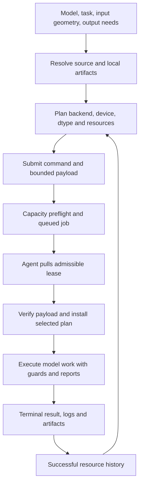

# mrun: Auditable Model Execution Across a Heterogeneous Compute Fleet

## Abstract

A useful model run includes more than a forward pass. It must resolve the intended checkpoint, choose compatible execution software and hardware, fit its working set, preserve state ownership, and leave enough evidence to reconstruct what ran. mrun implements this chain through a Python library, a fleet client, a command-line interface, a scheduler, and compute-host runtimes. Its central planning object records the model, backend, device, precision, batch cap, resource estimates, artifact locator, and reasons for each decision. A pull-based fleet scheduler admits work against resource commitments, while agents execute commands with memory monitoring and durable diagnostics. Model engines provide reference execution, demand-paged weights, specialized dense and mixture-of-experts CUDA paths, and Apple runtimes. Typed compiler surfaces reduce repeated work through selected-output execution, shared prefixes, branch packs, and prepared campaigns.

This paper reviews the local implementation as of September 29, 2026. It combines source inspection, focused regression tests, controlled mechanics diagnostics, read-only fleet observations, and checksum-verified historical measurements. The evidence supports mrun as an execution and custody system with useful, bounded optimizations. It also exposes configuration-dependent estimation, inconsistent documentation, and one capability-reporting defect. Historical speedups belong to particular workloads and numerical contracts; they do not establish a universal inference advantage. No new pretrained-model benchmark or accelerator qualification was performed for this review.

## 1. The unit of work is a model run

mrun's design addresses a recurring systems problem: experiments often duplicate model loading, device selection, memory guesses, and repeated scalar forwards in their launchers. Those choices can change both execution cost and the meaning of the result. A quantized store, a different arithmetic dtype, a larger physical batch, or a modified state path can alter outputs even when the logical model name stays constant.

The system separates identities that are easy to conflate:

| Identity | Question it answers |
|---|---|
| Logical model and source checkpoint | Which model and revision did the caller intend? |
| Executable artifact | Which checkpoint, QStore, expert bank, or native component bytes were opened? |
| Engine and numerical contract | Which implementation and arithmetic produced the outputs? |
| Execution plan and placement | On which host/device, with which batch cap, threads, and resource envelope? |
| Request, output contract, and mutable state | Which tokens, selected outputs, branches, cache state, or session were executed? |
| Receipt and scientific artifact | What completed, what resources were observed, and what evidence is retained? |

A fleet lease and a generated answer are consequently different records. The scheduler can establish that a command completed and record its resource peaks. The experiment must still establish that the intended instrument ran, that the output has the declared identity, and that any scientific conclusion follows from the measured evidence. mrun owns execution, efficient dispatch, containment, and custody. Analysis definitions and interpretation belong to `manalysis`. [S1, S2]

The contribution of this paper is a source-backed account of that boundary: how requests become executions, what the major runtimes can do, where reuse reduces physical work, and how far the available verification reaches.

## 2. Review method and source scope

The inspected checkout is based on commit `f002ce776e14143114e232ed6af872808a3de160`, on branch `feat/diffusers-phase-cuda`, with existing tracked modifications and untracked execution modules. The commit alone does not identify the reviewed implementation. The accompanying snapshot records SHA-256 values for all 286 Python source files under `src/mrun`, selected architecture/API documents, the dirty-file inventory, and the review environment. Its source-records digest is `51101d0f1169936c94a524e277797b55517a79797b825a83e5aa367035172431`. This is the review's own digest scheme, not a claim that a current runtime matches a historical promotion wheel. [V1]

The review used the shared `common` environment: Python 3.10, Torch 2.13.0, Transformers 5.14.1, pytest 9.1.1, and psutil 7.2.2. Pretrained-model tests were disabled and Hugging Face offline mode was enabled. Local tests used synthetic tensors, small constructed models, temporary stores, mock runtimes, or a temporary loopback scheduler and agent. These checks establish software mechanics within their fixtures. They are not fresh pretrained-model quality or hardware-performance evidence.

| Verification lane | Passed | Failed | Skipped | Scope |
|---|---:|---:|---:|---|
| Model resolution, policy, selection, reservations, guards, custody, core compiler and runtime contracts | 466 | 2 | 1 | Initial review suite |
| State transactions, native service, decompiler references, streamed MoE and local fleet integration | 247 | 1 | 10 | Runtime suite |
| Graph compiler, output binding, campaign/capture admission and resident control plane | 130 | 0 | 0 | Additional compiler suite |
| Co-admission case repeated alone | 1 | 0 | 0 | Separate diagnostic after the runtime-suite failure |

The original logs and JUnit XML remain intact, including the failures. The isolated repeat is a separate observation, not a replacement for the broader result. The paper also preserves five historical evidence JSON files byte-for-byte and verifies their checksums and selected timing calculations. Those files document earlier acquisitions under their recorded model, software, hardware, and shape identities. [V1, V2]

Read-only service calls found a healthy scheduler reporting mrun `0.1.0`, protocol `2`, and registered `beast` and `mbp1` hosts. The former advertised CUDA and the latter MPS with no separate VRAM pool. This establishes service reachability and advertised inventory at the recorded time. It does not identify the worker source revision or establish that every advertised artifact is complete and executable. [V1]

## 3. From request to guarded execution

### 3.1 Resolve the model and acquire the right bytes

`ModelSpec` and `resolve_model` normalize registered names, full Hugging Face identifiers, local paths, and unambiguous labels. Ambiguous labels fail rather than selecting a checkpoint arbitrarily. Local discovery uses exact repository-directory matching, resolves one snapshot, prefers a complete cached `refs/main` snapshot where applicable, and checks safetensors-index completeness. It avoids mixing shards from multiple revisions or matching a larger model merely because its name contains a shorter name. The HF loader and tokenizer loader use discovered local directories where available and otherwise use the configured cache and Hugging Face loading path. [S3]

Discovery is not universal revision pinning. A friendly alias or a cache's `main` reference can change. Experiments that require immutable identity must bind an exact source revision and retain the actual artifact identity. Native decompilation and verified QStores provide stronger explicit identity surfaces than a model-name string alone.

The HF loader also preserves model-specific execution details: a RoPE configuration guard checks the raw configuration and can rebuild rotary-frequency buffers; attention normally uses SDPA, while attention-probability capture requires the eager path. These details matter because the same weight files with an incorrect positional configuration are not the same computation. [S3]

### 3.2 Produce an explainable plan

`plan_run` is planning code: it does not load model weights. A frozen `RunPlan` carries backend, device, dtype, maximum batch, thread count, RAM limit, estimated RAM/VRAM, optional wall-time estimate, disk weight size, construction options, reasons, and optional profile/artifact identity. `HostCaps` supplies the target's RAM, VRAM, CPUs, and accelerator capabilities. [S4]

The current policy is workload-sensitive. CUDA inference normally chooses BF16; CUDA training defaults to FP32. Small Mac CPU forwards can retain FP32, RAM-constrained cases can choose BF16, and suitable scoring jobs have an FP16 MPS path. An explicit Metal decode workload can select `mlx-q4`; that is an approximate speed lane. Applying a plan also pins thread settings, installs its RSS ceiling, and disables CUDA TF32 for the declared numerical contract. These rules are reasons in a plan, not universal accuracy guarantees.

Default batch caps are 16 on CPU and 64 on CUDA/MPS, with an activation-size condition and an explicit environment override. The specialized Qwen3 MoE planner caps its measured envelope at eight streams. A cap is a ceiling for a consumer to obey, not evidence that a method actually used a fused batch.

Automatic overflow handling is broader than some older API prose describes. The current planner can select a dense pager when resident HF weights exceed the CUDA budget, and a routed `qwen3-moe-cuda` pager for the supported Qwen3 MoE family. Explicit oversized HF requests retain HF while falling back to CPU. The artifact-aware selector adds a concrete host-local artifact and registered execution profile, rejects inadmissible candidates, and can use supplied performance/parity evidence. Its speed priors are deterministic ranking heuristics, not measured throughput. Missing inventory falls back to legacy planning; it does not manufacture a missing QStore. [S4, S5]

### 3.3 Submit code, retain local model data

`launch` is the intent-first fleet entry point. `submit` returns a job ID; `remote_run` submits and attaches; `attach` streams logs until a terminal result. `pin` or `host` is a hard constraint, while a preferred host is a placement hint. CUDA requirements activate compatible planning and VRAM admission. Commands may use an environment alias mapped to a host-local project. Small code/assets can be shipped as a bounded tar payload; large model weights are resolved on the worker. [S6]

There are three distinct preflights. The scheduler automatically checks physical-capacity feasibility. Optional client semantic preflight checks command-path closure, declared custody roots, verifier skeletons, workload geometry, and reservation sanity before submission. Guarded shipped submission additionally requires strict preflight, content-bound payload sealing, admission claims, and fencing; retrying its same logical request returns the canonical job rather than appending a duplicate. Ordinary `client_run_id` groups calibration history and is not equivalent to guarded idempotency. [S6, S7]

### 3.4 Pull a lease and run on the compute host

Agents register capabilities and inventory, send telemetry, and long-poll for leases. The scheduler does not connect into hosts to execute models. Its control plane uses FastAPI and SQLite; tensor computation belongs on the worker. The agent verifies and unpacks a shipped payload, installs thread limits, memory ceilings and the selected `MRUN_PLAN`, starts the subprocess, uploads logs, samples resource usage, and emits phase/terminal events. [S7, S8]

The intended invariant is that admission and execution use the same plan. Its practical boundary is worth stating: `plan_run` honors a matching serialized scheduler plan for automatic requests, but explicit backend/dtype/device overrides can take a separate planning path, and arbitrary command code can ignore the plan entirely. The selected plan is therefore a declared execution contract. Runtime reports and experiment checks establish whether the worker consumed it.

Interrupting an attachment detaches the observer and leaves the run active. Cancellation is explicit. Resource-killed ordinary jobs can receive bounded retries with larger reservations; guarded and externally owned jobs have separate restrictions. Lease loss, retry ancestry, and terminal states remain visible. None of these operational states establishes a successful scientific measurement. [S6–S8]

## 4. Resource accounting and containment

The estimator begins with parameter/configuration dimensions and a calibrated framework-overhead law, then adds activation/workload estimates and measured history. Attention, retained layer states, K/V caches, training state, and large vocabulary logits can dominate weight size. `count_logits=True` explicitly adds the vocabulary-output tensor; default planner multipliers were calibrated with some output cost already absorbed, so callers must understand which estimate they are using. [S9]

Current server sizing follows declared reservation, exact successful history, generalized family history, client estimate, then a 4,096 MB probe default. Exact history uses a p95 basis at sufficient sample count with a 1.25 factor, or a sparse-history peak with a 1.3 factor. Family history has a broader 1.5 factor. History-based sizing is floored by the supplied estimate and rounded. Host-specific plans can refine non-declared reservations. Unpinned declared RAM asks can be clamped using trustworthy history or raised when below known peaks; VRAM retains a separate clamp policy. These are source-level defaults, subject to host limits and supplied contracts. [S10]

For a RAM reservation \(R\), the current fleet kill ceiling is

\[
K_{\mathrm{RAM}}(R)=\max(1.1R,\;R+512\ \mathrm{MB}).
\]

VRAM enforcement uses the reservation multiplied by 1.1. The scheduler checks fresh telemetry, required capabilities, operator limits, CPU commitments, disk space, memory pressure, and resource commitments. It subtracts observed non-job consumption and margins rather than admitting every job against the same snapshot of free memory. A recognized active process is accounted for as a commitment; an orphan observed in telemetry remains baseline consumption. [S10, S11]

The implementation also has a smaller, history-derived admission commitment for certain over-declared active jobs. It uses successful history and current live usage with safety factors while leaving the agent's granted enforcement reservation intact. Consequently, the strict statement that every active job always commits its full enforcement ceiling has an explicit implementation exception. This improves utilization but makes history quality and workload stability material assumptions. [S10]

Containment has several levels. `check_rss` and `ram_guard` check process RSS at boundaries; they do not continuously sample inside a guarded block. `run_stage` and fleet agents monitor subprocess-tree RSS and terminate observed overages, timeouts, or cancellation. CUDA jobs add process-tree VRAM monitoring. Linux can use a verified cgroup-v2 memory scope; `required` refuses launch without proof, whereas the fleet default `auto` can retain sampled enforcement. Local execution defaults to OS-limit mode `off`; calling `run()` with neither `model=` nor `ram_limit_mb=` warns and supplies no RAM kill ceiling. macOS uses sampled containment, and accelerator allocations in unified memory are not fully described by a process RSS number. [S8, S12]

These mechanisms contain a workload; they do not create memory. A pager fits by reducing live weight residency. A full K/V allocation, large activation capture, optimizer state, or output buffer still needs real capacity. The safe response to an impossible envelope is to reduce the working set or choose a compatible host/runtime.

## 5. Model execution capabilities

`open_engine` is the common construction boundary. The common protocol covers encoding, logits, scoring, state/capture operations where available, runtime reporting, and lifecycle. Generation, transactional state, interventions, autograd, and compilation are capabilities of particular engines, not promises made by every backend name. [S13]

| Runtime family | Execution and memory behavior | Main supported use and boundary |
|---|---|---|
| HF / Transformers | Resident framework model; native batches; configured CPU/CUDA/MPS execution | Reference logits, capture/interventions and autograd where supported. Fit, attention mode and precision remain explicit. |
| Paged QStore | Memory-mapped compact weights, materialized by matrix/block or selected rows; optional caches and CUDA transfer overlap | Bounded weight working set, scoring, generation and selected intervention surfaces on supported architectures. Activations/state can still grow. |
| `paged-fp32`, `paged-bf16`, `paged-fp16` | Explicit lossless FP32 store, with the named arithmetic lane | Storage exactness is separate from cross-executor output parity. BF16/FP16 names describe arithmetic, not their storage format. |
| Dense QStore CUDA | Compact projection kernels, batched body execution, persistent/transactional K/V and selected head paths | Dense Qwen/Llama inference and scoped prepared/captured scoring. No general autograd or intervention support. |
| `olmoe-cuda` | BF16 skeleton and resident FP8 expert bank; grouped expert execution | OLMoE inference when the complete expert bank fits. It does not page that bank per token from disk. |
| `qwen3-moe-cuda` | Resident BF16 skeleton plus route-selected FP8 or explicit W4 expert pages, bounded CUDA cache and optional host tier | Supported oversized Qwen3 MoE inference, batch decode, selected hidden rows and transactional prefix branching. It does not imply universal MoE support. |
| `moe-stream` | Bounded streamed expert matrices with registered layout semantics | Scalar logits and residual inspection for supported layouts. The public engine does not promise physical batch execution or dense-MLP neuron taps. |
| MLX / Metal and component runtimes | Resident unified-memory model or verified native components; explicit quantized variants | Apple inference and stateful execution on supported routes. Low-bit quality and request geometry remain separately qualified. |
| Core ML / `ane` | Experimental Core ML eligibility with reported placement and paged fallbacks | Backend spelling does not prove Neural Engine execution. Unsupported operations and reference re-scoring must remain visible. |
| `multifabric` | Shares batched rows across opened child engines and restores their order | In-process scoring experiment. Child-open errors and fallback behavior matter; it is not a fleet replica scheduler. |

Sources: [S13–S17]. The table describes exposed execution paths and contracts, not newly measured hardware promotion.

### 5.1 Paging and physical batching

An ordinary paged forward amortizes a weight traversal across compatible rows. The benefit is not just parallel arithmetic: one streamed/dequantized matrix can serve a physical batch. The standard compact store uses row-int8; explicit int4/int3/int2 variants have their own readers and execution restrictions. CUDA paging can overlap predicted block transfer through a ring; misses use the ordinary path. Cache budgets are explicit residency choices. A cyclic weight traversal can make a static fill-once resident set more useful than an under-budget evicting cache. These optimizations change transfer cost, and their runtime counters should show whether they actually operated. [S14]

The current `PagedEngine.generate_batch` shares persistent K/V execution for dense Qwen2/Qwen3/Llama. Its Qwen3.5 hybrid path also carries convolution and recurrent state, buckets prompts by length, and restores caller order. Completed rows use a fill token so remaining rows retain a shared physical shape. Older API table text describing paged generation as universally row-wise is stale. Unsupported architectures can still fall back, so batch method names alone are insufficient evidence. [S14, V2]

The Qwen3 MoE pager has a different working set. Cache size, expert codec, active-page slab size, optional host cache, context, and stream count enter admission. The default slot-indirect path avoids the extra compaction slab of its compatibility path. A host tier and route prefetch can improve cache-miss cost without making the full expert bank CUDA-resident. Cold route fill, hot prompt-local decode, and diverse traffic are distinct regimes. [S16]

### 5.2 State is an owned resource

Persistent state avoids recomputing a full prompt for every generated token. Transactional APIs go further: provisional block execution produces a delta, and commit validates epoch, parent lengths, capacity, and ownership before accepting a prefix of that work. Abandoning a branch must leave the parent unchanged. Common-prefix StateCuts can retain an immutable parent and stage branch-local suffix state; Qwen3 MoE's native segmented attention can consume that representation without first materializing each parent copy. [S14–S16, V2]

These are enabling mechanics for branch evaluation, cancellation, and speculation. They do not establish that a draft predictor has sufficient acceptance rate to improve end-to-end generation. A correct provisional-state transaction and a useful speculative system are different claims.

The current Qwen3 MoE source additionally exposes a continuous-serving bridge. Each request owns a versioned B1 slot in one fixed K/V arena; a compatible lane supplies physical slot IDs and per-row lengths to an explicit ragged decode executor. Finished slots can be refilled without copying sibling prefixes, and provisional results retain separate commit/abandon authority. Its `NativeGenerationService` coordinator handles admission, stop state, cancellation and publication. This is a distinct runtime surface from a fixed `generate_batch` call and is not automatically a new route in the generic `mrun inference` CLI. Its presence and capability flag establish implemented interfaces; this review does not supply a fresh diverse-traffic CUDA gate. [S16]

### 5.3 Training and image-model runs

mrun can schedule and contain training commands, but an inference engine's existence does not imply backward support. The public `mrun.training.PagedLoRATrainer` delegates to the `manalysis` Winder implementation. Its design keeps the frozen base paged while trainable adapters and their optimizer state remain resident; training authority and adapter-outcome parity need their own qualification. The current generic science benchmark has no backward/training adapter. [S18, S19]

mrun also owns an image-model execution surface. `PhasePipeline` groups prompt encoding, caches embeddings with their dtypes, and then schedules denoising with the encoder removed from the accelerator. The mechanism reduces repeated component transfers across a panel. A separate transformer QStore replaces covered linear projections with demand-paged approximate weights; it is not the causal-language-model CUDA kernel and does not generally lower convolutional UNets. This paper includes those placement/dispatch capabilities only; it does not analyze image-model mechanisms or learned image programs. [S20]

## 6. Reuse above the forward call

The strongest optimization opportunities often arise from what the consumer actually requests. A forced-choice winner among a few tokens need not materialize every vocabulary logit at every position. Identical token sequences with overlapping readouts need not run the model body repeatedly. Compatible interventions need not recompute their shared clean prefix.

HF scoring already applies this principle outside the compiler: eligible single-token forced choice can run the base model and only the candidate head rows, while multi-token candidate scoring can reuse a prompt K/V prefix. Candidate logits do not substitute for a full-vocabulary loss or sampling normalizer. The implementation records scoring-path rates and scalar fallback counts, making the actual route observable. [S13]

### 6.1 Output contracts and compiled WorkPlans

A WorkPlan separates static shape, precision, output, state, and execution requirements from runtime tensors. For registered dense architectures, a typed graph represents parameter ownership, effects, tied storage, and operation dependencies. Certified output-demand rewrites can move last-position selection before the head, select vocabulary rows, remove an unreachable head for hidden-only output, or retain the full normalizer for loss. [S21]

For a vocabulary head with hidden width \(H\), sequence length \(T\), vocabulary \(V\), and demanded rows \(K\), full-position output produces \(TV\) scalar scores and addresses a \(VH\) parameter table. A last-position selected head produces \(K\) scores and addresses \(KH\) rows. The body still executes. This is a scoped output-head work reduction, not a whole-model latency or energy theorem.

Compilation artifacts contain fingerprints, validated schedules, identity certificates, memory/cost analyses, and rewrite lineage. Structural certificates do not prove floating-point equality. Independent output parity remains necessary. Some graph fusion, liveness and placement results are plans rather than realized kernel/allocator behavior. ROCm and Core ML WorkPlan lowerers remain schedule-only; their presence does not establish execution on those targets. [S21]

### 6.2 Candidate campaigns and branch packs

A candidate campaign accepts multiple ordered readouts over one exact immutable token sequence, forms a stable first-use union of candidate IDs, evaluates the body and union head once, then projects scores back into each query's local order. Winner/runner-up selection remains query-local. Preparation binds engine/store identity, input, numerical contract, graph and output configuration once; the hot path dispatches the prepared operation. Different prompts, mutable K/V, RNG, arbitrary patches, and merely similar graphs are outside the static campaign contract. [S21]

An Intervention ScienceGraph has a different contract. It authenticates tensor operands and branch edits, identifies a StateCut, evaluates a shared prefix, and packs compatible suffix branches. Physical layer-weight traversals and logical intervention rows are separately reported. The runtime delivers the declared edits; the experiment defines their causal meaning and any requirements for full-forward adjudication. Fast branch execution does not promote a mechanism automatically.

Engine pooling is another reuse level: matching construction inputs can retain a warm engine within one process. It does not share residency between independent fleet subprocesses. `fresh=True` and pool shutdown controls are necessary for honest cold-start measurements. [S13]

### 6.3 CUDA Graph replay and resident workers

Static selected-score capture pins non-evictable resources and stable input/output addresses, warms a graph-safe operation, and records a real `torch.cuda.CUDAGraph`. Eligibility, requested capture, completed capture, and actual replay are separate evidence fields. The ordinary serialized lowerer cannot attest that hardware capture occurred. Exact promotion records bind source/store identity, software distribution, hardware, precision, geometry, setup break-even, and residency. A record miss leaves the scoped automatic campaign route eager. [S21]

Resident arenas/templates broaden reuse through separately owned mutable lanes, generation-fenced rebinding, idle-only eviction, byte limits, queue accounting, and exact-promotion fallback. Historical selected-score service evidence includes cancellation and refill. It does not establish universal captured decode, full-vocabulary graph replay, or promoted training. [S21, H5]

## 7. Historical performance evidence and attribution

The preserved measurements provide concrete examples of work reduction. They were checksum-verified and their central ratios checked during this review; they were not rerun on the current checkout. [H1–H5]

| Workload and control | Reported result | What the contrast establishes |
|---|---|---|
| Qwen2.5-0.5B, CPU, 16 layer-12 intervention branches; independent selected-score executions versus compiled pack, 30 trials | Median walls 3.4101 s and 0.2484 s; ratio of medians **13.728×**; paired log-ratio lower bound 13.515×; exact winners | Bounded prefix/suffix sharing under the recorded QStore contract. Maximum selected-score delta was `1.6213e-5`, not bit-exact scores. [H1] |
| Qwen2.5-0.5B, CPU, 16 overlapping ordinary readouts, 30 trials | Median walls 2.4957 s and 0.1569 s; ratio of medians **15.907×**; exact rows and summaries | Automatic duplicate-prompt/readout sharing for the fixed workload. [H2] |
| Qwen2.5-0.5B, RTX 4080, BF16, B1/S5/K6; same resident executor eager versus graph replay, 30 trials | 17.7751 ms versus 5.1302 ms; median paired ratio **3.464×**, interval 3.376–3.485×; exact scores | Graph replay contribution with operation and residency matched. Setup 173.435 ms; break-even 14 replays; residency delta 506,668,544 bytes. [H3] |
| Same historical CUDA acquisition; four independent readouts versus compiled captured union, 12 trials | Median walls 487.6165 ms and 5.4806 ms; median paired ratio **88.787×**; exact compared outputs | Combined sharing, preparation, specialization, residency and capture. It is not a graph-only speedup. [H3] |
| Experimental profile fusion, nine CUDA shape cells | Every cell remained unqualified; graph lower bounds 0.99548–1.00725× | Exactness did not establish a useful speed gain for that candidate. This is separate from established fused batch kernels. [H4] |

The CPU artifacts report a ratio of marginal medians. Their paired median ratios are different: about 13.680× and 16.330×, respectively. The CUDA contrasts report medians of paired duration ratios. The evidence verifier checks those estimator distinctions rather than silently treating them as interchangeable.

The selected-score resident service artifact separately records 1,892 rows in 151 captured dispatches, mean width 12.53, maximum width 32, zero fallback rows, queue p95 2.084 ms, and execution p95 5.903 ms. Cancellation and refill passed. This is useful service-mechanics evidence for its recorded selected-score shape and numerical contract, not an ordinary chat decode benchmark. [H5]

Throughput reporting must also name its unit. Processed prompt positions, generated tokens, forced-choice probes, and logical intervention rows are different quantities. Aggregate batch tokens per second should be accompanied by per-stream rate, B1 latency, context length, cache state, warmup, and output contract. A wide-batch gain can amortize weight movement while leaving one stream's latency unchanged or worse.

The historical acquisition protocols rotate comparison order and preserve raw samples. Their intervals remain conditional on their timing design: a paired bootstrap does not automatically correct thermal drift, serial dependence, or changing cache regimes. The recorded gains are informative, bounded system results. This review supplies no matched comparison against an external serving framework.

## 8. Native artifacts, serving, and run evidence

The native decompiler inspects frozen source configurations and tensors, maps registered architectures into canonical components/IR, emits content-addressed artifacts, and lowers supported targets. Canonical inspection, reference execution, native execution, stateful execution, chat support, quality, and performance are separate levels of support. For example, the registered Mixtral expert-paged slice is a bounded sparse-block primitive rather than a complete public chat route. [S22]

`mrun inference` is a separate compute-host data plane. Its `describe` command opens and admits a real route, reports compiled identity, placement and state budgets, then closes it. `serve` keeps the route warm and exposes health/readiness, model discovery, OpenAI-compatible chat completions with optional SSE, metrics, and a browser client. Supported request features are reported by the loaded route. A compact greedy head need not support sampling or full-logit consumers. [S23]

Sessions retain authoritative rendered token ledgers and native state. Prefix reuse requires matching model, tokenizer/template, route, placement, execution shape, and state ABI. Ownership, expiry, eviction, pending reservations and cancellation are therefore part of execution correctness. Low-bit K/V and compatible batching can have different identities and restrictions from the exact B1 path. API compatibility describes the protocol; it does not assert identical generation semantics across routes.

The science workflow provides configuration-driven runtime/geometry comparisons, resolved configuration hashes, timing, actual device/dtype/fabric, memory samples, execution-mode/fallback reporting, and manifests. Tracking can fan out to MLflow, MinIO, Trackio and DVC. Sink failures are retained without erasing local measurements. Scheduler records and dashboards are operational evidence; durable artifacts and independent verifiers support research claims. Generic ScienceGraph and training benchmark adapters are still absent even though direct graph execution and externally scheduled training exist. [S19]

## 9. Findings, limits, and practical use

Three findings from this review constrain broad claims.

First, two estimator tests depend on discovering a Qwen2.5 configuration. With the missing configuration, the fallback vocabulary of 32,000 yields an added logits estimate of about 524.3 MB instead of the expected 2,489.3 MB, and the recorder/forward ratio misses a test bound. Supplying the tests' intended dimensions in a separate controlled diagnostic restores both formula assertions: forward 553.6 MB, recorder 5,955.9 MB, ratio 10.758, and added logits 2,489.3 MB. This diagnoses metadata/fixture dependence; it does not certify actual peak memory. A configuration lookup miss is an instrument limitation and should be surfaced before a long-context reservation is trusted. [V1, V2]

Second, `MoEStreamEngine.capabilities()` inherits `mlp_acts=True` from the capability dataclass default, but `forward_acts` explicitly raises `NotImplementedError` because routed experts do not have one dense MLP activation matrix. A weight-free mechanics probe reproduced the inconsistency. Capability discovery is the intended consumer interface, but this flag should not be used as sufficient proof of that tap until its implementation is corrected. [S13, S17, V1]

Third, the runtime suite's co-admission test failed to observe three simultaneous running jobs. Its captured admission diagnostics showed limited RAM headroom and existing commitments; all three eventually succeeded. The same case passed alone in 17.32 seconds. The paired observations suggest load/shared-fixture sensitivity, while leaving the original failure unresolved as a full-suite robustness issue. They do not support a claim that unrestricted concurrent admission always works. [V2]

Documentation also needs reconciliation. Older sections describe an 8 GiB default or a different historical reservation ladder, deny automatic Qwen3 MoE selection, describe oversized automatic CUDA HF plans as CPU-only fallbacks, describe all paged generation as scalar, or deny the newer Qwen3 MoE continuous interface. The current code implements the 4,096 MB probe, newer history sizing/clamps, family-specific CUDA overflow paging, physical generation batches and the explicit native continuous bridge. The same caution applies to descriptions that present Linux strict containment or scheduler-plan consumption as unconditional. This paper follows the captured implementation and states its exceptions. [S4, S6, S10, S12, S14, S16]

For an experiment author, the resulting workflow is straightforward: declare the model revision, task, input/output geometry and precision; let mrun plan acquisition and placement; acquire once; use the engine's applicable batched or prepared surface; inspect actual runtime facts and physical-work counters; preserve the terminal receipt and raw artifacts; then interpret the measurement under the experiment's scientific policy. Hand-set reservations are useful for measured workload costs that model-size planning cannot see, but adding memory does not itself accelerate execution.

The verified conclusion is bounded. mrun connects explicit model/runtime identities, resource-aware fleet execution, state ownership, reusable work, and evidence retention in one system. Focused tests support substantial mechanics coverage, and historical artifacts demonstrate useful optimizations for named workloads. Configuration gaps, capability inconsistencies, source/deployment skew, sampled enforcement, and unqualified runtime combinations remain visible. Broader performance, model-quality, and deployment claims require fresh evidence under the exact contract being proposed.

## References and source ledger

Paths refer to the reviewed workspace. The portable evidence copies and checksum verifier are described in [the evidence guide](evidence/README.md). Source-file hashes identify the inspected version when a linked checkout later changes.

- **S1.** [Public API](../../../mrun/docs/API.md), [architecture](../../../mrun/docs/ARCHITECTURE.md), and [capability map](../../../mrun/docs/SURFACE.md).
- **S2.** [Public exports](../../../mrun/src/mrun/__init__.py) and [analysis delegation tests](../../../mrun/tests/test_manalysis_delegation.py).
- **S3.** [Model discovery and loading](../../../mrun/src/mrun/models.py).
- **S4.** [RunPlan and policy](../../../mrun/src/mrun/policy.py).
- **S5.** [Artifact-aware selection](../../../mrun/src/mrun/selector.py) and [selection guide](../../../mrun/docs/ENGINE-SELECTION.md).
- **S6.** [Fleet submission and attachment](../../../mrun/src/mrun/client/submit.py).
- **S7.** [Scheduler API](../../../mrun/src/mrun/server/app.py), [durable database](../../../mrun/src/mrun/server/db.py), and [semantic preflight](../../../mrun/src/mrun/client/preflight.py).
- **S8.** [Agent execution](../../../mrun/src/mrun/agent/executor.py) and [agent control loop](../../../mrun/src/mrun/agent/main.py).
- **S9.** [Model and activation estimation](../../../mrun/src/mrun/estimate.py).
- **S10.** [Reservation sizing](../../../mrun/src/mrun/server/reservation.py) and [protocol ceilings](../../../mrun/src/mrun/protocol.py).
- **S11.** [Admission and host ranking](../../../mrun/src/mrun/server/scheduler.py).
- **S12.** [Local command execution](../../../mrun/src/mrun/execute.py), [process monitor](../../../mrun/src/mrun/orchestrate.py), [boundary guards](../../../mrun/src/mrun/guard.py), and [OS memory limits](../../../mrun/src/mrun/os_limit.py).
- **S13.** [Engine construction/pooling](../../../mrun/src/mrun/engine/__init__.py), [capability protocol](../../../mrun/src/mrun/engine/base.py), and [HF scoring engine](../../../mrun/src/mrun/engine/hf.py).
- **S14.** [Paged engine](../../../mrun/src/mrun/engine/paged.py) and [paged kernels](../../../mrun/src/mrun/engine/kernels/paged_forward.py).
- **S15.** [Dense CUDA engine](../../../mrun/src/mrun/engine/dense_qstore_cuda.py) and [dense CUDA contract](../../../mrun/docs/DENSE-QSTORE-CUDA.md).
- **S16.** [Qwen3 MoE engine](../../../mrun/src/mrun/engine/qwen3_moe_cuda.py), [StateCut implementation](../../../mrun/src/mrun/engine/qwen3_moe_statecut.py), [native continuous bridge](../../../mrun/src/mrun/runtime/qwen3_moe_continuous.py), [Qwen3 MoE contract](../../../mrun/docs/QWEN3-MOE-CUDA.md), and [OLMoE contract](../../../mrun/docs/OLMOE-CUDA.md).
- **S17.** [Streamed MoE engine](../../../mrun/src/mrun/engine/moe_stream.py), [Apple runtime guide](../../../mrun/docs/APPLE-RUNTIME.md), and [multifabric engine](../../../mrun/src/mrun/engine/multifabric.py).
- **S18.** [Training compatibility exports](../../../mrun/src/mrun/training/__init__.py).
- **S19.** [Scientific benchmark guide](../../../mrun/docs/SCIENTIFIC-BENCHMARKS.md) and [resolved runtime policy](../../../mrun/src/mrun/science/runtime.py).
- **S20.** [Image pipeline phase runtime](../../../mrun/docs/DIFFUSERS-PHASE-CUDA.md) and [transformer store implementation](../../../mrun/src/mrun/diffusion/qstore.py).
- **S21.** [Compiled WorkPlan guide](../../../mrun/docs/WORKPLAN.md) and [compiler exports](../../../mrun/src/mrun/compiler/__init__.py).
- **S22.** [Decompiler adapters](../../../mrun/src/mrun/decompiler/adapters.py) and [native artifact/runtime guide](../../../mrun/docs/NATIVE-INFERENCE.md).
- **S23.** [Inference loader](../../../mrun/src/mrun/inference/loader.py), [HTTP service](../../../mrun/src/mrun/inference/app.py), and [runtime state/placement contracts](../../../mrun/src/mrun/runtime/contracts.py).
- **V1.** [Review snapshot and mechanics diagnostics](evidence/review-snapshot.json); [capture procedure](evidence/capture_review.py).
- **V2.** [Verification logs, XML and exact reproduction commands](evidence/README.md).
- **H1.** [Historical CPU branch-pack evidence](evidence/prior/sciencegraph-qwen25-0.5b-v3-cpu-30x-v2.json).
- **H2.** [Historical automatic campaign evidence](evidence/prior/automatic-campaign-qwen25-0.5b-v3-cpu-30x-v1.json).
- **H3.** [Historical matched CUDA Graph and complete campaign evidence](evidence/prior/cuda-graph-primary-4dc54fcd1048.json).
- **H4.** [Historical unqualified profile-fusion evidence](evidence/prior/profile-fusion-qwen25-0.5b-cuda-v1.json).
- **H5.** [Historical resident selected-score service evidence](evidence/prior/resident-batch-service-qwen25-0.5b-cuda-v1.json).
