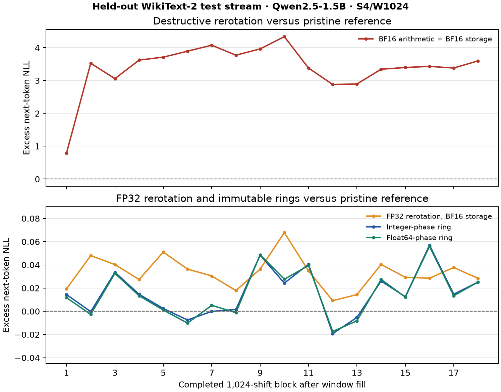

# PhaseLock: Stable Position Shifts for Sliding KV Caches

**Numerical drift under repeated rotary cache relocation, and a bounded remedy in streaming Qwen inference**

Jacob Hollenbeck

*Draft, updated 25 September 2026. Section 5 reports a Python Qwen prototype with an experimental Triton attention consumer. No native production-engine run is pending.*

## Abstract

Sliding-window inference can retain a small set of initial attention sinks and a recent KV window while assigning surviving tokens new rotary positions. An implementation that repeatedly rotates stored keys, then writes them back in reduced precision, accumulates error with every shift. We measure that error in 20,000-token, one-token-at-a-time streams through Qwen2.5-1.5B-Instruct and Qwen2.5-0.5B-Instruct. With four sinks, a 1,024-token window, and one eviction per token, the 1.5B model's steady-state perplexity is 9.882 with pristine pre-rotary keys and high-precision angles, 9.884 with PhaseLock's integer phase law, 322.1 with repeated BF16-arithmetic key rerotation, and 12.898 with repeated Q8 key requantization. Quantizing pristine keys once with PhaseLock gives 10.181 perplexity and takes 15.04 ms/token in this harness, versus 17.68 ms/token for repeated Q8 requantization. The quality pattern recurs at a 2,048-token window and in the 0.5B model.

PhaseLock represents each rotary frequency as an integer increment on a finite phase ring and moves a window's phase origin without repeated phase accumulation. The original live-stream implementation copies the sliding window and rotates pristine keys on every read. A 1,600-token integrated Qwen prototype instead uses ring K/V storage and query-side phase folding: its eviction launches zero GPU kernels, but its unfused attention path is about 7.5% slower end to end than BF16 rerotation at a 1,024-token window. An experimental Triton consumer accelerates the attention read, although a faster one-layer ring scan did not improve full-decoder speed in the pilot. Thus we establish a bounded numerical-quality benefit and an integrated constant-time *shift operation* in a prototype; native production throughput and any advantage unique to integer phase remain open.

In a separate 20,000-token held-out integrated run, rerotating cached keys with BF16 arithmetic and BF16 storage produced **253.918 perplexity**, versus **8.446** for an immutable float64-phase ring and **8.450** for an immutable integer-phase ring. This roughly 30-fold contrast is the central failure demonstrated by that run. The BF16-rounded one-step rotation coefficient is nonunit and compounds under repeated use. Computing rerotation in FP32 before each BF16 write brought perplexity down to **8.606**: a substantial repair of the catastrophic path, with a smaller 1.9% residual gap relative to the float64 ring. Pristine rotate-at-read keys scored 8.329. These results establish a severe failure for the tested BF16-arithmetic implementation, not a unique integer-phase advantage or a native-engine quality measurement.

An earlier fixed-window pass-key stress test found a larger behavioral contrast: after 1,024 simulated 512-position shifts, a repeatedly written BF16 key path recovered 0 of 24 keys in each of two Qwen models, versus 24 of 24 for both PhaseLock and a repeatedly written FP16 path. This is an emulation of cache numerics in a full forward pass, not a live streaming comparison. In two later 10,854-token scripted live conversations under a matched ring attention consumer, the immutable-key treatment answered 23 of 24 retained one-word probes versus 21 of 24 for the destructive FP32-arithmetic/BF16-storage rerotation **control**. That modest two-answer contrast probes the *remaining* cost after using FP32 rerotation arithmetic; it is not the evidence for the severe BF16-arithmetic failure.

## 1. Problem and scope

Rotary position embedding (RoPE) rotates query and key channel pairs by an angle proportional to token position [1]. In a streaming cache with attention sinks, the sink tokens keep their original positions while recent tokens are assigned positions inside a bounded rolling window [2]. When a window token is evicted, the logical positions of the survivors decrease. Their cached key vectors must continue to produce the attention scores appropriate to those new logical positions.

There are two straightforward ways to do this. One may store keys **after** rotation and rotate the survivors again on every shift. Or one may keep pristine **pre-rotary** keys and apply the appropriate rotation when attention reads them. The latter design is already present in the original StreamingLLM work [2]; pre-RoPE key quantization is also established in KVQuant [3]. PhaseLock does not claim to invent pristine-key caching. Its narrower proposal is a fixed-width integer phase law for position bookkeeping, paired with a shift path that does not compound arithmetic or quantization error on surviving keys.

We use **numerical KV-cache drift** to mean the changing values of surviving keys caused by repeated rerotation and storage rounding. Section 5.4 tests a narrow behavioral consequence: recall of scripted facts and preferences while their source tokens remain in the active window. The paper does not test durable memory across conversations or preservation of semantic state after summarization.

Our contributions are:

1. A live incremental test of repeated cache shifts, rather than only an isolated rotary operation, with predictive quality measured over 20,000 tokens.
2. A comparison of pristine-key storage with BF16, FP16, FP32, and simplified Q8/Q4 post-rotary storage under repeated shifts, including two model sizes and two window sizes.
3. A phase-law implementation whose position shift changes one origin value and whose per-channel relative phase is stable under that shift, with the limits of its current GPU consumer stated explicitly.
4. An integrated Qwen prototype (§5) that measures a constant-work *cache-shift operation*, compares integer phase with an otherwise identical floating-point control, and tests an experimental fused attention consumer while leaving native production throughput open.
5. A fixed-window pass-key stress test and a paired live synthetic conversation assay, distinguished by consumer and shift schedule, that measure whether key rewriting changes actual model answers.

## 2. PhaseLock and the two sources of error

### 2.1 Integer phase law

For a rotary channel pair with angular frequency \(\omega_j\), ordinary RoPE uses angle \(p\omega_j\) at position \(p\). PhaseLock first quantizes each frequency to an integer increment on a \(2^B\)-element ring:

\[
F_j=\operatorname{round}\!\left(\frac{2^B\omega_j}{2\pi}\right),
\qquad
\Theta_j(p;o)=((p+o)F_j)\bmod 2^B.
\]

The consumer decodes \(2\pi\Theta_j/2^B\) to sine and cosine when applying RoPE. A uniform position shift by \(-\Delta\) changes the origin \(o\leftarrow o-\Delta\). No sequence of approximate rotations is applied to a surviving key. Because the phase arithmetic is modular integer arithmetic, \(\Theta_j(p;o)-\Theta_j(q;o)\) depends on \(p-q\) within the chosen ring. This is an exact property of the *quantized* phase law; it is not a claim that finite-width frequencies reproduce real-valued RoPE without approximation.

The integrated ring in §5 uses the opposite coordinate convention: its
nonnegative origin counts evictions and maps a *current local* slot to an
absolute insertion position. Thus that origin increases by \(\Delta\) as local
positions decrease by \(\Delta\). Both descriptions preserve the same
relative phase; they assign different meanings to the origin variable.

### 2.2 What causes accumulated drift

Consider a stored key \(\widehat{k}_0=Q(R(p)k)\), where \(R\) is the rotary transform and \(Q\) is storage rounding or quantization. Repeated post-rotary shifts apply

\[
\widehat{k}_{n+1}=Q\!\left(R(-\Delta)\widehat{k}_n\right).
\]

Even if the angle is formed accurately, this recursion inserts new storage error at every shift. A pristine-key path instead stores \(Q(k)\) once and forms a temporary rotated view from the original stored value. Its quantization error remains, but there is no *repeated* quantization of the survivor. This distinction predicts growing damage with the number of times a key survives a shift, especially in low-precision storage.

PhaseLock also avoids growing error in phase bookkeeping. A high-precision floating-point implementation with pristine keys and an exact integer position counter can avoid the same repeated-key error. Establishing a benefit *specific to PhaseLock's integer phase* therefore requires that comparator, not merely a comparison against destructive rerotation.

## 3. Experimental method

### 3.1 Live streaming consumer

We ran Qwen2.5-1.5B-Instruct and Qwen2.5-0.5B-Instruct in BF16 on one NVIDIA RTX 4080. The stream contains 20,000 WikiText-2 train tokens. Each step consumes one real stream token and scores the next token with teacher-forced negative log likelihood; this avoids treating early greedy-generation divergence as an accuracy measurement. The cache retains four initial sinks and either 1,024 or 2,048 recent tokens. Once full, it evicts one recent token on each step and reassigns the surviving window positions. A key can therefore experience up to approximately one window's worth of shift operations before eviction.

The harness reuses the loaded Qwen model's learned embeddings, projections, normalization, MLPs, and output head. It reimplements rotary application, attention, and cache management, which are the experimental variables. On a 96-token no-eviction check against stock Hugging Face inference, the manual path had 97.9% top-1 agreement and KL divergence 0.0039. The remaining difference prevents a claim of bitwise parity with the stock engine. All experimental arms use the same manual model path, so their within-harness comparisons isolate cache and rotary choices.

The main arms are pristine BF16 keys with high-precision float angles (reference); pristine BF16 keys with PhaseLock; post-rotary BF16, FP16, or FP32 keys rerotated and written back on each shift; and Q8 keys either quantized once before RoPE or requantized after every shift. The Q8/Q4 simulation quantizes **K only**, keeps V unquantized, and omits the ggml Hadamard transform. It is a controlled representation test, not an end-to-end measurement of a released llama.cpp build.

In this live harness, the PhaseLock arm forms integer phases from the current cache-slot indices on each read. It does **not** use a persistent origin update as its complete eviction path. The isolated origin-update measurement and phase-law identity are separate from the live model timing; §5 tests their integration with ring storage and query-side attention.

The earlier pass-key assay in §4.4 used a different harness: it numerically emulated 256 or 1,024 shifts of 512 positions on keys in a full model forward pass, with FP32 rerotation arithmetic followed by BF16 or FP16 key storage after every shift. It did not append and evict tokens in an incremental decoding loop. Its behavioral counts must not be pooled with the live conversation assay in §5.4.

### 3.2 Measurements and comparison limits

The primary outcome is steady-state perplexity after the cache fills. We also record timing per token for the 1,024-window 1.5B run and inspect a second model and window size for the direction of the quality effect. A separate kernel experiment measures RoPE application and the cost of an isolated origin update against full-cache rerotation. The isolated update is not included as a production throughput claim.

## 4. Results

### 4.1 Predictive quality under repeated shifts

| Key path | Qwen 1.5B, window 1,024 | Qwen 1.5B, window 2,048 | Qwen 0.5B, window 1,024 |
|---|---:|---:|---:|
| Pristine BF16 K, high-precision float angles | 9.882 | 9.072 | 14.226 |
| Pristine BF16 K, PhaseLock | **9.884** | **9.077** | **14.223** |
| Post-RoPE FP32 K, rerotate each shift | 9.886 | 9.079 | 14.224 |
| Post-RoPE FP16 K, rerotate each shift | 10.056 | 9.315 | 14.232 |
| Pre-RoPE Q8 K, quantize once, PhaseLock | **10.181** | **9.419** | **14.670** |
| Post-RoPE Q8 K, requantize each shift | 12.898 | 814.320 | 76.671 |
| Post-RoPE BF16 K, rerotate each shift | 322.101 | 61,839.175 | 114.716 |

*Steady-state perplexity; lower is better. Each column uses its own model/window reference, so absolute perplexity is not compared across columns. The 1.5B, 2,048-window job was marked lost near its end, but its incremental quality rows completed; its timing is excluded because of GPU contention.*

At a 1,024-token window, pristine-key PhaseLock and the pristine float reference differ by 0.002 perplexity. That is a match at the resolution relevant to this experiment, not evidence that integer phase improves the model over high-precision float phase. The striking failures are repeated BF16-arithmetic rerotation and repeated Q8 requantization; both change resident keys on each shift. At a 2,048-token window the pristine paths improve with more context, while repeated Q8 requantization becomes dramatically worse. The same direction appears in the 0.5B model.

*Figure 1. Qwen2.5-1.5B, four sinks, 1,024-token window. The ordinate is mean next-token NLL in each 1,000-token bin minus the reference NLL in that same bin, avoiding differences in the difficulty of successive WikiText passages. The plotted bin values and source-result hash are in [`evidence/nll-bins.json`](evidence/nll-bins.json); [`plot_excess_nll.py`](figures/plot_excess_nll.py) regenerates the figure.*

The post-rotary FP32 arm is also close to the reference. The BF16 arm in this
table uses BF16 arithmetic for each rotation, including a fixed coefficient
rounded to BF16. The table alone therefore cannot assign its dramatic loss to
key-storage rounding. The controlled FP32-arithmetic/BF16-storage follow-up in
§5.3 shows that most of the collapse comes from that arithmetic choice, while
repeated BF16 storage still leaves a smaller quality gap. An earlier
fixed-window shift emulation showed the same ordering but did not perform
live eviction, so the incremental stream above is the primary evidence.

A second Qwen2.5-1.5B streaming implementation ran 8,000 WikiText tokens with four sinks, a 1,024-token window, and one-token evictions. Its steady-state perplexities were 12.524 for pristine high-precision float keys, 12.526 for PhaseLock, 12.527 for post-rotary FP32 rerotation, 292.413 for post-rotary BF16 rerotation, 12.930 for quantize-once Q8, and 16.703 for repeated Q8 requantization. The absolute perplexities differ because the stream is shorter; the arm ordering agrees with the 20,000-token test. This is an additional implementation check, not a claim of independent model-family replication.

### 4.2 Timing in the current harness

| 1.5B arm, window 1,024 | ms/token |
|---|---:|
| Pristine float reference | 13.67 |
| Pristine PhaseLock | 13.47 |
| Post-RoPE FP16, rerotate | 14.02 |
| Pre-RoPE Q8, quantize once, PhaseLock | **15.04** |
| Post-RoPE Q8, requantize per shift | 17.68 |

The Q8 quantize-once path is about 15% faster than repeated Q8 requantization in this frequent-shift harness. The unquantized PhaseLock and pristine float paths have indistinguishable practical speed here. Both pay to copy the surviving window at eviction and to rotate all pristine keys when read. Thus their current decode path is **not** an integrated constant-time shift implementation.

In separate RTX 4080 measurements, full BF16 cache rerotation took 0.871 ms at 32k cached tokens and 3.885 ms at 128k, while an isolated integer origin update took about 137 ns independent of those cache sizes. The large ratio compares *the shift primitives only*. Fused RoPE application itself was essentially tied across integer-phase and floating-point arms at decode size. These measurements motivate the integration in §5; they do not predict its total token throughput.

### 4.3 Interpretation

The largest, repeatedly observed effect is catastrophic quality loss when a
BF16-rounded rotation coefficient is applied to resident BF16 keys on every
shift. The 20,000-token train stream, a second 8,000-token consumer, and the
held-out integrated stream all show perplexity in the hundreds for this path
while their pristine or immutable comparators remain near their respective
single-digit or low-double-digit baselines. The held-out FP32-arithmetic
rerotation control repairs most of that failure; its residual gap to the
immutable float ring is much smaller. Repeated Q8 requantization is a second
large effect in the tested manual path, and avoiding it saved time there. The
current evidence does not establish that PhaseLock is faster than an optimized
float implementation that also stores keys once, uses a ring buffer, and moves
the shift to query-side arithmetic.

### 4.4 Fixed-window pass-key stress test

The initial PhaseLock model harness hid a five-digit pass key in about 3,000 tokens of repeated filler and required every answer token to be the model's top choice under teacher forcing. At each shift count it rotated the keys at an offset of \(N\times512\), applied \(N\) successive \(-512\)-position corrections, and scored a full forward pass at local positions. The float correction used FP32 arithmetic and wrote the resulting keys back in the nominated cache dtype after each step. The PhaseLock arm changed the integer origin and rotated from the unchanged source. There were 24 prompts per model and condition.

| Model and key path | 256 simulated shifts | 1,024 simulated shifts |
|---|---:|---:|
| Qwen2.5-1.5B, repeated BF16 storage | 17/24 | 0/24 |
| Qwen2.5-1.5B, repeated FP16 storage | 24/24 | 24/24 |
| Qwen2.5-1.5B, PhaseLock | 24/24 | 24/24 |
| Qwen2.5-0.5B, repeated BF16 storage | 14/24 | 0/24 |
| Qwen2.5-0.5B, repeated FP16 storage | 24/24 | 24/24 |
| Qwen2.5-0.5B, PhaseLock | 24/24 | 24/24 |

This large BF16 contrast observes a retrieval collapse in the repeatedly written BF16 arm under a severe numerical stress test. The FP16 arm's 24/24 result is a counterexample to a broad claim that any rerotation destroys retrieval. The comparison also changes the phase source and key storage path, so the count alone does not isolate repeated BF16 writes as its sole cause. The prompts reuse one filler template, the shift schedule is deliberately extreme, and the full-forward emulation does not test a live cache or a released engine. The later same-consumer live assay in §5.4 provides the more directly interpretable, but much smaller, behavioral contrast. A [compact extract](evidence/passkey-shift-stress.json) records the counts and source hashes.

## 5. Integrated cache shifting: prototype result and evidence boundary

**Status: integrated PyTorch and experimental Triton prototypes measured.** These experiments distinguish a cheap phase metadata operation from a cheap integrated inference path. The separate native Hugging Face cache comparison is reported in §6.1.

For the recent-window keys, assign each key its original stream position \(a_i\) and rotate it once at insertion. After \(d\) window evictions, its desired local position is \(a_i-d\); the current query's local position is \(a_q-d\). RoPE's relative-position identity gives

\[
\langle R(a_q-d)q, R(a_i-d)k_i\rangle
=\langle R(a_q)q,R(a_i)k_i\rangle.
\]

The recent-window keys can therefore remain untouched if the window scores use a query rotated at \(a_q\). Sink keys remain fixed at their original local positions, so their scores use a query rotated at \(a_q-d\). One attention operation must combine the sink and recent-window scores under the **same softmax**. A ring buffer replaces the physical window copy with a head-pointer update. The shift event should change only bounded metadata and the ring pointer; appending a new token still writes its own K/V slot. Attention still reads a window-sized cache, so total decoding is **not** constant time in window length.

The matched arms are (A) post-RoPE rerotation, (B) pristine pre-RoPE keys rotated at read, (C) ring buffer and query-side folding with a high-precision floating-point phase source, and (D) the identical ring/attention path with PhaseLock integer phase. They use the same model weights, tokens, BF16 K/V format, sink policy, mask, backend, and profiling scope. A separate simulated Q8 arm remains a quality diagnostic, not a matched storage or speed comparator for these BF16 arms.

The interpretation is prespecified. Flat shift latency with no surviving-cache rewrite supports an integrated constant-time *shift* claim. Better total throughput than arm A would support a practical deployment benefit in that tested engine. A difference between D and C would be evidence for the integer representation specifically; a tie credits the ring/query-fold architecture. The measured prototypes do not supply a native production-engine throughput claim.

### 5.1 Measured integrated prototype

The new Saturn experiment runs every token through Qwen2.5-1.5B-Instruct's learned submodules while replacing cache storage and attention with a sink-plus-ring consumer. Each newly generated K is rotated once at its original stream position, then stored in BF16. An eviction updates one shared ring head and one origin integer for the whole 28-layer cache; the next token's K/V are written to the vacated slot as ordinary decode work. The sink and window scores use separate query phases and enter one softmax. Both ring arms compute only the phase vectors needed for the new token, on demand, rather than allocating a table that grows with stream length. In this code, the window query phase is formed from the absolute token counter, which equals local position plus origin. The origin value is checked and selects the fixed sink phase after the first eviction, but it is not yet the direct source of the window query phase. Thus this run demonstrates a constant-work ring shift and equivalent phase coordinates, not that an origin-only phase update is load-bearing for correctness.

| Arm; BF16 K/V, 4 sinks, 1,024-window | Steady-state perplexity | Tokens/s |
|---|---:|---:|
| Pristine pre-RoPE reference, rotate at read | 17.151 | 62.07 |
| Post-RoPE BF16, rerotate at each shift | 17.388 | **64.52** |
| Ring plus query-side fold, high-precision float phase | 17.278 | 59.67 |
| Ring plus query-side fold, PhaseLock integer phase | 17.280 | 59.64 |

This run consumed 1,600 matched WikiText tokens, of which 571 decode steps occurred after the first eviction. The ring arms differ by only 0.002 perplexity and about 0.05% throughput, so it supplies no integer-versus-float advantage. PhaseLock's ring quality is close to the pristine reference and better than BF16 rerotation at this horizon, but it is not exact: the ring stores each key after one BF16 rotation, while the reference stores unrotated BF16 keys and rotates at read. The 571-shift horizon is too short to replace the 20,000-token quality evidence in §4.

The isolated profiler found **zero CUDA kernels at ring eviction** versus 224 for the BF16 rerotation-and-copy shift at a full 1,024-token cache. The ring controller's measured median host update was 0.301 microseconds for the integer arm; the surviving K/V write path is empty at eviction, versus at least 29.33 MB of surviving BF16 K/V data touched by the baseline. These are operation-scope results. In full decode, the ring arm was about **7.5% slower** than BF16 rerotation. Its PyTorch attention separately scores sink and ring spans, concatenates scores, and separately reduces value outputs; it also forms phase vectors on the host on demand, whereas the BF16 baseline reads a bounded precomputed phase table. The present profile does not isolate the cost of each difference, so it does not attribute the slowdown to attention alone. This is an integrated model-consumer prototype, not a fused production kernel. The [unrounded result extract](evidence/integrated-prototype-summary.json) binds the raw output and checked Saturn receipt by SHA-256.

A separate full-cache shift profile, using the same 28-layer code paths and no model forward, gives the scaling contrast:

| Window tokens | Ring shift CUDA kernels | BF16 rerotation kernels | BF16 rerotation GPU kernel time | Minimum surviving BF16 K/V writes |
|---:|---:|---:|---:|---:|
| 16 | 0 | 224 | 0.376 ms | 0.43 MB |
| 64 | 0 | 224 | 0.378 ms | 1.81 MB |
| 256 | 0 | 224 | 0.392 ms | 7.31 MB |
| 1,024 | 0 | 224 | 0.469 ms | 29.33 MB |
| 4,096 | 0 | 224 | 1.012 ms | 117.41 MB |
| 16,384 | 0 | 224 | 2.964 ms | 469.73 MB |

The ring shift is the same two host integer updates at every size; its apparent wall time inside this isolated CUDA profiler is dominated by synchronization and profiler overhead, so the zero kernel count and absence of a surviving-K/V write are the meaningful observations. The baseline's kernel count stays fixed because the same per-layer operations launch, while the bytes they process and their GPU time grow with the window. [Unrounded scaling extract and source hash](evidence/shift-scaling.json).

### 5.2 Experimental Triton attention consumer

A follow-up prototype replaces the ring's segmented PyTorch attention with a
single Triton sink-plus-window softmax per layer. It forms window query phase
from local position plus the updated integer origin. At single-token decode,
paired K/V rows can be scanned in physical ring order: the softmax-weighted
value sum is invariant to a common row permutation. This removes per-row ring
modulo from the attention read. The result remains a Python Qwen decoder with
one custom attention kernel per layer, not a native inference-engine integration.

At a full 1,024-token cache, the one-layer attention probe measured 0.05778
ms/call for logical-order ring indexing and 0.03671 ms/call for physical-order
scanning. Their maximum output difference on that synthetic probe was
0.0000153. In the full 1,600-token Qwen stream, physical-order fused passes
ran at 106.09 and 106.44 steady tokens/s; logical-order passes ran at 106.55
and 106.27. The kernel-level gain did not yield a detectable full-decoder
gain in this pilot.

The fused kernel accumulates scores, softmax, and value sums in FP32 before
rounding context to BF16. An unfused PyTorch control with FP32 attention
accumulation had steady perplexity 17.089; the fused consumer had 17.095.
Their paired steady mean NLL differed by +0.00037 (fused minus control),
with 98.77% top-1 agreement. A same-input trace through the first cache wrap
had maximum context absolute difference 0.00391. The original BF16 attention
ring had perplexity 17.280, versus 17.278 for the high-precision float-phase
ring; BF16 rerotation was 17.388. The fused-versus-BF16 perplexity
change is an attention-precision difference and is **not** a PhaseLock quality
effect. The FP32 PyTorch control materializes converted K/V buffers on each
read, so its 64.94 tokens/s is a numerical control rather than a kernel-matched
production speed baseline. The full results have only 571 post-fill shifts and
one WikiText train prefix. [The PhaseLock-only extract](evidence/fused-prototype-summary.json)
records raw-result hashes and the Saturn custody receipt.

### 5.3 Held-out long-session quality and a stronger rerotation control

The integrated prototype was also run on 20,000 tokens from the WikiText-2
raw **test** split, held out from this experiment's train-prefix pilot. It
used the same pinned Qwen2.5-1.5B-Instruct revision, BF16 weights, four sinks,
and a 1,024-token recent window. There were 18,971 scored steps after the
first cache shift, or about 18.5 window lifetimes. This test split is held out
from experiment tuning; it is not a claim that the language model never saw
this text in pretraining.

| Integrated key path | Post-fill perplexity | Mean NLL above pristine reference |
|---|---:|---:|
| Pristine BF16 K, rotate at read | **8.329** | 0 |
| Post-RoPE BF16 K, rerotate with BF16 arithmetic | 253.918 | +3.41732 |
| Post-RoPE BF16 K, rerotate with FP32 arithmetic | 8.606 | +0.03276 |
| Immutable BF16 K ring, float64 phase source | 8.446 | +0.01404 |
| Immutable BF16 K ring, integer phase source | 8.450 | +0.01450 |

The BF16-arithmetic arm agrees with the reference before the first shift to
within 0.00004 mean NLL, then diverges in every one of 18 complete 1,024-step
post-fill blocks. Its fixed one-step RoPE coefficient is rounded to BF16
before repeated use. At the highest rotary frequency, the resulting complex
multiplier has magnitude 0.99796; 512 idealized applications would shrink
that pair's amplitude to about 0.35 even before rounding the key at each
step. The FP32-arithmetic control computes each rotation before writing BF16
K, removing that nonunit BF16 multiplier. Its much lower perplexity identifies
the coefficient arithmetic as the main cause of the catastrophic result.
That does not make the failure unimportant: historical Transformers
`SinkCache` (§6) cast its rerotation coefficients back to the key dtype and
performed the key rotation at that dtype. The paper has not measured its
native perplexity, so the magnitude above belongs to our Qwen consumer.

After that repair, the FP32-arithmetic/BF16-storage control still trails the
pristine reference in all 18 complete blocks: its paired post-fill mean NLL
excess is 0.03276.
Relative to the float64-phase ring on the same model, tokens, BF16 format,
and sink/window policy, the excess is
0.01871, with 15 of 18 complete blocks positive. A descriptive bootstrap
over those contiguous blocks places that mean difference between 0.0084 and
0.0272; text blocks are dependent, so this is not an independent-stream
confidence interval. Before the first shift, that paired difference was
-0.00122 mean NLL, so its change after filling the window aligns with the
shift intervention. The float64 and integer rings differ by only 0.00046
mean NLL, with 98.05% post-fill top-1 agreement; their block-bootstrap
interval includes zero. A residual ring-versus-reference gap is also observed
in this consumer: each ring stores a BF16 key after one rotation and uses
segmented BF16 attention, whereas the reference stores the pristine BF16 key
and rotates it when read. The rerotation arm also uses a different physical
cache layout and attention reduction than the ring arms. The post-fill gap is
consistent with a residual benefit from avoiding repeated writes, but this
experiment does not isolate that cause from every consumer difference. This
smaller comparison tests whether avoiding key rewrites remains useful once the
severe BF16 arithmetic defect is removed; it does not determine the importance
of the defect itself. A unique integer-phase advantage remains unestablished.

*Figure 2. Mean next-token NLL in each complete post-fill block minus the
pristine reference on the same token positions. The upper and lower panels
use different vertical scales. [Paired data and both raw-result SHA-256
hashes](evidence/heldout-integrated-analysis.json); the
[plot script](figures/plot_heldout_integrated.py) regenerates this figure.*

The full 20,000-token model runs shared the RTX 4080 with other scheduled
work, so their token-throughput numbers are not a controlled speed comparison.
The zero-survivor-write shift result remains an operation-scope finding.
Independent held-out streams and a native inference-engine implementation are
needed before broader quality or production-throughput claims.

### 5.4 Scripted conversation recall under repeated shifts

To test whether the numerical quality gap can affect a user-facing answer, we
ran two shuffled instances of a synthetic multi-turn conversation. Each has
10,854 token inputs, four sinks, a 1,024-token recent window, and 16 unique
project associations: access-color facts and preferred report styles. Queries
occur after the source has aged by about 27–934 tokens (still retained) or
1,320–1,353 tokens (source outside the window). Each assistant turn ends at
`The color is` or `The style is`; we score the model's **actual next-token
top-1** and the target-token log probability. The correct scripted answer is
then supplied to both arms, keeping every subsequent token identical. This
tests one-word continuation in a long scripted chat, not free-form dialogue.

The primary matched comparison uses the *same* BF16 sink-plus-ring attention
consumer and physical cache layout for both arms. The immutable-key
**treatment** rotates a key once at its absolute insertion position and leaves
it in place. The destructive rerotation **control** rotates surviving keys by
one local position on each shift with FP32 arithmetic, then stores them back
in BF16; its query uses the local phase.
The ideal attention scores are equivalent by RoPE's relative-position law.
The measured contrast includes repeated BF16 writes and the finite-precision
local rotation path; it does not separate those two error sources completely.

| Script | Retained probes | Immutable treatment correct | Matched rerotation control correct | Rerotation target log-probability minus immutable, mean |
|---|---:|---:|---:|---:|
| Shuffle 0 | 12 | 12 | 11 | −0.504 |
| Shuffle 1 | 12 | 11 | 10 | −0.606 |
| Combined | 24 | **23** | **21** | −0.555 |

The two extra wrong answers under rerotation were source ages 848 and 889.
Across all eight retained probes aged 768–1,023 tokens, the immutable arm
answered 7 correctly and rerotation answered 5; rerotation assigned lower
target log probability on all eight. Across all 24 retained probes it assigned
lower target log probability on 17, although the median paired difference was
only −0.0015 and a few large failures drive the mean. One older probe was
wrong in both arms. The pristine rotate-at-read reference and the integer
ring each answered all 12 retained probes in the first script; the integer
ring did not improve on its float64 counterpart. The immutable float ring
produced identical probe scores in both executions of the first script.

After the source had left the 1,024-token window, the immutable and rerotated
rings answered 2/8 and 1/8 probes respectively. An occasional correct answer
without the direct source can be a guess or use indirect context; this is no
evidence that either path restores evicted information. Two shuffles of one
template and one model are too few to estimate general conversation accuracy.
The probes share a running history, and answers are one-word continuations.
The [per-case extract and raw-result hashes](evidence/conversation-recall.json)
preserve both positive and counterexample cases.

### 5.5 Native-engine scope

A public Hugging Face custom-generation cache has now been modified and tested through the native Qwen model forward path (§6.1). This is a research comparison of cache behavior, not a production-engine throughput run; no production run is pending. The zero-kernel eviction measurement is from the Python Qwen prototype; its full-decoder throughput is specific to that consumer. The held-out quality and scripted recall results do not imply a speedup or a quality delta in llama.cpp, vLLM, or any other released engine. A native-engine comparison would require matched cache layouts and numerical attention contracts before its results could support such a claim.

## 6. In the Wild: public cache and inference paths

The numerical mechanism in this paper requires *surviving, already-RoPE-rotated keys* to be rotated and stored again after a position shift. A source-level audit of pinned public revisions found that operation in two implementations. The audit alone does not transfer the paper's perplexity or recall numbers to those implementations. Section 6.1 reports a separate native Qwen model comparison using the public Hugging Face cache. In particular, the 21/24 result in §5.4 belongs to this paper's matched **rerotation control**, not to any repository below.

| Repository and path | What the inspected code does | Evidence status |
|---|---|---|
| [llama.cpp K-shift](https://github.com/ggml-org/llama.cpp/blob/4098fdc922460470caa12659249e55f77c06730f/src/llama-kv-cache.cpp#L1924-L1972), commit `4098fdc` | Context shift applies a delta RoPE to resident post-RoPE K. Default FP16 K is rewritten each shift; quantized K is dequantized, rotated, and requantized into the cache. | **Matching repeated-write path, verified in source.** Native answer quality under this path was not measured here. The audited BF16 K-shift combination reaches a RoPE kernel without BF16 input support, a predicted hard failure rather than the paper's silent BF16 drift. |
| [Transformers `SinkCache`](https://github.com/huggingface/transformers/blob/fe5bfaa4b5bbcfd4122639a48d13b62e1b6f8951/src/transformers/cache_utils.py#L1064-L1246), historical implementation at `fe5bfaa` | On a shift, rerotates retained post-RoPE keys and stores them again. Its FP32 detour forms the trigonometric table, then casts it to the key dtype before applying the key rotation. | **Matching repeated-write and model-dtype arithmetic path, verified in source.** The [Hub copy](https://huggingface.co/transformers-community/sink_cache/blob/main/custom_generate/generate.py) has now been measured with the native Qwen model (§6.1); its tested local-position quality did **not** reproduce the severe paper loss. Mainline replaced it with a Hub stub in v4.53 and removed it in v5. |

### 6.1 Native Hugging Face SinkCache comparison

We pulled the live [`transformers-community/sink_cache`](https://huggingface.co/transformers-community/sink_cache) source at commit `ea681c770c26d245c37d49c6760eeaa07f4fc1ce` and compared its exact `generate.py` with a small numerical patch. The patch keeps rerotation coefficients and key multiplication in FP32, normalizes each derived sine/cosine pair to unit length, and casts the final key back to BF16. These are two interventions—precision and normalization—so their combined effect cannot be assigned to FP32 arithmetic alone. The paired arms shared one frozen Qwen2.5-1.5B-Instruct model, 20,000 WikiText-2 raw train tokens, eager attention, four sinks, 1,024 recent tokens, and Transformers 4.52.1 on the RTX 4080. The test used native model forward calls with explicit bounded local positions, matching the paper's shift contract. Prefill logits matched bitwise, then each arm executed 18,971 actual one-token evictions across all 28 layers. Both received RoPE cosine/sine values through `Cache.update` and stored BF16 keys.

| Native local-position arm | Post-fill perplexity | Rerotation coefficient |
|---|---:|---|
| Exact Hub upstream | 10.12198 | BF16; measured norm range 0.99405–1.00857 |
| FP32, normalized patch | 10.13552 | FP32; measured norm range 0.9999998–1.0000001 |

The patched arm improved an isolated retained-key trajectory: after 508 shifts, mean relative error to direct RoPE of the untouched key fell from 0.242 to 0.125, and mean norm ratio moved from 0.865 to 1.004. A separate FP32-only ablation had error 0.197 and norm ratio 0.911. Yet the full native model's next-token quality was essentially tied and slightly favored upstream on this stream. This **does not reproduce** the paper's 253.918-versus-8.446 contrast in the public cache. The manual paper arm uses a constant BF16-rounded one-step twiddle; `SinkCache` derives a position-dependent twiddle from its BF16 RoPE table, and the native attention consumer is different. Those differences are candidate explanations, not experimentally isolated causes. The [paired native result](evidence/sink-cache-native-full-train-localpos-20260925.json), [numerical trajectory](evidence/sink-cache-numerical-probe-20260925.json), and [experiment code](experiments/sink_cache_native/compare.py) record exact source hashes and measurement rows; the mrun job was `job-bc3292bf163e`.

This test does not exercise the Hub wrapper's ordinary `model.generate()` position contract. In Transformers 4.52.1, that wrapper continues increasing absolute `cache_position` after eviction, while the upstream cache still rerotates retained keys into bounded local slots. A separate paired test is needed to quantify that coordinate mismatch. On the beast's current Transformers 5.13.1, this historical cache cannot be constructed with the changed `Cache` base API; all native results above are explicitly pinned to 4.52.1.

Public issue reports show related failures with different causes. A [2024 llama.cpp Q4 K-shift report](https://github.com/ggml-org/llama.cpp/issues/5652) described a broken shift on its then-current build, but was closed stale and unconfirmed; it does not establish that the audited 2026 quantized path has that same defect. A [Qwen2.5-VL M-RoPE shift bug](https://github.com/ggml-org/llama.cpp/issues/13865) was [fixed in May 2025](https://github.com/ggml-org/llama.cpp/pull/13870); its cause was multimodal position handling, not accumulating storage error. In vLLM, [issue #56311](https://github.com/vllm-project/vllm/issues/56311) reports a reproduction of persistent KV reuse after RoPE scaling changes across processes, and [issue #54498](https://github.com/vllm-project/vllm/issues/54498) reports V1 multimodal speculative drafting using an M-RoPE coordinate as a physical KV slot index, with an [open fix PR](https://github.com/vllm-project/vllm/pull/54716). These concern cache identity and slot addressing, respectively; neither demonstrates repeated key rerotation in released vLLM. Its [experimental session-eviction PR #43374](https://github.com/vllm-project/vllm/pull/43374) remained open on 25 September 2026 and explicitly leaves RoPE correction to a downstream runner. That is a proposed correction seam, not a released vLLM reproduction. The [RSQR RFC #57672](https://github.com/vllm-project/vllm/issues/57672) is likewise a standalone proposal rather than an integrated vLLM result.

We also inspected four additional repositories at pinned revisions on 25 September 2026:

| Newly checked repository | Position and cache behavior in the checked path | Relation to the measured failure |
|---|---|---|
| [LMCache Blend](https://github.com/LMCache/LMCache/blob/57afd4c0b9bf54c683e6877bc6fe6e096e3a99de/lmcache/v1/multiprocess/modules/blend/retrieve.py), commit `57afd4c` | Non-prefix reuse stages a retrieved chunk, [re-RoPEs its K from old to new positions](https://github.com/LMCache/LMCache/blob/57afd4c0b9bf54c683e6877bc6fe6e096e3a99de/csrc/cuda/pos_kernels.cu), then scatters it into the destination cache. The source store is separate from that staging operation. | A real one-time relocation seam, but no repeated shifting of the stored source was found. Its native numerical quality was not measured here. |
| [MLX-LM `RotatingKVCache`](https://github.com/ml-explore/mlx-lm/blob/87b7b583a697537aa68f47130b40884700b5f55f/mlx_lm/models/cache.py#L423-L515), commit `87b7b58` | “Rotating” refers to the storage ring and trimming. [Llama attention](https://github.com/ml-explore/mlx-lm/blob/87b7b583a697537aa68f47130b40884700b5f55f/mlx_lm/models/llama.py) applies RoPE to fresh Q/K at the monotonic cache offset. | No rerotation of resident keys found in this path. |
| [LMDeploy PyTorch](https://github.com/InternLM/lmdeploy/blob/417f229c7c34d804538c0034f7b2b9fd20976a3d/lmdeploy/pytorch/models/qwen2.py), commit `417f229` | Qwen applies RoPE to new Q/K before attention; [generic sliding-window prefix reuse is disabled](https://github.com/InternLM/lmdeploy/blob/417f229c7c34d804538c0034f7b2b9fd20976a3d/lmdeploy/pytorch/engine/executor/base.py), and its [Mooncake Store connector rejects sliding-window KV](https://github.com/InternLM/lmdeploy/blob/417f229c7c34d804538c0034f7b2b9fd20976a3d/lmdeploy/pytorch/kv_connector/mooncake/store/scheduler.py). | No matching relocation path found in the inspected PyTorch and connector paths; TurboMind and other model-specific paths were not exhaustively traced. |
| [Hugging Face Text Generation Inference](https://github.com/huggingface/text-generation-inference/blob/b4adbf2f6e2e721280bd0ea5f91d70f7d033f5ed/server/text_generation_server/models/custom_modeling/flash_qwen2_modeling.py), commit `b4adbf2` | Its Qwen2 path applies RoPE to fresh Q/K, stores the rotated new key, and uses a sliding attention window without rerotating retained keys in that path. The repository is archived. | No matching repeated-write path found in the inspected model path. |

The earlier engine audit\* also found no corresponding rerotation in checked vLLM prefix reuse, SGLang, TensorRT-LLM, MLC-LLM, or ExLlamaV2/V3 paths. The original [StreamingLLM](https://github.com/mit-han-lab/streaming-llm/blob/2e5042606d69933d88fbf909bd77907456b9b4dd/streaming_llm/pos_shift/modify_llama.py) and audited legacy TensorRT-LLM StreamingLLM path store pre-RoPE keys. CacheBlend, TurboRAG, Block-Attention, Prompt Cache, and APE use different position-restoration or position-fixed designs; EPIC was paper-only in this audit. A code search can rule in an observed path but cannot prove the absence of every possible plugin, model variant, or later implementation.

## 7. Related work and limits

RoFormer introduced RoPE's relative-position structure [1]. StreamingLLM retained sinks and a sliding recent window, explicitly caching keys before rotary transformation and rotating them under the window's current positions at decode [2]. KVQuant advocated pre-RoPE key quantization for low-bit caches [3]. These works make pristine-key caching and pre-RoPE quantization prior art. The present paper's empirical focus is repeated *re-storage* under position shifts and its interaction with reduced precision, followed by the specific integer-phase and integrated-shift hypotheses.

This study has several boundaries. The 20,000-token streams are teacher-forced WikiText; the fixed-window pass-key prompts and two scripted conversations are narrow behavioral assays rather than a broad long-conversation benchmark. The one-token eviction schedule is an intentionally severe accumulation regime; engines that shift less often should show a different cost/quality curve. The manual consumer is close to, but not bitwise identical with, the stock Hugging Face model. The Q8/Q4 paths omit a transform used in some ggml cache configurations and leave V unquantized. The severe *live-stream* BF16 result measures our BF16-arithmetic path with a nonunit rounded twiddle. Historical `SinkCache` has the relevant dtype-level operation in source, but the native local-position comparison in §6.1 found near-tied quality, not the paper's catastrophic loss; the 253.918 perplexity must not be assigned to that repository or to llama.cpp. FP32 rotation math greatly reduces the loss in our consumer. The separate pass-key emulation rerotated in FP32 but used unusually many large shifts. The 2,048-window timing is unusable due to contention. Neither this experiment nor the phase law recovers information after eviction or extends a model's learned context capability. At very large absolute positions, integer and high-precision floating-point phase formation must be compared under the same native attention path before claiming a unique robustness advantage.

## 8. Reproducibility and evidence status

The live stream was run on an RTX 4080 with BF16 Qwen2.5-1.5B-Instruct and 0.5B-Instruct, PyTorch 2.13.0+cu130 and Transformers 5.13.1. The primary 1.5B, 1,024-window job is `job-3589b82a0935`; the 1.5B, 2,048-window job is `job-40591d508a14`; the 0.5B, 1,024-window replication is `job-e3ebcf029df1`. A [PhaseLock-only extract](evidence/streaming-summary.json) includes the exact result-file SHA-256 for each job and the unrounded values in the main table. The kernel measurements are `job-c69e83a0997a` and its hardened rerun `job-db3f6e0ae16c`. The experiment code records per-arm mean NLL, steady-state perplexity, eviction counts, timing, and no-eviction parity. Exact source revisions and full raw JSON will accompany the released supplement; until then, the named jobs and archived JSON are the provenance for the reported measurements. No result from §5 is included in the preceding tables.

The second Qwen consumer's 8,000-token result is `job-63ac7f1654b0`; its quoted numbers are predictive-quality rows only. Its timing reference includes an initial CUDA warmup and is excluded from §4.2. The new integrated prototype's 1,024-window result is `job-e9e4562f2336`, with a checked Saturn receipt under the corresponding experiment results directory. The result's 1,600-token horizon, BF16 format, unfused PyTorch attention, and operation-scope profiler are essential qualifications of §5.1. The experimental fused follow-up is `job-5a4426fff103`; its exact executed source, raw result and input were content-addressed in a Saturn receipt with eight verified artifacts. The full-decoder timings in §5.2 are not measurements from a native inference engine.

The fixed-window pass-key stress test in §4.4 is recorded in `spf-data/2026-09-22-phaselock/2026-09-22-Qwen2.5-1.5B-Instruct.json` (SHA-256 `54abe9d743d90a708a0aa7374e1363692418391327926dd799657fb9f6829c25`, `job-5c5dc2748dd9`) and `2026-09-22-Qwen2.5-0.5B-Instruct.json` (SHA-256 `548b321793045bed0e76a5a258a79988aaee3d832ba7774e2ab1f77aabf39e5c`, `job-e3bb775dbfe3`). The relevant records are `by_dtype.bfloat16.passkey.shifts`; the [extract](evidence/passkey-shift-stress.json) captures the reported counts, and the shift implementation is `spf-wt-phaselock/domains/ml/phaselock/phaselock/model_harness.py`. These records precede and do not replace the live-streaming jobs.

The six-window shift-only profile is `job-213769db5545`, also checked through Saturn custody and evidence verification. It is a cache-shift measurement, not a substitute for six full model decode runs.

The held-out integrated quality suite is `job-d1acc1fbf413`; the stronger
FP32-arithmetic/BF16-storage rerotation control is `job-90ace3c76add` on the
same token IDs. The former's 20,000-token raw result and exact sealed mrun
payload were copied into `saturn/experiments/2026-09-24-phaselock-integrated-ring/results/job-d1acc1fbf413/` and verified through Saturn artifact custody. The
control has its own checked receipt under `results/job-90ace3c76add/`. The
[held-out analysis](evidence/heldout-integrated-analysis.json) records the
source-result SHA-256 hashes, per-block paired differences, and the limits of
its descriptive bootstrap. These runs used the experiment-held-out WikiText
test split; they do not supply independent text-stream replication.

The scripted conversation's five-arm run is `job-b7c957a141bb`. Its matched
same-consumer rerotation control is `job-79bfd9f16b2b`, and the second shuffled
script is `job-051b0150e1c3`. Each completed on Beast under mrun strict
preflight; copied raw JSON, sealed executed source, and verified Saturn custody
receipts are in their respective `saturn/experiments/2026-09-24-phaselock-integrated-ring/results/`
directories. The [conversation evidence extract](evidence/conversation-recall.json)
records result hashes, source hashes, actual source ages, and every paired
answer outcome. All reported conversation counts use the actual next-token
top-1; four-choice candidate ranking remains a diagnostic only.

## References

[1] J. Su et al. [RoFormer: Enhanced Transformer with Rotary Position Embedding](https://arxiv.org/abs/2104.09864). 2021.

[2] G. Xiao et al. [Efficient Streaming Language Models with Attention Sinks](https://arxiv.org/abs/2309.17453). ICLR 2024.

[3] C. Hooper et al. [KVQuant: Towards 10 Million Context Length LLM Inference with KV Cache Quantization](https://arxiv.org/abs/2401.18079). NeurIPS 2024.

\* Unpublished internal document. Ask the publisher for more information.
