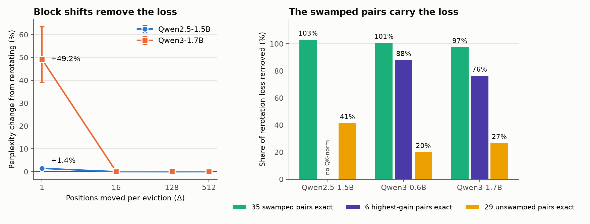

# Rotation Swamping: Why BF16 Cannot Move RoPE Keys, and Why QK-Norm Makes It Worse

Jacob Hollenbeck · 30 September 2026

*This is the technical-blog version of the work formerly titled "PhaseLock: Stable Position Shifts for Sliding KV Caches". The full research record, including the superseded first-draft experiments, is in this file's git history at commit `c4d1e09`.*

## TL;DR

- **The bug.** A sliding KV cache that moves its stored keys one position at a time and writes them back in BF16 stops moving its slow RoPE channels. BF16 cannot represent a change smaller than about 2⁻⁹ of a value, and in 35 of Qwen's 64 channel pairs a one-position rotation is smaller than that. We call this **rotation swamping**.
- **The cost.** Even with exact FP32 rotation arithmetic, perplexity rises 1.4% on Qwen2.5-1.5B, 27% on Qwen3-0.6B and 49% on Qwen3-1.7B. Keeping only the 35 swamped pairs exact removes 97–103% of that loss. Qwen3 is hit harder because its QK-norm puts about three quarters of key energy into exactly those channels.
- **The fix.** Never re-round a rotated key (store it once and rotate at read or at insertion), or shift in blocks of 16 or more positions. Either removes the loss in our runs.
- **Two side results.** A cache that keeps absolute positions and forms angles in FP32 collapses at exactly 2²⁴ positions; integer phase (PhaseLock) or FP64 fixes it. And 4-bit keys quantized before RoPE work once each channel's offset or scale is undone: Qwen2.5's key bias, Qwen3's QK-norm gain.

## 1. The setup

A language model keeps a **KV cache**: for every past token and every layer, a key vector (what the token offers to be matched against) and a value vector (what it contributes when matched). Position enters through **rotary position embedding** (RoPE) [1]. RoPE splits each 128-dimensional key into 64 two-dimensional pairs and rotates pair \(j\) by the angle \(p\,\omega_j\), where \(p\) is the token's position and \(\omega_j=\theta^{-2j/d}\). Qwen uses \(\theta=10^6\). Fast pairs (large \(\omega_j\)) turn a lot per token and encode local order; slow pairs (tiny \(\omega_j\)) barely turn and encode long-range distance.

A **sliding cache with attention sinks** [2] keeps the first few tokens plus a recent window; here 4 sinks and 1,024 recent tokens. When the window is full, each new token evicts the oldest window token, and every survivor's logical position drops by one. There are two ways to keep the attention scores right:

1. **Rerotate.** Store keys already rotated. On each shift, rotate every survivor by \(-1\) position and write it back. Historical Hugging Face `SinkCache` did this, and llama.cpp's context shift does it in blocks.
2. **Leave stored keys alone.** Keep keys unrotated and rotate them when attention reads them (StreamingLLM [2]), or rotate each key once at its absolute position and fold the offset into the query. RoPE's relative-position identity makes this exact:

\[
\langle R(a_q-d)\,q,\; R(a_i-d)\,k_i\rangle=\langle R(a_q)\,q,\; R(a_i)\,k_i\rangle .
\]

We call the second variant the **immutable ring**: keys sit in a circular buffer, rotated once, and an eviction only moves a head pointer.

The two designs are identical in exact arithmetic. This post is about what finite precision does to the first one.

**How we measured.** Every quality number below is teacher-forced next-token perplexity on a held-out 20,000-token WikiText-2 test stream, after the cache fills (18,971 scored steps, about 18.5 window lifetimes). Each arm runs through one CUDA-graphed Python decoder that reuses the model's own projections, norms, MLPs and head and replaces only cache storage and attention. Attention accumulates in FP32 (PyTorch SDPA). Models run in BF16 on one RTX 4080 under our job scheduler. Intervals are 95% bootstraps over 18 contiguous 1,024-token blocks; blocks are dependent text, so the intervals are descriptive.

## 2. The mechanism: a rotation too small to round

Rotating pair \(j\) by one position changes each component by about \(\omega_j\) times its partner component. BF16 keeps 8 significant bits, so a stored number only changes when the update exceeds half a unit in the last place, about \(2^{-9}\) of its magnitude. When \(\omega_j<2^{-9}\), rounding returns the old number and the rotation is lost. To first order the condition does not depend on the key's magnitude, only on its frequency. This is swamping in the floating-point-summation sense, where small addends vanish against a large running value [11].

For Qwen (\(\theta=10^6\), \(d=128\)), pairs 29–63 have \(\omega_j<2^{-9}\): 35 of 64. For FP16 (threshold \(2^{-11}\)) the count is 28.

A [CPU probe](experiments/rotation_swamping/probe.py) applied \(n\) one-position rerotations with an FP32 twiddle to 4,096 random keys, rounding to the storage type after each step ([evidence](evidence/rotation-swamping.json)):

- After 256 shifts, BF16 storage achieved on average **10%** of the intended rotation in the 35 predicted pairs and 98% in the rest.
- Mean relative key error grew almost linearly: 0.0020, 0.031, 0.10 and 0.43 after 1, 64, 256 and 1,024 shifts. Independent random rounding would predict only 0.036 at 1,024; the error is systematic, not a random walk.
- FP16 storage reached 0.054; FP32 storage stayed exact.

*Figure 1. The BF16 50% crossing falls inside the predicted band \(2^{-10}\)–\(2^{-9}\). FP16 crosses about two times lower, because the effective threshold depends on the ratio of a pair's two components.*

A rerotated cache therefore keeps its slow channels near their *insertion* phase while the query uses the *current* phase. The error grows with a key's age, up to about \(W\cdot2^{-9}\approx2\) radians for a key that lives through a 1,024-token window.

**A worse variant.** If the one-step rotation coefficient is itself rounded to BF16, it is no longer a pure rotation: its magnitude ranges from 0.9980 to 1.0019. Applied hundreds of times, it shrinks or inflates keys, and relative key error reached 1.17 in the probe. At model level this path gives perplexity 254 on Qwen2.5-1.5B and 406 and 2,501 on Qwen3-0.6B and 1.7B. That was the headline number of our first draft, but it measures a worse implementation, not the effect this post is about.

## 3. What it costs

With FP32 rotation arithmetic and BF16 storage, one position per token:

| Model | Pristine keys | Immutable ring | FP32 rerotation | Rerotation cost |
|---|---:|---:|---:|---:|
| Qwen2.5-1.5B | 8.055 | 8.057 | 8.170 | +1.4% |
| Qwen3-0.6B | 17.363 | 17.369 | 22.090 | +27% |
| Qwen3-1.7B | 13.868 | 13.864 | 20.692 | +49% |

The immutable ring ties pristine rotate-at-read on all three models: on Qwen2.5 the paired excess is +0.0003 NLL [−0.0006, +0.0009]. Against FP32 rerotation on the identical consumer, the ring is ahead by 0.0140 NLL [0.0086, 0.0191] on Qwen2.5. On Qwen3, top-1 agreement between FP32 rerotation and the ring falls to 0.684 (0.6B) and 0.748 (1.7B).

**A correction from our own history.** Our first integrated ring appeared to trail pristine keys (8.450 versus 8.329 on this stream). That gap was attention precision, not the ring: the first consumer rounded softmax probabilities to BF16 before the value product. With FP32-accumulating attention both numbers move to about 8.056 and the gap disappears.

## 4. Why Qwen3 is hit harder

Qwen2.5 and Qwen3 share the same RoPE base and head dimension, so they have the same 35 swamped pairs. The difference is what sits in them. Qwen3 applies a per-head RMSNorm with a learned channel gain \(\gamma\) before RoPE: \(k=\gamma\odot\mathrm{RMSNorm}(W_kh)\). Reading the gains straight from the checkpoints:

- The swamped pairs are 55% of the pairs but carry **77%** (0.6B) and **75%** (1.7B) of the squared gain \(\gamma^2\), averaged over layers.
- Of the six highest-gain pairs in each layer, 74% and 70% are swamped.
- The largest gain reaches 42× the layer median on Qwen3-0.6B and 34× on 1.7B.

QK-norm parks most key energy in exactly the channels BF16 cannot rotate. We tested this causally. Each arm below rerotates one position per token with FP32 arithmetic but stores a chosen set of pairs in FP32, rounding only the rest to BF16:

| Pairs kept exact during rerotation | Qwen2.5-1.5B | Qwen3-0.6B | Qwen3-1.7B | Share of rerotation loss removed |
|---|---:|---:|---:|---|
| None (FP32-arithmetic rerotation) | 8.170 | 22.090 | 20.692 | — |
| Swamped pairs (35 of 64) | **8.052** | **17.341** | **14.022** | 103% / 101% / 97% |
| Six highest-\(\gamma\) pairs per layer | — | 17.881 | 15.252 | — / 88% / 76% |
| Unswamped pairs (29 of 64) | 8.123 | 21.062 | 18.609 | 41% / 20% / 27% |
| Pristine reference | 8.055 | 17.363 | 13.868 | 100% |

*Perplexity on the held-out stream. Shares are of the paired mean-NLL excess over pristine, in the order Qwen2.5-1.5B / Qwen3-0.6B / Qwen3-1.7B. Qwen2.5 has no QK-norm, so it has no gain arm. Shares of the two complementary arms need not sum to 100%, because errors in the two groups interact through the softmax.*

Storing the swamped pairs exactly removes essentially the whole loss on all three models. On Qwen2.5-1.5B and Qwen3-0.6B the result lands inside the pristine interval; Qwen3-1.7B keeps +0.011 NLL [+0.007, +0.013]. Six high-gain pairs per layer, about a tenth of the channels, remove most of the Qwen3 loss. One mechanism explains the whole cost, and QK-norm explains its size.

*Figure 2. Left: Section 5's block-shift ladder. Right: the table above. [`plot_review_fixes.py`](figures/plot_review_fixes.py) regenerates the figure from [`review-fixes.json`](evidence/review-fixes.json).*

## 5. The fix is cheap

### 5.1 Shift in blocks

A shift of \(\Delta\) positions only swamps pairs with \(\Delta\,\omega_j<2^{-9}\), and a key goes through \(\Delta\) times fewer roundings before eviction, so it loses at most about \(W\cdot2^{-9}/\Delta\) radians of phase. llama.cpp's context shift works this way: it discards a chunk and moves the survivors once.

We tested it. Each block arm evicts \(\Delta\) window tokens when the cache is full and rerotates the survivors once by \(-\Delta\) with FP32 arithmetic and BF16 storage. Its reference keeps pristine keys under the identical eviction schedule, so both arms see the same context.

| \(\Delta\) | Swamped pairs | Shifts per key | Qwen2.5-1.5B, rerotate vs pristine | Excess NLL [95% CI] | Qwen3-1.7B, rerotate vs pristine | Excess NLL [95% CI] |
|---:|---:|---:|---|---|---|---|
| 1 | 35 | 1,024 | 8.170 vs 8.055 | +0.0142 [+0.0088, +0.0191] | 20.692 vs 13.868 | +0.400 [+0.330, +0.492] |
| 16 | 22 | 64 | 8.058 vs 8.060 | −0.0002 [−0.0010, +0.0007] | 13.907 vs 13.900 | +0.0005 [−0.0008, +0.0020] |
| 128 | 12 | 8 | 8.100 vs 8.103 | −0.0003 [−0.0012, +0.0006] | 14.004 vs 13.994 | +0.0007 [−0.0003, +0.0017] |
| 512 | 6 | 2 | 8.451 vs 8.453 | −0.0002 [−0.0008, +0.0003] | 14.595 vs 14.595 | +0.0000 [−0.0012, +0.0014] |

From \(\Delta=16\) up, every interval includes zero on both models; the 49% Qwen3 loss vanishes. What block eviction costs is context, not numerics: evicting 512 tokens at once leaves about 768 tokens of window on average and raises the pristine reference's NLL by 0.048 (Qwen2.5) and 0.051 (Qwen3) over one-token eviction. The catastrophic numerics belong to one-token shifting.

### 5.2 Or never rewrite a key

The immutable ring rewrites almost nothing. Snapshotting the cache and counting resident rows whose bits changed \(k\) steps later:

| \(k\) | Pristine or rerotation, K and V | Immutable ring, K / V |
|---:|---:|---:|
| 1 | 99.5% | 0.49% / 0.10% |
| 16 | 99.5% | 1.95% / 1.56% |
| 256 | 99.6% | 25.3% / 24.9% |

The ring follows \((k+S)/N\) for K (the new rows plus the four sink rows, which are re-rotated each step) and \(k/N\) for V. Shifting designs dirty the whole cache every token.

Over 100,000-token streams through a 1,028-token ring, both Qwen2.5 models performed 98,972 evictions with **zero surviving-key rewrites**. A cache saved at 32,768 tokens, reloaded into a fresh process and CUDA context, produced the next full logit tensor bit for bit. Immutable pages also make copy-on-write sharing across forks, beams and snapshots cost only the tokens decoded since the fork; we did not build that serving path.

## 6. Side quest: the FP32 position cliff at 2²⁴

An immutable ring stores keys at *absolute* positions, which grow without bound. Hugging Face forms RoPE angles as position × `inv_freq` in FP32, and FP32 represents every integer only up to \(2^{24}=16{,}777{,}216\). We started 4,096-token held-out streams at large offsets: relative geometry is unchanged, so any change is numerical. We predicted the threshold before running the fine sweep.

| Offset | Qwen2.5-1.5B FP32 | Qwen2.5-1.5B int32 | Qwen3-0.6B FP32 | Qwen3-0.6B int32 | Qwen3-1.7B FP32 | Qwen3-1.7B int32 |
|---:|---:|---:|---:|---:|---:|---:|
| 0 | 9.46–9.50 | 9.45–9.48 | 20.43 | 20.40 | 15.77 | 15.74 |
| \(2^{24}\) | **22.6** | 9.46 | **28.81** | 20.37 | **20.30** | 15.72 |
| \(2^{25}\) | 85.0 | 9.45 | 44.94 | 20.33 | 33.52 | 15.75 |
| \(10^9\) | 1,467.6 | 9.48 | 723.2 | 20.36 | 682.6 | 15.74 |
| \(5\times10^9\) | 6,304.9 | 9.48 | 21,782 | 20.39 | 798,643 | 15.75 |

*The Qwen2.5 offset-0 row spans offsets from 0 to \(1.6\times10^7\). FP64 angles stay flat on every model.*

*Figure 3. Qwen2.5-1.5B. The FP64 points are hidden under the int32 series.*

**PhaseLock's integer phase** is the fix we built. Each frequency is quantized to an integer increment on a \(2^{32}\) ring,

\[
F_j=\operatorname{round}\!\left(\frac{2^{32}\,\omega_j}{2\pi}\right),\qquad
\Theta_j(p)=(p\,F_j)\bmod 2^{32},
\]

and the angle is \(2\pi\Theta_j/2^{32}\). The phase arithmetic is exact modular integer arithmetic, so \(\Theta_j(p)-\Theta_j(q)\) depends only on \(p-q\) at any offset, and trigonometry always sees a bounded angle. FP64 angles are equally accurate, but consumer GPUs run FP64 at a small fraction of FP32 throughput. This is the one place integer phase is strictly better than FP32, and it only matters for caches that pass 16.7 million positions. Below the cliff, integer and float64 phase tie: over 100,000 tokens their paired NLL differed by −0.00032 (0.5B) and −0.00005 (1.5B).

## 7. Side quest: 4-bit keys need per-channel correction first

Quantizing keys to 4 bits *after* RoPE fails badly on these models. Quantizing *before* RoPE is the known better design point [3], but it still fails until each channel's affine distortion is removed. All arms below quantize once per token (symmetric blocks of 32 along the head dimension, FP16 scales) and never rewrite; sinks stay BF16.

| Quantize-once format | Qwen2.5-1.5B | Qwen3-0.6B | Qwen3-1.7B |
|---|---:|---:|---:|
| Pristine BF16 | 8.055 | 17.363 | 13.868 |
| Q8 K before RoPE | 8.090 | 17.365 | 13.791 |
| Q4 K after RoPE | 6,135 | 411.9 | 115.1 |
| Q4 K before RoPE | 268.4 | 126.7 | 53.3 |
| Q4 K before RoPE, bias removed | 8.194 | — | — |
| Q4 K before RoPE, calibrated per channel | 8.104 | 17.465 | 13.943 |
| Q4 K calibrated + Q4 V with bias removed | 8.199 | 17.426 | 13.842 |

**Qwen2.5: remove the bias.** Before RoPE, \(k=W_kh+b_k\), and \(b_k\) is a per-channel constant that can be subtracted exactly before quantizing and restored after. In layer 0 the largest key-bias entry is 316 against a bias-free spread of 1.08. After RoPE the bias becomes \(R(p)\,b_k\), position-dependent and mixed within each pair, so it cannot be removed. The value bias leaves the cache entirely, since attention weights sum to one: \(\sum_i p_i(v_i'+b_v)=\sum_i p_iv_i'+b_v\).

**Qwen3: normalize the gain.** Qwen3 has no bias, but a bias shifts only a channel's mean while a gain scales its mean and spread. In layer 0 of Qwen3-0.6B one channel's gain is 96.5 against a median of 2.28. It sets the 4-bit step for its whole block and buries its neighbours: 45% of channels end up with signal-to-noise below 1, and 8 of 1,024 channels carry 82% of the score error. Across the 28 layers, each layer's \(\gamma\) max/median ratio predicts its plain-Q4 attention KL (Spearman \(\rho=+0.83\), \(p=4\times10^{-8}\)); per-channel mean and standard-deviation calibration, fitted on WikiText *train* text, erases that dependence (\(\rho=-0.33\), \(p=0.09\)).

The rule is the same for both families: before quantizing pre-RoPE keys, undo each channel's affine distortion. A 4-bit K and V cache then costs 1.8% perplexity on Qwen2.5-1.5B and at most 0.4% on Qwen3. Per-channel key quantization (KIVI [6]) and rotation-based outlier removal (QuaRot [9], SpinQuant [10]) attack the same outliers by other routes.

## 8. Speed notes

These come from the same batch-1 Python decoder with the whole decode step captured as a CUDA graph, on an idle GPU. Treat them as relative comparisons, not engine throughput.

| Decode, ms/token, Qwen2.5-1.5B | W 1,024 | W 4,096 | W 16,384 | W 32,768 |
|---|---:|---:|---:|---:|
| FP32 rerotation, SDPA | 6.72 | 7.47 | 12.52 | 22.46 |
| Immutable ring, SDPA | 6.52 | 6.77 | 7.40 | 8.11 |
| Fused pre-RoPE BF16 kernel, phase table | 6.03 | 6.21 | 6.75 | 7.44 |
| Page-framed Q4 K + Q4 V kernel | 6.06 | 6.06 | 6.43 | 6.79 |

*The last row comes from a later job on the same decoder, in which the fused BF16 kernel reproduced within 0.1% (6.039 and 7.434 ms/token).*

*Figure 4. The SDPA ring line is hidden under the Q4 line.*

- **Fused pre-RoPE attention.** Keys stay unrotated, each row carries one position, and a Triton kernel rotates keys in registers. At a 32k window it decodes 3.0× faster than per-token rerotation and 8% faster than the ring with stock attention. Its KV slope, 44 ns per window token for 28,672 bytes of K and V, is about 650 GB/s, roughly 90% of the 4080's rated bandwidth.
- **Integer phase in the kernel, via bit hacks.** The phase word \(\phi=(p\,F_j)\bmod2^{32}\) comes from one wrapping multiply. Shifting \(\phi\) right by 9 bits and OR-ing in the exponent of 1.0 gives \(\mathrm{asfloat}((\phi\gg9)\,|\,\texttt{0x3F800000})\in[1,2)\) with no integer-to-float conversion. Subtracting 1.5 gives the angle in turns, offset by half a turn into \([-0.5,0.5)\); the hardware `sin.approx`/`cos.approx` evaluate it, and negating both results restores the true phase. This is 2.2–3.0× faster than exact library trigonometry, ties a stored phase table at 32k and is 1.3× faster at 128k, with 17× lower error than the FP16 table.
- **Page-framed 4-bit keys.** A key at absolute position \(p_0+m\) is stored rotated only by its offset \(m\) inside a 64-token page, and the query is rotated once per page by \(t-p_0\), since \(\langle R(t)q,R(p_0+m)k\rangle=\langle R(t-p_0)q,R(m)k\rangle\). Stored bits never depend on absolute position. Keys are unpacked with the magic-number identity \(\mathrm{asfloat}(\texttt{0x4B000000}\,|\,n)-(2^{23}+8)=n-8\). With 4-bit values too, this decodes 8.6% faster than the fused BF16 kernel at 32k.
- **Where the ring's advantage comes from.** Against unfused rotate-at-read, the ring touches \(S+1\) rows per token instead of all of them. The saving per layer is nearly identical across three models that share an 8-head × 128 KV geometry (Qwen3-0.6B, 1.7B and 8B truncated to 18 layers: about 21 / 190 / 1,700 µs at 1k / 4k / 16k), so it is set by geometry, not weights. Across geometries it is not yet explained: Qwen2.5-1.5B, with 2 KV heads, saves an eighth of Qwen3's time rather than the quarter a byte count predicts. L2 residency of its smaller FP32 temporaries (about 17 MB against the 4080's 64 MB L2) is one candidate; we have not measured it. A fused rotate-at-read kernel removes most of this saving anyway.

## 9. What happens in the wild

A source audit of pinned public revisions found the repeated-rewrite pattern in two places:

- **Transformers `SinkCache`** (historical, commit `fe5bfaa`) rerotated retained post-RoPE keys on every shift and cast its rotation table to the key dtype first. Mainline replaced it with a Hub stub in v4.53 and removed it in v5. On the live [Hub copy](https://huggingface.co/transformers-community/sink_cache) with Qwen2.5-1.5B and native model forward calls, bounded local positions gave near-tied quality: 10.122 upstream versus 10.136 with FP32, normalized coefficients. That did **not** reproduce the catastrophic loss; the Hub cache derives a position-dependent twiddle and uses a different attention path. The same test exposed a separate **position-contract defect**: under `generate()`'s absolute positions, upstream rerotated retained keys into local slots anyway. Leaving them at their absolute phases improved post-fill perplexity from 14.933 to 10.018 on 20,000 train tokens (all 19 blocks) and from 15.982 to 10.441 on 10,000 independent test tokens (all 9 blocks). We [proposed that fix](https://huggingface.co/transformers-community/sink_cache/discussions/2) upstream.
- **llama.cpp K-shift** (commit `4098fdc`) applies a delta RoPE to resident post-RoPE keys and rewrites them in the cache dtype; quantized keys are dequantized, rotated and requantized. It shifts in blocks, which Section 5.1 says is safe with FP32 rotation arithmetic. We did not run llama.cpp itself.

We found no matching repeated-rewrite path in the inspected vLLM prefix reuse, SGLang, TensorRT-LLM, MLC-LLM, ExLlamaV2/V3, MLX-LM, LMDeploy or Text Generation Inference paths. LMCache Blend re-RoPEs a retrieved chunk once when reusing it at new positions, a one-time relocation rather than repeated shifting. A code search can rule a path in but cannot rule out every plugin or later change.

## 10. Beyond the window: re-reading evicted pages

Immutable, absolutely rotated keys stay valid after eviction, so an evicted page can be archived with its positions and later re-read at its true position. Each layer scored archived 16-token pages against the current query with Quest-style per-channel bounds [4] and read the top eight pages (128 tokens) alongside the 1,024-token window. On six scripted conversations with 48 facts still in the window and 48 already evicted (one-word answers):

| Cache | Retained correct | Evicted correct |
|---|---:|---:|
| FIFO window (1,024) | 47/48 | 10/48 |
| FIFO window, same budget (1,152) | 47/48 | 9/48 |
| Retrieval at true positions, one cross-layer page vote | **48/48** | **26/48** |
| Full context, no eviction (2 scripts) | 16/16 | 15/16 |

FIFO's 10/48 is near the four-way guess rate. Presenting retrieved pages next to the window instead of at their true positions did worse (7/16 versus 10/16 where both ran). Page selection, not answering, now limits recall: when the fact's page was served, the model answered 22 of 32 correctly. Heavy-hitter eviction (H2O [5]) did not come close, at 11–16/48 evicted. InfLLM [8] retrieves evicted blocks in a related way; this test isolates the value of true-position presentation.

## 11. Limits and related work

- **Scope.** One held-out text stream per condition (the offset sweep uses 4,096 tokens); a batch-1 Python decoder on one GPU; two model families. No production engine was run, including llama.cpp. Recall tests use synthetic one-word answers.
- **The severe regime is narrow.** One-token rerotation of stored keys is mostly historical: `SinkCache` has left mainline Transformers, and block-shifting engines are fine per Section 5.1.
- **Prior art.** RoPE is from RoFormer [1]. Caching unrotated keys and rotating at read is StreamingLLM's design [2]. Pre-RoPE key quantization is KVQuant's [3], per-channel key quantization KIVI's [6], and rotation-based KV outlier removal QuaRot's and SpinQuant's [9, 10]. Wang et al. showed that BF16 breaks RoPE's relative-position property in long-context training [7]. Quest [4] and InfLLM [8] select or retrieve KV blocks beyond a local window. What is new here is the swamping mechanism under repeated shifts and its measured cost, the QK-norm interaction and its causal test, the \(2^{24}\) threshold, and the per-channel correction rule for Qwen2.5 and Qwen3.
- **Open questions.** Whether swamping also explains Wang et al.'s training-time degradation, and whether other QK-norm families (Gemma, OLMo) concentrate gain in slow pairs the same way.

## 12. Design rules

1. Never repeatedly re-round a rotated key. Rotate once at insertion, or rotate at read.
2. If stored keys must shift, shift in blocks of 16 or more positions with FP32 rotation arithmetic, and never round the rotation coefficient to BF16.
3. Quantize keys before RoPE, and undo each channel's offset (bias) or scale (QK-norm gain) first.
4. If absolute positions can pass \(2^{24}\), form angles from integer phase or FP64, not FP32.

## Reproducibility

All jobs ran under **mrun**, our job scheduler, on one RTX 4080 host, with PyTorch 2.13.0+cu130; the native `SinkCache` runs are pinned to Transformers 4.52.1. Results are content-addressed: each evidence extract below records the SHA-256 of every raw result and executed source file. Job identifiers have the form `job-<12 hex>`.

| Result | Code | Jobs | Evidence |
|---|---|---|---|
| Rotation swamping probe (§2) | [`probe.py`](experiments/rotation_swamping/probe.py) | CPU | [`rotation-swamping.json`](evidence/rotation-swamping.json) |
| Qwen2.5 one-token costs, immutable ring, dirty rows, offsets, 4-bit keys (§3, §5.2, §6, §7) | `saturn/experiments/2026-09-29-phaselock-free-wins/` | `job-5bf54a112017`, `job-7287ff9890fd`, `job-f1b6021f8f2b`; offsets `job-aec42c31cb25`, `job-52e9d4d5b335` | [quality](evidence/free-wins-quality.json), [offset](evidence/free-wins-offset.json) |
| Qwen3 costs, offsets and 4-bit keys (§3, §6, §7) | `saturn/experiments/2026-09-30-phaselock-bithacks/` | `job-d7941d73fbdf`, `job-0e5aa58d55c3`, `job-7007f16a07ee`, `job-8969fb3c4323`, `job-ca32a97fe217`, `job-fec9906ac08c`; gain diagnostic `job-0884d060598e` | [`bithacks-qwen3.json`](evidence/bithacks-qwen3.json) |
| Exact pairs and block shifts (§4, §5.1) | `saturn/experiments/2026-09-30-phaselock-review-fixes/` (`unified.py` `shift`/`exact` options; `test_review_cpu.py`; `analyze.py`) | exact pairs `job-6ea35d8c6d35`, `job-628e9fa6055d`, `job-93a28be52bb0`; block shifts `job-6cf2f2b081ea`, `job-25a6c696c58e` | [`review-fixes.json`](evidence/review-fixes.json) |
| 100,000-token streams (§5.2, §6) | `saturn/experiments/2026-09-29-phaselock-long-session/` | `job-f9057bec4470`, `job-12f57f5a475d` | [report](../../../saturn/experiments/2026-09-29-phaselock-long-session/REPORT.md) |
| Kernels and speed (§8) | `payload/fused_pre.py`, `payload/kernels_v3.py` | `job-c41d3d14ceef`, `job-6832e7b4ec3b`, `job-3e5dd9f2999d`, `job-fcdc9bd63242`; one-layer `job-c46455e2e38c`, `job-a63f944e09b5`; scaling `job-fcf8ea8845a7`, `job-593318e8b23b`, `job-04340a620ef7`, `job-c2b90c8d5179` | [free-wins speed](evidence/free-wins-speed.json), [bithacks speed](evidence/bithacks-speed.json) |
| Page retrieval (§10) | `saturn/experiments/2026-09-29-phaselock-free-wins/` | `job-eb405e236655`, `job-e6a2eff87994`, `job-f4271881e75b`, `job-f8aae0a4504f`, `job-84a0bf35f920`, `job-6d19b12c21ed`, `job-80c8e5799a7a`, `job-bcbd43712f1f` | [`free-wins-recall.json`](evidence/free-wins-recall.json) |
| Native `SinkCache` (§9) | [`compare.py`](experiments/sink_cache_native/compare.py) | `job-bc3292bf163e`, `job-38071dde859b`, `job-0f39060a3150` | [local](evidence/sink-cache-native-full-train-localpos-20260925.json), [absolute train](evidence/sink-cache-native-full-train-globalpos-20260925-r1.json), [absolute test](evidence/sink-cache-native-test-globalpos-20260926.json) |

The reference arms rerun inside the block-shift jobs matched the earlier Qwen3-1.7B arrays (`job-8969fb3c4323`) bit for bit. [`build_free_wins_evidence.py`](build_free_wins_evidence.py) and [`build_bithacks_evidence.py`](build_bithacks_evidence.py) regenerate the extracts.

## References

[1] J. Su et al. [RoFormer: Enhanced Transformer with Rotary Position Embedding](https://arxiv.org/abs/2104.09864). 2021.

[2] G. Xiao et al. [Efficient Streaming Language Models with Attention Sinks](https://arxiv.org/abs/2309.17453). ICLR 2024.

[3] C. Hooper et al. [KVQuant: Towards 10 Million Context Length LLM Inference with KV Cache Quantization](https://arxiv.org/abs/2401.18079). NeurIPS 2024.

[4] J. Tang et al. [Quest: Query-Aware Sparsity for Efficient Long-Context LLM Inference](https://arxiv.org/abs/2406.10774). ICML 2024.

[5] Z. Zhang et al. [H2O: Heavy-Hitter Oracle for Efficient Generative Inference of Large Language Models](https://arxiv.org/abs/2306.14048). NeurIPS 2023.

[6] Z. Liu et al. [KIVI: A Tuning-Free Asymmetric 2bit Quantization for KV Cache](https://arxiv.org/abs/2402.02750). ICML 2024.

[7] H. Wang et al. [When Precision Meets Position: BFloat16 Breaks Down RoPE in Long-Context Training](https://arxiv.org/abs/2411.13476). arXiv 2024.

[8] C. Xiao et al. [InfLLM: Training-Free Long-Context Extrapolation for LLMs with an Efficient Context Memory](https://arxiv.org/abs/2402.04617). arXiv 2024.

[9] S. Ashkboos et al. [QuaRot: Outlier-Free 4-Bit Inference in Rotated LLMs](https://arxiv.org/abs/2404.00456). arXiv 2024.

[10] Z. Liu et al. [SpinQuant: LLM Quantization with Learned Rotations](https://arxiv.org/abs/2405.16406). ICLR 2025.

[11] N. J. Higham. [The Accuracy of Floating Point Summation](https://nhigham.com/wp-content/uploads/2023/10/high93s.pdf). SIAM J. Sci. Comput. 14(4):783–799, 1993.
