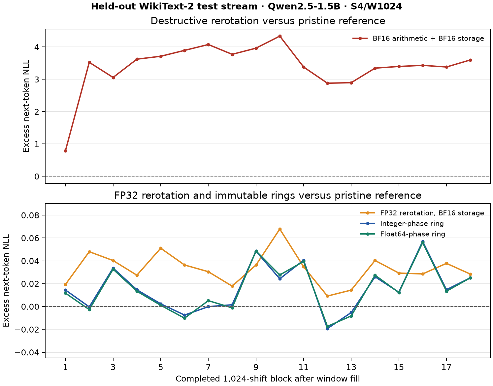

# PhaseLock: Stable Position Shifts for Sliding KV Caches

**Rotation swamping, the FP32 position cliff, and 4-bit pre-RoPE keys in streaming Qwen inference**

Jacob Hollenbeck

*Draft, updated 30 September 2026. §§4–5 report the first live-stream and integrated-prototype runs (24–26 September); §6 re-runs every arm in one CUDA-graphed consumer and supersedes §5 where they differ, as marked. §7 audits public cache implementations. All speed results come from a batch-1 Python decoder on one RTX 4080, not a production engine.*

## Abstract

Streaming inference with attention sinks keeps a bounded recent KV window and gives surviving tokens new rotary positions. A common implementation rotates the stored keys again on every shift and writes them back in reduced precision. We measure what that costs, why, and what avoids it, in teacher-forced 20,000-token WikiText streams through Qwen2.5 (0.5B, 1.5B) and Qwen3 (0.6B, 1.7B).

1. **Rotation swamping.** A one-position rerotation changes channel pair \(j\) by about \(\omega_j\) times its partner. When \(\omega_j<2^{-9}\), BF16 rounding discards that change: 35 of Qwen's 64 RoPE pairs keep about 10% of each intended rotation. With FP32 rotation arithmetic and BF16 storage, one-token shifts cost +1.4% perplexity on Qwen2.5-1.5B and +27% and +49% on Qwen3-0.6B and 1.7B, against pristine keys in the same consumer (§6.1, §6.9). Keeping only the swamped pairs exact during rerotation removes 97–103% of that loss on all three models. Shifting in blocks of 16 or more positions, as llama.cpp's context shift does, removes this cost on both families. Rounding the rotation coefficient itself to BF16 makes it nonunit and drives perplexity to 254–2,501.
2. **The FP32 position cliff.** A cache that keeps absolute positions and forms rotary angles in FP32 collapses exactly at \(2^{24}\) positions on all three models tested (Qwen2.5-1.5B: perplexity 9.5 becomes 22.6, and 6,305 at \(5\times10^9\)). PhaseLock's integer phase ring and FP64 angles both stay flat past \(2^{32}\). This is the one advantage specific to integer phase, and FP64 matches its accuracy.
3. **Affine correction before 4-bit keys.** Before RoPE, Qwen2.5's key bias can be removed exactly and Qwen3's QK-norm gain outliers normalized per channel. Quantize-once 4-bit K and V then cost 1.8% perplexity on Qwen2.5-1.5B and within 0.4% on Qwen3, versus 6,135 (Qwen2.5-1.5B) and 412 (Qwen3-0.6B) for 4-bit keys quantized after RoPE.
4. **Immutable keys are cheap to serve.** Rotating each key once at its absolute position ties rotate-at-read quality (8.057 versus 8.055) and rewrites no surviving key: zero rewrites in 98,972 evictions over 100,000 tokens, with bit-exact restart. A fused pre-RoPE Triton kernel decodes 3.0 times faster than per-token rerotation at a 32k window and 8% faster than the ring with stock attention. Bit-level integer trigonometry makes in-kernel phase as fast as a stored table, and page-framed 4-bit K/V decodes 8.6% faster than fused BF16 at 32k.

Pristine-key caching [2] and pre-RoPE and per-channel key quantization [3, 6] are prior art, as is BF16 RoPE degradation in long-context training [7]. Our contributions are the swamping mechanism and its measured cost under repeated shifts, the \(2^{24}\) threshold, and the per-channel correction rule for Qwen2.5 and Qwen3. Separately, a native Hugging Face `SinkCache` comparison (§7.1) found a position-contract defect (post-fill perplexity 14.9 versus 10.0 with retained keys left at their absolute phases).

## 1. Problem and scope

Rotary position embedding (RoPE) rotates query and key channel pairs by an angle proportional to token position [1]. In a streaming cache with attention sinks, the sink tokens keep their original positions while recent tokens are assigned positions inside a bounded rolling window [2]. When a window token is evicted, the logical positions of the survivors decrease. Their cached key vectors must continue to produce the attention scores appropriate to those new logical positions.

There are two straightforward ways to do this. One may store keys **after** rotation and rotate the survivors again on every shift. Or one may keep pristine **pre-rotary** keys and apply the appropriate rotation when attention reads them. The latter design is already present in the original StreamingLLM work [2]; pre-RoPE key quantization is established in KVQuant [3], and per-channel key quantization in KIVI [6]. PhaseLock does not claim to invent pristine-key caching. Its narrower proposal is a fixed-width integer phase law for position bookkeeping, paired with a shift path that does not compound arithmetic or quantization error on surviving keys.

We use **numerical KV-cache drift** to mean the changing values of surviving keys caused by repeated rerotation and storage rounding. Sections 5.4 and 6.7 test a narrow behavioral consequence: one-word recall of scripted facts. The paper does not test durable memory across conversations or preservation of semantic state after summarization.

Our contributions are:

1. **The drift mechanism and its cost.** Rotation swamping (§6.2) explains why repeated low-precision rerotation fails; we measure its cost under one-token shifts on four models (§4, §5.3, §6.1, §6.9), show that block shifts of 16 or more positions remove it (§6.2), and locate the Qwen3 loss in specific channel pairs (§6.9).
2. **An integer-specific result.** A predicted and measured FP32 position cliff at exactly \(2^{24}\) that integer phase removes, replicated on three models (§6.3, §6.9).
3. **A quantization rule.** Before quantizing pre-RoPE keys, undo each channel's affine distortion: Qwen2.5's bias, Qwen3's QK-norm gain (§6.5, §6.9).
4. **Serving prototypes.** An immutable-key ring with zero surviving-key writes and bit-exact restart (§5, §6.1, §6.4); fused pre-RoPE, split-K and page-framed 4-bit Triton kernels with exact in-kernel integer trigonometry (§6.6, §6.8); true-position retrieval of evicted pages (§6.7).
5. **Behavioral and in-the-wild checks.** Pass-key and scripted-conversation assays (§4.4, §5.4), and a source audit plus native measurement of public cache implementations (§7).

## 2. PhaseLock and the two sources of error

### 2.1 Integer phase law

For a rotary channel pair with angular frequency \(\omega_j\), ordinary RoPE uses angle \(p\omega_j\) at position \(p\). PhaseLock first quantizes each frequency to an integer increment on a \(2^B\)-element ring:

\[
F_j=\operatorname{round}\!\left(\frac{2^B\omega_j}{2\pi}\right),
\qquad
\Theta_j(p;o)=((p+o)F_j)\bmod 2^B.
\]

The consumer decodes \(2\pi\Theta_j/2^B\) to sine and cosine when applying RoPE. A uniform position shift by \(-\Delta\) changes the origin \(o\leftarrow o-\Delta\). No sequence of approximate rotations is applied to a surviving key. Because the phase arithmetic is modular integer arithmetic, \(\Theta_j(p;o)-\Theta_j(q;o)\) depends on \(p-q\) within the chosen ring. This is an exact property of the *quantized* phase law; it is not a claim that finite-width frequencies reproduce real-valued RoPE without approximation.

The integrated ring in §5 uses the opposite coordinate convention: its
nonnegative origin counts evictions and maps a *current local* slot to an
absolute insertion position. Thus that origin increases by \(\Delta\) as local
positions decrease by \(\Delta\). Both descriptions preserve the same
relative phase; they assign different meanings to the origin variable.

### 2.2 What causes accumulated drift

Consider a stored key \(\widehat{k}_0=Q(R(p)k)\), where \(R\) is the rotary transform and \(Q\) is storage rounding or quantization. Repeated post-rotary shifts apply

\[
\widehat{k}_{n+1}=Q\!\left(R(-\Delta)\widehat{k}_n\right).
\]

Even if the angle is formed accurately, this recursion inserts new storage error at every shift. A pristine-key path instead stores \(Q(k)\) once and forms a temporary rotated view from the original stored value. Its quantization error remains, but there is no *repeated* quantization of the survivor. This distinction predicts growing damage with the number of times a key survives a shift, especially in low-precision storage.

PhaseLock also avoids growing error in phase bookkeeping. A high-precision floating-point implementation with pristine keys and an exact integer position counter can avoid the same repeated-key error. Establishing a benefit *specific to PhaseLock's integer phase* therefore requires that comparator, not merely a comparison against destructive rerotation. §6.3 supplies one for caches that keep absolute positions: FP32 angle formation fails from \(2^{24}\) positions, while integer phase stays exact.

## 3. Experimental method

### 3.1 Live streaming consumer

We ran Qwen2.5-1.5B-Instruct and Qwen2.5-0.5B-Instruct in BF16 on one NVIDIA RTX 4080. The stream contains 20,000 WikiText-2 train tokens. Each step consumes one real stream token and scores the next token with teacher-forced negative log likelihood; this avoids treating early greedy-generation divergence as an accuracy measurement. The cache retains four initial sinks and either 1,024 or 2,048 recent tokens. Once full, it evicts one recent token on each step and reassigns the surviving window positions. A key can therefore experience up to approximately one window's worth of shift operations before eviction.

The harness reuses the loaded Qwen model's learned embeddings, projections, normalization, MLPs, and output head. It reimplements rotary application, attention, and cache management, which are the experimental variables. On a 96-token no-eviction check against stock Hugging Face inference, the manual path had 97.9% top-1 agreement and KL divergence 0.0039. The remaining difference prevents a claim of bitwise parity with the stock engine. All experimental arms use the same manual model path, so their within-harness comparisons isolate cache and rotary choices.

The main arms are pristine BF16 keys with high-precision float angles (reference); pristine BF16 keys with PhaseLock; post-rotary BF16, FP16, or FP32 keys rerotated and written back on each shift; and Q8 keys either quantized once before RoPE or requantized after every shift. The Q8/Q4 simulation quantizes **K only**, keeps V unquantized, and omits the ggml Hadamard transform. It is a controlled representation test, not an end-to-end measurement of a released llama.cpp build.

In this live harness, the PhaseLock arm forms integer phases from the current cache-slot indices on each read. It does **not** use a persistent origin update as its complete eviction path. The isolated origin-update measurement and phase-law identity are separate from the live model timing; §5 tests their integration with ring storage and query-side attention.

The earlier pass-key assay in §4.4 used a different harness: it numerically emulated 256 or 1,024 shifts of 512 positions on keys in a full model forward pass, with FP32 rerotation arithmetic followed by BF16 or FP16 key storage after every shift. It did not append and evict tokens in an incremental decoding loop. Its behavioral counts must not be pooled with the live conversation assay in §5.4.

### 3.2 Measurements and comparison limits

The primary outcome is steady-state perplexity after the cache fills. We also record timing per token for the 1,024-window 1.5B run and inspect a second model and window size for the direction of the quality effect. A separate kernel experiment measures RoPE application and the cost of an isolated origin update against full-cache rerotation. The isolated update is not included as a production throughput claim.

## 4. Results

### 4.1 Predictive quality under repeated shifts

| Key path | Qwen 1.5B, window 1,024 | Qwen 1.5B, window 2,048 | Qwen 0.5B, window 1,024 |
|---|---:|---:|---:|
| Pristine BF16 K, high-precision float angles | 9.882 | 9.072 | 14.226 |
| Pristine BF16 K, PhaseLock | **9.884** | **9.077** | **14.223** |
| Post-RoPE FP32 K, rerotate each shift | 9.886 | 9.079 | 14.224 |
| Post-RoPE FP16 K, rerotate each shift | 10.056 | 9.315 | 14.232 |
| Pre-RoPE Q8 K, quantize once, PhaseLock | **10.181** | **9.419** | **14.670** |
| Post-RoPE Q8 K, requantize each shift | 12.898 | 814.320 | 76.671 |
| Post-RoPE BF16 K, rerotate each shift | 322.101 | 61,839.175 | 114.716 |

*Steady-state perplexity; lower is better. Each column uses its own model/window reference, so absolute perplexity is not compared across columns. The 1.5B, 2,048-window job was marked lost near its end, but its incremental quality rows completed; its timing is excluded because of GPU contention.*

At a 1,024-token window, pristine-key PhaseLock and the pristine float reference differ by 0.002 perplexity. That is a match at the resolution relevant to this experiment, not evidence that integer phase improves the model over high-precision float phase. The striking failures are repeated BF16-arithmetic rerotation and repeated Q8 requantization; both change resident keys on each shift. At a 2,048-token window the pristine paths improve with more context, while repeated Q8 requantization becomes dramatically worse. The same direction appears in the 0.5B model.

*Figure 1. Qwen2.5-1.5B, four sinks, 1,024-token window. The ordinate is mean next-token NLL in each 1,000-token bin minus the reference NLL in that same bin, avoiding differences in the difficulty of successive WikiText passages. The plotted bin values and source-result hash are in [`evidence/nll-bins.json`](evidence/nll-bins.json); [`plot_excess_nll.py`](figures/plot_excess_nll.py) regenerates the figure.*

The post-rotary FP32 arm is also close to the reference. The BF16 arm in this
table uses BF16 arithmetic for each rotation, including a fixed coefficient
rounded to BF16. The table alone therefore cannot assign its dramatic loss to
key-storage rounding. The controlled FP32-arithmetic/BF16-storage follow-up in
§5.3 shows that most of the collapse comes from that arithmetic choice, while
repeated BF16 storage still leaves a smaller quality gap. An earlier
fixed-window shift emulation showed the same ordering but did not perform
live eviction, so the incremental stream above is the primary evidence.

A second Qwen2.5-1.5B streaming implementation ran 8,000 WikiText tokens with four sinks, a 1,024-token window, and one-token evictions. Its steady-state perplexities were 12.524 for pristine high-precision float keys, 12.526 for PhaseLock, 12.527 for post-rotary FP32 rerotation, 292.413 for post-rotary BF16 rerotation, 12.930 for quantize-once Q8, and 16.703 for repeated Q8 requantization. The absolute perplexities differ because the stream is shorter; the arm ordering agrees with the 20,000-token test. This is an additional implementation check, not a claim of independent model-family replication.

### 4.2 Timing in the current harness

| 1.5B arm, window 1,024 | ms/token |
|---|---:|
| Pristine float reference | 13.67 |
| Pristine PhaseLock | 13.47 |
| Post-RoPE FP16, rerotate | 14.02 |
| Pre-RoPE Q8, quantize once, PhaseLock | **15.04** |
| Post-RoPE Q8, requantize per shift | 17.68 |

The Q8 quantize-once path is about 15% faster than repeated Q8 requantization in this frequent-shift harness. The unquantized PhaseLock and pristine float paths have indistinguishable practical speed here. Both pay to copy the surviving window at eviction and to rotate all pristine keys when read. Thus their current decode path is **not** an integrated constant-time shift implementation.

In separate RTX 4080 measurements, full BF16 cache rerotation took 0.871 ms at 32k cached tokens and 3.885 ms at 128k, while an isolated integer origin update took about 137 ns independent of those cache sizes. The large ratio compares *the shift primitives only*. Fused RoPE application itself was essentially tied across integer-phase and floating-point arms at decode size. These measurements motivate the integration in §5; they do not predict its total token throughput.

### 4.3 Interpretation

The largest, repeatedly observed effect is catastrophic quality loss when a
BF16-rounded rotation coefficient is applied to resident BF16 keys on every
shift. The 20,000-token train stream, a second 8,000-token consumer, and the
held-out integrated stream all show perplexity in the hundreds for this path
while their pristine or immutable comparators remain near their respective
single-digit or low-double-digit baselines. The held-out FP32-arithmetic
rerotation control repairs most of that failure; its residual gap to the
immutable float ring is much smaller. Repeated Q8 requantization is a second
large effect in the tested manual path, and avoiding it saved time there. The
evidence in this section does not establish that PhaseLock is faster than an
optimized float implementation that also stores keys once, uses a ring buffer,
and moves the shift to query-side arithmetic. §6.6 and §6.8 compare fused
kernels directly.

### 4.4 Fixed-window pass-key stress test

The initial PhaseLock model harness hid a five-digit pass key in about 3,000 tokens of repeated filler and required every answer token to be the model's top choice under teacher forcing. At each shift count it rotated the keys at an offset of \(N\times512\), applied \(N\) successive \(-512\)-position corrections, and scored a full forward pass at local positions. The float correction used FP32 arithmetic and wrote the resulting keys back in the nominated cache dtype after each step. The PhaseLock arm changed the integer origin and rotated from the unchanged source. There were 24 prompts per model and condition.

| Model and key path | 256 simulated shifts | 1,024 simulated shifts |
|---|---:|---:|
| Qwen2.5-1.5B, repeated BF16 storage | 17/24 | 0/24 |
| Qwen2.5-1.5B, repeated FP16 storage | 24/24 | 24/24 |
| Qwen2.5-1.5B, PhaseLock | 24/24 | 24/24 |
| Qwen2.5-0.5B, repeated BF16 storage | 14/24 | 0/24 |
| Qwen2.5-0.5B, repeated FP16 storage | 24/24 | 24/24 |
| Qwen2.5-0.5B, PhaseLock | 24/24 | 24/24 |

This large BF16 contrast observes a retrieval collapse in the repeatedly written BF16 arm under a severe numerical stress test. The FP16 arm's 24/24 result is a counterexample to a broad claim that any rerotation destroys retrieval. The comparison also changes the phase source and key storage path, so the count alone does not isolate repeated BF16 writes as its sole cause. The prompts reuse one filler template, the shift schedule is deliberately extreme, and the full-forward emulation does not test a live cache or a released engine. The later same-consumer live assay in §5.4 provides the more directly interpretable, but much smaller, behavioral contrast. A [compact extract](evidence/passkey-shift-stress.json) records the counts and source hashes.

## 5. Integrated cache shifting: prototype result and evidence boundary

**Status: integrated PyTorch and experimental Triton prototypes measured; quality gaps superseded by §6.1.** These experiments distinguish a cheap phase metadata operation from a cheap integrated inference path. Every ring arm in this section used eager attention that rounds softmax probabilities to BF16. §6.1 re-runs the same arms with FP32-accumulating attention and finds that the ring ties pristine rotate-at-read (8.057 versus 8.055). The ring-versus-reference gaps reported below (17.28 versus 17.15 in §5.1; 8.450 versus 8.329 in §5.3) are therefore attention precision, not a cost of the ring. The rerotation-versus-ring contrasts and the zero-write shift results stand. The separate native Hugging Face cache comparison is reported in §7.1.

For the recent-window keys, assign each key its original stream position \(a_i\) and rotate it once at insertion. After \(d\) window evictions, its desired local position is \(a_i-d\); the current query's local position is \(a_q-d\). RoPE's relative-position identity gives

\[
\langle R(a_q-d)q, R(a_i-d)k_i\rangle
=\langle R(a_q)q,R(a_i)k_i\rangle.
\]

The recent-window keys can therefore remain untouched if the window scores use a query rotated at \(a_q\). Sink keys remain fixed at their original local positions, so their scores use a query rotated at \(a_q-d\). One attention operation must combine the sink and recent-window scores under the **same softmax**. A ring buffer replaces the physical window copy with a head-pointer update. The shift event should change only bounded metadata and the ring pointer; appending a new token still writes its own K/V slot. Attention still reads a window-sized cache, so total decoding is **not** constant time in window length.

The matched arms are (A) post-RoPE rerotation, (B) pristine pre-RoPE keys rotated at read, (C) ring buffer and query-side folding with a high-precision floating-point phase source, and (D) the identical ring/attention path with PhaseLock integer phase. They use the same model weights, tokens, BF16 K/V format, sink policy, mask, backend, and profiling scope. A separate simulated Q8 arm remains a quality diagnostic, not a matched storage or speed comparator for these BF16 arms.

The interpretation is prespecified. Flat shift latency with no surviving-cache rewrite supports an integrated constant-time *shift* claim. Better total throughput than arm A would support a practical deployment benefit in that tested engine. A difference between D and C would be evidence for the integer representation specifically; a tie credits the ring/query-fold architecture. The measured prototypes do not supply a native production-engine throughput claim.

### 5.1 Measured integrated prototype

The integrated experiment runs every token through Qwen2.5-1.5B-Instruct's learned submodules while replacing cache storage and attention with a sink-plus-ring consumer. Each newly generated K is rotated once at its original stream position, then stored in BF16. An eviction updates one shared ring head and one origin integer for the whole 28-layer cache; the next token's K/V are written to the vacated slot as ordinary decode work. The sink and window scores use separate query phases and enter one softmax. Both ring arms compute only the phase vectors needed for the new token, on demand, rather than allocating a table that grows with stream length. In this code, the window query phase is formed from the absolute token counter, which equals local position plus origin. The origin value is checked and selects the fixed sink phase after the first eviction, but it is not yet the direct source of the window query phase. Thus this run demonstrates a constant-work ring shift and equivalent phase coordinates, not that an origin-only phase update is load-bearing for correctness.

| Arm; BF16 K/V, 4 sinks, 1,024-window | Steady-state perplexity | Tokens/s |
|---|---:|---:|
| Pristine pre-RoPE reference, rotate at read | 17.151 | 62.07 |
| Post-RoPE BF16, rerotate at each shift | 17.388 | **64.52** |
| Ring plus query-side fold, high-precision float phase | 17.278 | 59.67 |
| Ring plus query-side fold, PhaseLock integer phase | 17.280 | 59.64 |

This run consumed 1,600 matched WikiText tokens, of which 571 decode steps occurred after the first eviction. The ring arms differ by only 0.002 perplexity and about 0.05% throughput, so it supplies no integer-versus-float advantage. PhaseLock's ring quality is close to the pristine reference and better than BF16 rerotation at this horizon. Its remaining gap to the reference was later traced to BF16 attention precision in the segmented ring path (§6.1). The 571-shift horizon is too short to replace the 20,000-token quality evidence in §4.

The isolated profiler found **zero CUDA kernels at ring eviction** versus 224 for the BF16 rerotation-and-copy shift at a full 1,024-token cache. The ring controller's measured median host update was 0.301 microseconds for the integer arm; the surviving K/V write path is empty at eviction, versus at least 29.33 MB of surviving BF16 K/V data touched by the baseline. These are operation-scope results. In full decode, the ring arm was about **7.5% slower** than BF16 rerotation. Its PyTorch attention separately scores sink and ring spans, concatenates scores, and separately reduces value outputs; it also forms phase vectors on the host on demand, whereas the BF16 baseline reads a bounded precomputed phase table. The present profile does not isolate the cost of each difference, so it does not attribute the slowdown to attention alone. This is an integrated model-consumer prototype, not a fused production kernel. The [unrounded result extract](evidence/integrated-prototype-summary.json) binds the raw output and its content-addressed run receipt (§9) by SHA-256.

A separate full-cache shift profile, using the same 28-layer code paths and no model forward, gives the scaling contrast:

| Window tokens | Ring shift CUDA kernels | BF16 rerotation kernels | BF16 rerotation GPU kernel time | Minimum surviving BF16 K/V writes |
|---:|---:|---:|---:|---:|
| 16 | 0 | 224 | 0.376 ms | 0.43 MB |
| 64 | 0 | 224 | 0.378 ms | 1.81 MB |
| 256 | 0 | 224 | 0.392 ms | 7.31 MB |
| 1,024 | 0 | 224 | 0.469 ms | 29.33 MB |
| 4,096 | 0 | 224 | 1.012 ms | 117.41 MB |
| 16,384 | 0 | 224 | 2.964 ms | 469.73 MB |

The ring shift is the same two host integer updates at every size; its apparent wall time inside this isolated CUDA profiler is dominated by synchronization and profiler overhead, so the zero kernel count and absence of a surviving-K/V write are the meaningful observations. The baseline's kernel count stays fixed because the same per-layer operations launch, while the bytes they process and their GPU time grow with the window. [Unrounded scaling extract and source hash](evidence/shift-scaling.json).

### 5.2 Experimental Triton attention consumer

A follow-up prototype replaces the ring's segmented PyTorch attention with a
single Triton sink-plus-window softmax per layer. It forms window query phase
from local position plus the updated integer origin. At single-token decode,
paired K/V rows can be scanned in physical ring order: the softmax-weighted
value sum is invariant to a common row permutation. This removes per-row ring
modulo from the attention read. The result remains a Python Qwen decoder with
one custom attention kernel per layer, not a native inference-engine integration.

At a full 1,024-token cache, the one-layer attention probe measured 0.05778
ms/call for logical-order ring indexing and 0.03671 ms/call for physical-order
scanning. Their maximum output difference on that synthetic probe was
0.0000153. In the full 1,600-token Qwen stream, physical-order fused passes
ran at 106.09 and 106.44 steady tokens/s; logical-order passes ran at 106.55
and 106.27. The kernel-level gain did not yield a detectable full-decoder
gain in this pilot.

The fused kernel accumulates scores, softmax, and value sums in FP32 before
rounding context to BF16. An unfused PyTorch control with FP32 attention
accumulation had steady perplexity 17.089; the fused consumer had 17.095.
Their paired steady mean NLL differed by +0.00037 (fused minus control),
with 98.77% top-1 agreement. A same-input trace through the first cache wrap
had maximum context absolute difference 0.00391. The original BF16 attention
ring had perplexity 17.280, versus 17.278 for the high-precision float-phase
ring; BF16 rerotation was 17.388. The fused-versus-BF16 perplexity
change is an attention-precision difference and is **not** a PhaseLock quality
effect. The FP32 PyTorch control materializes converted K/V buffers on each
read, so its 64.94 tokens/s is a numerical control rather than a kernel-matched
production speed baseline. The full results have only 571 post-fill shifts and
one WikiText train prefix. [The PhaseLock-only extract](evidence/fused-prototype-summary.json)
records raw-result hashes and the content-addressed run receipt (§9).

### 5.3 Held-out long-session quality and a stronger rerotation control

The integrated prototype was also run on 20,000 tokens from the WikiText-2
raw **test** split, held out from this experiment's train-prefix pilot. It
used the same pinned Qwen2.5-1.5B-Instruct revision, BF16 weights, four sinks,
and a 1,024-token recent window. There were 18,971 scored steps after the
first cache shift, or about 18.5 window lifetimes. This test split is held out
from experiment tuning; it is not a claim that the language model never saw
this text in pretraining.

| Integrated key path | Post-fill perplexity | Mean NLL above pristine reference |
|---|---:|---:|
| Pristine BF16 K, rotate at read (eager BF16 attention; 8.055 with SDPA, §6.1) | **8.329** | 0 |
| Post-RoPE BF16 K, rerotate with BF16 arithmetic | 253.918 | +3.41732 |
| Post-RoPE BF16 K, rerotate with FP32 arithmetic | 8.606 | +0.03276 |
| Immutable BF16 K ring, float64 phase source | 8.446 | +0.01404 |
| Immutable BF16 K ring, integer phase source | 8.450 | +0.01450 |

The BF16-arithmetic arm agrees with the reference before the first shift to
within 0.00004 mean NLL, then diverges in every one of 18 complete 1,024-step
post-fill blocks. Its fixed one-step RoPE coefficient is rounded to BF16
before repeated use. At the highest rotary frequency, the resulting complex
multiplier has magnitude 0.99796; 512 idealized applications would shrink
that pair's amplitude to about 0.35 even before rounding the key at each
step. The FP32-arithmetic control computes each rotation before writing BF16
K, removing that nonunit BF16 multiplier. Its much lower perplexity identifies
the coefficient arithmetic as the main cause of the catastrophic result.
That does not make the failure unimportant: historical Transformers
`SinkCache` (§7) cast its rerotation coefficients back to the key dtype and
performed the key rotation at that dtype. The paper has not measured its
native perplexity, so the magnitude above belongs to our Qwen consumer.

After that repair, the FP32-arithmetic/BF16-storage control still trails the
pristine reference in all 18 complete blocks: its paired post-fill mean NLL
excess is 0.03276.
Relative to the float64-phase ring on the same model, tokens, BF16 format,
and sink/window policy, the excess is
0.01871, with 15 of 18 complete blocks positive. A descriptive bootstrap
over those contiguous blocks places that mean difference between 0.0084 and
0.0272; text blocks are dependent, so this is not an independent-stream
confidence interval. Before the first shift, that paired difference was
-0.00122 mean NLL, so its change after filling the window aligns with the
shift intervention. The float64 and integer rings differ by only 0.00046
mean NLL, with 98.05% post-fill top-1 agreement; their block-bootstrap
interval includes zero. The residual ring-versus-reference gap in this consumer
(+0.014 mean NLL) came from the ring's segmented BF16 attention, not from its
key storage: §6.1 removes it by accumulating attention in FP32. The rerotation
arm here also used a different physical cache layout and attention reduction
than the ring arms. §6.1 repeats the comparison on one identical consumer and
finds the FP32-arithmetic rerotation control still trails the ring by 0.014
mean NLL, so the benefit of avoiding repeated writes survives that control. This
smaller comparison tests whether avoiding key rewrites remains useful once the
severe BF16 arithmetic defect is removed; it does not determine the importance
of the defect itself. A unique integer-phase advantage remains unestablished.

*Figure 2. Mean next-token NLL in each complete post-fill block minus the
pristine reference on the same token positions. The upper and lower panels
use different vertical scales. [Paired data and both raw-result SHA-256
hashes](evidence/heldout-integrated-analysis.json); the
[plot script](figures/plot_heldout_integrated.py) regenerates this figure.*

The full 20,000-token model runs shared the RTX 4080 with other scheduled
work, so their token-throughput numbers are not a controlled speed comparison.
The zero-survivor-write shift result remains an operation-scope finding.
Independent held-out streams and a native inference-engine implementation are
needed before broader quality or production-throughput claims.

### 5.4 Scripted conversation recall under repeated shifts

To test whether the numerical quality gap can affect a user-facing answer, we
ran two shuffled instances of a synthetic multi-turn conversation. Each has
10,854 token inputs, four sinks, a 1,024-token recent window, and 16 unique
project associations: access-color facts and preferred report styles. Queries
occur after the source has aged by about 27–934 tokens (still retained) or
1,320–1,353 tokens (source outside the window). Each assistant turn ends at
`The color is` or `The style is`; we score the model's **actual next-token
top-1** and the target-token log probability. The correct scripted answer is
then supplied to both arms, keeping every subsequent token identical. This
tests one-word continuation in a long scripted chat, not free-form dialogue.

The primary matched comparison uses the *same* BF16 sink-plus-ring attention
consumer and physical cache layout for both arms. The immutable-key
**treatment** rotates a key once at its absolute insertion position and leaves
it in place. The destructive rerotation **control** rotates surviving keys by
one local position on each shift with FP32 arithmetic, then stores them back
in BF16; its query uses the local phase.
The ideal attention scores are equivalent by RoPE's relative-position law.
The measured contrast includes repeated BF16 writes and the finite-precision
local rotation path; it does not separate those two error sources completely.

| Script | Retained probes | Immutable treatment correct | Matched rerotation control correct | Rerotation target log-probability minus immutable, mean |
|---|---:|---:|---:|---:|
| Shuffle 0 | 12 | 12 | 11 | −0.504 |
| Shuffle 1 | 12 | 11 | 10 | −0.606 |
| Combined | 24 | **23** | **21** | −0.555 |

The two extra wrong answers under rerotation were source ages 848 and 889.
Across all eight retained probes aged 768–1,023 tokens, the immutable arm
answered 7 correctly and rerotation answered 5; rerotation assigned lower
target log probability on all eight. Across all 24 retained probes it assigned
lower target log probability on 17, although the median paired difference was
only −0.0015 and a few large failures drive the mean. One older probe was
wrong in both arms. The pristine rotate-at-read reference and the integer
ring each answered all 12 retained probes in the first script; the integer
ring did not improve on its float64 counterpart. The immutable float ring
produced identical probe scores in both executions of the first script.

After the source had left the 1,024-token window, the immutable and rerotated
rings answered 2/8 and 1/8 probes respectively. An occasional correct answer
without the direct source can be a guess or use indirect context; this is no
evidence that either path restores evicted information. Two shuffles of one
template and one model are too few to estimate general conversation accuracy.
The probes share a running history, and answers are one-word continuations.
The [per-case extract and raw-result hashes](evidence/conversation-recall.json)
preserve both positive and counterexample cases.

### 5.5 Native-engine scope

A public Hugging Face custom-generation cache has now been modified and tested through the native Qwen model forward path (§7.1). This is a research comparison of cache behavior, not a production-engine throughput run; no production run is pending. The zero-kernel eviction measurement is from the Python Qwen prototype; its full-decoder throughput is specific to that consumer. The held-out quality and scripted recall results do not imply a speedup or a quality delta in llama.cpp, vLLM, or any other released engine. A native-engine comparison would require matched cache layouts and numerical attention contracts before its results could support such a claim.

## 6. Follow-up: what immutable absolute-phase keys buy

**Status: measured 29–30 September 2026.** Every arm in this section runs in one consumer, `unified.py`, with a device-resident step counter, so a steady-state decode step (embedding, 28 layers, head, NLL) is captured as a single CUDA graph. Graph replay produced a 20,000-token NLL array bit-identical to eager execution. The quality stream is the held-out WikiText-2 test stream of §5.3 (input SHA-256 `0b79a8e8…`); this consumer reproduces §5.3's pristine reference (8.329) and integer ring (8.450) exactly, and its own pristine NLL array is bit-identical across three separate jobs. All runs use Qwen2.5-1.5B-Instruct BF16 on one RTX 4080, four sinks and a 1,024-token window unless stated. Intervals are 95% bootstraps over 18 contiguous 1,024-token blocks; blocks are dependent text, so they are descriptive. [Quality](evidence/free-wins-quality.json), [offset](evidence/free-wins-offset.json), [recall](evidence/free-wins-recall.json) and [speed](evidence/free-wins-speed.json) extracts bind every source result by SHA-256; [`build_free_wins_evidence.py`](build_free_wins_evidence.py) regenerates them.

### 6.1 One attention buffer, and a correction to the ring's apparent cost

The ring of §5 needed two query phases: the sinks were scored with a query at local position \(N-1\) and the window with a query at absolute position \(t\), where \(N=S+W\). The same relative angles follow from one query phase if each sink key is re-rotated every step from its unrotated copy to position \(t-(N-1)+s\):

\[
\langle R(t)q,\;R(t-(N-1)+s)k_s\rangle=\langle R(N-1)q,\;R(s)k_s\rangle .
\]

That costs \(S\) key rows per layer per step and places sinks and window in one fixed-shape buffer. Softmax is invariant to a common permutation of key/value rows at single-token decode, so ring order needs no unrolling, and one stock `scaled_dot_product_attention` (SDPA) call serves the step.

| Consumer (held-out 20k test stream) | Steady PPL | Excess NLL vs pristine SDPA |
|---|---:|---:|
| §5.3 reference, eager BF16 attention (reproduced) | 8.329 | +0.0334 |
| §5.3 segmented integer ring (reproduced) | 8.450 | +0.0479 |
| Pristine rotate-at-read, SDPA | **8.055** | 0 |
| Single-buffer integer ring, SDPA | **8.057** | +0.0003 [−0.0006, +0.0009] |
| Single-buffer float64 ring, SDPA | 8.054 | −0.0001 |
| FP32-arithmetic/BF16-storage rerotation, SDPA | 8.170 | +0.0142 |
| Single-buffer integer ring, eager BF16 attention | 8.450 | +0.0479 |

The immutable ring now ties pristine rotate-at-read, and it beats the rerotation control on an identical consumer by −0.0140 NLL [−0.0191, −0.0086] (15 of 18 blocks). **This corrects §5.** The segmented ring and a single-buffer ring that uses the same eager BF16 attention differ by +0.00003 NLL [−0.0010, +0.0011]: segmentation costs nothing. The ring's apparent quality cost in §5.1–§5.3, and most of the 8.33-versus-8.06 gap between the §5.3 reference and SDPA, is attention precision: the eager path rounds softmax probabilities to BF16 before the value product, while SDPA accumulates in FP32. The fused Triton consumer of §5.2 already hinted at this.

### 6.2 Rotation swamping: why one-position BF16 rerotation fails

A one-position rerotation changes the components of channel pair \(j\) by about \(\omega_j\) times the partner component. BF16 keeps 8 significant bits, so when that change is below half a unit in the last place, about \(2^{-9}\) of the value, rounding returns the old number and the rotation is lost. This is the swamping familiar from floating-point summation, where small addends vanish against a large running value [11]. To first order the condition \(\omega_j<2^{-9}\) does not depend on the key's magnitude. For Qwen2.5 (\(\theta=10^6\), head dimension 128), 35 of 64 pairs have \(\omega_j<2^{-9}\); for FP16 (\(2^{-11}\)) the count is 28.

A [CPU probe](experiments/rotation_swamping/probe.py) applied \(n\) one-position rerotations with an FP32 twiddle to 4,096 random keys, rounding to the storage dtype after each step ([evidence](evidence/rotation-swamping.json)). After 256 shifts, BF16 storage achieved on average 10% of the intended rotation in the 35 predicted pairs and 98% in the rest. Mean relative key error grew almost linearly: 0.0020, 0.031, 0.10 and 0.43 after 1, 64, 256 and 1,024 shifts. A random-walk model of independent rounding predicts 0.036 at 1,024. FP16 storage reached 0.054 and FP32 storage stayed exact. A BF16-rounded twiddle (magnitude 0.9980–1.0019) reached 1.17 with norm ratio 1.61, the mechanism of §5.3's 253.9-perplexity arm.

*Figure 3. The BF16 50% crossing falls inside the predicted band \(2^{-10}\)–\(2^{-9}\). FP16 crosses about two times lower, because the effective threshold depends on the ratio of a pair's two components, which varies across keys.*

The swamped pairs are the low-frequency, long-range position channels. A rerotated cache therefore keeps those channels near their insertion phase while the query uses local phase, and the error grows with the key's age. This accounts for the rerotation control's +0.014 NLL excess. **Block shifts remove the cost.** The same arithmetic predicts that shifting by \(\Delta\) positions per eviction, as llama.cpp's context shift does, swamps only pairs with \(\Delta\omega_j<2^{-9}\) and performs \(\Delta\) times fewer roundings. A key then loses at most about \(W\cdot2^{-9}/\Delta\) radians of phase before eviction, against about 2 rad at \(\Delta=1\). We tested this at model level on the held-out 20,000-token stream (§5.3). Each block arm evicts \(\Delta\) window tokens when the cache is full and rerotates the survivors once by \(-\Delta\) with FP32 arithmetic and BF16 storage. Its reference keeps pristine keys under the identical eviction schedule, so both arms see the same context.

| Shift per eviction \(\Delta\) | Swamped pairs | Shifts per key | Qwen2.5-1.5B, rerotate vs pristine PPL | Excess NLL [95% block CI] | Qwen3-1.7B, rerotate vs pristine PPL | Excess NLL [95% block CI] |
|---:|---:|---:|---|---|---|---|
| 1 | 35 | 1,024 | 8.170 vs 8.055 | +0.0142 [+0.0088, +0.0191] | 20.692 vs 13.868 | +0.400 [+0.330, +0.492] |
| 16 | 22 | 64 | 8.058 vs 8.060 | −0.0002 [−0.0010, +0.0007] | 13.907 vs 13.900 | +0.0005 [−0.0008, +0.0020] |
| 128 | 12 | 8 | 8.100 vs 8.103 | −0.0003 [−0.0012, +0.0006] | 14.004 vs 13.994 | +0.0007 [−0.0003, +0.0017] |
| 512 | 6 | 2 | 8.451 vs 8.453 | −0.0002 [−0.0008, +0.0003] | 14.595 vs 14.595 | +0.0000 [−0.0012, +0.0014] |

From \(\Delta=16\) upward, every interval includes zero on both models: the Qwen3 loss of 49% at \(\Delta=1\) vanishes. The cost of block eviction is context, not numerics. Evicting 512 tokens at once leaves an average window of about 768 tokens and raises the pristine reference's NLL by 0.048 (Qwen2.5) and 0.051 (Qwen3) over one-token eviction. The catastrophic numerics of §5.3 and §6.9 therefore belong to one-token shifting; engines that shift in blocks with FP32 rotation arithmetic avoid them. The Δ = 1 rows reproduce §6.1 and §6.9 bit for bit.

### 6.3 Absolute positions need exact phase: an integer-specific result

An immutable ring stores keys at absolute positions, and those positions grow without bound. BF16 RoPE is already known to degrade relative-position fidelity in long-context *training* [7]; here the failure is FP32 angle formation at inference. Hugging Face's rotary module multiplies `inv_freq` by the position in FP32, and FP32 represents every integer only up to \(2^{24}\). We started 4,096-token held-out streams at large absolute offsets; relative geometry is unchanged, so any change is numerical.

| Offset | FP32 angle | FP64 angle | PhaseLock int32 |
|---:|---:|---:|---:|
| 0 – 1.6 × 10⁷ | 9.46–9.50 | 9.47 | 9.45–9.48 |
| \(2^{24}=16{,}777{,}216\) | **22.6** | — | 9.46 |
| \(2^{25}\) | 85.0 | — | 9.45 |
| \(2^{26}\) | 171.6 | — | 9.47 |
| \(2^{27}\) | 335.2 | — | 9.46 |
| 10⁹ | 1,467.6 | 9.48 | 9.48 |
| 5 × 10⁹ (> 2³²) | 6,304.9 | 9.46 | 9.48 |

*Steady perplexity; the pristine local-position reference is 9.472. The threshold at exactly \(2^{24}\) was predicted before the fine sweep was run.*

The collapse begins exactly where FP32 stops representing every integer position, and it deepens by roughly 0.7 NLL per additional bit of position spacing. The phase-level error below \(2^{24}\) is not zero: a direct probe measured 0.04 rad of relative-phase error at \(10^6\) and 0.17 rad at \(10^7\), which this model tolerates. The integer law is exact for every offset: \((p \bmod 2^{32})F_j \bmod 2^{32}\) is integer arithmetic, and the decoded angle always lies in \([0,2\pi)\). FP64 angles also work, but consumer GPUs run FP64 at a small fraction of FP32 throughput, and the fused kernel in §6.6 computes the integer phase inside the attention loop. §6.8 makes that in-kernel integer rotation as fast as a stored table, and §6.9 replicates this threshold on two Qwen3 models.

*Figure 4. A cache that keeps absolute positions with FP32 rotary angles, including the proposed Hub SinkCache fix of §7.1, is exact only for the first \(2^{24}\) streamed tokens.*

This supplies, for absolute-position caches, the integer-specific advantage §2.2 left open. It is a representational result: FP64 is the other correct choice.

### 6.4 Immutable pages

After a snapshot at a fixed step, we counted resident K/V rows whose bits changed \(k\) steps later.

| \(k\) | Pristine or rerotation, K and V | Single-buffer ring, K / V |
|---:|---:|---:|
| 1 | 99.5% | 0.49% / 0.10% |
| 16 | 99.5% | 1.95% / 1.56% |
| 256 | 99.6% | 25.3% / 24.9% |

The ring follows the exact law \((k+S)/N\) for K, with the \(S\) re-rotated sink rows, and \(k/N\) for V. A pre-RoPE ring that keeps positions as metadata never rewrites sink rows (K 0.10% at \(k=1\)). Shifting designs dirty the whole cache on every token. Immutable pages make copy-on-write sharing across forks, beams and session snapshots proportional to the tokens decoded since the fork; that serving path was not built or timed here.

Immutability also held over long streams. Both Qwen2.5 models streamed 100,000 tokens through a four-sink, 1,024-token ring under the integer law and under an otherwise identical float64 law (jobs in §9):
- **Zero rewrites.** Each of the four arms performed 98,972 evictions and rewrote zero surviving-key bytes.
- **Bit-exact restart.** At 32,768 tokens, each arm saved its cache, replaced its process image and CUDA context with `execv`, reloaded the model and restored the cache. The next full logit tensor matched bit for bit.
- **Integer tied float64.** Paired mean NLL (integer − float64) was −0.00032 on 0.5B and −0.00005 on 1.5B, with top-1 agreement of 99.84% and 99.96%. Retained-fact recall at 100k was 53/54 against 53/54, and 50/54 against 51/54.

This is the expected result below \(2^{24}\): immutable storage, not the phase law, carries the stability, and the ring's state is a durable, exactly reopenable object. The 100k figure is elapsed stream length; the resident cache stays at 1,028 tokens.

### 6.5 Quantizing keys before RoPE: bias subtraction and calibration

Qwen2.5 projections carry biases. Before RoPE, \(k=W_kh+b_k\), and \(b_k\) is a per-channel constant that can be removed exactly before quantizing and restored after. After RoPE the bias becomes \(R(p)b_k\), position-dependent and mixed within each pair, so it cannot be removed without a per-row rotation. For values the bias leaves the cache exactly: \(\sum_i p_i(v_i'+b_v)=\sum_i p_iv_i'+b_v\) because the attention weights sum to one, so \(b_v\) can be added to the attention output, or folded into the output projection's bias.

A calibration pass over 2,048 WikiText-2 *train* tokens (a split disjoint from the test stream) measured the mechanism. In layer 0 the largest K-bias entry is 316 while the bias-free residual has standard deviation 1.08. The bias accounts for 74% of the block-32 absolute maximum in layer 0, and 27% at the median layer. Rotated after RoPE, a bias that large spreads into every channel of its pair. The Q4 step then reaches about 45, forty times the content signal, so layer 0 loses its key content. Median relative attention-score MSE across layers was 0.013 for post-RoPE Q4, 0.013 for plain pre-RoPE Q4, 0.0080 with the bias removed, and 0.0030 with per-(layer, head, channel) mean and standard deviation normalization calibrated on the train pass.

| Quantize-once K format (V BF16 unless stated) | Steady PPL | Excess NLL |
|---|---:|---:|
| Q8 after RoPE | 8.067 | +0.0015 |
| Q8 before RoPE | 8.090 | +0.0043 |
| Q8 before RoPE, bias removed | **8.058** | +0.0003 |
| Q4 after RoPE | 6,135 | +6.64 |
| Q4 before RoPE | 268.4 | +3.51 |
| Q4 before RoPE, bias removed | 8.194 | +0.0171 |
| Q4 before RoPE, calibrated per-channel | **8.104** | +0.0061 |
| K Q4 bias removed; V Q4 | 8.278 | +0.0273 |
| K Q4 bias removed; V Q4 bias removed | 8.248 | +0.0237 |
| K Q4 calibrated; V Q4 bias removed | **8.199** | +0.0177 |

*Symmetric block-32 quantization with FP16 scales, applied once per token and never rewritten; sinks remain BF16.* Calibration improves Q4 keys by −0.0110 NLL [−0.0140, −0.0076] over bias removal alone. Removing the V bias improves Q4 values by −0.0036 [−0.0084, −0.0009]. A 4-bit K and V cache costs 1.8% perplexity in this consumer. Plain pre-RoPE quantization, the design point established by KVQuant [3], helps only when the channel offset is removed; for Qwen's K, bias removal is the decisive step. Our blocks run along the head dimension of one token; KIVI [6] instead groups keys per channel, which also isolates channel offsets and outliers, and QuaRot and SpinQuant [9, 10] spread outliers with orthogonal rotations. The per-channel affine correction used here is a lighter-weight member of that family that keeps a per-token write path.

### 6.6 Kernels and decode speed

Three consumer changes were measured with the whole decode step CUDA-graphed:

- **GQA split-K attention** over the single buffer. One program owns one KV head and a key range and serves all six query heads of its group. Our first split-K kernel launched one program per query head and read K/V six times. It lost to SDPA beyond 1k tokens, a kernel defect rather than a property of split-K.
- **Fused pre-RoPE attention.** Keys stay unrotated (BF16, or packed 4-bit with the bias removed, both members of a RoPE pair in one byte). Each row carries one int64 position, and the kernel rotates keys in registers. Sink movement becomes a four-integer position update. The phase comes either from in-kernel integer phase with FP32 trigonometry, or from a per-slot FP16 cos/sin table. The table is immutable for window slots, rewritten only for the new token and the four sinks each step, and shared by all 28 layers.
- **CUDA graphs** for every arm below.

| Batch-1 decode, ms/token (idle GPU) | W 1,024 | W 4,096 | W 16,384 | W 32,768 |
|---|---:|---:|---:|---:|
| FP32 rerotation, SDPA | 6.72 | 7.47 | 12.52 | 22.46 |
| Single-buffer ring, SDPA | 6.52 | 6.77 | 7.40 | 8.11 |
| Single-buffer ring, GQA split-K | 6.40 | 6.61 | 7.14 | 7.84 |
| Fused pre-RoPE BF16, phase table | **6.03** | **6.21** | **6.75** | **7.44** |
| Fused pre-RoPE Q4 + bias, phase table | 6.64 | 6.80 | 7.42 | 8.12 |
| Pre-RoPE BF16, unfused PyTorch rotate | 6.79 | 7.57 | 13.68 | 27.02 |

| One-layer attention, µs/call (graphed) | W 1,024 | W 16,384 | W 131,072 |
|---|---:|---:|---:|
| SDPA over post-RoPE BF16 | 8.9 | 28.7 | 237.5 |
| GQA split-K over post-RoPE BF16 | **4.9** | **14.5** | **208.9** |
| Fused pre-RoPE BF16, in-kernel phase | 15.3 | 52.4 | 343.3 |
| Fused pre-RoPE BF16, phase table | 5.5 | 19.3 | 258.9 |
| Fused pre-RoPE Q4 + bias, phase table | 6.6 | 27.0 | 245.4 |
| §5.2 fused ring kernel | 36.1 | 513.0 | 5,070 |
| PyTorch rotate, then SDPA | 44.7 | 352.0 | 5,904 |

The graphed ring is 1.29 times faster than the same ring decoded eagerly at \(W=1{,}024\). The fused pre-RoPE kernel is the fastest consumer at every window. At \(W=32{,}768\) it runs 3.0 times faster than graphed FP32 rerotation, and 2.3–2.8 times faster than the §5 harness's 60–73 tokens/s even at \(W=1{,}024\). Its KV slope, 44 ns per window token for 28,672 bytes of BF16 K and V, is about 650 GB/s, roughly 90% of the 4080's rated memory bandwidth. The Q4 cache reduces K bytes by 72% and total KV bytes by 36%, but this kernel is compute-bound on unpacking and rotation. It trails the BF16 fused kernel at every decoder-level window we timed and only overtakes it in the one-layer benchmark at 128k. Quantized pre-RoPE keys are therefore a capacity result here, not yet a speed result; §6.8 reverses this.

*Figure 5. Speed rows use synthetic steady-state caches in the same Python Qwen decoder; the fused consumers' quality is the same-stream measurement below.*

Fused consumers match their unfused references in quality on the held-out stream: the fused BF16 kernel differs from unfused pre-RoPE by −0.0004 NLL [−0.0011, +0.0004]; the phase table changes the fused BF16 result by +0.00002 [−0.0006, +0.0007]; the fused Q4 kernel differs from unfused Q4 by +0.0022 [−0.0017, +0.0065]; and GQA split-K differs from the SDPA ring by −0.0005 [−0.0011, +0.0002]. A kernel-level check at absolute positions above \(2^{32}\) reproduced the reference computed from the same stored bits with in-kernel phase (maximum output difference 0.0033). The phase table flips some BF16 key roundings relative to that reference; the model-level tie above is the relevant check.

### 6.7 Beyond the window: page-out and retrieval

Immutable, absolutely rotated keys stay valid after eviction, so an evicted page can be archived with its positions instead of discarded, and later re-read at its true position. InfLLM [8] retrieves evicted context blocks in a related way; our test isolates whether presenting pages at their true positions matters. Each layer scored archived 16-token pages against the current query using Quest-style per-channel minimum and maximum bounds [4] on keys rotated at their true positions. It then read the top eight pages, 128 tokens, alongside the 1,024-token window. Distances stay within Qwen's 32k trained context in these scripts.

We tested this on the scripted assay of §5.4 plus a second template, "longmem," with 12 facts evicted 1,500–5,000 tokens before their question. That gives 6 scripts (2 templates × 3 shuffles): 48 retained and 48 evicted one-word probes.

| Cache (budget) | Retained correct | Evicted correct | Evicted target log-prob |
|---|---:|---:|---:|
| FIFO window (1,024) | 47/48 | 10/48 | −4.99 |
| FIFO window, budget-matched (1,152) | 47/48 | 9/48 | −4.84 |
| Retrieval: Quest bounds, true positions (1,024 + 128) | 47/48 | **24/48** | −1.77 |
| Retrieval: page means, true positions (1,024 + 128) | 48/48 | 22/48 | −2.52 |
| Retrieval: Quest bounds, one cross-layer page vote (1,024 + 128) | **48/48** | **26/48** | −2.26 |
| Full context, no eviction (2 scripts only) | 16/16 | 15/16 | −0.12 |

Three checks bound this result:

- **Guess control.** With the cross-layer vote, the fact's page was served in 32 of 48 evicted probes; the model answered 22 of those 32 correctly, and 4 of the 16 it missed, exactly the four-way chance rate. FIFO's 10/48 is likewise near chance. Under per-layer selection, every correct evicted answer had its fact page selected in at least one layer, and correctness rose with the number of layers that selected it.
- **Budget.** The retrieval arms attend 1,152 tokens, and FIFO with that budget scored 9/48.
- **Presentation.** Presenting retrieved pages adjacent to the window instead of at their true positions was worse (7/16 versus 10/16 on the two scripts where both ran). Our first design, four 32-token pages scored by page-mean keys, found the fact page too rarely (4–5/16).

Retrieval never scored below FIFO on any script, but per-script gains ranged from 0 to +6; page selection, not answering, now limits recall. Retrieval ran in an unfused eager consumer at about 21–25 tokens/s.

Heavy-hitter eviction (H2O [5]) did not help. With half the budget reserved for recent tokens, every fact older than about 550 tokens was evicted, and retained recall fell to 7/12 on one script. With 896 recent tokens and 128 heavy-hitter slots it scored 40/48 retained and 11/48 evicted. An age-normalized variant scored 46/48 and 16/48. Neither approaches retrieval.

### 6.8 Integer phase in the kernel, and 4-bit keys as a speed result

**Status: measured 30 September 2026** in a third consumer, `kernels_v3.py`, inside the same CUDA-graphed decoder. §6.6 left two weaknesses:
- In-kernel integer phase was the slowest way to rotate, at 343 µs against 259 µs for a phase table at 128k.
- 4-bit keys were a capacity result, not a speed result.

Two changes remove both.

**Exact integer trigonometry without a table.** The integer phase law already gives the phase as a 32-bit integer, \(\phi=(p\cdot F_j)\bmod 2^{32}\), which a wrapping multiply computes. Then:
1. Shifting \(\phi\) right by 9 bits and OR-ing in the exponent of 1.0 gives \(\mathrm{asfloat}((\phi\gg 9)\,|\,\texttt{0x3F800000})\in[1,2)\).
2. Subtracting 1.5 yields \(\phi/2^{32}-\tfrac12\): the angle in exact turns, offset by half a turn into \([-0.5,0.5)\), with no integer-to-float conversion.
3. The hardware `sin.approx`/`cos.approx` instructions, which are accurate on \([-\pi,\pi)\), evaluate that offset angle; negating both results restores the true phase, since \(\cos(x+\pi)=-\cos x\) and \(\sin(x+\pi)=-\sin x\).

The FP32 cliff of §6.3 cannot occur, because the angle is formed from the integer ring, never from \(p\cdot\omega_j\) in floating point.

**Page-framed 4-bit keys with an FP16 target.** The window is split into 64-token pages. A key at absolute position \(p_0+m\) is stored rotated only by its page offset \(m\), and the query is rotated once per page by the exact integer phase \(t-p_0\):

\[
\langle R(t)q,\;R(p_0+m)k\rangle=\langle R(t-p_0)q,\;R(m)k\rangle .
\]

The stored bits never depend on absolute position; a CPU test found them identical at offsets 0 and \(5\times10^9\). Keys are packed block-32 Q4 with the §6.5 bias removed. They are unpacked with the magic-number identity \(\mathrm{asfloat}(\texttt{0x4B000000}\,|\,n)-(2^{23}+8)=n-8\) and dequantized to FP16 instead of BF16, which is 8× finer where Qwen's keys are large. At model level, page-frame Q4 matches the absolute-frame Q4 of §6.5 (+0.0161 vs +0.0171 NLL on 8,192 test tokens), and page-frame BF16 ties pristine. Every Triton stack reproduced its PyTorch reference over the same stored bits at model level.

**Rotation cost** (one attention layer, µs per call, graphed; error is against FP64 over the same stored bits):

| Absolute-frame Q4 rotation | W 4,096 | W 32,768 | W 131,072 | Max error |
|---|---:|---:|---:|---:|
| Per-slot FP16 phase table, magic-number unpack\(^a\) | 8.6 | 37.8 | 208.9 | 0.030 |
| Integer phase, int64 libdevice trig | 18.7 | 117.0 | 414.6 | 0.0018 |
| **Integer phase, bit-hack trig** | **8.4** | 39.1 | **160.5** | **0.0018** |

*\(^a\) The §6.6 table design with this section's faster Q4 unpack. The unmodified §6.6 table kernel measured 8.4, 51.6 and 247.0 µs in the same run.*

Integer phase is now the fast option. It is 2.2–3.0× faster than exact library trigonometry, ties the improved table at 32k, and is 1.30× faster than it at 128k (1.54× faster than the unmodified §6.6 table kernel), where the table's gathers cost bandwidth. It does this at 17× lower error and with no table to store or update.

**Decode speed** (Qwen2.5-1.5B, batch 1, whole decode step graphed, exclusive GPU, median of four):

| ms/token | W 1,024 | W 4,096 | W 16,384 | W 32,768 |
|---|---:|---:|---:|---:|
| Ring, GQA split-K (§6.6) | 6.406 | 6.616 | 7.143 | 7.848 |
| Fused pre-RoPE BF16, phase table (§6.6 best) | 6.039 | 6.212 | 6.756 | 7.434 |
| Fused pre-RoPE Q4 + bias, phase table (§6.6) | 6.645 | 6.799 | 7.428 | 8.124 |
| **Page-frame Q4 K, FP16 target** | **5.932** | 6.077 | 6.475 | 6.961 |
| **Page-frame Q4 K + Q4 V** | 6.055 | **6.057** | **6.429** | **6.791** |
| Page-frame calibrated Q4 K (§6.5) | 6.683 | 6.861 | 7.462 | 8.201 |

Speed results:
- Page-frame Q4 keys with Q4 values decode 8.6% faster than §6.6's best kernel at 32k, 16.4% faster than its Q4 kernel, and tie it at 1k.
- The closest quality-measured configuration, with an int8 query and bias-removed Q4 V, costs +0.0251 NLL. The int8 query alone was neutral (−0.0019 [−0.0058, +0.0003]).
- In the one-layer benchmark, Q4 K + Q4 V is 2.0× faster than GQA split-K over BF16 at 128k (106.4 vs 215.8 µs).
- Calibrated keys, which Qwen3 requires (§6.9), cost 10% over fused BF16 for their per-head auxiliary row.

§6.6's conclusion that quantized keys were capacity only no longer holds.

Two further observations:
- **The page frame's precision gain does not reach NLL.** It also lowered BF16 attention KL tenfold against an FP64 reference. The model's native RoPE rounds the massive, slowly rotating bias channels (§6.5) exactly as the absolute frame does, while the page frame reproduces them bit for bit. The gain is over the model's own numerics, so it does not appear in NLL. Page-frame storage is an exactness property, not a quality lever.
- **Tested and discarded.** Polar (magnitude plus phase) key storage, learned quantization levels, 2-D pair codebooks and an int8 tensor-core query each lost on quality, speed or both ([evidence](evidence/bithacks-quality.json)).

### 6.9 Qwen3 replication

Qwen3-0.6B and Qwen3-1.7B differ from Qwen2.5 exactly where this paper's mechanisms act:
- They have no \(k\)/\(v\) bias.
- A per-head RMSNorm with a learned channel gain \(\gamma\) precedes RoPE: \(k=\gamma\odot\mathrm{RMSNorm}(W_kh)\).
- Each layer has 8 KV heads rather than Qwen2.5-1.5B's 2.

Both models ran the §5.3 and §6 harnesses unchanged apart from applying the norms. On a tiny random Qwen3, the manual decoder matches Hugging Face to \(8\times10^{-7}\).

**Repeated rerotation fails harder, including in FP32 (§5.3 protocol, 20,000 held-out tokens, 18,971 shifts).**

| Arm | Qwen3-0.6B PPL | Qwen3-1.7B PPL | Arm − integer ring, NLL (0.6B / 1.7B) |
|---|---:|---:|---|
| Full-recompute reference | 17.369 | 13.872 | +0.0008 / −0.0004 |
| float64 ring | 17.382 | 13.879 | +0.0016 / +0.0002 |
| Integer ring | **17.354** | **13.877** | — |
| FP32-arithmetic/BF16-storage rerotation | 22.099 | 20.603 | +0.242 / +0.395 |
| BF16-arithmetic rerotation | 405.8 | 2,500.8 | +3.15 / +5.19 |

- **BF16 rerotation.** It reaches 23× the ring's perplexity on 0.6B and 180× on 1.7B, against 30× on Qwen2.5-1.5B.
- **FP32 rerotation no longer suffices.** On Qwen2.5, computing rerotation in FP32 left a 1.9% gap to the float64 ring. On Qwen3 the same repair leaves 27% (0.6B) and 48% (1.7B), with top-1 agreement to the ring of only 0.684 and 0.748. Storage rounding under repeated rotation is therefore a real cost on this family even with exact arithmetic. The next paragraph locates it.
- **The ring stays exact.** It ties the full-recompute reference and the float64 ring within 0.002 NLL.

**Where the rerotation loss lives.** Two of this paper's mechanisms meet in the same channels. The swamped pairs (§6.2: \(\omega_j<2^{-9}\), pairs 29–63) are 55% of the pairs, yet they carry 77% (0.6B) and 75% (1.7B) of the squared QK-norm gain \(\gamma^2\), averaged over layers. Of the six highest-gain pairs in each layer, 74% and 70% are swamped. We tested the link causally in the single-buffer consumer of §6.1. Each arm rerotates by one position per token with FP32 arithmetic, but stores a chosen set of pairs in FP32 and rounds only the rest to BF16:

| Pairs kept exact during rerotation | Qwen2.5-1.5B PPL | Qwen3-0.6B PPL | Qwen3-1.7B PPL | Share of rerotation loss removed (2.5-1.5B / 3-0.6B / 3-1.7B) |
|---|---:|---:|---:|---|
| None (FP32-arithmetic rerotation) | 8.170 | 22.090 | 20.692 | — |
| Swamped pairs (35 of 64) | **8.052** | **17.341** | **14.022** | 103% / 100% / 97% |
| Six highest-\(\gamma\) pairs per layer | — | 17.881 | 15.252 | — / 88% / 76% |
| Unswamped pairs (29 of 64) | 8.123 | 21.062 | 18.609 | 41% / 20% / 27% |
| Pristine reference | 8.055 | 17.363 | 13.868 | 100% |

*Shares are of the paired mean-NLL excess over pristine on the held-out 20,000-token stream. Qwen2.5 has no QK-norm, so it has no gain arm.*

Storing the swamped pairs exactly removes essentially the whole loss on all three models; the Qwen3-0.6B and Qwen2.5 arms land inside their pristine intervals, and Qwen3-1.7B keeps +0.011 NLL [+0.007, +0.013]. Six high-gain pairs per layer, about a tenth of the channels, remove most of it on Qwen3. Qwen3's larger rerotation cost thus follows from where its QK-norm puts key energy: in the slow pairs that BF16 cannot rotate. The shares of the swamped and unswamped arms need not sum to 100%, because errors in the two groups interact through the attention softmax.

**The \(2^{24}\) threshold replicates (§6.3 protocol).** Steady perplexity:

| Offset | 0.6B FP32 | 0.6B FP64 | 0.6B int32 | 1.7B FP32 | 1.7B FP64 | 1.7B int32 |
|---:|---:|---:|---:|---:|---:|---:|
| 0 | 20.43 | 20.39 | 20.40 | 15.77 | 15.74 | 15.74 |
| 10⁷ | 20.41 | 20.36 | 20.39 | 15.80 | 15.74 | 15.70 |
| \(2^{24}\) | **28.81** | 20.42 | 20.37 | **20.30** | 15.73 | 15.72 |
| \(2^{25}\) | 44.94 | 20.38 | 20.33 | 33.52 | 15.74 | 15.75 |
| 10⁸ | 60.79 | 20.36 | 20.36 | 50.57 | 15.75 | 15.69 |
| 10⁹ | 723.2 | 20.38 | 20.36 | 682.6 | 15.78 | 15.74 |
| 5 × 10⁹ | 21,782 | 20.36 | 20.39 | 798,643 | 15.71 | 15.75 |

The pristine references are 20.38 and 15.73. The paper's integer-specific result now holds on three models: FP32 angles break exactly at \(2^{24}\), and integer phase stays flat past \(2^{32}\).

**Quantize-once ladder (§6.5 protocol, 20,000 tokens), steady perplexity.**

| Arm | Qwen3-0.6B | Qwen3-1.7B |
|---|---:|---:|
| Pristine | 17.363 | 13.868 |
| Integer ring | 17.369 | 13.864 |
| Q8 before RoPE | 17.365 | 13.791 |
| Q4 after RoPE | 411.9 | 115.1 |
| Q4 before RoPE | 126.7 | 53.3 |
| Q4 before RoPE, calibrated per-channel | **17.465** | **13.943** |
| Calibrated Q4 K + Q4 V | 17.426 | 13.842 |

With no bias to remove, plain pre-RoPE Q4 fails on Qwen3, and per-channel calibration brings a 4-bit K/V cache within 0.4% of pristine. These jobs shared the GPU, so their timings are not reported.

**Why plain Q4 fails: a gain outlier.** The mechanism generalizes §6.5:
- A bias shifts only a channel's mean.
- A gain scales both mean and spread: \(\mu_c=\gamma_c\mathbb{E}[n_c]\) and \(\sigma_c=\gamma_c\sigma(n_c)\).
- Qwen3-0.6B has one or a few \(\gamma\) channels per layer at 3–42× the median. Layer 0 has 96.5 against 2.28, in slow pairs 46–55.

On layer 0 the outlier's block has a maximum near \(282+3\cdot91\approx550\). The Q4 step \(\max/7\approx79\) buries every other channel in that block: their signal-to-noise ratio is about 0.04. Measured, 45% of channels have SNR below 1, and 8 of 1,024 channels carry 82% of the score error. Per-channel calibration predicts an SNR of 8–10; the measured median is 9.9–10.5 in all 28 layers.

The offline attention KL against FP64 isolates the cure:

| Correction | Qwen3-0.6B | Qwen3-1.7B |
|---|---:|---:|
| None (plain Q4) | 0.184 | 0.185 |
| Mean removed | 0.124 | 0.125 |
| σ normalized | 0.034 | 0.035 |
| Both | **0.027** | **0.026** |

On Qwen3 normalizing the spread is the cure; on Qwen2.5 removing the mean is. Across the 28 layers of 0.6B, each layer's \(\gamma\) max/median ratio predicts its plain-Q4 KL (Spearman \(\rho=+0.83\), \(p=4\times10^{-8}\)), and calibration erases the dependence (\(\rho=-0.33\), \(p=0.09\)). §6.5's rule therefore generalizes: before quantizing pre-RoPE keys, undo each channel's affine distortion, which is the bias in Qwen2.5 and the QK-norm gain in Qwen3.

### 6.10 What sets the ring's speed advantage

Rotate-at-read and rerotation touch every cached key on every token; the ring touches \(S+1\) rows. With an exclusive GPU:

| ms/token, W 1k / 4k / 16k | Qwen2.5-1.5B | Qwen3-0.6B | Qwen3-1.7B |
|---|---|---|---|
| Pristine rotate-at-read | 6.59 / 7.40 / 13.44 | 4.92 / 10.24 / 54.66 | 8.34 / 13.71 / 57.54 |
| FP32 rerotation | 6.73 / 7.48 / 12.53 | 5.00 / 10.02 / 51.42 | 8.42 / 13.41 / 54.79 |
| Integer ring | 6.52 / 6.78 / 7.41 | 4.33 / 4.91 / 7.07 | 7.75 / 8.31 / 10.47 |
| Pristine ÷ ring | 1.01 / 1.09 / 1.81 | 1.14 / 2.08 / 7.73 | 1.08 / 1.65 / 5.49 |

Write the per-token difference as \(\Delta(W)=T_{\text{pristine}}-T_{\text{ring}}\), so that

\[
\frac{T_{\text{pristine}}}{T_{\text{ring}}}=1+\frac{\Delta(W)}{T_{\text{ring}}(W)} .
\]

- **At fixed KV geometry, Δ per layer does not depend on the model.** This was predicted before the 8B run. Three models with 8 KV heads of dimension 128 gave the same gap at 1k / 4k / 16k:

  | Model | Per-layer gap, µs |
  |---|---|
  | Qwen3-0.6B | 21 / 190 / 1,700 |
  | Qwen3-1.7B | 21 / 193 / 1,681 |
  | Qwen3-8B, truncated to 18 layers to fit the GPU | 21 / 191 / 1,702 |

- **For Qwen3 it is bandwidth.** At 16k the Qwen3 gap runs at the GPU's DRAM bandwidth, given the roughly 76 bytes of FP32 temporaries and shift copies per cached element in the unfused reference; that byte count is estimated from the operation sequence, not profiled.
- **Across geometries, the scaling is not yet explained.** A byte-count model predicts \(\Delta\propto L\,H_{kv}\,D\,(S+W)\), so Qwen2.5-1.5B (2 KV heads) should show a quarter of Qwen3's per-layer gap. It shows about an eighth: 2.5 / 22 / 215 µs against 21 / 190 / 1,700 µs. One candidate is L2 residency: at 16k, Qwen2.5's per-layer FP32 key temporaries (about 17 MB) fit in the 4080's 64 MB L2 while Qwen3's (about 67 MB) do not. That explanation is asserted, not measured. Qwen3's larger KV per layer is why its advantage exceeds Qwen2.5's, but the factor is not the KV-byte ratio.
- **Why bigger models gain less at a fixed window.** Larger models read more weight bytes per layer. Extrapolating the depth fit to all 36 layers, full Qwen3-8B gives 1.03 / 1.26 / 3.08 at 1k / 4k / 16k.
- **Scope.** The advantage is over unfused rotate-at-read. A fused rotate-at-read kernel (§6.6) removes most of Δ.
- **Hybrid models.** The hybrid Qwen3.5 and later models hold a KV cache in only a quarter of their layers and rotate only 64 of 256 head dimensions, so their speed advantage should be small. Rotation swamping (19 of their 32 rotary pairs) and the \(2^{24}\) threshold still apply to the rotated part; this is analysis, not a run.

### 6.11 Audit of this section's negative and failed runs

- The first split-K kernel's loss was a GQA traffic defect (§6.6).
- The first H2O loss was partly a budget-split confound (§6.7).
- One 20,000-token quality job hit its time limit after 14 of 16 arms; the two missing Q4 arms were rerun on the same tokens, and their pristine NLL array matched bitwise.
- A speed job was killed by mrun's RAM guard because model loading transiently peaks at 3.4 GB; it was rerun with a corrected reservation.
- The reported speed suite shared the GPU host with one CPU-only job. The single-buffer ring reproduced its earlier idle-GPU timings within 0.2% (6.515 versus 6.522 ms/token at \(W=1{,}024\), 8.106 versus 8.118 at 32k).
- **§6.8 kernel bugs.**
  - The page kernels first produced NaN from the first token: during cache fill, split-K partitions with no valid rows computed \(\exp_2(-\infty-(-\infty))\). A guard fixed this.
  - CUDA-graph capture failed on Python-scalar metadata writes, fixed with in-place device copies.
  - A benchmark reported a 3.47 V error that was a reference bug: the kernel output is V-bias-free.
- **§6.8 speed jobs.** The one-layer ladder ran out of memory at 128k while packing the 2-D codebook with an unchunked distance matrix. It was chunked and the 128k column rerun.
- **§6.9 contention.** The Qwen3 ladder jobs shared the GPU, and the 1.7B pristine arm overlapped another job. Their throughputs are superseded by §6.10's exclusive runs, and the "40%" ring advantage they suggested was an artifact.

**Status of the Qwen3 replication:** measured 30 September 2026. The remark on Qwen3.5 and later models is analysis from published configurations.

Limits for §6.1–§6.7: one model, one GPU, one held-out text stream and a synthetic one-word recall assay. Recall uses 48 dependent evicted probes, a directional sample rather than a population estimate. Speed rows use synthetic steady-state caches in a batch-1 Python decoder, not a production engine.

## 7. In the Wild: public cache and inference paths

The numerical mechanism in this paper requires *surviving, already-RoPE-rotated keys* to be rotated and stored again after a position shift. A source-level audit of pinned public revisions found that operation in two implementations. The audit alone does not transfer the paper's perplexity or recall numbers to those implementations. Section 7.1 reports a separate native Qwen model comparison using the public Hugging Face cache. In particular, the 21/24 result in §5.4 belongs to this paper's matched **rerotation control**, not to any repository below.

| Repository and path | What the inspected code does | Evidence status |
|---|---|---|
| [llama.cpp K-shift](https://github.com/ggml-org/llama.cpp/blob/4098fdc922460470caa12659249e55f77c06730f/src/llama-kv-cache.cpp#L1924-L1972), commit `4098fdc` | Context shift applies a delta RoPE to resident post-RoPE K. Default FP16 K is rewritten each shift; quantized K is dequantized, rotated, and requantized into the cache. | **Matching repeated-write path, verified in source.** Native answer quality under this path was not measured here. The audited BF16 K-shift combination reaches a RoPE kernel without BF16 input support, a predicted hard failure rather than the paper's silent BF16 drift. |
| [Transformers `SinkCache`](https://github.com/huggingface/transformers/blob/fe5bfaa4b5bbcfd4122639a48d13b62e1b6f8951/src/transformers/cache_utils.py#L1064-L1246), historical implementation at `fe5bfaa` | On a shift, rerotates retained post-RoPE keys and stores them again. Its FP32 detour forms the trigonometric table, then casts it to the key dtype before applying the key rotation. | **Matching repeated-write and model-dtype arithmetic path, verified in source.** The [Hub copy](https://huggingface.co/transformers-community/sink_cache/blob/main/custom_generate/generate.py) has now been measured with the native Qwen model (§7.1); its tested local-position quality did **not** reproduce the severe paper loss. Mainline replaced it with a Hub stub in v4.53 and removed it in v5. |

### 7.1 Native Hugging Face SinkCache comparison

We pulled the live [`transformers-community/sink_cache`](https://huggingface.co/transformers-community/sink_cache) source at commit `ea681c770c26d245c37d49c6760eeaa07f4fc1ce` and compared its exact `generate.py` with a small numerical patch. The patch keeps rerotation coefficients and key multiplication in FP32, normalizes each derived sine/cosine pair to unit length, and casts the final key back to BF16. These are two interventions—precision and normalization—so their combined effect cannot be assigned to FP32 arithmetic alone. The paired arms shared one frozen Qwen2.5-1.5B-Instruct model, 20,000 WikiText-2 raw train tokens, eager attention, four sinks, 1,024 recent tokens, and Transformers 4.52.1 on the RTX 4080. The test used native model forward calls with explicit bounded local positions, matching the paper's shift contract. Prefill logits matched bitwise, then each arm executed 18,971 actual one-token evictions across all 28 layers. Both received RoPE cosine/sine values through `Cache.update` and stored BF16 keys.

| Native local-position arm | Post-fill perplexity | Rerotation coefficient |
|---|---:|---|
| Exact Hub upstream | 10.12198 | BF16; measured norm range 0.99405–1.00857 |
| FP32, normalized patch | 10.13552 | FP32; measured norm range 0.9999998–1.0000001 |

The patched arm improved an isolated retained-key trajectory: after 508 shifts, mean relative error to direct RoPE of the untouched key fell from 0.242 to 0.125, and mean norm ratio moved from 0.865 to 1.004. A separate FP32-only ablation had error 0.197 and norm ratio 0.911. Yet the full native model's next-token quality was essentially tied and slightly favored upstream on this stream. This **does not reproduce** the paper's 253.918-versus-8.446 contrast in the public cache. The manual paper arm uses a constant BF16-rounded one-step twiddle; `SinkCache` derives a position-dependent twiddle from its BF16 RoPE table, and the native attention consumer is different. Those differences are candidate explanations, not experimentally isolated causes. The [paired native result](evidence/sink-cache-native-full-train-localpos-20260925.json), [numerical trajectory](evidence/sink-cache-numerical-probe-20260925.json), and [experiment code](experiments/sink_cache_native/compare.py) record exact source hashes and measurement rows.

The local-position test does not exercise the Hub wrapper's ordinary `model.generate()` position contract. In Transformers 4.52.1, that wrapper continues increasing absolute `cache_position` after eviction, while the upstream cache still rerotates retained keys into bounded local slots. A separate 2,600-token, 256-recent-token native smoke used those **absolute** positions and changed the cache to leave retained keys at their original phases. Prefill logits matched exactly. Across 2,339 evictions, upstream rerotated keys 65,492 times and had post-fill perplexity **27.840**; the corrected arm rerotated zero keys and scored **19.227**. The [matched bounded-local smoke](evidence/sink-cache-native-smoke-localpos-20260925.json) used the exact same model, data, token IDs, and prefill logits; its upstream and FP32-patched scores were **19.268** and **19.236**.

We then repeated the absolute-position comparison with the paper-sized **1,024-token recent window** and 20,000 WikiText-2 raw train tokens, using the same token stream as the local-position full run. The baseline was upstream Hub source at `ea681c7`; the corrected source was the [proposed Hub fix](https://huggingface.co/transformers-community/sink_cache/discussions/2). Both arms shared frozen Qwen2.5-1.5B-Instruct BF16 weights and native eager attention under Transformers 4.52.1. Prefill logit hashes matched; 18,971 evictions occurred per arm, with cosine/sine tensors delivered to every native cache update and the expected absolute positions verified. Upstream made 531,188 retained-key rerotation calls across 28 layers; the corrected arm made none. The exact-capacity append change in the patch was not exercised because prefill began at capacity.

| Native absolute-position run | Upstream post-fill perplexity | Corrected post-fill perplexity | Reported blocks favoring correction |
|---|---:|---:|---:|
| 256 recent tokens, 2,600 train tokens | 27.840 | 19.227 | 10/10 |
| 1,024 recent tokens, 20,000 train tokens | 14.933 | 10.018 | 19/19 |
| 1,024 recent tokens, 10,000 test tokens | 15.982 | 10.441 | 9/9 |

The corrected full-run train score is close to the coherent local-position scores, 10.122 upstream and 10.136 with FP32 rerotation, on the identical train token stream. This triangulates an absolute/local coordinate mismatch under the tested Qwen RoPE configuration. On the independent test split, both arms used the identical model and source hashes as the full train run, but different dataset and token hashes. Prefill logits matched between arms; each made 8,971 evictions. Upstream made 251,188 rerotation calls across 28 layers and the correction made none; RoPE tensors reached all 251,216 native cache updates in each arm. The [train evidence](evidence/sink-cache-native-full-train-globalpos-20260925-r1.json), [test evidence](evidence/sink-cache-native-test-globalpos-20260926.json), [short smoke](evidence/sink-cache-native-smoke-globalpos-20260925.json), and [paired harness](experiments/sink_cache_native/compare.py) preserve source, model, dataset, and token hashes and all block rows. These are teacher-forced `model.forward` comparisons that reproduce the generation path's position/cache contract, not end-to-end sampled `model.generate()` evaluations. They do not show a unique integer-phase benefit or reproduce the manual consumer's 253.918-versus-8.446 BF16 arithmetic failure. On the lab host's current Transformers 5.13.1, this historical cache cannot be constructed with the changed `Cache` base API; all native results above are explicitly pinned to 4.52.1.

Public issue reports show related failures with different causes. A [2024 llama.cpp Q4 K-shift report](https://github.com/ggml-org/llama.cpp/issues/5652) described a broken shift on its then-current build, but was closed stale and unconfirmed; it does not establish that the audited 2026 quantized path has that same defect. A [Qwen2.5-VL M-RoPE shift bug](https://github.com/ggml-org/llama.cpp/issues/13865) was [fixed in May 2025](https://github.com/ggml-org/llama.cpp/pull/13870); its cause was multimodal position handling, not accumulating storage error. In vLLM, [issue #56311](https://github.com/vllm-project/vllm/issues/56311) reports a reproduction of persistent KV reuse after RoPE scaling changes across processes, and [issue #54498](https://github.com/vllm-project/vllm/issues/54498) reports V1 multimodal speculative drafting using an M-RoPE coordinate as a physical KV slot index, with an [open fix PR](https://github.com/vllm-project/vllm/pull/54716). These concern cache identity and slot addressing, respectively; neither demonstrates repeated key rerotation in released vLLM. Its [experimental session-eviction PR #43374](https://github.com/vllm-project/vllm/pull/43374) remained open on 25 September 2026 and explicitly leaves RoPE correction to a downstream runner. That is a proposed correction seam, not a released vLLM reproduction. The [RSQR RFC #57672](https://github.com/vllm-project/vllm/issues/57672) is likewise a standalone proposal rather than an integrated vLLM result.

We also inspected four additional repositories at pinned revisions on 25 September 2026:

| Newly checked repository | Position and cache behavior in the checked path | Relation to the measured failure |
|---|---|---|
| [LMCache Blend](https://github.com/LMCache/LMCache/blob/57afd4c0b9bf54c683e6877bc6fe6e096e3a99de/lmcache/v1/multiprocess/modules/blend/retrieve.py), commit `57afd4c` | Non-prefix reuse stages a retrieved chunk, [re-RoPEs its K from old to new positions](https://github.com/LMCache/LMCache/blob/57afd4c0b9bf54c683e6877bc6fe6e096e3a99de/csrc/cuda/pos_kernels.cu), then scatters it into the destination cache. The source store is separate from that staging operation. | A real one-time relocation seam, but no repeated shifting of the stored source was found. Its native numerical quality was not measured here. |
| [MLX-LM `RotatingKVCache`](https://github.com/ml-explore/mlx-lm/blob/87b7b583a697537aa68f47130b40884700b5f55f/mlx_lm/models/cache.py#L423-L515), commit `87b7b58` | “Rotating” refers to the storage ring and trimming. [Llama attention](https://github.com/ml-explore/mlx-lm/blob/87b7b583a697537aa68f47130b40884700b5f55f/mlx_lm/models/llama.py) applies RoPE to fresh Q/K at the monotonic cache offset. | No rerotation of resident keys found in this path. |
| [LMDeploy PyTorch](https://github.com/InternLM/lmdeploy/blob/417f229c7c34d804538c0034f7b2b9fd20976a3d/lmdeploy/pytorch/models/qwen2.py), commit `417f229` | Qwen applies RoPE to new Q/K before attention; [generic sliding-window prefix reuse is disabled](https://github.com/InternLM/lmdeploy/blob/417f229c7c34d804538c0034f7b2b9fd20976a3d/lmdeploy/pytorch/engine/executor/base.py), and its [Mooncake Store connector rejects sliding-window KV](https://github.com/InternLM/lmdeploy/blob/417f229c7c34d804538c0034f7b2b9fd20976a3d/lmdeploy/pytorch/kv_connector/mooncake/store/scheduler.py). | No matching relocation path found in the inspected PyTorch and connector paths; TurboMind and other model-specific paths were not exhaustively traced. |
| [Hugging Face Text Generation Inference](https://github.com/huggingface/text-generation-inference/blob/b4adbf2f6e2e721280bd0ea5f91d70f7d033f5ed/server/text_generation_server/models/custom_modeling/flash_qwen2_modeling.py), commit `b4adbf2` | Its Qwen2 path applies RoPE to fresh Q/K, stores the rotated new key, and uses a sliding attention window without rerotating retained keys in that path. The repository is archived. | No matching repeated-write path found in the inspected model path. |

The earlier engine audit\* also found no corresponding rerotation in checked vLLM prefix reuse, SGLang, TensorRT-LLM, MLC-LLM, or ExLlamaV2/V3 paths. The original [StreamingLLM](https://github.com/mit-han-lab/streaming-llm/blob/2e5042606d69933d88fbf909bd77907456b9b4dd/streaming_llm/pos_shift/modify_llama.py) and audited legacy TensorRT-LLM StreamingLLM path store pre-RoPE keys. CacheBlend, TurboRAG, Block-Attention, Prompt Cache, and APE use different position-restoration or position-fixed designs; EPIC was paper-only in this audit. A code search can rule in an observed path but cannot prove the absence of every possible plugin, model variant, or later implementation.

## 8. Related work and limits

RoFormer introduced RoPE's relative-position structure [1]. StreamingLLM retained sinks and a sliding recent window, explicitly caching keys before rotary transformation and rotating them under the window's current positions at decode [2]. KVQuant advocated pre-RoPE key quantization for low-bit caches [3], and KIVI per-channel key quantization [6]; QuaRot and SpinQuant remove KV outliers with rotations [9, 10]. Wang et al. showed that BF16 breaks RoPE's relative-position property in long-context training [7]. Quest [4] and InfLLM [8] select or retrieve KV blocks beyond a local window. These works make pristine-key caching, pre-RoPE and per-channel quantization, and block retrieval prior art. The present paper's empirical focus is repeated *re-storage* under position shifts and its interaction with reduced precision, followed by the specific integer-phase and integrated-shift hypotheses.

This study has several boundaries. The 20,000-token streams are teacher-forced WikiText; the fixed-window pass-key prompts and two scripted conversations are narrow behavioral assays rather than a broad long-conversation benchmark. The one-token eviction schedule is an intentionally severe accumulation regime; §6.2 shows that block shifts of 16 or more positions remove the rerotation cost on Qwen2.5-1.5B and Qwen3-1.7B, though llama.cpp itself was not run. The manual consumer is close to, but not bitwise identical with, the stock Hugging Face model. The Q8/Q4 paths omit a transform used in some ggml cache configurations and leave V unquantized. The severe *live-stream* BF16 result measures our BF16-arithmetic path with a nonunit rounded twiddle. Historical `SinkCache` has the relevant dtype-level operation in source, but the native local-position comparison in §7.1 found near-tied quality, not the paper's catastrophic loss; the 253.918 perplexity must not be assigned to that repository or to llama.cpp. FP32 rotation math greatly reduces the loss in our consumer. The separate pass-key emulation rerotated in FP32 but used unusually many large shifts. The 2,048-window timing is unusable due to contention. Neither this experiment nor the phase law recovers information after eviction or extends a model's learned context capability. Sections 6.8–6.10 use two model families on one GPU. Their §6.8 kernel-quality stream is 8,192 tokens rather than 20,000. The hybrid Qwen3.5 and later models are analyzed from configurations, not run. At very large absolute positions, §6.3 compares FP32, FP64 and integer phase in the same consumer: FP32 fails from \(2^{24}\), while FP64 and integer phase both stay exact. The integer advantage over FP64 is arithmetic cost and representation, not accuracy. The §6 recall gains come from a synthetic one-word assay, and its speed rows come from a batch-1 Python decoder.

## 9. Reproducibility and evidence status

All jobs ran under **mrun**, the lab's job scheduler, mostly on **Beast**, its RTX 4080 host. **Saturn** is the lab's experiment-custody tool: a Saturn receipt content-addresses a job's executed source, inputs and raw outputs by SHA-256. Job identifiers below have the form `job-<12 hex>`.

The live stream was run on an RTX 4080 with BF16 Qwen2.5-1.5B-Instruct and 0.5B-Instruct, PyTorch 2.13.0+cu130 and Transformers 5.13.1. The primary 1.5B, 1,024-window job is `job-3589b82a0935`; the 1.5B, 2,048-window job is `job-40591d508a14`; the 0.5B, 1,024-window replication is `job-e3ebcf029df1`. A [PhaseLock-only extract](evidence/streaming-summary.json) includes the exact result-file SHA-256 for each job and the unrounded values in the main table. The kernel measurements are `job-c69e83a0997a` and its hardened rerun `job-db3f6e0ae16c`. The experiment code records per-arm mean NLL, steady-state perplexity, eviction counts, timing, and no-eviction parity. Exact source revisions and full raw JSON will accompany the released supplement; until then, the named jobs and archived JSON are the provenance for the reported measurements. No result from §5 is included in the preceding tables.

The second Qwen consumer's 8,000-token result is `job-63ac7f1654b0`; its quoted numbers are predictive-quality rows only. Its timing reference includes an initial CUDA warmup and is excluded from §4.2. The new integrated prototype's 1,024-window result is `job-e9e4562f2336`, with a checked Saturn receipt under the corresponding experiment results directory. The result's 1,600-token horizon, BF16 format, unfused PyTorch attention, and operation-scope profiler are essential qualifications of §5.1. The experimental fused follow-up is `job-5a4426fff103`; its exact executed source, raw result and input were content-addressed in a Saturn receipt with eight verified artifacts. The full-decoder timings in §5.2 are not measurements from a native inference engine.

The fixed-window pass-key stress test in §4.4 is recorded in `spf-data/2026-09-22-phaselock/2026-09-22-Qwen2.5-1.5B-Instruct.json` (SHA-256 `54abe9d743d90a708a0aa7374e1363692418391327926dd799657fb9f6829c25`, `job-5c5dc2748dd9`) and `2026-09-22-Qwen2.5-0.5B-Instruct.json` (SHA-256 `548b321793045bed0e76a5a258a79988aaee3d832ba7774e2ab1f77aabf39e5c`, `job-e3bb775dbfe3`). The relevant records are `by_dtype.bfloat16.passkey.shifts`; the [extract](evidence/passkey-shift-stress.json) captures the reported counts, and the shift implementation is `spf-wt-phaselock/domains/ml/phaselock/phaselock/model_harness.py`. These records precede and do not replace the live-streaming jobs.

The six-window shift-only profile is `job-213769db5545`, also checked through Saturn custody and evidence verification. It is a cache-shift measurement, not a substitute for six full model decode runs.

The held-out integrated quality suite is `job-d1acc1fbf413`; the stronger
FP32-arithmetic/BF16-storage rerotation control is `job-90ace3c76add` on the
same token IDs. The former's 20,000-token raw result and exact sealed mrun
payload were copied into `saturn/experiments/2026-09-24-phaselock-integrated-ring/results/job-d1acc1fbf413/` and verified through Saturn artifact custody. The
control has its own checked receipt under `results/job-90ace3c76add/`. The
[held-out analysis](evidence/heldout-integrated-analysis.json) records the
source-result SHA-256 hashes, per-block paired differences, and the limits of
its descriptive bootstrap. These runs used the experiment-held-out WikiText
test split; they do not supply independent text-stream replication.

The scripted conversation's five-arm run is `job-b7c957a141bb`. Its matched
same-consumer rerotation control is `job-79bfd9f16b2b`, and the second shuffled
script is `job-051b0150e1c3`. Each completed on Beast under mrun strict
preflight; copied raw JSON, sealed executed source, and verified Saturn custody
receipts are in their respective `saturn/experiments/2026-09-24-phaselock-integrated-ring/results/`
directories. The [conversation evidence extract](evidence/conversation-recall.json)
records result hashes, source hashes, actual source ages, and every paired
answer outcome. All reported conversation counts use the actual next-token
top-1; four-choice candidate ranking remains a diagnostic only.

The native Hugging Face `SinkCache` comparisons (§7.1) are `job-bc3292bf163e` (bounded local positions, train), `job-38071dde859b` (absolute positions, train) and `job-0f39060a3150` (absolute positions, test).

The §6 follow-up lives in `saturn/experiments/2026-09-29-phaselock-free-wins/`: the consumer (`payload/unified.py`), fused and split-K kernels (`payload/fused_pre.py`), a CPU equivalence test against a tiny random Qwen2 (`test_unified_cpu.py`), the worker, the mrun submitter and `analyze.py`. Every job ran on Beast under mrun:
- Quality: `job-5bf54a112017` (14 of 16 arms before timeout), `job-7287ff9890fd` (Q4 rerun) and `job-f1b6021f8f2b` (fused, calibrated and V-quantization arms).
- Offsets: `job-aec42c31cb25` and `job-52e9d4d5b335` (fine sweep).
- Recall: `job-eb405e236655`, `job-e6a2eff87994`, `job-f4271881e75b`, `job-f8aae0a4504f`, `job-84a0bf35f920`, `job-6d19b12c21ed`, `job-80c8e5799a7a` and `job-bcbd43712f1f`, plus the corrected-H2O and vote jobs named in the recall extract.
- Speed: `job-c41d3d14ceef` and `job-6832e7b4ec3b`.

The evidence extracts record the SHA-256 of each raw result and of each executed source file.

Sections 6.8–6.10 live in `saturn/experiments/2026-09-30-phaselock-bithacks/`:
- **Code:** codecs (`payload/formats.py`), page-frame and absolute-frame Triton kernels (`payload/kernels_v3.py`), the reference paged consumer (`payload/paged.py`), the diagnostic and speed workers (`payload/bits_worker.py`, `payload/wins_worker.py`), CPU tests on tiny random Qwen2 and Qwen3 models, and `analyze.py`.
- **Stage B quality:** `job-e4c088942bd4`, `job-8533cbe065ed` and `job-1366642a68d6`.
- **Kernel validation:** `job-b4c7eb80bc27`.
- **Diagnostics:** `job-4873c1e3f3b2`, `job-48c97c67ac0f`, `job-0884d060598e` and `job-d77eebe345bb`.
- **Speed:** `job-3e5dd9f2999d` and `job-fcdc9bd63242`.
- **One-layer ladder:** `job-c46455e2e38c` and `job-a63f944e09b5`.
- **Scaling:** `job-fcf8ea8845a7`, `job-593318e8b23b` and `job-04340a620ef7`, plus Qwen3-8B truncated to 9 and 18 layers in `job-8f6ea46dfe79` and `job-c2b90c8d5179`.
- **100,000-token streams (§6.4):** `job-f9057bec4470` and `job-12f57f5a475d`, in `saturn/experiments/2026-09-29-phaselock-long-session/` ([report](../../../saturn/experiments/2026-09-29-phaselock-long-session/REPORT.md); analysis SHA-256 `c6b87d66…`).
- **Qwen3 replication:** `job-d7941d73fbdf`, `job-0e5aa58d55c3`, `job-7007f16a07ee`, `job-8969fb3c4323`, `job-ca32a97fe217` and `job-fec9906ac08c`.

[Speed](evidence/bithacks-speed.json), [quality](evidence/bithacks-quality.json) and [Qwen3](evidence/bithacks-qwen3.json) extracts bind every source result by SHA-256; [`build_bithacks_evidence.py`](build_bithacks_evidence.py) regenerates them.

The block-shift ladder (§6.2) and exact-pair rerotation (§6.9) live in `saturn/experiments/2026-09-30-phaselock-review-fixes/`: the consumer adds `shift` and `exact` options to `payload/unified.py`, with CPU equivalence checks in `test_review_cpu.py` (block rerotation equals block pristine to 1e-6 in FP32 on tiny random Qwen2 and Qwen3 models) and `analyze.py`. Jobs:
- **Block shifts:** `job-6cf2f2b081ea` (Qwen3-1.7B) and `job-25a6c696c58e` (Qwen2.5-1.5B).
- **Exact pairs:** `job-6ea35d8c6d35` (Qwen2.5-1.5B), `job-628e9fa6055d` (Qwen3-0.6B) and `job-93a28be52bb0` (Qwen3-1.7B). The Qwen3 exact-pair jobs reuse the pristine and FP32-rerotation arrays of the §6.9 runs; the reruns in the block-shift jobs matched those arrays bit for bit.
- **QK-norm gains:** `gamma-slow-overlap.json`, read directly from the pinned Qwen3 checkpoints.

The [review-fix extract](evidence/review-fixes.json) records every source SHA-256 and the paired statistics.

## References

[1] J. Su et al. [RoFormer: Enhanced Transformer with Rotary Position Embedding](https://arxiv.org/abs/2104.09864). 2021.

[2] G. Xiao et al. [Efficient Streaming Language Models with Attention Sinks](https://arxiv.org/abs/2309.17453). ICLR 2024.

[3] C. Hooper et al. [KVQuant: Towards 10 Million Context Length LLM Inference with KV Cache Quantization](https://arxiv.org/abs/2401.18079). NeurIPS 2024.

[4] J. Tang et al. [Quest: Query-Aware Sparsity for Efficient Long-Context LLM Inference](https://arxiv.org/abs/2406.10774). ICML 2024.

[5] Z. Zhang et al. [H2O: Heavy-Hitter Oracle for Efficient Generative Inference of Large Language Models](https://arxiv.org/abs/2306.14048). NeurIPS 2023.

[6] Z. Liu et al. [KIVI: A Tuning-Free Asymmetric 2bit Quantization for KV Cache](https://arxiv.org/abs/2402.02750). ICML 2024.

[7] H. Wang et al. [When Precision Meets Position: BFloat16 Breaks Down RoPE in Long-Context Training](https://arxiv.org/abs/2411.13476). arXiv 2024.

[8] C. Xiao et al. [InfLLM: Training-Free Long-Context Extrapolation for LLMs with an Efficient Context Memory](https://arxiv.org/abs/2402.04617). arXiv 2024.

[9] S. Ashkboos et al. [QuaRot: Outlier-Free 4-Bit Inference in Rotated LLMs](https://arxiv.org/abs/2404.00456). arXiv 2024.

[10] Z. Liu et al. [SpinQuant: LLM Quantization with Learned Rotations](https://arxiv.org/abs/2405.16406). ICLR 2025.

[11] N. J. Higham. [The Accuracy of Floating Point Summation](https://nhigham.com/wp-content/uploads/2023/10/high93s.pdf). SIAM J. Sci. Comput. 14(4):783–799, 1993.

\* Unpublished internal document. Ask the publisher for more information.
