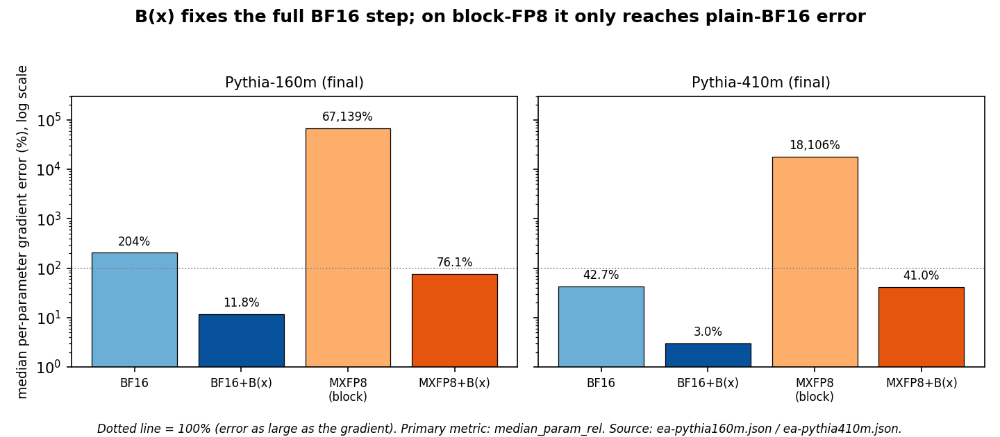

# Where You Round Beats How Many Bits: One Mechanism Behind Four Low-Precision Transformer Failures

**Remove the invariant first: RoPE re-rotation drift, the FP32 position cliff, 4-bit key collapse, and the late-training BF16 attention-gradient blowup are one failure, and one recipe fixes all four**

Jacob Hollenbeck

*Draft, 2 October 2026. This paper merges two measured programs: a streaming-inference study of rotary KV caches and a training-numerics study of attention gradients. All results are from teacher-forced forward or forward-and-backward passes on pinned checkpoints of Qwen2.5 (0.5B, 1.5B), Qwen3 (0.6B, 1.7B) and Pythia (160m, 410m) on one RTX 4080, single seed unless stated. No model was trained end to end; gradient error against a 64-bit reference is a proxy for training quality, not a measurement of it. There is no measured loss or throughput benefit from a training run yet.*

## Abstract

Where you round a value, relative to a transformer's exact symmetries, matters more than how many bits you round to. Each symmetry — a softmax shift, a per-channel scale, an absolute-position shift — hides a large invariant inside a stored value; rounding in native coordinates spends the mantissa on the invariant and erases the content. This one mechanism (swamping) explains four separate failures: streaming RoPE keys freeze when re-rotated in BF16, 4-bit keys collapse, FP32 position angles die at exactly 2^24, and BF16 attention gradients blow up late in training. One recipe fixes all four: remove the invariant in high precision before rounding, carry positional phase as an exact integer, restore the conservation law after rounding. Measured on six checkpoints: subtracting the per-head key mean takes a full BF16 training step's attention-gradient error from 204% to 11.8% (Pythia-160m) and 43% to 3.0% (Pythia-410m), the dominant fix for the late-training blowup; a per-channel gain correction brings 4-bit keys within 0.6–1.7%; and keeping only the 35 of 64 swamped rotary pairs exact removes 97–103% of a re-rotation loss otherwise reaching 49% perplexity. The swamping condition is magnitude-independent, so more bits do not help. No end-to-end training benefit is shown yet.

## 1. Introduction

**Thesis.** The dominant error in low-precision transformer inference and training is set by the coordinate frame in which values are rounded relative to the model's exact symmetries, not by the number of mantissa bits. The single unifying mechanism is *swamping*: each symmetry hides a large invariant inside a stored value, the model depends only on the content, and rounding in native coordinates spends the mantissa on the invariant. The one fix that follows is to **remove the invariant in high precision before rounding.** Two companion operations complete the recipe where the symmetry is a position shift or a conservation law: **carry positional phase as an exact integer**, and **restore the conservation law after rounding.** We are explicit that these are three mechanically distinct steps, not one: invariant removal is the real unifier (it repairs three of the four failures and is one operation across them); the integer-phase step addresses a separate *range* limit (§4); and the conservation projection is a second-order finishing step (§7.2).

A transformer has exact symmetries. Softmax is unchanged if a constant is added to every key's score. RMSNorm is unchanged if its input is rescaled. Rotary position embedding (RoPE) depends only on relative position, so shifting every position by a constant leaves attention unchanged. Each symmetry has a conservation law in the backward pass: the softmax score-gradient rows sum to zero, the vocabulary gradient rows sum to zero, the RMSNorm input gradient is orthogonal to the input. These are identities in real arithmetic.

Rounding breaks them, but only in the wrong coordinates. If a value is the sum of a large invariant part and a small content part — a key whose mean is hundreds of times the between-key spread, a position angle that is a huge multiple of a frequency, a channel scaled by an outlier gain — then rounding the sum stores the invariant part well and the content part badly. The attention or the gradient depends only on the content part. So the error is enormous even though the format's relative precision is fine. This is the floating-point phenomenon of *swamping*: a small addend vanishes against a large running value [11].

The consequence is that **where you round beats how many bits.** The cleanest evidence is that the swamping condition is independent of magnitude: a one-position rotary re-rotation loses exactly the pairs with frequency below 2^-9 no matter how large the key is, so more mantissa bits in the key change nothing (§3). A second, measured instance: a 16-bit log-polar format on Qwen3-0.6B is worse than 16-bit BF16 at the same width — 5.2% vs 2.4% median per-parameter gradient error (2.1×), and 4.9× on the norm-weighted metric that the gain-outlier channels dominate — because its fixed dynamic-range window flushes those channels (§8.2). The FP32 position cliff (§4) is a related but distinct point we keep separate: it is an *integer-range* limit, not a mantissa-precision one — FP32 has 24 bits of integer range, so adding mantissa bits does nothing past 2^24, and only a wider integer ring or FP64 helps. In every case the cure is to choose coordinates in which the invariant is a separate, exactly representable quantity, round only the content, and restore the law afterward.

We test this one claim across four failures that the literature treats separately, two at inference and two in training:

1. **Rotation swamping** (§3). A streaming cache that re-rotates stored keys one position at a time in BF16 freezes the 35 of 64 rotary pairs whose frequency is below 2^-9. Measured cost: +1.4% perplexity on Qwen2.5-1.5B and +27% and +49% on Qwen3-0.6B and 1.7B, over immutable keys on the same consumer and tokens (n = 20,000 tokens). Keeping only those 35 pairs exact during re-rotation removes 97–103% of the loss.
2. **The FP32 position cliff** (§4). A cache that keeps absolute positions and forms rotary angles in FP32 collapses at exactly 2^24 positions on three models; integer phase and FP64 angles stay flat past 2^32. This is the one place the integer representation is load-bearing, and FP64 is the other correct choice.
3. **Affine correction before low-bit keys** (§5). Quantizing keys to 4 bits after RoPE destroys attention (perplexity in the thousands). Removing each channel's invariant affine component before RoPE — an additive bias in Qwen2.5, a per-channel gain in Qwen3 — brings 4-bit keys to within 1.7% (Qwen2.5) and 0.6% (Qwen3) of full precision. This is SmoothQuant-style per-channel migration (§9) applied to the pre-RoPE KV cache, with the family-specific invariant named.
4. **The late-training attention-gradient blowup** (§7–§8). A published failure of BF16 FlashAttention gradients late in training — Chen et al. [12], who trace it to a backward term proportional to the mean key — reproduces in our replay (worst-layer query-gradient error 142% at the final Pythia-160m checkpoint). We confirm the mean key is central and show that removing it *in the forward QK* before rounding (SageAttention's key smoothing [13]) is the dominant lever in our replay, with the backward conservation projection second order; this is the *same* operation as the inference fixes above. It takes a full BF16 training step's gradient error from 204% to 11.8% on Pythia-160m and 43% to 3.0% on Pythia-410m.

We call the shared recipe the **boundary operator B(x)**: at each place a value is converted to low precision, quotient out the invariant in the frame where it is invariant, keep positional phase as an exact integer, and restore the conservation law after rounding. Its attention specialization, which we call **gauge-fixed phase attention (GFPA)**, uses one configuration across six models and is bit-identical at position offset 0 and 8 million (§7). The serving instantiation of "restore the law at the boundary" is to round a value once and keep its exact law as metadata: immutable rotary keys tie full-precision quality (steady perplexity 8.057 versus 8.055 on Qwen2.5-1.5B) while rewriting zero surviving keys (§6).

None of the individual fixes is wholly new; §9 positions each against prior art (StreamingLLM; KVQuant, KIVI, QuaRot/SpinQuant, SmoothQuant and AWQ; SageAttention; the BF16-RoPE training paper; DeepSeek-V3's fine-grained FP8; and the attention-gradient paper we replay). The contribution is the unifying mechanism, the measurement that coordinate choice dominates bit width, the three-model swamping and 2^24 results, the per-channel correction rule for two model families, and the demonstration that the identical operation repairs both an inference drift and a training gradient.

## 2. The common mechanism

### 2.1 Symmetries, gauges, and where rounding lands

By a model's **gauge** we mean a direction of exact invariance — a transformation of the stored values (a shift, a scaling, a rotation) that leaves the model's output unchanged. Choosing a representative along that direction (subtracting the mean, dividing out the scale) is *fixing the gauge*. The point of this paper is that rounding should be done after the gauge is fixed, not before.

Table 1 lists the symmetries that cause trouble, the invariant component each one hides inside a stored value, and the low-precision failure that results when that value is rounded in the model's native (linear) coordinates.

*Table 1. Each symmetry hides an invariant inside a value; rounding the value in linear coordinates spends the mantissa on the invariant and loses the content.*

| Symmetry (exact in real arithmetic) | Where | Invariant hidden in the value | Low-precision failure |
|---|---|---|---|
| add a constant to every key's score | softmax | the shared key mean | the mean eats the mantissa; keys stop differing (§3, §7) |
| rescale one channel of k, inverse-rescale q | QK dot under RoPE | a per-channel gain (Qwen3 QK-norm γ) | a gain outlier sets one scale for a whole block; small channels flush (§5, §8) |
| shift all positions by a constant | RoPE | the absolute position | FP32 absolute angle collapses near 2^24 (§4) |
| score-gradient rows sum to zero | softmax backward | — (a conservation law) | BF16 casts break it; the mean key leaks into the query gradient (§7) |
| logits shift; vocab gradient rows sum to zero | LM head | the unembedding mean | FP8 logit-gradient error; wrong centering hurts (§8) |
| RMSNorm(αx) = RMSNorm(x) | norms | the input scale | recomputing the norm from rounded input spreads a big-channel error (§8) |

The pattern is one sentence: **a stored value is an invariant part plus a content part, the model depends only on the content part, and rounding in linear coordinates spends the precision on the invariant.** The rotary case is the cleanest. Writing a RoPE score for channel pair m,

s = α Σ_m |q_m| |k_m| cos(φ_q − φ_k + (i − j) ω_m),

the dependence on position (i − j) is a sum over frequencies ω_m. The low-frequency pairs rotate so slowly that a one-step rotation is a tiny addend on top of the stored key, and BF16 rounds it away (§3). "Cartesian" models such as Qwen store their numbers in linear coordinates, but the position part of their attention is already spectral; the frame mismatch is built into RoPE, not imposed by us.

*Figure 1. The shared mechanism (swamping), schematic. The invariant is the key mean, projection bias, per-channel gain, or absolute position; the content is the key-to-key differences attention depends on.*

### 2.2 The recipe: B(x)

The fix has the same three parts everywhere:

1. **Remove the invariant in high precision before rounding.** Subtract the key mean; subtract the projection bias; divide out the per-channel gain. These are exact in real arithmetic because the model is invariant to them. Rounding then sees only the content.
2. **Keep positional phase as an exact integer.** Represent position as an integer phase increment on a 2^B ring, so a position shift is an integer subtraction and relative phase is exact for any absolute offset. This removes the 2^24 cliff (§4) and makes the serving path write no surviving keys (§6).
3. **Restore the conservation law after rounding.** After a low-precision cast breaks a zero-sum law, project it back. For the softmax score gradient this is the rank-one correction that the attention-gradient paper calls GProj [12]; it is exact in post-cast arithmetic and costs one reduction and one axpy per row.

In log coordinates — representing a number as a log-magnitude and an integer phase — every symmetry in Table 1 is a *straight line with integer coefficients*, because scalings and rotations become additions. The conservation laws are then fixed integer constraints, which integer arithmetic preserves exactly. We use a 64-bit floating-point reference as an exact stand-in for integer accumulation in the training experiments (§8); the integer path itself is measured bit-identical on real layers separately. This log-coordinate view is why the same operator fixes a per-channel gain, a layer rescaling, a softmax shift and a RoPE shift with one mechanism: in those coordinates they are the same kind of object. We do not require the model to use that format; every repair below is also measured on ordinary BF16.

### 2.3 Where you round beats how many bits

**Across these failures, choosing the coordinate frame changes the error by one to three orders of magnitude; changing the mantissa width does not.** Three measurements make this concrete, and because they use different error statistics we name them once and use them consistently. Throughout we report: *worst-layer* relative error (the maximum over layers of the per-tensor Frobenius error; our attention-gradient metric, §7 and Table 5); *median per-parameter* relative error (our primary full-training-step metric, Table 6); and *norm-weighted global* relative error (one ratio of total gradient-difference norm to total gradient norm). Where a result is sensitive to the choice, we give both.

First, and cleanest: **the swamping condition is independent of magnitude.** A one-position re-rotation changes a pair by about ω_m times its partner; BF16 discards it when ω_m < 2^-9, regardless of how large the key is (§3). More mantissa bits in the key do not change which pairs are lost — this is the purest "frame, not bits" result in the paper.

Second, **more format bits can be worse.** A 16-bit log-polar format on Qwen3-0.6B is worse than 16-bit BF16: 5.2% vs 2.4% median per-parameter gradient error (2.1×), rising to 4.9× on the norm-weighted metric that the gain-outlier channels dominate, because its fixed dynamic-range window flushes those channels (§8.2, n = 2 × 48 tokens). The extra bits are spent in the wrong place.

Third, kept separate because it is a range, not a mantissa, story: **the integer field's range, not its precision, sets the position cliff.** A 32-bit integer phase is exact for every absolute position while FP32 angles collapse at 2^24 (§4); adding mantissa bits to the FP32 angle does nothing, only a wider integer field or FP64 helps. We flag this as the one leg that is honestly a bit-count story — of the integer field, not the mantissa.

The FP8 comparison (§8.2) is argued on a realistic baseline, not a strawman: against block-scaled FP8 with FP32 accumulation — the DeepSeek-V3 recipe [18], approximated here by MXFP8 — invariant removal helps but does not by itself beat BF16, and we say so plainly there.

## 3. Inference I: rotation swamping

### 3.1 The setting

Streaming inference with attention sinks keeps a bounded recent window of keys and values and gives surviving tokens new rotary positions as the window slides [2]. One common implementation stores keys *after* rotation and rotates the survivors again on every one-position shift, writing them back in the cache dtype. The alternative, present in the original StreamingLLM work, keeps pristine pre-rotary keys and rotates them at read. We measure the first design and explain why it fails.

All results in this section use a manual Qwen decoder that reuses the loaded model's learned weights and reimplements only rotary application, attention, and cache management. (Full inference provenance, including the superseded first-draft runs, is in the companion inference paper `../phaselock-kv-shifts/paper.md`, cited below as "companion §x".) On a 96-token no-eviction check it agrees with stock Hugging Face inference to 97.9% top-1 and KL 0.0039; all arms share this path, so within-harness comparisons isolate the cache choice. The quality stream is 20,000 held-out WikiText-2 test tokens, four sinks, a 1,024-token window, one-token evictions (so a key is re-rotated up to ~1,024 times before eviction), scored by teacher-forced next-token negative log likelihood (NLL).

### 3.2 The mechanism

A one-position re-rotation changes the components of channel pair m by about ω_m times the partner component. BF16 keeps 8 significant bits, so when that change is below half a unit in the last place, about 2^-9 of the value, rounding returns the old number and the rotation is lost. To first order the condition ω_m < 2^-9 does not depend on the key's magnitude. For Qwen's rotary base (θ = 10^6, head dimension 128), **35 of 64 pairs** have ω_m < 2^-9; for FP16 (threshold 2^-11) the count is 28 [`rotation-swamping.json`].

A CPU probe applied n one-position re-rotations with an FP32 twiddle to 4,096 random keys, rounding to the storage dtype after each step. After 256 shifts, BF16 storage achieved on average about 10% of the intended rotation in the 35 predicted pairs and about 98% in the rest. Mean relative key error grew almost linearly with the number of shifts: 0.0020, 0.031, 0.10 and 0.43 after 1, 64, 256 and 1,024 shifts; a random-walk model of independent rounding predicts 0.036 at 1,024, and the measured 0.43 is far larger because the low-frequency error is systematic, not random. FP16 storage reached 0.054 at 1,024 shifts and FP32 storage stayed exact (2 × 10^-5) [`rotation-swamping.json`].

Rounding the rotation coefficient itself to BF16 is worse than rounding the key. A BF16 twiddle has magnitude 0.9980–1.0019 instead of exactly 1, so repeated application shrinks or grows the key norm: the probe reached relative error 1.17 with norm ratio 1.61 after 1,024 shifts [`rotation-swamping.json`]. This is a distinct, larger failure (§3.4).

*Figure 2. The BF16 50% crossing falls inside the predicted band. Source: `../phaselock-kv-shifts/evidence/rotation-swamping.json`.*

### 3.3 Model-level cost and the exact-pair fix

The mechanism predicts a model-level cost that grows with how long a key survives. We measured it on the 20,000-token held-out stream, re-rotating survivors one position per eviction with FP32 arithmetic and BF16 storage, against immutable pristine keys under the identical eviction schedule [`review-fixes.json`]:

*Table 2. One-token re-rotation versus immutable keys, 20,000 held-out tokens, four sinks, 1,024-token window. Excess NLL is paired over 18 post-fill blocks; brackets are descriptive 95% block bootstraps (text blocks are dependent).*

| Model | Re-rotate PPL | Immutable PPL | PPL ratio | Excess NLL [95% block] |
|---|---:|---:|---:|---|
| Qwen2.5-1.5B | 8.170 | 8.055 | +1.4% | +0.0142 [+0.0088, +0.0191] |
| Qwen3-0.6B | 22.090 | 17.363 | +27% | +0.241 [+0.206, +0.268] |
| Qwen3-1.7B | 20.692 | 13.868 | +49% | +0.400 [+0.330, +0.492] |

Keeping only the 35 swamped pairs exact during re-rotation, and rounding the rest to BF16, removes essentially the whole loss: **103% on Qwen2.5-1.5B, 101% on Qwen3-0.6B, and 97% on Qwen3-1.7B** of the paired excess NLL [`review-fixes.json`]. Keeping the complementary 29 unswamped pairs exact removes only 41%, 20% and 27%. The loss is in the slow pairs, exactly as predicted.

### 3.4 Why Qwen3 is worse, and how block shifts remove the cost

Qwen3 loses 20–35× more than Qwen2.5. The reason is that two mechanisms meet in the same channels. Qwen3's per-head QK-norm applies a learned channel gain γ before RoPE, and that gain concentrates key energy in the slow pairs: the 35 swamped pairs (55% of all pairs) carry **77% of the squared gain on Qwen3-0.6B and 75% on Qwen3-1.7B**, averaged over layers, and 74% and 70% of the six highest-gain pairs per layer fall in the swamped set [`review-fixes.json`]. The gain puts the content in exactly the pairs BF16 cannot rotate. Keeping the six highest-gain pairs per layer exact — about a tenth of the channels — already removes 88% (0.6B) and 76% (1.7B) of the loss [`review-fixes.json`]. This is a causal test of the mechanism, not a correlation.

The same arithmetic says the cost is specific to one-token shifting. Shifting by Δ positions per eviction swamps only pairs with Δ ω_m < 2^-9 and performs Δ times fewer roundings, so a key loses at most about W·2^-9/Δ radians before eviction. Measured on the same stream with FP32 re-rotation arithmetic: from Δ = 16 upward the excess NLL's 95% block interval includes zero on both Qwen2.5-1.5B and Qwen3-1.7B, so the 49% Qwen3 loss vanishes [`review-fixes.json`]. Engines that shift in blocks of 16 or more positions, as llama.cpp's context shift does, avoid this cost; one-token shifting is the dangerous regime. (The cost of evicting large blocks is reduced context, not numerics: Δ = 512 raises the pristine reference's own NLL by ~0.05 by shrinking the effective window.)

The catastrophic multi-hundred-perplexity failures reported for naive BF16 streaming come from the BF16-rounded twiddle of §3.2, not from key storage: a fixed one-step coefficient rounded to BF16 drives Qwen2.5-1.5B to 254, Qwen3-0.6B to 406 and Qwen3-1.7B to 2,501 perplexity [companion §5.3, §6.9]. Computing the rotation in FP32 removes that, leaving the smaller storage loss of Table 2. Both are the same root cause seen twice: a rotation applied in a frame where BF16 cannot represent the step.

## 4. Inference II: the FP32 position cliff and integer phase

An immutable cache stores keys at their absolute positions, and those positions grow without bound. The standard rotary module multiplies the inverse frequency by the position in FP32, and FP32 represents every integer only up to 2^24. We started 4,096-token held-out streams at large absolute offsets; relative geometry is unchanged, so any change in quality is purely numerical.

*Table 3. Steady perplexity versus absolute position offset, Qwen2.5-1.5B; the local-position reference is 9.472. The 2^24 threshold was predicted before the fine sweep [companion §6.3].*

| Offset | FP32 angle | FP64 angle | Integer phase (int32) |
|---:|---:|---:|---:|
| 0 – 1.6×10⁷ | 9.46–9.50 | 9.47 | 9.45–9.48 |
| 2^24 = 16,777,216 | **22.6** | — | 9.46 |
| 2^25 | 85.0 | — | 9.45 |
| 10⁹ | 1,467.6 | 9.48 | 9.48 |
| 5×10⁹ (> 2^32) | 6,304.9 | 9.46 | 9.48 |

The collapse begins exactly where FP32 stops representing every integer position and deepens by roughly 0.7 NLL per additional bit of position spacing. The integer law is exact for every offset, because (p mod 2^32)·F_m mod 2^32 is integer arithmetic and the decoded angle always lies in [0, 2π). The threshold replicates on Qwen3-0.6B (FP32 20.4 → 28.8 at 2^24, → 21,782 at 5×10⁹; integer flat at ~20.4) and Qwen3-1.7B (15.7 → 20.3 at 2^24, → 798,643 at 5×10⁹; integer flat at ~15.7) [`bithacks-qwen3.json`].

*Figure 3. Source: `../phaselock-kv-shifts/evidence/bithacks-qwen3.json` and companion §6.3.*

This is the one result where the integer representation is strictly necessary and more value bits do not substitute: FP32 has 24 bits of integer range no matter how the angle is formed, and only a wider integer ring or FP64 removes the cliff. FP64 is the other correct choice, at a throughput cost on consumer GPUs. The same integer phase can be computed inside an attention kernel with a wrapping multiply and a bit-hack that turns the 32-bit phase into an angle without an integer-to-float conversion, so the exactness does not require a stored table (§6).

The deeper point is that **the error below 2^24 is not zero, it is merely tolerated.** A direct probe measured 0.04 rad of relative-phase error at 10^6 and 0.17 rad at 10^7 under FP32 [companion §6.3]; the model survives it. The cliff is where tolerated error becomes catastrophic error, and it is set entirely by the integer range of the frame.

## 5. Inference III: affine correction before low-bit keys

Quantizing keys to 4 bits is where the frame matters most, and the two model families differ in exactly the way the mechanism predicts.

### 5.1 Qwen2.5: an additive bias

Qwen2.5's key projection carries a bias: before RoPE, k = W_k h + b_k, and b_k is a per-channel constant. Because softmax is invariant to a constant shift of all keys, b_k can be removed exactly before quantizing and restored after. After RoPE the bias becomes R(p)b_k, position-dependent and mixed within each pair, so it can no longer be removed without a per-row rotation. The bias is large: in layer 0 the largest key-bias entry is 316 while the bias-free residual has standard deviation 1.08, so the bias is 74% of the block maximum there. Rotated and quantized to 4 bits after RoPE, the step size reaches about 45 — forty times the content signal — and the layer loses its key content.

Measured on 20,000 held-out tokens, Qwen2.5-1.5B [`free-wins-quality.json`]:

*Table 4. Quantize-once 4-bit keys, Qwen2.5-1.5B. Values unquantized unless stated.*

| 4-bit key path | Steady PPL |
|---|---:|
| Q4 after RoPE | 6,135 |
| Q4 before RoPE (no correction) | 268.4 |
| Q4 before RoPE, bias removed | **8.194** (+1.7% over 8.055) |
| Q4 before RoPE, per-channel calibrated | 8.104 (+0.6%) |

Plain pre-RoPE quantization, the design point of KVQuant [3], helps (6,135 → 268) but is not enough; removing the bias is the decisive step (268 → 8.19).

### 5.2 Qwen3: a per-channel gain outlier

Qwen3 has no key bias, but its per-head QK-norm applies a learned per-channel gain γ, and a gain scales both the mean and the spread of a channel. Qwen3-0.6B has one or a few γ channels per layer at 2.4–42× the median; layer 0 has a gain of 96.5 against a median of 2.28. In that channel's quantization block the step size buries every other channel: 45% of channels end with signal-to-noise below 1, and 8 of 1,024 channels carry 82% of the score error [companion §6.9]. This is the same failure as the Qwen2.5 bias, in a multiplicative frame: the invariant is now a scale, not an offset.

The cure is to divide out the gain per channel (equivalently, normalize each channel's mean and spread) before quantizing. Measured on 20,000 held-out tokens [`bithacks-qwen3.json`]:

| 4-bit key path | Qwen3-0.6B PPL | Qwen3-1.7B PPL |
|---|---:|---:|
| Q4 after RoPE | 411.9 | 115.1 |
| Q4 before RoPE (no correction) | 126.7 | 53.3 |
| Q4 before RoPE, per-channel calibrated | **17.465** (+0.6% over 17.363) | **13.943** (+0.5% over 13.868) |

A per-channel calibrated 4-bit key cache is within 0.6% of full precision on Qwen3 (+0.6% on 0.6B, +0.5% on 1.7B); adding calibrated 4-bit *values* stays within 0.4% (the K+V-calibrated arm is +0.36% on 0.6B and −0.19% on 1.7B, `ringpre_q4c_v4b`). Across the 28 layers of Qwen3-0.6B, each layer's γ max/median ratio predicts its plain-Q4 attention KL (Spearman ρ = +0.83, p = 4×10^-8), and calibration erases the dependence (ρ = −0.33, p = 0.09) [companion §6.9]. The rule generalizes §5.1: **before quantizing pre-RoPE keys, undo each channel's affine distortion — the additive bias in Qwen2.5, the multiplicative gain in Qwen3.** Dividing out a per-channel gain to equalize dynamic range is exactly SmoothQuant's migration [19] and AWQ's salient-channel scaling [20], here applied to the pre-RoPE KV cache rather than to weights/activations, with the family-specific invariant identified (Qwen2.5 bias, Qwen3 QK-norm γ) and no learned rotation; it sits beside per-channel key quantization (KIVI [6]) and rotation-based outlier spreading (QuaRot, SpinQuant [9, 10]) and keeps a per-token write path.

## 6. Serving: round once, keep the law exact at the boundary

"Restore the exact law at the boundary" has a serving instantiation: round a value once and keep its exact law as cheap metadata, instead of re-deriving it in low precision on every step. For a rotary cache this means storing each key once at its absolute position and rotating it only when read, with the position carried as an integer. RoPE's relative-position identity makes this exact: ⟨R(a_q − d)q, R(a_i − d)k_i⟩ = ⟨R(a_q)q, R(a_i)k_i⟩, so a uniform window shift is a change of one integer origin, not a rewrite of the keys.

Measured on the 20,000-token held-out stream with FP32-accumulating attention, Qwen2.5-1.5B [`free-wins-quality.json`]:

- **Immutable keys tie full precision.** A single-buffer immutable ring scores steady perplexity 8.057 against pristine rotate-at-read's 8.055 (excess NLL +0.0003 [−0.0006, +0.0009]), and an FP64-phase ring scores 8.054. The integer phase is not a quality improvement over FP64; it is a representational and throughput choice. The same ring beats the FP32 re-rotation control by −0.0140 NLL [−0.0191, −0.0086] on the identical consumer.
- **Zero surviving-key rewrites.** Over 100,000 streamed tokens, a four-sink 1,024-token ring performed 98,972 evictions and rewrote zero surviving-key bytes, versus a shifting design that dirties the whole resident cache on every token [companion §6.4].
- **Bit-exact restart.** The ring's state saved at 32,768 tokens, reloaded into a fresh process and CUDA context, reproduced the next full logit tensor bit for bit [companion §6.4]. Immutable storage makes the cache a durable, exactly reopenable object and makes copy-on-write sharing across beams or forks proportional to tokens decoded since the fork.

Speed follows the same principle. A fused pre-RoPE attention kernel keeps keys unrotated and rotates them in registers from an integer position, so the shift is a four-integer update. At batch 1 on an idle RTX 4080 it decodes 3.0× faster than FP32 re-rotation at a 32,768-token window (7.44 vs 22.46 ms/token) and stays near the weight-read floor as the window grows [companion §6.6]. Computing the integer phase inside the kernel with a bit-hack (a wrapping multiply, a shift-and-OR to form the angle in turns, and the hardware sine/cosine approximation) is 1.30× faster than a stored phase table at 128k and avoids the table entirely, at 12.8× lower maximum-absolute rotation error against FP64 (0.00090 vs 0.01151 at 128k) [`bithacks-speed.json`; companion §6.8]. A page-framed 4-bit key cache decodes 8.6% faster than the best BF16 fused kernel at 32k [companion §6.8]. These are batch-1 Python-decoder measurements, not a production engine, and they bound the operation, not end-to-end serving throughput.

*Figure 4. Source: `../phaselock-kv-shifts/evidence/free-wins-speed.json` and `bithacks-speed.json`.*

## 7. Training I: the same recipe on attention gradients

### 7.1 Reproducing the published failure

A recent paper reports that BF16 FlashAttention gradients blow up late in training and attributes it to BF16 rounding of the softmax score gradient, which breaks its zero row sum and leaks the mean key into the query gradient; its fix, GProj, projects the rounded score gradient back onto zero row sums [12]. We replayed real Pythia checkpoints across training (steps 16k, 64k, 143k) through the real BF16 attention kernels, capturing q, k, v and the output gradient per layer and comparing against an FP64 reference [`ladder-pythia.json`].

The failure reproduces. Worst-layer query-gradient (dQ) error from the real BF16 kernel grows across training: on Pythia-160m, 1.0% at step 0, 4.0% at 16k, 50.5% at 64k, and **142.2% at the final checkpoint**; on Pythia-410m it reaches 111.2% [`ladder-pythia.json`, n = 2 × 1,024 tokens]. The key-gradient (dK) error is larger still (218% worst-layer at the final 160m checkpoint).

### 7.2 The cause is a large key mean, and the recipe fixes it

Chen et al. [12] already identify the mean key as the culprit: their backward term is proportional to it, left behind when BF16 rounding of the score gradient breaks its zero row sum. Our replay agrees on the object and differs on *where to intervene*. Late in training the keys acquire a large shared mean — in the worst Pythia-160m layer roughly 800× the between-key spread, and on Qwen2.5-1.5B layer 0 roughly 2,400× [replay notes; the ratio is layer-dependent and is not in the committed JSON, so we down-weight it and lead with the gradient error below]. BF16 stores the mean well and the small key-to-key differences badly — the swamping of §2.1, now in the key mean rather than the rotary phase. Because softmax ignores a constant added to every key, subtracting the per-head key mean before the dot product is exact, and removing it at the source (SageAttention's key smoothing [13]) removes most of the error: centering cuts the worst-layer dQ error from 142.2% to 20.8% on Pythia-160m and from 111.2% to 9.5% on Pythia-410m in the real kernel [`ladder-pythia.json`]. On Qwen2.5-1.5B's worst layer, centering takes the worst-layer dQ error from 29.6% to 0.97% (30×) [`final-qwen25-1.5b-t512.json`, `flash`/`flash_center` `dq_fro.max`].

In this replay the published backward row-sum projection (GProj) is the smaller lever: casting the score gradient alone to BF16 contributes ≤2.7% almost everywhere (one early Qwen2.5-1.5B layer excepted at 8.3%), so the error is dominated by forward key rounding, not the row-sum violation [replay notes]. Our net delta over [12] is therefore narrow and we state it plainly: the same mean-key object is better removed at its forward source (the inference fix) than restored in the backward gradient, and the two are complementary parts of one recipe that B(x) applies together.

### 7.3 One configuration across six models

GFPA (gauge-fixed phase attention) packages the attention recipe into one configuration — fixing the gauge (§2.1) of the stored keys in one operator: keys stored pre-RoPE and rotated into a per-page frame with integer relative phase, a per-page full-precision base (the page mean) plus a low-precision residual with per-channel scales, and the score-gradient zero-sum projection reduced to one scalar per page per row. Measured worst-layer dQ error against FP64 (BF16 operands), one configuration for every model [`gfpa-small.json`, `gfpa-qwen25-1.5b.json`, `gfpa-qwen3-*.json`]:

*Table 5. Worst-layer query-gradient error, manual recompute from captured tensors (distinct from the FA2-kernel numbers of §7.1). "Best special case" is per-head key-mean centering. "Mean, offset 8M" is that same fix at an 8-million position offset.*

| Method | Pythia-160m | Pythia-410m | Qwen2.5-0.5B | Qwen2.5-1.5B | Qwen3-0.6B | Qwen3-1.7B |
|---|---:|---:|---:|---:|---:|---:|
| plain BF16 | 131.7% | 92.9% | 12.2% | 27.9% | 2.9% | 1.9% |
| best special case (mean centering) | 15.1% | 8.9% | 2.1% | 0.95% | 1.08% | 1.10% |
| mean centering, offset 8M | 37.1% | 13.0% | 20.3% | 11.4% | 10.5% | 11.1% |
| **GFPA (identical at offset 0 and 8M)** | **13.5%** | **7.5%** | **1.44%** | **1.02%** | **0.96%** | **1.08%** |

Two properties matter. First, with one configuration GFPA beats the best per-model special case on five of six models and ties it on the sixth (Qwen2.5-1.5B: 1.02% vs mean-centering's 0.95%, within noise). Second, GFPA is **bit-identical at position offset 0 and 8 million**, whereas plain mean centering degrades at the offset (Pythia-160m 15.1% → 37.1%) because it still forms absolute FP32 angles — the 2^24 cliff of §4 reappearing in the training gradient. Both halves of the base term are needed: with no base, GFPA falls back to plain (131.8%); with no conservation projection, Qwen2.5-1.5B's dQ error is 23.9% instead of 1.02% [`gfpa-*.json`]. The inference fix and the training fix are the same operator.

## 8. Training II: one rounding per boundary

### 8.1 Where the error lives, on a full training step

We built a full-model training-step simulator: for a real checkpoint, run one forward and backward pass with every matmul operand in both directions rounded to the format under test (all linear layers, the attention dot products, the LM head, and every gradient matmul), while every product and sum is accumulated in FP64, which stands in for an exact integer accumulator (its own error ~10^-13 is ten orders below 8-bit rounding). The only rounding sites are therefore operand conversions. Gradient error is reported against an unrounded FP64 reference [`ea-pythia160m.json`, `ea-pythia410m.json`, `ea2-loc-*.json`].

Two localizations drive everything else (reported on the norm-weighted global metric here, matching the localization run). **The error is in the forward pass, not the backward arithmetic.** Rounding only the backward matmuls costs 0.5–0.9% gradient error in BF16 on every model and checkpoint, including the one where the full step is at 204%; rounding only the forward pass reproduces nearly the whole error [`ea2-loc-*.json`]. The forward rounding moves the point at which the gradient is evaluated, and sharp attention layers amplify that. This forward dominance is consistent with Chen et al. [12], who also locate a forward-pass softmax-FMA contribution and find that FP32-recomputing two layers' backward suffices, and with "Is Flash Attention Stable?" [24], which measures an order-of-magnitude larger forward numeric deviation for FlashAttention at BF16; our addition is that invariant removal, not more backward precision, is what the forward pass needs. **Where the forward error enters is model-dependent:** on late Pythia it is attention (the sharp layers, where scores reach tens of thousands), on Qwen2.5 it is the linear layers [`ea2-loc-*.json`].

*Figure 5. Global gradient error, all arms with B(x). Source: `../../../saturn/experiments/2026-09-30-spf-native-boundary/results/ea2-loc-*.json`.*

### 8.2 B(x) fixes the full BF16 step; on a fair FP8 baseline it recovers but does not beat BF16

The headline is the full-step gradient error with and without B(x), on our primary metric (median per-parameter error against FP64) [`ea-pythia160m.json`, `ea-pythia410m.json`]. We lead with the realistic FP8 baseline — block-scaled FP8 with FP32 accumulation, the DeepSeek-V3 recipe [18], approximated by MXFP8 — and give naive per-tensor FP8 at the bottom only to show what the block scales buy.

*Table 6. Full training-step gradient error (median per-parameter), every matmul operand rounded. n = 2 × 256 tokens (Pythia).*

| Format | 160m 16k | 160m 64k | 160m 143k | 410m 143k |
|---|---:|---:|---:|---:|
| BF16 | 2.0% | 31.8% | 203.8% | 42.7% |
| **BF16 + B(x)** | **1.1%** | **1.4%** | **11.8%** | **3.0%** |
| MXFP8, block-scaled (fair FP8 baseline) | 36.3% | 21,200% | 67,139% | 18,106% |
| MXFP8 + B(x) | 16.6% | 20.7% | 76.1% | 41.0% |
| FP8, naive per-tensor E4M3/E5M2 | 56.1% | 65,262% | 330,746% | 1,980,961% |

Three honest readings. **B(x) removes the late-training BF16 blowup:** two exact operations (key-mean removal and the softmax-gradient zero-sum restoration) take BF16 from 204% to 11.8% on the hardest Pythia-160m checkpoint and from 43% to 3.0% on Pythia-410m — the clearest result in the paper. **On a fair FP8 baseline, B(x) recovers but does not win:** block-scaled MXFP8 still blows up late (18,000–67,000%), and B(x) brings it back only to 41–76% — comparable to *plain* BF16 (41.0% vs 42.7% on 410m) and far from BF16+B(x) (3.0%). So we do not claim "B(x) fixes FP8 training"; we claim it rescues block-FP8 from catastrophic to roughly BF16-without-the-fix, and that closing the rest needs the training run owed in §11, not more argument. The naive per-tensor row (reaching ~2,000,000%) is a strawman no FP8 stack uses and is shown only for contrast. **B(x) works as designed:** the rounded softmax-gradient row sums drop from ~5×10^-4 to ~3×10^-17.

More format bits in the wrong frame do not help: a 16-bit log-polar format on Qwen3-0.6B is worse than 16-bit BF16, 5.2% vs 2.4% on this median metric (2.1×), rising to 4.9× on the norm-weighted metric that the gain-outlier channels dominate, because its fixed ~9-octave window flushes those channels [`ea2-loc-qwen3.json`]. The extra representable precision is spent in the wrong place. The same format is competitive where the model has no such outliers (Pythia-160m at step 16k).

*Figure 6. Median per-parameter gradient error, Pythia-160m (final) and Pythia-410m, log scale. Built from `ea-pythia160m.json` / `ea-pythia410m.json` by `figures/make_figures.py`.*

*Figure 7. Source: `../../../saturn/experiments/2026-09-30-spf-native-boundary/results/ea3-native-*.json`.*

### 8.3 Determinism, briefly

Integer accumulation in log coordinates is associative, so a sum is bit-identical regardless of batch size, sharding or reduction order: on twelve real linear layers across three models, 8-bit log-products in a 64-bit fixed-point register were bit-identical across every reduction split, while FP32 and BF16 matmuls never were [two-domain note, Test 3]. The conservation laws B(x) restores are then exact integer constraints. We claim no speed from this — a log-domain accumulator measured ~93× slower than BF16 tensor cores (1.0 vs 92.6 TFLOP/s) [two-domain note, speed table] — so the practical form keeps the log representation only for storage and the exact components and decodes into tensor cores for the dense matmuls. Deterministic reductions are also achievable with batch-invariant float kernels; the integer route is one option, not a requirement. B(x) itself is format-agnostic and every repair above is measured on plain BF16.

### 8.4 From one-step gradient error to a loss curve (in progress)

Every number above is a *single* forward-and-backward pass. A single-step median gradient error of 204% is not 204% loss degradation: real BF16 training carries FP32 master weights and optimizer state that absorb per-step error, and the failure in [12] took ~25B tokens to surface. One-step gradient parity is necessary, not sufficient. The decisive missing experiment is a training continuation, which is running as of this draft:

<!-- TODO training-continuation -->
*Planned/running arms (Pythia-160m continuation from a late checkpoint, held-out loss): (i) a realistic BF16 recipe with FP32 master weights and standard scaling; (ii) the same + B(x) (key-mean removal + GProj); (iii) an FP32-attention reference. We will report held-out loss versus steps, with ≥2–3 seeds, and whether any BF16-vs-BF16+B(x) gap is reproducible and grows. A null (indistinguishable curves) is the stated kill condition and would reframe the training half as diagnostic. Results will replace this block.*

## 9. Related work

**Rotary position embedding and streaming caches.** RoFormer introduced RoPE's relative-position structure [1]. StreamingLLM retained attention sinks and a sliding window and explicitly cached keys *before* rotation, rotating them at decode [2]; our immutable-key serving path (§6) is that design with an integer position law and measured zero surviving-key rewrites. Wang et al. [7] showed that BF16 breaks RoPE's relative-position property in long-context *training* and traced it to the **first token** dominating the attention, fixing it by anchoring that token's position (AnchorAttention). Our mechanism is different and complementary: in §3 the damage is in the **low-frequency rotary pairs** (the swamping threshold ω<2^-9), and in §4 it is the **absolute-position range** (2^24). Where Wang blames which token, we locate which channels and which range.

**KV-cache and weight quantization.** KVQuant advocated pre-RoPE key quantization for low-bit caches [3], and KIVI per-channel key quantization [6]; QuaRot and SpinQuant remove KV outliers with learned or Hadamard rotations [9, 10]. SmoothQuant migrates activation outliers into the weights with a per-channel scale [19], and AWQ protects salient channels by per-channel scaling tied to activation statistics [20]. Our §5 is the KV-cache instance of that per-channel gain migration, with the family-specific invariant named (Qwen2.5's additive projection bias, Qwen3's multiplicative QK-norm gain) and applied pre-RoPE, lighter than a learned rotation and keeping a per-token write path. Quest [4], H2O [5] and InfLLM [8] select or retrieve KV blocks beyond a local window; they are orthogonal to how keys are stored and rounded.

**FlashAttention numerics and the gradient paper.** FlashAttention and FlashAttention-2/3 [21, 22, 23] are the kernels we replay. "Is Flash Attention Stable?" [24] measured an order-of-magnitude larger forward numeric deviation for FlashAttention at BF16 (2–5× smaller than low-precision training's deviation), consistent with our §8.1 finding that the error is in the forward pass. SageAttention smooths keys by subtracting their mean before INT8 quantization of the QK product [13]; our inference and training key-mean removal (§5, §7) is the same operation, extended to the training gradient. SageAttention3 introduces SageBwd, the first trainable 8-bit attention, and reports lossless fine-tuning but *slower pretraining convergence* [14] — the open problem the boundary operator targets. Chen et al. [12] attribute the late-training blowup to a backward term proportional to the mean key (the broken softmax score-gradient zero sum) and fix it with GProj, and also note a forward-pass softmax-FMA contribution. Our delta is narrow and we state it as such: the same mean-key object is better removed at its forward source (the inference fix) than restored in the backward gradient, and the recipe unifies the inference and training repairs; we do not claim a new failure, only a better-placed fix and the unification.

**Low-precision training and numerics.** DeepSeek-V3 trains a 671B model in fine-grained FP8 — tile-wise (1×128) activation and block-wise (128×128) weight scales with periodic FP32-register accumulation [18]; this is the realistic FP8 baseline §8.2 argues against, and our localization (the error is forward, not in the accumulation) is consistent with its reliance on scale granularity rather than accumulator width. FP8-LM [25] keeps most tensors in FP8 with per-tensor scaling, and the OCP Microscaling (MX) block formats and FP8-Formats [17] standardize block-scaled FP8/E4M3-E5M2. Unit Scaling [26] and μP / Tensor Programs V [27] choose initialization scales and coordinates so that low precision and hyperparameters transfer — the same "pick the coordinates" idea at initialization that we apply at every rounding site. Compensated/Kahan summation [11] and stochastic rounding (Gupta et al., ICML 2015) address accumulation error; our §8.1 shows backward accumulation is nearly free once B(x) is in place, so the leverage is forward operand placement, not the sum. LNS-Madam [15] trains at 8 bits with multiplicative updates, and nGPT [16] places representations on the unit hypersphere; both fit the log-coordinate view in §2.2, where scalings are integer additions and unit norm is log-magnitude zero.

## 10. Limitations

We state these plainly.

- **No training run shows a loss or throughput benefit yet.** Every training result is one forward-and-backward pass per checkpoint (gradient error and cosine against an FP64 reference), single seed, a few hundred tokens. Gradient-level parity is a proxy for training quality, not a measurement of convergence. The most important owed experiment is a training continuation that shows a loss difference (§11).
- **Model scale is ≤1.7B,** on two inference families (Qwen2.5, Qwen3) and one training family (Pythia, plus Qwen single-step). The per-layer mechanisms should scale, but this is not shown on current frontier models.
- **FP64 stands in for exact integer accumulation** in §8. The integer path is measured bit-identical on real layers separately, and a GPU kernel matched FP64 to 7×10^-9, but it was not run inside the full-model simulation. Elementwise operations are idealized in FP64 for every arm, so the comparison isolates matmul-operand format and B(x).
- **The serving numbers are batch-1 measurements in a Python decoder,** not a production inference engine; they bound operations (kernel time, kernel count, bytes written), not end-to-end throughput. The quantization paths omit a Hadamard transform used in some cache configurations and quantize keys more aggressively than values.
- **Behavioral evidence is narrow.** Downstream quality is teacher-forced perplexity on one held-out WikiText stream and a synthetic one-word recall assay; neither tests free-form generation or durable memory.
- **The key-mean ratio is layer-dependent** and quoted approximately (it is not in the committed JSON); the robustly verified training number is the worst-layer gradient error (142% real kernel), not the ratio.
- **The training claim is one-step gradient error, not a loss curve.** As §8.4 states, a single-step gradient error is necessary but not sufficient for a convergence claim; the training continuation that would settle it is running, and until it lands the training half should be read as diagnostic. On a realistic block-scaled FP8 baseline, invariant removal recovers block-FP8 to roughly plain-BF16 error, not to BF16+B(x) error (§8.2).
- **Citations verified:** all arXiv identifiers in the reference list, including [12] (Chen et al., "Broken Symmetry in BF16 Attention," 2609.34272) and [17] (FP8-Formats, 2209.05433), were confirmed live during revision; the earlier "reached via a mirror" hedge is withdrawn.

## 11. What a lab should do

The practical takeaways for a training or inference numerics team:

1. **Before any low-precision cast of keys, remove the invariant.** Subtract the per-head key mean (exact; the same operation SageAttention calls smoothing) for every model, the projection bias for Qwen2.5-style models, and divide out the per-channel QK-norm gain for Qwen3-style models. This is the single largest lever at both inference and training and costs one vector per head.
2. **Carry position as an integer, not an FP32 angle.** Any cache or training setup that forms absolute rotary angles in FP32 has a hard cliff at 2^24 positions; an integer phase ring (or FP64) removes it, and the integer phase can be formed inside the attention kernel with no table.
3. **Never re-rotate stored keys one position at a time in BF16.** Keep keys immutable and rotate at read, or shift in blocks of ≥16 positions. One-token BF16 re-rotation freezes the 35 low-frequency rotary pairs and costs up to tens of percent perplexity on QK-norm models.
4. **Restore the conservation law after the cast, not instead of removing the invariant.** The softmax-gradient zero-sum projection (GProj) is necessary but second order; it is the cheap finishing step after invariant removal, not a replacement for it.
5. **Spend bits where the Jacobian is large, and spend coordinate choice everywhere.** More format bits in the wrong frame can be worse (16-bit log-polar underperforms BF16 on Qwen3). Put extra precision on the query/key dot product in sharp attention layers; fix the frame everywhere else.
6. **If you want batch-invariant, deterministic training,** accumulate in integers in log coordinates where the conservation laws are integer constraints; this is free determinism, independent of bit width, though it needs non-tensor-core hardware to be fast.

## Appendix A. Reproducibility and evidence

All jobs ran on one RTX 4080 under the lab's scheduler, with content-addressed receipts binding each executed source, input and raw output by SHA-256. Evidence extracts referenced as `name.json` live in `../phaselock-kv-shifts/evidence/` (inference) or in the named experiment result directories (training). The table maps each claim to its evidence file, representative job, and status.

*Table A1. Claim → evidence → status. Status: measured (run output verified by the author against the raw file), derived (arithmetic from measured values), modeled (from op counts or spec sheets).*

| Claim | Evidence file / dir | Representative job | Status |
|---|---|---|---|
| 35/64 pairs swamped (ω<2^-9); FP16 28 | `evidence/rotation-swamping.json` | CPU probe | measured |
| Re-rotation key error 0.0020/0.031/0.10/0.43 at 1/64/256/1024 shifts | `evidence/rotation-swamping.json` | CPU probe | measured |
| Re-rotation +1.4%/+27%/+49% ppl (Qwen2.5-1.5B/Qwen3-0.6B/1.7B) | `evidence/review-fixes.json` | `job-6ea35d8c6d35`, `job-628e9fa6055d`, `job-93a28be52bb0` | measured |
| Exact swamped pairs remove 103%/101%/97% of loss | `evidence/review-fixes.json` | same | measured |
| Swamped pairs carry 77%/75% of squared QK-norm gain | `evidence/review-fixes.json` (`gamma_slow_overlap`) | checkpoint read | measured |
| Block shift ≥16 removes cost (CI includes 0) | `evidence/review-fixes.json` | `job-6cf2f2b081ea`, `job-25a6c696c58e` | measured |
| BF16 twiddle → 254/406/2501 ppl | companion §5.3, §6.9; `evidence/bithacks-qwen3.json` | `job-d7941d73fbdf` etc. | measured |
| FP32 cliff at 2^24; int32/FP64 flat (Qwen2.5-1.5B) | companion §6.3; `evidence/free-wins-offset.json` | `job-52e9d4d5b335` | measured |
| 2^24 cliff replicates on Qwen3-0.6B/1.7B | `evidence/bithacks-qwen3.json` | `job-ca32a97fe217`, `job-fec9906ac08c` | measured |
| Q4 keys: 6135 (post-RoPE) → 8.194 (bias removed) Qwen2.5-1.5B | `evidence/free-wins-quality.json` | `job-f1b6021f8f2b` | measured |
| Q4 calibrated within 0.6% (K), 0.4% (K+V) on Qwen3 | `evidence/bithacks-qwen3.json`; `q4c_v4b` in `free-wins-quality.json` | `job-ca32a97fe217` | measured |
| γ max/median predicts plain-Q4 KL (ρ=+0.83); gain range 2.4–42× | companion §6.9; `evidence/bithacks-qwen3.json` | `job-0884d060598e` | measured |
| Immutable ring ties pristine (8.057 vs 8.055) | `evidence/free-wins-quality.json` | `job-5bf54a112017` | measured |
| Zero surviving-key rewrites over 100k tokens; bit-exact restart | companion §6.4 | `job-f9057bec4470`, `job-12f57f5a475d` | measured |
| Fused pre-RoPE 3.0× faster than FP32 re-rotation at 32k | companion §6.6; `evidence/free-wins-speed.json` | `job-c41d3d14ceef` | measured |
| Integer bit-hack trig 1.30× over table at 128k; 12.8× lower max-abs error (0.00090 vs 0.01151) | `evidence/bithacks-speed.json`; companion §6.8 | `job-fcdc9bd63242` | measured |
| Late-training BF16 dQ 142% (160m), 111% (410m); growth curve | `ladder-pythia.json` (gauge-leak) | `job-2cbe15b0cb62` | measured |
| Key-mean centering (worst-layer) 142%→20.8% (160m); 29.6%→0.97% (30×) Qwen2.5-1.5B kernel | `ladder-pythia.json`, `final-qwen25-1.5b-t512.json` (`flash`/`flash_center` `dq_fro.max`) | `job-5ff65227df2e` | measured |
| GFPA 132%→13.5% (160m), 27.9%→1.02% (Qwen2.5-1.5B); bit-identical at 0 and 8M | `gfpa-small.json`, `gfpa-qwen25-1.5b.json`, `gfpa-qwen3-*.json` | `job-385098423c50`, `job-39b64370b45b`, `job-a1b87d95ff98`, `job-2c4e516d385c` | measured |
| B(x): BF16 204%→11.8% (160m-143k), 43%→3.0% (410m), median_param_rel | `ea-pythia160m.json`, `ea-pythia410m.json` | `job-7216cd2236bc`, `job-1f79a4387ff2` | measured |
| MXFP8 (block) 18k–67k% → +B(x) 41–76% (≈ plain BF16, ≫ BF16+B); per-tensor FP8 to 1.98M% | `ea-pythia160m.json`, `ea-pythia410m.json` | same | measured |
| Error is forward not backward (backward-only 0.5–0.9%, global_rel) | `ea2-loc-*.json` | `job-7d0d9b6893be`, `job-e5b3daf038d1`, `job-59c0d54eadc6` | measured |
| 16-bit log-polar vs BF16 Qwen3-0.6B: 5.2% vs 2.4% (median, 2.1×); 12.8% vs 2.6% (global, 4.9×) | `ea2-loc-qwen3.json` | `job-59c0d54eadc6` | measured |
| Integer accumulation bit-identical across splits (12/12 layers) | two-domain note Test 3 | — | measured |
| Log-domain accumulator ~93× slower than BF16 tensor cores (1.0 vs 92.6 TFLOP/s) | two-domain note speed table | `job-141c554fb988` | measured |
| Re-rotation +27%/+49% as ratios | derived from `review-fixes.json` ppl | — | derived |

Experiment directories: inference in `saturn/experiments/2026-09-29-phaselock-free-wins/`, `2026-09-30-phaselock-bithacks/`, `2026-09-30-phaselock-review-fixes/`, `2026-09-29-phaselock-long-session/`; training in `saturn/experiments/2026-09-30-phaselock-gauge-leak/` and `2026-09-30-spf-native-boundary/`. The companion paper `../phaselock-kv-shifts/paper.md` holds the full inference provenance (§9 there) and the superseded first-draft runs.

## Appendix B. The recipe outside transformers (brief)

The same recipe — an exact law plus a low-precision residual — generalizes beyond transformers: in synthetic-aperture-radar backprojection, holding the per-pulse scene-center range as an exact base and computing only the small per-pixel offset in FP32 ran **29× faster than FP64 at matched image quality** on an RTX 4080 (174.7 → 5.95 ms/image), while plain FP32 destroyed the satellite-range image [factored-precision FINDINGS, `job-10c2e0f5ac5b`, measured]. An integer phase ring is load-bearing only when the law is count × rate with a huge count (θ = n·f at n = 10^13: FP32 noise, FP64 off by 8×10^-4 rad, 64-bit ring exact) [`ring_probe.py`]. This is a factorization win, not a number-format one (an FP64 base ties the ring when the count is small), and is out of scope here; it is included only to show the mechanism's generality.

## References

[1] J. Su et al. [RoFormer: Enhanced Transformer with Rotary Position Embedding](https://arxiv.org/abs/2104.09864). 2021.

[2] G. Xiao et al. [Efficient Streaming Language Models with Attention Sinks](https://arxiv.org/abs/2309.17453). ICLR 2024.

[3] C. Hooper et al. [KVQuant: Towards 10 Million Context Length LLM Inference with KV Cache Quantization](https://arxiv.org/abs/2401.18079). NeurIPS 2024.

[4] J. Tang et al. [Quest: Query-Aware Sparsity for Efficient Long-Context LLM Inference](https://arxiv.org/abs/2406.10774). ICML 2024.

[5] Z. Zhang et al. [H2O: Heavy-Hitter Oracle for Efficient Generative Inference of Large Language Models](https://arxiv.org/abs/2306.14048). NeurIPS 2023.

[6] Z. Liu et al. [KIVI: A Tuning-Free Asymmetric 2bit Quantization for KV Cache](https://arxiv.org/abs/2402.02750). ICML 2024.

[7] H. Wang et al. [When Precision Meets Position: BFloat16 Breaks Down RoPE in Long-Context Training](https://arxiv.org/abs/2411.13476). 2024.

[8] C. Xiao et al. [InfLLM: Training-Free Long-Context Extrapolation for LLMs with an Efficient Context Memory](https://arxiv.org/abs/2402.04617). 2024.

[9] S. Ashkboos et al. [QuaRot: Outlier-Free 4-Bit Inference in Rotated LLMs](https://arxiv.org/abs/2404.00456). 2024.

[10] Z. Liu et al. [SpinQuant: LLM Quantization with Learned Rotations](https://arxiv.org/abs/2405.16406). ICLR 2025.

[11] N. J. Higham. [The Accuracy of Floating Point Summation](https://nhigham.com/wp-content/uploads/2023/10/high93s.pdf). SIAM J. Sci. Comput. 14(4):783–799, 1993.

[12] J. Chen et al. [Broken Symmetry in BF16 Attention: Why FlashAttention Gradients Blow Up Late in Training](https://arxiv.org/abs/2609.34272). arXiv 2609.34272, 2026. *(Replayed in §7; identity confirmed live.)*

[13] J. Zhang et al. [SageAttention: Accurate 8-Bit Attention for Plug-and-play Inference Acceleration](https://arxiv.org/abs/2410.02367). 2024. *(Key smoothing = mean subtraction.)*

[14] J. Zhang et al. [SageAttention3: Microscaling FP4 Attention for Inference and an Exploration of 8-Bit Training](https://arxiv.org/abs/2505.11594). 2025. *(Introduces SageBwd; reports slower pretraining convergence at 8 bits.)*

[15] J. Zhao et al. [LNS-Madam: Low-Precision Training in Logarithmic Number System using Multiplicative Weight Update](https://arxiv.org/abs/2106.13914). 2021.

[16] I. Loshchilov et al. [nGPT: Normalized Transformer with Representation Learning on the Hypersphere](https://arxiv.org/abs/2410.01131). 2024.

[17] P. Micikevicius et al. [FP8 Formats for Deep Learning](https://arxiv.org/abs/2209.05433). 2022. See also S. Gupta et al., Deep Learning with Limited Numerical Precision, ICML 2015 (stochastic rounding), and the Open Compute Project Microscaling (MX) Formats Specification (2023).

[18] DeepSeek-AI. [DeepSeek-V3 Technical Report](https://arxiv.org/abs/2412.19437). 2024. *(Fine-grained/tile FP8 with FP32-register accumulation.)*

[19] G. Xiao et al. [SmoothQuant: Accurate and Efficient Post-Training Quantization for Large Language Models](https://arxiv.org/abs/2211.10438). ICML 2023.

[20] J. Lin et al. [AWQ: Activation-aware Weight Quantization for LLM Compression and Acceleration](https://arxiv.org/abs/2306.00978). MLSys 2024.

[21] T. Dao et al. [FlashAttention: Fast and Memory-Efficient Exact Attention with IO-Awareness](https://arxiv.org/abs/2205.14135). NeurIPS 2022.

[22] T. Dao. [FlashAttention-2: Faster Attention with Better Parallelism and Work Partitioning](https://arxiv.org/abs/2307.08691). 2023.

[23] J. Shah et al. [FlashAttention-3: Fast and Accurate Attention with Asynchrony and Low-precision](https://arxiv.org/abs/2407.08608). NeurIPS 2024.

[24] A. Golden et al. [Is Flash Attention Stable?](https://arxiv.org/abs/2405.02803). 2024.

[25] H. Peng et al. [FP8-LM: Training FP8 Large Language Models](https://arxiv.org/abs/2310.18313). 2023.

[26] C. Blake et al. [Unit Scaling: Out-of-the-Box Low-Precision Training](https://arxiv.org/abs/2303.11257). ICML 2023.

[27] G. Yang et al. [Tensor Programs V: Tuning Large Neural Networks via Zero-Shot Hyperparameter Transfer (μP)](https://arxiv.org/abs/2203.03466). NeurIPS 2021.
