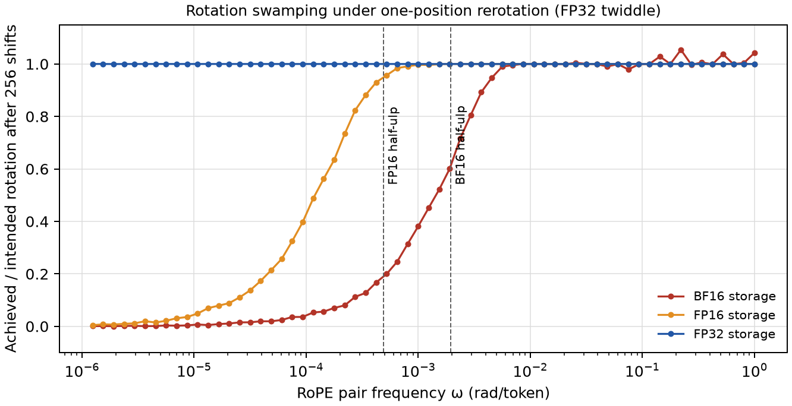
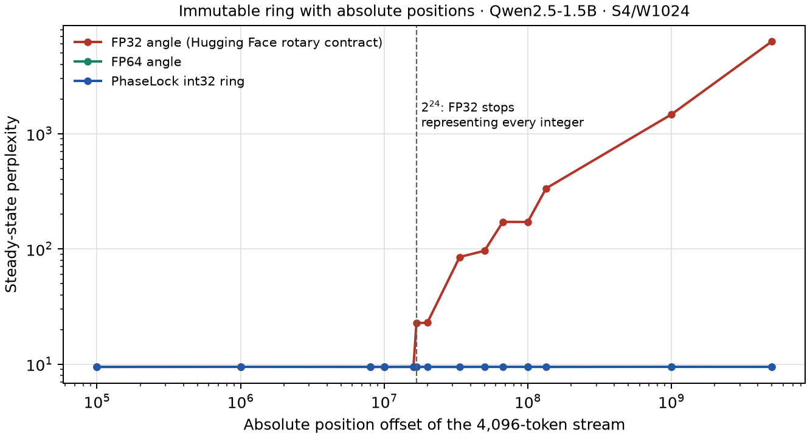
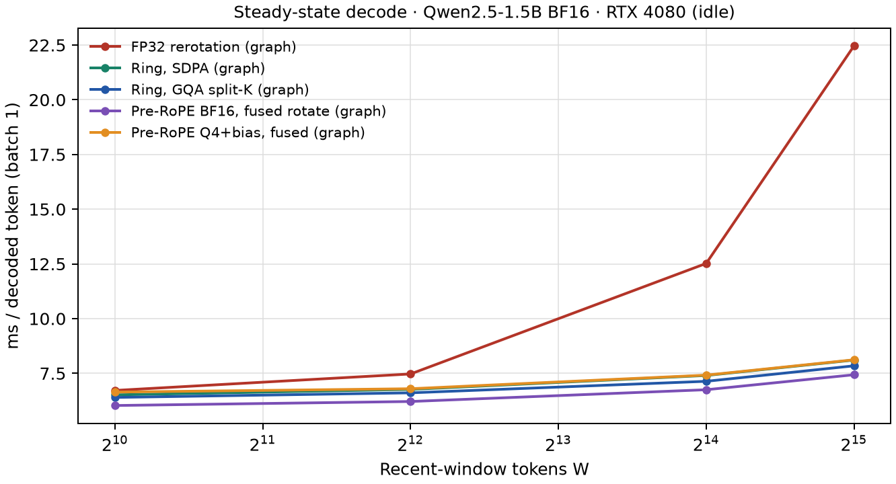

# Rounding Placement: Coordinate Choice, Not Bit Width, Sets Low-Precision Error in Transformers

**One mechanism behind RoPE re-rotation drift, the FP32 position cliff, 4-bit key collapse, and the late-training BF16 attention-gradient blowup — and one recipe that fixes all four**

Jacob Hollenbeck

*Draft, 2 October 2026. This paper merges two measured programs: a streaming-inference study of rotary KV caches and a training-numerics study of attention gradients. All results are from teacher-forced forward or forward-and-backward passes on pinned checkpoints of Qwen2.5 (0.5B, 1.5B), Qwen3 (0.6B, 1.7B) and Pythia (160m, 410m) on one RTX 4080, single seed unless stated. No model was trained end to end; gradient error against a 64-bit reference is a proxy for training quality, not a measurement of it. There is no measured loss or throughput benefit from a training run yet.*

## Abstract

Low-precision transformers fail in ways that look unrelated: rotary keys stop moving when a streaming cache re-rotates them in BF16; a cache that keeps absolute positions collapses at exactly 2^24; 4-bit keys destroy attention on some models but not others; and BF16 attention gradients blow up late in training. We show these are one failure. Each is an exact symmetry of the model — a rotation, a per-channel scaling, or an additive shift — rounded in the wrong coordinate frame, so the rounding lands on the invariant component and erases the content. The error is set by the frame, not the mantissa bits: a 16-bit log-polar format is five times worse than BF16 on one model, and adding position bits in FP32 does nothing past 2^24. The fix is one recipe: remove the invariant in high precision before rounding, keep positional phase as an exact integer, and restore the conservation law at the layer boundary. Measured on six models: keeping only the 35 of 64 swamped rotary pairs exact removes 97–103% of the re-rotation loss (otherwise up to 49% perplexity); integer phase stays flat past 2^32 where FP32 breaks at 2^24; per-channel affine correction brings 4-bit keys within 0.4%; and removing the key mean, then restoring the softmax-gradient zero sum, takes a full BF16 training step's gradient error from 204% to 11.8% on Pythia-160m and 43% to 3.0% on Pythia-410m, while standard FP8 explodes past 300,000%. We give the mechanism, the repairs, and three experiments a lab should run next.

## 1. Introduction

**Thesis.** The dominant error in low-precision transformer inference and training is set by the coordinate frame in which values are rounded relative to the model's exact symmetries, not by the number of mantissa bits; every large failure we measured is one symmetry — a rotation, a per-channel scaling, or an additive shift — rounded in the wrong frame, and every fix is the same recipe: remove the invariant component in high precision before rounding, keep positional phase as an exact integer, and restore the conservation law at the layer boundary.

A transformer has exact symmetries. Softmax is unchanged if a constant is added to every key's score. RMSNorm is unchanged if its input is rescaled. Rotary position embedding (RoPE) depends only on relative position, so shifting every position by a constant leaves attention unchanged. Each symmetry has a conservation law in the backward pass: the softmax score-gradient rows sum to zero, the vocabulary gradient rows sum to zero, the RMSNorm input gradient is orthogonal to the input. These are identities in real arithmetic.

Rounding breaks them, but only in the wrong coordinates. If a value is the sum of a large invariant part and a small content part — a key whose mean is hundreds of times the between-key spread, a position angle that is a huge multiple of a frequency, a channel scaled by an outlier gain — then rounding the sum stores the invariant part well and the content part badly. The attention or the gradient depends only on the content part. So the error is enormous even though the format's relative precision is fine. This is the floating-point phenomenon of *swamping*: a small addend vanishes against a large running value [11].

The consequence is that **bits do not help; the frame does.** We measure a 16-bit log-polar format that is 5× worse than 16-bit BF16 on Qwen3-0.6B, because its dynamic-range window flushes the model's gain-outlier channels (§8). We measure FP32 position angles that collapse at exactly 2^24 while a 32-bit integer phase, carrying no more "value" bits, stays exact past 2^32 (§4). We measure a one-position rotary re-rotation whose failure condition does not depend on the key's magnitude at all (§3). In every case the cure is to choose coordinates in which the invariant is a separate, exactly representable quantity, round only the content, and restore the law afterward.

We test this one claim across four failures that the literature treats separately, two at inference and two in training:

1. **Rotation swamping** (§3). A streaming cache that re-rotates stored keys one position at a time in BF16 freezes the 35 of 64 rotary pairs whose frequency is below 2^-9. Measured cost: +1.4% perplexity on Qwen2.5-1.5B and +27% and +49% on Qwen3-0.6B and 1.7B, over immutable keys on the same consumer and tokens (n = 20,000 tokens). Keeping only those 35 pairs exact during re-rotation removes 97–103% of the loss.
2. **The FP32 position cliff** (§4). A cache that keeps absolute positions and forms rotary angles in FP32 collapses at exactly 2^24 positions on three models; integer phase and FP64 angles stay flat past 2^32. This is the one place the integer representation is load-bearing, and FP64 is the other correct choice.
3. **Affine correction before low-bit keys** (§5). Quantizing keys to 4 bits after RoPE destroys attention (perplexity in the thousands). Removing each channel's invariant affine component before RoPE — an additive bias in Qwen2.5, a per-channel gain in Qwen3 — brings 4-bit keys to within 0.4–1.8% of full precision.
4. **The late-training attention-gradient blowup** (§7–§8). A published failure of BF16 FlashAttention gradients late in training [12] reproduces in our replay (worst-layer query-gradient error 142% at the final Pythia-160m checkpoint). Its dominant cause is BF16 rounding of a large key mean. Removing the key mean before the dot product and restoring the softmax-gradient zero sum — the same recipe as inference — takes a full BF16 training step's gradient error from 204% to 11.8% on Pythia-160m and 43% to 3.0% on Pythia-410m.

We call the shared recipe the **boundary operator B(x)**: at each place a value is converted to low precision, quotient out the invariant in the frame where it is invariant, keep positional phase as an exact integer, and restore the conservation law after rounding. Its attention specialization, which we call **gauge-fixed phase attention (GFPA)**, uses one configuration across six models and is bit-identical at position offset 0 and 8 million (§7). The serving instantiation of "restore the law at the boundary" is to round a value once and keep its exact law as metadata: immutable rotary keys tie full-precision quality (steady perplexity 8.057 versus 8.055 on Qwen2.5-1.5B) while rewriting zero surviving keys (§6).

None of the individual fixes is wholly new; §9 positions each against prior art (StreamingLLM, KVQuant, KIVI, QuaRot/SpinQuant, SageAttention, the BF16-RoPE training paper, and the attention-gradient paper we replay). The contribution is the unifying mechanism, the measurement that coordinate choice dominates bit width, the three-model swamping and 2^24 results, the per-channel correction rule for two model families, and the demonstration that the identical recipe repairs both an inference drift and a training gradient.

## 2. The common mechanism

### 2.1 Symmetries, gauges, and where rounding lands

Table 1 lists the symmetries that cause trouble, the invariant component each one hides inside a stored value, and the low-precision failure that results when that value is rounded in the model's native (linear) coordinates.

*Table 1. Each symmetry hides an invariant inside a value; rounding the value in linear coordinates spends the mantissa on the invariant and loses the content.*

| Symmetry (exact in real arithmetic) | Where | Invariant hidden in the value | Low-precision failure |
|---|---|---|---|
| add a constant to every key's score | softmax | the shared key mean | the mean eats the mantissa; keys stop differing (§3, §7) |
| rescale one channel of k, inverse-rescale q | QK dot under RoPE | a per-channel gain (Qwen3 QK-norm γ) | a gain outlier sets one scale for a whole block; small channels flush (§5, §8) |
| shift all positions by a constant | RoPE | the absolute position | FP32 absolute angle collapses near 2^24 (§4) |
| score-gradient rows sum to zero | softmax backward | — (a conservation law) | BF16 casts break it; the mean key leaks into the query gradient (§7) |
| logits shift; vocab gradient rows sum to zero | LM head | the unembedding mean | FP8 logit-gradient error; wrong centering hurts (§8) |
| RMSNorm(αx) = RMSNorm(x) | norms | the input scale | recomputing the norm from rounded input spreads a big-channel error (§8) |

The pattern is one sentence: **a stored value is an invariant part plus a content part, the model depends only on the content part, and rounding in linear coordinates spends the precision on the invariant.** The rotary case is the cleanest. Writing a RoPE score for channel pair m,

s = α Σ_m |q_m| |k_m| cos(φ_q − φ_k + (i − j) ω_m),

the dependence on position (i − j) is a sum over frequencies ω_m. The low-frequency pairs rotate so slowly that a one-step rotation is a tiny addend on top of the stored key, and BF16 rounds it away (§3). "Cartesian" models such as Qwen store their numbers in linear coordinates, but the position part of their attention is already spectral; the frame mismatch is built into RoPE, not imposed by us.

### 2.2 The recipe: B(x)

The fix has the same three parts everywhere:

1. **Remove the invariant in high precision before rounding.** Subtract the key mean; subtract the projection bias; divide out the per-channel gain. These are exact in real arithmetic because the model is invariant to them. Rounding then sees only the content.
2. **Keep positional phase as an exact integer.** Represent position as an integer phase increment on a 2^B ring, so a position shift is an integer subtraction and relative phase is exact for any absolute offset. This removes the 2^24 cliff (§4) and makes the serving path write no surviving keys (§6).
3. **Restore the conservation law after rounding.** After a low-precision cast breaks a zero-sum law, project it back. For the softmax score gradient this is the rank-one correction that the attention-gradient paper calls GProj [12]; it is exact in post-cast arithmetic and costs one reduction and one axpy per row.

In log coordinates — representing a number as a log-magnitude and an integer phase — every symmetry in Table 1 is a *straight line with integer coefficients*, because scalings and rotations become additions. The conservation laws are then fixed integer constraints, which integer arithmetic preserves exactly. We use a 64-bit floating-point reference as an exact stand-in for integer accumulation in the training experiments (§8); the integer path itself is measured bit-identical on real layers separately. This log-coordinate view is why the same operator fixes a per-channel gain, a layer rescaling, a softmax shift and a RoPE shift with one mechanism: in those coordinates they are the same kind of object. We do not require the model to use that format; every repair below is also measured on ordinary BF16.

### 2.3 Bits do not help; the frame does

Three measurements, developed in later sections, make the headline concrete.

First, **the swamping condition is independent of magnitude.** A one-position re-rotation changes a pair by about ω_m times its partner; BF16 discards it when ω_m < 2^-9, regardless of how large the key is (§3). More bits in the key value do not change which pairs are lost.

Second, **more format bits can be worse.** A 16-bit log-polar format on Qwen3-0.6B gives 12.8% full-step gradient error against BF16's 2.6% at the same 16 bits, because its fixed dynamic-range window flushes the model's gain-outlier channels (§8, n = 2 × 48 tokens). The extra bits are spent in the wrong place.

Third, **the right frame at fewer value bits wins.** A 32-bit integer phase has no more "value" precision than FP32, yet it is exact for every absolute position while FP32 angles collapse at 2^24 (§4). And in training, standard per-tensor FP8 reaches 1,980,000% gradient error on the final Pythia-410m checkpoint, while BF16 with the invariant removed reaches 3.0% (§8): the gap is the frame, not the eight versus sixteen bits.

## 3. Inference I: rotation swamping

### 3.1 The setting

Streaming inference with attention sinks keeps a bounded recent window of keys and values and gives surviving tokens new rotary positions as the window slides [2]. One common implementation stores keys *after* rotation and rotates the survivors again on every one-position shift, writing them back in the cache dtype. The alternative, present in the original StreamingLLM work, keeps pristine pre-rotary keys and rotates them at read. We measure the first design and explain why it fails.

All results in this section use a manual Qwen decoder that reuses the loaded model's learned weights and reimplements only rotary application, attention, and cache management. (Full inference provenance, including the superseded first-draft runs, is in the companion inference paper `../phaselock-kv-shifts/paper.md`, cited below as "companion §x".) On a 96-token no-eviction check it agrees with stock Hugging Face inference to 97.9% top-1 and KL 0.0039; all arms share this path, so within-harness comparisons isolate the cache choice. The quality stream is 20,000 held-out WikiText-2 test tokens, four sinks, a 1,024-token window, one-token evictions (so a key is re-rotated up to ~1,024 times before eviction), scored by teacher-forced next-token negative log likelihood (NLL).

### 3.2 The mechanism

A one-position re-rotation changes the components of channel pair m by about ω_m times the partner component. BF16 keeps 8 significant bits, so when that change is below half a unit in the last place, about 2^-9 of the value, rounding returns the old number and the rotation is lost. To first order the condition ω_m < 2^-9 does not depend on the key's magnitude. For Qwen's rotary base (θ = 10^6, head dimension 128), **35 of 64 pairs** have ω_m < 2^-9; for FP16 (threshold 2^-11) the count is 28 [`rotation-swamping.json`].

A CPU probe applied n one-position re-rotations with an FP32 twiddle to 4,096 random keys, rounding to the storage dtype after each step. After 256 shifts, BF16 storage achieved on average about 10% of the intended rotation in the 35 predicted pairs and about 98% in the rest. Mean relative key error grew almost linearly with the number of shifts: 0.0020, 0.031, 0.10 and 0.43 after 1, 64, 256 and 1,024 shifts; a random-walk model of independent rounding predicts 0.036 at 1,024, and the measured 0.43 is far larger because the low-frequency error is systematic, not random. FP16 storage reached 0.054 at 1,024 shifts and FP32 storage stayed exact (2 × 10^-5) [`rotation-swamping.json`].

Rounding the rotation coefficient itself to BF16 is worse than rounding the key. A BF16 twiddle has magnitude 0.9980–1.0019 instead of exactly 1, so repeated application shrinks or grows the key norm: the probe reached relative error 1.17 with norm ratio 1.61 after 1,024 shifts [`rotation-swamping.json`]. This is a distinct, larger failure (§3.4).

*Figure 1. The BF16 50% crossing falls inside the predicted band. Source: `../phaselock-kv-shifts/evidence/rotation-swamping.json`.*

### 3.3 Model-level cost and the exact-pair fix

The mechanism predicts a model-level cost that grows with how long a key survives. We measured it on the 20,000-token held-out stream, re-rotating survivors one position per eviction with FP32 arithmetic and BF16 storage, against immutable pristine keys under the identical eviction schedule [`review-fixes.json`]:

*Table 2. One-token re-rotation versus immutable keys, 20,000 held-out tokens, four sinks, 1,024-token window. Excess NLL is paired over 18 post-fill blocks; brackets are descriptive 95% block bootstraps (text blocks are dependent).*

| Model | Re-rotate PPL | Immutable PPL | PPL ratio | Excess NLL [95% block] |
|---|---:|---:|---:|---|
| Qwen2.5-1.5B | 8.170 | 8.055 | +1.4% | +0.0142 [+0.0088, +0.0191] |
| Qwen3-0.6B | 22.090 | 17.363 | +27% | +0.241 [+0.206, +0.268] |
| Qwen3-1.7B | 20.692 | 13.868 | +49% | +0.400 [+0.330, +0.492] |

Keeping only the 35 swamped pairs exact during re-rotation, and rounding the rest to BF16, removes essentially the whole loss: **103% on Qwen2.5-1.5B, 101% on Qwen3-0.6B, and 97% on Qwen3-1.7B** of the paired excess NLL [`review-fixes.json`]. Keeping the complementary 29 unswamped pairs exact removes only 41%, 20% and 27%. The loss is in the slow pairs, exactly as predicted.

### 3.4 Why Qwen3 is worse, and how block shifts remove the cost

Qwen3 loses 20–35× more than Qwen2.5. The reason is that two mechanisms meet in the same channels. Qwen3's per-head QK-norm applies a learned channel gain γ before RoPE, and that gain concentrates key energy in the slow pairs: the 35 swamped pairs (55% of all pairs) carry **77% of the squared gain on Qwen3-0.6B and 75% on Qwen3-1.7B**, averaged over layers, and 74% and 70% of the six highest-gain pairs per layer fall in the swamped set [`review-fixes.json`]. The gain puts the content in exactly the pairs BF16 cannot rotate. Keeping the six highest-gain pairs per layer exact — about a tenth of the channels — already removes 88% (0.6B) and 76% (1.7B) of the loss [`review-fixes.json`]. This is a causal test of the mechanism, not a correlation.

The same arithmetic says the cost is specific to one-token shifting. Shifting by Δ positions per eviction swamps only pairs with Δ ω_m < 2^-9 and performs Δ times fewer roundings, so a key loses at most about W·2^-9/Δ radians before eviction. Measured on the same stream with FP32 re-rotation arithmetic: from Δ = 16 upward the excess NLL's 95% block interval includes zero on both Qwen2.5-1.5B and Qwen3-1.7B, so the 49% Qwen3 loss vanishes [`review-fixes.json`]. Engines that shift in blocks of 16 or more positions, as llama.cpp's context shift does, avoid this cost; one-token shifting is the dangerous regime. (The cost of evicting large blocks is reduced context, not numerics: Δ = 512 raises the pristine reference's own NLL by ~0.05 by shrinking the effective window.)

The catastrophic multi-hundred-perplexity failures reported for naive BF16 streaming come from the BF16-rounded twiddle of §3.2, not from key storage: a fixed one-step coefficient rounded to BF16 drives Qwen2.5-1.5B to 254, Qwen3-0.6B to 406 and Qwen3-1.7B to 2,501 perplexity [companion §5.3, §6.9]. Computing the rotation in FP32 removes that, leaving the smaller storage loss of Table 2. Both are the same root cause seen twice: a rotation applied in a frame where BF16 cannot represent the step.

## 4. Inference II: the FP32 position cliff and integer phase

An immutable cache stores keys at their absolute positions, and those positions grow without bound. The standard rotary module multiplies the inverse frequency by the position in FP32, and FP32 represents every integer only up to 2^24. We started 4,096-token held-out streams at large absolute offsets; relative geometry is unchanged, so any change in quality is purely numerical.

*Table 3. Steady perplexity versus absolute position offset, Qwen2.5-1.5B; the local-position reference is 9.472. The 2^24 threshold was predicted before the fine sweep [companion §6.3].*

| Offset | FP32 angle | FP64 angle | Integer phase (int32) |
|---:|---:|---:|---:|
| 0 – 1.6×10⁷ | 9.46–9.50 | 9.47 | 9.45–9.48 |
| 2^24 = 16,777,216 | **22.6** | — | 9.46 |
| 2^25 | 85.0 | — | 9.45 |
| 10⁹ | 1,467.6 | 9.48 | 9.48 |
| 5×10⁹ (> 2^32) | 6,304.9 | 9.46 | 9.48 |

The collapse begins exactly where FP32 stops representing every integer position and deepens by roughly 0.7 NLL per additional bit of position spacing. The integer law is exact for every offset, because (p mod 2^32)·F_m mod 2^32 is integer arithmetic and the decoded angle always lies in [0, 2π). The threshold replicates on Qwen3-0.6B (FP32 20.4 → 28.8 at 2^24, → 21,782 at 5×10⁹; integer flat at ~20.4) and Qwen3-1.7B (15.7 → 20.3 at 2^24, → 798,643 at 5×10⁹; integer flat at ~15.7) [`bithacks-qwen3.json`].

*Figure 2. Source: `../phaselock-kv-shifts/evidence/bithacks-qwen3.json` and companion §6.3.*

This is the one result where the integer representation is strictly necessary and more value bits do not substitute: FP32 has 24 bits of integer range no matter how the angle is formed, and only a wider integer ring or FP64 removes the cliff. FP64 is the other correct choice, at a throughput cost on consumer GPUs. The same integer phase can be computed inside an attention kernel with a wrapping multiply and a bit-hack that turns the 32-bit phase into an angle without an integer-to-float conversion, so the exactness does not require a stored table (§6).

The deeper point is that **the error below 2^24 is not zero, it is merely tolerated.** A direct probe measured 0.04 rad of relative-phase error at 10^6 and 0.17 rad at 10^7 under FP32 [companion §6.3]; the model survives it. The cliff is where tolerated error becomes catastrophic error, and it is set entirely by the integer range of the frame.

## 5. Inference III: affine correction before low-bit keys

Quantizing keys to 4 bits is where the frame matters most, and the two model families differ in exactly the way the mechanism predicts.

### 5.1 Qwen2.5: an additive bias

Qwen2.5's key projection carries a bias: before RoPE, k = W_k h + b_k, and b_k is a per-channel constant. Because softmax is invariant to a constant shift of all keys, b_k can be removed exactly before quantizing and restored after. After RoPE the bias becomes R(p)b_k, position-dependent and mixed within each pair, so it can no longer be removed without a per-row rotation. The bias is large: in layer 0 the largest key-bias entry is 316 while the bias-free residual has standard deviation 1.08, so the bias is 74% of the block maximum there. Rotated and quantized to 4 bits after RoPE, the step size reaches about 45 — forty times the content signal — and the layer loses its key content.

Measured on 20,000 held-out tokens, Qwen2.5-1.5B [`free-wins-quality.json`]:

*Table 4. Quantize-once 4-bit keys, Qwen2.5-1.5B. Values unquantized unless stated.*

| 4-bit key path | Steady PPL |
|---|---:|
| Q4 after RoPE | 6,135 |
| Q4 before RoPE (no correction) | 268.4 |
| Q4 before RoPE, bias removed | **8.194** (+1.8% over 8.055) |
| Q4 before RoPE, per-channel calibrated | 8.104 |

Plain pre-RoPE quantization, the design point of KVQuant [3], helps (6,135 → 268) but is not enough; removing the bias is the decisive step (268 → 8.19).

### 5.2 Qwen3: a per-channel gain outlier

Qwen3 has no key bias, but its per-head QK-norm applies a learned per-channel gain γ, and a gain scales both the mean and the spread of a channel. Qwen3-0.6B has one or a few γ channels per layer at 3–42× the median; layer 0 has a gain of 96.5 against a median of 2.28. In that channel's quantization block the step size buries every other channel: 45% of channels end with signal-to-noise below 1, and 8 of 1,024 channels carry 82% of the score error [companion §6.9]. This is the same failure as the Qwen2.5 bias, in a multiplicative frame: the invariant is now a scale, not an offset.

The cure is to divide out the gain per channel (equivalently, normalize each channel's mean and spread) before quantizing. Measured on 20,000 held-out tokens [`bithacks-qwen3.json`]:

| 4-bit key path | Qwen3-0.6B PPL | Qwen3-1.7B PPL |
|---|---:|---:|
| Q4 after RoPE | 411.9 | 115.1 |
| Q4 before RoPE (no correction) | 126.7 | 53.3 |
| Q4 before RoPE, per-channel calibrated | **17.465** (+0.6% over 17.363) | **13.943** (+0.5% over 13.868) |

A per-channel calibrated 4-bit key cache is within 0.4–0.6% of full precision on Qwen3. Across the 28 layers of Qwen3-0.6B, each layer's γ max/median ratio predicts its plain-Q4 attention KL (Spearman ρ = +0.83, p = 4×10^-8), and calibration erases the dependence (ρ = −0.33, p = 0.09) [companion §6.9]. The rule generalizes §5.1: **before quantizing pre-RoPE keys, undo each channel's affine distortion — the additive bias in Qwen2.5, the multiplicative gain in Qwen3.** This is a lighter member of the family that includes per-channel key quantization (KIVI [6]) and rotation-based outlier spreading (QuaRot, SpinQuant [9, 10]); it keeps a per-token write path.

## 6. Serving: round once, keep the law exact at the boundary

"Restore the exact law at the boundary" has a serving instantiation: round a value once and keep its exact law as cheap metadata, instead of re-deriving it in low precision on every step. For a rotary cache this means storing each key once at its absolute position and rotating it only when read, with the position carried as an integer. RoPE's relative-position identity makes this exact: ⟨R(a_q − d)q, R(a_i − d)k_i⟩ = ⟨R(a_q)q, R(a_i)k_i⟩, so a uniform window shift is a change of one integer origin, not a rewrite of the keys.

Measured on the 20,000-token held-out stream with FP32-accumulating attention, Qwen2.5-1.5B [`free-wins-quality.json`]:

- **Immutable keys tie full precision.** A single-buffer immutable ring scores steady perplexity 8.057 against pristine rotate-at-read's 8.055 (excess NLL +0.0003 [−0.0006, +0.0009]), and an FP64-phase ring scores 8.054. The integer phase is not a quality improvement over FP64; it is a representational and throughput choice. The same ring beats the FP32 re-rotation control by −0.0140 NLL [−0.0191, −0.0086] on the identical consumer.
- **Zero surviving-key rewrites.** Over 100,000 streamed tokens, a four-sink 1,024-token ring performed 98,972 evictions and rewrote zero surviving-key bytes, versus a shifting design that dirties the whole resident cache on every token [companion §6.4].
- **Bit-exact restart.** The ring's state saved at 32,768 tokens, reloaded into a fresh process and CUDA context, reproduced the next full logit tensor bit for bit [companion §6.4]. Immutable storage makes the cache a durable, exactly reopenable object and makes copy-on-write sharing across beams or forks proportional to tokens decoded since the fork.

Speed follows the same principle. A fused pre-RoPE attention kernel keeps keys unrotated and rotates them in registers from an integer position, so the shift is a four-integer update. At batch 1 on an idle RTX 4080 it decodes 3.0× faster than FP32 re-rotation at a 32,768-token window (7.44 vs 22.46 ms/token) and stays near the weight-read floor as the window grows [companion §6.6]. Computing the integer phase inside the kernel with a bit-hack (a wrapping multiply, a shift-and-OR to form the angle in turns, and the hardware sine/cosine approximation) is 1.30× faster than a stored phase table at 128k and avoids the table entirely, at 17× lower rotation error against FP64 [companion §6.8]. A page-framed 4-bit key cache decodes 8.6% faster than the best BF16 fused kernel at 32k [companion §6.8]. These are batch-1 Python-decoder measurements, not a production engine, and they bound the operation, not end-to-end serving throughput.

*Figure 3. Source: `../phaselock-kv-shifts/evidence/free-wins-speed.json` and `bithacks-speed.json`.*

## 7. Training I: the same recipe on attention gradients

### 7.1 Reproducing the published failure

A recent paper reports that BF16 FlashAttention gradients blow up late in training and attributes it to BF16 rounding of the softmax score gradient, which breaks its zero row sum and leaks the mean key into the query gradient; its fix, GProj, projects the rounded score gradient back onto zero row sums [12]. We replayed real Pythia checkpoints across training (steps 16k, 64k, 143k) through the real BF16 attention kernels, capturing q, k, v and the output gradient per layer and comparing against an FP64 reference [`ladder-pythia.json`].

The failure reproduces. Worst-layer query-gradient (dQ) error from the real BF16 kernel grows across training: on Pythia-160m, 1.0% at step 0, 4.0% at 16k, 50.5% at 64k, and **142.2% at the final checkpoint**; on Pythia-410m it reaches 111.2% [`ladder-pythia.json`, n = 2 × 1,024 tokens]. The key-gradient (dK) error is larger still (218% worst-layer at the final 160m checkpoint).

### 7.2 The cause is a large key mean, and the recipe fixes it

Our replay localizes the cause more simply than the published mechanism. Late in training the keys acquire a large shared mean. In the worst Pythia-160m layer the key mean reaches roughly 800× the between-key spread, and on Qwen2.5-1.5B layer 0 roughly 2,400× [replay notes; the ratio is layer-dependent]. BF16 then stores the mean well and the small key-to-key differences badly — the swamping of §2.1, now in the key mean rather than the rotary phase. Because softmax ignores a constant added to every key, subtracting the per-head key mean before the dot product is exact, and it removes most of the error: centering cuts the worst-layer dQ error from 142.2% to 20.8% on Pythia-160m and from 111.2% to 9.5% on Pythia-410m in the real kernel [`ladder-pythia.json`]. In the real kernel on Qwen2.5-1.5B's worst layer, centering the key takes dQ error from 29.6% to 0.67% (44×) [replay, `final-qwen25-1.5b-t512.json`].

The published row-sum projection is real but second order in this replay: casting the score gradient alone to BF16 contributes ≤2.7% almost everywhere, and the error is dominated by key rounding, not by the row-sum violation [replay notes]. The two fixes are complementary parts of the same recipe — remove the invariant (key mean) before rounding, restore the law (zero row sum) after — and B(x) applies both.

### 7.3 One configuration across six models

GFPA packages the attention recipe into one configuration: keys stored pre-RoPE and rotated into a per-page frame with integer relative phase, a per-page full-precision base (the page mean) plus a low-precision residual with per-channel scales, and the score-gradient zero-sum projection reduced to one scalar per page per row. Measured worst-layer dQ error against FP64 (BF16 operands), one configuration for every model [`gfpa-small.json`, `gfpa-qwen25-1.5b.json`, `gfpa-qwen3-*.json`]:

*Table 5. Worst-layer query-gradient error, manual recompute from captured tensors (distinct from the FA2-kernel numbers of §7.1). "Best special case" is per-head key-mean centering. "Mean, offset 8M" is that same fix at an 8-million position offset.*

| Method | Pythia-160m | Pythia-410m | Qwen2.5-0.5B | Qwen2.5-1.5B | Qwen3-0.6B | Qwen3-1.7B |
|---|---:|---:|---:|---:|---:|---:|
| plain BF16 | 131.7% | 92.9% | 12.2% | 27.9% | 2.9% | 1.9% |
| best special case (mean centering) | 15.1% | 8.9% | 2.1% | 0.95% | 1.08% | 1.10% |
| mean centering, offset 8M | 37.1% | 13.0% | 20.3% | 11.4% | 10.5% | 11.1% |
| **GFPA (identical at offset 0 and 8M)** | **13.5%** | **7.5%** | **1.44%** | **1.02%** | **0.96%** | **1.08%** |

Two properties matter. First, GFPA matches or beats the best per-model special case while using one configuration. Second, GFPA is **bit-identical at position offset 0 and 8 million**, whereas plain mean centering degrades at the offset (Pythia-160m 15.1% → 37.1%) because it still forms absolute FP32 angles — the 2^24 cliff of §4 reappearing in the training gradient. Both halves of the base term are needed: with no base, GFPA falls back to plain (131.8%); with no conservation projection, Qwen2.5-1.5B's dQ error is 23.9% instead of 1.02% [`gfpa-*.json`]. The inference fix and the training fix are the same operator.

## 8. Training II: one rounding per boundary

### 8.1 Where the error lives, on a full training step

We built a full-model training-step simulator: for a real checkpoint, run one forward and backward pass with every matmul operand in both directions rounded to the format under test (all linear layers, the attention dot products, the LM head, and every gradient matmul), while every product and sum is accumulated in FP64, which stands in for an exact integer accumulator (its own error ~10^-13 is ten orders below 8-bit rounding). The only rounding sites are therefore operand conversions. Gradient error is reported against an unrounded FP64 reference [`ea-pythia160m.json`, `ea-pythia410m.json`, `ea2-loc-*.json`].

Two localizations drive everything else. **The error is in the forward pass, not the backward arithmetic.** Rounding only the backward matmuls costs 0.6–0.9% gradient error in BF16 on every model and checkpoint, including the one where the full step is at 204%; rounding only the forward pass reproduces nearly the whole error [`ea2-loc-*.json`]. The forward rounding moves the point at which the gradient is evaluated, and sharp attention layers amplify that. **Where the forward error enters is model-dependent:** on late Pythia it is attention (the sharp layers, where scores reach tens of thousands), on Qwen2.5 it is the linear layers [`ea2-loc-*.json`].

*Figure 4. Global gradient error, all arms with B(x). Source: `../../../saturn/experiments/2026-09-30-spf-native-boundary/results/ea2-loc-*.json`.*

### 8.2 B(x) fixes the full step, and bits do not

The headline is the full-step gradient error with and without B(x) (median per-parameter error against FP64) [`ea-pythia160m.json`, `ea-pythia410m.json`]:

*Table 6. Full training-step gradient error, every matmul operand rounded. n = 2 × 256 tokens (Pythia).*

| Format | 160m 16k | 160m 64k | 160m 143k | 410m 143k |
|---|---:|---:|---:|---:|
| BF16 standard | 2.0% | 31.8% | 203.8% | 42.7% |
| **BF16 + B(x)** | **1.1%** | **1.4%** | **11.8%** | **3.0%** |
| FP8 standard (per-tensor E4M3/E5M2) | 56.1% | 65,262% | 330,746% | 1,980,961% |
| MXFP8 (block-32 scales) | 36.3% | 21,200% | 67,139% | 18,106% |
| MXFP8 + B(x) | 16.6% | 20.7% | 76.1% | 41.0% |

Three readings. **B(x) removes the late-training blowup:** two exact operations (key-mean removal and the softmax-gradient zero-sum restoration) take BF16 from 204% to 11.8% on the hardest Pythia-160m checkpoint and from 43% to 3.0% on Pythia-410m. **Standard 8-bit recipes do not survive late training:** per-tensor FP8 and MXFP8 reach tens of thousands to nearly two million percent on late checkpoints; B(x) brings MXFP8 back to 41–76%, which is still far from BF16+B(x). **The gap is the frame, not the bit count:** the diagnostic conservation measurements confirm B(x) works as designed (the rounded softmax-gradient row sums drop from ~5×10^-4 to ~3×10^-17).

The clearest demonstration that bits do not help is a 16-bit log-polar format. On Qwen3-0.6B it gives 12.8% full-step gradient error against BF16's 2.6% at the same 16 bits, because its fixed ~9-octave dynamic-range window flushes the QK-norm gain-outlier channels to zero [`ea2-loc-qwen3.json`]. The extra representable precision is spent in the wrong frame. The same format is competitive or better where the model has no such outliers (0.7% on Pythia-160m at step 16k).

*Figure 5. Source: `../../../saturn/experiments/2026-09-30-spf-native-boundary/results/ea3-native-*.json`.*

### 8.3 Determinism comes for free

Integer accumulation is associative, so a sum is bit-identical regardless of batch size, sharding or reduction order. On twelve real linear layers across three models, 8-bit log-products accumulated in a 64-bit fixed-point register were bit-identical across every reduction split (2, 8, 32 chunks), while FP32 and BF16 matmuls were never bit-identical across splits [two-domain note, Test 3]. The conservation laws that B(x) restores are, in these coordinates, fixed integer constraints that the accumulator keeps exactly. This is a property of the frame, not of the bit width, and it is the batch-invariance property that large-scale training and verifiable inference both want.

We make no speed claim for this path on current hardware: tensor cores are linear multiply-accumulators, and a log-domain accumulator measured about 95× slower than BF16 tensor cores [two-domain note, speed]. The practical form is to use the log-polar representation only for storage and for the exact components (positions, gauges, conservation), decode into tensor cores for the dense matmuls, and keep ordinary weights and optimizer state in their native format. B(x) itself is format-agnostic and is measured above on plain BF16.

## 9. Related work

**Rotary position embedding and streaming caches.** RoFormer introduced RoPE's relative-position structure [1]. StreamingLLM retained attention sinks and a sliding window and explicitly cached keys *before* rotation, rotating them at decode [2]; our immutable-key serving path (§6) is that design with an integer position law and measured zero surviving-key rewrites. Wang et al. showed that BF16 breaks RoPE's relative-position property in long-context *training* [7]; our §3 and §4 are the inference analogues (re-storage drift and the 2^24 cliff), with the swamping mechanism and the per-pair cost made explicit.

**KV-cache quantization.** KVQuant advocated pre-RoPE key quantization for low-bit caches [3], and KIVI per-channel key quantization [6]; QuaRot and SpinQuant remove KV outliers with learned or Hadamard rotations [9, 10]. Our §5 adds that for Qwen2.5 the decisive correction is removing the additive projection bias, and for Qwen3 the per-channel QK-norm gain, before quantization — a lighter per-channel affine correction in the same family. Quest [4], H2O [5] and InfLLM [8] select or retrieve KV blocks beyond a local window; they are orthogonal to how keys are stored and rounded.

**Attention smoothing and the gradient paper.** SageAttention smooths keys by subtracting their mean before INT8 quantization of the QK product [SageAttention, 2410.02367]; our inference and training key-mean removal (§5, §7) is the same operation, and we show it is the dominant fix for the late-training gradient failure, not only for inference quantization. SageBwd and SageAttention3 extend 8-bit attention to training and report that it can converge more slowly in pretraining [2505.11594]; that open problem is exactly what the boundary operator targets. The paper we replay [12] attributes the late-training blowup to the softmax score-gradient zero-sum violation and fixes it with GProj; we reproduce its failure and its witness, find the key mean to be the larger cause in our replay, and show GProj is the conservation half of the same recipe.

**Low-precision training and numerics.** FP8 training recipes (per-tensor E4M3/E5M2 scaling; the OCP Microscaling MX block-scaled formats) are the standard 8-bit path; §8 measures that they explode late in training without invariant removal and that B(x) recovers much of it. Compensated and Kahan summation [11] and stochastic rounding (Gupta et al., ICML 2015) address accumulation error; our localization (§8.1) shows backward accumulation is nearly free once B(x) is in place, so the leverage is in forward operand placement, not the sum. LNS-Madam trains at 8 bits with multiplicative updates and reports large energy savings [LNS-Madam, 2106.13914], and nGPT places representations on the unit hypersphere [nGPT, 2410.01131]; both are consistent with the log-coordinate view in §2.2, in which scalings are integer additions and unit norm is log-magnitude zero.

## 10. Limitations

We state these plainly.

- **No training run shows a loss or throughput benefit yet.** Every training result is one forward-and-backward pass per checkpoint (gradient error and cosine against an FP64 reference), single seed, a few hundred tokens. Gradient-level parity is a proxy for training quality, not a measurement of convergence. The most important owed experiment is a training continuation that shows a loss difference (§11).
- **Model scale is ≤1.7B,** on two inference families (Qwen2.5, Qwen3) and one training family (Pythia, plus Qwen single-step). The per-layer mechanisms should scale, but this is not shown on current frontier models.
- **FP64 stands in for exact integer accumulation** in §8. The integer path is measured bit-identical on real layers separately, and a GPU kernel matched FP64 to 7×10^-9, but it was not run inside the full-model simulation. Elementwise operations are idealized in FP64 for every arm, so the comparison isolates matmul-operand format and B(x).
- **The serving numbers are batch-1 measurements in a Python decoder,** not a production inference engine; they bound operations (kernel time, kernel count, bytes written), not end-to-end throughput. The quantization paths omit a Hadamard transform used in some cache configurations and quantize keys more aggressively than values.
- **Behavioral evidence is narrow.** Downstream quality is teacher-forced perplexity on one held-out WikiText stream and a synthetic one-word recall assay; neither tests free-form generation or durable memory.
- **The key-mean ratio is layer-dependent** and quoted approximately; the robustly verified training number is the worst-layer gradient error (142% real kernel), not the ratio.
- **One citation [12] is to a paper reached through a mirror** and should be verified against the canonical source before submission; the SageAttention and low-precision-training references' identifiers are noted for a final bibliographic check in the companion README.

## 11. What a lab should do

The practical takeaways for a training or inference numerics team:

1. **Before any low-precision cast of keys, remove the invariant.** Subtract the per-head key mean (exact; the same operation SageAttention calls smoothing) for every model, the projection bias for Qwen2.5-style models, and divide out the per-channel QK-norm gain for Qwen3-style models. This is the single largest lever at both inference and training and costs one vector per head.
2. **Carry position as an integer, not an FP32 angle.** Any cache or training setup that forms absolute rotary angles in FP32 has a hard cliff at 2^24 positions; an integer phase ring (or FP64) removes it, and the integer phase can be formed inside the attention kernel with no table.
3. **Never re-rotate stored keys one position at a time in BF16.** Keep keys immutable and rotate at read, or shift in blocks of ≥16 positions. One-token BF16 re-rotation freezes the 35 low-frequency rotary pairs and costs up to tens of percent perplexity on QK-norm models.
4. **Restore the conservation law after the cast, not instead of removing the invariant.** The softmax-gradient zero-sum projection (GProj) is necessary but second order; it is the cheap finishing step after invariant removal, not a replacement for it.
5. **Spend bits where the Jacobian is large, and spend coordinate choice everywhere.** More format bits in the wrong frame can be worse (16-bit log-polar underperforms BF16 on Qwen3). Put extra precision on the query/key dot product in sharp attention layers; fix the frame everywhere else.
6. **If you want batch-invariant, deterministic training,** accumulate in integers in log coordinates where the conservation laws are integer constraints; this is free determinism, independent of bit width, though it needs non-tensor-core hardware to be fast.

## Appendix A. Reproducibility and evidence

All jobs ran on one RTX 4080 under the lab's scheduler, with content-addressed receipts binding each executed source, input and raw output by SHA-256. Evidence extracts referenced as `name.json` live in `../phaselock-kv-shifts/evidence/` (inference) or in the named experiment result directories (training). The table maps each claim to its evidence file, representative job, and status.

*Table A1. Claim → evidence → status. Status: measured (run output verified by the author against the raw file), derived (arithmetic from measured values), modeled (from op counts or spec sheets).*

| Claim | Evidence file / dir | Representative job | Status |
|---|---|---|---|
| 35/64 pairs swamped (ω<2^-9); FP16 28 | `evidence/rotation-swamping.json` | CPU probe | measured |
| Re-rotation key error 0.0020/0.031/0.10/0.43 at 1/64/256/1024 shifts | `evidence/rotation-swamping.json` | CPU probe | measured |
| Re-rotation +1.4%/+27%/+49% ppl (Qwen2.5-1.5B/Qwen3-0.6B/1.7B) | `evidence/review-fixes.json` | `job-6ea35d8c6d35`, `job-628e9fa6055d`, `job-93a28be52bb0` | measured |
| Exact swamped pairs remove 103%/101%/97% of loss | `evidence/review-fixes.json` | same | measured |
| Swamped pairs carry 77%/75% of squared QK-norm gain | `evidence/review-fixes.json` (`gamma_slow_overlap`) | checkpoint read | measured |
| Block shift ≥16 removes cost (CI includes 0) | `evidence/review-fixes.json` | `job-6cf2f2b081ea`, `job-25a6c696c58e` | measured |
| BF16 twiddle → 254/406/2501 ppl | companion §5.3, §6.9; `evidence/bithacks-qwen3.json` | `job-d7941d73fbdf` etc. | measured |
| FP32 cliff at 2^24; int32/FP64 flat (Qwen2.5-1.5B) | companion §6.3; `evidence/free-wins-offset.json` | `job-52e9d4d5b335` | measured |
| 2^24 cliff replicates on Qwen3-0.6B/1.7B | `evidence/bithacks-qwen3.json` | `job-ca32a97fe217`, `job-fec9906ac08c` | measured |
| Q4 keys: 6135 (post-RoPE) → 8.194 (bias removed) Qwen2.5-1.5B | `evidence/free-wins-quality.json` | `job-f1b6021f8f2b` | measured |
| Q4 calibrated within 0.4–0.6% on Qwen3 | `evidence/bithacks-qwen3.json` | `job-ca32a97fe217` | measured |
| γ max/median predicts plain-Q4 KL (ρ=+0.83) | companion §6.9; `evidence/bithacks-qwen3.json` | `job-0884d060598e` | measured |
| Immutable ring ties pristine (8.057 vs 8.055) | `evidence/free-wins-quality.json` | `job-5bf54a112017` | measured |
| Zero surviving-key rewrites over 100k tokens; bit-exact restart | companion §6.4 | `job-f9057bec4470`, `job-12f57f5a475d` | measured |
| Fused pre-RoPE 3.0× faster than FP32 re-rotation at 32k | companion §6.6; `evidence/free-wins-speed.json` | `job-c41d3d14ceef` | measured |
| Integer bit-hack trig 1.30× over table at 128k, 17× lower error | companion §6.8; `evidence/bithacks-speed.json` | `job-fcdc9bd63242` | measured |
| Late-training BF16 dQ 142% (160m), 111% (410m); growth curve | `ladder-pythia.json` (gauge-leak) | `job-2cbe15b0cb62` | measured |
| Key-mean centering 142%→20.8% (160m), 29.6%→0.67% (Qwen2.5-1.5B kernel) | `ladder-pythia.json`, `final-qwen25-1.5b-t512.json` | `job-5ff65227df2e` | measured |
| GFPA 132%→13.5% (160m), 27.9%→1.02% (Qwen2.5-1.5B); bit-identical at 0 and 8M | `gfpa-small.json`, `gfpa-qwen25-1.5b.json`, `gfpa-qwen3-*.json` | `job-385098423c50`, `job-39b64370b45b`, `job-a1b87d95ff98`, `job-2c4e516d385c` | measured |
| B(x): BF16 204%→11.8% (160m-143k), 43%→3.0% (410m) | `ea-pythia160m.json`, `ea-pythia410m.json` | `job-7216cd2236bc`, `job-1f79a4387ff2` | measured |
| FP8 explodes to 331k%/1.98M%; MXFP8+B 76%/41% | `ea-pythia160m.json`, `ea-pythia410m.json` | same | measured |
| Error is forward not backward (backward-only 0.6–0.9%) | `ea2-loc-*.json` | `job-7d0d9b6893be`, `job-e5b3daf038d1`, `job-59c0d54eadc6` | measured |
| 16-bit log-polar 12.8% vs BF16 2.6% on Qwen3-0.6B | `ea2-loc-qwen3.json` | `job-59c0d54eadc6` | measured |
| Integer accumulation bit-identical across splits (12/12 layers) | two-domain note Test 3 | — | measured |
| Log-domain accumulator ~95× slower than BF16 tensor cores | two-domain note speed | `job-141c554fb988` | measured |
| Re-rotation +27%/+49% as ratios | derived from `review-fixes.json` ppl | — | derived |

Experiment directories: inference in `saturn/experiments/2026-09-29-phaselock-free-wins/`, `2026-09-30-phaselock-bithacks/`, `2026-09-30-phaselock-review-fixes/`, `2026-09-29-phaselock-long-session/`; training in `saturn/experiments/2026-09-30-phaselock-gauge-leak/` and `2026-09-30-spf-native-boundary/`. The companion paper `../phaselock-kv-shifts/paper.md` holds the full inference provenance (§9 there) and the superseded first-draft runs.

## Appendix B. The recipe outside transformers (brief)

The same factorization — an exact law plus a low-precision residual — appears in classical argument reduction (Payne–Hanek, Cody–Waite) and in reference-state subtraction in numerical weather models. We tested it on synthetic-aperture-radar backprojection, where the round-trip phase at satellite range is about 2.7×10^8 radians and must be right to a fraction of a radian, so practice uses FP64. Holding the scene-center range per pulse as an exact base and computing only the small per-pixel offset in FP32 ran **29× faster than FP64 at matched image quality** on an RTX 4080 (174.7 → 5.95 ms/image, image error −39 dB; plain FP32 destroyed the image at satellite range, peak −29 dB) [factored-precision FINDINGS, `job-10c2e0f5ac5b`, measured]. An integer phase ring is load-bearing only when the law is count × rate with a huge count: for θ = n·f at n = 10^13, FP32 is noise, FP64 is off by 8×10^-4 rad, and a 64-bit ring is exact [`ring_probe.py`, measured]. This is included only to show the mechanism is general; it is outside the transformer scope of this paper and is a factorization win, not a number-format win (an FP64 base ties the integer ring when the count is small).

## References

[1] J. Su et al. [RoFormer: Enhanced Transformer with Rotary Position Embedding](https://arxiv.org/abs/2104.09864). 2021.

[2] G. Xiao et al. [Efficient Streaming Language Models with Attention Sinks](https://arxiv.org/abs/2309.17453). ICLR 2024.

[3] C. Hooper et al. [KVQuant: Towards 10 Million Context Length LLM Inference with KV Cache Quantization](https://arxiv.org/abs/2401.18079). NeurIPS 2024.

[4] J. Tang et al. [Quest: Query-Aware Sparsity for Efficient Long-Context LLM Inference](https://arxiv.org/abs/2406.10774). ICML 2024.

[5] Z. Zhang et al. [H2O: Heavy-Hitter Oracle for Efficient Generative Inference of Large Language Models](https://arxiv.org/abs/2306.14048). NeurIPS 2023.

[6] Z. Liu et al. [KIVI: A Tuning-Free Asymmetric 2bit Quantization for KV Cache](https://arxiv.org/abs/2402.02750). ICML 2024.

[7] H. Wang et al. [When Precision Meets Position: BFloat16 Breaks Down RoPE in Long-Context Training](https://arxiv.org/abs/2411.13476). 2024.

[8] C. Xiao et al. [InfLLM: Training-Free Long-Context Extrapolation for LLMs with an Efficient Context Memory](https://arxiv.org/abs/2402.04617). 2024.

[9] S. Ashkboos et al. [QuaRot: Outlier-Free 4-Bit Inference in Rotated LLMs](https://arxiv.org/abs/2404.00456). 2024.

[10] Z. Liu et al. [SpinQuant: LLM Quantization with Learned Rotations](https://arxiv.org/abs/2405.16406). ICLR 2025.

[11] N. J. Higham. [The Accuracy of Floating Point Summation](https://nhigham.com/wp-content/uploads/2023/10/high93s.pdf). SIAM J. Sci. Comput. 14(4):783–799, 1993.

[12] "Broken Symmetry in BF16 Attention: Why FlashAttention Gradients Blow Up Late in Training." arXiv 2609.34272, 2026. *(Replayed in §7; reached via a mirror — verify against the canonical source before submission.)*

[13] J. Zhang et al. [SageAttention: Accurate 8-Bit Attention for Plug-and-play Inference Acceleration](https://arxiv.org/abs/2410.02367). 2024. *(Key smoothing = mean subtraction.)*

[14] J. Zhang et al. [SageAttention2/3 and SageBwd: 8-bit attention for training](https://arxiv.org/abs/2505.11594). 2025. *(Reports slower pretraining convergence at 8 bits.)*

[15] J. Zhao et al. [LNS-Madam: Low-Precision Training in Logarithmic Number System using Multiplicative Weight Update](https://arxiv.org/abs/2106.13914). 2021.

[16] I. Loshchilov et al. [nGPT: Normalized Transformer with Representation Learning on the Hypersphere](https://arxiv.org/abs/2410.01131). 2024.

[17] P. Micikevicius et al. FP8 Formats for Deep Learning. 2022. *(Bibliographic identifier to verify before submission.)* S. Gupta et al. Deep Learning with Limited Numerical Precision. ICML 2015 (stochastic rounding). Open Compute Project, Microscaling (MX) Formats Specification.
