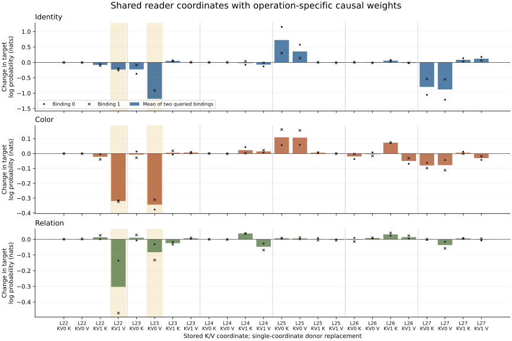
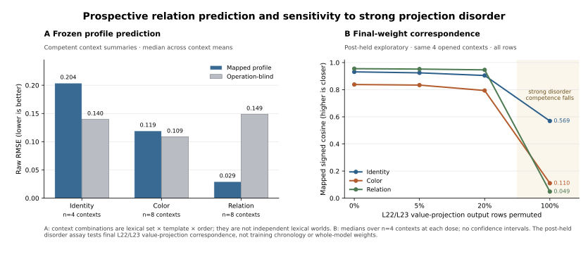

# Scaffolds and Dynamic Circuits

*Recurring causal interfaces, context-dependent participation, and successive semantic state updates*

Jacob Hollenbeck · Revised architectural draft · October 1, 2026

## Abstract

We investigate a functional architecture in which recurring causal interfaces support computations whose semantic participation depends on context, current operation, and carried state. In frozen Qwen2.5-1.5B, a previously fixed late K/V interface supports identity, color, and spatial-relation queries across four lexical scenes. Byte-identical interventions have different authority under different native questions. Earlier residual seeding initiates recipient-native formation of independently effective late state, while microscopic interventions identify shared value coordinates with different operation weights.

A discovery-frozen 24-coordinate profile predicts spatial-relation effects better than three fixed alternatives in all eight held context combinations: two lexical sets, two templates, and two orders. Competent context-median raw error is .029 versus .149 for an operation-blind profile. Color transfer is partial, with failed reader-order predictions; identity and size expose registered-readout limits. Full row permutation in L22/L23 value projections sharply disrupts signed profile alignment, while mild permutations largely preserve it. This establishes dependence on final-checkpoint row correspondence, with competence losses, rather than acquisition chronology.

A separate host-orchestrated feedback assay closes a directed two-update path in development and one competent city/country case out of three held contexts. A coherent first-row intervention changes the next native prediction to France; processing that prediction forms a new recipient K/V row. With first state and the visible France token fixed, replacing only the second all-layer row bundle changes the later answer to Germany; exact reinstall restores France. This tests successive semantic state authority beyond token/cache recurrence, without establishing autonomous operation selection or a minimal writer.

Prospectively comparable FLUX and Mamba assays, followed by a separately sealed Qwen appendix, support a partial formed-state→native-consumer core. Native image and continuation disagreements bound its scope; several source/read/write/feedback roles remain unmatched. Complete diffusion source compilation and bounded held-payload prediction provide constructive applications of the exposed interfaces. Together these results support scaffolded dynamic circuits built on the inherited time-formed circuit foundation. A complete shared graph, learning-time acquisition, and broader semantic feedback remain distinct extensions.

## 0. The architectural result

The paper distinguishes six connected propositions. Interface reuse, predictive recurrence, serial state authority, and final-weight dependence are measured within Qwen at their stated resolutions. The cross-family result earns a smaller common edge; compilation and memory are executable consequences of the exposed interfaces.

| Claim | Evidence | Current scope |
|---|---|---|
| A reusable interface can host different semantic computations | Fixed Qwen late K/V, opposite-query contrasts, recurring value routes, and recipient-formed-store block/rescue | Bounded causal organization; microscopic discovery in one scene/order has a separately frozen predictive extension |
| A frozen microscopic profile predicts unopened computations | Twenty-four Qwen coordinates, new lexical/template/order combinations, and three fixed competitors | Relation raw forecast wins 8/8 contexts; color mixed, identity/size readout-limited; checkpoint reused |
| Successive model-formed states have later semantic authority | First-row swap followed by second-row block/swap/reinstall with visible token fixed | Directed two-update path in development and one of three held contexts; queries supplied |
| The measured profile depends on final-checkpoint weight correspondence | Mild and complete row permutations in two selected value projections, with exact restoration | Strong disruption collapses signed shape; competence falls; learning-time acquisition remains open |
| A partial state/consumer core aligns across neural substrates | Frozen FLUX/Mamba block/rescue/wrong-coordinate profiles and a later prospective Qwen appendix | Two FLUX and two Mamba rows; one paired-competent Qwen row of three; complete common topology remains unmatched |
| Those interfaces can support compilation and executable state management | Prompt-source seals, held interaction programs, native state-dependent execution, and durable VM continuation | Bounded compiler and systems results under their declared input, runtime, and consumer contracts |

These claims build on the circuit-class foundation in the companion account of [time-formed circuits]. That paper follows a contextual source into state with independently demonstrated causal authority. The present paper asks how such state becomes reusable: how a new question, instruction, or execution history changes the computation supported by an existing interface. A universal cross-family graph, autonomous controller, and compiler are separate claims rather than conditions for the inherited class or the bounded architectural result.

The central Qwen comparison holds both the parent and the installed stored state fixed, then changes the native question. The same replacement can strongly damage the queried fact and have less effect under the opposite query. This supplies evidence about functional organization beyond the observation that different inputs produce different activations. Its contribution is causal reuse and context-dependent consumption; ordinary attention can implement that organization.

The broader hypothesis is that trained models contain recurring responsibilities for source formation, addressing, transition, writing, state retention, and consumption. An execution instantiates a particular program through their context-dependent participation. A member of this proposed class may have local writers, redundant stores, distributed paths, or mixtures. It need not share raw tensors, a unique minimal circuit, or every role with every other member.

## 1. The proposed object

### 1.1 Functional scaffold and dynamic support

A **functional scaffold** is a reusable organization of intervention-supported causal responsibilities at a declared resolution. A **dynamic circuit instance** is the source, address, payload, timing, and participation pattern that implements one computation on that organization. Here, participation means causal effect under specified interventions; it does not imply literal modification of the physical wiring.

We use **scaffolded dynamic circuits** as the working architectural class description. A feedback member additionally requires a measured return path: newly formed state must affect a later native computation. The Qwen two-update packet establishes one such bounded path at all-layer row-bundle resolution. The complete reader/writer graph and recurrence in every task or family are stronger properties.

Let a model family expose physical sites \(V_m\). A candidate scaffold has roles

\[
R=\{\text{source},\text{operation/address},\text{live reader or transition},
\text{carrier},\text{writer},\text{carried state},\text{consumer}\}.
\]

A family-local lowering associates roles with physical sites and state boundaries. We allow it to be partial and many-to-many: one role can span several sites, several roles can share a site, and a family can add responsibilities absent from another. A role acquires scientific content from its native intervention consequences, rather than its name or tensor shape.

For example, a source intervention followed by recipient-native state formation and independent store block/rescue supports an ordered source-to-store-to-consumer path. A successful K/V replacement alone supports the narrower claim that the replaced state has authority at that cut. An attention map suggests a read; a controlled reader intervention is needed to establish its causal contribution.

*Figure 1. Candidate role organization. This is an explanatory schema, not a claim that every edge has been independently mediated in every family. Qwen source-to-store mediation, query-conditioned reads, diffusion source/binding/writer contrasts, and the new two-update Qwen feedback packet support different portions. The latter independently tests a second model-formed state with its visible token fixed; the complete family-neutral graph remains unmatched.*

### 1.2 The meaning of static and dynamic

“Static” means recurring causal organization at a specified checkpoint and measurement scale. It does not mean that every site's activation or causal effect is constant. “Dynamic” means that the contextual payload, selected source, operation weights, address, or trajectory can change. A stable attention module can participate in different dynamic circuits; a stable role need not occupy precisely the same coordinate at another checkpoint.

The distinction has empirical content when the organization predicts intervention behavior. Qwen's coarse late interface was fixed before lexical transfer scenes. Its finer reader map is exploratory discovery, followed by a separately sealed relation-profile prediction on new context combinations. Color's reader-order misses show why a reusable interface does not imply invariant weights for every operation. SDXL retains nearly identical depth and semantic-segment profiles on an unseen factor family even when most of the new payload lies outside the previous interaction span. These are different resolutions of recurrence, with distinct selection histories.

### 1.3 Properties that must be separated

**Case recurrence** is reuse across contents or operations. **Temporal feedback** is causal consumption of state produced earlier in execution. **Learning origin** concerns the acquisition of functional organization through weight updates. **Inference-time formation** concerns construction of contextual state in an already trained model. **Cross-family correspondence** concerns whether a common higher-level role account predicts interventions through different native interfaces.

These properties can be tested separately. A reusable interface need not close a recurrent semantic loop. A model can exhibit native feedback without independently choosing its clock or goal. A successful runtime lowering need not reveal a learned graph. Conversely, missing a stronger extension does not erase a measured bounded instance.

## 2. What the architecture account adds

The physical module graph, fixed weights, changing activations, and a reusable causal organization are different objects. The first two can be described without tracing a semantic computation. The last requires controlled evidence that recurring responsibilities support native behavior and that their contextual participation changes predictably.

The core result links construction, selection, prediction, and update. A supplied source initiates recipient-native formation of a later effective store. One previously selected interface carries several kinds of content and acquires different authority under different questions. A frozen microscopic relation profile predicts held effects beyond three fixed alternatives. Newly formed state then has later semantic authority in the serial assay even when the visible intermediate token is held fixed. These are measured relationships within recurring interfaces, rather than a description of changing activations alone.

Prediction is now a result for held relation contexts, with heterogeneous color/identity transfer and an unavailable unseen-size readout. Predicting a genuinely new competent operation or a fuller graph in an unexamined model remains an extension. A class-level account need not assert one universal micrograph: its invariant can be recurring causal responsibilities and ordered relations implemented differently across members. Final-weight row-correspondence dependence further distinguishes the observed signed profile from a module graph alone, without dating its acquisition.

The scene compiler adds a constructive consequence. A complete prompt-derived source can be separated from its live interpreter, sealed before the outcome, and executed through the native image consumer. Smaller interaction programs can sometimes predict a held conjunction. These results demonstrate executable semantic interfaces, while their extrapolation failures help identify which part of the organization is reusable.

## 3. Regime, architecture, and accumulation

Autoregression is an execution regime. Transformers and state-space models are architectures that can implement it. A transformer carries explicit K/V together with residual state; Mamba carries convolution and recurrent state. Diffusion instead repeatedly updates an image latent under a timestep-conditioned computation. The clocks, operands, and state layouts differ.

We use \(z_t\) for carried state, \(u_t\) for the current operation, and \(s\) for contextual source. A candidate functional decomposition is

\[
a_t=A_m(s,u_t,z_t),\qquad
w_t=W_m(s,u_t,z_t,a_t),\qquad
z_{t+1}=T_m(z_t,w_t),\qquad
y_t=C_m(z_{t+1},u_t).
\]

This notation describes responsibilities; it does not assume they are independent modules or identify them by algebra alone. In an autoregressive model, token selection and cache advancement contribute to \(T_m\). In diffusion, the scheduler integrates the denoiser's output into the next latent. Causal assays must locate the content-bearing native computation within that execution.

The host supplies clocks and runtime policy in both regimes. Native feedback nevertheless occurs when model-produced content alters state that the next model invocation consumes. We therefore distinguish externally clocked native feedback from autonomous goal selection, address nomination, or commit policy. Those are additional control capabilities, not prerequisites for a feedback circuit.

## 4. Experimental method

### 4.1 Native consumers and common parents

The experiments use frozen pretrained models unless a developmental comparison is explicitly stated. Relevant consumers include full-vocabulary LM heads, greedy continuation, the recorded denoiser→scheduler→VAE suffix, and, in systems experiments, the same retained native suffix after state reopening. Model, checkpoint, dtype, backend, tokenization, cut, and horizon are bound in the corresponding records.

Intervention branches start from the same immutable parent wherever their contracts allow. We preserve native, no-op, counterfactual, wrong-source, wrong-site/time, sign, dose, and random controls as separate measurements. A source seed can be oracle supplied while its later mediator is recipient formed. We report both facts rather than calling the entire procedure donor-free.

The scientific observation is a native effect: changed answer evidence, continuation, register, or image. Activation cosine, energy, rank, and attention are supporting measurements. Exact reinstall and replay establish instrument fidelity; they do not certify a semantic mechanism. The corrected routing experiment additionally compares against uninstrumented eager execution: a wrapper can reproduce itself exactly while sharing a causal-mask defect. The new feedback packet instead uses fused TokenMachine native-layer execution with derived causal masks; its separate L22 observer reproduces that capture exactly. Every-cycle equivalence to monolithic `model.forward` is not claimed. Historical E6 remains qualified by its mask audit. [Qwen routing], [Two-update feedback]

### 4.2 Selection history and effective sample size

The first-wave diffusion, transformer, and SSM panels freeze finite lane-specific selections before their held outcomes. The larger Qwen coalition interface is inherited from earlier identity work before three lexical transfer scenes. Its microscopic head map and scene/coding/copy/alias successors are exploratory follow-ups. The SDXL interaction programs seal their predictions before opening held joint conditioners. These selection histories remain distinct.

The later confirmation campaign has separate seals. The 24-coordinate prior and three forecast alternatives precede eight lexical/template/order combinations; bindings are averaged within a context before scoring. The feedback manifest fixes three held contexts after development qualification. FLUX/Mamba share a prospective four-component contract; the Qwen comparison is admitted later under its own prospective boundary. Full-dose Qwen disorder and query-format calibration use already-open contexts and remain post-held exploratory. They are not added to the original campaign's thirteen-package count. [Confirmation campaign], [Confirmation ledger]

Branches sharing a scene, source, seed, parent, or checkpoint are paired counterfactuals, not independent replications. The 42-row Qwen mediation study comprises 14 identities in three contexts. The microscopic discovery comprises one scene/order and three operations across two queried bindings. The four-scene panel's 64 query rows and 1,024 branches do not yield 1,024 independent specimens. The new prediction breadth is two lexical sets × two templates × two orders; its eight combinations are not eight independent lexical worlds. Feedback earns one complete held case of three. Cross-family profiles have four coordinates, including joint normalized to one, but two held rows each for FLUX/Mamba and one competent Qwen appendix row.

Native task competence and readout applicability are retained per row. An unavailable identity read, code continuation instead of a registered number, or a model that cannot distinguish two selectors limits the relevant semantic assay. Such a row does not establish absence of the mechanism. Ratios with small native denominators remain diagnostic rather than being promoted into large semantic effects.

### 4.3 What is supplied and what is computed

| Element | Authority in these experiments |
|---|---|
| Prompt, factor labels, semantic task and desired contrast | User or experiment design |
| Candidate source rows, intervention sites, dose and timing | Usually supplied or discovery selected; prediction is claimed only for separately frozen policies |
| Conditioner, residual formation, K/V, recurrent state, denoiser and logits | Native pretrained computation |
| SDXL interaction coefficients and Mamba node-to-carrier map | Development-fitted predictors with declared held inputs |
| Scheduler, sampler, branch selection, mount and commit policy | Executor or Saturn host controller |
| Final image or generated continuation | Native consumer under the recorded runtime |
| Deterministic geometry in standalone scene demos | Supplied renderer, distinct from learned image-model behavior |
| Custody, fingerprints and mechanics checks | Evidence system; no independent semantic authority |

This accounting is essential when an engineered VM and a learned model share the same role vocabulary. A host-declared writer slot becomes architectural evidence only through the native causal behavior exercised at that slot.

### 4.4 Observables and normalization

For a registered native answer, let \(\ell\) denote the experiment's stated log-probability score. A source-seed gain is \(\ell_{seed}-\ell_{base}\). Store removal and rescue ratios divide \(\ell_{seed}-\ell_{block}\) and \(\ell_{rescue}-\ell_{base}\), respectively, by that gain. They are signed relative effects; nonlinearity, repair, and collateral can put a ratio outside [0,1]. The exact token/answer registry and unavailable-read rules remain experiment specific. Greedy answer flips are reported separately.

For an identical fact patch \(p_f\) tested under opposite questions, define \(\Delta_q(p_f)=\ell_q(p_f)-\ell_q(native)\), scoring each question's registered answer. Query-selective harm is \(\Delta_{other\ query}(p_f)-\Delta_{fact\ query}(p_f)\). A positive value means that the same patch harms the native answer more when its replaced fact is queried. The paired analyzer verifies patch manifests before computing this contrast. [Query analyzer](../../../saturn/experiments/2026-10-01-qwen-scaffold-context-poc/analyze.py)

The routing factorial uses \(Y(S,R)=\log p(second)-\log p(first)\), equal to the corresponding logit difference. Its total selector effect is \(Y(S_1,R_1)-Y(S_0,R_0)\); restoration attenuation is \(Y(S_1,R_1)-Y(S_1,R_0)\), and route-only effect is \(Y(S_0,R_1)-Y(S_0,R_0)\). Ratios divide by the total selector effect. Factorial interaction is \(Y_{11}-Y_{10}-Y_{01}+Y_{00}\). These conditional contrasts need not yield disjoint causal shares, and candidate margins are reported separately from full-vocabulary greedy outcomes. [Qwen routing]

For image-axis progress, the native base and target define a difference \(d=I_{target}-I_{base}\), and an intervention image defines \(v=I_{arm}-I_{base}\). The projection coefficient is \(\alpha=\langle v,d\rangle/\langle d,d\rangle\). It measures direction and dose on that image axis, not semantic correctness. Interaction-response cosine is \(\cos(I_{arm}-I_{additive}, I_{target}-I_{additive})\), using the stated additive baseline. MAE reports endpoint distance; it cannot distinguish a correct relation from a generic composition improvement without semantic inspection.

Profiles compare signed intervention vectors at the instrument's declared coordinates. Energy fractions describe representable tensor variation, not fractions of semantic content. Bootstrap intervals retain the resampling unit; the identity study reports both row-level and identity-cluster intervals. Where only a pair of bindings or one scene is available, we show individual effects rather than imply population uncertainty.

The identity mediation intervals use 10,000 bootstrap draws, RNG seed 0, and the 2.5th/97.5th percentiles of resampled medians. The inherited item bootstrap samples rows; the cluster sensitivity analysis samples fourteen identities with replacement and retains all three contexts for each selected identity. The [bootstrap helper](../../../saturn/experiments/2026-09-30-full-layer-sweeps/run_sae_comparison.py) and [cluster record](../../../saturn/experiments/2026-09-30-full-layer-sweeps/results/e20-qwen15-e1f652e80f43/cluster-sensitivity.json) preserve their calculation contracts.

## 5. Diffusion instances

### 5.1 Recurring causal organization across prompts

FLUX format-by-ontology experiments cross three surface forms with three scene organizations. Within-ontology profiles across formats have mean cosine 0.9132, versus 0.7344 across ontologies at the same format. A late image port appears among the top six in eight of nine organisms. Lexical token widths and addresses change while a recurring interior/late organization remains visible. Whole-stream interventions, 18 exact rewinds, and 36 scalar branches support a bounded causal recurrence pattern. They do not identify a minimal learned module. [FLUX ontology]

A complementary cross-prompt panel finds a recurring text coalition and image handoff across seven prompt families. Leave-one-family-out shared text support produces mean RGB progress 0.9106, compared with 0.9597 for prompt-specific support and 0.3894 for the strongest reported hostile control. This supports recurring replaceability roles alongside context-dependent support. A passive 206-node execution skeleton is useful infrastructure, but its recurrence is architectural by construction and is not the scientific basis of the functional claim. [FLUX grammar]

### 5.2 Prospective site and time support

The first-wave FLUX.2 Klein-4B panel uses BF16, four denoising steps, 256-pixel images, and the native scheduler/VAE. Two discovery contrasts select top-three addresses on a nominated five-boundary-by-four-step lattice before five held prompt/seed contrasts, including a new left/right relation, are captured. Held payloads are target-native deltas; the prediction is where to install them, not what their tensors should be.

Frozen-support target-image progress is positive on all five held rows, 0.626–0.967. Half-dose effects are positive and smaller, 0.170–0.325; negative-dose effects are negative; wrong-time effects are smaller, 0.076–0.198; norm-preserving rolls are negative. The analyzer preserves 438 physical denoiser forwards and exact intervention-shaped base reinstalls. These signed patterns support bounded downstream address/time recurrence. [Diffusion campaign]

An upstream lexical follow-up misses the unseen relation, at −0.045 image progress. A post-hoc whole-text transplant subsequently reaches 0.882, while its nonlexical complement reaches 0.725 with duplicated-glass collateral and a row-permuted control remains near base at 0.054. The miss is retained. The diagnosis is broader contextual support at this cut, not a retroactively successful lexical policy. [Relation scope]

### 5.3 Source, live binding, and carried register

At SDXL's tested source boundary, prompt-derived K/V and pooled conditioning can be fixed while attention Q continues to depend on the live residual. Matched K and V under native Q, with the declared pooled conditioning, reproduce the target RGB exactly; installing one operand without its contextual partner does not. This separates source operands and live binding even when implemented by conventional attention. Subsequent native writing is examined at separate cuts, including the live writer resolver in §11.5. [SDXL binding]

The FLUX two-parent factorial crosses the suffix conditioner with the latent formed during the first two steps. Different attributes follow different parents: eye color follows the conditioner at this cut, while relation and lamp geometry predominantly follow the formed carrier. Global RGB progress can conceal that allocation. The image review is unblinded, and the relation intervention has lighting/object collateral. These observations support operation over carried history; this factorial does not independently identify a unique endogenous mediator. [Diffusion campaign]

The architecture account consequently separates a current source program from a carried image register. A prompt need not own every attribute in the same way at every cut. The dynamic instance includes which variable remains editable, which state already carries it, and when the live read can use it.

## 6. The bounded transformer architecture result

### 6.1 One late interface under different questions

The principal Qwen specimen is pinned Qwen2.5-1.5B base, native eager CUDA FP32 with TF32 disabled. Earlier identity work fixes layers 22–27 as the late interface and layers 16–21 as a comparison before a fox/cat pilot and three lexical transfer scenes. Two source orders, two queried bindings, and four operations yield 64 correlated query rows. The native consumer includes full-vocabulary scores and four-token greedy continuation. [Qwen context]

Late queried fact-span replacement makes the donor color the top choice in 16/16 rows and donor position in 12/16. Identity authors the donor animal in all 11 available reads; five reads are unavailable within the sixteen-row population. Earlier position support is also consequential in 9/16, so the late interface is not its exclusive location. The composed position-to-color diagnostic has native competence in 15/16 rows and donor color top choice in 7/16.

The decisive operation contrast reuses the same parent and patch while changing the native question. All 128 directional manifest/digest pairing checks agree, covering 32 unique opposite-query pairs. Query-selective harm is positive in 16/16 color contrasts, median 3.1305 nats, and 16/16 position contrasts, median 0.5829. This establishes context-dependent consumption of identical stored interventions. Receipt-level custody verifies the recorded identities; the original retained activation tensors are unavailable for a new offline rehash.

The result is a reusable causal state interface with dynamic semantic relevance. It does not require disjoint permanent modules for color, identity, and left/right position, and it does not identify the query-to-address computation by itself.

### 6.2 A source causes the recipient to form an effective store

The strongest identity mediation study uses 42 admitted rows: 14 identities across three contexts. A clean residual entering layer 12 is supplied at the subject row of a recipient. The recipient executes its unchanged later layers and forms its own subject K/V at layers 22–27. This recipient-formed state, rather than clean donor K/V, is used for independent mediator tests. [Qwen mediation]

All 42 source seeds have positive answer-logprob gains, with median 3.515 nats. Blocking the formed late band removes a median 0.924 of that gain; transplanting it into an unseeded recipient recovers 0.871. Item-bootstrap intervals are [0.765, 1.030] and [0.850, 0.894], respectively; identity-cluster intervals are [0.732, 1.075] and [0.835, 0.894]. These are signed effect ratios, not success probabilities or unique causal-contribution percentages. Earlier-band blocking removes only a median 0.066. A wrong-identity formed mediator authors its own identity in 37/42 rows.

This establishes an ordered, oracle-seeded source → recipient-native formation → late store → native consumer path. It leaves open which attention or MLP computations between the source and store implement the semantic writer. The fact that a residual transplant seeds the path does not make its source or address automatically discovered.

### 6.3 Recurring microscopic readers with different weights

A subsequent packet resolves the late coalition at layer-by-stored-head-by-K/V-component resolution. It uses one fox/cat scene and one source order, three operations and two bindings, with 204 private branches. The packet's “relation” label denotes left/right position. Twenty-four single-coordinate K/V profiles are available for both bindings. Joint K/V cuts and six-query-head group rescues supply additional causal resolution. [Qwen readers]

Two value coordinates recur: **L23/KV0/V** and **L22/KV1/V**. Identity weighs the former more strongly, relation the latter, and color uses both. Across-binding signed-profile cosines are 0.947 for identity, 0.927 for color, and 0.961 for relation. Cross-operation cosines are graded: 0.749 identity/color, 0.336 identity/relation, and 0.778 color/relation. The data favor overlapping support with operation-specific weighting over either an identical operation circuit or wholly separate circuits.

*Figure 2. Single-coordinate donor replacement effects on target log probability. Bars are means across the two queried bindings; dots and crosses retain both measurements. Highlighted columns are L22/KV1/V and L23/KV0/V. Positive cuts remain visible as repair/interaction effects. Axes differ by operation. The figure is generated from the retained CSV; it is not a population uncertainty estimate.*

Qwen's twelve query heads physically share two stored K/V heads: Q0–5 read KV0 and Q6–11 read KV1. That fanout is architectural. Its functional use is tested by restoring each group's native pre-output-projection context after a full-coalition patch. For identity, group-0 and group-1 repair fractions are 0.844 and 0.362; for color, 0.727 and 0.819; for relation, 0.354 and 0.748. These group rescues use one logical binding per operation. Fractions are nonlinear and need not sum to one.

Individual-head attention and context magnitudes remain observational. Relation effects are also asymmetric: one binding flips the top answer while the other moves scores without a flip. This discovery packet establishes recurring causal store coordinates and complementary consumer groups in one scene. The subsequent frozen-map experiment tests microscopic recurrence prospectively (§6.7), with a strong relation result and operation-specific limits. Unique individual-head necessity and the learning-time acquisition of this exact organization remain unresolved.

### 6.4 Formation across scene, retrieval, copying, and aliasing

An eight-case follow-up contains two cases in each of four task families. The pairs mostly reverse source order; the coding cases also change consumer grammar, so this is not a uniform order-only factorial. At a supplied source-token address, a clean residual after L11, entering L12, is installed into a donor recipient, which resumes native execution and freely generates eight answer tokens. Full seeding yields the clean registered value first in 8/8; norm-matched random writes yield the donor first in 8/8. A seven-depth full-dose sweep yields clean-first reads in 37/51 available outputs, with five unavailable; half dose yields 18/49, with seven unavailable. [Qwen formation]

| Task family | L11 full source seed | Recipient-formed late-anchor rescue | Boundary |
|---|---:|---|---|
| Scene identity | 2/2 clean first | 2/2 clean first | Two source orders |
| Python return-value retrieval | 2/2 | 2/2 | Consumer grammar also changes; not an isolated order contrast |
| Literal copying | 2/2 | 2/2 | Native donor competence and later collateral vary |
| Terse alias reference | 2/2 | One collateral binding, one unavailable | Source-anchor account does not close binding resolution |

Late-anchor block returns the donor first in 8/8. Earlier-anchor rescue produces no clean-first outputs. Depth curves constrain when consequential state has already been written, but do not identify a unique writer: a late residual intervention cannot revise K/V already committed earlier in that token's execution.

The explicit alias successor sharpens the structural limit. In the competent A-after-B prompt, full source seeding recovers fox while transplanting only the source-anchor late record yields cat. A later reference/binding computation is therefore a useful next causal cut. The labelled-copy successor repairs native competence but one continuation changes another binding as collateral. A subtraction successor produces code instead of a registered numeric output; it does not establish arithmetic transfer. These exploratory contrasts expand the formation account while preserving its failures.

### 6.5 The same role can occupy different support topology

Contiguous-window cuts distinguish a compact redundant band from a longer stored path. In Qwen2.5-0.5B, L20–21 removes approximately 0.99 of the identity effect over 42 rows and 0.97 of the color effect over eight rows. In 1.5B, the best three-layer identity window L22–24 removes only 0.23, while L22–27 removes 0.96 over 42 rows. Its color comparison similarly rises from 0.42 for a width-three window to 0.89 for the six-layer band over 22 rows. [Qwen windows]

These ratios characterize intervention support in the recorded specimens. They show why a recurring late-state responsibility should not be equated with one universal microscopic layout. Scale and architecture can change redundancy and path extent while preserving a coarser role.

The smaller first-wave Qwen-0.5B panel supplies a related boundary: frozen early seeding and an L20 formed-store transfer recover identity evidence on four new rows, median ratio 0.793, but color recovery is only 0.083 with no continuation-match gain. Its coherent query-by-cache factorial transfers animal identity and barely transfers color. A physical store's readability is operation dependent. [Transformer campaign]

### 6.6 Corrected native routing has a causal contribution

The corrected Qwen2.5-1.5B routing follow-up independently intervenes on a live read. It retains the previously frozen L4 selector, L22 read, and L23 state-capture addresses, using three already-open color, object, and place contexts. The model runs BF16 eager CUDA with TF32 disabled. Let \(S_0\) denote baseline selector state and \(S_1\) the installed second-selector residual; let \(R_0\) and \(R_1\) denote their respective final-query post-softmax attention rows at L22. Crossed interventions replace that row across all twelve query heads while recomputing its product with each recipient's live values under native grouped-query expansion. Fact and query token IDs remain fixed. This is an exploratory mechanism follow-up, not new held-out generalization. [Qwen routing]

| Context | Baseline \(S_0R_0\) | Changed selector \(S_1R_1\) | Baseline route restored \(S_1R_0\) | Route alone \(S_0R_1\) | Restoration attenuation / total selector effect |
|---|---:|---:|---:|---:|---:|
| green / yellow | −0.750 | +0.750 | +0.375 | 0.000 | 25.0% |
| spoon / fork | −1.375 | +1.250 | +1.000 | −1.000 | 9.5% |
| Madrid / Berlin | −0.375 | +0.250 | 0.000 | +0.125 | 40.0% |

*Routing factorial. Second-minus-first answer margins in nats. These signed, conditional effects apply to the declared row intervention and metric.*

Route-only effects are +0.750, +0.375, and +0.500 nats, respectively. They correspond to 50.0%, 14.3%, and 80.0% of the total selector effects; their difference from restoration ratios reflects negative factorial interactions of −0.375, −0.125, and −0.250 nats. Routing alone changes the place continuation from Madrid to Berlin. Color reaches a candidate tie and retains green; object generates an article followed by spoon. Restoring baseline routing retains the changed-selector four-token continuations in all three contexts. The place restoration arm is tie-sensitive, with Berlin chosen under native argmax, so it does not establish robust route necessity. The object target-logprob rises by 0.08455 nats under restoration even while its second-minus-first margin falls by 0.250: the first candidate gains more. Keeping both metrics exposes this counter-trend.

Newly appended L23 K/V also changes, but most of the total selector direction remains under the routing clamp: 90.9–98.5% of K and 89.6–92.0% of V across contexts. Route-only installation supplies only 1.0% of the measured place K direction and 5.8% of V while flipping its answer. These projections do not measure semantic authority. In this routing packet, new cache entries and the current answer are parallel endpoints; the specifically route-produced L23 state has not been tested as a downstream mediator. The later serial assay (§11.1) independently tests a newly formed complete layerwise row bundle, without localizing its effect to L23 or to this routing path.

Instrument review found that the earlier 0.5B and 1.5B feedback packets used the same custom attention registration without its matching causal-mask factory. Their multi-token query execution was therefore not qualified native causal eager execution, despite exact self-replay. The new 1.5B worker registers both functions, verifies zero future-query attention, and matches two uninstrumented eager controls per context on logits, continuation hashes, four greedy tokens, post-query cache, and L23 state. With corrected masking, all three native first/second endpoint pairs are competent, including Madrid/Berlin. Earlier feedback read, cache, competence, and continuation measurements remain historical records and are not reused as native causal evidence here; this rerun does not requalify the 0.5B panel. The separate FP32 context, head, formation, and E20 packets use ordinary eager execution rather than this custom registry. Independent analysis verifies all 72 retained routing-packet tensor digests. The architectural result is a causal route contribution through a fixed scaffold; one late row does not exhaust the selector's effect. [Predecessor feedback audit]

### 6.7 A frozen profile predicts unopened computations

The subsequent predictive packet seals the prior 24-coordinate signed map, an operation-blind mean, a cyclic wrong-operation profile, and a within-band coordinate permutation before held execution. The held job `job-20ede7e6e0c0` uses the same frozen Qwen2.5-1.5B FP32 eager checkpoint. It crosses two lexical sets, two templates, and two orders, with two queried bindings per combination. The effective context denominator is eight combinations, not sixteen independent bindings or thousands of intervention lanes. The source seal records unopened held evaluation; the submitted report binds that seal. [Qwen predictive confirmation]

| Operation / applicable view | Contexts | Mapped cosine | Operation-blind cosine | Mapped raw RMSE | Operation-blind raw RMSE | Mapped raw wins versus all three alternatives |
|---|---:|---:|---:|---:|---:|---:|
| Relation, competent | 8 | 0.954 | 0.566 | 0.029 | 0.149 | 8/8 |
| Color, competent | 8 | 0.839 | 0.828 | 0.119 | 0.109 | 5/8 |
| Identity, competent | 4 | 0.892 | 0.901 | 0.204 | 0.140 | 0/4 |

*Up to two applicable binding effects are averaged within each lexical/template/order combination before scoring. Reported cosine and RMSE values are medians of those context-level scores; the applicable sets contain 15 competent relation bindings, 15 color bindings, and six identity bindings. The eight combinations use two lexical sets and are not eight independent lexical worlds. The final column requires lower raw error than each of the three frozen alternatives.*

The relation forecast beats **all three** frozen alternatives in raw RMSE in all eight combinations. This establishes prospective microscopic recurrence beyond the tested operation-blind and mismatched profiles at the declared resolution. Color retains a broad signed shape, but its predicted coarse A/B site rule wins only 1/8 and its predicted Q6–11 reader advantage wins 0/8; the blind forecast has lower median raw error. A post-run leave-one-context-out generic comparison recovers both coarse color rankings in 8/8. That descriptive comparison was not the prospective primary forecast, but it further limits a claim that the original coarse color map is distinctive. Identity's favorable all-row profile is not reproduced in the competence-conditioned comparison: only 6/16 binding rows emit registered native identity answers. The unseen size format yields no registered native size answer in 16/16 rows. A later calibration on an already-open development scene finds a usable direct-adjective size readout; it does not replace or rescue the opened holdout.

The packet executes 128 logical panels, 4,736 represented lanes, and 1,728 physical forwards. An additive identity audit establishes that the original verifier's 45 native-lane key collisions are shared empty-patch parents, with distinct query/output identities and no missing intervention or rescue. The historical verifier outcome is retained. The wrong-operation **forecast profile** is distinct from the separately executed wrong-operation **donor payload**: the latter's median effect-norm ratios are 0.028 for color, 0.083 for identity, and 0.114 for relation. These are different controls with different causal meanings.

The held 5% and 20% row permutations of L22/L23 value projections largely preserve the profiles. A separately sealed post-held exploratory extension permutes all 256 output rows, including matching biases, in those two `v_proj` modules. It does not shuffle the whole model. Across doses 0/.05/.20/1.0, all-row signed-profile cosine is .955/.952/.946/.049 for relation, .838/.834/.794/.110 for color, and .931/.924/.905/.569 for identity on the same four already-open context combinations. Strong disorder changes the measured organization while preserving tensor geometry/norm and restoring original weights exactly. The signed-shape collapse persists among the remaining competent rows; competence falls from 3/8 to 2/8 bindings for identity, 8/8 to 6/8 for color, and 8/8 to 5/8 for relation. At full dose, relation still wins raw RMSE in 3/4 all-row context comparisons and 2/4 competence-conditioned comparisons, retaining a magnitude/shape disagreement. The result supports dependence on final-checkpoint value-projection row correspondence. It does not establish a behavior-matched semantic null, a smooth dose law, or learning-time acquisition. [Qwen organization follow-up]

*Figure 3. A: competence-conditioned context-median raw RMSE for the frozen microscopic profile and operation-blind forecast. Relation separates strongly; color and identity do not improve the median. B: all-row context-median signed cosine under value-projection row permutations, using the same four already-open combinations. The full-dose extension is post-held exploratory, native competence declines, and the doses permute only L22/L23 `v_proj` output rows and matching biases. No confidence interval, whole-model comparison, or acquisition chronology is inferred. Saved analyses and source hashes determine the plotted values.*

## 7. State-space instances

### 7.1 Operand roles change with the cut

The first-wave Mamba-130M and 370M panels independently select late bands [14,19,20] and [32,35,39]. They replace convolution state C, recurrent state H, or both, then use native logits and eight-token continuation. In the immediate lexical-source organism, convolution state dominates transfer; H alone is weak. Later-cut diagnostics shift influence toward recurrent state, but the later-query organism lacks paired native semantic competence. It cannot certify semantic query-conditioned consumption. [Mamba campaign]

Counting is also native-incompetent in the tested prompts. Some capital continuations begin with an article or preposition rather than the strict registered first token. Continuation interpretation and first-token applicability are therefore reported separately. Runtime ABI matters: a change in convolution extent can alter which state operands suffice.

### 7.2 Sequential composition is not endpoint addition

Mamba transition experiments use a supplied common legend and native continuation to compare contextual transitions. In the original organism, staged, direct, reversed, and sign-flipped directional programs succeed on all three applicable diagonal cells, while naive endpoint addition succeeds on none. Intermediate convolution and recurrent state agree exactly between staged and direct execution. [Mamba transitions]

Replication across two new layouts and two model sizes retains exact transition mechanics, but native canonical competence is only 3/8 cells in 130M and 2/8 in 370M. All applicable demonstrated cells retain the transition pattern. Novel grammar does not achieve the strict canonical endpoint in either model. Fourier constraint intersection in the companion implementation is supplied host mathematics, not evidence that Mamba internally uses Fourier constraints. [Mamba transition replication]

The bounded result supports state-conditioned ordered execution. Its value is the contrast between an executable transition and adding completed endpoints, not a general semantic scene parser.

### 7.3 A bounded native-source-to-carrier compiler

A separate Mamba-130M experiment fits a coordinate-wise affine relation-node-to-carrier map on three canonical relations across two development layouts. The held layout and relation queries do not enter the fit. Recipient objects have object-specific fitted maps, so this is not object generalization. The query node itself comes from a native prompt scan. [Mamba compiler]

The affine map succeeds semantically in 6/10 held queries: all four unseen above/inside cases across two recipient objects, and two of six aliases. Direct copy, scalar mapping, wrong source, wrong sign, and reversed depth are each 0/10. Exact held late/full-state ceilings are 10/10 semantic. This is beyond replaying a bank entry for a relation already fitted, but it remains a high-dimensional map trained on six development records in one checkpoint.

A later recipient-offset predictor fails in four tested cells while donor-assisted ceilings succeed. The result separates successful native-source-to-carrier synthesis from the unresolved problem of predicting recipient-local coordinates without the target state. [Mamba offset]

## 8. Cross-architecture organization

At the role level, the records admit a comparative organization: context supplies operands, native execution forms state, a live operation consumes that state, a writer updates a carried representation, and the native consumer exposes behavior. The physical lowerings differ substantially.

| Responsibility | Transformer instance | Diffusion instance | Mamba instance |
|---|---|---|---|
| Contextual source | Prompt residual and native prefix | Conditioner embeddings, paired K/V, pooled state | Native prefix/relation node |
| Carried state | Layerwise K/V and residual closure | Latent and internal carrier | Convolution/recurrent operands |
| Live operation | Query suffix and native readers | Residual-derived Q and denoising step | Current token and state transition |
| Writing | Recipient-native K/V formation; exact writer path partly unknown | Attention/denoiser output and scheduler integration | Native scan/state updates |
| Consumer | LM head and native continuation | Scheduler, VAE and RGB | LM head and native continuation |

This table is a candidate abstraction supported by the cited family-local tests, not an experimentally certified complete common graph. Some mapped responsibilities have only replacement evidence, others have independent mediation, and some edges remain unmatched.

The campaign's post-hoc profile matcher finds a best tested assignment at cost 6.9125, with the next at 6.9511, a gap of 0.0386, nearly tied with a depth null. It uses opened outcomes and differently resolved assays. It cannot establish a unique common alignment. [Role alignment]

The later cross-family campaign runs a smaller prospective test. Before held outcomes, it freezes four coordinates—state-block remaining, coherent rescue, actual wrong coordinate, and intact joint parent—and a role-permutation competitor. FLUX and Mamba each contribute two held rows. Causal-map RMSE between their mean profiles is 0.0928, versus 0.8526 under the frozen permuted-role map. The earned common edge is **formed carried state → unchanged native consumer**. Mamba's current operation/read, minimal writer, and feedback remain unmatched. [Prospective cross-family core]

| Family / applicable subset | Held rows | State-block remaining | Coherent rescue | Actual wrong coordinate | Intact joint parent |
|---|---:|---:|---:|---:|---:|
| FLUX | 2 | 0.0845 | 0.8073 | 0.1589 | 1 |
| Mamba | 2 | 0.0803 | 0.9065 | 0.0020 | 1 |
| Later Qwen appendix, paired competent | 1 of 3 | 0.0076 | 0.9585 | 0.4939 | 1 |

*These are normalized family-native causal-profile means. Four profile dimensions do not supply four independent examples; the joint parent is normalized to one. The Qwen appendix has its own prospective seal and applicability assessment.*

Native outcomes constrain this result. FLUX's blue-boot rescue retains yellow panels; both conditioning and formed latent can produce the arched door, despite whole-RGB distance favoring the carrier. Mamba's capital rescue generates Athens, while its identity rescue strongly moves zebra logits but first generates “small,” giving greedy rescue in 1/2. The later prospective Qwen appendix admits one paired-competent city/country row out of three; its causal-map RMSE is 0.1878 against FLUX and 0.2500 against Mamba, versus 0.7693 and 0.8413 for permutation. Coherent city rescue makes France rank first; reversing the target-state layer order instead generates `1`, with France rank 8,377. Its all-row diagnostic reverses the map comparison because an incompetent target and a small base-to-target parent-contrast normalization denominator inflate the wrong-depth ratio. Reversed layer order is a severe stress test rather than a behavior- or architecture-matched null. [Qwen comparative appendix]

This comparison uses fresh prompts/seeds but reuses FLUX.2 Klein-4B, Mamba-130M, Qwen2.5-1.5B, and already studied operation families. It is prospective evidence for a partial core, rather than a test in a completely new checkpoint or a complete new-task formation/read/write graph. The positive class-level inference rests on measured responsibilities, contextual use, and this bounded prediction. A fuller test must freeze additional role mappings and score genuinely unexamined checkpoints/task families without filling unmatched roles by convenient depth labels.

## 9. Minimum discriminating experiments

Several tests previously listed here have now run. The [evidence-status audit](evidence-status-audit-2026-10-01.md) records their receipts and separates completed measurements from the remaining extensions.

**Predictive within-model scaffold: completed, heterogeneous.** The frozen 24-coordinate profile and three alternatives were evaluated on unopened lexical/template/order combinations (§6.7). Relation separates from all fixed competitors in 8/8 contexts; color is partial, identity limited by the registered consumer, and the unseen size assay unavailable. Remaining work is a new frozen assay with the development-calibrated size readout, broader operation/task transfer, and a checkpoint absent from diagram discovery. No completed row should be relabeled as future work.

**Formation writer: layer/state chain measured; microscopic binding writer open.** Existing source-depth, formed-store block/rescue, coding/alias successors, and the two-update packet establish consequential formation paths. A distinct later-reference attention-output versus MLP-output localization would identify the alias binding writer; the completed whole-row intervention does not supply that component decomposition.

**Repeated semantic feedback: bounded two-update test completed.** The new packet generates and processes successive semantic values, then independently swaps/zeros/reinstalls the second formed K/V row with the first state and visible second token fixed (§11.1). Development and one fresh city/country context close the directed path; two other held contexts lack the complete paired semantic endpoint. Remaining work is competent replication and longer chains, with microscopic writer/read localization if claimed. Autonomous question or goal selection is a separate property.

**State-conditioned diffusion write: crossed-state experiment still proposed.** The existing live resolver already consumes current branch latent and reproduces native writer/RGB output. The unrun discriminator produces two latent histories under the same requested prompt, computes live endpoints for each, and crosses matched/mismatched state-write installations with a stale common-parent endpoint. Keep site, clock, and energy controls explicit and continue each branch with its own evolving state. This tests state matching beyond the completed live-resolver execution.

**Learning origin and cross-family prediction: partial tests completed.** Pythia supplies a checkpoint trend; Qwen's same-surface strong value-projection disorder changes the profile but does not date acquisition. A prospective partial state/consumer map now beats the frozen permuted-role map for FLUX/Mamba, with a later competent Qwen appendix (§8). Remaining work is same-assay checkpoint acquisition and fuller prospective formation/read/write mapping in unexamined models/tasks. Incompetent disrupted models remain limited comparators.

These designs give the architectural hypothesis predictive consequences. Mixed effects and counterexamples remain evidence about scope, adaptation, redundancy, or instrument quality. No single arbitrary cosine threshold decides whether the class exists.

## 10. Relation to the strict space and time subtype

The predecessor includes diffusion instances whose tested singleton interventions have weak necessity and sufficiency while a full path has both. That four-quadrant pattern is a useful path-distributed subtype. It does not define every scaffold instance.

A source can initiate a longer construction even if a local late writer has strong authority. A redundant store can resist a singleton lesion. A live reader can be concentrated while its contextual source is distributed. Qwen window cuts and formation demonstrate why locality, necessity, authorship, and temporal formation must be measured separately. Conversely, a weighted additive path can satisfy a path-level intervention pattern without establishing a learned reusable scaffold.

We therefore inherit the source/formation/commitment/consumption foundation from the companion paper while treating strict distributed support as an optional additional assay. No missing quadrant is used to discard a positive bounded architecture result. [Time-formed circuits]

## 11. Feedback, development, and predictive compilation

### 11.1 Native feedback and semantic recurrence

The graph and formation packets freely generate four and eight tokens, respectively. At each step, the executor greedily selects argmax from native logits; that token is embedded and its K/V is appended for subsequent reads. The model's generated content therefore affects later computation under an external clock.

The conversation experiment exercises this at a longer interaction boundary: one 142-token ancestor, three branches, two turns per branch, and two Qwen sizes. All twelve measured shared-cache turns have exact context accounting, and every second turn consumes its branch's own previous output. Branch-local corrections persist. Unsupported road-status inferences also persist, separating memory fidelity from truthfulness. The qualified consumer is the CPU materializing reference, not a claimed direct-CUDA conversation implementation. [Native conversation]

The historical selector-state campaign motivated a fixed-facts, fixed-query state intervention. An audit found that both its 0.5B and exact-policy 1.5B packets registered custom attention without the matching mask factory. Their multi-token read, appended-K/V, competence, and continuation measurements are not qualified native causal eager evidence. Corrected 1.5B execution on the same three already-open contexts switches green→yellow, spoon→fork, and Madrid→Berlin; routing clamp/transfer gives the partial contributions in §6.6. The 0.5B panel still requires requalification. Specifically route-produced L23 K/V has not been independently blocked and rescued as a later mediator. Historical selection and counts remain preserved without treating this follow-up as fresh held-out evidence. [Selector feedback], [Qwen routing], [Predecessor feedback audit]

Scratchpad-state experiments provide a related temporal contrast. In admitted noncopied single-step organisms, K/V unmount flips 32/32 answers in 0.5B and 30/30 in 1.5B. In multi-step chains, the early state re-derived into a successor is inert in 0/8 flips, while unmounting the consumed successor flips 8/8 at each size. These on-policy-admitted, teacher-forced scaffolds establish causal handoff; they do not replace the free two-cycle experiment. [Scratchpad handoff]

The subsequent feedback confirmation goes beyond ordinary token/cache recurrence. Its development chain natively generates `cat → blue → blue`. A target-assisted coherent first formed-row replacement changes the later native predictions to `red → red`. The generated second token `red` is then processed on the next host-supplied query step, forming the recipient's own second row bundle. With the first formed state, prefix/query, visible `red`, and final recipient hidden state fixed, replacing only that newly formed bundle with clean `blue` state changes the final answer to `blue`; zeroing yields `is`, and exact reinstall restores `red`. The intervention replaces all 28 newly staged layer K/V rows at a resumable L27 cut. It neither isolates an L27-only mediator nor identifies a minimal writer. [Two-update feedback]

The held manifest is frozen before the three held contexts are executed in `job-1a141a746afa`:

| Held context | Native base and target chains | Fixed-first-state second-row test | Complete paired semantic path |
|---|---|---|---|
| City/country | Berlin→Germany→Germany; Paris→France→France | With visible France fixed: native France, zero `is`, clean Germany row Germany, reinstall France | Yes |
| Fruit/shape | Banana→banana→banana; apple→round→round | Native serial final `the`; zero `is`; clean row banana; reinstall `the` | Unavailable base/serial semantic endpoint |
| Tool/material | Brush→wood→wood under both prompts | Native wood; zero `is`; clean row wood; reinstall wood | Unavailable target formation |

In the city/country case, a target-assisted Paris first-state installation keeps the visible first prediction Berlin fixed yet yields the native second prediction France. Processing France on the next query step forms the recipient's second row bundle. With that first state, prefix/query, visible France, and final recipient hidden state fixed, replacing only the second bundle with clean Germany state changes the final answer to Germany. Zeroing yields `is`; exact reinstall restores France. This closes **first formed state → native second prediction → second formed state → later semantic answer** in one fresh held task context, with direct parallel paths still possible. It is one complete held case out of three.

The host supplies queries, donor states, and branch selection; the intermediate semantic values are native greedy predictions processed on the next step. This is a controlled semantic update chain, not autonomous operation selection. Behavioral authority is fused TokenMachine native-layer execution with correct causal masks. A separate decomposed L22 observer matches its same-parent logits, K/V, and token at the capture boundary; that check does not assert fused attention-weight visibility or monolithic `model.forward` parity for every cycle. A durable complete parent plus staged K/V bundle restores cache, logits, and token exactly in the resident runtime. The raw terminal field remains `held-confirmation-not-assessed`; the bounded causal result is distinct from a calibrated terminal-certification bundle.

Native feedback and this bounded directed two-update semantic path are measured. Broader replication, longer chains, autonomous semantic operation selection, and internal goal/commit policy remain extensions. Requiring the sampler or scheduler to disappear would test a different property from the feedback proposed here.

### 11.2 Development through learning

Pythia-70M final-checkpoint discovery selects K/V layers [3,5] from three label-copy contexts before four held outcomes. The same profile is evaluated at steps 256, 512, 1000, 2000, 4000, and final through one FP32 native consumer. Native competence rises from 0/4 at the first two checkpoints to 3/4 at steps 1000/2000 and 4/4 at step4000/final. [Development]

| Checkpoint | Native target top-1 | Mean raw selected effect | Selected profile beats fixed [0,4] |
|---|---:|---:|---:|
| 256 | 0/4 | 0.019 | 1/4 |
| 512 | 0/4 | 0.200 | 2/4 |
| 1000 | 3/4 | 2.632 | 3/4 |
| 2000 | 3/4 | 2.393 | 4/4 |
| 4000 | 4/4 | 3.258 | 4/4 |
| Final | 4/4 | 3.310 | 3/4 |
| Final-weight shuffle | 0/4 | 0.041 | 0/4 |

The trajectory is not monotonic. At final, the chosen profile beats a coherent wrong-label donor on all four rows, but fixed sites outperform it on the object-card row. The shuffle preserves module layout, tensor shapes, and each tensor's value multiset while disrupting learned arrangement. Its native incompetence prevents a behavior-matched semantic comparison. The observations support developmental causal sensitivity in this organism; they do not prove that the exact Qwen reader map develops in the same way. The separate Qwen experiment (§6.7) directly links the measured profile to final-checkpoint value-projection row correspondence, but supplies no earlier Qwen checkpoints. Final-weight dependence and acquisition during learning are therefore distinct conclusions.

Future developmental work can reuse checkpoint histories and Saturn's reversible cuts to inspect producer, carrier, reader, and native future together. Candidate updates and rejected continuations should remain visible. A training continuation policy chooses a branch; it does not determine whether a scientific effect exists.

### 11.3 Complete native source compilation

The scene generator implements a bounded compiler at the complete-source boundary. In the principal SDXL interface, the requested prompt is lowered through the pretrained conditioner and projections into paired K/V at all seventy cross-attention sites plus pooled conditioning. The source is sealed before native target rendering. No final target image or independently evolving target denoising trajectory is an input. Live Q, denoiser execution, scheduler updates, and VAE consumption remain native. [Scene compiler]

The packaged immutable report joins **21/21 exact native RGB endpoints**, seven specimens, and five family labels: SDXL, FLUX.1, FLUX.2, Chroma, and Krea. Its join performs no model loads. The portability audit additionally describes fresh-seed FLUX.1/2 panels, and the scene application's closure ledger records six separate exact full-source edit endpoints. These are distinct coverage panels; we retain the twenty-one-row packaged denominator rather than pooling them into one success rate. [Compiler join] [Compiler portability] [Scene closure]

This is predictive in the declared prompt-to-source-before-outcome sense. It executes the native conditioner rather than learning a replacement for it. It reproduces native semantic errors as exactly as native successes. Family-specific source ABIs and different model outputs preclude raw cross-family tensor or pixel equivalence.

### 11.4 Compact held interaction programs

The SDXL factor experiments go beyond complete-source lowering. Development cells define attribute-by-scene interactions. The compiler uses individually available factor main effects and a development-fitted interaction chart to select held coefficients. Held joint conditioners remain unopened until predictions and controls are sealed. [SDXL held compiler]

Separating a shared mean interaction from a centered factor-specific component reveals a conjunctive executable program. Mean alone and centered component alone do not reproduce the held portrait; their predicted sum produces a coherent white-haired subject and snowy forest, response cosine 0.953 and image MAE 11.67. Wrong-pair and wrong-sign programs have response cosines 0.705 and 0.276. Fresh latent-seed consumption retains a strong response, approximately 0.948. [SDXL centered compiler]

A later fourteen-development/two-held panel aligns physical token rows to supplied semantic slots before predicting K/V. After alignment, rank three captures 99.8588% of centered development K energy and 99.7720% of V energy. The rank-three program produces the first held native image response at cosine 0.9475 and MAE 17.38, versus wrong-pair MAE 88.83 and wrong-sign 58.07. The second held program has direct target MAE 17.11; its panel lacks a separate second-held additive baseline, so no corresponding response cosine is claimed. [SDXL aligned compiler]

The result is bounded prospective interpolation: factor values and semantic row labels are supplied, individual factors occur in development, and the joint combinations and evaluation seed are held. It demonstrates payload prediction and native execution, not free discovery of the factor ontology.

An unseen silver-lilac/aurora-observatory family exposes the separation of scaffold and payload. Depth profiles retain cosines 0.999980 for K and 0.999943 for V; semantic-segment profiles are similarly stable. Yet the complete fourteen-edge development span captures only 5.8648% of held K interaction energy and 7.6888% of V. The frozen compiler does not beat the development mean. This is a structural recurrence accompanied by a payload extrapolation miss. Increasing rank inside the old span cannot recover coordinates it never contained. [Compiler portability]

### 11.5 State-dependent writers and information timing

The SDXL live resolver uses the requested conditioner and the current recipient latent to recompute the appropriate complete writer endpoint, with no independent candidate trajectory, prompt-indexed payload lookup, or future-state input. Exact main/skip restoration matches all twenty-eight writer calls and final RGB byte-for-byte. An eight-node midpoint approximation reaches target-axis coefficient 0.942 and MAE 8.21; reversing its sign yields 0.753 and 18.24. Approximate actions change subsequent live state, so later endpoints are computed on the branch's own evolving trajectory. [SDXL live resolver]

This is a state-adaptive native resolver, not a cheap learned substitute: it still evaluates native same-latent prefixes and eight Jacobian nodes. It supplies a precise boundary for further compression and for the crossed-state feedback test.

A different corrected parent-to-writer artifact predicts a held writer template at cosine 0.387956 before reading that held template. Widening the observer from eight to thirty-two spatial probes subsequently raises the held-template cosine to 0.5609, compared with 0.3310 for reversed source time and 0.2876 for horizontal flip. This is a real information-recovery trend, not yet native image closure. Both use native parent snapshots through call 14, while the writer is active from call 6. They are offline target-template-free predictors with observed trajectory information, not online predictors for the full interval. A causal suffix trial can seal at call 14 and intervene only at calls 15–27. Predicting calls 6–27 requires a separately established pre-onset input policy. Native RGB replay of these serialized predictions remains pending in the retained record. [SDXL writer timing] [SDXL wider observer]

The compiler claim therefore has distinct boundaries: complete source compilation is established; bounded compact payload prediction is established; generic semantic address/payload synthesis and cheap online state-conditioned compilation remain open. Hydration of saved state predicts nothing and belongs to a different evidence class.

## 12. Instruments and executable memory

Saturn supplies typed Frames, declared Acts, immutable StateCuts, native replay, and retained evidence. These tools make a causal state an executable experimental object. Their contracts help preserve identity and mutable closure while an intervention changes content. The VM's source/address/operator/renderer vocabulary is supplied engineering structure; it does not by itself establish learned semantic roles.

The durable Qwen-0.5B CausalContextVM integration executes eight committed native token steps across two sessions, forces two LRU evictions, restores an earlier parent exactly, hides a rejected future, and reopens the selected cut in a fresh process after deleting the original store. An independent artifact audit accounts for twelve transactions, forty-eight plane manifests, and twelve checkpoints. The 1,314,816-byte budget concerns resident K/V, excluding weights, staging, workspace, and allocator reservation. [Durable VM]

The newer Qwen-1.5B memory packet retains physical residual bytes, Thott parent/append state, and staged K/V. A fresh mrun lease reconstructs clean and zero-residual branches with exact prior full logits, complete K/V content, and token ID: six numerical comparisons. A one-page K/V child write retains twenty-seven of twenty-eight shared pages, preserves the parent, and changes native logits. Debugger preview/abort/commit/restore/replay is exercised through an experiment-local LayerCut delegate. [Qwen memory]

Numerical closure and lineage are distinct: chain fingerprints differ across leases, and the historical residual payload alone omits part of the staged K/V closure. The joint persisted bundle supplies execution. The newer serial feedback assay additionally persists the complete physical parent and newly staged K/V rows through a LiveStateCut store and demonstrates same-process restore/replay. Its resident closure test is separate from the preceding fresh-lease proof. These results establish bounded executable state, not a transparent production pager, automatic semantic addressing, or a complete shipped adapter for every tensor boundary.

The scene VM and standalone scene organisms have different contracts. A deterministic compositor guarantees geometry after predicted actions; supplied semantic IR and a host-selected controller do not reveal an internal pretrained role graph. A recurrent toy instruction controller can learn persistent action state without necessarily observing the rendered world's state on its next decision. Such organisms are useful instrument calibrations, but their guarantees must remain separate from the native image-model evidence. [Scene survey]

The integrated scene VM proof exercises eight logical fields through ten physical writes, with twelve mechanics checks and the same proof fingerprint over three runs. Its consumer is a recording proof organism. StateCut reopen establishes custody/inspection rather than executable restore/replay; this is a separate closure from the native Qwen replay above. [Integrated scene VM]

Separate FLUX.2 scene-route packets do exercise a pretrained consumer. A hydrated procedural scene-RGB payload installed into the native reference-image operand reproduces a direct native reference exactly. In the post-capture spatial route, a full gate equals direct reference and uninstall is exact, while supplied telescope, complement, shuffle, and wrong-entity gates produce address-sensitive native effects. There is no independent semantic native target for each masked intervention. The spatial mask is supplied after capture, and invalid routes abstain. These establish typed route admission and native field consumption; they do not establish learned segmentation, all-field semantic closure, or a model-selected scene loop. [Native scene route] [Native spatial route]

## 13. Applications and implications

The measured interfaces already support causal debugging: retain a native parent, change a typed state, execute its future, and independently test which later record carries the effect. The Qwen formation and alias contrasts show how this moves a failure from “the answer changed” toward a source, store, binding, and reader question.

Compilation is a second consequence. Complete prompt-source lowering makes native conditioning an executable source object. Held interaction programs show that a development-fitted chart can generate new contextual payloads within its supported factor family. The unseen-family miss identifies a need for payload synthesis and adaptive addressing rather than a larger lookup bank alone.

State virtualization is a third consequence. Persisted state can retain native authority across process lifetimes, while branch sharing and exact restoration make alternative futures comparable. Systems performance and semantic quality remain independent: a memory service can preserve a mistaken inference faithfully, and a low-rank representation can reduce bytes while increasing latency.

The larger architectural implication is a separation between reusable causal responsibilities in trained models and inference-formed executable instances. Frozen relation profiles now predict new intervention effects, and independently changed successive native states affect later semantic answers in a bounded chain. Together with partial cross-family state/consumer alignment, these results make function-directed debugging, recipient-local program compilation, and microscopic training feedback concrete research directions. Automatic semantic addressing, fuller graph prediction, and reliable breadth remain necessary for general products.

## 14. Limitations, counterexamples, and evidence status

The record is from one research workspace and a limited set of checkpoints, seeds, templates, and schedules. Transfer scenes, paired bindings, factor cells, and repeated checkpoints have substantial dependence. There is no pooled independent sample count or universal architecture certificate.

The Qwen discovery map is one scene/order, but its subsequent frozen relation profile recurs prospectively over eight new context combinations drawn from two lexical sets. Color ranking counterexamples and registered identity/size readout limits prevent a universal operation-map claim. Its exact microscopic writers, query-to-address computation, individual-head necessity, and learning chronology remain partly unmapped. The routing factorial establishes a contribution of one late read on already-open contexts; the separate whole-row feedback packet establishes a directed two-update path in one of three held contexts without assigning necessity to one layer or component alone. The current native-qualified pipelines avoid the predecessor mask defect; they do not retroactively qualify its measurements. Source seeding and the initial feedback state replacement use target-assisted payloads and supplied addresses. The alias failure is evidence against an anchor-only binding account. Coding retrieval is not a demonstrated arithmetic algorithm.

Diffusion exhibits strong downstream address/dose patterns but an upstream lexical relation miss. Whole-text rescue has collateral and is post-hoc. The live resolver performs expensive native computation. Compact SDXL charts extrapolate poorly to a genuinely new factor family. Global RGB distances do not independently establish object identity, spatial relation, or isolated eye attributes.

Mamba state allocation is cut- and runtime-dependent. Several nominal semantic assays have no competent native organism. The node-to-carrier compiler has high-dimensional fitted coordinates and few development examples; object-specific maps and native query nodes remain supplied dependencies.

Pythia development supports a trend, with nonmonotonicity and a fixed-site counterexample. Early and shuffled checkpoints lack native competence. Full Qwen value-projection disorder changes the measured signed shape while also harming competence, so it is not a behavior-matched semantic null. The original full-role matcher remains post-hoc and nearly tied with a depth null; the newer prospective partial state/consumer map is distinct and favorable on applicable rows. Its effective sample is two FLUX rows, two Mamba rows, and one competent Qwen row. The all-row Qwen diagnostic favors permutation instead. The comparison reuses studied checkpoints/operation families, its wrong-depth stress disrupts layer correspondence severely, and several roles remain unmatched. These limitations bound the extensions without erasing completed prospective results.

Historical mechanics failures, corrected analyses, unavailable readouts, and `terminal_status: not_assessed` fields remain preserved. The graph's current-verifier mismatch and passing frozen-source verifier are both retained. Corrected formation plots include collateral categories omitted from the earlier display. Editorial posts synthesize evidence; their publication or modification does not create a new scientific sample.

## 15. Relation to prior work

Geiger et al. ground neural causal abstraction in aligned high-level variables tested by interchange interventions. That framework supplies a basis for our role descriptions: correspondence must preserve intervention consequences. Our incomplete family-local role maps are empirical candidate abstractions, not a theorem that one higher-level graph explains every model. [Geiger et al. 2021](https://arxiv.org/abs/2106.02997)

Todd et al. identify function vectors transported by attention heads and test their task effects with causal mediation. This already demonstrates reusable semantic payloads in language models. Our focus is how source formation, carried state, live operation, and recurring readers combine, including cases where the same store has different authority under different queries. [Todd et al. 2024](https://arxiv.org/abs/2310.15213)

Conmy et al. automate circuit discovery through activation interventions. Ameisen et al. construct prompt-local attribution graphs using interpretable replacement models and discuss global computational organization. We use native state boundaries at coarser resolutions, preserving exact replay and heterogeneous support. The contribution is the measured formation/use decomposition and its predictive compilation consequences, rather than claiming that context-specific graphs or reusable circuitry are new concepts. [Conmy et al. 2023](https://arxiv.org/abs/2304.14997), [Ameisen et al. 2025](https://transformer-circuits.pub/2025/attribution-graphs/methods.html)

Kamath et al. decompose attention patterns through query/key feature interactions. This directly relates to the missing address mechanism: a changed state can alter a read without a new physical module. Our group-level causal map and same-patch/opposite-query experiments complement that account but do not replace fine-grained QK tracing. [Kamath et al. 2025](https://transformer-circuits.pub/2025/attention-qk/index.html)

Prompt-to-Prompt uses cross-attention control for text-driven image editing. DifFRACT extends transcoder-based tracing to FLUX with timestep-conditioned MLP approximations and feature attribution. Attention-based editing, temporal diffusion organization, and binding analysis are therefore established prior capabilities. Our narrower diffusion/compiler contribution is the combination of prospectively sealed complete-source execution through unchanged native consumers, separated source/live-binding/writer/register interventions, and held in-family payload prediction with explicit input and timing contracts. The evidence does not establish general superiority over those tools. [Hertz et al. 2022](https://arxiv.org/abs/2208.01626), [Mazur et al. 2026](https://arxiv.org/abs/2606.15796)

Pythia provides checkpoint-controlled developmental specimens. We use a bounded subset to examine the emergence of causal state sensitivity, not to establish a universal learning law. Mamba's selective state-space architecture supplies a distinct native recurrence interface; the intervention results concern its particular C/H execution, not tensor equivalence with attention. [Biderman et al. 2023](https://arxiv.org/abs/2304.01373), [Gu and Dao 2023](https://arxiv.org/abs/2312.00752)

The novelty claim is therefore a particular empirical combination: reusable native causal interfaces, operation-dependent authority of identical stored state, recipient-formed-store mediation, prospective microscopic relation prediction, successive formed-state semantic effects, bounded prospective source programs, and executable state retention across differently organized models. The final-weight experiment further distinguishes a trained organization from module geometry alone, while the family comparison prospectively aligns a partial causal core. A broader priority claim requires further comparison; a new class name alone establishes none.

## 16. Conclusion

Frozen Qwen2.5-1.5B contains a reused causal interface whose semantic authority depends on the current question. Shared value routes have operation-specific weights, and an earlier supplied source can initiate native formation of a later independently effective store. A frozen relation profile predicts unopened context effects beyond three fixed competitors. Independently changing a late routing row alters native answers with recipient-live values, while its clamp leaves substantial selector effects. A separate formed-row experiment closes a directed two-update semantic path in development and one fresh held city/country case. The scene, retrieval, copying, and alias contrasts show both reuse and structural limits.

Diffusion and Mamba provide convergent family-local evidence for contextual sources, live state-dependent execution, writers, and carried representations. A frozen comparative profile prospectively aligns their formed-state/native-consumer core, with a later competent Qwen appendix; it does not certify the entire shared graph. Strong Qwen value-projection row disorder alters the signed role profile, linking this organization to final weights without establishing its acquisition chronology. The scene generator establishes complete native source compilation before outcomes and bounded prediction of held semantic interaction payloads. Saturn makes model-produced state retainable and executable, while native autoregressive and diffusion execution already consume evolving state through externally supplied clocks.

These findings support scaffold instances and a comparative circuit-class hypothesis, now strengthened by prospective microscopic recurrence, bounded two-update semantic mediation, and a prospective partial cross-family core. The remaining extensions are fuller formation/read/write prediction in previously unexamined models/task families, learning-time acquisition, broader feedback replication, and automatic addressing if claimed. They are separate from the completed tests and the architecture already measured.

## Appendix A Evidence ledger

This ledger separates the historical thirteen-package campaign from predecessor and contemporaneous evidence. “Collected” denotes available measurements; it does not upgrade historical terminal statuses.

| Evidence group | Main unit and selection history | Contribution and boundary |
|---|---|---|
| Qwen fixed interface | Four lexical scenes; one pilot plus three same-policy transfers; 64 query rows | Multi-operation state reuse and query selectivity; correlated branches |
| Qwen 42-row mediation | Fourteen identities × three contexts | Recipient-formed store block/rescue; oracle source and unknown writers |
| Qwen reader map | One scene/order; three operations × two bindings; 204 branches | Shared value routes; two six-query-head group rescues on logical binding 0 for each operation; exploratory |
| Qwen formation successor | Eight basic cases, 247 arms; further copy/alias/arithmetic packets | Formation breadth, collateral and binding limits; not confirmation |
| Qwen window cuts | Size-, operation-, and cell-specific row populations | Compact versus longer late support; one-seed bounded anatomy |
| Frozen Qwen prediction | Eight lexical/template/order combinations; two bindings; same 1.5B checkpoint | Relation raw forecast beats three frozen competitors in 8/8; color mixed; identity/size readout limits |
| Qwen weight organization | Four opened context combinations; .05/.20 held doses and separate sealed 1.0 extension | Strong value-projection disorder alters profile; competence loss and no acquisition chronology |
| Two-update Qwen feedback | Development plus three frozen held contexts | Directed formed-state path in one held city/country case; two unavailable paired semantic organisms |
| Prospective cross-family core | Two FLUX and two Mamba held rows; later Qwen one competent of three | Frozen state/consumer profile beats role permutation; checkpoints/families reused and extra roles unmatched |
| First-wave diffusion | Two discovery, five held prompt/seed contrasts | Prospective downstream addresses; target-native payloads |
| First-wave transformer | Finite 0.5B role map and continuation/query extensions | Identity formation and operation-dependent readability |
| First-wave Mamba | Two sizes; separate discovery and held cells | State-operand roles; later semantic query inapplicable |
| Mamba transition composition | Original three applicable cells; replication has 3/8 competent cells in 130M and 2/8 in 370M | Ordered staged/direct execution; supplied legend and host Fourier implementation |
| Historical selector packets | 0.5B and exact-policy 1.5B campaign records | Predecessor causal-mask qualification required; immutable counts retained |
| Qwen routing mediation | Three already-open contexts; fixed L4/L22/L23; 141 physical forwards | Native-qualified row clamp/transfer; distributed selector effects; later new-store mediation pending |
| Qwen scratchpad handoff | 0.5B admits 32 single, eight multi-step, eight copied rows; 1.5B admits 30, eight, eight | K/V consumption and rederived-step effects; teacher-forced and on-policy, one greedy seed |
| Pythia development | Three discovery and four held prompts over six real checkpoints | Developmental sensitivity; repeated rows and shuffle incompetence |
| Prompt-source compiler | Twenty-one-row packaged join, five family labels | Native-source-before-outcome execution; semantic fidelity to native output |
| Additional compiler panels | Additional FLUX.1/FLUX.2 fresh-seed panels and six separate edit endpoints | Additional coverage; not pooled with the packaged join |
| SDXL compact compiler | Known factor values, held conjunctions and evaluation seeds | Prospective payload interpolation; supplied semantic row alignment |
| Mamba carrier compiler | Three relations × two development layouts; ten held queries | Four novel-relation successes; aliases and recipient generalization limited |
| Native conversation | Three two-turn branches × two sizes | Own-output continuity; qualified CPU reference |
| Durable VM | Two 0.5B sessions; separate fresh-process reopen | Exact history and residency transactions; systems scope |
| Fresh-lease memory | Clean and edited 1.5B joint payload closure | Exact logits/K/V/token; chain fingerprint equality unclaimed |
| Serial-feedback state store | Complete physical parent plus newly staged K/V rows | Resident restore/replay closure; distinct from fresh-lease reproduction |
| Integrated scene VM | Three repetitions of a twelve-check, eight-field proof organism | Typed mechanics and custody; separate native routes test admitted field consumption |

The historical campaign verifier accounts for thirteen packages, 308 mechanics/custody checks, and 556 evidence rows with no pending entry. Those counts exclude the separately scoped Qwen context/formation/head packets, E19/E20, compiler predecessors, and VM experiments. Successful campaign scheduler times sum to 462.01 seconds; failed/superseded attempts and additional studies are excluded. This is execution accounting, not a pooled scientific sample size. [Campaign ledger]

The routing-mediation packet, job `job-a9855804978c`, is included separately: 141 physical forwards, worker wall time 5.20 seconds, mrun process wall time 15.71 seconds, and measured peak VRAM 3,446 MB. These are execution measurements, not a speedup claim or additions to the historical campaign denominator. Native qualification and independent tensor verification are retained with the result. [Qwen routing]

The subsequent confirmation campaign has its own [Confirmation ledger]: fifteen mrun jobs and 115 checksum-bound references, with a passing read-only index verification. Those counts describe execution and custody rather than independent scientific observations. Primary jobs include the frozen Qwen prediction (`job-20ede7e6e0c0`), the post-held full value-row permutation (`job-c6a7ade0e793`), serial feedback (`job-1a141a746afa`), FLUX (`job-bc2569456793`), and Mamba (`job-3dc621ed7b9c`); query calibration and the later prospective Qwen comparison are separately indexed. The earlier additive native-lane collision audit and unavailable instruments remain visible. [Confirmation campaign]

## Appendix B Information visibility and remaining experiments

| Claim | Allowed predictive inputs | Outcome or source excluded | Remaining boundary |
|---|---|---|---|
| Complete scene source | Requested prompt, native conditioner/projections | Target image and independent target trajectory | Compact support/payload prediction is a separate claim |
| SDXL held interaction | Development fields, individual factor main effects, supplied semantic row layout | Held joint conditioner until seal | New factor-family payload span and spatial addressing |
| Mamba affine carrier | Native held relation node, fitted object-specific map | Held carrier as predictor input | Joint unseen object/relation and less costly source lowering |
| SDXL live writer | Requested conditioner and current branch latent | Independent candidate trajectory, future state | Cheap learned resolver and crossed-state feedback |
| Parent-to-writer artifact | Native snapshots through call 14 | Held writer template until serialization | Full early interval needs lookahead; clean suffix trial is pending |
| Qwen source formation | Supplied source row and clean residual seed | None claimed for source discovery | Writer localization and prospective address/payload synthesis |
| Frozen Qwen profile | Discovery-frozen signed map and competitors; declared native target/donor contrast and intervention sites | Held effects excluded from map/comparator selection | Relation predicts held effects; color mixed and identity/size consumer-limited; no donor-free program synthesis claimed |
| Qwen weight correspondence | Same opened context combinations, sealed permutations, unchanged module geometry | No earlier Qwen checkpoint is supplied | Final-weight dependence; competence loss prevents a matched semantic null or acquisition chronology |
| Successive Qwen state authority | Host queries, initial target-assisted formed-state replacement, native second prediction processed into recipient state | Second semantic value is predicted, not forced from a target trace | Independent second-state effect at all-layer row resolution; initial donor, operations, and branch policy supplied |
| Prospective cross-family core | Frozen family-local state/block/rescue roles, normalization, and permuted-role comparison | Held profile outcomes excluded from alignment selection | Formed-state/native-consumer edge; fuller graph and broader specimens remain unmatched |
| VM hydration | Verified persisted physical state and complete closure | No predictive outcome claimed | Automatic addressing, production paging and throughput |

Section 9 distinguishes the completed predictive, two-update, and partial cross-family experiments from the remaining proposals. Their receipts are mapped in the [status audit](evidence-status-audit-2026-10-01.md). For remaining real-model follow-ups, use one finite mrun lease and resident model per compatible panel, shared immutable prefixes, in-process or parity-qualified batched branches, and separate logical/physical accounting. Additional memory reservation is not a speed optimization. Existing histories and measured backend geometry should determine the smallest informative plan.

## Appendix C Sources and reproducibility

Named links below resolve to retained findings, primary receipts, or implementation documents. Experiment source snapshots and job records carry finer model/runtime/custody identities. Mutable working prose and current code do not supersede a frozen submitted source or immutable historical outcome.

- **Transformer foundation:** [Qwen mediation], [Qwen windows], [Qwen context], [Qwen readers], [Qwen formation], [Qwen routing], and [time-formed circuits].
- **Subsequent confirmation:** [Confirmation campaign], [Qwen predictive confirmation], [Two-update feedback], [Prospective cross-family core], [Qwen comparative appendix], [Confirmation ledger], [current index verification](../../../saturn/experiments/2026-10-01-scaffold-confirmation/index-verification.json), and the [evidence-status audit](evidence-status-audit-2026-10-01.md). Their separate seals, held splits, receipts, and execution counts are not additions to the original thirteen-package campaign denominator.
- **Confirmation primary analyses:** [held prediction report](../../../saturn/experiments/2026-10-01-scaffold-confirmation/qwen-predictive/results/qwen-predictive-held-20ede7e6e0c0/report.json), [context-level prediction analysis](../../../saturn/experiments/2026-10-01-scaffold-confirmation/qwen-predictive/results/qwen-predictive-held-20ede7e6e0c0/context-analysis.json), [weight-organization report][Qwen organization follow-up], [combined weight-dose analysis](../../../saturn/experiments/2026-10-01-scaffold-confirmation/qwen-predictive/results/qwen-predictive-followup-organization_1.0-c6a7ade0e793/followup-analysis.json), and [serial-feedback report](../../../saturn/experiments/2026-10-01-scaffold-confirmation/qwen-feedback/results/held-combined-1a141a746afa/report.json).
- **Newest primary receipts:** [E20 raw report](../../../saturn/experiments/2026-09-30-full-layer-sweeps/results/e20-qwen15-e1f652e80f43/report.json); [basic formation report](../../../saturn/experiments/2026-10-01-qwen-formation-replay/results/qwen-formation-262464ef67bb/report.json); [head packet](../../../saturn/experiments/2026-10-01-qwen-formation-replay/results/qwen-graph-2887309fbecf/report.json); [frozen graph verification](../../../saturn/experiments/2026-10-01-qwen-formation-replay/results/qwen-graph-2887309fbecf/mechanics-verification-frozen.json); [fresh-lease report](../../../saturn/experiments/2026-10-01-qwen-formation-replay/results/qwen-vm-reopen-8e74415d82f1/report.json).
- **Campaign:** [protocol](../../../saturn/experiments/2026-10-01-scaffold-dynamic-circuits/PROTOCOL.md), [results](../../../saturn/experiments/2026-10-01-scaffold-dynamic-circuits/RESULTS.md), [execution](../../../saturn/experiments/2026-10-01-scaffold-dynamic-circuits/EXECUTION.md), [Campaign ledger], and [role matcher](../../../saturn/experiments/2026-10-01-scaffold-dynamic-circuits/ssm/results/e4-e1-e2-e3-alignment.json).
- **Compiler:** [Compiler join], [Compiler portability], [SDXL aligned compiler], [aligned native report](../../../saturn/results/sdxl-address-aligned-native-rgb-followup-rosetta/job-8bd28fe836fa/report.json), [Mamba compiler], [Mamba node/carrier report](../../../saturn/results/mamba-seed-factor-relation-rosetta/job-4ba1a71e751e/report.json), and [SDXL live resolver].
- **Memory:** [Durable VM], [Qwen memory], [Native conversation], and [VM API](../../../saturn/docs/CAUSAL-CONTEXT-VM.md).
- **Figure 2:** [retained CSV](../../../saturn/experiments/2026-10-01-qwen-head-edge-topology/analysis/single_cuts.csv), [plotting source](figures/plot_reader_profiles.py), and [figure data and source hash](figures/reader-profiles-data.json). The plot uses the same target-logprob profile metric as the experiment analyzer.
- **Figure 3:** [plotting source](figures/plot_confirmation_results.py), [extracted values and source hashes](figures/confirmation-results-data.json), and [PNG export](figures/confirmation-results.png). The two panels retain their different split, aggregation, and competence policies.
- **Routing qualification:** [routing report](../../../saturn/experiments/2026-10-01-qwen-routing-mediation/results/run-a9855804978c/report.json), [independent signed analysis and tensor verification](../../../saturn/experiments/2026-10-01-qwen-routing-mediation/results/run-a9855804978c/analysis/summary.json), [instrument check](../../../saturn/experiments/2026-10-01-qwen-routing-mediation/instrument-check.json), and [protocol](../../../saturn/experiments/2026-10-01-qwen-routing-mediation/README.md).
- **Narrative context:** [formation synthesis](../../../obsidian/blog/2026-10-01-144843-the-circuit-had-to-be-formed-before-it-could-be-read.md), [question-dependent state synthesis](../../../obsidian/blog/2026-10-01-141628-the-question-decided-which-stored-fact-mattered.md), [scaffold synthesis](../../../obsidian/blog/2026-10-01-125322-stable-scaffolds-and-dynamic-circuits.md), and [Scene survey]. These are interpretations of the records, not additional runs.

## Appendix D Tools and their purposes

| Tool or interface | Purpose | Evidentiary authority |
|---|---|---|
| Saturn Frame, ActSpec and StateCut | Name state, declare reads/writes, capture parents, and execute branches | Typed state and mutation integrity; semantic roles require native causal tests |
| TokenMachine and LayerCut adapters | Retain/resume native token and layer execution with residual and staged K/V | Fused native-layer authority in the serial assay; decomposed observer parity is capture-local, and generic unexercised seams are not claimed |
| PhasePipeline and diffusion replay | Retain denoising cuts and resume scheduler/VAE futures | Native diffusion endpoint at the recorded cut |
| Scene source compiler | Lower a prompt to the complete native conditioning source | Source-before-outcome execution fidelity; no general semantic-success guarantee |
| Interaction and node-to-carrier resolvers | Predict held payloads from development charts and permitted native inputs | Bounded predictive program evidence through native consumption |
| Thott and physical payload stores | Retain prefix/append/fork state and hydrate verified bytes | Executable state custody when the full numerical closure is present |
| LiveStateCut store | Persist a complete physical parent and newly staged layer K/V for serial branch replay | Resident exact cache/logit/token restoration; fresh-lease portability requires its own test |
| PagedKVCache and VMCache | Share physical K/V, bind addresses, and isolate child writes | Measured page sharing and native consumption; metadata is not a writer |
| CausalContextVM and CircuitRuntime | Execute mounted sessions and transactional state continuation | Bounded exact-history service; supplied control graph does not discover semantics |
| Saturn debugger | Inspect, preview, commit, abort, restore, and replay typed changes | Measured native effects and restoration under the exercised delegate |
| Recorder, Winder and Decoder | Capture state, perform controlled replay, and inspect represented/end variables | Supporting analysis; decoded similarity alone is not native causal proof |
| MRI, subspace/fingerprint and typed-mechanism tools | Propose sources, low-dimensional representations and candidate roles | Instrument diagnostics and hypotheses |
| saturn-evidence, watch, claims, xref and custody | Bind receipts, expose anomalies, resolve sources and preserve bytes | Evidence integrity and provenance, separate from scientific effect |
| mrun | Acquire/place models, admit resources, execute finite fleet leases, and retain telemetry | Execution and resource accounting |
| Checkpoint/rollback controller | Compare bounded update futures and restore complete mutable state | Developmental/continuation control; branch rejection is not a scientific null |
| Native LM head, sampler, scheduler and VAE | Consume state and carry its content into answers or images | Final behavioral authority under declared runtime and competence limits |

[time-formed circuits]: ../space-and-time-circuits/time-emphasis-paper.md
[FLUX ontology]: ../../../saturn/experiments/2026-08-26-flux-rosetta-format-ontology-recurrence/FINDINGS.md
[FLUX grammar]: ../../../saturn/experiments/2026-08-26-flux-cross-prompt-structural-grammar/FINDINGS.md
[Diffusion campaign]: ../../../saturn/experiments/2026-10-01-scaffold-dynamic-circuits/RESULTS.md
[Relation scope]: ../../../saturn/experiments/2026-10-01-scaffold-dynamic-circuits/diffusion-text/FINDINGS.md
[SDXL binding]: ../../../saturn/experiments/2026-09-01-sdxl-qkv-binding-factorial-rosetta/FINDINGS.md
[Qwen context]: ../../../saturn/experiments/2026-10-01-qwen-scaffold-context-poc/FINDINGS.md
[Qwen mediation]: ../../../saturn/experiments/2026-09-30-full-layer-sweeps/FINDINGS-E20-mediation.md
[Qwen windows]: ../../../saturn/experiments/2026-09-30-full-layer-sweeps/FINDINGS-E19-window-necessity.md
[Qwen readers]: ../../../saturn/experiments/2026-10-01-qwen-head-edge-topology/FINDINGS.md
[Qwen formation]: ../../../saturn/experiments/2026-10-01-qwen-formation-replay/FINDINGS.md
[Transformer campaign]: ../../../saturn/experiments/2026-10-01-scaffold-dynamic-circuits/ar/FINDINGS.md
[Mamba campaign]: ../../../saturn/experiments/2026-10-01-scaffold-dynamic-circuits/ssm/FINDINGS.md
[Mamba transitions]: ../../../saturn/experiments/2026-09-03-mamba-transition-conjunction-rosetta/FINDINGS.md
[Mamba transition replication]: ../../../saturn/experiments/2026-09-03-mamba-transition-conjunction-replication-rosetta/FINDINGS.md
[Mamba compiler]: ../../../saturn/experiments/2026-09-03-mamba-seed-factor-relation-rosetta/FINDINGS.md
[Mamba offset]: ../../../saturn/experiments/2026-09-03-mamba-donor-free-recipient-offset-rosetta/FINDINGS.md
[Role alignment]: ../../../saturn/experiments/2026-10-01-scaffold-dynamic-circuits/ssm/results/e4-e1-e2-e3-alignment.json
[Native conversation]: ../../../saturn/experiments/2026-09-25-qwen-virtual-context-conversation/FINDINGS.md
[Selector feedback]: ../../../saturn/experiments/2026-10-01-scaffold-dynamic-circuits/ar-feedback/FINDINGS.md
[Predecessor feedback audit]: ../../../saturn/experiments/2026-10-01-scaffold-dynamic-circuits/ar-feedback/corrections/2026-10-01-causal-mask-audit.md
[Scratchpad handoff]: ../../../saturn/experiments/2026-10-01-e10-cot-intermediate-steps/FINDINGS.md
[Development]: ../../../saturn/experiments/2026-10-01-scaffold-dynamic-circuits/development/FINDINGS.md
[Scene compiler]: ../../demos/docs/scene-generator-paper.md
[Compiler join]: ../../demos/artifacts/scene-generator/artifacts/reports/cross-model-replication.json
[Scene closure]: ../../demos/artifacts/scene-generator/artifacts/reports/remaining-closure.json
[Compiler portability]: ../../../saturn/experiments/2026-09-02-scene-compiler-portability-audit/FINDINGS.md
[SDXL held compiler]: ../../../saturn/experiments/2026-09-02-sdxl-heldout-edge-basis-resolver-rosetta/lessons-learned.md
[SDXL centered compiler]: ../../../saturn/experiments/2026-09-02-sdxl-centered-edge-basis-resolver-rosetta/FINDINGS.md
[SDXL aligned compiler]: ../../../saturn/experiments/2026-09-02-sdxl-centered-edge-basis-resolver-rosetta/FINDINGS-address-native-rgb.md
[SDXL live resolver]: ../../../saturn/experiments/2026-09-01-sdxl-donor-free-live-resolver-rosetta/FINDINGS.md
[SDXL writer timing]: ../../../saturn/experiments/2026-09-01-sdxl-object-spatial-phase-resolver-rosetta/FINDINGS.md
[SDXL wider observer]: ../../../saturn/experiments/2026-09-01-sdxl-object-spatial-phase32-resolver-rosetta/FINDINGS.md
[Durable VM]: ../../../saturn/experiments/2026-09-29-causal-context-vm-integration/FINDINGS.md
[Qwen memory]: ../../../saturn/experiments/2026-10-01-qwen-formation-replay/VM_CAPABILITIES.md
[Scene survey]: ../../../obsidian/blog/2026-09-30-165158-the-scene-generator-survey-the-machine-is-prompt-agnostic-the-program-is-not.md
[Native scene route]: ../../../saturn/experiments/2026-09-11-flux2-scene-rgb-native-route/FINDINGS.md
[Native spatial route]: ../../../saturn/experiments/2026-09-11-flux2-scene-mask-spatial-route/FINDINGS.md
[Integrated scene VM]: ../../../saturn/experiments/2026-09-11-integrated-scene-vm/FINDINGS.md
[Campaign ledger]: ../../../saturn/experiments/2026-10-01-scaffold-dynamic-circuits/campaign/RUN_INDEX.json
[Qwen routing]: ../../../saturn/experiments/2026-10-01-qwen-routing-mediation/FINDINGS.md
[Qwen predictive confirmation]: ../../../saturn/experiments/2026-10-01-scaffold-confirmation/qwen-predictive/FINDINGS.md
[Qwen organization follow-up]: ../../../saturn/experiments/2026-10-01-scaffold-confirmation/qwen-predictive/results/qwen-predictive-followup-organization_1.0-c6a7ade0e793/report.json
[Two-update feedback]: ../../../saturn/experiments/2026-10-01-scaffold-confirmation/qwen-feedback/FINDINGS.md
[Prospective cross-family core]: ../../../saturn/experiments/2026-10-01-scaffold-confirmation/cross-family/FINDINGS.md
[Qwen comparative appendix]: ../../../saturn/experiments/2026-10-01-scaffold-confirmation/cross-family/qwen-appendix/FINDINGS.md
[Confirmation campaign]: ../../../saturn/experiments/2026-10-01-scaffold-confirmation/FINDINGS.md
[Confirmation ledger]: ../../../saturn/experiments/2026-10-01-scaffold-confirmation/RUN_INDEX.json
