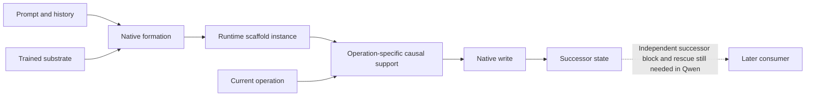

# Architectural paper: evidence review and trilogy reframing

The evidence supports a strong bounded architectural paper. The draft's central difficulty is that it gives several contributions nearly equal weight: reusable Qwen state, a comparative role vocabulary, predictive source programs, developmental observations, and Saturn's executable memory. A reader can recognize each result without recognizing the architectural object that connects them. The revision should name that object, center its strongest prospective test, and make the other results explain its consequences and limits.

The original goal remains the organizing principle: computation forms contextual causal structure over time; earlier work gains authority over later work; a current operation recruits changing support within that structure. The first paper establishes formation and committed-state authority. The bridge introduces reuse and dynamic participation. The architecture paper should test whether the organization of that formed state predicts new causal behavior.

This review incorporates three independent GPT-5.6 Sol/high passes: [technical evidence review](architectural-evidence-review-sol-high-2026-10-01.md), [critical review](architectural-critical-review-sol-high-2026-10-01.md), and [intent review](architectural-intent-review-sol-high-2026-10-01.md). Their dated addenda incorporate the newest prospective Qwen result. This document is synthesis, not an additional scientific sample or a manuscript rewrite.

## 1. Give each paper one new question

| Paper | Reader's question | Distinct contribution |
|---|---|---|
| [Time-emphasis paper](../../space-and-time-circuits/time-emphasis-paper.md) | How does earlier computation acquire later causal authority? | Source → ordered native formation → committed state → consumer; Qwen is central, with strict path-distributed FLUX as a separately bounded subtype |
| [Bridge paper](../bridge-paper.md) | How can formed state support different operations? | Reused causal interfaces and query-dependent authority motivate the scaffold/dynamic-support distinction |
| [Architectural paper](../architectural-paper.md) | What organization is instantiated by a history, and what does it predict? | Prompt/history-built runtime scaffold instances, prospectively recurring distributed causal profiles, live operation-dependent participation, and bounded executable consequences |

The third paper should explicitly link both companions. It should briefly restate the inherited formation and same-state/different-query results, then spend its main evidential effort on the microscopic discovery, prospective test, routing contribution, and structural counterexamples.

Suggested title: **Runtime Scaffold Instances: From Time-Formed State to Dynamic Causal Support**.

Suggested subtitle: **Prospective causal profiles and operation-dependent execution in a frozen transformer**.

This puts the transformer contribution in the title-level scope. Diffusion and Mamba can still provide valuable family-local comparisons without making the abstract promise one proved universal architecture.

## 2. Name the missing middle level

The current definition assigns both contextual state and the current operation's participation pattern to a “dynamic circuit instance.” Separate them:

1. **Trained substrate:** fixed weights, native modules, and potential read/write interfaces at a particular checkpoint.
2. **Runtime scaffold instance:** contextual state formed from a prompt and execution history, together with an intervention-supported account of its causal interfaces. This is the execution's particular instance, rather than the model's fixed physical graph.
3. **Dynamic support:** the routes, values, weights, sources, and timing made consequential by the current operation on that instance.
4. **Committed successor:** state produced by native computation and shown independently to influence a later consumer.

*This is a proposed organizing account. Existing experiments establish different segments at different cuts; they do not yet establish this entire chain in one joined Qwen assay.*

“Hardening” should mean acquired authority or persistence through the declared native continuation. It does not mean a weight update, irreversible freezing, or identical causal participation under every later question. Dynamic support also remains taxonomically open: the current evidence does not settle whether it belongs exclusively to a time or space circuit class.

A supplied symbol table is the experimenter's address map. It is not evidence that the model has an independently discovered native table of semantic symbols. Keep those two facts separate in the eye example and the executable programs.

A query-static fact store consumed through changing native attention remains a viable account of important Qwen results. The runtime-scaffold language earns content from formation, independently tested state authority, and prospective intervention predictions; it does not by itself establish a unique semantic graph or a new physical wiring mechanism.

## 3. Include the newly completed prospective Qwen panel

The [frozen protocol](../../../../saturn/experiments/2026-10-01-scaffold-confirmation/qwen-predictive/PREREGISTRATION.md) and [held results](../../../../saturn/experiments/2026-10-01-scaffold-confirmation/qwen-predictive/results/qwen-predictive-held-20ede7e6e0c0/context-analysis.json) materially strengthen the third paper. The held job completed at 23:23:44 UTC on October 1, after the draft version inspected for this review. Its absence should therefore be handled as an evidence update, not as a historical reporting error.

The assay freezes the discovery-derived signed causal effects at all 24 late coordinates, L22–27 × two K/V groups × K/V, before examining eight new context clusters: two lexical sets × two templates × two sentence orders. It uses native FP32 eager Qwen2.5-1.5B on CUDA with TF32 disabled. These are predictions of intervention consequences, not activation similarities. Context is the replication unit; bindings, operations, coordinates, doses, and thousands of branches are repeated measures.

The following numbers are context-summary medians over all rows. They are not a claim that every context or competent behavior wins every comparator.

| Operation | Mapped signed cosine | Matched coordinate permutation | Wrong-operation profile | Mapped raw RMSE | Operation-blind raw RMSE |
|---|---:|---:|---:|---:|---:|
| Color | 0.8135 | 0.0998 | 0.4854 | 0.1418 | 0.1372 |
| Identity | 0.9269 | 0.1121 | 0.7321 | 0.1559 | 0.1692 |
| Relation | 0.9541 | −0.0850 | 0.3668 | 0.0293 | 0.1496 |

The inference is **prospective recurrence of a distributed causal profile**, with the clearest operation-specific advantage for relation. It is more informative than treating the original two prominent coordinates as a complete invariant scaffold.

The counter-trends belong beside that claim:

- Identity's coarse site and reader ordering matches 8/8 contexts; relation matches 7/8. Color matches 1/8 site predictions and 0/8 reader predictions. The full profile travels better than these coarse summaries.
- Native competence is 15/16 color rows, 6/16 identity rows, and 15/16 relation rows. On the competent identity subset, the operation-blind comparator has lower raw RMSE and slightly higher cosine than the mapped profile. Do not use the all-row identity advantage as an unqualified behavioral generalization result.
- Size has no competent registered readout. Novel-operation prediction remains unavailable under this instrument.
- The 5% and 20% V-projection row permutations do not produce the expected degradation in competence-matched profile recurrence. They do not establish the learning origin of the specific organization.
- The [post-run verification](../../../../saturn/experiments/2026-10-01-scaffold-confirmation/qwen-predictive/results/qwen-predictive-held-20ede7e6e0c0/postrun-verification.json) resolves a retained frozen-verifier denominator complaint: 4,736 logical lane identities correspond to 4,691 content-addressed identities because distinct transactions can produce identical StateCuts. Final mechanics status is valid; the original complaint remains visible. Neither lane count is scientific n.

Add this result immediately after microscopic discovery and update the abstract, result table, prospective-work section, conclusion, limitations, evidence ledger, and cutoff metadata. A short findings document or transparent prose reduction should make the primary JSON readable without altering raw artifacts.

## 4. Promote three existing supporting records

**The anime eye edit supplies the visual explanation.** The [scene-editing record](../../../demos/scene-editing.md) shows a whole contextual target text stream installed at different denoising calls. Early installation moves composition more while leaving blue eyes; later installation reaches violet eyes with less whole-image displacement and visible collateral. At a separate terminating boundary, target current program alone gives eye-region projection 0.7124, incoming target register alone 0.4035, and both together reproduce the native joint RGB exactly. Use these as two related but distinct experiments: timing dependence and endpoint program/register authority. Neither establishes a universal isolated eye module or an independently mediated writer path. The intervention is target-assisted and full-stream.

**The prospective attention program strengthens live route/value evidence.** The [genome attention program](../../../../saturn/experiments/2026-09-09-genome-attention-program/FINDINGS.md) freezes an independently selected L22/GQA-group-1 address before 16 held color-retrieval rows with new names, wording, and order. Query-route and color-value changes have the expected signed effects on all 16 rows; opposed query dose has the expected sign on 15/16. The changes interact nonadditively. This is Qwen2.5-1.5B-Instruct, a different specimen from the main base-model panel. It supplies convergent route/value evidence and an exactly extracted attention computation, not a continuation of the exact base-model selector path or discovery of a compact semantic module.

**The persistent-object loop shows repeated consumption of native image history.** The [FLUX persistent-object program](../../../../saturn/experiments/2026-09-09-flux-persistent-object-program/FINDINGS.md) runs four edits in both orders across three fresh scenes and two seeds. Each episode consumes its own branch's previous generated RGB through the native VAE/reference path. Source-history and image-reference resets have distinct consequences; sparse operands can miss contextual geometry. This supports externally clocked consumption of model-produced state. Handles, grammar, operations, and register updates are host supplied. Order-dependent RGB also changes noise association, so it does not isolate a pure operation commutator. Preserve the record's novelty correction and failed bottle geometry.

These records should illuminate the Qwen result. They should not displace it with a diffusion-first narrative, which would recreate the user's original framing problem.

## 5. Recommended manuscript spine

1. **Opening problem and object:** explain why a final local read does not describe the formation of the state it consumes; define substrate, runtime instance, dynamic support, and commitment.
2. **Inherited causal anatomy:** a compressed E20 formation/block/rescue result and byte-identical-state/different-query contrast, linked to the two companion papers.
3. **Predictive organization in Qwen:** one-scene microscopic discovery followed immediately by the completed eight-context frozen-profile test, including its counter-trends.
4. **Live execution and boundaries:** corrected routing factorial, prospective Instruct route/value comparison, and alias/copy failures that constrain binding claims.
5. **Making the object visible:** eye timing and current-program × carried-register example; then compact diffusion/Mamba comparisons with family-local clocks.
6. **Executable consequences:** bounded held payload prediction and native state retention, followed by the limits of those constructive results.
7. **Scope, alternatives, and next causal cut:** learning origin, operation-blind competitors, generic late-interface explanations, and successor-state mediation.

Move the broad VM/tool inventory, campaign accounting, deployment/cost details, and host-consumer program demonstrations to appendices. Retain Pythia as a concise developmental trend or appendix. It does not prove acquisition of the particular Qwen scaffold. Preserve negative compiler and binding results where they delimit the corresponding claim.

Three figures would carry more explanatory weight than additional catalogue prose: the layered runtime-instance diagram; held 24-coordinate effect profiles beside their frozen predictions and controls; and the eye timing/program-register panel. Show context-level variation rather than just aggregate cosine bars.

## 6. Sharpen the novelty comparison

The current related-work section already discusses causal abstraction, function vectors, circuit tracing, QK interactions, image editing, and development. Add the direct comparison a reviewer is likely to raise against “prompt-built architecture”: fast-weight programming and in-context-learning mechanisms.

[Schlag, Irie, and Schmidhuber](https://arxiv.org/abs/2102.11174) establish an equivalence between linearized attention and fast-weight programming. [Olsson et al.](https://transformer-circuits.pub/2022/in-context-learning-and-induction-heads/index.html) analyze induction circuits that compose earlier key information with a later query. [Von Oswald et al.](https://arxiv.org/abs/2212.07677) connect constructed and trained transformers to in-context gradient descent in regression settings. These are related mechanisms and formulations, not evidence that the exact Qwen results are already known.

The comparison should state precisely what this study measures beyond those accounts: recipient-native formation followed by independent committed-store block/rescue; question-dependent authority of byte-identical stored interventions; and a discovery-frozen distributed effect profile tested on new contexts. [Function vectors](https://arxiv.org/abs/2310.15213) already supply reusable causal task representations, and [circuit tracing](https://transformer-circuits.pub/2025/attribution-graphs/methods.html) already supplies prompt-local computational graphs. The paper should locate its contribution against these specific results without claiming priority from a new class name. This review verifies those primary sources; it is not an exhaustive priority search.

## 7. Distinguish an editorial gap from a scientific gap

For the bounded paper, the immediate requirements are evidence inclusion, conceptual definition, stronger figures, and a clearer main claim. More broad runs are unnecessary.

For the stronger claim that the operation updates the scaffold and that updated semantic state governs a later operation, one link remains unmeasured in Qwen: **model-produced successor-state mediation**. Use a discovery-frozen policy to read or perturb a runtime instance, capture its native newly written K/V, then independently block and rescue those bytes before a later consumer. Hold the visible emitted token fixed where needed so its effect is separated from hidden-state carriage. Start with the smallest informative common-parent contrast; preserve all signed effects and matched controls instead of requiring a universal all-controls-win verdict. A further cycle would test repeated role-specific feedback.

Learning origin is a separate question. Until a suitable developmental or competence-preserving organization comparison supports it, describe the organization as **present in a trained checkpoint**. A shared universal cross-family role graph, autonomous semantic addressing, and a unique minimal circuit are additional research claims rather than prerequisites for this bounded paper.

## 8. Suggested opening and main claim

> A prompt leaves more than information for a transformer to retrieve. Native computation forms contextual state that gives earlier work authority over later operations. We call that state, together with its tested causal interfaces, a runtime scaffold instance. Its formation is temporal; its use depends on the current operation. The architectural question is whether the organization of this formed state predicts causal behavior in new contexts.

> In frozen Qwen2.5-1.5B, earlier supplied residual state initiates native formation of a later independently effective K/V store. The same installed store has different authority under different questions. A discovery-frozen 24-coordinate causal profile recurs prospectively across eight new context clusters, while coarse site and reader summaries have operation-dependent failures. Qualified routing interventions carry a bounded portion of selector effects with recipient-live values. These results support a runtime-scaffold account of formed state and dynamic causal participation; they leave learning origin and mediation through a newly written successor state open.

This wording preserves the intended realization: the object being read had to be formed, and that formed object can organize later computation. It gives the third paper an empirical advance over the bridge while keeping the unjoined update loop visible.

## 9. Changes made during this review

The architectural manuscript was left intact. The bridge's historical E6 interpretation was corrected to cite the newer causal-mask audit and qualified routing rerun; its old wrong-site inference was removed. The companion blog and prior review-response document now record that evidence qualification. Historical raw packets and original reviews remain unchanged. No new model experiments were run.
