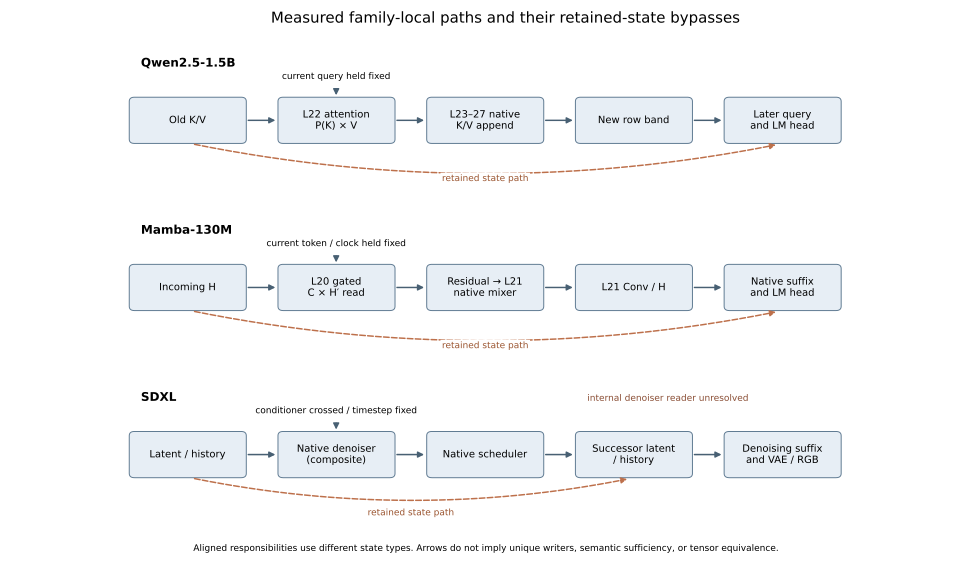
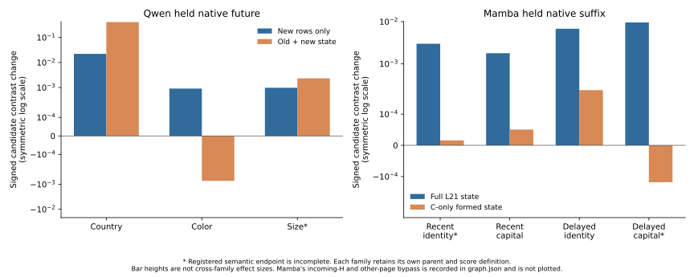

# Connected native graphs and controlled learning

The promised finite graph and native learning experiments have completed through mrun. They extend the architecture result in two ways: connected conditional formation can be compared across Qwen, Mamba and SDXL at a declared role resolution, and changes to selected native weights alter formed-state authority under the original model's consumer. Original pretraining onset, a universal microscopic graph and autonomous semantic control remain separate questions.

This update names the new packets **C7** and **C8**. It does not alter historical E1–E10, Q1–Q3, VM or C1–C6 identities, package totals, failed outcomes or the 18:22:25 PDT cutoff of the earlier 48-hour inventory. Directory dates are UTC October 2; these runs completed on October 1 PDT.

## C7: connected conditional native computation

The [campaign findings](../../../saturn/experiments/2026-10-02-common-causal-graph/FINDINGS.md), [derivation](../../../saturn/experiments/2026-10-02-common-causal-graph/MATH.md) and [checksum-bound graph](../../../saturn/experiments/2026-10-02-common-causal-graph/analysis/graph.json) distinguish incoming state, current operation, local computation, writer, newly formed state and native future. Family-local lowerings retain their other-state paths and unresolved components.

The factorial mixed effect is `J_X = X11 − X10 − X01 + X00`. Qwen crosses old K and V under a fixed current query, while Mamba crosses incoming recurrent H and transient C under a fixed target parent. Three nonjoint cells supply the local product forecast before the native joint cell is opened. This tests the exercised native read algebra; it does not predict unseen semantic operation weights without observing the context's local operands. The prior frozen 24-coordinate Qwen and 27-coordinate Mamba profiles provide the distinct semantic recurrence evidence.

In Qwen, restoring the L22 projected read makes newly appended L23–27 rows and their future exactly base. Independent new-band transfer into original old history changes country/color/size candidate margins by +.022184, +.000908 and +.000978. Keeping altered old history as well changes them by +.414038, −.000725 and +.002327. The color reversal shows why the new-memory and retained-history paths cannot be collapsed. Final native recall is competent in 2/3 held contexts; size emits `correct` rather than `small`. All greedy intervention answers remain unchanged.

In Mamba, C-only intervention changes the downstream writer while preserving the selected L20 clock, local write, incoming H and gate. Restoring that mixer's output before L21 restores the L21 Conv/H page exactly. Independent page transfer changes four held margins by +.002991, +.001782, +.006783 and +.009579. Restoring L21 alone leaves incoming-H and other-page effects of +2.188454, +2.069493, +3.543602 and +2.751816 relative to the same factorial00 parent. These are conditional contrasts, not additive mediation fractions. Two of four held rows have both lexical endpoints correct, within two fresh history pairs; all four numerical observations remain visible.

In SDXL, incoming latent and conditioner interact inside the native denoiser: mixed output L2 is 52.378 in development and 40.279 in one fresh held prompt/seed. The Euler-Ancestral writer is `M = S + (sigma_down − sigma_t) E + sigma_up noise`. Crossed captured E under fixed S changes formed M; actual scheduler and random-state closure are matched. Native real-arithmetic cross forecasts differ from BF16 execution by less than .945 L2. Each formed M independently transfers into a fixed step-5 parent and reproduces direct native RGB bytes exactly. Held watering-can/vase endpoints are recognizable, but appearance and background collateral remain. No isolated semantic mediation score is claimed. The internal denoiser reader/address is still composite.

Thus C7 adds a prospectively exercised coarse conditional-computation → native-writer → formed-state → future graph to C4's smaller state/consumer profile. It does not equate attention, recurrent reads and denoisers as tensors or identify unique writers. Source compilation, address selection and internal SDXL reads are not completely aligned. The actual local product forecasts disfavor the declared additive intermediate rival, while leaving other functional abstractions possible.

## C8: native endpoint continuation under a fixed original consumer

The [native timeline findings](../../../saturn/experiments/2026-10-02-native-role-learning-timeline/FINDINGS.md) and [local differential analysis](../../../saturn/experiments/2026-10-02-native-role-learning-timeline/LOCAL-LEARNING-MATH.md) concern controlled continuation from authenticated final weights. The inventory did not locate an authenticated ordered original Qwen/Mamba pretraining series in available custody. Pythia chronology and supplied Black Mamba organisms do not substitute for it.

The training objective is ordinary next-token cross-entropy on each full target-history-plus-query prompt, predicting its registered single answer token. The query-suffix margin is a consumer measurement. Four bounded AdamW update intervals edit Qwen L23 `v_proj` or Mamba L20 `x_proj`/`dt_proj`, with neighboring-layer, wrong-answer-label and no-op arms. Rank-eight projection applies to the gradient; the optimizer's actual displacement can have higher rank. Measured parameter dose is retained because equal learning rates produce unequal displacement. Four training rows and four delayed monitoring rows use the same England/Austria pair; eight France/Italy and Germany/Spain rows are previously opened longitudinal contexts. Post-selection state transfer uses two reciprocal directions of one Canada/Brazil pair, excluded from training and selection.

| Family | Selected-update monitor gain | Neighboring-layer monitor gain | Selected-state transfer, original consumer | Wrong-label state transfer, original consumer |
|---|---:|---:|---|---|
| Qwen | +.942175 | +.825873 | +.445127 / +.433943 | 0 / 0 after four rejected candidates |
| Mamba | +.345594 | +1.859491 | +.457836 / +.353975 | +.447735 / +.327154 after four accepted updates |

All selected and neighboring-layer arms accept four updates. No-op is exact. Selected-state restoration removes +.441001/+.433676 in Qwen and +.460770/+.351925 in Mamba under original C0 weights. Neighboring-layer updates can improve whole-model scores strongly while little of that gain transfers through the selected page. This locates a consequential formation channel without proving that it is uniquely privileged for learning.

Mamba's wrong-label result is a material countertrend: it preserves 8/8 longitudinal answer competence and nearly matches selected-state transfer. Correct-label-specific adaptation is therefore not established in that specimen by this experiment. Qwen's neighboring-layer longitudinal gain also exceeds its selected-layer gain (+.484643 versus +.426548). The result is causal alterability of formed-state authority, with specificity limited by the controls.

Writer-state and consumer effects both appear at the first accepted update. There is no resolved temporal birth order. For Qwen, fixed upstream hidden state gives `ΔV23 = ΔWv h23 + Δb`, while the local K/Q read stays fixed and later writes can change. For Mamba, `dH′ = rho dH + (B u − lambda rho H)d(delta) + delta u dB`, and `d(read) = C dH′ + H′ dC`. C changes the current residual and later pages without directly writing the selected H page. These derivatives explain immediate, coupled responses and why partial page blockers leave other paths.

Per-interval transfer freezes the current accepted parent consumer, which advances after promotion; those local contrasts are not cumulative original-C0 measurements. Only the final post-selection transfer/block panel fixes original C0 for every arm. Model-free candidate decoding finds first-step wrong-label/correct-label ΔW cosine .436 in Mamba and .098 in Qwen, with nearly equal norms. Coordinatewise Adam normalization partly explains equal norms; Mamba's greater direction overlap is consistent with generic shared-surface adaptation, while the semantic cause remains unresolved.

The corrected full run is `job-58b8ed5f2066`. Six Future Forests retain candidate states, optimizer/RNG closure, decisions and rejected Qwen futures. The smoke `job-7f9f51b4243d` suppresses held/fresh opening. The first full attempt `job-a74ca0df13f4` failed on an uninitialized collection list; its log and source capsule remain. Its planning geometry was also corrected to batch 1, T≤128 and explicit HF CUDA admission before the successful run. The fixed fresh pair's first prefix was partially executed in the failed attempt without a usable report; the corrected run is a blind mechanics rerun, with no retuning from its outputs.

The [independent custody audit](../../../saturn/results/native-role-learning-timeline/job-58b8ed5f2066/audit-custody.md) checks all nine submitted-source bindings, declared/executed/sealed payload identity, six five-node forest closures and decision chains, and the 29,089,591-byte retained archive. The [consumer-denominator audit](../../../saturn/results/native-role-learning-timeline/job-58b8ed5f2066/consumer-denominator-audit.json) traces the legacy `fixed_C0_consumer` field to its actual interval-parent versus final-original-parent source. Raw labels remain unchanged; the derived interpretation corrects their scope. Foundation weight bytes were hashed on Beast and are separately identified, rather than included in the small candidate archive.

## What is closed and what remains

The finite graph panels, scientific figures and controlled native update timeline are collected, with mechanics verification and checksum-bound raw data. C7 supports a shared coarse conditional-formation organization; C8 shows learning-induced changes in carried-state authority under fixed original consumers. They strengthen the paper beyond an isolated state/consumer comparison.

The new [combined run index](../../../saturn/experiments/2026-10-02-common-causal-graph/RUN_INDEX.json) binds primary reports, submission capsules, raw receipts, verifiers and derived figures. Its [model-free identity verification](../../../saturn/experiments/2026-10-02-common-causal-graph/index-verification.json) checks file bytes; it supplies no scientific effect or universality certificate and does not modify historical ledgers.

Original learning origin still requires authentic earlier weights or a newly trained native organism whose entire acquisition is recorded. Broader semantic generality requires additional competent operations and prospective profile predictions. Internal diffusion read/address localization and autonomous operation selection remain open. These boundaries qualify the architecture's extent; they do not erase the inherited circuit class or the bounded reuse, selectivity and formation results.
