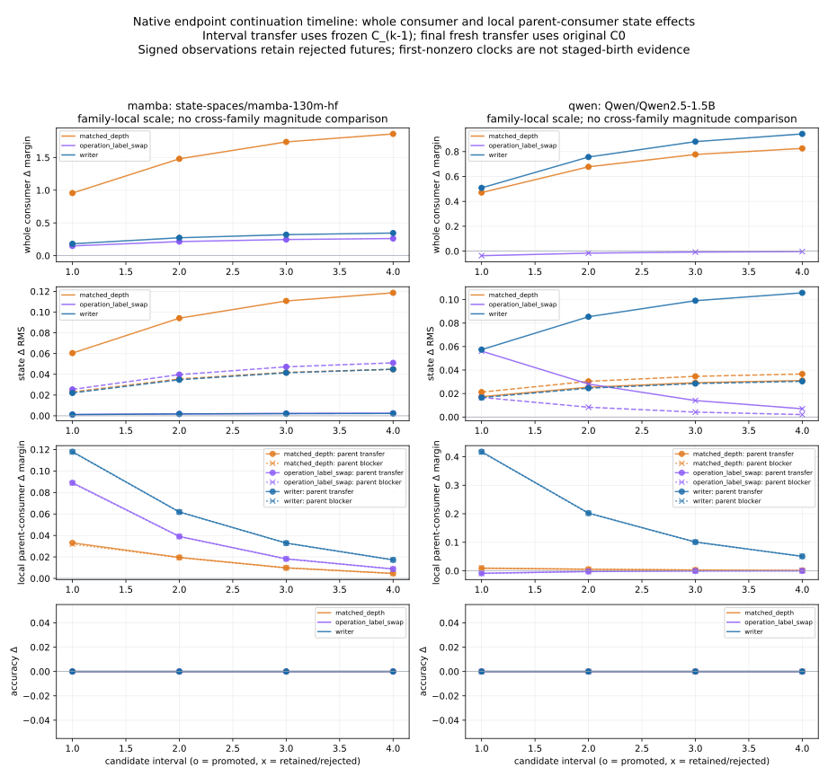

# Scaffolds and Dynamic Circuits

> **How to use this outline.** This is the outline for a bounded architecture paper and a broader research program. Each section separates collected results, working inferences, and experiments needed only for stronger claims. The draft must not convert a proposed experiment into a result.
>
> - **TODO [E#]** is a prospective experiment. Appendix A fixes the experiment IDs and required evidence.
> - **TODO [R#]** is an evidence audit, collation, or correction using existing records only.
> - **TODO [W]** is writing or figure work.
>
> The first prospective wave is `E1` diffusion, `E2` autoregressive transformer, and `E3` state-space model under `saturn/experiments/2026-10-01-scaffold-dynamic-circuits/`. Its shared contract is [`PROTOCOL.md`](../../../saturn/experiments/2026-10-01-scaffold-dynamic-circuits/PROTOCOL.md).
>
> `../space-and-time-circuits/paper.md` is the current scientific record for the predecessor story. Its updated mixed findings supersede several terminal-sounding statements in the original `space-and-time-circuits/outline.md`. In particular, a strict four-quadrant circuit occurs in some diffusion cuts but is not the criterion for the architecture proposed here.
>
> The space–time circuit-class foundation is inherited from that paper. This outline asks what reusable organization can be built from those circuits; it does not make the class depend on proving a universal architecture, autonomous feedback, or a compiler.

---

## Abstract and current claim

**Bounded result.** In frozen Qwen2.5-1.5B, a late K/V interface fixed by prior work causally supports identity, color, and spatial-relation operations across four lexical scenes. Changing the native query changes the causal authority of byte-identical stored state. A subsequent microscopic packet finds two recurring value routes and both grouped-query reader groups, with stable binding-relative profiles and different operation weights. Earlier source-residual seeding induces recipient-native late state that can independently rescue the answer; this formation path also works for Python return-value retrieval, with copying and aliasing exposing collateral and binding limits.

These results support a reusable **functional interface with dynamic causal support**. The invariant is a measured state/reader/consumer organization; the dynamic part is which source is read and how strongly each route contributes under a particular operation. A subsequent discovery-frozen 24-coordinate profile predicts unopened spatial-relation effects better than three fixed alternatives in all eight context combinations. Color transfer is partial and its reader-order prediction misses; identity and size expose registered-readout limits. A conventional attention lookup can implement this organization. Establishing causal reuse does not require inventing a new neural module.

The broader **scaffold hypothesis** connects source, current operation/address, transition, writer, carried state, and native consumer. A new Qwen packet closes a directed two-update semantic path in development and one fresh competent city/country holdout: the first formed state changes the next native prediction; replacing only that prediction's newly formed state, with its visible token fixed, changes the later semantic answer. Two other held contexts remain semantically unavailable. Prospectively comparable FLUX/Mamba assays and a later Qwen appendix support a partial formed-state→native-consumer core, with explicit attribute and competence limits. They do not establish one complete cross-family graph. Pythia supplies a developmental trend; strong Qwen value-projection disorder changes the signed profile, while chronological acquisition of this organization remains open.

**Precise route–writer–future attribution.** A separate FP32 Qwen2.5-1.5B packet traces an L22 route intervention using recipient live values into newly formed L23 K/V and a later native L23 reader. Across one development and three fresh held contexts, key-only transfer reproduces the altered attention weights exactly, while value-only transfer preserves native attention. L23's answer-margin contribution counteracts the positive total route effect; L24-only contributes positively, and the complete L23–L27 new-row band transfers or removes the future effect exactly. The bridge token is fixed and all greedy answers stay unchanged. This supplies a convergent signed write/read attribution, separate from the answer-changing two-update experiment and from universal semantic localization.

**Current status.** The bounded Qwen architecture result can be written from collected evidence now. Its coalition interface was fixed before transfer scenes; its detailed discovery head map and coding/copy/alias successors are exploratory, while the later profile, feedback, and route-attribution packets have their own prospective seals and held splits. Historical terminal labels remain unchanged. The older E6 attention wrapper has a documented causal-mask defect; its routing/competence/continuation effects are qualified historical instrument observations, not native causal evidence. The current feedback packet uses a different native token runtime and names its authority explicitly. Complete mediation for every operation or family, a universal graph, unique minimal heads, autonomous loops, donor-free compilation, and production virtual memory are not prerequisites for this paper's bounded result.

**Headline evidence.** [Fixed-interface and same-patch/query contrasts](../../../saturn/experiments/2026-10-01-qwen-scaffold-context-poc/FINDINGS.md) · [microscopic reader graph](../../../saturn/experiments/2026-10-01-qwen-head-edge-topology/FINDINGS.md) · [formation and replay](../../../saturn/experiments/2026-10-01-qwen-formation-replay/FINDINGS.md) · [companion draft](bridge-paper.md) · [blog](../../../obsidian/blog/2026-10-01-141628-the-question-decided-which-stored-fact-mattered.md).

**New confirmation campaign.** [Integrated findings](../../../saturn/experiments/2026-10-01-scaffold-confirmation/FINDINGS.md) · [frozen-profile predictions and weight disorder](../../../saturn/experiments/2026-10-01-scaffold-confirmation/qwen-predictive/FINDINGS.md) · [successive written-state feedback](../../../saturn/experiments/2026-10-01-scaffold-confirmation/qwen-feedback/FINDINGS.md) · [prospective FLUX/Mamba core](../../../saturn/experiments/2026-10-01-scaffold-confirmation/cross-family/FINDINGS.md) · [later Qwen appendix](../../../saturn/experiments/2026-10-01-scaffold-confirmation/cross-family/qwen-appendix/FINDINGS.md).

**New blog.** [The written state changed the next answer](../../../obsidian/blog/2026-10-01-170249-the-written-state-changed-the-next-answer.md) explains the prediction, serial-state intervention, weight comparison, and shared-core implications with links back to this outline and the related architectural posts.

**Precise attribution follow-up.** [Routing rewrote memory and changed the next read](../../../obsidian/blog/2026-10-01-175416-routing-rewrote-memory-and-changed-the-next-read.md) explains the new route-produced mediator, exact key/access relation, counteracting L23 score contribution, and distributed closure. [Findings](../../../saturn/experiments/2026-10-01-qwen-route-write-future-attribution/FINDINGS.md) · [signed analysis](../../../saturn/experiments/2026-10-01-qwen-route-write-future-attribution/analysis.json). This independently frozen packet is C5 below.

**Native Mamba architecture post.** [Shared memory and dynamic circuits in Mamba](../../../obsidian/blog/2026-10-01-210120-shared-memory-and-dynamic-circuits-in-mamba.md) develops the new result in detail: shared-history identity/capital queries, recurrent-only successor authority, development-frozen microscopic predictions on two new country pairs, coupled retention/write clocks, isolated read → residual → later-state mediation, and exact exported-VM resume. It connects the Black Mamba clock motivation to the native evidence, with the weak identity rows, unchanged greedy reader-swap answers, and remaining cross-family obligations retained.

**Graph and learning-time work already collected.** The [Qwen topology map](../../../saturn/experiments/2026-10-01-qwen-head-edge-topology/MAP.md) and [machine-readable graph](../../../saturn/experiments/2026-10-01-qwen-head-edge-topology/graph.json) resolve shared value routes and operation-dependent participation at layer/KV-component/six-query-head-group resolution; later Qwen and Mamba packets extend particular causal paths through formed successor state. E7's [six-checkpoint Pythia trajectory](../../../saturn/experiments/2026-10-01-scaffold-dynamic-circuits/development/FINDINGS.md) and C6's [four-checkpoint acquisition assay](../../../saturn/experiments/2026-10-01-connected-architecture/acquisition/FINDINGS.md) are completed learning-time experiments. The former shows a growing carrier effect alongside competence, while the latter has weak semantic endpoints and a stronger matched-depth control. C7 now exercises a prospectively held coarse three-family conditional-formation graph, and C8 records controlled native learning-induced change. The remaining obligations concern a fuller microscopic/address/feedback alignment and authentic original acquisition of the specific Qwen/Mamba organization; graph mapping and learning experiments themselves are already present.

**Connected-path campaign (includes later extensions).** The [new campaign](../../../saturn/experiments/2026-10-01-connected-architecture/FINDINGS.md) connects native formation and future consumption within each organism. Its completed Mamba lane freezes L0 source output and L18–20 writer state on development, then transfers to two new identity/capital contexts. Selected-state-only intervention produces donkey and a Vienna continuation, with a small nonselected-state bypass; immediate transfer is convolution-dominant. Its separate Pythia checkpoint assay has exact source/formed-row closure but weak semantic answers and a stronger matched-depth control. Qwen's corrected development/held C6 outcomes are complete, with weak generic forecast discrimination. SDXL's one 28-step development row and one frozen held prompt/seed now connect a state-conditioned writer, successor latent, later native writer, and RGB consumer; full live repair is exact. Its 12-step calibration remains separate. This campaign is separate from C1–C5 and does not turn a shared role vocabulary into a complete cross-family graph. For the fixed 48-hour audit, Pythia held and initial Qwen/Mamba development are in-window; Mamba held (18:24:13), corrected Qwen held (18:36:08), the Mamba S2 companion (18:38:34 PDT), and the completed SDXL extension are later evidence.

**The promised graph and native learning experiments are complete.** C7 adds a connected coarse Qwen/Mamba/SDXL conditional-formation graph with explicit retained-state paths. C8 records four native update intervals and independent state transfer under original consumer weights. These extend the older graph and Pythia records. Original Qwen/Mamba pretraining onset and a universal microscopic topology remain open; the learning experiment is controlled endpoint continuation. [C7/C8 evidence audit](graph-and-learning-evidence-2026-10-01.md) · [graph](../../../saturn/experiments/2026-10-02-common-causal-graph/analysis/graph.json) · [timeline](../../../saturn/experiments/2026-10-02-native-role-learning-timeline/FINDINGS.md).

## 0. What is established and what remains

**Native Mamba operation and clock follow-up.** The [completed investigation](../../../saturn/experiments/2026-10-02-mamba-operation-clock-debugger/FINDINGS.md) crosses identity and capital queries on byte-identical country-history state. A development-frozen 27-coordinate profile at L18–20 predicts effects on two new country pairs and two delays: capital wins against blind, wrong-operation, and coordinate-permuted profiles in 8/8 rows; competent delayed identity wins in 4/4. These are repeated directions within four pair-by-delay combinations. H-only successor delivery changes the answer in all 12 exact-qualified rows; Conv-only and immediate-output-only controls retain baseline. Four recent identity rows emit a generic phrase and remain visible. Separate clock contrasts show that retention and fresh-write changes can oppose each other, and reader participation shifts with the operation and answering boundary. This supplies a prospective, family-local reuse result beyond the older fixed-operation assay. The Black Mamba clock and spectral-address work motivates the questions; stock pretrained Mamba earns its roles through native interventions.

| Proposition | Current evidence and scope | Claim level |
|---|---|---|
| Space–time circuits provide the foundation | Predecessor paper's source/formation/store/consumer results and bounded path-distributed subtype | Inherited circuit-class foundation; universal architecture is a separate question |
| One fixed state interface supports several operations | Prior-fixed Qwen L22–27 across four lexical scenes; donor color 16/16, position 12/16, identity 11/11 available with five unavailable | Bounded causal result |
| Current operation changes which stored fact matters | Same parent and patch bytes, different native query; positive selective harm on 16/16 color and 16/16 position contrasts, medians 3.1305 and .5829 nats | Bounded causal result; directly answers context-dependent consumption |
| Shared reader routes carry different operation weights | Discovery L23/KV0/V and L22/KV1/V; both six-head GQA groups participate. Frozen relation profile beats three comparators in 8/8 new context combinations; color reader ranking misses | Bounded discovery plus prospective relation recurrence; no universal operation-specific map |
| Earlier source becomes independently causal carried state | Identity residual → recipient-formed late K/V → independent rescue/block; native formation also works for Python return-value retrieval | Bounded formation chain; supplied source/address, neither automatic addressing nor arithmetic computation |
| Successive written state affects later semantic answers | Native development color chain and one fresh city/country holdout; second-row block/swap/reinstall with first state and visible second token fixed | Bounded directed two-update path; 1/3 held contexts complete, host supplies queries; older E6 remains mask-qualified |
| A current route writes state that changes later native access and scoring | L22 route with recipient live values → formed L23 K/V → later native L23 attention; exact key-only access transfer, counteracting L23 score shift, exact L23–L27 band closure | Convergent signed causal trend in one development and three fresh held contexts; fixed bridge and unchanged greedy answers; terminal certification unassessed |
| Comparable responsibilities recur across substrates | Prospectively frozen FLUX/Mamba state/consumer profiles, n=2 each, plus later Qwen appendix n=1 competent of 3 | Prospective partial core; full shared role graph remains open |
| Final-checkpoint L22/L23 `v_proj` row correspondence supports this profile | Mild Qwen disruption mostly preserves it; full row permutation of those two value projections collapses signed shape, with competence losses | Bounded final-weight dependence; original pretraining acquisition remains open; C8 is controlled continuation and Pythia a separate developmental trend |
| Connected conditional formation recurs across native families | C7 operand/read restoration, downstream writer, independent new-state delivery and explicit retained-state paths in Qwen/Mamba/SDXL | Coarse prospective role quotient; composite diffusion read, small held denominators and competence limits |
| Native updates alter formed-state authority | C8 selected native surfaces, fixed-C0 transfer/block and neighboring/wrong-label/no-op arms | Controlled learning causation; dose/site/label specificity limited; original pretraining onset unavailable |
| State can be persisted, edited, and consumed again | Native residual/Thott/paged-KV/debugger tests; fresh-lease clean and edited numerical replay | Executable-memory mechanics, separate from semantic architecture evidence |
| A frozen Mamba source/writer map transfers as one connected native path | L0 carrier output → recipient-formed L18–20 C/H → later native read/update → donkey or Vienna continuation in two fresh contexts; exact reinstall, clock/depth/source/sign controls | Bounded joined path; convolution-dominant at this cut, nonselected-state bypass retained; post-held companion independently tests full S2 in the same contexts |
| The same Mamba history supports different operations with recurring microscopic effects | Frozen 27-coordinate L18–20 profile; two new country pairs × two delays × two operations × reciprocal directions; H-only successor authority in 12/12 exact-qualified rows | Prospective capital 8/8 and qualified identity 4/4 profile wins; recent identity counter-trends retained; different later cut from the Conv-dominant predecessor |

**Mamba reader and executable-memory closure.** Reciprocal transient-C swaps on two opened histories preserve the selected layer's memory/write/clock/gate exactly. Restoring its mixer residual output restores the complete future. At operation token 1, eight cells form altered downstream state whose independent S2 delivery reproduces the later numerical effect exactly; all greedy answers remain unchanged. Final-token swaps have larger, asymmetric margin effects that mostly survive norm matching, with one counter-trend. This is exploratory reader → residual → later-writer → state → consumer evidence, separate from the held profile. Real Saturn VM export and fresh-process native resume reproduce parent closure, layer state, and logits exactly; a nonzero H edit has a native effect and exact restore. Job-private working memory and the original archive export have different durability scopes. The [findings](../../../saturn/experiments/2026-10-02-mamba-operation-clock-debugger/FINDINGS.md) preserve those distinctions.

**What can be written now.** A bounded architecture account of reusable state interfaces, context-dependent causal participation, shared readers with different weights, recipient-native formation, and attributed route/read→written-state→future-access paths with signed distributed score contributions. Native Mamba now adds prospective multi-operation recurrence at its declared microscopic coordinates. No additional model run is necessary to report those collected results with their stated scope.

**The next discriminating tests have now run.** The frozen-profile test supports relation most clearly, color partially, and identity ambiguously under its registered consumer; size remains readout-unavailable. Strong value-projection disorder supplies a same-surface final-weight comparison, not a training timeline. The two-update packet closes one fresh competent semantic path. The separate route-attribution packet closes a particular write/read edge on three fresh held contexts, with counteracting L23 score effects and unchanged answers. C4 earns a partial state/consumer core. C7 now exercises a larger coarse conditional-formation graph, while the complete microscopic source/address/read/feedback topology remains unmatched. See §6, §8, §9, and §11.1 for the positive results and counter-trends.

**C7/C8 current scope.** The connected coarse graph and controlled native learning series have run (§8, §11.2). Qwen color has opposing new-memory/retained-history paths; Mamba keeps other-page bypasses. Selected-state transfer through original consumers is positive in both families, while neighboring-layer scores can be stronger and Mamba wrong-label transfer is similar. These observations narrow specificity without erasing connected formation.

**Extensions with their own evidence obligations.** Broader semantic feedback needs additional competent contexts and longer update chains. A complete common diffusion/transformer/SSM graph needs prospective alignment of currently unmatched source/read/write/feedback roles. Original chronological acquisition of the current Qwen role profile needs authentic earlier weights and a suitable same-assay comparison; C8 is the completed endpoint continuation experiment. Automatic semantic addressing, a general learned semantic compiler, minimality, independent-lab replication, and production-memory claims each have separate obligations. Existing exact native-source compilation and bounded in-family payload prediction are completed results, rather than compiler absence. None should be bundled into a gate for the bounded result above.

**Run/data audit.** The [receipt-linked status audit](evidence-status-audit-2026-10-01.md) confirms that frozen-context prediction, bounded two-update mediation, final-weight disorder, and a prospective partial cross-family core have completed. The cross-family manifest explicitly reuses studied checkpoints and operation families while holding out exact prompts/seeds. A previously unused checkpoint **and** task family, with frozen formation-site/consumption-site/null-profile predictions, remains a stronger combined test. That narrower extension must not be described as if the completed prospective tests never ran. The [48-hour coverage audit](experiment-coverage-audit-2026-10-01.md) and Appendix E also account for related address/read-join, commit-window, diffusion-cut, SSM-clock, numerical-format, FieldLM, and runtime experiments, including failed attempts and neighboring work with different claim authority.

**Instrument and corrective-lineage audit.** The [source/readout review](experiment-instrument-audit-2026-10-01.md) traces later coverage before labeling an earlier defect unresolved. It qualifies E10's bounded arithmetic parser, E2's signed ratios and quantized continuation scores, C4's different recipient baselines/endpoints, and connected-path custody and delivery checks. Historical raw rows and failed receipts remain intact; current interpretation and prospective harness repairs are recorded separately.

## 1. The proposed object

### 1.1 Functional scaffold

**Claim.** A functional scaffold is a reusable, intervention-supported organization of causal roles. Learning origin, temporal feedback, and cross-family alignment are stronger properties to test separately.

Let a family-local execution expose candidate sites \(V_m\) and causal relations \(E_m\). A scaffold hypothesis is a role graph

\[
G^*=(R,E^*), \qquad
R=\{\text{source},\text{current operation/address},\text{reader/live read},\text{transition/carrier},\text{writer},\text{carried state},\text{native consumer}\},
\]

together with a family-local lowering \(L_m:R\rightarrow V_m\). This paper separates the current operation/address from the live reader explicitly; the earlier six-role ABI can combine those responsibilities. The role names earn content through signed interventions at the declared cut. Source and store lesions plus downstream rescue are required to call a node a mediator; a bounded replacement or write assay can establish only the narrower causal role it actually tests. A role label inferred from tensor shape, architecture documentation, or causal order alone is a hypothesis, not a finding.

The base object is reusable across examples and operations. Its measured core can be a source→formed-state→reader→consumer chain. A feedback extension proposes that carried state at step \(t-1\) helps determine the next live read, whose writer commits state for a later update:

```text
semantic source + current operation
                 |
                 v
carried state_(t-1) -> live address / transition read -> semantic writer
                                                            |
                                                            v
              unchanged native consumer <----------- carried state_t
                                                            |
                                                            +----> next live address / transition read
                                                                   (feedback extension)
```

The **static role scaffold** is the recurring organization of possible causal roles at a declared resolution. The **dynamic semantic support** is the input- and state-dependent selection and weighting of sources, reads, writers, doses, times, and sites on one execution. The physical module graph supplies the substrate; interventions identify the functional organization on it. The bounded Qwen record identifies a reusable causal interface and portions of that role graph. It does not yet identify every internal edge or a unique writer.

**Case recurrence** is reuse of causal responsibilities across examples or operations; prospective confirmation freezes the profile before testing unopened cases. **Temporal feedback** means updated state causally changes a later read and write. The first does not imply the second. **Learned functional organization beyond a generic architectural bottleneck** requires a claim-matched prospective discriminator (§9); it does not require every conceivable null to pass. Ordinary attention is a compatible implementation, and learning-time acquisition is distinct from inference-time formation of contextual state. The inherited space–time circuit class does not depend on these architectural extensions.

**Existing support.** The Saturn role-portability ABI already names six roles and forbids tensor equivalence. More directly, FLUX format×ontology and cross-prompt panels find a recurring interior text spine and late image handoff while lexical addresses and temporal weights change. Object×scene factorials in FLUX.2 and Krea separate prospective semantic main effects from target-assisted exact interaction rescue and expose a possible reusable scene-composition correction. Scene-compiler audits argue for a source → binding → writer → register → decoder role graph across several diffusion families. The 206-node / 305-edge object recurring across three seeds records the physical execution substrate, but it is passive and cannot identify a learned functional scaffold by itself.

**Collected role evidence.** Qwen identifies the source at layer resolution, recipient-native identity formation, the late carried K/V interface, query-dependent consumption, and two recurring microscopic value coordinates. GQA-group causal rescue resolves reader participation at group resolution. The fixed coalition transfers to lexical scenes; the later frozen relation profile predicts new context combinations, with heterogeneous color/identity transfer. Whole newly formed rows close the bounded two-update feedback edge at all-layer row resolution. The passive 206-node diffusion object still supplies only physical structure.

- **E1–E3 collected bounded modules; E4 partially extended prospectively:** the original matcher remains post-hoc. The new campaign independently freezes a smaller state/consumer profile for FLUX/Mamba, with a later prospective Qwen comparison. Unmatched roles keep the complete graph open.
- **R1 bounded audit completed:** the claim ledger above and §6 distinguish measured roles from the open unique writer, individual query-head necessity, complete microscopic formation edges, and inferred family-neutral roles. Extend this inventory when new evidence is added.

### 1.2 Dynamic semantic causal subcircuit

**Claim.** A dynamic subcircuit is the context- and operation-specific causal support loaded onto a scaffold during execution.

For input context \(c\), current operation \(o_t\), and carried state \(s_{t-1}\), define a dynamic record

\[
D_{m,c,o,t}=\big(A,P,\alpha,\tau,M\big),
\]

where \(A\) is the source/address selection, \(P\) the semantic payload, \(\alpha\) dose or gain, \(\tau\) timing/order, and \(M\subseteq V_m\) the causally supported family-local sites. The record is semantic only to the extent that same-parent interventions produce directed effects through the unchanged native consumer.

Dynamic does not mean that weights change online. It means that the causal support used for one computation varies with the live input and history while remaining organized by a reusable role graph. Physical site reuse, activation variation, low-rank geometry, or exact replay alone is insufficient.

**Existing support.** FLUX `DynamicCircuitRecord` artifacts keep prompt/seed-specific sources and payloads distinct from the skeleton. The full-scene compiler observes static prompt source with depth×time-varying internal hashes. The Qwen dynamic-circuit assay preserves signed local effects and reports terminal status as `not_assessed`. Its development shared schedule captures only about 5–10% of per-cell delta energy and its leave-one-cell-out schedule similarity is heterogeneous, which is evidence against equating one clock with the entire dynamic program.

**New bounded result.** The prior-fixed Qwen L22–27 interface transfers across four lexical scenes and multiple operations. Byte-identical stored interventions become selectively consequential under different native queries. The microscopic discovery finds binding-relative recurrence and graded operation-specific weights in shared value routes. The subsequent frozen profile predicts relation on unopened context combinations, while color's reader ranking fails. Together these identify dynamic causal participation on a reused interface; they do not establish invariant detailed weights for every semantic operation.

- **E1–E3 collection status:** immutable per-row source/site/state, control, continuation, and native-endpoint records are retained for the components each lane implemented. Complete mediation and several shared-profile fields remain explicitly unmeasured.
- **TODO [W]:** show dynamic overlays on one role graph without implying that the entire graph fires for every input.

### 1.3 Current operation and carried state

**Claim.** Native output depends on the interaction of the current operation with state carried from prior execution.

The minimal assay crosses operation and state from matched same-parent rows:

| | native carried state | counterfactual carried state |
|---|---|---|
| native current operation | native continuation | state-only counterfactual |
| counterfactual current operation | operation-only counterfactual | joint counterfactual |

The evidence is the full signed 2×2 response, including interactions and rows where one factor dominates. A conjunction is a possible result, not a gate. Source-to-store mediation then asks whether carried state lies on the causal path from source/current operation to the native endpoint.

**Existing support.** Qwen E20 reports a bounded source-to-late-store mediation result in one identity organism. Mamba transition records show that the same recurrent payload can reach different continuation basins when the convolution operand or runtime changes. Coding mediation shows a frozen suffix consumer changing behavior under an incoming-state transplant. These are useful precedents with different cuts and limitations.

**Collected Qwen operation×state result.** The Qwen1.5 same-patch/query panel holds the parent and donor K/V bytes fixed while changing the native question. The differential state effect is positive on 16/16 color and 16/16 position contrasts. This establishes context-dependent consumption in that specimen. A numerically identical effect, conjunction, or complete mediation for every operation is not required. The three architecture lanes have not run a prospectively aligned version of this assay.

- **E1 completed module:** the cut-two suffix-conditioner × formed-latent factorial is retained as a two-parent causal contrast, not unique endogenous source→store mediation.
- **E2 completed module:** retain the finite residual/K/V role map and the bounded identity source → endogenous L20 K/V → eight-token continuation chain. Report its 4/4 answer rescue, 2/4 continuation-match improvement, and weak color transfer separately; do not generalize the identity result to every operation.
- **E3 completed module:** convolution-only, recurrent-only, and joint-state profiles plus native continuation are retained. The downstream write assay does not identify an upstream mediator.
- **E6 historical modules and correction:** the original custom attention wrapper lacked its matching causal-mask registration. Its measured route/write effects and native-competence labels remain historical instrument observations. The corrected routing follow-up supplies native-qualified single-row effects on already-open contexts, with effective fresh n=0. The new feedback packet separately closes successive formed-row semantic authority in development and one fresh competent holdout (§11.1); it does not rehabilitate the old wrapper.

## 2. What would be new

**Claim.** The contribution is discovered role invariance plus semantic causal support, not the generic fixed-weights/dynamic-activation distinction.

The paper must keep these levels separate:

| Level | What it says | Why it is insufficient by itself |
|---|---|---|
| Architecture graph | Modules and state interfaces recur by construction | It can be written down without data or learning |
| Fixed weights, dynamic activations | Inputs produce different activations under one checkpoint | True of almost every neural network |
| Recurring physical sites | Similar layers/steps have high energy or intervention effects | May reflect depth, scale, or generic bottlenecks |
| Reusable causal interface | A prior-fixed interface has native causal authority on new contents or operations | Establishes bounded reuse; it need not identify every internal role |
| Mediated role graph | A source changes recipient-formed state whose block/rescue changes the native endpoint | Requires formation, block, and independent rescue at the claimed edges |
| Predictive functional scaffold | A frozen role profile predicts held effects beyond claim-matched generic-site explanations | Collected most clearly for relation; operation-specific transfer remains heterogeneous |
| Learned organization | The functional profile depends on trained weight correspondence and is acquired during learning | Final-weight disorder supports dependence; chronology needs a suitable checkpoint comparison |
| Dynamic semantic subcircuit | Input-specific support on the scaffold directs an unchanged native consumer | Requires semantic counterfactuals and per-row native endpoints |
| Cross-architecture role graph | Family-local lowerings instantiate an aligned role topology | Requires within-family evidence first and forbids tensor equivalence |

The contribution builds on the predecessor circuit class: the same formed interface can support different operations, and the current query changes its causal relevance. The stronger frozen-profile discriminator now supports relation beyond the three registered alternatives, with partial color and readout-limited identity/size results. Ordinary attention-based retrieval is compatible with the observed architecture. A complete algorithm, unique graph, and chronology of learning remain stronger claims.

- **E5 collected:** report the frozen profile, fixed controls, context-level errors, and competence-conditioned counter-trends in §9. Strong weight disorder is a post-held same-surface extension; original pretraining acquisition remains open; C8 separately measures native endpoint continuation.
- **TODO [W]:** lead with interface reuse and selective consumption, then the prospective relation forecast and directed feedback path. Keep discovery graphs, each held split, and post-held follow-ups distinct.

## 3. Regime, architecture, and the accumulation axis

**Claim.** Autoregressive execution is a regime; transformer and SSM are architectures.

- An **autoregressive regime** repeatedly consumes prior state plus a current token/operation and commits new state before the next native output. A transformer or an SSM can run in this regime; the executor supplies token selection and cache advancement.
- A **transformer architecture** typically carries explicit attention K/V plus residual state. It can also be evaluated teacher-forced or in a one-shot prefill without testing native autoregressive continuation.
- An **SSM architecture** carries recurrent and often convolutional state. It can serve the same autoregressive regime through a different family-local state ABI.
- A **diffusion regime** repeatedly applies a denoising operation to carried latent state. Its temporal axis is denoising time rather than generated-token time, even when the role graph aligns.

The paper may compare the role graph across regimes and architectures, but it must not treat “AR” as shorthand for “transformer,” infer a transformer result from a teacher-forced-only panel, or claim the same clock/state tensor across substrates.

- **E2 collected:** the endogenous-store extension includes an eight-token native autoregressive continuation under the frozen role addresses.
- **E3 collected:** both Mamba sizes include the eight-token continuation contract under the recorded runtime ABI; the later-query supplement is native-incompetent.
- **TODO [W]:** use “AR transformer lane” and “AR SSM lane” where both regime and architecture matter.

## 4. Operational discovery and held-out confirmation

**Claim.** A prospective scaffold prediction must separate discovery from evaluation. Exploratory graphs and prompt successors remain valuable with their actual selection history reported.

The stronger confirmation design distinguishes four partitions; the collected lanes implement different subsets:

1. **Mechanics cells:** small rows used only to qualify replay, cuts, endpoints, and resource fit.
2. **Discovery cells:** contexts and operations used to rank sites, infer roles, fit family-local resolvers, and choose a finite role graph.
3. **Context holdout:** unopened contexts for operations represented in discovery.
4. **Operation holdout:** unopened operations, with contexts disjoint from discovery; an optional double holdout contains both new context and new operation.

For a prospective test, the discovery artifact freezes the profile being tested, site bindings or resolver, allowed doses, preprocessing, metrics, and inclusion rules before holdout outcomes are opened. Clean native competence may define row eligibility if the rule is frozen and uses no intervention outcome. Ineligible rows remain visible in the denominator as native-incompetent, not scientific negatives. All four partitions are unnecessary for an exploratory packet or a bounded claim that tests fewer axes.

**Role profile.** A lane records the signed vector its instrument actually measures. The shared superset includes source lesion, store lesion, matched repair, wrong-source, wrong-operation, sham/random, dose, timing/order, continuation, collateral, and mediation effects; a first-wave lane may populate only a declared subset. Role alignment must compare common observed components and preserve missing fields and unmatched roles. It cannot treat raw tensor cosine or normalized depth as a substitute.

**Support criterion.** The exploratory paper reports the distribution of held-out role-profile agreement and native causal effects. It does not collapse them to an omnibus pass. A later terminal claim may preregister a smallest consumer-aligned bundle after calibration.

- **E1–E3 collected:** each lane records a bounded discovery/held split and freezes its selection before held causal outcomes. The implemented partitions and causal components differ by lane and do not amount to the full common superset.
- **Later Qwen modules:** L22–27 was inherited from E20 before the coalition transfer panel; fox/cat is a mechanics/discovery pilot and three lexical scenes are same-policy transfers. The microscopic graph and coding/copy/alias successors are exploratory. They must not be retroactively described as a frozen complete-graph holdout.
- **Confirmation campaign:** the 24-coordinate profile and three prediction controls freeze before two lexical sets × two templates × two orders. The feedback held manifest freezes fruit/shape, city/country, and tool/material before their outcomes. Full-dose disorder and query calibration use opened contexts and are explicitly post-held exploratory. The Qwen cross-family appendix has a later independent prospective boundary; it does not enlarge the original FLUX/Mamba contract retroactively.
- **TODO [R2]:** verify that no prior result used as a discovery prior leaks its target rows into the new holdout manifests.

## 5. Diffusion lane

**Working inference.** A diffusion model may reuse a source → current denoising operation/address → carrier/writer → latent register → RGB-consumer scaffold while prompt-, operation-, seed-, and step-specific causal support changes. The records below identify bounded portions of this organization.

### Current supporting records

- The FLUX format×ontology recurrence panel crosses three prompt forms with three scene organizations. Its shared five-cell lattice recurs while prompt-local lexical addresses and temporal weights move; within-ontology profile similarity is stronger than same-format/across-ontology similarity. This is direct causal motivation for a recurring bus with scene-conditioned execution.
- The cross-prompt structural-grammar panel finds a recurring interior joint-text spine and late image handoff across color, containment, action, reflection, atmosphere, and objectless-field contrasts, with operation-dependent stream handoffs and substantial reversed-time counter-trends.
- Object×scene source factorials in FLUX.2 and Krea prospectively compose a held object/scene combination from three development cells. The images separate coarse semantic main effects from pixel-sensitive interaction, and an unrelated interaction sometimes improves RGB distance without inserting its semantics. This motivates a reusable composition/control grammar while leaving grammar specificity unresolved.
- FLUX full-scene compilation gives exact native RGB for three prospectively sealed prompts at one seed; the source is static while sampled internal carrier hashes change across depth and time.
- The scene-compiler portability audit reports exact family-local prompt compilation across five diffusion families, alongside an unseen-family compressed-span miss: the reusable role story is stronger than the claim that one coordinate basis transfers.
- FLUX.2 seeds `60664`, `19173`, and `84291` compile to one passive 206-node / 305-edge execution skeleton (`2026-08-29-rosetta-circuit-explorer`). This confirms repeatable physical structure but does not identify the functional grammar.
- The current space/time paper reports strict path-distributed diffusion instances and mixed results elsewhere. Those certificates are evidence about a subtype at particular cuts, not proof of the scaffold architecture.

**Recent predecessor diffusion assays.** The [off-route span sweep](../../../saturn/experiments/2026-09-30-flux2-offroute-span-sweep/FINDINGS.md) broadens FLUX.2 Klein4B support beyond the original route: the joint-text region carries effects that later single blocks generally do not, so the route is not unique. [Joint-region time accumulation](../../../saturn/experiments/2026-09-30-flux2-joint01-time-accumulation/FINDINGS.md), [residual deletion](../../../saturn/experiments/2026-09-30-flux2-residual-deletion/FINDINGS.md), and [ablation-method sensitivity](../../../saturn/experiments/2026-09-30-ablation-method-sensitivity/FINDINGS.md) separate source interchange from zero/mean/resample operators and correct the earlier interpretation of progress toward null. At the E1c residual/input cut, whole-region zero deletion reaches null; the E1b joint-region block-output zero arm stays near zero source progress. The stronger counterfactual-only interpretation is therefore superseded, while the cut/operator difference remains explicit. The [five-seed color replication](../../../saturn/experiments/2026-09-30-e7-flux-color-multiseed/FINDINGS.md) gives source recovery 5/5 under all-step interchange, null 5/5 under all-step deletion, and null 4/5 under route-residual deletion. Sham also reaches null, so deletion is not content-specific. Its scheduler label retains `flux2-residual-deletion-full-5seed`; source and report identify the E7 color panel.

**Family and attribute counter-trends.** [Klein9B](../../../saturn/experiments/2026-10-01-e8-klein9b-nine-gate/FINDINGS.md) repeats identity time-distribution at two seeds but misses a wrong-axis specificity condition; lighting includes a step-zero singleton that reverts the target and a weak sufficiency/dose seed. [SDXL's mug/clock assay](../../../saturn/experiments/2026-10-01-e9-sdxl-four-quadrant/FINDINGS.md) runs all 28 singleton times at one cut/seed: all-step write reaches .985 scene progress while no singleton write exceeds .215, yet steps 0–1 are individually necessary. That is a mixed temporal-write/early-necessity profile outside its registered strict time subtype. The cross-family boot/door rows in §8 separately retain disagreement between global RGB progress and local visual attributes. These results support family-, cut-, operation-, and operator-dependent organization; historical gate outcomes remain attached to their original instruments.

**Connected state-conditioned writer extension.** The [SDXL lane](../../../saturn/experiments/2026-10-01-connected-architecture/diffusion/FINDINGS.md) uses a source/read intervention at steps 0–4, an up1 main+skip writer cut at step 4, and native scheduler/step-5/6 writers followed by the VAE. It has one 28-step development row and one unopened lantern/bowl prompt/seed under the unchanged development freeze, each with 359 native UNet calls and independently verified mechanics/custody. Pre-cut recipient/native latent L2 is 100.9034 development and 45.1521 held. Stale operands differ from requested operands recomputed at the actual recipient latent. Installing the stale operands produces the exact native step-4 up1 output, yet a different successor latent and later native writers. Full live repair at all steps restores native PNG/RGB and later state/writer hashes exactly in both rows. The incoming carried state therefore remains consequential after an immediate writer match. This is a native joined fragment, without independent second-latent transplantation or a unique microscopic reader.

Native images retain clock/bowl identity but vary pattern, shape, contents, placement, and background. Count/material and unsupplied visual details remain imperfect. No-op/live/stale/wrong-sign whole-image requested-axis cosine is .6112/.6129/.7012/.5777 development and .8215/.8274/.8751/.8293 held; wrong-sign exceeds live on the held pixel score. RGB and ROI values are descriptors, not semantic certification. The separate 12-step calibration contributes 113 calls, not another held context. Sequential CPU offload preserves the native denoiser/scheduler/VAE authority; an unexecuted resident request and four pre-model startup failures remain in the custody record.

### Completed module and evidence still owed

**E1 completed bounded module: prospectively frozen diffusion address and two-parent dynamics assay.** The module pins FLUX.2 Klein 4B, BF16, a four-step 256×256 schedule, and the native scheduler/VAE. Two discovery rows—color and eye geometry—scan a prior-nominated five-boundary × four-step lattice under exact scalar replay. The worker freezes per-operation and global top-three address policies before it captures five held trajectories: two new color contexts, two new geometry contexts, and an unseen left/right relation, all under new prompt grammar and seeds.

Held rows install target-native deltas only at the frozen addresses. They retain a one-cell arm, the predicted and global supports, half and negative dose, wrong time, a norm-preserving roll, and an intervention-shaped exact base reinstall. This is target-assisted prediction of *where* a held semantic contrast has causal support; it is not autonomous payload prediction or whole-model discovery. A separate native cut after two denoising steps crosses suffix conditioner parent with formed latent parent. Its four cells measure two-parent dependence and interaction through final RGB/register output. They do not identify a unique endogenous source→store mediator.

**Implementation receipt and observations.** Smoke `job-2bd410aa468b` and full panel `job-8fea57981191` completed. The independent analyzer joins scheduler/request/source/model custody, reconstructs the freeze, checks all hook receipts and replay controls, preserves 438 physical denoiser forwards under the declared bound of 472, emits 107 derived evidence observations, and extracts unchanged PNGs. Frozen-support target-image progress is positive on all five held contrasts (`.626–.967`); all half-dose responses are positive and smaller (`.170–.325`), all negative-dose responses are negative, wrong-time effects are smaller (`.076–.198`), and norm-matched rolls are negative. Visual review adds an attribute-allocation qualification hidden by global RGB: eye color follows the suffix conditioner at the tested cut even though its global progress is `.145`, while the formed carrier retains red irises despite `.628` image-wide progress; relation and lamp geometry predominantly follow the formed carrier. The review is unblinded AI inspection and the relation edit has lighting/object collateral. `terminal_status` remains `not_assessed`.

An upstream text-address follow-up is collected separately. Its native-competent unseen relation row misses the predicted lexical-address effect (`-.045` RGB progress), so the current E1 record does not show that the downstream address recurrence is explained by one reusable lexical route. The later post-hoc address-scope diagnostic retains that miss, then finds target-like below placement when the whole active text block is transplanted (`.882` RGB progress). The nonlexical complement also moves toward the target (`.725`) but duplicates the glass; the row-permuted control is near base (`.054`). Single text ports at `t0` change composition with overlap (`.656–.713`), while `t1`–`t3` remain base-like. This localizes the failure to lexical scope versus broader text support at this cut, subject to collateral. It is not a frozen-policy held success, minimal relation circuit, or target-free compiler.

**What E1 can establish.** E1 supports a bounded within-checkpoint trend for prospective downstream causal-address recurrence, dose/sign sensitivity, and conditioner/formed-carrier attribute allocation. The upstream lexical miss keeps the live-address source explanation open. E1 cannot establish complete source/store mediation, a universal diffusion scaffold, minimality, a unique route, autonomous payload construction, or cross-family tensor portability.

## 6. Autoregressive transformer lane

**Bounded result and comparative hypothesis.** Qwen has a reused causal state interface, context-dependent readers, and recipient-native formation paths. Source/prefix, current query, transition/writer, formed store, and native LM-head continuation provide a transformer-specific role account; their alignment with other families remains a comparative hypothesis.

### Current supporting records

- `ArPrefixProgram` prospectively seals prompt K/V and reproduces eight-token native continuation exactly in Qwen2.5-0.5B and Pythia-70M; paired K/V row permutation preserves the tested function while breaking K/V pairing is causal.
- The Qwen native-skeleton/dynamic-circuit assay provides same-parent local and trajectory interventions on a bounded seeded successor-copy calibration. Its report is mechanically valid and explicitly leaves terminal status unassessed.
- The current space/time paper reports formed-store interventions, exhaustive late write/necessity profiles, and Qwen E20 source-to-store mediation. It also reports concentrated, redundant, and mixed writer profiles, so no symmetric all-transformer four-quadrant claim survives.

**Source/read and computed-object complements.** The [Qwen3 reverse-source pilot](../../../saturn/experiments/2026-09-30-qwen3-reverse-source-mechanism/FINDINGS.md) freezes an eight-head attention resolver on eight discovery sequences, then locates the correct physical source on 16/16 held sequences versus 1/16 for a fixed-position control. Nominated-source read deletion reduces candidate accuracy to 7/16; wrong-source deletion and exact pre-output-projection rescue give 16/16. The 48-candidate organism and supplied symbolic topology limit the addressing claim. The [Pythia recovered-loss panel](../../../saturn/experiments/2026-09-30-e4-pythia-recovered-loss/FINDINGS.md) separately tests a relay/writer triple in a later subset amendment on the same 320 previously evaluated held induction items, with layer-matched random sets: band mean-ablation recovery 1.023 and knockout .950, versus resample .942/.909. It identifies a bounded small head coalition among the tested subsets. The [computed-object panel](../../../saturn/experiments/2026-09-30-full-layer-sweeps/FINDINGS-E11-computed-object.md) covers 45 single-digit addition items in SmolLM2: operand necessity, late K/V commit, and query-residual writes have distinct peaks. A mixed late reader/writer profile is supported; arithmetic lookup remains an alternative.

**Address selection and the read join are separate obligations.** [E12 bucket/exact-address](../../../saturn/experiments/2026-09-30-e12-bucket-exact-address/FINDINGS.md), [E13 native read join](../../../saturn/experiments/2026-09-30-e13-time-circuit-read-join/FINDINGS.md), and [E18 bucket-to-commit reads](../../../saturn/experiments/2026-09-30-e18-bucket-join-time-reads/FINDINGS.md) show that a supplied subject or occurrence rule can select useful native rows, and an exact-row read can replace the usual localizer. Query-derived buckets contain the subject on 0% of the tested synthetic identity/color/coreference cases but on 100% of the admitted natural repetition cases. Gemma's sliding and global layers differ in sign. The [Sep 25-origin admission and ambiguous-cue audit](../../../saturn/experiments/2026-09-25-ar-exact-join-admission/HANDOFF.md) has new Sep 30 dose/full-vocabulary runs; its exact ordinal joins are supplied, and unit-versus-native-dose behavior diverges. These are positive bounded join results plus a concrete surface-cue limitation, rather than automatic semantic address discovery.
- Coding mediation provides a native test-harness endpoint in a small six-task organism, but model transplant, prompt route, formatting, and termination remain entangled.

### Completed module and evidence still owed

**E2: Finite AR-transformer role map plus endogenous-store extension.** The implemented Qwen2.5-0.5B module profiles every layer on discovery identity contexts with three typed assays: subject-position residual write, path-matched K/V write, and K/V cut. It freezes one selected and one wrong layer per role, then applies those addresses to a disjoint identity context and color prompts with exact restore, row shuffle, wrong site, and wrong source-layer controls. The sealed consumer is the full-vocabulary next-token head. Native-incompetent and denominator-inapplicable rows remain visible.

The continuation module reused the frozen early residual seed and L20 K/V address on four new identity and four new color rows. The early seed exactly reproduced all eight clean native identity tokens on 4/4 rows, including two native task mistakes. Blocking the formed L20 store reduced answer evidence on 4/4 identity rows; transplanting it into an unseeded path increased answer evidence on 4/4 and improved clean continuation match on 2/4. Median answer-gain recovery was `.793`. Color rescue was positive on 2/4, with median recovery `.083` and no continuation-match gain. This closes a bounded identity source → formed store → continuation chain with redundant routes; it is not operation-general.

An actual query×cache factorial sharpened that boundary. Coherent L20 caches carried fox, lion, and a wrong-donor dog into an animal query with `1.398–1.652` nat answer gains and a `1.844` nat source-specific margin, while the same band failed to convey red/green under a color query (`-.031` source-specific margin). The physical store is readable under one live operation and nearly unreadable under another.

**Implementation receipt.** Jobs `job-02e83e9ae183`, `job-24d2a7164160`, and `job-6a96dadc2701` are collected with exact matched no-ops and formed-store replay. The first map retains a non-specific K/V-cut counter-trend, and native color competence is heterogeneous. E2 cannot establish that every transformer uses the same physical store, that the identity chain generalizes to color, or that one late band carries every query-readable fact. `terminal_status` is `not_assessed`.

### Qwen2.5-1.5B architecture result

**Predecessor formation, commit, and mediation panels.** The space/time dossier's [E17 isolated writes](../../../saturn/experiments/2026-09-30-full-layer-sweeps/FINDINGS-E17-isolated-kv-writes.md), [E19 exhaustive windows](../../../saturn/experiments/2026-09-30-full-layer-sweeps/FINDINGS-E19-window-necessity.md), and [E20 endogenous mediation](../../../saturn/experiments/2026-09-30-full-layer-sweeps/FINDINGS-E20-mediation.md) strengthen the inherited foundation. In E20, 14 identities × three contexts yield 42 admitted, correlated rows: an L12 source-residual seed forms recipient-native L22–27 subject K/V, whose block removes a median .924 of the seed's target-logprob gain and independent rescue retains .871. A wrong identity's formed mediator authors that identity on 37/42 rows. Removal ranges .397–1.327 and rescue .695–1.055; these signed ratios are not unique causal percentages. All rows reuse an explored identity panel, rather than a new held split. E19 finds singleton necessity .08 versus L22–27 width-six necessity .96 for those 42 identity rows; color gives .89 on 22 rows. Qwen0.5 instead concentrates near a redundant two-layer band, and Gemma combines nonadjacent sliding-window layers with interleaved global-layer counter-effects. This is cut-specific support, not one universal depth schedule. The .81 isolated L23 identity write also keeps Qwen1.5 outside the strict low-singleton-write subtype.

**Reused interface and context-dependent consumption.** The completed panel reuses the L22–27 interface fixed by prior E20 on a fox/cat pilot and three same-policy transfer scenes, yielding 64 correlated query rows. Late queried fact-span replacement authors color in 16/16 rows and position in 12/16, while identity authors the donor animal in 11/11 available reads with five unavailable. Position replacement jointly swaps layout and is already supported earlier in 9/16 rows. When parent and K/V patch are identical and only the native query changes, query-selective harm is positive in 16/16 color and 16/16 position contrasts, with medians 3.1305 and 0.5829 nats. The optional position→color diagnostic is native-competent in 15/16 rows and places the donor color top in 7/16. The 128 directional matching checks cover 32 unique query pairs; they establish exact patch pairing rather than independent replication. Custody is receipt-level with identical patch manifests/digests; the original retained tensors are unavailable for a fresh offline rehash. [Blog](../../../obsidian/blog/2026-10-01-141628-the-question-decided-which-stored-fact-mattered.md) · [findings](../../../saturn/experiments/2026-10-01-qwen-scaffold-context-poc/FINDINGS.md) · [analysis](../../../saturn/experiments/2026-10-01-qwen-scaffold-context-poc/analysis/analysis.json).

**Shared readers with operation-specific weights.** The 204-branch native Qwen1.5 graph packet resolves shared L23/KV0/V and L22/KV1/V influence across identity, color, and relation. Signed profile recurrence across two queried bindings is .947/.927/.961; operation overlaps are graded (.749 identity/color, .336 identity/relation, .778 color/relation). Both six-query-head GQA groups have causal repair effects. Qwen has twelve query heads sharing two K/V heads: KV0 feeds Q0–5 and KV1 feeds Q6–11. Individual query-head necessity, unique minimality, MLP writers, and microscopic source-token-to-reader edges remain open. The four-token native continuation reaches the executor's autoregressive token/cache loop. This extends the original coalition map in one scene/order; prospective microscopic replication and repeated semantic feedback remain separate questions. [Head/edge findings](../../../saturn/experiments/2026-10-01-qwen-head-edge-topology/FINDINGS.md) · [graph](../../../saturn/experiments/2026-10-01-qwen-head-edge-topology/graph.json).

**Prospective microscopic extension.** The confirmation campaign freezes that discovery's 24-coordinate signed profiles and operation-blind, wrong-operation, and within-band coordinate-permutation alternatives before opening two lexical sets × two templates × two orders. Relation beats all three fixed alternatives in raw error in 8/8 context combinations; competent context cosine is .954 versus .566 operation-blind and raw RMSE .029 versus .149. Color's competent cosine is .839 versus .828, while operation-blind raw error is slightly smaller (.109 versus .119). Color's coarse shared-site ranking matches only 1/8 combinations and reader ranking 0/8. Identity has six competent native binding rows out of sixteen; operation-blind is better on the four contexts with any competent identity row. Size is native-readout unavailable. The fixed generic coordinate permutation is poor across operations, but post-run LOCO generic A/B/reader ordering succeeds descriptively in 8/8: the prospective full profile is more discriminating than the coarse rank alone. These are bounded predictive recurrence and counter-trends, not an invariant map for every operation. [Predictive findings](../../../saturn/experiments/2026-10-01-scaffold-confirmation/qwen-predictive/FINDINGS.md).

**Recipient-native formation.** In the original panel, a supplied clean L12 identity residual produces recipient-native late state: independent anchor rescue yields the target in 16/16 generated reads and block-back yields the donor in 14/14 available reads. The later mechanically valid 247-arm, eight-case panel retains native source-token layer cuts and resumes residual writes through unchanged later layers. L11 is the post-layer cut entering L12. Full seeding gives the clean registered value first in 8/8 cases; norm-matched random writes give the donor first in 8/8. Scene identity and Python return values both close seed → recipient-formed L22–27 anchor → independent rescue → block in two prompt structures. The coding cases change consumer syntax as well as source order, so their difference cannot isolate an order effect. Copying has collateral/order effects; aliasing separates full-residual success from failed anchor-only rescue and exposes binding selection beyond the supplied source anchor. Source addresses and clean residual payloads are host-supplied. These experiments map source-to-state formation at layer resolution, while a complete microscopic writer path remains open. [Formation synthesis](../../../saturn/experiments/2026-10-01-qwen-formation-replay/FINDINGS.md).

**A particular route-produced write and future read.** C5 independently intervenes on the L22 final-query attention row, using recipient live values, and captures the new L23 K/V produced by the query colon. Stored K/V through L22 is exact; the L22 attention row is changed, followed by L23 and later stored state. Transferring the changed L23 key reproduces later attention exactly at every measured query head; value-only transfer leaves that attention native. L23 score effects counteract the positive total route effect in all four contexts. L24 contributes positively and the complete affected L23–L27 row band closes exactly. This localizes a write/read edge and its signed influence, while individual L25–L27 credit and a complete microscopic formation path remain open. The fixed attribute bridge and host query make it a controlled attribution assay; all final greedy answers remain expected. Full contrasts and controls appear in §11.1 and the [attribution findings](../../../saturn/experiments/2026-10-01-qwen-route-write-future-attribution/FINDINGS.md).

**Prompt and instrument limits.** The source-line bundle is redundant in this source-step geometry because added pre-anchor rows were unchanged. A labelled-copy successor is natively competent in both orders, with one rescued continuation changing the second binding as collateral. A subtraction assay with independent 7/9 source and 6/8 output registries is mechanically valid but has unavailable native numeric readouts. Return-value retrieval therefore supplies the coding result; transformed arithmetic remains unestablished. These are exploratory successors rather than disjoint confirmatory holdouts. Formation during inference does not measure acquisition of the scaffold during training.

**Executable memory receipts, separate from the semantic result.** Real Qwen tests exercise residual eviction/hydration, LiveStateCut query/reopen, Thott shared/append/fork/restore, paged-K/V copy-on-write and native consumption, and debugger preview/abort/commit/restore/replay through an experiment-local residual delegate. A fresh lease reopens the physically bundled Thott parent/append and debugger residuals; clean and edited branches reproduce full logits/K/V/token hashes exactly. Historical debugger cuts omit staged K/V and parent-chain custody, so numerical closure comes from the joint bundle and chain equality is not claimed. The complete shipped durable-cut API, spectral semantic-address execution, MinIO serving, CUDA VMM integration, and continuous batching are unexercised here. These receipts make the intervention and replay machinery concrete; they do not independently establish a learned semantic scaffold. [VM audit](../../../saturn/experiments/2026-10-01-qwen-formation-replay/VM_CAPABILITIES.md) · [updated blog](../../../obsidian/blog/2026-10-01-141628-the-question-decided-which-stored-fact-mattered.md).

The new feedback packet additionally captures complete physical parents and staged K/V through LiveStateCut storage and restores cache/logits/token exactly in its resident runtime. This is same-process durable closure; it is distinct from the earlier fresh-lease joint-bundle result. Its fused TokenMachine path constructs native causal masks; a separate L22 decomposed observer reproduces that capture exactly. Monolithic `model.forward` parity on every cycle and production serving remain unclaimed.

## 7. Autoregressive SSM lane

**Working inference.** An SSM may instantiate comparable roles with token events, current input, ordered convolution/recurrent transitions, native state writes, carried state, and the unchanged LM-head continuation. E3 identifies bounded state-write profiles, rather than the full aligned graph.

### Current supporting records

- Mamba transition-source compilation reports depth-wide relation-delta alignment (`0.9792–0.9874`) across six held relation/entity cells, but strict native competence admitted only two held semantic cells.
- Recurrent-only and conv+recurrent programs behave differently on long continuation. A historical/current runtime discrepancy reversed which operand gave longer agreement, motivating the execution-ABI fingerprint and prohibiting unsealed state portability claims.
- Full Mamba sweeps in the current space/time paper found a locally decisive late writer/retention latch rather than a strict distributed four-quadrant circuit.
- The role-portability ABI already lowers common role names to Mamba-native `(conv, recurrent)` state and forbids tensor equivalence with transformer K/V.

**Full sweeps and clock attribution.** The [full-layer sweep](../../../saturn/experiments/2026-09-30-mamba-full-layer-sweeps/FINDINGS.md) supersedes the sampled [state-cut certificate](../../../saturn/experiments/2026-09-30-mamba-state-cut-certificate/FINDINGS.md) for current subtype classification. Maximum identity necessity is .813/.666/.665 at 130M/370M/2.8B; 2.8B counting gives .403, with substantial singleton writes. None earns the strict four-quadrant subtype under the complete sweep, while the causal late latch remains a positive mechanism result. The [writer-clock follow-up](../../../saturn/experiments/2026-09-30-mamba-writer-clock/FINDINGS.md) supports unusually surviving state at these sites rather than an unusually large raw write; input-dependent clock attribution remains open. Earlier passing labels are retained as historical sampled outcomes.

**Approximate quotient versus exact state closure.** The [Black Mamba quotient study](../../../saturn/experiments/2026-09-30-black-mamba-quotient-theorem/FINDINGS.md) derives a full-rank exact quotient for distinct diagonal clocks and measured full-rank writes in three previously trained `local_ssm` toy checkpoints. Yet balanced rank-16 state agrees with .984–.991 of original reader decisions, versus .652–.686 for an exact-clock coordinate quotient. Clock tying still leaves full write rank. This separates consumer-preserving approximation from exact transport closure. It is a laptop CPU replay without mrun/Saturn custody, not a new certified pretrained-Mamba result; its supplied/supervised organism is distinct from stock Mamba.

### Completed module and evidence still owed

**E3 completed bounded module: prospective AR-SSM state-write scaffold assay.** The Mamba module captures complete convolution/recurrent state immediately after one changed carrier token. Discovery profiles every layer with generic `(C,H)` necessity, target `(C,H)` write, recurrent-only write, and convolution-only write. It freezes a three-layer band, then evaluates new identity/counting contexts and an unseen capital operation with target joint/recurrent/convolution state, wrong source, wrong layer, wrong sign, depth shuffle, uninstall, native log-probability effects, and eight-token continuation. The same finite assay is collected independently at 130M and 370M checkpoints.

This module identifies a downstream family-local state-write profile at a declared cut. It does not lesion an earlier source and restore a downstream state in the same parent, so it must not be reported as complete source→store mediation. Native-incompetent counting rows and a continuation/first-token admission disagreement remain part of the evidence.

**Implementation receipt and observations.** Corrected jobs `job-2bde6a0f47c7` (130M) and `job-ee475fa35dee` (370M) independently select late three-layer bands. Prompt-local convolution state carries most immediate lexical-source transfer; recurrent-only replacement is weak. Held identity and capital continuations change toward donor subjects/countries, early-layer and wrong-sign controls are weak, and coherent wrong donors produce coherent alternate subjects. Counting rows are native-incompetent and remain visible. The later-query supplement `job-44ac3efae7bf` is mechanically valid but lacks paired native semantic competence in both its primary and predeclared alternate organism, so it is `not_applicable`, not a negative architecture result. The supplement's diagnostic shift toward recurrent state is consistent with cut-dependent operand allocation but has no semantic authority. E3 can support a bounded role-recurrence and operand-specific state-write trend. It cannot establish optimized-kernel portability, universal SSM behavior, equivalence to transformer K/V, or a fully mediated endogenous path. `terminal_status` is `not_assessed`.

**New connected Mamba result (post-window held extension).** [The prior-mechanism audit](../../../saturn/experiments/2026-10-01-connected-architecture/mamba/MAMBA_PRIOR_AUDIT.md) reuses full-layer source/writer localization and the native immutable state ABI. Development selects L0 carrier output and L18–20 post-transition state before two new contexts open. In the [held run](../../../saturn/experiments/2026-10-01-connected-architecture/mamba/FINDINGS.md), both untouched base/target pairs have exact native answers. Target-native carrier output makes the recipient form state; selected-state-only transfer changes the identity answer from monkey to donkey and the capital continuation to “in the city of Vienna,” with fixed supplied suffix. Target-minus-base margin gains are +4.5906 and +7.6479. Restoring selected states removes +4.6725 and +7.8029 of the coherent branch's conditional effect while leaving +0.5045 and +0.7123 through nonselected carried state. These overlapping contrasts are not causal percentages.

Conv-only transfer retains the immediate semantic change; recurrent-only, early-depth, and clock-matched controls stay near baseline. The first later native mixer read and state write change, and six continuation tokens are native-generated. The clock match is diagnostic, not perfectly clock-equivalent. The capital intervention starts with `in`, whereas the native full-target rescue starts with Vienna; exact registered first-token accuracy and semantic continuation are separate endpoints. Stock pretrained Mamba, supplied spectral identity algebra, and supervised Black Mamba organisms retain distinct authority. This connected result extends E3; it does not reinterpret the older weak query organism as a scientific null or establish a universal spectral addressing mechanism.

**Post-held S2 dissection (post-window extension).** A companion on the same two opened contexts has `n_new=0` and adds no new context or prospective replication. It restores all carrier C/H to baseline and removes the bypass exactly, then independently swaps the complete state formed by the first future token. The identity row retains thirteen original supplied suffix tokens: S2-only replacement reproduces donkey, complete logits, and continuation exactly; coherent current output with complete baseline state yields monkey exactly. The capital row has no original remainder, so a sealed non-answer ` located` token supplies a diagnostic consumer. S2-only yields “in the city of Vienna,” while baseline state yields “in the city of London,” with exact reciprocal closure. Registered candidate ranks are low at that position; this is a post-held continuation diagnostic, not another exact-answer holdout. The native S1 → update → S2 → later consumer edge is independently exercised at full-state resolution; minimal writer, same-history operation crossing, and automatic addressing remain open. [Companion report](../../../saturn/experiments/2026-10-01-connected-architecture/mamba/results/post-held/run-5c64bca7a16d/report.json) · [independent verification](../../../saturn/experiments/2026-10-01-connected-architecture/mamba/results/post-held/run-5c64bca7a16d/verification.json).

## 8. Cross-architecture extension

**Claim.** The same abstract role graph may recur across diffusion, AR transformers, and AR SSMs even though their tensors, sites, clocks, and state sizes differ.

Coarse source/transition, carried-state, and consumer responsibilities already have convergent support across the records. C7 below now prospectively exercises a coarse conditional-formation graph. A full microscopic alignment remains a stronger extension. E4 is necessary for that cross-family claim, not for the bounded Qwen interface result.

**Hybrid architecture comparison.** [Falcon-H1 E14](../../../saturn/experiments/2026-10-01-e14-hybrid-attn-ssm/FINDINGS.md) provides a parallel attention/SSM specimen rather than an inferred bridge between separate models. On 22 admitted identity rows, whole attention-state cut flips 17 answers and SSM cut flips two; on nine admitted color rows out of twenty, attention flips eight and SSM none. The best width-six attention window carries .715 of the identity effect. This supports attention-dominant storage at these cuts with weaker SSM participation, not a general absence of an SSM role. Dedicated mechanics verification is present, but the top-level evidence target is empty and terminal certification remains unassessed.

The cross-family object is a graph of causal roles plus assay relations:

```text
semantic source
    -> current operation / live address
    -> family-local transition and writer
    -> carried state
    -> unchanged native consumer
```

For prospective confirmation, fit the alignment on discovery records and evaluate unopened, competent family-local assays. Compare common role-profile directions, mediation structure where measured, operation/state interactions, timing order, continuation behavior, and counter-trends. Exploratory alignment can use opened records if labelled as such. Do not compare raw logits, tensor cosine, hidden dimensions, normalized depth, or site names as if they were one representation.

**E4 partial prospective extension collected.** The new campaign freezes a smaller common profile before its FLUX/Mamba held outcomes: state-block remaining, coherent rescue, actual wrong-time/depth, and intact joint parent. Two held rows per family give mean profiles FLUX [.0845, .8073, .1589, 1] and Mamba [.0803, .9065, .0020, 1]. Causal-role RMSE .0928 is smaller than the frozen role-permutation .8526; the joint coordinate is normalized to one and is not independent evidence. A separately sealed later Qwen appendix has one paired-native-competent city/country row out of three: [.0076, .9585, .4939, 1]. Its competent pairwise alignment favors the causal map against both families. Its all-row diagnostic reverses that comparison when an incompetent tool target and a small base-to-target parent-contrast normalization denominator inflate the wrong-depth ratio. Both views remain visible. [FLUX/Mamba findings](../../../saturn/experiments/2026-10-01-scaffold-confirmation/cross-family/FINDINGS.md) · [Qwen appendix](../../../saturn/experiments/2026-10-01-scaffold-confirmation/cross-family/qwen-appendix/FINDINGS.md).

**Comparison qualification.** FLUX rescue installs target latent with base conditioning and uses RGB distance; Mamba rescue installs target state in a generic parent and uses answer log-probability margins. The shared RMSE is an algebraic comparison of normalized descriptors, with family-specific lowerings and an invariant joint coordinate. It does not measure commensurate causal strength or certify a matched common factorial. Report rows, measured components, fixed components, raw contrasts, and undefined ratios separately; preserve signed counter-trends without an arbitrary effect gate.

**Native endpoint qualifications.** Blinded FLUX review finds a mostly blue boot rescue with yellow panels, and an arched door produced by either current conditioning or formed state; global RGB understates the current-only local shape effect. Mamba's zebra rescue shifts the target score but first generates `small`, whereas Athens rescues exactly. Qwen's reverse-depth arm generates `1`, France rank 8,377, despite a sizable normalized candidate-margin shift. These are actual same-destination stress controls, not behavior-matched alternative architectures. The earned common edge is family-native formed state → unchanged native consumer. Current-operation/read, source mediation, minimal writer, and feedback are not completely matched.

**C7 connected conditional graph collected.** Qwen crosses old K/V with current Q fixed; Mamba crosses incoming H and transient C with current mixer input, clock, local write and gate fixed. SDXL directly crosses incoming latent and conditioner at a fixed timestep. The [new campaign](../../../saturn/experiments/2026-10-02-common-causal-graph/FINDINGS.md) exercises family-specific context/operands → local native computation → writer → formed state → future at Qwen L22/L23–27, Mamba L20/L21 and SDXL cut 4/5. Qwen and Mamba local product forecasts are independently replayed from raw nonjoint operands; read restoration restores downstream state exactly. SDXL's complete denoiser remains composite, while captured denoiser output crosses the actual Euler-Ancestral scheduler and independent successor transfer is RGB-byte-exact. Qwen and Mamba retain consequential other-state paths; Qwen color's new-row effect opposes retained-history contribution. The held denominator is three Qwen contexts, four Mamba rows within two history pairs, and one fresh watering-can/vase prompt/seed. Qwen final recall is competent in 2/3 contexts and Mamba base and target lexical endpoints jointly correct in 2/4 held rows across two history pairs. Recognizable SDXL endpoints have collateral, with no isolated semantic score. This is a coarse connected graph with unresolved addressing/read components, rather than the complete microscopic universal topology. [Graph](../../../saturn/experiments/2026-10-02-common-causal-graph/analysis/graph.json) · [Reconciliation](graph-and-learning-evidence-2026-10-01.md).


**TODO [E4 microscopic full graph]:** extend the prospective alignment to the currently unmatched roles on competent family-local assays. Preserve family-specific edges and compare only commonly observed relations. The partial core does not identify the entire hypothesized topology.

**C6 joined-fragment extension.** The later connected campaign adds native source/state/future fragments within each family: Qwen route-produced late rows, Mamba recipient-formed C/H and independently intervened first-future S2, and SDXL state-conditioned writer/scheduler/later-writer trajectories. Their resolutions and controls differ. They strengthen formation followed by native future consumption beyond the original four-number C4 comparison; they do not supply a single prospectively discriminating current-operation/address/read/write map. Mamba's frozen source/writer signs transfer to two fresh contexts; the Qwen composition forecast wins only 1/3 against blind and ties additive; SDXL contributes one fresh held prompt/seed and visual collateral. Preserve those denominators and unmatched roles.

**Historical diagnostic, not prospective confirmation.** A post-hoc signed-profile matcher used already opened held rows, and the SSM side pooled discovery and held cells while aliasing joint `(C,H)` controls to transformer roles. Its lowest-cost mapping—residual → convolution, K/V writer → joint state, K/V cut → recurrent state—was only `.0386` better than the next assignment and nearly tied a depth-based null. This historical ambiguity is retained. The new smaller prospective core does not retroactively qualify that matcher or close its full graph.

**Possible outcomes.** Full alignment, a smaller shared core plus family-specific roles, or no useful common graph are all reportable. A shared core would not imply a universal circuit or tensor ABI.

## 9. Minimum discriminating tests for stronger claims

**Claim.** The bounded causal interface result is already supported. A stronger predictive role-graph account should forecast unseen causal effects beyond generic late attention reuse. Predictive structure and learning origin are separate claims.

**E5 collected; frozen design retained below.** The confirmation campaign implements the microscopic prediction on unopened context combinations, with registered operation-blind, wrong-profile, and coordinate-permutation forecasts. Its full signed relation result is strongest; color/identity/size are heterogeneous as reported in §6. The original discovery protocol is:

1. Freeze the current microscopic sites, source/store/read assignments, and signed profiles before opening new contexts/orders for identity, color, and relation. Retain exact parent/patch identity when testing query-dependent relevance. For a semantically different operation, preregister a coarser shared-route prediction or freeze an explicit operation-to-profile resolver; the present record supplies no resolver for unseen operation weights.
2. Compare that prediction with a site/depth-matched profile and an operation-blind profile. Match intervention size and dose; activation energy or graph degree can refine the site match when they are the specific alternative explanation, rather than becoming additional mandatory tests.
3. Measure native semantic continuation, signed answer effects, collateral, and newly written state where a writer is claimed. Preserve incompetent and unavailable rows. Source-lesion, recipient-formed-store block, and independent rescue are needed where predicting a complete formation graph; color is a useful prospective complement to the already collected exploratory identity/coding chains. It is not required merely to test microscopic reader recurrence.

The question is whether frozen roles predict **which patch matters under which query and what downstream state forms**, better than the matched comparisons. This is a scientific discriminator, not an omnibus exploration gate. Profile agreement, magnitudes, counter-trends, and effective sample size remain visible.

**C7/C8 update.** The coarse conditional native graph and controlled native-weight continuation have now run, with independent formed-state delivery and original-consumer contrasts. Their role boundaries and controls are in §8 and §11.2. Original pretraining onset and full microscopic alignment remain distinct obligations.

**Additional claims and current tests.** Qwen's same-surface final-weight disorder now demonstrates dependence of the signed profile on the tested value-projection correspondence (§11.2). Pythia supports a separate developmental trend; neither establishes Qwen acquisition chronology. Successive semantic feedback is now boundedly established in development and one competent held context (§11.1). E4/C4 earns the smaller prospective state/consumer core (§8); C7 adds a coarse connected graph, with full microscopic/address/feedback alignment still open. Wrong-source, wrong-state, order/time, and random arms remain useful diagnostics, without requiring every control to win on every row. An incompetent randomized model cannot supply a behavior-matched semantic null.

**Connected-composition discriminator (post-window corrected development/held extension).** The new [Qwen panel](../../../saturn/experiments/2026-10-01-connected-architecture/qwen/FINDINGS.md) calibrates all accounts with one development scalar against the same fixed semantic connected effect before three fresh operation compositions. Route-produced successor effects are positive on all three (+.011297 city/country, +.000376 object/material, +.009138 animal/color), and successor-only transfer/restoration closes the later future. L23-only signs vary. The connected forecast beats the operation-blind and query-only forecasts in only 1/3 all-row contexts and neither of the two contexts with the registered native recipient answer. The independent-parallel forecast is identical by construction. Native source choice matches 5/6 held parents: material selects spoon instead of registered shoe, and its free steel bridge follows that actual choice. Forcing leather does not establish the intended operation's native competence. This is positive joined-path evidence and an unestablished stronger forecast, rather than an absence finding. It does not change C1's separate 8/8 relation result. A discriminator now needs development variation that can identify differing joint predictions, especially same-history/current-operation crosses; expanding this one-point additive account alone will not distinguish topology.

## 10. The strict four-quadrant subtype is optional

**Claim.** A scaffolded dynamic circuit may be local, redundant, distributed, or mixed at a particular cut. The four-quadrant pattern is one optional subtype.

The strict pattern asks whether every tested singleton is below declared necessity and sufficiency criteria while the whole path meets both. It is valuable when applicable, but it is not required for:

- role recurrence;
- source-to-store mediation;
- operation/state interaction;
- a dynamic semantic subcircuit;
- cross-architecture role alignment.

A scaffold may contain a locally decisive writer or latch, as current transformer and Mamba records do. Conversely, a four-quadrant result can arise from a weighted additive path and does not by itself prove a learned scaffold.

**TODO [E10] (optional):** after E1–E3, run exhaustive singleton and joint interventions only in lanes whose first-wave profiles make this subtype scientifically informative. Keep it a separate result.

## 11. Extensions beyond the bounded result

### 11.1 Operation/state conjunctions and continuation

**Historical instrument qualification.** The E6/E8 custom attention wrapper registered a new implementation without its matching causal-mask factory in Transformers 5.14.1. Multi-token query chunks could therefore attend to future query tokens. The original routing, appended-state, native-competence, and continuation measurements below are historical observations under that instrument, not qualified native causal results. Exact wrapper self-replay cannot repair this shared defect. The [causal-mask audit](../../../saturn/experiments/2026-10-01-scaffold-dynamic-circuits/ar-feedback/corrections/2026-10-01-causal-mask-audit.md) preserves the reports; [corrected routing job a9855804978c](../../../saturn/experiments/2026-10-01-qwen-routing-mediation/FINDINGS.md) matches untouched eager controls on already-open contexts. It switches all three selectors, including Madrid/Berlin; the old London endpoint is not a native counterexample. Single-row route restoration attenuates margins by 25%, 9.5%, and 40%, while all selected continuations survive. It closes a bounded route contribution on already-open contexts, not the all-layer answer-changing feedback assay; its effective fresh n=0. C5 below separately establishes the narrower route-produced L23 write/read/future edge—exact key/access, counteracting L23 score, positive L24, exact L23–L27 closure, and unchanged greedy answers.

**Historical E6 route/write module under the qualified instrument.** Prospective job `job-dade0194f43a` freezes selector residual L12 → attention read L16 → newly committed query K/V L17 before opening three held outcomes. Its recorded discovery continuations are `a fox` and `the lion`; compiling the second selector into the fixed-first recipient yields `a lion`, so the historical first-token article gate is false even though the four-token fact changes. On held color, object, and place rows, recorded route recoveries are `1.880`, `1.027`, and `1.013`, and the L17 writer state is closer to the target in all three. Blocking fact 2 flips the read direction and lowers second-answer log probability in all three. These numbers are not reused as native causal measurements.

The held native first/second continuations are nevertheless identical (`red`, `plate`, and `Paris`), so the 0.5B panel cannot establish a paired semantic selector or held semantic feedback. L0 `wrong_site_second` exactly reproduces native-second endpoints and is therefore an upstream source baseline, not a hostile wrong-address null. Same-scope qualification job `job-3626c2a1b385` binds the prospective job/report/freeze/endpoint digests and closes hook delivery, capture counts, cache append, and exact endpoint replay. Because its held outcomes were already open, its effective scientific sample size is zero.

**Historical 1.5B replicate, also mask-qualified.** Exact-template job `job-01c81b3f5029` used predeclared green/yellow, spoon/fork, and Madrid/Berlin values with no selector search, lowering roles to L4→L22→L23. The old wrapper recorded two semantic switches, read recoveries .916/1.006, and London rather than Madrid on the first place endpoint. These are historical instrument observations; the recorded competence labels and London counterexample are not native task evidence. The corrected routing follow-up yields Madrid/Berlin and matches untouched eager execution. Neither historical self-replay nor the corrected already-open routing packet establishes the all-layer answer-changing feedback assay; C5 separately supplies the narrower route-produced L23 write/read/future attribution, while the new held packet below supplies the successive formed-row semantic edge.

**Interpretation of the historical paragraphs.** Their recorded magnitudes and prior competence labels are preserved for provenance under the mask qualification above. Their original native-feedback interpretation is superseded; the current result comes from the independently sealed packet below.

**New directed two-update result, host-orchestrated.** A separate FP32 Qwen2.5-1.5B TokenMachine packet uses native causal masks and known queries appended one token at a time. Development produces `cat → blue → blue`. Coherent first-row fox state changes the next prediction and final answer to red. Processing that native red prediction forms a new recipient K/V row. With first state, prefix, query, visible red token, and recipient final hidden state fixed, swapping only the new second row to clean blue state yields blue; zero gives `is`; exact reinstall gives red. The frozen city/country holdout repeats the path: Berlin→Germany→Germany and Paris→France→France are both competent; a first-row donor yields native France; processing it forms S2; clean Germany S2 then flips the later answer France→Germany while visible France stays fixed; reinstall restores France. Direct parallel paths remain possible.

The causal intervention is the complete **all-28-layer newly staged K/V row bundle**. L27 names the resumable cut, not the sole layer written. One held context out of three earns the complete semantic path. Fruit's base and serial final readouts are incompetent; tool never forms its target state. All effects remain collected. The native semantic authority is fused TokenMachine execution with unchanged blocks/LM head; the separate decomposed L22 observer has exact same-parent logits/K/V/token parity at its capture. It does not prove every-cycle monolithic `model.forward` parity or unique L22 mediation. Host-supplied queries, donors, and branch selection make this a controlled semantic feedback assay, not an autonomous internal loop. Raw terminal status remains `held-confirmation-not-assessed`; no new calibrated terminal bundle is implied. [Feedback findings](../../../saturn/experiments/2026-10-01-scaffold-confirmation/qwen-feedback/FINDINGS.md).

**Precise route–writer–future attribution, independently collected as C5.** In native FP32 Qwen2.5-1.5B, the formation intervention replaces the final-query L22 attention probabilities with a matched donor route while retaining recipient live values. It writes a new colon-row L23 K/V mediator before the same attribute bridge is forced identically in every arm. State-only transplants preserve recipient hidden state and unrelated cache rows. A later unchanged native consumer reads the resulting memory. Formation K/V through L22 stays exact, while L23 and the later band change. Sham, route reinstall, state delivery, and native replay checks all verify.

The endpoint is the final donor-candidate minus recipient-candidate logit. Total `Y11−Y00` compares complete formation branches; L23 transfer `Y01−Y00` installs only changed L23 on native; L23 removal `Y11−Y10` compares changed-route state with its native L23 restored. Positive contrasts favor red, white, Italy, or wood; negative contrasts favor blue, orange, Japan, or metal.

| Context | Split | Total route effect | L23 transfer | L23 removal |
|---|---|---:|---:|---:|
| Fox/cat, red/blue | Development | +0.021530 | −0.000559 | −0.000561 |
| Rabbit/tiger, white/orange | Held | +0.012427 | −0.005732 | −0.005754 |
| Rome/Tokyo, Italy/Japan | Held | +0.014404 | −0.000891 | −0.000895 |
| Pencil/coin, wood/metal | Held | +0.005600 | −0.002228 | −0.002249 |

L23 is a measured causal counteracting contribution, not an absent or inert mediator. Its key alone reproduces the changed branch's later attention to that row exactly at every measured query head; value-only transfer preserves native attention and carries most of the counteracting score shift. Attention direction is context-dependent: development rises by .00123548, while held changes are −.00133783, −.00041104, and −.00060809. L24-only transfer shifts the answer margin positively in every context. Transferring L23–L27 together exactly reproduces the changed-route future cache, full logits, token, and continuation; reciprocal restore gives native exactly. Full 28-layer transfer has the same closure because earlier payloads are unchanged. Individual L25–L27 contributions and interactions remain unresolved; full-state closure is expected under the native execution ABI and is not a unique-semantic-code certificate.

The design and three fresh held contexts freeze before outcomes open. All 72 arms/832 physical forwards complete; independent verification reconstructs 192 recorded raw FP32 K/V payloads and verifies source/report custody. Effective held n=3 contexts. Greedy answers remain blue, orange, Japan, and metal in all arms. Wrong-row and coherent donor controls have heterogeneous effects, sometimes larger than the route-produced L23 shift, so a nonzero margin alone cannot certify semantic addressing. The fixed bridge blocks an emitted-token explanation while supplying a shared semantic cue. This is a convergent signed write/read trend, not an additional answer-changing or autonomous feedback confirmation; terminal status remains `not_assessed`. [Blog](../../../obsidian/blog/2026-10-01-175416-routing-rewrote-memory-and-changed-the-next-read.md) · [findings](../../../saturn/experiments/2026-10-01-qwen-route-write-future-attribution/FINDINGS.md) · [signed analysis](../../../saturn/experiments/2026-10-01-qwen-route-write-future-attribution/analysis.json) · [held native report](../../../saturn/experiments/2026-10-01-qwen-route-write-future-attribution/results/held/run-f40e88dff9e3/report.json).

**Independent scratchpad-axis evidence.** The predecessor [E10 intermediate-step assay](../../../saturn/experiments/2026-10-01-e10-cot-intermediate-steps/READOUT-QUALIFICATION-2026-10-01.md) supplies a positive state-sensitivity result: removing a non-restated intermediate K/V row changes the 14-token parser readout on all 32 Qwen0.5 and 30 Qwen1.5 primary items. In 8/32 and 24/30 removal strings the parser selects an operand in an unfinished compound RHS, so these counts do not establish wrong completed final answers on every item. Counterfactual-row swap authors the corresponding donor arithmetic answer on 15/32 and 30/30. In eight supplied two-step items per model, early-step removal changes 0/8 readouts while later-step removal changes 8/8; the later step was already cached before intervention, so regeneration was not tested. Primary items pass their intermediate-generation check; secondary chains do not require all-step correctness, with later-step diagnostic flags true on 0/8 and 3/8. The continuous measure scores the baseline continuation through the selected number, including worked arithmetic. Remount preserves that sequence logprob, without a saved bytewise cache or separate rollout comparison. One seed, selected answer cues, supplied scaffold, and the Qwen1.5 BF16 rerun bound the result. Directed authorship survives; autonomous faithful reasoning and a strict path-distributed step certificate remain open.

**Post-hoc repaired E10 consumer and timing assay.** The [completed-answer/timing rerun](../../../saturn/experiments/2026-10-01-e10-completed-answer-rerun/FINDINGS.md) collected all 48 manifest rows for Qwen2.5-0.5B FP32 and Qwen2.5-1.5B BF16 on the already opened inputs; it is not fresh held evidence. The historical 14-token parser changes remain 32/32 and 30/30 on historically admitted primary rows. A native 128-token continuation separates completed endpoints: K/V mean-removal yields completed-wrong answers on 26/32 and 3/30, completed-correct repairs on 6/32 and 25/30, and two Qwen1.5 rows remain unresolved at the budget rather than being counted as wrong. Completed counterfactual swap authorship is 19/32 and 30/30. All original primary baselines are correct on 32/32 rows in both models; the two Qwen1.5 rows excluded by historical step admission remain diagnostic-only and received no interventions.

In the eight supplied multi-step items, the later multiplication step is leading-number correct on 0/8 and 3/8 but completed-number correct on 8/8 in both; saved continuations include false leading flags such as `7 times 3 = 21`, so these flags do not establish multiplication failure. Legacy late early-state removal and fixed-canonical-future early recomputation each change 0/8 in both. The bounded generated-suffix early-removal diagnostic produces wrong completed final-consumer endpoints on 3/8 and 6/8 under the first-result handoff readout. A branch can stop before the intended multiplication stage (for example after a reconstructed sum), so this is a stopping-stage-confounded handoff diagnostic rather than a pure P2-formation failure; a numerically correct sum can still occupy the wrong role. The common first token also means it is not full autonomous successor selection. Native and donor branches emit the proper product and downstream answer on 8/8 in both, a stronger bounded writer-result observation; early swaps author counterfactual answers on 8/8 in both, and exact remount reproduces native outputs.

The conditional answer probe shares a base reasoning prefix that already contains the original answer on all 32/30 rows, so its original-favoring margin is not evidence that the native swap had no effect. Legacy 14-token text matches all main primary removal/swap arms; full-string parity is 320/320 for Qwen0.5 and 304/310 for Qwen1.5, with six optional truncation strings differing alongside a native full-prefill versus prefix-plus-seed numeric prefill-program difference. That prefill difference is a working explanation for the observed textual mismatches, not a proven causal attribution. This repairs the completed-answer and timing readouts while leaving the historical rows immutable; it is separate from the optional strict four-quadrant E10 assay.

Direct and cached execution match all 48 native 14-token baseline sequences per model, while their first-step log-softmax vectors differ on all 48. Per-row maximum absolute differences range from 0.00001621–0.00004005 for Qwen0.5 and 0.15621567–0.42070007 for Qwen1.5. Exact remount establishes closure within the cache program, not numerical parity between programs. The reports bind model paths and runtime, but do not independently cryptographically bind loaded weights or tokenizer revision; the linked findings retain these identity limits.

### 11.2 Development and training

**Additional acquisition comparison.** The [connected campaign's Pythia assay](../../../saturn/experiments/2026-10-01-connected-architecture/acquisition/FINDINGS.md) applies one fixed L3 source write and L4–5 formed-row policy to four authentic checkpoints and four new date contexts. All sixteen repeated cells have exact transfer/restore/reinstall and future-cache closure. Median logit effects are +0.0028, +0.1187, +1.4761, and +0.3109 at steps 512/1000/2000/4000. The L2 depth control is stronger at every checkpoint median, and no held context has a complete correct native base/target semantic pair. This nonmonotonic causal-sensitivity trend supplies chronology while leaving privileged architecture acquisition unestablished. It is a separate specimen and does not supply Qwen's training history. Historical tokenizer failures are retained as instrument failures.

**E7 completed bounded module.** Pythia-70M final-checkpoint discovery selected K/V layers `[3,5]` from three new label-copy contexts before opening four held outcomes. The exact same full-prefix K/V profile, wrong-label donor, fixed `[0,4]` site control, and exact base reinstall ran through a single FP32 native LM-head consumer at steps 256, 512, 1000, 2000, 4000, and final. Native target top-1 competence rose from 0/4 at steps 256/512 to 3/4 at steps 1000/2000 and 4/4 at step4000/final. Mean held semantic denominator and selected raw effect were respectively `.046/.019` at step256, `.668/.200` at step512, `4.165/2.632` at step1000, `3.838/2.393` at step2000, `5.070/3.258` at step4000, and `5.333/3.310` at final. These signed trajectories are observations, not a monotonicity claim.

At final, the frozen coalition beat the coherent wrong-label donor on 4/4 held rows and the fixed random-site control on 3/4. The object-card row is the important counter-trend: `[0,4]` moved the target margin by `8.519`, versus `4.734` for frozen `[3,5]`. A final-parent in-memory weight shuffle preserved the module graph, parameter shapes, and each tensor's value multiset; it had 0/4 native top-1 competence and much smaller raw effects. That arm tests whether the final-frozen effect profile recurs after learned weight organization is destroyed; it does not rerun the discovery selector on shuffled discovery rows. Its incompetence is not a behavior-level semantic null.

Corrected panel `job-4e053261e196` used seven authenticated hydrations, one model object, 391 forwards, 28/28 exact intervention-shaped base reinstalls, the full-vocabulary native consumer, and report-bound evidence records. Named early checkpoints are QStore-bound to exact source bytes; QStore is not the causal runtime. The assay remains target-assisted and full-prefix, uses one 70M family and seven prompts, and did not preregister a separate expected native-output fingerprint after each hydration. It supports a developmental carrier-sensitivity trend; it does not establish a general developmental law, unique mediator, or universal scaffold.

**TODO [E7 extension, optional breadth]:** repeat the trajectory in a second checkpoint family and add source-lesion/store-rescue profiles if E6 identifies a qualified endogenous cut. For a learning-origin claim about the present Qwen role profile, a same-surface weight-organization discriminator is more direct than requiring a broad developmental law.

**Qwen same-surface final-weight organization comparison collected.** A preregistered mild arm permutes 13 or 51 output rows (5%/20%) in L22/L23 `v_proj`, including biases; signed profiles largely persist. The separately sealed post-held extension permutes all 256 rows in those two projections only, preserves shapes/norms, and restores weights bit-exactly. Across the same four opened context combinations, mapped cosine at doses 0/.05/.20/1.0 is identity .931/.924/.905/.569, color .838/.834/.794/.110, and relation .955/.952/.946/.049. The full disruption collapses signed alignment, including among remaining competent rows. Relation raw-error wins still occur in 3/4 all-row contexts and 2/4 competent/applicable contexts, so magnitude and signed organization are distinct observations. Native competence falls: identity 3/8→2/8, color 8/8→6/8, relation 8/8→5/8 binding rows. This establishes dependence of the measured profile on final-checkpoint value-projection correspondence, not a behavior-matched semantic null, smooth dose law, whole-model shuffle, or chronology of acquisition. Development query calibration finds identity answers in 8/8 formats/bindings and direct-adjective size answers in 2/2, while the registered size format stays unavailable; that motivates a new prospective instrument and does not reinterpret held size. [Predictive and disorder findings](../../../saturn/experiments/2026-10-01-scaffold-confirmation/qwen-predictive/FINDINGS.md).

**C8 native-weight learning timeline collected.** The [four-update continuation](../../../saturn/experiments/2026-10-02-native-role-learning-timeline/FINDINGS.md) changes existing Qwen L23 `v_proj` and Mamba L20 `x_proj`/`dt_proj`, retaining neighboring-layer, wrong-answer-label and no-op arms. State formed under candidate weights is transferred into the original parent and consumed under original C0 weights. Canada/Brazil reciprocal selected-state gains are Qwen +.445127/+.433943 and Mamba +.457836/+.353975; conditional restoration removes +.441001/+.433676 and +.460770/+.351925. Neighboring-layer whole-model gains can exceed the selected arm while selected-page transfer stays small. Mamba wrong-label transfer nearly matches the selected arm (+.447735/+.327154); Qwen wrong-label candidates are all rejected. Equal learning rates produce unequal measured displacement. Writer and consumer effects appear together at update 1, so no staged birth order is resolved. Four train and four monitor rows share one England/Austria pair; eight prior-open longitudinal rows per family and one post-selection Canada/Brazil pair have separate denominators. The latter's first prefix was partially executed in a failed bookkeeping attempt, retained as a blind mechanics rerun. The corrected finite mrun job `job-58b8ed5f2066` has valid replay/custody mechanics and six retained Future Forests. Authentic original pretraining chronology remains unavailable in inspected custody. [Math](../../../saturn/experiments/2026-10-02-native-role-learning-timeline/LOCAL-LEARNING-MATH.md) · [Audit](graph-and-learning-evidence-2026-10-01.md).



*Per-interval state transfer freezes the advancing interval parent C_{k-1}; final post-selection transfer/block fixes original C0. Candidate and accepted curves remain separate.*

### 11.3 Replication and breadth

**E8 partial bounded replication and local verifier.** The 370M Mamba panel repeats E3 at a second size. Historical E6 repeats a template/policy at Qwen1.5B, but its scientific interpretation remains mask-qualified. These are same-lab records, not independent-family or independent-laboratory confirmation. The historical [`campaign/RUN_INDEX.json`](../../../saturn/experiments/2026-10-01-scaffold-dynamic-circuits/campaign/RUN_INDEX.json) and [`campaign/verify.py`](../../../saturn/experiments/2026-10-01-scaffold-dynamic-circuits/campaign/verify.py) pin thirteen custody/mechanics packages; that receipt does not cure the shared attention-mask defect. Later Qwen coalition/head/formation and C1–C4 packets have their own custody and verification. Lexical/prompt transfers and the later prospective family comparisons add bounded breadth. Independent replication and a release-reviewed public bundle remain confidence and release work.

### 11.4 Predictive compiler

**E9 historical application precursor; predictive compiler is a separate claim.** E6 assembles each held recipient from prefix-donor activations and the family-local frozen address before that row's target query. Its old answer/competence results remain qualified by the mask defect, so they cannot certify a native semantic compiler. The corrected routing packet and new formed-row experiments supply bounded native state assembly and consumption with their own scopes. They do not learn an autonomous address/payload compiler or supply operation-blind/site-matched compiler baselines. Claiming the full E9 compiler requires compiling a held operation/context without its causal outcomes, executing it through the native consumer, and comparing with claim-matched baselines and an oracle ceiling. This application is unnecessary for the bounded architecture paper.

## 12. Instruments, analysis, and reporting

**Claim.** The evidence should remain trend-first and cut-specific.

Keep immutable lane-local raw records. The shared summary schema uses specimen/checkpoint/context, operation, source/address/route, carried-state parent, carrier trajectory, writer, consumer, intervention sign and dose, target/collateral/repair/continuation effects, instrument limitations, developmental stage, and terminal status where measured. Mark unknown fields explicitly; a common schema must not invent measurements. Summaries must preserve:

- signed effects and magnitudes;
- context and operation denominators;
- dose and checkpoint trajectories where present;
- rows that disagree with the aggregate;
- native-incompetent, inapplicable, and instrument-broken rows;
- discovery versus each holdout partition;
- evaluator disagreement and effective sample size.

Use separate `mechanics_status`, `instrument_status`, `trend_status`, and `terminal_status`. The first wave has `terminal_status: not_assessed` unless a later explicit, calibrated terminal bundle is declared before opening the relevant split.

**Related instrument comparisons.** The [circuit-tracer head-to-head](../../../saturn/experiments/2026-09-30-circuit-tracer-head-to-head/FINDINGS.md), [isolated-swap reruns](../../../saturn/experiments/2026-09-30-isolated-swap-reruns/FINDINGS.md), and [ablation-method sensitivity](../../../saturn/experiments/2026-09-30-ablation-method-sensitivity/FINDINGS.md) belong in the methods discussion. They compare localizers, perturbation operators, and isolated versus propagated effects; these choices can change apparent localization and subtype labels. The predecessor dossier's full sweeps and later corrections supply the current interpretation. Historical pass/fail values, missing-mask observations, empty evidence targets, resource-killed attempts, and additive verifier corrections remain visible. The coverage inventory in Appendix E also includes debugger/Grail evaluation arms as instrument context, without turning their scores into scaffold evidence.

**Numerical state and clock confounds.** The [PhaseLock free-wins follow-up](../../../saturn/experiments/2026-09-29-phaselock-free-wins/FINDINGS.md) distinguishes immutable-ring storage from an eager BF16 softmax change: the ring with stock SDPA is bit-identical over the tested 20k-token run. Integer phase and floating RoPE differ at very large logical positions. [Bit-hack measurements](../../../saturn/experiments/2026-09-30-phaselock-bithacks/analysis-v1.md), [gauge-leak localization](../../../saturn/experiments/2026-09-30-phaselock-gauge-leak/FINDINGS-tier1.md), [review fixes](../../../saturn/experiments/2026-09-30-phaselock-review-fixes/), and the [SPF native boundary](../../../saturn/experiments/2026-09-30-spf-native-boundary/) retain model/backend-dependent precision and speed costs; an earlier Qwen3 speed claim was confounded by concurrent GPU work. The [integer-phase training pilot](../../../saturn/experiments/2026-09-30-phase-integer-training-poc/FINDINGS.md) measures differentiable numerical mechanics over twelve updates, one seed and four held rows, with mixed NLL changes and unchanged one-prompt continuation. [Factored precision](../../../saturn/experiments/2026-09-30-spf-factored-precision/FINDINGS.md) includes a corrected synthetic SAR speed result and substantial residual error; its initial reference was invalid. These are relevant execution/measurement confounds and neighboring training instruments. They do not measure acquisition of the semantic scaffold, and exact phase/accumulation algebra does not make the relativity analogy a physical equivalence.

### Minimum hard gates

Only evidence integrity and safe continuation may stop first-wave execution:

- exact model/checkpoint/tokenizer/runtime/config identity and artifact custody;
- held-out manifest quarantine and discovery-artifact freeze;
- same-parent lineage, non-aliasing branches, hook/intervention delivery counts, and declared replay tolerance;
- shape, dtype, device, finite-value, valid-cache/state, and native-consumer execution contracts;
- reversible restore/uninstall where claimed;
- memory, VRAM, timeout, and corruption guards.

Semantic thresholds, role-profile similarity, energy, cosine, mediation magnitude, RGB distance, task accuracy, and control wins are observations in exploration. A weak or mixed row does not abort remaining valid panels.

- **TODO [R3]:** define one schema crosswalk from E1–E3 outputs to the shared evidence record.
- **TODO [W]:** write results in the workspace vocabulary: observation, trend, convergent trend, working inference, terminal claim.

## 13. Applications and their additional evidence

**Implication.** A reusable causal interface makes state inspection, intervention, and replay practical. A validated predictive role map could additionally support a debugger or compiler that selects addresses by function and lowers them to family-native state.

Potential applications are:

- a causal debugger that follows source → store → consumer and shows input-specific support;
- a compiler that predicts a dynamic subcircuit for a new operation and abstains outside discovery support;
- family-local state virtualization with one control-plane vocabulary;
- training feedback that observes candidate futures at causal roles and rewinds rejected updates.

Existing scene compilers, role ABI, Frames/Acts/StateCuts, and the evidence plane provide mechanics. The new Qwen memory packet directly demonstrates bounded residual writes, Thott/paged-KV persistence, debugger transactions, and fresh-lease numerical replay. Automatic role selection and a donor-free compiler need separate prospective validation; production paging, serving performance, and transparent all-tensor memory need their own systems assays. Their absence does not weaken the measured causal architecture result.

**Open Bench and adjacent execution experiments.** The [Open Bench result](../../../saturn/experiments/2026-10-01-open-bench/RESULTS.md) measures Qwen0.5 native execution against stock Qwen: all 96 tokens/full-logit hashes agree, and seven exports resume exactly in a fresh process after original stores are deleted. Its forced K/V budget excludes model weights. The virtual attention lane agrees with native greedy decoding on only one of three full prompts, so cross-backend numerical equivalence is unestablished; instrumented execution is substantially slower. Real-model debugger operations use in-process transport, with external broker attach pending. The [family extension](../../../saturn/experiments/2026-10-01-open-bench-families/README.md) is a design/partial-execution record. The [toy VM source audit](../../../saturn/experiments/2026-10-01-qwen-virtual-memory-audit/MAP.md), [Mamba/Qwen virtual-memory pilot](../../../saturn/experiments/2026-09-30-mvm-mamba-cot/FINDINGS.md), and [intermediate-step CoT panel](../../../saturn/experiments/2026-10-01-e10-cot-intermediate-steps/FINDINGS.md) retain their separate mechanics and task denominators. Runtime restore, copied-value intervention, and intermediate-dependent behavior are distinct claims; none by itself establishes natural free-running reasoning faithfulness.

**Source frames and bounded long context.** [SourceFrameStack](../../../saturn/experiments/2026-09-30-source-frame-stack/FINDINGS.md) gives exact native Qwen logits/tokens in 24/24 arm comparisons over six geography contexts, including fresh-process child resume; invalid supplied role/frame addresses abstain 9/9. Source coordinates and resolver roles are supplied, and contexts are small. [PhaseLock long-chat](../../../saturn/experiments/2026-09-29-phaselock-long-chat/REPORT.md) crosses roughly 100k logical tokens with 32,768 resident tokens, preserving fresh late records while both stock and bounded-cache arms fail the five historical recall probes. These are bounded memory/source-frame systems results with explicit retrieval limits, not learned semantic addressing or a controlled proof of improved historical recall.

**Controlled field and language-boundary organisms.** [Axis-web reasoning](../../../spf-wt-phaselock/domains/ml/spectral-native/docs/axis-web-reasoning-20260930-findings.md) and the [relation-axis reader](../../../spf-wt-phaselock/domains/ml/spectral-native/docs/relation-axis-reader-20260930-findings.md) test supplied algebra/opcodes, synthetic identities, and causal definition rebinding. The [joint-Wiki pilot](../../../spf-wt-phaselock/domains/ml/spectral-native/docs/wiki-joint-field-20260929-findings.md) retains weak reading (4/23 selected facts and 1/15 two-hop answers), an enumeration-limit correction, and competing-branch abstentions. The later [WS1 substrate](../../../spf-wt-phaselock/domains/ml/spectral-native/docs/wiki-substrate-20260930-findings.md) freezes eight predictions and preserves graded alternatives: with supplied mentions, entity IDs and relation-ID questions, its best reader gives 1,437/2,664 two-hop answers versus 1,200 with early staged selection; unseen answers rise 32→69 on 107 questions. One seed, weak T-REx labels, and a supplied product-max walker bound the result. The [2Wiki English-boundary development smoke](../../../spf-wt-phaselock/domains/ml/spectral-native/results/twowiki-text-20260930-smoke3.json) is much weaker: two substrate answer-ID matches out of 300, zero correct answers from reads-only, and start-entity top-one linking 9/300. Its [coverage index](../../../spf-wt-phaselock/domains/ml/spectral-native/results/twowiki-text-20260930-index1.json) and [proposal](../../../spf-wt-phaselock/domains/ml/spectral-native/docs/twowiki-text-20260930-proposal.md) keep the target unopened. These neighboring experiments make early commitment, source coverage, supplied IDs, and learned language parsing concrete confounds; symbolic/field success cannot stand in for a learned native-model loop.

## 14. Limitations and alternative explanations

- The evidence still comes from one lab and few model families. E3 spans two Mamba sizes and E7 spans six Pythia training checkpoints, while E1 and the main E2 role map remain narrow checkpoint/schedule specimens.
- A role profile can recur because depth, time, or bottleneck geometry recurs. The collected E5 comparison discriminates relation from three fixed alternatives, but color's coarse ranks and the descriptive LOCO generic ordering limit a uniformly operation-specific claim.
- Semantic tasks may share lexical templates or evaluator artifacts. Prospective claims must report their actual context/operation splits and template families. The current coding result is return-value retrieval; it does not establish a new algorithm or transformed arithmetic.
- Clean native-competence selection conditions the scientific population. Parent denominators and rejected rows remain visible.
- Source/store rescue may reflect a broad overwrite rather than the proposed mediator. Wrong-store, random, dose, collateral, and continuation controls constrain this interpretation without proving uniqueness.
- A family-local store may be redundant or self-repaired. Singleton and joint interventions answer different questions.
- Cross-family role alignment may be imposed by the analyst's vocabulary. The old post-hoc near-depth-null tie remains historical; the new prospective permutation comparison supports a smaller state/consumer core. Full source/read/write/feedback topology remains unmatched. Normalized joint=1 is not an independent observation, and severe wrong-coordinate controls are not behavior-matched architectures.
- Exact prompt/source reinstall proves compiler mechanics, not learned compact semantic decomposition.
- A strict four-quadrant result does not prove the scaffold; absence of the pattern does not refute it.
- Current Mamba evidence is runtime-sensitive and small; current AR dynamic-circuit evidence includes a synthetic successor-copy calibration; current diffusion evidence is strongest on a small number of seeds and schedules.
- Historical E6/E8 reads/writes, native competence, and continuations are qualified by a causal-mask defect. Corrected routing uses already-open contexts. The new host-orchestrated two-update packet has one clean held semantic chain out of three; fruit and tool limitations remain visible. It cannot supply independent-family feedback replication or an autonomous loop.
- The microscopic discovery map covers one scene/order. Its frozen profile has subsequent prospective context-combination evidence strongest for relation, partial for color, and readout-limited identity/size. Individual query heads are observed, while causal rescue is at six-head GQA-group resolution. Whole-row feedback interventions span all 28 layers and do not localize a minimal writer.
- C5 localizes L22-route-induced L23 formation and later key-mediated access on one development and three fresh held contexts. Its fixed bridge supplies a shared semantic cue, all greedy answers are unchanged, and wrong-row controls have substantial heterogeneous effects. The counteracting L23 contribution and exact L23–L27 closure do not establish a unique semantic address, individual L25–L27 credit, or unrestricted emitted-token feedback.
- C7 is a coarse conditional graph, with a composite diffusion read and family-specific retained-state paths. Its local product predictions use context-local operands and do not substitute for semantic-profile generalization. C8 is four-update endpoint continuation; neighboring-layer scores, unequal measured doses and similar Mamba wrong-label transfer limit specificity. Writer/consumer effects appear together at update 1. Authentic original pretraining acquisition remains unavailable.
- Inference-time residual seeding supplies source payloads and token addresses. Recipient-native formation is measured; autonomous source/address discovery and training-time acquisition of the Qwen role graph are not. Strong final-weight disruption affects only two selected value projections and loses some competence, limiting learning-origin inference despite current-profile dependence.
- Numerical replay of the joint Thott/debugger bundle is exact in a fresh lease, while chain fingerprints differ. Memory mechanics and semantic architecture remain separate evidence classes.

## 15. Related work (plan)

**TODO [W]:** organize related work by the exact distinction it supplies:

- mechanistic circuits, activation/path patching, ACDC, attribution graphs, and causal scrubbing;
- temporal and sequential activation patching, deferred commitment, CoT interventions, and distributed stores;
- diffusion timing, timestep-conditioned graphs, vital-layer editing, and K/V editing;
- recurrent/SSM interpretability and state interventions;
- task/function vectors, state-space control, dynamic routing, conditional computation, and neural program interpreters;
- schema/role induction and graph matching;
- developmental interpretability and checkpoint trajectories.

Do not claim priority from absence of an identical phrase. State which prior pieces exist and which prospective causal combination this paper adds.

Primary anchors for the draft:

- [Geiger et al., *Causal Abstractions of Neural Networks*](https://arxiv.org/abs/2106.02997) formalize alignment between neural and causal-model variables and verify proposed high-level roles with interchange interventions. This supplies the causal-role abstraction basis; our proposed extension is a prospectively reusable recurrent role scaffold with state-dependent semantic support across substrates.
- [Todd et al., *Function Vectors in Large Language Models*](https://arxiv.org/abs/2310.15213) identify compact task representations carried by attention heads and test them with causal mediation. This motivates reusable semantic payloads; our planned discriminator asks whether payload support moves over a recurrent scaffold and changes with carried state and live operation.
- [Ameisen et al., *Circuit Tracing: Revealing Computational Graphs in Language Models*](https://www.transformer-circuits.pub/2025/attribution-graphs/methods.html) construct prompt-local replacement/attribution graphs and state the challenge of moving from local graphs to global circuits. Our proposed contribution is a held-out resolver for recurring causal roles, while preserving prompt-local support and unmatched roles.
- [Kamath et al., *Tracing Attention Computation Through Feature Interactions*](https://www.transformer-circuits.pub/2025/attention-qk/index.html) explain attention QK read patterns through feature interactions, extending attribution graphs that had frozen attention. This directly informs the proposed state→next-read test: carried state should causally alter the active read pattern and writer under a fixed external source.

The current contribution is bounded causal reuse: a prior-fixed state interface supports several operations, the query changes the authority of identical stored state, and shared reader routes have operation-specific weights. Recipient-native formation connects an earlier source to independently effective carried state. The new evidence adds prospective relation-profile prediction, a host-orchestrated two-update semantic path, dependence on final-weight correspondence, and a prospective partial state/consumer core across substrates. C7 adds coarse connected alignment and C8 controlled native learning causation. Full microscopic alignment, original pretraining acquisition, broader feedback and automatic addressing remain stronger hypotheses. Priority requires a careful comparison with the cited work; it cannot be inferred from a new name or from the predecessor class alone.

## 16. Conclusion to write from current evidence

The Qwen evidence supports a reusable causal interface with dynamic semantic support. The same late state substrate serves several operations; the native question changes which fact matters; shared reader coordinates carry different operation weights; and earlier residuals can form independently causal late state. The scene, coding, copy, and alias contrasts reveal both reuse and structural limits. This is a concrete architecture result built on the predecessor space–time circuits.

The confirmation campaign now supplies prospective relation-profile recurrence beyond three fixed alternatives, while color's reader ordering misses and identity/size expose readout limits. A new native Qwen packet establishes a directed two-update semantic path in development and one fresh competent city/country holdout; host queries, all-layer donor state, and whole-row interventions define its scope. Full permutation of two value projections disrupts the signed profile, whereas mild permutation largely preserves it. This supports current weight-correspondence dependence rather than chronological acquisition.

The independently frozen route-attribution follow-up maps L22 routing to native L23 memory formation and later native access in one development and three fresh held contexts. Exact key-only attention transfer separates access from value contribution. L23 counteracts the positive total answer-margin effect; L24 contributes positively and the full affected L23–L27 row band closes exactly. Its fixed bridge and unchanged greedy answers keep the result a signed causal attribution, separate from the successive-state semantic confirmations.

The connected campaign, including its post-window Mamba/Qwen held and S2 extensions, adds a pretrained Mamba source/writer map that transfers to two fresh identity/capital contexts and a post-held full-S2 dissection on those same contexts. Identity's original remaining suffix consumes independently installed S2 to produce donkey; the capital continuation remains diagnostic. The Qwen composed route/state/future path also transfers, but its one-point forecast beats blind/query-only only 1/3 and ties an identical additive rival. The native material recipient chooses `spoon` rather than the registered `shoe`; free `steel` is coherent with that actual choice, while forced `leather` is rank 2 and the registered shoe/leather endpoint is unavailable. SDXL repeats a state-conditioned writer/successor/later-writer path in one fresh held prompt/seed, with exact full live repair, continuing authority of incoming state after an immediate writer match, and imperfect visual isolation. A separate four-checkpoint Pythia source/state assay has exact closure but weak semantic answers and a stronger depth control. These are stronger joined native paths across the three families and informative limits on the current prediction rule, rather than a completed universal architecture test.

Diffusion and Mamba prospectively align on a partial formed-state→native-consumer core, with a later one-row competent Qwen appendix. Visual attribute allocation, imperfect rescue continuations, unmatched roles, and the Qwen all-row normalization counter-trend prevent a complete shared-graph claim. C7 adds a coarse connected conditional graph and C8 demonstrates controlled native learning-induced change under original consumers. Original pretraining acquisition, full microscopic cross-family topology, broader feedback, automatic addressing and a general learned semantic compiler remain separately testable extensions; exact source lowering and bounded payload prediction have already run. Local writers, redundant stores, distributed paths, and strict four-quadrant subtypes are compatible with the bounded account.

---

## Appendix A — Collected modules and prospective extensions

Q1–Q3, VM, and C1–C8 identify later packets without relabelling historical E1–E10 experiments. C5 is the independently frozen route-attribution follow-up; C6 is the connected-path campaign. Both are separate from C1–C4. All historical terminal statuses are preserved, with the separate E6 mask qualification explicit. The final column states which claim needs the module; it is not a conjunctive completion checklist.

| ID | Experiment | Required output | Status | Claim served |
|---|---|---|---|---|
| Q1 | Prior-fixed Qwen1.5 interface across four lexical scenes; same-patch/query contrasts | Correlated native rows, identical patch receipts, identity formation/rescue/block, custody | **collected; positive multi-operation reuse and selective consumption; unavailable reads retained** | Bounded paper core |
| Q2 | Qwen microscopic head/edge packet | 204 typed branches; K/V effects, joint interactions, GQA-group rescue, native attention/context profiles | **collected; shared value coordinates and binding-relative profiles; one scene/order, exploratory** | Bounded paper core; prospective extension below |
| Q3 | Qwen residual formation across scene/coding/copy/alias structures and successors | Executable layer cuts, depth/dose curves, recipient-formed-state rescue/block, native continuations | **collected; identity/coding chains, copy collateral and alias limits; arithmetic readout unavailable** | Bounded paper core |
| VM | Qwen memory/residual/debugger and fresh-lease replay | Physical payload custody, native clean/edited logits/K/V/token replay, capability limits | **collected; exact joint-bundle numerical closure; chain equality unclaimed** | Separate systems result |
| C1 | Frozen microscopic profile prediction | Prior profiles, three fixed alternatives, unopened context/order rows, typed lane receipts, additive collision audit | **collected; relation raw wins 8/8 context combinations, color partial/ranks miss, identity/size readout limits** | Predictive bounded extension |
| C2 | Same-surface Qwen final-weight correspondence | 5%/20% sealed doses plus separately sealed post-held 100% rows of two value projections; competence/effect profiles, exact restoration | **collected; mild doses preserve, strong disruption collapses signed profile; acquisition chronology unestablished** | Current weight-organization dependence |
| C3 | Native successive formed-row feedback | Native S1/S2 predictions, all-28-layer row capture/block/swap/reinstall, fixed-S1 and visible-S2 serial intervention | **collected; development plus one competent held city/country case of three; causal mask/native authority explicit** | Bounded two-update semantic path |
| C4 | Prospective partial common state/consumer core | Frozen FLUX/Mamba four-profile contract, visual/native endpoints, later prospective Qwen admission, unmatched roles | **collected; n=2 FLUX, n=2 Mamba, later Qwen n=1 competent of 3; all-row disagreement retained** | Partial comparative architecture |
| C5 | Precise L22 route → L23 write → native future attribution | Fixed bridge, recipient live values, four-arm L23 contrasts, K/V component swaps, reciprocal affected-band closure, source/report/payload custody | **collected; one development plus three fresh held contexts, 72 arms/832 forwards; exact key/access edge, counteracting L23 score shift, unchanged greedy answers; terminal not assessed** | Attributed write/read edge and signed distributed contribution |
| C6 | Connected native paths and composition forecasts | Development/held source-read-write-successor futures, same-target rival forecasts, Mamba prior audit, post-held S2 dissection, checkpoint comparison | **Pythia and initial development in-window; later Qwen/Mamba/SDXL held and S2 extensions collected; Qwen effects +.011297/.000376/.009138, forecast wins only 1/3 and ties additive; native material choice is `spoon`, free `steel` is coherent, forced `leather` rank 2 and shoe/leather unavailable; Mamba frozen map transfers to two fresh contexts, companion `n_new=0`; SDXL one fresh held writer/state/future row with exact full live repair and visual collateral; Pythia acquisition weak** | Joined family-local paths; C7 separately adds a coarse common graph, with microscopic alignment open |
| E1 | Diffusion finite site×time discovery + context/operation holdout + target-assisted controls + suffix-conditioner×formed-latent factorial | Frozen top-three policies, native RGB/register rows, hook/replay receipts, contact sheets, custody | **collected and visually reviewed; recurrence/dose trend with attribute-allocation split; upstream lexical miss and post-hoc whole-text diagnosis retained; terminal not assessed** | Comparative evidence |
| E2 | Qwen0.5 full-layer residual-write/K/V-write/K/V-cut map; endogenous-store/continuation extension | Native next-token role rows, identity mediation, eight-token continuation, query×cache factorial | **collected; identity chain positive, color/query transfer weak or absent; terminal not assessed** | Comparative and formation evidence |
| E3 | AR SSM `(C,H)`/`C`/`H` state-write discovery + held transfer at two checkpoints | Signed operand controls, native logits/continuation, custody | **collected; late convolution-dominant transfer; later-query semantic assay not applicable; terminal not assessed** | Comparative evidence |
| C7 | Connected conditional native graph | Sealed nonjoint operand predictions, read/output restore, scheduler crosses, independent formed-state future, retained-state paths and raw packets | **collected; Qwen three fresh held contexts, Mamba four rows within two new history pairs, SDXL one fresh prompt/seed; semantic limits and composite denoiser read retained** | Coarse comparative connected formation |
| C8 | Native-weight continuation timeline | Four bounded updates, selected/neighboring/wrong-label/no-op arms, measured dose, fixed-C0 transfer/block and six Future Forests | **collected; state authority changes under original consumers; Mamba wrong-label countertrend, stronger neighboring scores and simultaneous first-update onset; authentic original history unavailable** | Controlled learning causation, separate from original acquisition |
| E4 | Prospective cross-family role-graph alignment | Matched/unmatched roles, edge signs, profile errors, claim-matched null | **old post-hoc diagnostic retained; C4 earns smaller prospective state/consumer core, full graph open** | Stronger cross-family claim |
| E5 | Frozen microscopic/role profile on unopened contexts/orders | Native effects and prediction errors versus registered alternatives; no omnibus gate | **C1 collected with heterogeneous operation transfer; C2 adds final-weight dependence, chronology open** | Predictive scaffold and separate learning-origin question |
| E6 | Carried-state routing and successive semantic read/write updates | Route/read/write changes; mediated state update and later native semantic output | **historical E6/E8 mask-qualified; corrected routing on open contexts; C3 earns bounded serial feedback and C5 separately attributes route-produced state and future score effects** | Stronger feedback claim |
| E7 | Checkpoint/developmental recurrence | Role/profile and native competence trajectories | **bounded Pythia-70M module collected; six real checkpoints plus final-weight shuffle; terminal not assessed** | Developmental trend; broader learning claim |
| E8 | Second-checkpoint/family replication and verifier | Raw-row bundle and family-local lowering record | **partial: second-size Mamba/Qwen plus historical thirteen-package verifier; independent-family/lab replication and public release pending** | Breadth, confidence, release |
| E9 | Outcome-free held dynamic-subcircuit compiler | Native endpoint versus operation-blind/site-matched baselines and oracle ceiling | **historical assembly precursor mask-qualified; native state assembly later measured, no learned compiler/baseline comparison** | Compiler application |
| E10 | Optional exhaustive strict four-quadrant assay | Singleton/joint necessity and sufficiency rows | **not run / optional** | Optional circuit subtype |

### First-wave execution constraints

- One mrun lease per finite lane; acquire the model once, cache immutable parents once, and batch same-shape causal arms where parity is qualified.
- Request CUDA for CUDA work and use intent-first planning unless measured history justifies an explicit reservation.
- Use strict preflight for long or shipped jobs, a queue note with physical-forward geometry and stop condition, and no automatic scientific retry that changes the specimen.
- If any lane is expected to exceed 15 minutes, obtain independent critical review of code and mrun configuration under the workspace `AGENTS.md` model preferences before the full run.
- Preserve failed, killed, cancelled, partial, and missing-output attempts as null mechanics evidence.

## Appendix B — Collation and writing tasks

| ID | Item |
|---|---|
| R1 | **Bounded audit complete in §0, §1.1, and §6:** source at layer resolution, recipient-native identity formation, late carried K/V, query-conditioned consumer, and two microscopic value routes are supported. Unique writer, individual necessary query heads, minimal route, and complete family-neutral graph remain open. Extend with new records. |
| R2 | Build the leakage ledger for all discovery priors and new holdout manifests. |
| R3 | Crosswalk E1–E3 lane outputs into the shared evidence-record schema. |
| R4 | **Current claim/evidence reconciliation complete:** Q1–Q3 and C1–C8 are integrated across current claims, results, limitations, and conclusion. C5 separately attributes a write/read edge with counteracting score contributions and a fixed bridge. Preserve the older seeded-copy calibration and E6 mask-qualified records separately; do not generalize their verdicts or rehabilitate them with new native packets. |
| R5 | Collate Mamba runtime discrepancy, native-competence denominator, conv/recurrent disagreement, and exact execution ABI. |
| R6 | Reconcile all claims with the current `space-and-time-circuits/paper.md`, not its original outline. |
| R7 | Prepare a public minimal raw-row bundle only after lane results are stable; preserve private receipts and corrections. |

## Appendix C — Source map

### Current paper and corrections

- `research/papers/scaffolds-and-dynamic-circuits/graph-and-learning-evidence-2026-10-01.md` — C7/C8 post-window reconciliation, raw paths, completed graph/native timeline and remaining original-history boundary.
- `saturn/experiments/2026-10-02-common-causal-graph/FINDINGS.md` — connected three-family graph, conditional paths, raw replay and figures.
- `saturn/experiments/2026-10-02-native-role-learning-timeline/FINDINGS.md` — controlled native learning, original-consumer state transfer, rejected futures and control counter-trends.
- `research/papers/space-and-time-circuits/paper.md` — current predecessor manuscript; use its updated mixed profiles.
- `research/papers/space-and-time-circuits/time-emphasis-paper.md` — formation-focused companion draft.
- `research/papers/scaffolds-and-dynamic-circuits/bridge-paper.md` — companion prose draft; the claim ledger in this outline reflects the later microscopic and formation packets.
- `research/papers/space-and-time-circuits/outline.md` — historical planning record containing claims superseded by the current paper.
- `research/papers/space-and-time-circuits/critiques/review-2026-10-01_094028_PDT.md` — claim-scope and instrument cautions.
- `research/papers/space-and-time-circuits/critiques/experiment-followup-2026-10-01_121715_PDT.md` — E20 mediation follow-up and remaining discriminants.

### Scaffold and dynamic-circuit machinery

- `saturn/docs/ROLE-PORTABILITY-ABI.md`
- `saturn/docs/ROSETTA-CIRCUIT-EXPLORER-PROPOSAL.md`
- `saturn/docs/DIFFUSION-CIRCUIT-EXPLORER-PORTABILITY.md`
- `saturn/docs/HYPERION.md`
- `saturn/src/saturn/execution_skeleton.py`
- `saturn/src/saturn/dynamic_circuit.py`
- `saturn/src/saturn/ar/role_portability.py`

### Diffusion records

- `saturn/experiments/2026-08-26-flux-cross-prompt-structural-grammar/FINDINGS.md`
- `saturn/experiments/2026-08-26-flux-rosetta-format-ontology-recurrence/FINDINGS.md`
- `saturn/experiments/2026-09-02-object-scene-source-factorial-rosetta/FINDINGS.md`
- `saturn/experiments/2026-09-02-scene-factor-edit-prep-rosetta/README.md`
- `saturn/experiments/2026-08-29-rosetta-circuit-explorer/README.md`
- `saturn/experiments/2026-09-02-flux-full-scene-compiler-rosetta/FINDINGS.md`
- `saturn/experiments/2026-09-02-scene-compiler-portability-audit/FINDINGS.md`
- `saturn/experiments/2026-09-02-prompt-agnostic-scene-compiler-rosetta/FINDINGS.md`
- `research/bfl/docs/certified-semantic-circuits/paper.md`

### First-wave implementation receipts

- `saturn/experiments/2026-10-01-scaffold-dynamic-circuits/PROTOCOL.md`
- `saturn/experiments/2026-10-01-scaffold-dynamic-circuits/diffusion/runs/panel-v1/summary.json`
- `saturn/experiments/2026-10-01-scaffold-dynamic-circuits/diffusion/runs/panel-v1/evidence-observations.jsonl`
- `saturn/experiments/2026-10-01-scaffold-dynamic-circuits/diffusion-text/FINDINGS.md`
- `saturn/experiments/2026-10-01-scaffold-dynamic-circuits/diffusion-text/runs/relation-posthoc-v1/summary.json`
- `saturn/experiments/2026-10-01-scaffold-dynamic-circuits/ar/FINDINGS.md`
- `saturn/experiments/2026-10-01-scaffold-dynamic-circuits/ar/CONTINUATION_FINDINGS.md`
- `saturn/experiments/2026-10-01-scaffold-dynamic-circuits/ar/QUERY_FACTORIAL_FINDINGS.md`
- `saturn/experiments/2026-10-01-scaffold-dynamic-circuits/ar-feedback/FINDINGS.md`
- `saturn/experiments/2026-10-01-scaffold-dynamic-circuits/ar-feedback/results/run-dade0194f43a/report.json`
- `saturn/experiments/2026-10-01-scaffold-dynamic-circuits/ar-feedback/results/run-3626c2a1b385/report.json`
- `saturn/experiments/2026-10-01-scaffold-dynamic-circuits/ar-feedback/results-qwen15/run-01c81b3f5029/report.json`
- `saturn/experiments/2026-10-01-scaffold-dynamic-circuits/ssm/FINDINGS.md`
- `saturn/experiments/2026-10-01-scaffold-dynamic-circuits/ssm/E4_ALIGNMENT.md`
- `saturn/experiments/2026-10-01-scaffold-dynamic-circuits/development/runs/panel-v7/summary.json`
- `saturn/experiments/2026-10-01-scaffold-dynamic-circuits/development/runs/panel-v7/evidence-observations.jsonl`
- `saturn/experiments/2026-10-01-scaffold-dynamic-circuits/development/runs/panel-v7/artifacts/developmental-trajectory.svg`
- `saturn/experiments/2026-10-01-scaffold-dynamic-circuits/campaign/RUN_INDEX.json`
- `saturn/experiments/2026-10-01-scaffold-dynamic-circuits/campaign/verification-receipt.json`
- `saturn/experiments/2026-10-01-scaffold-dynamic-circuits/RESULTS.md`
- `saturn/experiments/2026-10-01-scaffold-dynamic-circuits/EXECUTION.md`

### Autoregressive transformer records

- `saturn/experiments/2026-10-01-scaffold-confirmation/FINDINGS.md`
- [Confirmation run/data status and primary receipt map](evidence-status-audit-2026-10-01.md)
- `saturn/experiments/2026-10-01-scaffold-confirmation/qwen-predictive/FINDINGS.md`
- `saturn/experiments/2026-10-01-scaffold-confirmation/qwen-feedback/FINDINGS.md`
- `saturn/experiments/2026-10-01-scaffold-confirmation/cross-family/FINDINGS.md`
- `saturn/experiments/2026-10-01-scaffold-confirmation/cross-family/qwen-appendix/FINDINGS.md`
- `saturn/experiments/2026-10-01-scaffold-dynamic-circuits/ar-feedback/corrections/2026-10-01-causal-mask-audit.md`
- `saturn/experiments/2026-10-01-qwen-routing-mediation/FINDINGS.md`
- `saturn/experiments/2026-10-01-qwen-route-write-future-attribution/FINDINGS.md`
- `saturn/experiments/2026-10-01-qwen-route-write-future-attribution/analysis.json`
- [Routing rewrote memory and changed the next read](../../../obsidian/blog/2026-10-01-175416-routing-rewrote-memory-and-changed-the-next-read.md)

- `saturn/experiments/2026-10-01-qwen-scaffold-context-poc/FINDINGS.md`
- `saturn/experiments/2026-10-01-qwen-head-edge-topology/FINDINGS.md`
- `saturn/experiments/2026-10-01-qwen-head-edge-topology/graph.json`
- `saturn/experiments/2026-10-01-qwen-formation-replay/FINDINGS.md`
- `saturn/experiments/2026-10-01-qwen-formation-replay/VM_CAPABILITIES.md`
- `saturn/experiments/2026-08-31-qwen-native-skeleton-dynamic-circuit-rosetta/README.md`
- `saturn/results/qwen-native-skeleton-dynamic-circuit-rosetta/job-a7396b9d3ba6/report.json`
- `saturn/experiments/2026-09-02-ar-prefix-compiler-rosetta/FINDINGS.md`
- `saturn/experiments/2026-09-04-coder-capability-circuit-mediation-v1/FINDINGS.md`
- `saturn/experiments/2026-09-30-full-layer-sweeps/FINDINGS-E20-mediation.md`

### State-space records

- `saturn/experiments/2026-09-03-mamba-scene-compiler-rosetta/FINDINGS.md`
- `saturn/experiments/2026-09-03-mamba-transition-source-compiler-rosetta/FINDINGS.md`
- `saturn/experiments/2026-09-30-mamba-full-layer-sweeps/`
- `saturn/experiments/2026-09-30-mvm-mamba-cot/FINDINGS.md`

### Execution and evidence contracts

- `saturn/docs/SATURN-BIBLE.md`
- `saturn/docs/EVIDENCE-PLANE.md`
- `mrun/docs/API.md`
- `mrun/docs/WORKPLAN.md`
- `obsidian/blog/2026-08-14-what-saturn-can-actually-do.md`

## Appendix D — Tool and authority map

This map states what each tool contributes and prevents a tool result from silently becoming the scientific claim. A listed tool may be prior infrastructure, a collected campaign instrument, or a proposed later instrument; the row says which.

| Tool or boundary | Purpose in this research program | Use in collected evidence | Authority limit |
|---|---|---|---|
| Saturn typed cuts, Frames/Acts/StateCuts, replay, and intervention hooks | Name family-local state boundaries, preserve parent identity, install typed interventions, and resume the unchanged program | Directly used by the E1 checkpoint/replay path and conceptually shared by the lane designs; E2/E3 use their own sealed family-local cuts | A valid cut proves mechanics and parentage, not semantic role recurrence |
| `mrun` planning and guarded CUDA leases | Plan acquisition/resources, reserve RAM/VRAM, pin genuinely host-local weights, enforce one finite outer lease, record telemetry and custody | Used for every real-model campaign panel | Admission and successful execution do not certify a causal or semantic claim |
| `mrun.diffusion.PhasePipeline` | Capture immutable native diffusion checkpoints, advance them exactly, and resume suffixes through scheduler and VAE | Used directly in E1 for step-specific scans and the cut-two factorial | Checkpoint closure proves replay fidelity; it does not prove that a selected address is unique or minimal |
| Recorder | Capture declared activations, states, addresses, and trajectories without changing the native consumer | Used in prior circuit work and represented by lane-local capture code; not a separate E1 selection authority | Recorded correlation or visibility is not causal support |
| Winder | Replay or transplant captured state under controlled common-parent continuations | Used in prior paper machinery and family-local equivalents; E1 uses PhasePipeline replay rather than claiming a new Winder result | Replay exposes an intervention effect only at the declared cut and consumer |
| Decoder | Read a represented variable or endpoint from recorded state | Used where prior records declare a decoder; E1 uses decoded native RGB instead of a learned semantic decoder | Decoder score diagnoses an instrument and cannot replace native-consumer causality |
| MRI, subspace/fingerprint tools, and generative typed-mechanism analysis | Localize candidate state, compare trajectories, propose low-dimensional payloads, and generate typed mechanism hypotheses | Supporting/prior instruments and candidates for E4–E9; not omnibus authorities in E1–E3 | Similarity, rank, energy, fingerprint agreement, or generated mechanism text is evidence about an instrument or hypothesis, never the terminal claim |
| Native VAE / LM head / autoregressive continuation | Consume intervened native state and expose image, full-vocabulary, token, or task behavior | E1 uses scheduler+VAE; E2/E3 use logits and eight-token continuation; E7 uses the full-vocabulary head; Q1–Q3 use native queries and four/eight-token continuations | Native output establishes what the model did; semantic competence and collateral require row-level interpretation. Executor token/cache recurrence alone does not establish a learned semantic feedback graph |
| `saturn-evidence` watch, claims, and xref plus source/payload custody | Preserve derived observations, watch instrument conditions, reconcile claims, resolve references, and bind immutable bytes | E1 and E7 analyzers emit report-SHA-bound observations; E2/E3 have evidence streams and receipts | Evidence-plane success means the records are present and internally linked, not that an exploratory effect passed |
| QStore checkpoint bytes | Address immutable model/checkpoint state for developmental comparisons | E7 binds steps 256/512/1000/2000/4000 through the existing QStore/source verifier, then uses the exact source weights in one FP32 HF causal runtime; not used by E1–E3 | A byte-addressed checkpoint supplies specimen identity, not developmental causality by itself; QStore is not E7's native consumer |
| Local analyzers, visual contact sheets, and permutation/random-label/site nulls | Reconstruct frozen policies, verify mechanics, preserve raw row metrics, expose images for human review, and compare against structure-destroying baselines | E1 analyzer/sheets and E7 custody/trend analyzer are complete; E4 is a post-hoc matcher; E7 includes wrong-label, fixed-site, and final-weight-shuffle controls | Analyzer summaries are additive. Raw reports and native outputs remain authoritative, and null choice must match the claim |
| Thott | Preserve transformer contextual state, token addresses, shared/append/fork ancestry, physical K/V pages, and representation residuals | Prior-paper reference; directly exercised in the separate Oct 1 Qwen formation and fresh-lease replay follow-up | Exact native restoration proves bounded executable closure. K/V representation residuals differ from the live hidden residual; storage ancestry and causal ancestry remain separate |
| `TokenMachine` / `LayerCut` | Retain and resume native token and post-layer execution, including residual and staged K/V needed by the suffix | Q3 formation cuts and the VM residual delegate use native layer execution | The source is supplied at a token address. Complete shipped durable-cut publishing/resume APIs are unexercised in these packets |
| `MambaStateProgram` / native suffix microkernel / state runtime | Preserve immutable depth-ordered C/H, execute native token transitions, and independently control residual output and committed state | Connected source/writer panel and independent first-future S2 companion | Full-state authority is measured; Conv/H names, clock statistics, or metadata do not identify a universal semantic role |
| Spectral address field / Black Mamba organisms | Separate role/source/address identity, compatible lowering, learned routing, retention, and consumer authority | Prior-mechanism calibration and supplied algebra inform the native Mamba assay | Supplied canonical phases and supervised banks are distinct from stock pretrained Mamba evidence |
| `PayloadStore` / `LiveStateCutStore` | Persist physical payload bytes; query cold cut metadata and reopen verified state | VM residual eviction/hydration, cut query/reopen, and wrong-model refusal | Metadata alone does not supply executable closure; historical debugger cuts need the joint Thott/staged-KV bundle |
| `PagedKVCache` / `VMCache` | Share K/V pages with copy-on-write; bind typed address manifests to physical references | VM child write shares 27/28 pages and changes native logits; VMCache manifests are metadata | Paged native consumption is measured. Manifests do not imply physical CUDA VMM, semantic address resolution, or a transparent all-tensor pager |
| Saturn debugger controller/session | Break, watch, inspect, preview, abort, commit, restore, and replay state interventions | VM packet uses an experiment-local callback adapter backed by native LayerCuts; clean and zeroed residuals replay exactly | Generic shipped Qwen residual support is not claimed; numerical replay and chain-fingerprint equality are distinct |
| `CausalContextVM` / `CircuitRuntime` | Model a reusable transaction-state session that resumes through the native neural consumer | Prior-paper runtime reference only; current lanes use their sealed family-local runtimes | A reusable runtime contract establishes execution semantics, not learned role recurrence or cross-family identity |
| SAELens, Gemma Scope, and transcoders | Supply public sparse-feature and transcoder instruments for comparison with causal role discovery | Related prior-paper instruments; not used in the current campaign | Feature labels and reconstruction quality are instrument evidence. They do not replace same-parent interventions or native-consumer effects |

## Appendix E — Related experiment coverage for the last 48 hours

**Window and accounting.** This inventory fixes the requested window at **2026-09-29 18:22:25–2026-10-01 18:22:25 PDT**. The [coverage audit](experiment-coverage-audit-2026-10-01.md) records the search scope, date qualifications, related blog/paper map, and candidate source catalog. The [scheduler inventory](experiment-coverage-jobs-2026-10-01.json) retains 532 jobs with activity in that window across 350 experiment labels: 376 succeeded, 55 failed, 46 cancelled, 41 killed for VRAM, 12 killed for RAM, and two timed out. Run labels include retries, smoke checks, and controls; they are not independent experiments or scientific successes. Execution time outranks a folder date or document modification time. In particular, the connected Mamba held run already discussed above completed at 18:24:13 PDT, just after this fixed cutoff; it is preserved as a later extension rather than counted in the window.

**Coverage policy.** Include neighboring experiments when they bear on source/address selection, temporal formation, state transport, native consumption, numerical execution, or the tools used to measure those roles. Place their results at the appropriate claim level. A design, a local toy replay, a benchmark, a source survey, and a pretrained-model causal experiment keep distinct authority. The predecessor dossier's E-numbering is retained in the rows below; it is separate from this outline's Appendix A experiment IDs.

### E.1 Formation, reads, feedback, and comparative mechanisms

| Related family and primary record | Why it belongs and where it is used |
|---|---|
| [Space/time dossier](../../../saturn/experiments/2026-09-30-space-and-time-circuits/README.md) and [full-layer sweeps](../../../saturn/experiments/2026-09-30-full-layer-sweeps/) | Foundation and corrections: E11 computed objects, E15 layer/role breadth, E16 residual formation, E17 isolated commit, E19 windows, E20 endogenous mediation; §§1, 6, 10. The failed in-window IRD-battery attempt supplies no completed new result. |
| [Scaffold/dynamic first wave](../../../saturn/experiments/2026-10-01-scaffold-dynamic-circuits/RESULTS.md) | E1–E3 lane evidence, factorials, continuation, historical E6/E8 mask qualification, E7 checkpoint curve; §§5–11 and Appendix A. |
| [Scaffold confirmation](../../../saturn/experiments/2026-10-01-scaffold-confirmation/FINDINGS.md) | Frozen prediction, final-weight disorder, repeated/serial/full-row feedback, cross-family profile, later Qwen appendix, query calibration, retained failed attempts; C1–C4 throughout. |
| [Qwen context scaffold](../../../saturn/experiments/2026-10-01-qwen-scaffold-context-poc/FINDINGS.md) | Fixed interface, multiple facts/queries, same-patch selective consumption; Q1, §6. |
| [Qwen head/edge topology](../../../saturn/experiments/2026-10-01-qwen-head-edge-topology/FINDINGS.md) | Shared value coordinates, GQA readers, binding-relative profiles; Q2, §6. |
| [Qwen formation/replay](../../../saturn/experiments/2026-10-01-qwen-formation-replay/FINDINGS.md) and [toy VM audit](../../../saturn/experiments/2026-10-01-qwen-virtual-memory-audit/MAP.md) | Source→recipient-formed state across scenes/coding/copy/alias; real replay versus random-model mechanics; Q3/VM, §§6, 13. |
| [Qwen corrected routing mediation](../../../saturn/experiments/2026-10-01-qwen-routing-mediation/FINDINGS.md) | Live-value route effects and partial selector/read mediation on opened contexts; §11.1. |
| [Qwen route/write/future attribution](../../../saturn/experiments/2026-10-01-qwen-route-write-future-attribution/FINDINGS.md) | Exact key/access transfer, counteracting L23 score, positive L24 and full-band closure; C5, §§6, 11.1. |
| [Connected architecture](../../../saturn/experiments/2026-10-01-connected-architecture/README.md) | Within-organism joined paths and matched rivals; in-window Qwen/Mamba development and held Pythia acquisition. Later held extensions retain their own dates; SDXL lane was design/code only at cutoff. §§7, 11.2. |
| [Qwen3 reverse-source mechanism](../../../saturn/experiments/2026-09-30-qwen3-reverse-source-mechanism/FINDINGS.md) | Discovery-frozen physical-source resolver, held read deletion/rescue, supplied topology and candidate-set limits; §6. |
| [Pythia recovered-loss circuit](../../../saturn/experiments/2026-09-30-e4-pythia-recovered-loss/FINDINGS.md) | Relay/writer coalition and mean/resample/random-set comparisons; distinct from the acquisition curve; §6. |
| [E12 bucket/exact address](../../../saturn/experiments/2026-09-30-e12-bucket-exact-address/FINDINGS.md) | Exact supplied occurrence selection improves on bucket-only selection; §6 and compiler limitations. |
| [E13 read join](../../../saturn/experiments/2026-09-30-e13-time-circuit-read-join/FINDINGS.md) | Native exact-row reading versus degenerate raw buckets; supplied join authority; §6. |
| [E18 bucket/commit reads](../../../saturn/experiments/2026-09-30-e18-bucket-join-time-reads/FINDINGS.md) | Query-cue failure on synthetic/coreference cases, natural repetition success, sliding/global layer differences; §§6, 14. |
| [Sep 25-origin exact-join admission/ambiguity](../../../saturn/experiments/2026-09-25-ar-exact-join-admission/HANDOFF.md) | Sep 30 reruns extend dose and full-vocabulary evidence; repeated-cue ordinal rule is supplied; §6. Older folder origin does not erase new executions. |
| [Mamba full sweeps](../../../saturn/experiments/2026-09-30-mamba-full-layer-sweeps/FINDINGS.md) and [sampled state-cut certificate](../../../saturn/experiments/2026-09-30-mamba-state-cut-certificate/FINDINGS.md) | Full sweep supersedes sampled subtype classification; positive late latch and historical pass retained; §7. |
| [Mamba writer clock](../../../saturn/experiments/2026-09-30-mamba-writer-clock/FINDINGS.md) | Surviving-state/retention interpretation versus raw-write magnitude; §7. |
| [Black Mamba quotient](../../../saturn/experiments/2026-09-30-black-mamba-quotient-theorem/FINDINGS.md) | Exact-clock/write closure versus approximate consumer agreement in old toy checkpoints; local replay without Saturn custody; §7. |
| [Falcon attention/SSM hybrid](../../../saturn/experiments/2026-10-01-e14-hybrid-attn-ssm/FINDINGS.md) | Attention-dominant cut with weaker SSM effects and incomplete evidence-plane target; §8. |
| [MVM Mamba/CoT pilot](../../../saturn/experiments/2026-09-30-mvm-mamba-cot/FINDINGS.md), [historical E10 intermediate-step CoT](../../../saturn/experiments/2026-10-01-e10-cot-intermediate-steps/FINDINGS.md), and [completed-answer reproduction](../../../saturn/experiments/2026-10-01-e10-completed-answer-rerun/FINDINGS.md) | Fork/replay mechanics and intermediate-dependent task interventions. Later E10 evidence narrows short-prefix necessity, retains donor authorship, and explains the five multiplication flags; consumer/timing limits remain explicit. The rerun postdates the fixed inventory cutoff; §11.1 and §13. |

### E.2 Diffusion, localization instruments, and executable memory

| Related family and primary record | Why it belongs and where it is used |
|---|---|
| [FLUX off-route span sweep](../../../saturn/experiments/2026-09-30-flux2-offroute-span-sweep/FINDINGS.md) | Transport through broader joint-text support; original route is not unique; §5. |
| [FLUX joint.0–1 time accumulation](../../../saturn/experiments/2026-09-30-flux2-joint01-time-accumulation/FINDINGS.md) | Singleton versus all-step effects in the joint region; §5. |
| [FLUX residual deletion](../../../saturn/experiments/2026-09-30-flux2-residual-deletion/FINDINGS.md) | Corrected progress-to-null reading and non-specific zero deletion; §§5, 12. |
| [FLUX color multi-seed](../../../saturn/experiments/2026-09-30-e7-flux-color-multiseed/FINDINGS.md) | Five-seed interchange/deletion replication, 4/5 route-residual result, sham qualification; §5. |
| [Klein9B nine-condition panel](../../../saturn/experiments/2026-10-01-e8-klein9b-nine-gate/FINDINGS.md) | Larger specimen, identity/lighting distinction, wrong-axis and early-step counter-trends; §5. |
| [SDXL four-quadrant panel](../../../saturn/experiments/2026-10-01-e9-sdxl-four-quadrant/FINDINGS.md) | All 28 times at one cut; temporal write with early necessity bottleneck; §5. |
| [Diffusion memory-reuse audit](../../../saturn/experiments/2026-09-29-diffusion-memory-reuse-audit/FINDINGS.md) | Source/timing and persistent-object history reviewed in a recent document; no new GPU timing run; §13, older supporting evidence. |
| [Ablation-method sensitivity](../../../saturn/experiments/2026-09-30-ablation-method-sensitivity/FINDINGS.md), [isolated-swap reruns](../../../saturn/experiments/2026-09-30-isolated-swap-reruns/FINDINGS.md), and [circuit-tracer head-to-head](../../../saturn/experiments/2026-09-30-circuit-tracer-head-to-head/FINDINGS.md) | Perturbation-operator, propagation, and localizer confounds; corrections qualify earlier labels; §12. |
| [Publication fast lane](../../../saturn/experiments/2026-09-30-saturn-pub-fast-lane/) | Cross-family load/runtime and diffusion-family validation attempts, including resource failures; reproducibility context, not independent confirmation of the full role graph. |
| [Causal-context VM integration](../../../saturn/experiments/2026-09-29-causal-context-vm-integration/FINDINGS.md) | Native state persistence/resume precedent with older execution timing; related systems background, §13. |
| [Open Bench](../../../saturn/experiments/2026-10-01-open-bench/RESULTS.md) and [family extension](../../../saturn/experiments/2026-10-01-open-bench-families/README.md) | Real Qwen native/durable closure, numerical lane disagreement, debugger transport and family-extension limits; §13 and Appendix D. |
| [Source-frame stack](../../../saturn/experiments/2026-09-30-source-frame-stack/FINDINGS.md) | Immutable source/key coordinates and carrier provenance; adjacent memory/address architecture, not learned semantic role discovery. |

### E.3 Numerical representation, controlled organisms, and neighboring evaluations

| Related family and primary record | Connection and claim boundary |
|---|---|
| [PhaseLock overflow](../../../saturn/experiments/2026-09-29-phaselock-context-overflow/INTERPRETATION.md), [long chat](../../../saturn/experiments/2026-09-29-phaselock-long-chat/REPORT.md), [long session](../../../saturn/experiments/2026-09-29-phaselock-long-session/REPORT.md), and [free wins](../../../saturn/experiments/2026-09-29-phaselock-free-wins/FINDINGS.md) | Long-state representation, retention, recall, cache selection, and quality/cost tradeoffs. Earlier-origin records and in-window follow-ups are dated separately in the audit. |
| [PhaseLock bit hacks](../../../saturn/experiments/2026-09-30-phaselock-bithacks/analysis-v1.md) | Phase-coordinate/cache formats, quality and backend-speed measurements; numerical implementation evidence, not semantic curvature. |
| [PhaseLock gauge leak](../../../saturn/experiments/2026-09-30-phaselock-gauge-leak/FINDINGS-tier1.md) and [review fixes](../../../saturn/experiments/2026-09-30-phaselock-review-fixes/) | Gauge/position/precision and revised quality controls; distinguish exact algebra from finite-precision native behavior. |
| [Rotation Swamping paper](../phaselock-kv-shifts/paper.md) and [technical-blog variation](../phaselock-kv-shifts/blog.md) | Same PhaseLock/position-precision evidence reframed in recent papers, including slow-pair and block-shift controls; numerical context, not independent replication. |
| [Phase-integer training proof of concept](../../../saturn/experiments/2026-09-30-phase-integer-training-poc/FINDINGS.md) | Training with alternate numerical state/optimizer representations; supplied algebra, learned behavior, and deployment costs have separate evidence. |
| [SPF factored precision](../../../saturn/experiments/2026-09-30-spf-factored-precision/FINDINGS.md) and [SPF native boundary](../../../saturn/experiments/2026-09-30-spf-native-boundary/) | Accumulation/order/precision contracts and reconstruction boundaries; exact representational operations do not establish a neural semantic feedback loop. |
| [FieldLM and axis-web/WS1 source tree](../../../spf-wt-phaselock/) | Controlled learned fields, rule/relation reading, sealed axis predictions, wiki/Text organisms, candidate closure and stage starvation. Their explicit supplied/learned/renderer/consumer decomposition is useful for §§1, 11.2, 13; fresh runs and historical field stages are distinguished in the audit. |
| [Joint Wiki/FieldLM candidate closure](../../../spf-wt-phaselock/domains/ml/spectral-native/docs/wiki-joint-field-20260929-findings.md), [axis-web reasoning](../../../spf-wt-phaselock/domains/ml/spectral-native/docs/axis-web-reasoning-20260930-findings.md), and [relation-axis reader](../../../spf-wt-phaselock/domains/ml/spectral-native/docs/relation-axis-reader-20260930-findings.md) | Weak real-text pilot, supplied algebra, causal definition rebinding, saved component-preservation results; §13. |
| [WS1 Wikipedia substrate](../../../spf-wt-phaselock/domains/ml/spectral-native/docs/wiki-substrate-20260930-findings.md) and [WS2/2Wiki development smoke](../../../spf-wt-phaselock/domains/ml/spectral-native/results/twowiki-text-20260930-smoke3.json) | Graded alternatives beat early staged commitment with supplied ID queries; English front-end linking/coverage remains weak. Distinct frozen WS1 target versus WS2 development-only evidence; §13. |
| [Blind final-boss plan](../../../saturn/experiments/2026-09-30-blind-final-boss-certification/PLAN.md) and [G1 hidden-objective audit](../../../saturn/experiments/2026-09-30-grail-g1-hidden-objective-audit/FINDINGS.md) | Related goal/cue/capability evaluations are inventoried as neighboring context; they do not measure the paper's scaffold or certify alignment. |
| [Grail internals verifier](../../../saturn/experiments/2026-09-30-grail-b0-internals-verifier/FINDINGS.md), [G2 recovered loss](../../../saturn/experiments/2026-09-30-grail-g2-recovered-loss/FINDINGS.md), and [debugger evaluation](../../../saturn/experiments/2026-09-30-grail-saturn-debugger-eval/FINDINGS.md) | Internal intervention, recovered-loss, and debugger-instrument context; include signed results and execution failures without treating benchmark totals as architectural proof. |
| Room-studio photo-layer job `job-8ac5a795e07c` | Cancelled before execution; related image-layer application, no measured result. Preserved in the scheduler inventory. |

**Blog and paper variations.** The [audit's narrative source catalog](experiment-coverage-audit-2026-10-01.md#narrative-source-catalog) includes the scene-generator survey, immutable-key/source-frame posts, PhaseLock/SPF numerical posts, FieldLM/axis-web/WS1 posts, scaffold/formation/feedback/attribution posts, VM checklist, and the frontier overview with its twelve topic essays. A recent survey or essay does not imply a new experiment. The predecessor [main paper](../space-and-time-circuits/paper.md), [time-emphasis variation](../space-and-time-circuits/time-emphasis-paper.md), [architecture draft](architectural-paper.md), and [bridge](bridge-paper.md) are narrative variants over overlapping evidence, rather than independent replications. The recent [Integral Residual Dynamics](../integral-residual-dynamics/paper.md) and [Capabilities as Transactions](../capabilities-as-transactions/paper.md) drafts supply related accumulation/transaction vocabulary and inherited certificates, with later corrections governed by the current circuit dossier.
