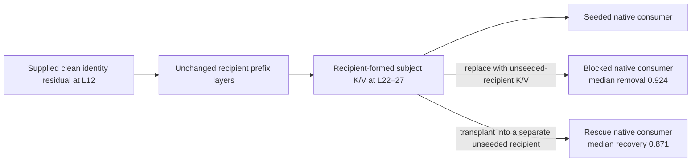

# Independent technical-reader review: time-formed circuits and functional scaffolds

**Reader:** GPT-5.6 Sol, high reasoning  
**Date:** 2026-10-01  
**Drafts reviewed:** `time-emphasis-paper.md` and `bridge-paper.md`  
**Scope:** narrative continuity, quantitative and source fidelity, diagrams and axis definitions, and separation of measured evidence from architectural inference. No model experiments were run and neither draft was edited.

## Overall assessment

The two-paper sequence now has a coherent scientific center. The first paper is strongest when it treats Qwen as the explanatory case: supplied source residual → unchanged ordered formation → recipient-formed late K/V → native consumer. FLUX then contributes a stricter support topology at a different execution axis rather than redefining the class. The second paper makes a sensible next move from formation to reuse: the same stored intervention has different native effects under different questions, while the physical lowering varies across Qwen, diffusion, and Mamba.

The main numerical claims I checked agree with the primary FINDINGS and bundled reports. The remaining issues are mostly interpretive precision. Four distinctions need to remain explicit every time the papers cross experiments:

1. **Recipient-formed after a supplied donor seed is not donor-free formation.** E20 and the newer contextual identity assay are stronger than direct clean-K/V transplantation because the recipient runs the intervening layers, but they still begin with a supplied clean residual and host-supplied address.
2. **An independent lesion/rescue chain is stronger than a two-factor contrast.** E20 supplies block plus transplantation into a separate recipient. The Qwen query/source-cache, SDXL K×V, SDXL block-0/block-1, and FLUX program/register crosses establish conditional or joint authority; they are not independent mediation results by themselves.
3. **Discovery, prospective replication, held evaluation, and post-hoc diagnosis differ.** The Qwen scaffold panel contains a fox/cat mechanics/discovery pilot followed by three packets under the frozen design. E1's relation-scope repair is explicitly post-hoc. E4 cross-family alignment is also post-hoc. These statuses should appear beside the first positive description, not only later in limitations.
4. **The ordered axis is family-local.** Decoder layer depth, diffusion denoising call, and recurrent transition are not one physical time coordinate. Cross-family recurrence is currently a role-level working inference, not evidence for a shared tensor circuit or shared clock.

I would support the papers after the targeted clarifications below. I found no numerical discrepancy large enough to undermine either paper's central result.

## Source and quantitative audit

The following headline quantities match their primary records:

| Claim in drafts | Source check | Reader assessment |
|---|---|---|
| E20 L22–27 block removes median 0.924 of the L12 seed gain; recipient-formed rescue recovers 0.871 | `FINDINGS-E20-mediation.md` | Accurate. The ratios are per-row signed log-probability-effect ratios. They are neither probabilities nor unique natural indirect effects. |
| E20 wrong identity authors itself on 37/42 rows | `FINDINGS-E20-mediation.md` | Accurate for both candidate and full-vocabulary readouts. |
| Context panel: color and position query-selective harm positive in 16/16, medians 3.130 and 0.583 nats | Qwen scaffold `FINDINGS.md` and analysis record | Accurate. There are 32 unique same-parent color/position query pairs, not 128 independent replications; the 128 count is patch-matching mechanics. |
| Context identity formation/rescue 16/16; block restores donor identity in 14/14 available reads | Qwen scaffold `FINDINGS.md` | Accurate. It begins with a supplied L12 clean residual and uses host-supplied addresses. |
| E19 window table and isolated late write near 0.81 | E17/E19 FINDINGS | Accurate at the stated cells. Widths are bounds on the tested grid, not minimum circuit sizes. |
| E13 Qwen read necessity 0.074, L23 restore 1.22, exact-row top-head recovery 1.02 / top-1 0.88 | E13 `FINDINGS.md` | Accurate. The 0.88 is a rate, not a probability calibration result. |
| FLUX strict matrix: singleton write max 0.56200, singleton removal min 0.20743, all-call write min 0.91309, all-call replacement max 0.01101 | bundled time-signature record and preregistered plan | Accurate for the 15 setup/site-set cells sharing three baseline trajectories. The five-seed color run strengthens only the necessity half. |
| SDXL K/V factorial: .72139/.66201/.71808/1.00000 and K×V interaction .34130 | SDXL Q/K/V `FINDINGS.md` | Accurate for one checkpoint, seed, contrast, module, and call-zero cut. |
| SDXL two-block grammar means .100834, -.004334, .115666, interaction .120000 | cross-prompt grammar `FINDINGS.md` | Accurate over four semantically admitted rows. The relation row is mechanics-valid but semantically excluded. |
| FLUX program-only .7124, register-only .4035, joint exact | scene-editing closure record | Accurate. These are eye-region projections in a separate terminating-boundary 2×2, not whole-image progress and not independent mediation. |
| E1 relation: frozen lexical support -.045; post-hoc whole text .882; complement .725; row permutation .054 | E1 and relation `FINDINGS.md` | Accurate. Human scoring is still pending; the post-hoc whole-text/complement result should remain a scope diagnosis. |
| Mamba C/H effects and Pythia developmental values | E3 `FINDINGS.md`, campaign `RESULTS.md`, verified summary | Accurate. Pythia's selected coalition is layers 3 and 5, and one random-site final row is a preserved countertrend. |

## Required clarification 1: name recipient-formed, donor-assisted mediation consistently

The first paper generally gets this right, especially in the Figure 1 caption and §3. The bridge sometimes shortens the phrase to “endogenous” in a way that can be read as donor-free.

The sentence in the first paper's opening currently says:

> The model constructs the mediator and computes the answer in both cases.

That wording can imply that the rescue branch constructs the mediator from its own unseeded state. More exact replacement:

> A seeded recipient constructs the proposed mediator through its unchanged remaining prefix. In the block arm that state is removed before consumption; in the independent rescue arm the already formed state is transplanted into a separate unseeded recipient, whose unchanged suffix computes the answer.

In the bridge abstract, replace:

> An identity source at layer 12 also caused the recipient to form a late record that rescued identity in 16/16 generated reads.

with:

> After a clean identity residual was supplied at layer 12, the recipient's unchanged remaining layers formed a late record; transplanting that recipient-formed record into a separate unseeded recipient rescued identity in 16/16 generated reads.

In bridge §3, replace “blocking the endogenous layer-22–27 band” with “blocking the L22–27 band formed by the recipient after the supplied L12 residual.” Replace “endogenous-store extension” and “endogenous rescue” in the E2 paragraph with “recipient-formed-store extension after the supplied L2 seed” and “recipient-formed-store rescue.” The shorter term can remain after this qualification, but it should never be the first label.

The same clarification should accompany the bounded chain diagram:

```text
supplied clean residual at L12
        -> recipient-native remaining layers
        -> recipient-formed L22–27 K/V
        -> independent transplant into an unseeded recipient
        -> query-conditioned native answer
```

This preserves the genuinely strong result while preventing a donor-free compiler claim.

## Required clarification 2: separate independent mediation from factorial evidence

The drafts already contain the correct general rule in bridge §2: a lesion plus downstream rescue can support mediation, while a replacement or write assay supports only the role it measures. That rule should be applied explicitly to the named examples.

Use the following classification in prose:

| Experiment | What was crossed or intervened | Supported description |
|---|---|---|
| Qwen E20 | supplied L12 source; recipient-formed L22–27 block; independent formed-band transplant; wrong-content transplant | Bounded source-to-store-to-consumer mediation at the tested cut |
| Qwen same-patch query assay | fixed parent and K/V patch; changed native query | Query-conditioned causal consumption / query × stored-operand contrast |
| Qwen E2 current-query × source-cache | immutable source cache crossed with distinct suffixes | Variable-specific readability at one cache band; not store mediation |
| SDXL K×V | K and V factors under live Q | Causal conjunction and interaction at one binding boundary |
| SDXL block 0 × block 1 | two source-program factors over common parents | Conditional refinement grammar; not independent mediator rescue |
| FLUX program × register | current program crossed with incoming register | Two-factor closure / joint endpoint authority |

Bridge §4 currently calls the FLUX closure “a complementary two-parent result.” That is directionally correct but underspecified. Replace the sentence with:

> In a separate terminating-boundary eye color × geometry assay, a 2×2 cross of target/recipient current transformer program with target/recipient incoming scheduler register gave eye-region projection 0.7124 for target program alone, 0.4035 for target register alone, and exact native-joint RGB when both target factors were installed. This establishes joint endpoint authority of the two declared operands at that boundary; it is a factor contrast, not an independent mediation decomposition.

The first paper's §7 closure paragraph should add the same final sentence. Its existing statement that the observable is eye-region projection rather than whole-image progress is excellent and should remain.

## Required clarification 3: correct the SDXL Q-axis sentence

Bridge §4 says:

> K and V were byte-identical between calls 0 and 14 while Q drifted to cosine .83993 and .82159 in the two blocks.

The K/V statement is a temporal equality. The two Q cosines, however, are candidate-versus-base Q cosines at call 14; they are not directly `cos(Q_call0,Q_call14)`. The sentence currently places unlike reference axes side by side and invites the latter reading.

Replace it with:

> For each prompt, K and V were byte-identical between calls 0 and 14. Q remained live-state dependent: at call 14, candidate-versus-base Q cosine was 0.83993 in block 0 and 0.82159 in block 1, whereas the corresponding call-zero contrasts were much closer in the reported organism. Thus the prompt products were temporally fixed at this boundary while the query continued to depend on the evolving recipient trajectory.

If space permits, report the actual call-zero candidate/base Q cosines beside the call-14 values; the source gives 0.99990 for block 0 and 0.99012 for block 1. This makes the direction and reference of the “drift” unambiguous.

The next paragraph's commitment interpretation should also remain bounded to the assay:

> In this one module, seed, rendering contrast, and call-zero cut, the early K/V lesion leaves a persistent endpoint error that later native calls do not fully repair.

That is the measured inference. “The first binding launches a trajectory” is a useful model, but it should follow this bounded observation rather than substitute for it.

## Required clarification 4: label discovery, prospective replication, held tests, and post-hoc tests where introduced

The bridge calls the Qwen L22–27 interface “prospectively fixed before the four-scene panel.” The layer band was indeed inherited from E20 and fixed for all four packets. The plan nevertheless identifies fox/cat as the mechanics/discovery pilot and the other three scenes as subsequent packets with the same frozen layers and operators. Readers will otherwise infer four held-out scenes.

Replace the opening of bridge §3 with:

> The L22–27 interface was inherited from E20 and fixed before this campaign. Fox/cat served as the mechanics/discovery pilot; wolf/bear, horse/dog, and lion/tiger then used the same frozen worker, layer bands, operators, and readouts. The resulting four lexical scenes are correlated panel replications, not four independent held-out tests.

The 16/16 direction counts should be described as scene/order/binding contrasts. They are useful within-panel consistency evidence, not an effective sample size of 16 independent tasks.

The held/post-hoc distinctions elsewhere are mostly good. Preserve and, if possible, move forward these labels:

- E1 color/geometry rows: fresh held rows under frozen supports.
- E1 relation whole-text/complement repair: one post-hoc exploratory scope diagnostic; human scoring pending.
- E2 disjoint contexts and E6 fresh contexts: prospective or frozen-policy status as stated in their FINDINGS, with native competence denominators retained.
- E3 query × carried-state supplement: mechanically valid but semantically inapplicable because no paired native-competent row exists.
- E4 cross-family alignment: fitted after held rows opened, hence descriptive only.
- Pythia: frozen final-checkpoint site profile evaluated across authenticated checkpoints and fresh contexts; early/shuffled native incompetence limits semantic exclusion.

## Diagrams and axis definitions

### Time paper Figure 1

The figure's main path is clear, but the dotted arrows currently make numerical effects look like downstream state nodes reached directly from the formed K/V. They are outcomes of separate interventions and consumers. A more faithful branch diagram is:



The caption should add that the 0.924 and 0.871 are medians of paired per-row ratios with different numerators, not complementary parts of one decomposition.

### Time paper Figure 2

The image is persuasive, but “early” and “late” should be defined in the caption because the paper also uses layer depth as an ordered axis. Suggested addition:

> Here “early” means denoising calls 0+1 and “late” means calls 2+3 of a four-call run; “all-call” means 0–3. These are denoising-call coordinates, not transformer layer indices.

### Bridge recurrent-role diagram

The diagram uses `t` as though one update semantics spans every family, and the feedback arrow is visually stronger than the evidence. Add immediately before it:

> Here `t` denotes the declared family-local update axis: an autoregressive query/write event, a diffusion denoising call, or an SSM recurrent transition. It does not denote a shared clock, layer number, or tensor type. The return from carried state to the next operation is directly tested only in selected bounded assays and remains a hypothesis elsewhere.

Render the return arrow dashed or label it “bounded evidence / open in general.” This would visually preserve the paper's own distinction between recurrence of roles and recurrence of state influence.

### Program/register projection

The bridge should name its axis the first time it gives .712/.403. “Image projection” is too easy to confuse with the whole-image progress used in E1 and the time paper. Use “eye-region projection on the native recipient-to-joint endpoint axis” or reproduce the exact observable name from the closure report.

## Narrative and claim-strength revisions

### First paper

The narrative is strongest in §§1–5. Qwen explains the object; FLUX tests a stricter subtype; the scene edit shows why timing matters. Keep this order. The main transition needing one sentence is between E20 mediation and the wider E16–E19 sweep:

> E20 follows one supplied source into one later band. The exhaustive sweeps ask the complementary question: how broadly is the already formed store supported, and at which individual ports can coherent state be written directly?

That sentence prevents readers from treating the window table as additional mediator evidence.

In §3, replace “Removal ranges from 0.397 to 1.327, and rescue ranges from 0.695 to 1.055” with “Per-row block-removal ratios range from 0.397 to 1.327, and per-row rescue-recovery ratios range from 0.695 to 1.055.” The present wording momentarily sounds like raw nats.

In §5, the E13 statement combines a necessity ratio, recovery ratio, and top-1 rate. Label each axis in the sentence:

> Best-single-layer read necessity is 0.074 of the whole-read effect; L23 single-layer restoration recovers 1.22 of that effect; and a one-hot exact-subject-row read in the leading head yields normalized recovery 1.02 with target full-vocabulary top-1 on 88% of rows.

The conclusion “a store with distributed necessity can have a concentrated read port” is supported in the bounded Qwen identity cell. Avoid letting it read as a universal law.

In §6 and the abstract, describe the strict FLUX evidence as “15 setup/site-set cells sharing three baseline trajectories.” The paper already discloses this in the table caption; repeating it once near the headline prevents the cell count from looking like 15 independent runs. The five-seed panel should remain explicitly necessity-only.

The sentence “The main terminal claim in this paper is the declared FLUX strict signature” is acceptable because the 0.90/0.15 rules were preregistered for the relevant campaign. Scope it as follows:

> The paper's bounded terminal claim is that the reported FLUX setup/site-set cells satisfy the preregistered four-quadrant rule at the declared text-stream cuts. The broader time-formed class and the cross-architecture anatomy are supported working generalizations rather than terminal universals.

### Bridge paper

The Qwen section earns the architectural bridge. The diffusion, Mamba, and Pythia sections are useful as family-local analogues, but they do not jointly identify one learned role graph. The bridge currently says “The evidence supports the following execution pattern.” Prefer:

> The records are consistent with the following role-level execution pattern. Qwen directly tests selective consumption of a fixed stored intervention; diffusion and Mamba supply family-local lowerings of subsets of the pattern.

This keeps the scaffold as a working architectural inference, matching the abstract and §7.

In the Pythia paragraph, write “layers 3 and 5” or `{3,5}`, not `[3,5]`, which conventionally denotes an interval.

The future-work paragraph proposing a program × register 2×2 should acknowledge the existing closure assay:

> Replicate the existing terminating-boundary FLUX program × register 2×2 prospectively on unopened factors and earlier boundaries, then run analogous competent crosses for query/KV and transition/state.

This is more continuous than proposing the already completed experiment as a new cut.

The phrase “smaller dynamic response circuits” remains a hypothesis about functional support, not demonstrated low-dimensionality. The paper says this well in §6. Consider moving the sentence defining “smaller” into the abstract immediately after the phrase, or replace it there with “context-specific causal support.”

## Publication-facing replacement for the two-paper bridge

The following paragraph would accurately connect the papers without compressing evidence levels:

> The first paper identifies a bounded causal anatomy in Qwen: a supplied residual source is transformed by the recipient's unchanged remaining layers into late K/V state, and independent block and rescue interventions show that this recipient-formed state controls the native answer. It separately identifies a stricter path-distributed support profile in FLUX across denoising calls. The second paper asks what recurs when payload and operation change. Its strongest answer is a same-parent Qwen contrast: holding a late K/V patch fixed while changing only the native query changes that patch's causal relevance. This supports a recurring store/consumer interface with query-conditioned participation. Diffusion, Mamba, and developmental Pythia provide bounded family-local analogues of source, transition, writer, and carried-state roles; they motivate, but do not yet establish, one shared learned scaffold graph.

## Final recommendation

The first paper is close to submission-ready on technical framing. Its Qwen source → recipient-native formation → committed store → consumer account is direct, bounded, and quantitatively well supported. FLUX works as a strict subtype so long as the terminal claim stays attached to the declared cuts, thresholds, and correlated 15-cell panel.

The bridge is valuable but should remain one rung more provisional. The same-patch Qwen experiment establishes selective causal consumption at a recurring interface. The broader scaffold is a working inference assembled from heterogeneous lowerings. Fix the SDXL cosine reference, qualify recipient-formed state as donor-assisted, expose discovery versus held/post-hoc status at first mention, and consistently call 2×2 crosses factor evidence rather than mediation. Those changes would align the prose with the unusually strong evidence discipline already present in the source records.

## Primary records checked

- Qwen E20 mediation, E16 residual writes, E17 isolated K/V writes, E19 window necessity, and E13 read/join FINDINGS.
- Qwen scaffold-context PLAN, FINDINGS, aggregate analysis descriptions, and denominator notes.
- FLUX time-signature bundle, joint-region preregistration, residual-deletion correction, and five-seed color preregistration/outcome.
- Scaffold E1 text findings and post-hoc relation findings; E2 role and continuation findings; E2 query-factorial findings; E3 Mamba findings; E6/E8 feedback findings; Pythia verified summary and campaign results.
- SDXL Q/K/V factorial, cross-prompt grammar, and writer-transport FINDINGS.
- Scene-editing reproduction and program/register closure description.
- Saturn Bible and evidence-plane claim boundaries for native-consumer authority, custody, and post-hoc evidence status.

## Addendum: final recheck after revision

**Status:** The requested fixes are incorporated. I verified the supplied-source qualification, E20-versus-factorial distinction, fox/cat discovery status, corrected SDXL Q cosine axes and call-zero values, family-local clocks, softened feedback and claim ladder, eye-region program/register observable and joint-authority language, revised diagrams and call labels, Pythia layers 3 and 5, and prospective replication framing for the existing closure assay. The revisions resolve the original required findings without introducing a numerical inconsistency.

Two material wording issues remain.

### 1. The broad class definition and the FLUX subtype now use apparently incompatible admission rules

In `time-emphasis-paper.md` §2.1, the revised definition says that generic ordered execution “without a separable mediator and independent rescue does not establish that anatomy.” E20 meets that rule. The paper nevertheless identifies FLUX as a strict **subtype** from the singleton/all-call intervention matrix, without an analogous isolated formed mediator and independent rescue. As written, a reader can reasonably conclude that FLUX does not satisfy the newly stated parent-class admission rule.

Replace the relevant part of §2.1 with two explicit evidentiary routes:

> A time-formed claim requires causal evidence that ordered history matters at a declared native-state interface. In the source-to-store route used for Qwen, an earlier intervention changes a later recipient-formed record, blocking that record removes the source effect, and transplanting it into a separate recipient independently rescues the effect. In the path-distributed route used for FLUX, exhaustive singleton and whole-trajectory interventions at the same typed cut establish that the complete ordered path has behavioral authority unavailable to any tested singleton under the declared criteria. Generic execution order, cache append, or activation change without either kind of native-consumer evidence does not establish the class.

This keeps E20 as the primary mechanistic explanation while making the logical relation between the broad class and strict FLUX subtype explicit.

### 2. Same-parent design should be preferred evidence, not a universal requirement for semantic interpretation

In `bridge-paper.md` §2, the sentence

> The record is semantic only to the extent that a same-parent intervention produces a directed native effect.

is too restrictive for the paper's own evidence ledger. Same-parent comparison is the key strength of the Qwen query assay, but E1, the SDXL factorials, and other controlled native-consumer interventions can support bounded semantic interpretation with different parentage controls.

Replace it with:

> The record earns semantic interpretation only to the extent that a directed native-consumer effect survives the parentage, donor, competence, and counterfactual controls appropriate to that assay. Same-parent contrasts are preferred when the question permits them because they isolate the changed operand most sharply.

No other material issue emerged in the recheck.

## Final disposition

Both remaining concerns are resolved in the current drafts. The time paper now states two distinct admissible evidence routes—Qwen source-to-store block/rescue and FLUX exhaustive singleton/whole-trajectory intervention—while keeping the FLUX matrix scoped to the strict support subtype rather than an independently mapped mediator. The bridge now bases semantic interpretation on assay-appropriate native-consumer effects and parentage, donor, competence, and counterfactual controls, with same-parent comparison correctly presented as preferred rather than universally required. I find no material unresolved issue from this review.
