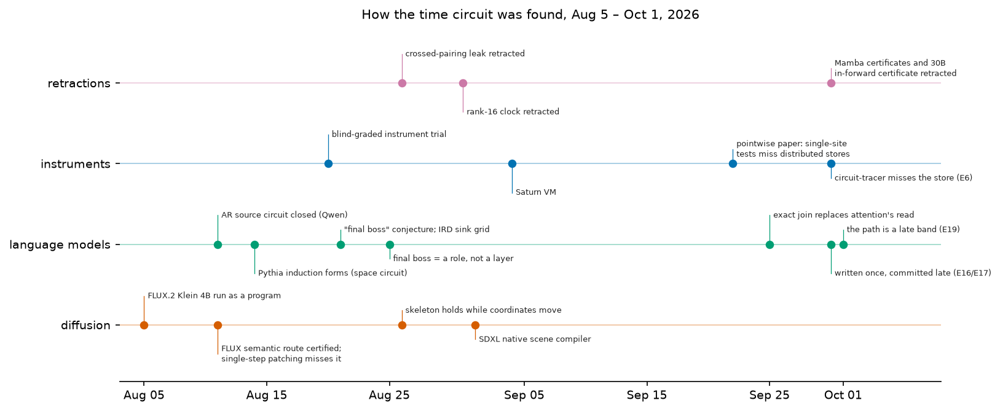
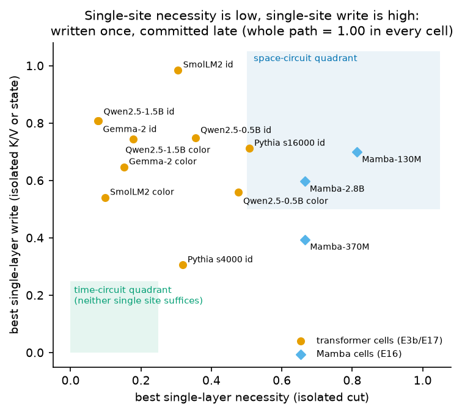
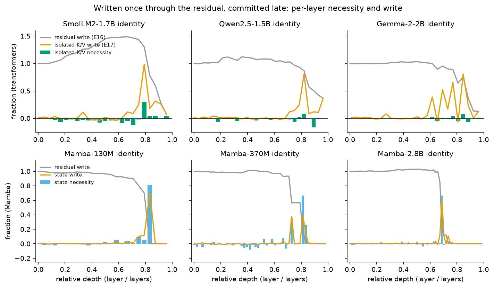
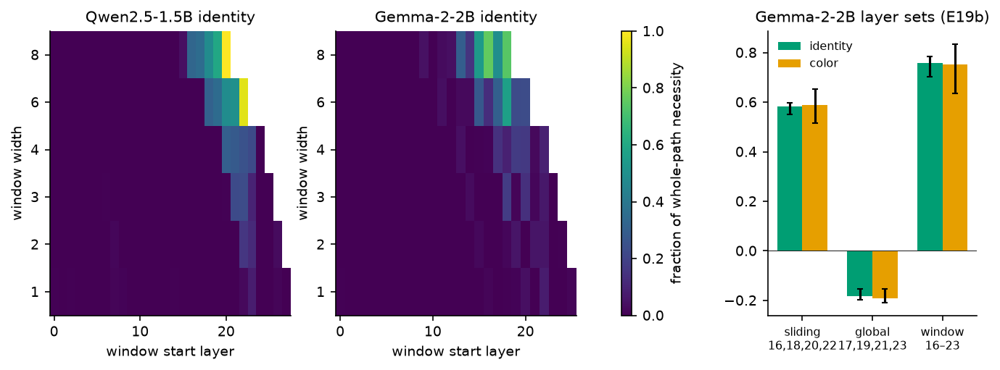
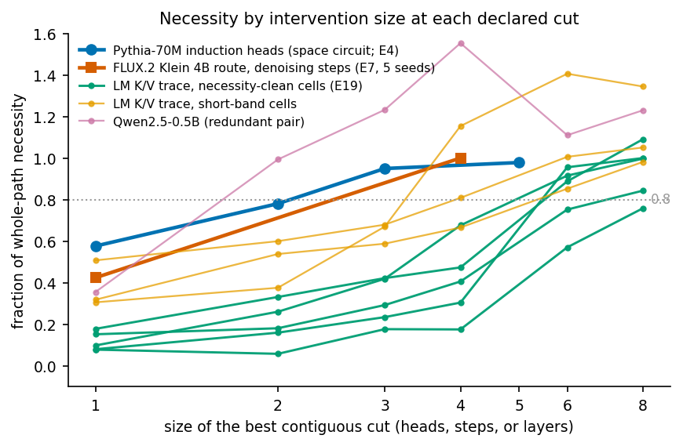
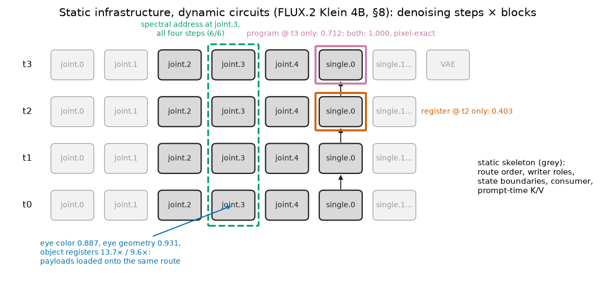

# Space and Time Circuits: Causal Control Across Model Trajectories

Jacob Hollenbeck

*Draft 3, 2026-10-01; incorporates the recovered overnight E14 run and E20 residual-seed mediation.*

> **Draft notes.**
>
> **TODO markers.**
> - **TODO [E#]**: an experiment that is still running or has not been run (Appendix A).
> - **TODO [R#]**: a correction or collation that needs no compute (Appendix B).
> - **TODO [W]**: writing only.
>
> **Conventions.**
> - Numbers are measured unless marked otherwise, and receipt paths are inline.
> - "Public" means a receipt is bundled with a verifier under `research/`. "Private" means it exists only under `saturn/`.
> - At the author's direction, results from the 2026-09-30 blind-certification and grail tooling are excluded.
>
> The section-by-section evidence map is in [`outline.md`](outline.md).

---

## Abstract

We distinguish local causal support from state formed through ordered execution. A space circuit has individually decisive support at a declared state interface and site resolution. A time-formed circuit can accumulate control across denoising steps, model depth or recurrent transitions. Its path-distributed subtype has a four-quadrant signature: no singleton meets the declared necessity or sufficiency criterion, while whole-path interventions meet both. Intervention effects are judged by the unchanged model consumer.

In FLUX.2 Klein 4B, the text-conditioning carrier shows this signature across three source/target setups and five tested site sets. Single-step writes reach at most 0.562 target-image progress, while all-step writes reach at least 0.913 against the 0.90 transfer criterion. Every singleton source replacement leaves progress above the 0.15 removal criterion; every whole-path replacement leaves at most 0.011. A separate five-seed color panel confirms the necessity profile: single-step removal retains the target, whole-path interchange reaches the source, and whole-path deletion reaches the null image.

Decoder and state-space sweeps expose different formation, commitment and read profiles. In Qwen and Gemma identity cells, singleton necessity shares are at most 0.08 while late isolated K/V writes recover about 0.81 of normalized answer-logprob gain. In Qwen2.5-1.5B, blocking an endogenous late K/V band removes a median 0.924 of an upstream residual seed's logprob effect; transplanting that band into an unseeded recipient recovers 0.871. Mamba concentrates control at a late retention layer. Falcon's hybrid state has attention-dominated dependence with weaker individual write ports and partial SSM writing. On admitted scaffolded arithmetic items, non-restated intermediate K/V state causally controls subsequent answers.

The tested Gemma circuit-tracer feature basis captures little identity control and partial color control despite large native-state intervention effects. Together, these results separate where state can be seeded, where it is stored and how it is consumed, and connect that distinction to temporal editing and source compilation.
---

## 1. Introduction

**Space circuits.** When interpretability researchers say a model "has a circuit" for a behavior, they usually mean a localized subgraph. Activation patching, path patching, automated circuit discovery, sparse-autoencoder feature ablation and attribution graphs all ask, in different ways, *which site matters*. They are well suited to finding components whose removal hurts and whose insertion helps [Meng 2022; Wang 2022; Conmy 2023; Ameisen 2025]. We call locally decisive mechanisms **space circuits**. They are real, and we certify some ourselves (§7).

This paper asks what changes when the controlling state is formed through ordered execution. Pointwise instruments can still find sources, commits, latches and readouts in such a computation, but a sampled local result need not describe the whole causal path.

**The anomaly.** It came from a production text-to-image model, FLUX.2 Klein 4B. We patched each site of a candidate route at a single denoising step and found effects below the declared full-transfer criterion:
- transplanting the target's state at one step left the image at pixel distance 48.4 from the target;
- ablating one site at one step left the target intact (distance 7.9).

At this cut and resolution, no tested singleton removed the target or fully transferred it. Yet the same sites, patched across all four denoising steps, transferred the target almost completely (distance 0.47), and removing them across all steps reverted the image to the source. The internal separation between the two prompts grew at every step: 0.355, 0.919, 2.487, 9.723.

The route was carrying its signal *across time*. The remaining steps preserved the target after a singleton intervention [certified-semantic-circuits §5]. This survival alone does not distinguish additive accumulation, static redundancy and adaptive re-derivation.

**Time-formed circuits.** We use **time-formed circuit** for the broad family in which controlling state depends causally on an ordered execution history. The strict four-quadrant subtype is a **path-distributed time circuit**: no single site at the declared cut is necessary or sufficient, while the whole path is both. Our working name was the "final boss": the conjecture that a model funnels its output through a late, path-constituted store that smaller circuits write into [`obsidian/blog/2026-08-21-114500-the-final-boss-circuit.md`]. The tested diffusion carrier passes the strict subtype. In autoregressive transformers, the whole-path half holds and necessity can be distributed, but full sweeps also find concentrated or redundant late write ports. In the tested standalone Mamba specimens, a late retention latch is locally decisive. Locality and temporal formation are therefore compatible.

**Contributions.**
1. **Definition and certificate.** A broad time-formed family, a strict path-distributed subtype, and a four-quadrant certificate for that subtype (§2).
2. **Diffusion accumulation.** A strict path-distributed circuit in a production diffusion transformer, controlled against alternative paths and tested under counterfactual and deletion interventions (§5).
3. **Autoregressive formation and commit.** Path-formed stores with distributed native necessity and recurring concentrated or redundant late write ports (§6).
4. **SSM retention and latch.** Ordered recurrent state formation with locally concentrated late retention in the tested Mamba specimens (§6.4).
5. **Same-model contrasts.** Local and time-formed properties in the same model and behavior (§7).
6. **Static and dynamic decomposition.** A static-infrastructure / dynamic-circuit decomposition of the tested diffusion circuit, with the editing and compilation results it explains (§§8, 10).
7. **Instrument coverage.** Measured cases in which sampled or feature-basis instruments understate the relevant causal support, including a blind-graded trial and public-tool comparisons (§9).

**Boundaries.**
- We certify behaviors at declared cuts in particular models. The architecture-level variations are definitions, not claims that every diffusion, autoregressive or SSM model instantiates the same mechanism.
- The original language-model grid uses single-token readouts and at most four items per cell.
- FLUX whole-path deletion is non-specific and, at the input cut, equals removing the prompt (§5.5).
- We explain *what* moved, *where*, and to which consumer, but not why attention attended there (§12).

**Relation to Circuit Tracing.** Attribution graphs state two limitations that bear directly on this class [Ameisen 2025]:
- their graphs "do not attempt to explain how the model's attention patterns were formed";
- "we account for the information which flows from one token position to another, but not why the model moved that information."

QK tracing [Kamath 2025] addresses the second limitation by explaining attention scores through feature interactions.

Our claim is narrower than "attribution graphs are wrong". The tested autoregressive store sits in a token's key/value trace across many layers, and part of its causal effect is absent from the tested transcoder feature basis while reconstruction error terms remain clean. §9 measures this on Gemma-2-2B under circuit-tracer's native ablation and a feature-basis interchange analogue, with attention frozen or unfrozen. We do not test QK tracing.

## 2. Locality and temporal formation

### 2.1 Definitions

**Setup.** Fix:
- a model;
- a behavior with a clean source condition and a target condition;
- an **accumulation axis** t;
- a **cut**: a typed interface at which state can be read and written, such as key/value rows, a block's output on the text stream, or a recurrent state.

Also declare site grain, intervention, observable, normalization and decision bars. "Necessary" and "sufficient" below mean crossing those behavioral criteria, rather than having any nonzero effect. Mixed and borderline profiles remain measured evidence.

The behavior is judged by the model's own unchanged **consumer**: its next-token distribution, or its scheduler and decoder rendering pixels.

- **Space circuit.** A set of sites S with locally decisive causal support at the declared grain: at least one member meets the declared single-site necessity or sufficiency criterion.
- **Time-formed circuit.** A behavior whose controlling state at the cut depends causally on an ordered trajectory along t. A local source, write port, latch or readout may still be individually sufficient or necessary.
- **Strict path-distributed time circuit.** A time-formed circuit with a set of sites P along t that meets four conditions:
  - (i) no single site is necessary;
  - (ii) no single site is sufficient;
  - (iii) the whole path is necessary;
  - (iv) the whole path is sufficient.

These properties are not mutually exclusive. A locally sufficient residual write can seed the correct state and let the unchanged suffix form the downstream computation. That intervention identifies a source or write port; it does not collapse the intervened suffix into that site. Conversely, a time-formed computation may end in a locally necessary commit or retention latch.

**Architecture-level variations.** These name execution patterns, not universal facts about an architecture:

| variation | accumulation axis | defining execution pattern | tested specimens in this paper |
|---|---|---|---|
| **diffusion accumulation** | denoising steps | a carrier is repeatedly updated or consumed across denoising calls | FLUX.2 Klein and SDXL |
| **autoregressive formation/commit** | depth and generated positions | source state is transformed through the unchanged suffix, committed to a later store and read by a consumer | SmolLM2, Qwen, Pythia and Gemma-2 |
| **SSM retention/latch** | ordered recurrent transitions and depth | recurrent updates form state; selective retention can hold it locally until readout | Mamba |

Hybrid architectures can combine these variations. E14 tests Falcon's attention K/V and SSM formed-state cuts after the subject prefix, but does not establish its residual-formation window, read layer or retention clock (§6.4).

**Formally.** Split the state at the cut into a prompt-invariant scaffold and a prompt-specific residual, x(t) = s(t) + r(t). A time-formed circuit has a consumer-relevant state R that depends on the ordered execution trajectory, R = 𝓕(r(0), …, r(T)), as established by replay or path interventions [integral-residual-dynamics §2]. R may still be controllable from a local source site because the unchanged suffix performs the remaining formation. The strict subtype adds the four operational conditions above at the declared cut.

**What is and isn't claimed.** The **wiring fact** — the consumer reads the final state, so whatever controls the output is present there — is close to a tautology and is *not* our claim. The broad claim requires evidence that ordered execution forms the controlling state. The four-quadrant pattern below makes the narrower claim that causal support is path-distributed at the chosen cut and resolution.

### 2.2 The four-quadrant certificate

|  | single site | whole path |
|---|---|---|
| **necessity** (ablate) | no singleton meets its necessity criterion | the whole path meets its necessity criterion |
| **sufficiency** (write) | no singleton meets its write criterion | the whole path meets its write criterion |

For P = {t₁, …, tₖ}, the single-site claims quantify over **every** {tᵢ}, using the same observable and panel aggregation as the joint intervention on P. Partial effects remain part of the measurement. At the FLUX image cut, writing succeeds at target-image progress ≥ 0.90 and source replacement removes the target at progress ≤ 0.15; deletion additionally uses the nearest source, target or null image (§5.5). At LM formed-store cuts, the singleton bars are normalized necessity share < 0.25 and write magnitude < 0.2 (§3). Site grain and consumer criteria travel with each certificate.

**What this pattern discriminates.** The cross excludes an individually decisive site at the tested grain while showing that the declared path can remove and author the behavior. It does **not** establish nonlinearity, non-additivity or a unique route. A weighted additive path can satisfy all four quadrants when each individual contribution falls below the behavioral threshold but their sum crosses it. Ordered replay, permutation, dose or transition tests are separate evidence that the state is time-formed; the four quadrants certify the stricter distribution of causal support at a cut.

For example, let y = (x₁ + … + x₈)/8, with an all-zero source and all-one target. Each singleton changes normalized output by 0.125; the joint change is 1. At a class threshold of 0.5, each singleton preserves the recipient class, whereas the joint intervention changes it. The same operational cross can therefore arise in a linear system. The trajectory, dose and ordering panels supply separate evidence about the mechanism.

**Validity gates.** These are hard requirements, not successes:
- **no-op and uninstall:** establish the specimen's declared replay contract before interpreting interventions; bitwise equality is reported where measured, and numerical tolerance where used;
- **capability:** a clean capability margin;
- **floor separation:** separation from the generic-prompt floor.

### 2.3 Reading rules

1. **The cut matters.** A certificate is a statement about a cut, not about an architecture (§6.4).
2. **Use isolated swaps.** In a transformer, an *in-forward* key/value swap lets the subject token read its own replaced entries, which silently turns one layer into many. The *isolated* swap replaces cached entries after the subject has run normally, so only later reads change. On Qwen2.5-1.5B the two give 0.99 and 0.00 for the same layer [pointwise §4.3]. Isolated swaps are primary.
3. **Sweep every single site.** Two "representative" single layers are not enough. Full sweeps have exposed concentrated writers that sampled layers missed, in a transformer and in all three Mamba models (§§6.1, 6.4, 7.2).
4. **Name the intervention.** Counterfactual (interchange) replacement and deletion (zero, mean, resample) ask different questions. A carrier can be necessary under one and redundant under the other (§5.5).
5. **Read the gap, not the whole-path ablation.** Whole-path ablation of a token's state is close to deleting the token. The informative result is the single-site *failure* together with the size of the gap.
6. **Separate formed-state control from source formation.** The four-quadrant matrix uses necessity and sufficiency at the same declared cut: isolated K/V in the tested autoregressive transformers, recurrent state in the tested SSM specimens, and text-stream state in the tested diffusion specimen. A separate **residual** write at the source position asks whether the unchanged suffix can form the downstream state from one seed. Its success must not replace the formed-cut singleton result in the certificate.

   Installing formed K/V or state directly tests a different object. The in-forward K/V write is a hybrid: the subject token reads its own patched entry, so part of the write leaks into its residual and propagates to later layers.

   Precedent (Wall-A P4, SmolLM2, `job-0a07cb92d360`):

   | write | site | result |
   |---|---|---|
   | one residual write at L12 | residual | 1.006 |
   | one K/V write at L12 | formed K/V | 0.010 |
   | the full K/V trace | formed K/V | 1.093 |

   The FLUX route writes are text-stream (residual) writes. The language-model panel writes in §6.1 and the Mamba state writes in §6.4 are formed-circuit writes; §6.1b re-measures them through the residual.

   **E16 result.** The full residual-write sweeps are in §6.1b: in every panel cell and in Mamba, one residual write authors the target from any layer up to a late commit band and stops authoring after it.

## 3. Method: matched replay judged by the native consumer

**Why matched replay.** These causal tests require an instrument that can:
- capture a computation once;
- fork it many times, with one value replaced at every step or layer;
- replay the remainder within a measured output contract.

Replay error must be small relative to the effect being interpreted. Bitwise replay is available for the declared diffusion paths; numerically bounded replay is reported separately where used, including E14.

**Execution model.** Saturn represents model state as typed **Frames** and interventions as **Acts**. An Act declares its reads, writes and invalidations. A **StateCut** names an execution boundary from which matched futures can be forked.

**Replay integrity is measured, not assumed:**
- diffusion resume reproduces a mean RGB difference of 0.0;
- text resume reproduces identical tokens and logits;
- FLUX reproduces 8/8 images bitwise across two residency schedules [pointwise `appendix-execution-model.md`].
- Falcon's E14 replay is numerically close, rather than bit-identical: maximum full-vocabulary logit difference is 3.62e-5 for chunk replay and 7.63e-5 for token replay, within its declared 1e-3 contract (§6.4).

**Origins.** The runtime grew from an observation about Mamba. A resident Mamba-2.8B decoded at 34.2 tokens/s while a paged path managed 0.27. That gap separated four things: checkpoint bytes, executable pages, request state and output contracts [`obsidian/blog/2026-07-19-from-fast-mamba-to-a-100x-model-runtime.md`].

The first family-local transactional Act was built for Mamba-130M. Because Mamba mutates its cache in place, the Act refuses caller-owned caches and returns state only after a complete forward commits [`saturn/experiments/2026-08-13-mamba-phase8-atomic-act/README.md`].

**Thott.** An early instrument, Thott, read the transformer key/value cache as position clock × token address × contextual residual:
- de-rotating RoPE raised within-token phase coherence from 0.51 to 0.87;
- a codebook-only replacement was refuted: the clock × codebook key reconstruction reaches relative L2 error 0.189, but continuation agreement is only 0.047, and it diverges at step 2 (`job-080c3550be62`, E-X4);
- the residual, which grows with depth, was load-bearing. The decomposition native KV = clock/address base + contextual residual is implemented in `saturn/src/saturn/context_residual.py` [`obsidian/blog/2026-08-13-thott-from-cache-diff-to-circuit-thought.md`].

**FLUX has no mask over its conditioner.** All 512 conditioner rows are live keys at distinct RoPE positions, so the address there is position and occupancy (`job-79ff59eb54d2`, E-A).

That decomposition motivated using the key/value cut in language models.

**Model virtual memory.** The same transactional runtime exposes model state as mountable pages: transformer K/V pages (`CausalContextVM`) and Mamba per-layer (C_ℓ, H_ℓ) state pages (`MambaStateVM`). Operations are mount, fork, swap, diff, unmount, per-layer sweep and clock, and each is labeled as a formed-state read or a residual write (rule 6). The Mamba VM reproduces the paper's per-layer necessity sweep bit-for-bit, and the residual-write sweep to 3 decimals, from an independent implementation (`job-7075c40c839b`).

**Gates for FLUX.** Nine gates [certified-semantic-circuits §3]:
1. replication on two seeds;
2. sufficiency P ≥ 0.90;
3. necessity ≤ 0.15;
4. wrong-axis ≤ 0.35;
5. energy-matched sham ≤ 0.35;
6. dose response;
7. edge mediation ≥ 50%;
8. downstream continuation ≥ 0.75 with alignment ≥ 0.80;
9. replay integrity.

**Gates for language and state-space models.** The four-quadrant certificate with capability and floor gates: pc > 2 and floor gap ≤ 0.5 [`saturn/docs/IRD-CERTIFICATES.md`]. As of this draft, the single-site bars apply to *every* layer: necessity share < 25% and write |s| < 0.2.

**Canaries.** The replication panels reran published numbers before extending them. Those canaries reproduced byte-exactly (FLUX) or within 3e-4 (language models). E14 introduces a new model and instead validates token and chunk replay, cache mechanics and no-op writes in two smokes; it has no prior published-number canary.

**Evidence ladder.** Results are labeled as one of:
- observation;
- trend;
- convergent trend;
- working inference;
- terminal claim.

A failed gate means "not established by this test", never "absent".

**Relation to standard libraries.** TransformerLens [Nanda & Bloom 2022], nnsight [Fiotto-Kaufman 2024] and pyvene [Wu 2024] do what a single forward pass needs: reading activations, patching sites, interchange interventions and, in nnsight and pyvene, trainable interventions. We do not replace them. TransformerLens reproduces our single-site numbers on GPT-2 to within 1.5×10⁻⁴ nats (§9).

This paper needs four things they leave to the user [`research/papers/pointwise-instruments-miss-distributed-circuits/appendix-execution-model.md` §3]:
- the sampler's timestep and noise-schedule state as capturable, resumable state (TransformerLens does not load FLUX; nnsight and pyvene can hook the denoiser as a generic module);
- a measured and enforced replay/no-op contract on every fork;
- the prefix/suffix split behind the isolated key/value swap;
- capture-once, fork-many reuse, so a whole-path or all-window sweep is not paid for once per site.

The cost is generality: the exact paths cover a few pinned models, need a job scheduler, and do no training.

## 4. How the time-formed family was found

**The single-step panel understated it.** Our first panel concluded "distributed relay with no necessary node". The correction is about intervention extent: joint intervention across time controls the output, while singleton interventions do not cross the declared behavioral bars [certified-semantic-circuits §5]. Later controls also show that the historical route is not unique (§5.4).

**It was found by swapping subsystems.** FLUX.2 has a clean interface between a text encoder and a frozen image program, so the encoder can be replaced entirely while the rest stays fixed.
- SmolLM2-1.7B and Mamba-1.4B, attached through trained adapters, drove the frozen denoiser to clean, coherent and semantically wrong images.
- Contrasting them with the native Qwen encoder located where the semantics diverged downstream. Route flow was 0.9312 native vs 0.5300 with SmolLM2.
- Full-state rescue reached 0.751 (SmolLM2) and 0.817 (Mamba). Compact selectors reached at most 0.051.
- At the route's entry, the foreign color separation was damped about 43× [`research/bfl/demos/cross-compiled-conditioner.md`; certified-semantic-circuits §7].

**It can also be found without labels.** We propagated random 5%-norm perturbations of an empty prompt to the return state:
- the method recovered three of four route sites and the `joint.4 → single.0` edge;
- clamp mediation removed 83–95% of the effect;
- downstream donation reconstructed 95–100%;
- off-route shams stayed at or below 0.095 [certified-semantic-circuits §8.3].

**A methods vignette.** A "0.2218 / 0.0013" pair circulated in our notes as the single-step / all-step contrast. No instrument produced it. The program's own audit caught it and replaced it with receipt-backed values [integral-residual-dynamics §1]. Plausible numbers that no instrument produced are the failure mode this paper is about.

**Figure 1. How circuit formation and control were mapped, Aug 5 – Oct 1, 2026.** Each event is a dated lab note or experiment record (sources in `figures/make_figures.py`, `EVENTS`). The lanes separate diffusion, language-model, instrument and retraction milestones. Retractions are part of the path: the crossed-pairing leak, the rank-16 clock, and the Mamba and 30B in-forward certificates.

## 5. Diffusion accumulation: a strict path-distributed specimen

In the **diffusion accumulation** variation, a carrier is updated and consumed across denoising calls. The architecture name alone implies no certificate: the four quadrants must be tested at a declared cut for each behavior and specimen. This section tests FLUX.2 Klein directly; §5.7 shows that another diffusion specimen can have a mixed profile.

**Specimen.** FLUX.2 Klein 4B, revision `e7b7dc27f91deacad38e78976d1f2b499d76a294`, BF16, 256×256, four denoising steps, guidance 1.0. The denoiser has five *joint* blocks, in which text and image tokens form two interacting streams, followed by twenty *single* blocks, in which the streams are merged.

### 5.1 One carrier, every axis

We tested the route `joint.2 → joint.3 → joint.4 → single.0` against twenty semantic contrasts spanning twelve categories.
- **Six pass all nine gates strictly:** lighting .935, identity .920, weather .911, fur .894, orientation .873, relation .866.
- **Eleven** pass every gate except strict pixel reconstruction.
- **Three** remain candidates.

**Held-out tests.**
- **Unopened seeds:** the route gates replicated across the panel. The only route-gate failure missed by 0.002. The strict pixel tier was seed-sensitive.
- **New prompts written after the route was fixed:** four of six strict contrasts replicated strictly, and all six replicated the route, exactly at the preregistered bar.

**Clean-room audit.** An auditor reproduced every decision and caught 5/5 injected tampering attempts [`research/bfl/demos/twenty-axis-semantic-route-circuit.md`; `research/bfl/artifacts/twenty-axis-semantic-route-circuit/`; certified-semantic-circuits §4].

### 5.2 Built over time

| intervention at `joint.4` | single step | all four steps |
|---|---|---|
| transplant the target state (sufficiency) | MAD to target 48.4 (no transfer) | MAD to target 0.47 |
| ablate (necessity) | target intact (MAD 7.9) | reverts to source (−0.93) |

**The complete step sweep.** E1b repeats both directions of the intervention at every denoising step on three source/target setups and five site sets: joint.0, joint.1, the pair, the joint region and the historical route. Let P = 1 − MAD(I, I_target) / MAD(I_source, I_target). The criterion and measured range for each quadrant are:

| Quadrant | Criterion, applied to every setup/site-set combination | Measured bound |
|---|---|---:|
| Single-step sufficiency | Every step's write has P < 0.90 | Maximum 0.56200 |
| Single-step necessity | Every step's source replacement has P > 0.15 | Minimum 0.20743 |
| Whole-path sufficiency | All-step write has P ≥ 0.90 | Minimum 0.91309 |
| Whole-path necessity | All-step source replacement has P ≤ 0.15 | Maximum 0.01101 |

These bounds cover all 15 setup/site-set combinations, sharing three baseline runs. No-op image MAD is 0.0 in all three. The [bundled reports and offline verifier](evidence/time-signature/README.md) recompute P from the saved distances and retain every singleton; the model execution was `job-67631847af7f`. E7 below independently extends the necessity half to the color contrast across five seeds.

**Separation and mediation.**
- Return-state separation grows monotonically: identity 0.355 → 0.919 → 2.487 → 9.723; color 0.411 → 0.837 → 1.990 → 7.409.
- All-step edge-mediation rescues along the route are .946, .888 and .796 [certified-semantic-circuits §5, Fig. 2].

**Dose is not exchangeable across time.** On the conditioning axis:
- writes weighted ≈ [0.21, 0.22, 0.08, 0.04] across the four steps reproduce the target;
- a late double dose at equal nominal integral reaches only 0.055–0.288, against 0.522–0.810 for the all-step write;
- at identical net-zero dose, order alone moves the output in opposite directions.

These kernels measure reproduction of the target image, not when identity is decided (correction of 2026-09-22) [integral-residual-dynamics §8].

**A second distributed route.** A 20-site key/value route for color binding shows the same pattern [`research/bfl/demos/distributed-kv-causal-route.md`]:
- the all-step graft beats every single step;
- a compact two-site subset fails;
- native margins are +6.740 forward and +8.830 reverse;
- 45/96 reverse donor-color collisions leave bilateral specificity open.

**A causal clock.** The same relative dose has a final effect of 0.360 at resume step 1 and 0.078 at step 7 [`research/bfl/demos/diffusion-time-causal-clock.md`].

**Multi-seed (E7, MEASURED).** The color contrast's necessity holds across five seeds: the original 7217 plus 4242, 9001, 2024 and 1337 (`saturn/experiments/2026-09-30-e7-flux-color-multiseed/`, `job-8d4a3845a671`). The canary reproduces the recorded red↔blue image MAD (70.954 against 70.95) and an exact no-op.

On the route (joint.2 → joint.3 → joint.4 → single.0):
- every single-step removal leaves the blue target on all five seeds, under interchange, deletion and mean ablation;
- all-step interchange reverts to the red source (MAD to source 2–6, to target 70–76);
- all-step deletion falls to the null image on 5/5 seeds.

Deletion is non-specific, because a norm-matched sham also nulls, so interchange is the informative operator.

### 5.3 Coordinate-free

**Direction is shared, coordinates are not.**
- Across axes, per-module activation-difference trajectories are nearly collinear (minimum pairwise cosine 0.986).
- The physical coordinates that carry them barely overlap (mean Jaccard 0.063).

**Position-robust but site-dependent.**
- A one-token subject ("horse") shifts every downstream position, yet the route still transports identity at 0.988.
- Excluding the `joint.4` text site drops transfer to 0.59 and 0.49 [certified-semantic-circuits §6].

The durable object is a typed transition between processing stages, not a set of neuron or token indices.

### 5.4 Where the carrier is

**The objection.** In FLUX, text enters the image stream in the joint blocks and merges at `single.0`. Perhaps the route is just the architectural text-to-image bridge, which would carry every axis.

**The test.** An off-route sweep at the certified operating point: six strict axes, two seeds, nine gates.
- Jobs: `job-bef367be11de` (smoke), `job-4eebfe403976` (full).
- Record: `saturn/experiments/2026-09-30-flux2-offroute-span-sweep/FINDINGS.md`.
- The historical route reproduced the published ledger byte-exactly.

| arm (sites; stream) | axes certified (strict, 2 seeds) |
|---|---|
| route: joint.2, joint.3, joint.4, single.0 (text) | 6/6 |
| all-joint ceiling: joint.0–4, single.0 (text) | 6/6 (the route reaches 93.0–94.7% of its sufficiency) |
| joint.0–1 only (text) | 6/6 |
| joint.2–4 without single.0 (text) | 5/6 |
| route blocks, image stream | 1/6 (orientation only) |
| single.1–4 (text) | 0/6 |
| single.10–13 (text) | 0/6; necessity 0.24–0.68 |

**Reading.**
- **Transport is specific to the text stream through the joint region.** Image positions at the same blocks do not carry it, and neither do text positions in later single blocks.
- **The objection is partly upheld, and sharpened.** The carrier is the joint-region conditioning pathway, not "any path of comparable size".
- **Carriage within the joint region is redundant.** The historical route is one certified instance, not a unique or minimal route.

**Time accumulation is region-wide, not specific to the historical blocks.**
- Setup: we repeated the single-step versus all-step test for five site sets — joint.0 alone, joint.1 alone, both together, the whole joint region, and the route — on three setups (`job-64cc7efe2b22`, `job-67631847af7f`; record `saturn/experiments/2026-09-30-flux2-joint01-time-accumulation/FINDINGS.md`).
- Single-step writes failed in every case (max 0.28 and 0.56 against the 0.90 bar), and single-step ablations left the target intact.
- All-step writes passed (≥ 0.91), and all-step source ablation reverted (dp −0.91 to −0.98).

**Conclusion.** This FLUX specimen is a strict path-distributed diffusion-accumulation circuit: a time-accumulated text-stream carrier in the joint region. The historical route is its certified representative.

### 5.5 Necessity: interchange versus deletion

**The question.** The FLUX necessity results above replace the route's state with the *source* prompt's state at every step. That is a counterfactual (interchange) intervention. Following Miller et al. [2024], we asked whether the signature survives deletion.

**Full-route all-step result by method** (`job-76991cc209c4`; record `saturn/experiments/2026-09-30-ablation-method-sensitivity/FINDINGS.md`):

| method | dp (−1 = reverted to source; dp only, see the reading rule below) |
|---|---|
| source-state replacement | −0.934 |
| zero | +0.026 |
| prompt mean | −0.367 |
| resample | −0.03 (mean over draws) |

**The dp column misleads for deletion.** dp is a projection onto the source→target axis, so an image with neither content projects to about 0. The residual-cut experiment (E1c) reports the nearest image class and the distance to each reference (`job-a67fd0271b28`; record `saturn/experiments/2026-09-30-flux2-residual-deletion/FINDINGS.md`). Its canaries reproduce E1b and E2b within 5e-4, and its no-op is exact.

Across all 12 cells (four cuts × three setups), the cuts are:
- the residual text state entering joint.0;
- the residual at every joint block;
- the residual at the route blocks;
- the E1b block-output route.

| intervention | any single step | all steps |
|---|---|---|
| zero (deletion) | image stays nearest the **target** | image falls to the **null** (empty-prompt) image; MAD to target 60–81 vs a 37–52 source–target baseline |
| norm-matched random sham | — | null |
| source-state interchange | target (dp > −0.30 at every step) | **source** (dp −0.92 to −1.0) |

**The time-accumulation signature survives deletion.**
- Single-step deletion leaves the target intact, and all-step deletion removes it.
- The two operators differ only in the end state: interchange reverts to the source, while deletion falls to the content-free prior.
- We therefore **retract** the earlier reading (E2b, E1b) that "the target survives deletion". That reading came from dp ≈ 0, which marks the null image, not the target.

**Two caveats.**
- **Deletion is not specific.** The sham also gives the null image.
- **Input-cut deletion is trivial.** At the input cut, whole-path deletion is removal of the prompt by construction: zeroing the conditioning at joint.0 *is* the empty prompt (MAD to null 0.0). This is the diffusion form of reading rule 5. The informative evidence is the single-step failure and the size of the gap, under both operators.

No pooled or global conditioning path exists: the transformer receives only `encoder_hidden_states`. So no bypass is hiding content.

**Contrast with language models.** The sampled language-model necessity comparison was robust to every tested method (§6.2); method robustness of the subsequently identified late writers remains untested. With the dp artifact removed, FLUX's tested necessity pattern also survives, when necessity is read as "removes the target".

**Reading rule for FLUX necessity.** Every necessity verdict in this paper is read as nearest image class plus MAD to source, target and null (E1c, E7), not as dp alone. Two values remain dp-only: the prompt-mean (−0.367) and resample (−0.03) rows of the method table above, whose job recorded no image distances. Read alone, dp ≈ 0 means "neither source nor target", which includes the null image. Source-interchange values in the certified-circuits paper are unaffected, because interchange reverts to the source and dp −1 is unambiguous there.

### 5.6 The FLUX family

The initial semantic-object interface tests replicated across checkpoints at trend level [`research/bfl/demos/semantic-circuit-object-part-III.md`]. E8 below extends Klein 9B to a two-seed four-quadrant identity result; it passes 8/9 route gates, so it remains short of a strict nine-gate certificate.

| checkpoint | result |
|---|---|
| base-4B (undistilled, 50-step CFG) | white fox .888, sham ≤ .13 |
| Klein 9B (initial one-seed interface test) | subject write .743 vs sham .043; cross-scene value port .471 vs .076 |
| Klein 9B (E8: two seeds, two route windows) | identity: four quadrants, single-step write ≤ 0.48 vs all-step 0.90–0.95, 8/9 route gates; lighting mixed, 7/9 gates |
| FLUX.1-schnell (T5 + CLIP) | object survives at noun-phrase-window grain: single row −.05 / .03, ±3 window .56 / .63 |

On FLUX.1-schnell, the route carries 0.6915 of image progress, 98% of the all-joint ceiling of 0.7069.

**E8: Klein 9B four quadrants and nine gates (MEASURED; `saturn/experiments/2026-10-01-e8-klein9b-nine-gate/FINDINGS.md`; `job-7f6bc96ee3f0` identity, `job-98b74ff88115` lighting).**
- **Setup.** FLUX.2 Klein 9B (8 joint + 24 single blocks), bf16, 256², 4 steps, two seeds. Two route windows: joint.2–4 + single.0 (the 4B indices) and joint.4–7 + single.0. The no-op is exact (RGB MAD 0.0).
- **Identity passes the strict four-quadrant profile.**
  - Every single-step swap leaves the target (8/8 step × seed × route), and every all-step swap reverts to the source.
  - No single-step write reaches the 0.90 bar (max 0.48), while the all-step write reaches 0.90–0.95.
  - All-step zero-deletion gives the null image.
  - This upgrades the 9B row above from a one-seed trend to a two-seed four-quadrant result.
- **Lighting is mixed.**
  - On seed 7217, swapping step 0 alone reverts the image to the source (MAD 37 vs 50), on both windows.
  - On seed 4242 the all-step necessity is weak (MAD to source 27 vs 58) and the all-step write is 0.85–0.87.
- **No single block set.** The two windows certify interchangeably (identity sufficiency 0.945 vs 0.902).
- **Not a strict nine-gate certificate.** Identity passes 8/9 (the wrong-axis donor fails on one seed) and lighting 7/9 (sufficiency and dose).
- **Pattern.** The first-step bottleneck in lighting is the same pattern as SDXL (E9, §5.7). Where these tested diffusion routes deviate from the strict path-distributed shape, they do so at the earliest step.

### 5.7 Other diffusion families

**SDXL (WAI / Illustrious v150), writer program.** It shows a causal diffusion-time clock:
- a rank-1 writer clock explains 0.662 of temporal energy and is sufficient to schedule a held-out object payload on one specimen (`job-3d43b5402436`) [`saturn/experiments/2026-08-31-sdxl-global-writer-clock-rosetta/FINDINGS.md`];
- the time-formed schedule transfers to two held-out seeds at shared-versus-local cosine 0.98–0.9997 (`job-c78f6527cc1b`, seed 271828; clean replication `job-b51e75ec32be`, seed 88122; one clean mug→clock specimen) [`saturn/experiments/2026-08-31-sdxl-shared-writer-schedule-heldout-rosetta/FINDINGS.md`];
- reversing only the schedule melts and doubles the geometry (`job-00c5ec5ca23f`) [`saturn/experiments/2026-08-31-sdxl-object-writer-parent-temporal-rank-rosetta/FINDINGS.md`].

**SDXL scene compiler.** It shows static keys and values with a dynamic query (§8).

**Chroma (DiT).** Its 28-step trajectory invalidates every step after step 0 (`job-3d34f8ee687c`).

All of these receipts are private and come from one checkpoint each. E9 below runs the full four-quadrant test on the same SDXL writer route. It finds path-distributed sufficiency but individually necessary early steps, so the route does not pass the complete certificate.

**Independent of the retracted rank-16 controller (R2, checked).** That retraction concerns a Qwen2.5-Coder-1.5B layer-16 controller [`obsidian/blog/2026-08-31-143646-rank-16-was-a-basin-not-a-clock.md`]. The SDXL fits are rank-1 SVD schedules on SDXL UNet leaves; their records use no rank-16 controller and no later record retracts them.

**E9: the four-quadrant test on the SDXL writer route (MEASURED; `saturn/experiments/2026-10-01-e9-sdxl-four-quadrant/FINDINGS.md`; `job-ad5d115e5faf`).**
- **Setup.** WAI / Illustrious v150, mug → clock, seed 88122, 28 steps. The cut is the input to the `up1` writer at each denoising step.
- **Gates.** The exact no-op holds on 28/28 calls in both runs, with byte-identical RGB.
- **Sufficiency is path-distributed over steps.** Writing the target state at any single step leaves the source (max scene_progress 0.215), and all steps together author the target (0.985, MAD 1.13).
- **Necessity is not.** All-step interchange reverts to the source (dp −0.97, MAD 1.14). Single-step interchange at step 1 alone also leaves the image nearest the source (MAD to source 47.8 vs target 73.6), and step 0 is a near tie at source (60.6 vs 63.0). Steps 2–27 each leave the target.
- **Verdict.** By the preregistered mapping, the route is space-like on necessity (the first steps are a bottleneck) and path-distributed on sufficiency. The primary prediction that it passes the strict four-quadrant subtype is refuted.
- **Deletion.** As in FLUX, deletion is non-specific: all-step zero and a norm-matched sham both give the null image, while zeroing one mid step leaves the target (0.914).

SDXL's route is therefore a mixed cell, the mirror image of the language-model cells (Figure 2). There necessity is spread and the write is concentrated; here the write is spread and necessity sits in the earliest steps, where layout is set (inference). One seed, one contrast, one sampler (EulerAncestral).

## 6. Autoregressive formation/commit and SSM retention/latch

The **autoregressive formation/commit** variation separates an upstream source intervention from the state formed by the unchanged layer suffix, its late commit and its readout. The **SSM retention/latch** variation separates ordered recurrent formation from a layer that selectively retains state until readout. Either variation may contain locally decisive sites; neither architecture label implies the strict four-quadrant subtype.

### 6.1 Transformer certificates, fully swept

**The original grid.** The original sink grid (Aug 21) certified subject-identity and color cells in SmolLM2-1.7B, Qwen2.5-0.5B, Qwen3-8B and Qwen3-30B-A3B. Each cell sampled two single layers (`saturn/docs/IRD-CERTIFICATES.md`).

**The motivating cell: SmolLM2-1.7B identity** (`job-6650205b45eb`). The clean answer is *fox*, at a +2.958-nat margin.
- **Necessity:**
  - replacing the subject's keys and values at L12 alone moves the answer log-probability by +0.031 nats (1.5% of the whole-path effect);
  - at L18 alone it moves by +0.403 nats (19.3%);
  - across the second half of the stack it moves by −2.088 and flips the answer to *wolf*.
- **Sufficiency:**
  - writing the target's full key/value trace authors the target (1.058–1.093);
  - a single layer carries 0.010–0.107.

The sufficiency run was killed by a memory leak after that leg finished, so its numbers come from the log receipt (`job-0a07cb92d360`).

**Full isolated sweeps change the grid.** Records: `saturn/experiments/2026-09-30-isolated-swap-reruns/FINDINGS.md` (E3) and `saturn/experiments/2026-09-30-full-layer-sweeps/PLAN.md` § Outcomes (E3b; results in `results/`).
- E3 jobs: `job-1be7f297d707`, `job-478bbaddb07b`, `job-096fb0a5197a`.
- E3b jobs: `job-1939cff2561e`, `job-7f98e89caaf1`, `job-a66f47c5f2a2`, `job-9c383862e6f9`.
- E3b canary: `job-76104f076045` reproduced SmolLM2 identity L19 0.3053 exactly.

Every necessity number is from the isolated swap with every single layer swept. The "single-layer write" column is the **in-forward K/V write** into a filler prompt, a formed-circuit write that partly leaks into the residual (rule 6). Qwen2.5-1.5B's L0 write of 0.985 is that leak. Bold write values are the isolated, non-leaking K/V write (E17); §6.1b gives the residual-write profiles (E16). "Relative depth" is the writer layer's index divided by the layer count.

| cell | n | best single layer: necessity share (95% CI) | best single-layer write | second half (flip) | whole-path write | reading |
|---|---|---|---|---|---|---|
| Qwen2.5-1.5B identity | 42 | 0.079 at L23 | 0.985 at L0 (leak); **0.808 at L23** | 0.923 (0.905) | 1.00 | necessity-clean; K/V write concentrated at L23 |
| Gemma-2-2B identity | 42 | 0.078 at L22 | **0.809 at L22** (isolated; sliding-window layers L16/18/20 also 0.39–0.66) | 0.943 (0.83) | 1.00 | necessity-clean; write concentrated at L22 |
| Gemma-2-2B color | 25 | 0.151 at L20 | **0.648 at L20** (isolated) | 0.811 (0.84) | 1.00 | necessity-clean; write concentrated |
| SmolLM2-1.7B color | 27 | 0.098 at L18 | 0.542 | 0.939 (0.89) | 1.00 | necessity-clean; write concentrated |
| Qwen3-8B identity | 1 prompt | degenerate (scene prior) | 0.0018 | at the floor | 1.000 | write-clean; necessity degenerate |
| SmolLM2-1.7B identity | 34 | **0.305 at L19** (0.239–0.383) | **0.991 at L19** | 1.072 (0.97) | 1.00 | late writer, depth 0.79 |
| Qwen2.5-0.5B identity | 42 | **0.355 at L21** (0.285–0.408); L20 0.352 | **0.747 at L21** | 1.096 (0.93) | 1.00 | late writer pair, depth 0.83–0.88 |
| Pythia-410M identity, step 4000 | 36 | **0.318 at L16** (0.175–0.381) | 0.305 at L16 | 1.046 (0.86) | 1.00 | late writer, depth 0.67 |
| Pythia-410M identity, step 16000 | 39 | **0.507 at L17** (0.340–0.549) | **0.712 at L17** | 1.105 (0.90) | 1.00 | sharp late writer, depth 0.71 |
| Qwen2.5-0.5B color | 8 of 30 | 0.476 at L20 | 0.559 | 1.354 (1.0) | 1.00 | under-powered; inconclusive |
| Qwen3-30B-A3B identity | batched | flat ~1.18 at every layer; no ablation flips | 0.338 at L40 | no flip | 1.000 | no isolated certificate |

**Reading.**
- **The whole-path half holds in every powered cell.** The second half of the subject's key/value trace is necessary (flip 0.86–0.97), and the whole trace authors the target (1.00).
- **Single-layer behavior splits.**
  - Necessity-clean cells include Qwen2.5-1.5B and Gemma-2-2B identity and color, and SmolLM2 color.
  - Four cells contain a late writer that carries 30–51% of necessity and up to 0.99 of the write: SmolLM2 identity, Qwen2.5-0.5B identity, and Pythia-410M at both steps.
- **Window necessity refines the split (E19, §6.1b).** No three adjacent layers carry more than 0.42 in the necessity-clean cells. The smallest tested qualifying windows span six or eight layers, except Gemma identity, which remains below 0.8 at eight. The late-writer cells have qualifying four-layer windows, and Qwen2.5-0.5B only needs the pair L20–21.

**Figure 2. Singleton necessity and write profiles in selected fully swept cells.** Ten original transformer cells and three Mamba identity cells show substantial singleton writes, including low-necessity transformer cells. Falcon's two attention cells add a weaker-write profile: identity has necessity/write maxima 0.149/0.224 and color 0.295/0.175. The shaded lower-left region marks the singleton bars (<0.25 necessity, <0.2 write); whole-path control and the other validity requirements must be checked separately. Whole-cut writes differ: Falcon attention reaches 0.987/0.956, and its SSM cuts reach only 0.345/0.172 (§6.4). SSM shares with weak denominators are omitted from this figure. Sources: E3b/E17, E16 and E14 reports (`figures/README.md`).
- **SmolLM2 color is not clean on both halves.** Its necessity is clean, but its best single-layer write (0.542) exceeds the 0.2 bar.
- **No language-model cell passes all four quadrants under full sweeps.** E15/E17 completed the write sweeps of the two necessity-clean identity cells and found concentrated isolated writes: 0.81 at Qwen2.5-1.5B L23 and 0.81 at Gemma-2-2B L22.

**Qwen3-30B-A3B.** The public certificate [`evidence/ar-certificates/`] used the *in-forward* swap. Under the isolated swap, the in-forward reproduction is bit-exact (clean margin 7.2817), but no ablation, single or whole-path, flips the answer, and necessity is flat across all 48 layers. We read the in-forward 30B certificate as a confound of the in-forward swap: it lets the subject read its own replaced entries (§2.3). The bundle stays public as a record of the in-forward protocol, and this paper does not cite it as a strict path-distributed certificate.

**E15 result (MEASURED).** Neither remaining cell passes all four quadrants. Gemma-2-2B (`job-ed4ce1ac5974`, 78 s, gates ≤ 1e-4) has an isolated single-layer write of 0.81 at L22 (identity) and 0.65 at L20 (color). Qwen2.5-1.5B has 0.81 at L23 (E17). Both have necessity-clean, write-concentrated stores: written once, committed late (§6.1b).
>
The bundle README now marks both of its entries (Qwen3-8B, Qwen3-30B-A3B) as in-forward-only, two-layer-sampled records.

### 6.1b One residual intervention seeds formation, committed late

E16 separates source formation from the formed-state certificate by writing through the residual for every original panel cell and for Mamba (`saturn/experiments/2026-09-30-full-layer-sweeps/FINDINGS-E16-residual-writes.md`; Mamba, Amendment R of the sweep record).
- **Transformers:** in the filler prompt, the residual entering block L at the subject position is replaced with the clean subject's.
- **Mamba:** the (target − base) block-output residual at layer ℓ is added at the carrier.

Each job ran in 24–42 s. The no-op checks are ≤ 4e-5 (transformers) and ≤ 2.5e-4 (Mamba, batch noise in the vocabulary head).

**Formation window.** Moving a single residual write through depth reveals where it can seed target authorship. Authority falls across or after the late commit, with the transition differing by cell:

| cell | residual write still ≈ full at | after | formed-store writes at those layers |
|---|---|---|---|
| SmolLM2 identity | L19 | L20 0.78 → L23 0.07 | L19 0.99 |
| Qwen2.5-0.5B identity | L20 | L21 0.70, L22 0.04 | L20–21 0.67 / 0.75 |
| Qwen2.5-1.5B identity | L22 | L24 0.57 → L27 0.37 | L23 0.81, L27 0.37 |
| Pythia-410M s16000 identity | L17 | L18 0.48 → L22 0.01 | L17 0.71 |
| Gemma-2-2B identity | L16 | L17 0.90, L21 0.64, L23 0.36, L25 0.13 | L16 0.39, L18 0.53, L20 0.66, L22 0.81 (sliding-window); L17 −0.06, L21 −0.07 (global) |
| Mamba-130M identity | L19 output | L20 output 0.00 | L20 0.70 |
| Mamba-370M identity | L34 | L35 0.56, L39 0.16, L40 0.01 | L35 0.38, L39 0.39, L40 0.15 |
| Mamba-2.8B identity | L42 | L43 0.86, L44 0.22, L47 0.01 | L43 0.12, L44 0.60, L45 0.10, L47 0.11 |
| Mamba-2.8B counting | L38 | L39 0.81, L41 0.69, L44 0.01 | L39 0.13, L41 0.14, L44 0.67 |

**Figure 3. One residual intervention seeds formation, committed late.** Per-layer isolated necessity (bars), residual write (grey) and isolated K/V or state write (orange), by relative depth. Each residual-write arm uses one intervention and leaves the suffix native; its authority falls across or after the late commit. Formed-store writes peak late, with concentration or redundancy differing by cell and Gemma's positive ports interleaved on sliding-window layers. Single-layer necessity is ≤ 0.08 in Qwen2.5-1.5B and Gemma identity and 0.31 at SmolLM2's identity writer. In Mamba identity it is concentrated at the writer (0.67–0.81).

**A commit ledger.** We compare the residual write at ℓ with the sum of the single-layer formed-store writes at the layers still downstream. Equality is an empirical approximation with different accuracy in the two families, not an assumed conservation law.
- **Mamba conserves to within 0.02–0.15.** Pearson r = 0.998–1.000 over the late half, and the per-layer state writes sum to 0.94–1.09.
- **Transformers match the shape but not the magnitude.** r = 0.95–1.00 over the late half, but the per-layer writes sum to 0.99–2.96.

**E17 isolated the transformer write and ruled out the leak as the cause of the overshoot.** In E17 the filler prefix runs through the subject, the subject's cached K/V at layer L is overwritten with the clean subject's, and only the suffix runs, so nothing leaks into the subject's own residual (`saturn/experiments/2026-09-30-full-layer-sweeps/FINDINGS-E17-isolated-kv-writes.md`; six jobs, twelve identity/color cells including Gemma; isolated-write no-op ≤ 4.2e-5 nats, split-replay no-op ≤ 9.9e-5).
- **Joint writes reach 1.000.** Isolated write at all layers and residual write at L0 both reach 1.000 normalized gain in every cell, to the reported precision. In a transformer the subject reaches later tokens only through its K/V.
- **Early leaks do not explain the late writers.** Qwen2.5-1.5B's in-forward "L0 0.985" becomes 0.009 (identity) and 0.086 (color) under isolation, and its best single layer moves to L23 (0.81 / 0.75). Gemma also has an early L2 discrepancy: 0.15–0.17 in-forward versus ≤ 0.006 isolated. The corrected late-layer profiles retain the concentrated or redundant writes.
- **The magnitude overshoot is not the leak.** The late-half ledger r is the same under isolation (0.95–1.00, within 0.005 of the in-forward arm), and Σ of isolated single-layer writes is still 0.99–2.96.
- **The overshoot is redundancy at the commit.** Adjacent late layers each nearly suffice alone, so their sum exceeds the joint write: Qwen2.5-0.5B identity L20 0.67 + L21 0.75; SmolLM2 identity L19 0.99 with L20–22 another 0.76.
- **Downstream of the commit layer the ledger is approximately additive.** Max |R(ℓ) − Σ_{k≥ℓ} write(k)| is 0.001–0.15 in the non-Gemma cells; Gemma identity is 0.003 and Gemma color is 0.208 (E17 table).

**Gemma-2-2B commits only on its sliding-window layers (MEASURED parity; meaning is inference).** Gemma-2 alternates sliding-window (even index) and global (odd index) attention. Every positive commit is on a sliding-window layer: L16, L18, L20 and L22, at 0.39–0.81 (identity) and 0.15–0.65 (color). The global layers between them write slightly *negative*: L17 −0.06 / −0.08 and L21 −0.07 / −0.03. On these 15-token prompts the 4096-token window covers the whole context, so the split is a difference in what the two layer types learned, not in what they can reach. It is the most redundant commit in the panel (Σ 2.96).

So Mamba's dominant commit is a clock-stopping layer, with a downstream-sum approximation accurate to 0.02–0.15. Transformers have redundant late write ports whose individual gains can sum beyond the joint write; Gemma's positive ports are spread over interleaved sliding-window layers.

**How long is the path? Window necessity (E19, MEASURED).** Low single-layer necessity has two readings. In a *path-distributed necessity profile*, support is spread along the path. In a *redundant band*, two or three adjacent layers back each other up, which is the backup behavior behind the Hydra effect [McGrath 2023]. E19 separates them. It cuts every contiguous window of 2, 3, 4, 6 and 8 layers with the isolated swap, and separately cuts everything except the window (`saturn/experiments/2026-09-30-full-layer-sweeps/FINDINGS-E19-window-necessity.md`; seven jobs, `job-6d0625ad15ee` … `job-14e48b6093e8`).
- **Setup.** Preregistered with two outcomes:
  - *band*: the best 3-layer window ≥ 0.8;
  - *path*: the best 3-layer window < 0.5 and ≥ 6 layers needed to reach 0.8.
- **Canary.** The width-1 sweep reproduces every E3b best single layer, and the split no-op is ≤ 1e-4.

| cell | best single | best 3 adjacent | layers needed for 0.8 | best band (fraction, flip) | reading |
|---|---|---|---|---|---|
| Qwen2.5-0.5B identity | 0.35 | 1.23 | **2** | L20–21: 0.99, flip 0.36 | redundant pair |
| SmolLM2-1.7B identity | 0.31 | 0.67 | 4 | L19–22: 1.15, flip 0.59 | short band |
| Pythia-410M s16000 identity | 0.51 | 0.68 | 4 | L16–19: 0.81, flip 0.67 | short band |
| SmolLM2-1.7B color | 0.10 | 0.42 | 6 | L16–21: 0.92, flip 0.81 | path |
| Qwen2.5-1.5B color | 0.18 | 0.42 | 6 | L22–27: 0.89, flip 0.59 | path |
| Qwen2.5-1.5B identity | 0.08 | **0.23** | 6 | L22–27: 0.96, flip 0.62 | path |
| Gemma-2-2B color | 0.15 | 0.29 | 8 | L18–25: 0.84, flip 0.76 | path |
| Gemma-2-2B identity | 0.08 | **0.18** | > 8 | L16–23: 0.76, flip 0.60 | path |

What this shows:
- **The necessity-clean cells favor a wider path over a three-layer backup band.** Their best three-layer windows are below 0.5. The smallest tested windows reaching 0.8 span six or eight layers, except Gemma identity, which reaches only 0.76 at eight and remains unresolved at larger widths. Widths five and seven were not swept, so these are bounds from the tested grid rather than exact minimum lengths. Qwen2.5-0.5B identity, which the full sweeps had already called a late writer pair, turns out to be a redundant two-layer pair (L20–21 carries 0.99; the other 22 layers carry nothing). At the layer grain, that is a space circuit with backup.
- **The necessity is concentrated within a late band, not uniformly across the whole second half.** Every best window contains the write commit layer, and cutting everything else leaves the answer mostly intact (complement −0.30 to 0.20; Qwen2.5-1.5B color 0.39). The tested six- and eight-layer bands start at 0.6–0.8 of depth.
- **In Qwen2.5-1.5B, the band runs from the commit layer to the end.** L22–27 carries 0.96, L21–26 0.50, and L24–27 −0.11.
- **In Gemma, the band is its sliding-window layers (E19b, `job-14e48b6093e8`).**
  - The four sliding layers L16, L18, L20 and L22 together carry 0.58–0.59 (flip 0.26 / 0.52). Individually they carry 0.02, 0.00, 0.04 and 0.08.
  - The global layers cut alone *raise* the answer (−0.18).
  - With the sliding layers, the global layers add about 0.17 (window L16–23: 0.76).
  - The Gemma path is non-adjacent: four sliding-window layers interleaved with global layers that matter only jointly.
- **Training sharpens the band.** Pythia identity needs six layers at step 4000 (0.85) and four at step 16000.

Thus the necessity-clean language-model stores have distributed necessity within a late band at the layer grain. That band includes the commit and is read from the commit onward (§6.8). Their formed-store writes remain concentrated, so these results do not establish the strict four-quadrant signature defined in §2.

**Figure 4. Window necessity (E19, E19b).** Left and middle: the fraction of whole-path necessity removed by cutting a contiguous window, plotted by width and start layer. No narrow window carries the store in either model. In Qwen2.5-1.5B, the six layers from the commit layer to the end carry 0.96. Right: in Gemma-2-2B, the four sliding-window layers carry 0.58, the global layers alone *raise* the answer, and the 8-layer window carries 0.76 (95% CIs).

**Figure 5. Necessity carried by the best cut of size k.** A space circuit is carried by its best single site: Pythia-70M's relay head L2H1 carries 0.58, and the minimal three-head circuit 0.95 (E4). In the necessity-clean language-model cells the best single layer carries ≤ 0.18 and the best three ≤ 0.42. The smallest tested qualifying windows span six or eight layers, while Gemma identity remains below 0.8 at eight (E19). Short-band cells have qualifying four-layer windows, and Qwen2.5-0.5B's redundant pair has a qualifying pair. FLUX (orange, four denoising steps) is read on its dp axis. Its best single step, the last, moves the image 0.37–0.46 of the way toward the source, yet the image stays nearest the target on every seed. That is the strict path-distributed verdict under the nearest-class rule (§5.5), but the step is not inert.

**Does the source seed act through the late store? E20 (MEASURED).** We combined the E16 source write with the E19 late-band cut on Qwen2.5-1.5B's existing identity panel: 14 one-token identities × three contexts, 42/42 admitted rows (`job-e1f652e80f43`; smoke `job-ae430ab2aebd`; `saturn/experiments/2026-09-30-full-layer-sweeps/FINDINGS-E20-mediation.md`). A donor residual entering L12 seeds the filler recipient. After the subject finishes computing, we overwrite only its L22–27 K/V rows and let the unchanged suffix consume them. The rescue source is K/V formed by the **seeded recipient**, rather than the clean donor's oracle trace; rescue installs that band into an otherwise **unseeded** recipient cache.

| arm | median fraction of the actual seed's logprob effect retained (95% item bootstrap CI) | target candidate top-1 | target full-vocabulary top-1 |
|---|---|--:|--:|
| L12 residual seed | 1 | 42/42 | 38/42 |
| seed + recipient L22–27 block | 0.076 [−0.030, 0.235] | 14/42 | 1/42 |
| unseeded recipient + seeded L22–27 rescue | 0.871 [0.850, 0.894] | 37/42 | 37/42 |
| seed + matched-width L16–21 block | 0.934 [0.913, 0.958] | 39/42 | 37/42 |

The late-band block removes **0.924 [0.765, 1.030]** of the seed effect, with a raw median removal of 3.290 nats. The seed raises target logprob by a median 3.515 nats. Ratios use each row's actual seed effect before aggregation; all 42 denominators are positive and at least 1.577 nats, so the 10% and 25% denominator-sensitivity panels retain every row. The block lowers target logprob in every row, but fractions range from 0.397 to 1.327; values above one mean suppression below the recipient baseline, not more than 100% of a unique causal contribution. Context medians for removal are 0.900/0.920/0.930 and for rescue 0.871/0.833/0.954. Bootstrap intervals describe this measured panel, with identities repeated across contexts, rather than independent held-out replication.

A cyclic wrong-identity band authors the wrong donor's token on 37/42 rows and the intended target on 0/42, under both readouts. Each suffix receives a private cache; overwrites occur after subject computation. All recorded logits/K/V are finite. Split/full-forward and residual self-write differences are ≤ 3.8e-5 in full-vocabulary logits; recipient-band reinstall and seeded-band block/restore are exact. Block/restore checks replay closure and is not independent rescue evidence.

**Reading.** The L12 seed's effect is largely mediated by the endogenous late subject K/V band in this cell. This directly connects source control, later formed state and native consumption, strengthening the autoregressive formation/commit account. It does not make the band unique, establish every natural donor computation's route, decode intermediate semantic state or certify free-running chain-of-thought tracking. The 0.81 singleton formed-store write at L23 remains unchanged, so this result supports the broad time-formed family without supplying the strict subtype's missing low-singleton-write quadrant.

**Relation to prior work on factual recall.** Three lines of work describe parts of this picture in transformers.

- **Causal tracing** [Meng 2022]. A noised run of a factual prompt is repaired by restoring the clean hidden state at one layer and position. The effect is strong at the last subject token in middle layers, and ROME then edits the mid-layer MLP there.
  - *Shared:* our residual write is the same class of intervention (we write into a filler prompt instead of a noised one), and its formation window is analogous to the causal-tracing curve.
  - *Different:* causal tracing measures single-site *sufficiency* and reads it as location. The other half of the certificate says otherwise. Isolated necessity shows that no single layer holds the store (≤ 0.08 in the cleanest cells; ≤ 0.23 for any three adjacent layers, E19), while a residual write succeeds from any layer up to the commit band. The tracing curve marks where a write *can* author the answer, not where the store *is*.
  - *Consequence:* this is a mechanism for the finding that causal-tracing localization does not predict which layer is best to edit [Hase 2023].
- **Dissecting recall** [Geva 2023]. Early MLPs enrich the last subject position, the relation propagates to the final token, and upper-layer attention heads extract the attribute from the enriched subject. They show this with attention-edge and sublayer knockouts.
  - *Shared:* our formation window corresponds to enrichment. Our late commit, with a read concentrated in a small late head set (one head in the clean identity cases, top-8 for SmolLM2 color; E13), corresponds to extraction.
  - *Different:* we add
    - full single-layer sweeps under exact gates, which separate path-distributed necessity from the concentrated write;
    - the commit ledger;
    - the read replaced by an exact-row join (E12, E13, E18);
    - the commit confined to Gemma-2's sliding-window layers;
    - Mamba, where the committing layer is the one that stops its clock.
- **Deferred commitment** [Agarwal 2026], the closest prior result. Donor hidden states are patched every other layer in four 3–8B transformers. Entity information patched at the entity token transfers at 90–100% in early layers, while at the final token it becomes generation-controlling only late (88–97%).
  - *Shared:* this is our formation window and late commit, measured at the final token.
  - *Different:* their scope is sufficiency patching of hidden states, and they leave the routing from the entity position to the final token unlocalized. We add
    - necessity;
    - the isolated key/value cut;
    - every-layer sweeps;
    - the ledger, which localizes the commit to specific layers' keys and values (E16, E17);
    - the read site and its join (E13).

None of these works treats the tested diffusion case, where the strict four-quadrant profile holds (§5), and none tests a feature-circuit instrument against the autoregressive store studied here (§9, E6).

**Reading (inference).** In these language models:
- one intervention through the residual can seed the stored object during the formation window;
- the unchanged downstream model forms the consumer-readable state;
- commitment into the read store (K/V or recurrent state) is concentrated or redundant in a late band at ~0.7–0.9 of depth.

The answer then reads the committed store. Native necessity is distributed in the necessity-clean transformer cells, while other transformer cells and Mamba have more concentrated writers (§§6.1, 6.4). The "late writer" of the full sweeps is the largest measured formed-store write port. In Mamba, that layer nearly stops its clock (§6.4).

This is the language-model form of the paper's time axis: *formation and commit* occur through the ordered layer suffix. A sufficient intervention at one upstream residual boundary does not place the whole circuit at that boundary; the unchanged suffix still constructs the later store. E16 shows that one intervention can seed this process, not that the native model makes exactly one write. This time-formed profile is distinct from the strict four-quadrant signature at the formed-store cut (§2).

> **TODO [W] (naming, low priority):** pick a name for the language-model structure (seeded by one residual intervention, formed by the unchanged suffix, committed late, read at the commit layer). Candidates:
> - "set-and-forget circuit" (the author's suggestion);
> - "write-once / commit-late store";
> - "commit circuit";
> - "deferred-commit circuit";
> - "latch circuit" (in Mamba the committing layer holds state by stopping its clock);
> - "time-formed store".

### 6.2 Robust to the ablation method

**Test.** We repeated the language-model test under zero, mean and resample ablation, as well as the original generic-filler replacement (`job-43479ccebd46`, `job-0e7f1e51394c`).

**Result.** In SmolLM2-1.7B and Qwen2.5-0.5B, every method:
- kept the L12 and L18 shares under 25% (SmolLM2 0.1–24.9%; Qwen 0.0–7.2%);
- removed *fox* from top-1 under whole-path ablation.

**The cut decides robustness.** Language-model whole-path ablation approximates deleting a token's stored state. FLUX block-output ablation is a mid-network patch inside a redundant region (§5.5). The robustness Miller et al. ask about depends on the cut.

E2b sampled L12 and L18 only. For Qwen2.5-0.5B, both sampled layers sit outside its L20–21 writer. The method-robustness of the late writers in §6.1 is untested.

### 6.3 Computed objects and free generation

**A computed object.** "The sum of three and five equals" yields " eight", which is not in the prompt.
- Ablating the operand carriers costs −5.41 nats, landing on the floor.
- The two *sampled* single layers carried ≤ 1.5%. The full sweep (E11, below) finds L17 at 0.35, so this figure is retracted.
- The "two and seven" trace authors " nine" at 0.979 (`job-3b014f386fb8`, private).

**E11, the full sweep (MEASURED; `job-e8180d6a5ab4`, SmolLM2-1.7B, 45 addition items).** The canary reproduces the −5.41 nats and the 0.979 authorship exactly. Gates are ≤ 5.2e-5. Record: `saturn/experiments/2026-09-30-full-layer-sweeps/FINDINGS-E11-computed-object.md`.
- **It is not a distributed certificate.** Isolated necessity concentrates at L17 (0.35 of the whole path, CI [0.31, 0.40]). The sampled "≤ 1.5%" missed it. It is a mixed cell with a late writer, like the other cells in the original full-sweep transformer panel.
- **It is written in two places at opposite depths.**
  - A residual write at the operand carriers installs the answer only early: full through L7, about 0.5 at L17, 0.04 by L23.
  - A residual write at the query token installs it only late: inert through L14, 0.86 at L18, 1.00 from L21.
  - The operand-to-sum step sits at L17–L18: necessity peaks at L17, and the carrier K/V commit and the query onset are both at L18.
- **The carrier ledger breaks before the commit.** At L9–L14 the carrier residual write is 0.58–0.65, while the downstream sum of isolated writes stays at 0.95–1.0. Inference: by then, the "and" and query positions have already read the filler operands.

So a computed object is not stored at a single carrier the way a recalled one is. Its operands are committed early, and the result is formed late at the position that will emit it.

**Free generation.** Single layers stay inert in every cell (≤ 0.04), while set cuts flip the continuation from the first token (`saturn/experiments/2026-08-21-multitoken-transport/`, private).

### 6.4 SSM retention/latch: the certificate is about the cut, not the architecture

**Transformers.** In two transformers, changing only the cut from stored key/value state to the hidden state moves the sampled single-site necessity from 1.0–1.5% to 172–236% of the whole-path effect (`job-13a15543fbb1`, `job-8e2d02c4a51e`, `job-0622676c3473`, `job-f11cab813f66`). The later full write sweeps show that neither cell passes all four quadrants at the key/value cut (§6.1, E15/E17). The comparison establishes cut sensitivity, rather than two current certificates.

**SSM retention/latch variation.** Ordered recurrent transitions can form state while a selective retention mechanism holds it locally for a later consumer. Local retention is therefore compatible with time-formed execution and can produce a space-like necessity profile. We test this variation in Mamba; the evidence below does not certify SSMs as an architecture class.

**Mamba's state cut.** Mamba carries its prompt as a per-layer pair: convolution state C_ℓ and recurrent state H_ℓ. Sealing and rehydrating that pair reproduces the native continuation 64/64 tokens with zero logit error [`saturn/experiments/2026-09-02-mamba-state-source-rosetta/FINDINGS.md`].

**E5 result (sampled layers).** At that cut, with single sites sampled at two layers, Mamba appeared to pass the certificate (record `saturn/experiments/2026-09-30-mamba-state-cut-certificate/FINDINGS.md`). The SmolLM2 parity canary was exact to four decimals, and the Mamba replay canary agreed within 6.1e-5.

**E3b result (full sweeps).** These overturn every sampled verdict (record `saturn/experiments/2026-09-30-mamba-full-layer-sweeps/FINDINGS.md`; jobs `job-7410ce4753a6`, `job-9ebdad137bb5`, `job-fb805c2515cc`).
- Per-layer variants were batched as rows of one forward pass and reproduced E5's independent values within 1e-4.
- Exact no-op and uninstall stayed at 0.

| model | behavior | whole-path necessity | sampled max single-site (E5) | full-sweep max single-site necessity / write (E3b) | whole-path write | verdict |
|---|---|--:|--:|---|--:|---|
| Mamba-2.8B (64 layers) | identity | −2.74 (fox→wolf) | 2.4% | **66.5% / 0.60 at L44** | 1.00 | not certified |
| Mamba-2.8B | counting | −1.15 (three→five) | 0.9% | **40.3% / 0.67 at L44** | 1.00 | not certified |
| Mamba-370M (48 layers) | identity | −1.79 | 1.0% | **66.6% / 0.39 at L39**; cluster L35 (write 0.38), L40 | 1.00 | not certified |
| Mamba-130M (24 layers) | identity | −3.62 | 9.1% | **81.3% / 0.70 at L20** | 1.00 | not certified |

**Same Mamba-2.8B, three cuts:**

| cut | result |
|---|---|
| state (C_ℓ, H_ℓ) | fails: one writer at L44 (full sweep) |
| conv1d carrier | fails: whole-trace write only 0.44 |
| hidden state | fails: L32 alone is 108.8% of the whole-path effect, reproducing the August measurement |

**Reading.**
- **Transformers.** The key/value cut can expose distributed necessity while the hidden-state cut concentrates it. That cut dependence survives, but no fully swept transformer cell passes all four quadrants because the formed-store write is concentrated late (§6.1, E15/E17).
- **Mamba.** No cut yields the distributed four-quadrant certificate.
  - At the family-native state cut, the full trace still authors the answer (write 1.00), and second-half necessity is about equal to the whole.
  - But within that late block, a single layer at about 0.69–0.83 of the depth carries 40–81% of necessity and 0.39–0.70 of write sufficiency.
  - The concentration persists from 130M to 2.8B, so it is not a scale-floor effect within this range.
  - The two-layer samples (L12/L18, L24/L36, L32/L48) fell outside the writer in every case.
- **Scope.** Two-layer sampling produced the E5 "certificates". With full sweeps, Mamba looks like the transformer cells with late writers (§6.1): a necessary and sufficient whole path, plus one writer at 0.69–0.83 of the depth. Mamba differs in that *no* cell is necessity-clean, whereas several transformer cells are. Mamba's state is also path-formed by a separate test (below).
- **Retraction.** We retract the E5 claim that Mamba certifies at the state cut. "Mamba does not certify" is correct at every cut tested.

**The Mamba late writer is the layer that stops its clock.** We measured each layer's retention over the suffix, from subject to readout, on the same checkpoints (`saturn/experiments/2026-09-30-mamba-writer-clock/FINDINGS.md`; jobs `job-c115d4cdb811`, `job-92c7e677d9db`, `job-a90710f84b0d`; recompute canary ≤ 2.9e-5). Retention is exp(A·Σ_suffix Δ).
- The writer layer is a retention outlier in every cell. Its surviving-state fraction ranks 3/24, 2/48, 1/64 and 1/64 (z up to +4.3).
- Its selective timestep nearly freezes over the suffix: elapsed clock 0.03–0.07, against 1–8 for its neighbors and the final layers.
- Retention, not write magnitude, tracks the single-layer write (Spearman up to 0.85). Raw ‖ΔH_ℓ‖ anti-correlates.

So the writer *holds* the subject state until the readout. This is the Black Mamba "local clock hold" (m = 0 ⇒ identity transition) [`obsidian/blog/2026-09-18-214117-black-mamba-memories-with-their-own-time.md`] realized at one depth of a stock model. One prompt and one seed per cell. Black Mamba's own "local 24/24 vs global 0/24" is an arm comparison on a layerless organism, not a per-layer clock result.

**E14: hybrid attention and SSM state (MEASURED; Falcon-H1-0.5B-Base, `job-5efb5697631c`).** The recovered overnight run tests 36 parallel attention/Mamba2 layers, every singleton at both cuts, and identity attention windows of width 2/3/4/6 with their complements. The model runs in CUDA FP32, TF32 disabled, with eager attention and seed 0. After the subject prefix forms, we replace cached subject K/V rows or SSM convolution/recurrent state and replay the unchanged suffix. This is a formed-state test; no residual-formation, read-layer or retention-clock sweep was run for Falcon.

Identity admits 22/22 tokenization-compatible items over two contexts. Color admits 9/20 items, all from the first context. A "flip" here changes the highest-scoring candidate among the declared animals or colors; it is not full-vocabulary greedy accuracy. Write gain is normalized to the clean-to-filler answer-logprob gap.

| behavior and cut | whole-cut median answer Δlogprob (nats) | candidate flips | normalized whole-cut write |
|---|--:|--:|--:|
| identity, attention K/V | −1.774 | 17/22 | 0.987 |
| identity, SSM state | −0.038 | 2/22 | 0.345 |
| identity, both | −2.644 | 21/22 | 1.000 |
| color, attention K/V | −2.289 | 8/9 | 0.956 |
| color, SSM state | −0.069 | 0/9 | 0.172 |
| color, both | −2.569 | 8/9 | 1.000 |

| behavior and cut | largest positive singleton necessity share (95% CI) | strongest positive singleton write (95% CI) |
|---|---|---|
| identity, attention | L30: 0.149 [0.069, 0.178] | L23: 0.224 [0.191, 0.254] |
| identity, SSM | L8: 0.176 [−0.243, 0.335] | L21: 0.066 [0.051, 0.101] |
| color, attention | L23: 0.295 [0.171, 0.376] | L23: 0.175 [0.103, 0.276] |
| color, SSM | L9: 0.192 [0.040, 0.761] | L0: 0.055 [0.015, 0.068] |

Necessity shares are medians of itemwise ratios to **that subsystem's** whole-cut effect. They are not ratios of the table's median deltas. The weak SSM denominator makes these shares unstable: identity L8 actually raises median answer logprob by 0.061 nats, and color L1 has a negative share of −0.424 [−2.642, 0.451] with a raw median increase of 0.175 nats. These signed counter-trends prevent interpreting the largest positive share as a strong SSM store.

Identity attention's best width-2/3/4/6 windows carry 0.471/0.430/0.587/0.715 of its own whole-cut effect. The best six-layer window, L29–34, has CI [0.597, 1.036], changes 5/22 candidates, and leaves a complement share of 0.193. No tested width reaches the 0.8 median criterion; widths above six remain unresolved. These maxima are selected on the measured panel, without held-out confirmation.

**Reading.** Attention dominates post-subject dependence for these synthetic reads. SSM state has partial identity-writing authority and a partly complementary contribution: removing both paths changes 21/22 identity candidates versus 17/22 for attention alone. A strong concentrated Mamba-like SSM writer is not established. This does not establish that SSM computation is dispensable while the prefix forms, on other tasks or in other hybrid models.

**Certificate status.** No new strict certificate is issued. Identity attention's 0.224 singleton write exceeds the 0.2 bar, with a CI crossing it; color attention's 0.295 singleton necessity exceeds 0.25. SSM whole-cut writing is partial and removal weak. The mixed profile remains evidence, including the near-threshold identity result. It qualifies the earlier concentrated-writer generalization rather than erasing the distributed trend.

**Record and mechanics.** The full job succeeded in 1,685 seconds; the first full attempt was killed for VRAM and supplies no scientific result. Chunk and token replay differ from native logits by at most 3.62e-5 and 7.63e-5; no-op write effects are at most 1.00e-5 nats, within the declared 1e-3 contract. The collected report, log and submitted source identities agree, and the record verifier checks all 36 layers and 133 window/complement pairs. The saved report contains aggregate statistics, so it cannot support independent re-bootstrap of item rows. Canonical record: `saturn/experiments/2026-10-01-e14-hybrid-attn-ssm/`; a pinned report and verification bundle is [included here](evidence/hybrid-attn-ssm/README.md).

**Path dependence in Mamba, by a separate test.** Ordered recurrent transitions compose spatial relations that endpoint states cannot:
- cached, staged and reversed-order transitions pass 3/3 on native-competent targets;
- adding the endpoint states passes 0/3 (`job-86dd44afaf69`; replicated in `job-ce9ce61407e0` and `job-76199bb99a65`).

This is evidence that state is path-formed. It is not a four-quadrant certificate.

### 6.5 Scale floor and developmental onset

**Pythia.**
- In Pythia-70M (six layers), capable checkpoints concentrate 79–81% of whole-path necessity in one layer: a space circuit.
- In Pythia-410M (24 layers), the earlier sampled reading was that a distributed signature arrives with capability and sharpens with training (`job-073398d3ef7b`). **The full sweep reverses this.** Between step 4000 and step 16000, a late writer *forms and sharpens*:
  - it moves from L16 to L17;
  - its necessity share rises from 0.318 to 0.507;
  - its single-layer write rises from 0.305 to 0.712.

  Training concentrates the effect into a late writer rather than spreading it.

**GPT-2 small.** 20 sparse-autoencoder features at one layer remove the whole effect [pointwise §4.4].

**Mamba.** Mamba is not a floor case. All three sizes, from 24 to 64 layers, concentrate in one late writer (§6.4).

**A recurring late writer.** Across families, the writer sits at a similar relative depth:

| model | writer layer | relative depth |
|---|---|---|
| SmolLM2-1.7B | L19 | 0.79 |
| Qwen2.5-0.5B | L20–21 | 0.83–0.88 |
| Pythia-410M | L17 | 0.71 |
| Mamba-130M | L20 | 0.83 |
| Mamba-370M | L39 | 0.81 |
| Mamba-2.8B | L44 | 0.69 |

The original transformer panel consistently finds late write ports: Qwen2.5-1.5B and Gemma-2-2B are necessity-clean but write-concentrated (§6.1, E15). Falcon's hybrid attention path broadens this profile: its strongest identity singleton write is 0.224, compared with about 0.81 in those two cells (§6.4). Neither universal concentration nor a scale law follows. Larger models remain open (Qwen3-30B fails isolation, §6.1).

**Is the late writer the "final boss"?** The conjecture had three parts [`obsidian/blog/2026-08-21-114500-the-final-boss-circuit.md`]: a *late*, *path-constituted* store that smaller circuits *write into*. On the full evidence:
- **Late: in the original formation/commit panels.** Their transformer and Mamba cells commit at 0.6–0.9 of depth (§6.1b, §6.4). Falcon's formed-state sweep does not locate its source-formation window or commit/read clock.
- **Path-distributed necessity: within a late band in the clean cells.** Qwen2.5-1.5B identity reaches 0.96 in six layers and Gemma identity reaches 0.76 in eight; their best three adjacent layers carry only 0.23 and 0.18 (E19). Other clean cells have qualifying six- or eight-layer windows. In the remaining cells the effect is concentrated in a short band or a redundant pair.
- **Written into: yes.** An upstream residual intervention during the formation window seeds the store through the unchanged suffix (E16). Direct isolated K/V writes at late formed-store ports can also author the answer (E17); commitment is concentrated or redundant within the late band, not necessarily at its first layer.
- **The answer reads it there.** Restoring the read at the commit layer alone recovers the answer (E13), and an exact-row join there equals the oracle (E18).

In those formation/commit panels, the "final boss" is a role held by a late band. The evidence does not establish a universal boss in every model. Falcon adds a hybrid with attention-dominated formed-state control and weak SSM writing, whose formation, commit and read roles still need separate measurement.

### 6.6 Joint key/value transport across positions

**Qwen2.5-Coder-7B** (`job-a12ed4b56846`, n = 4). A natural PROGRAM prefix forms a task state that creates a persistent key/value corridor.

| arm | executes the program |
|---|---|
| write joint keys + values into a task-free recipient | 4/4 |
| write keys only | 0/4 |
| write values only | 0/4 |
| remove the corridor | 0/4 (execution abolished) |

The receipt itself records "terminal claim: false".

**Qwen2.5-Coder-1.5B.** Swapping layers 13–27 of the in-flight key/value state exchanges a passing future and a failing future exactly, over 122 tokens (`job-86b12ab70e83`, one task).

**Row permutation.** Tolerance to row permutation is expected, not a finding: attention is invariant to a joint permutation of source rows, softmax(Q(PK)ᵀ)PV = softmax(QKᵀ)V.

**Relation to task and function vectors.** In-context task vectors [Hendel 2023] and function vectors [Todd 2024] carry a task as one vector, added to the residual stream at one layer of the query position. The corridor here is a different object: a set of *source rows*, keys and values at many positions and layers, that later positions read through attention. Its keys and values are each necessary for transfer (keys only 0/4, values only 0/4, joint 4/4). A residual vector is a write; the corridor is the table that writes of that kind form. On n = 4 we do not claim the corridor cannot be compressed into a function vector, only that the carriage we measured is joint.

### 6.7 Chain-of-thought scratchpad state

Swapping the scratchpad token's keys and values flips the answer in four families:

| model | scratchpad swap | input-carrier swap |
|---|---|---|
| SmolLM | 8.02 | 1.82 |
| Qwen-0.5B | 9.23 | 0.88 |
| Qwen3-8B | 14.18 | 0.53 |
| Qwen3-30B | 11.59 | 1.64 |

(`saturn/experiments/2026-08-21-ird-fruit-battery/`, private.)

**Caveat.** The design uses one prompt pair per family, and the swapped token is the answer the scratchpad already states. This table measures copying, not causal use of intermediate steps; E10 below tests causal use directly.

**Model virtual memory now supports this test.** The page swap / unmount / remount recipe runs on Qwen2.5-0.5B with exact page restore (`saturn/experiments/2026-09-30-mvm-mamba-cot/FINDINGS.md`, `job-8fa1e41f6adb`). On a tiny panel it discriminates the two cases:
- unmounting a *copied* value flips the answer (necessity 0.84);
- a *non-copied* intermediate arithmetic step is not used measurably (−0.015).

That is copying, not computation, for those items. E10 (below) shows the "not used" reading does not survive a design without restatement.

**E10: non-copied intermediate steps are causally used (MEASURED; `saturn/experiments/2026-10-01-e10-cot-intermediate-steps/FINDINGS.md`; `job-5c53b6865f0f` Qwen2.5-0.5B-Instruct, `job-f62de8e717a0` Qwen2.5-1.5B-Instruct).**
- **Setup.** Arithmetic with teacher-forced scaffolds, 48 and 46 admitted items in total. The primary non-copied single-intermediate panels contain 32 and 30 items: admission checks the model's intermediate value and final answer. The multi-step and copied-value controls require the final answer but do not require every step to be generated correctly. In the primary items, the answer is one operation past a scratchpad value that is never restated. The entire scaffold is prefilled before cache intervention.
- **Gates.**
  - Remount changes the selected answer-sequence logprob by 0.0 on every item. This saved observable does not establish bytewise K/V equality or parity of a separate remount rollout.
  - The Prefill-vs-Mount coherence control differs by ≤ 0.07, so the page graft composes.
  - The copied-value canary flips 1.00.

| intervention on the non-copied step | 0.5B (n = 32) | 1.5B (n = 30) |
|---|---|---|
| K/V unmount (mean-ablate the step's rows) | 1.00 flip (10.3 nats) | 1.00 (11.2) |
| K/V swap from a counterfactual item: authors *its* answer | 0.47 | **1.00** |
| mistake insertion, text [Lanham 2023] | 1.00 | 1.00 |
| truncation after the step, text [Lanham 2023] | 1.00 | 1.00 |

- **The step is causally used.** Page-level interventions on a non-copied step match the text baselines, and a corrupted step propagates arithmetically (42 → 43 gives 38 = 43 − 5).
- **Specificity.** In two-step chains, early-step unmount changes 0/8 answers per model; mean absolute sequence-logprob changes are 0.037 and 0.015 nats, with a maximum row of 0.096 nats at 0.5B. Consumed-step unmount changes 8/8 answers, its counterfactual swap authors 8/8 counterfactual answers, and whole-scratchpad unmount changes 8/8. The later state was already cached, so the experiment does not test whether it can be regenerated after removing the early step.

**Reading.** A non-restated consumed intermediate is a necessary carrier at scratchpad-step grain. In two-step chains, early-step unmount leaves the answer unchanged (0/8), while consumed-step unmount is decisive (8/8). The chain therefore does not pass the strict path-distributed certificate at this grain: whole-scratchpad necessity does not exceed the strongest singleton on the binary endpoint. The earlier "not used" (−0.015) is attributed to downstream restatement (inference); E10 establishes causal use when that restatement is removed.

**Scope.** Synthetic arithmetic, Qwen2.5 Instruct only, one greedy seed; the 1.5B run is bf16. The multi-step later-value on-policy flags are 0/8 and 3/8, but those checks did not control admission and use a leading-number parser; checking rollouts were not saved. They do not establish model-generated faithful chains. The additive audit verifies 440 arm readouts without rewriting the historical reports: `saturn/experiments/2026-10-01-e10-cot-intermediate-steps/VERIFICATION-2026-10-01.md`.

### 6.8 The read side: can an address replace the selection? (partly open)

**Why this section exists.** A time-formed store says *what* the consumer reads and *where* that state was built. It does not say *why* the consumer's attention selects those rows. The program's working answer is the **source-boundary placement** thesis [`obsidian/blog/2026-09-25-153244-connecting-the-dots-from-saturn-to-the-field.md`, an inference note]:
- selection over a source table is an addressing operation: a spectral bucket narrows the candidates, and an exact identity key owns the choice;
- the model keeps its graded query and its graded payload.

**The thesis assembles three earlier pieces:**
- Thott's clock × address × residual decomposition of the key, with the address plane readable after RoPE de-rotation and the residual load-bearing (`job-080c3550be62`, §3);
- the Spectral Address ABI and Model-MMU contract (`saturn/docs/SPECTRAL-ADDRESS-ABI.md`);
- model virtual memory (§8, Prefill ≠ Mount).

**Measured test: an exact join inside a certified circuit.** On the Qwen source-routing circuit (§7.1, parent `job-ec1ab31d35f2`; this test `job-a05238ace419`; record `saturn/experiments/2026-09-25-ar-exact-join-admission/FINDINGS.md`):
- every query→source attention edge was cut;
- the top 32–64 heads were then allowed to read only the single row an exact key join selects, with the native values doing the rest.

**Results (forced choice over the alphabet):**
- Qwen2.5-0.5B recovers to 0.995–1.000 at lengths 12–256, matching the intact model.
- Qwen3-0.6B-Base recovers to 0.906–0.995, missing the preregistered bar.
- Shuffled and off-by-one rows give chance.
- The model's own contextual keys, used as join keys, fail in both models (P4). Row-unique-correct keys collapse with depth (Qwen2.5 at length 12: 192 of 192 at L0, 9 at L12, 7 at L24).

**What the first exact-join test did not establish** (the program's own same-day audit) [`HANDOFF.md`]. E12/E18 below address these limitations in part:
- **Dose.** The selected heads natively put only 0.22–0.40 of their attention on the source row, so the one-hot read amplifies the answer row about 3×. "Exact beats soft" may be amplification.
- **Metric.** Scoring was forced choice, not full-vocabulary top-1. E12 later tests native dose and full-vocabulary scoring.
- **Key finding.** Token keys were unique by construction, so this first join was equivalent to the oracle. E12/E18 later derive a standardized model-key bucket; query-derived semantic selection remains unresolved.

**An earlier, separate fully assembled stack.** A test that combined Thott custody, a spectral bucket, an exact typed key and a native Qwen consumer was mechanically valid, but behaviorally null:
- exact typed pages generated the held continuation 0/4;
- the record states "terminal claim: none" (`job-3e5b1ba855f9`; `saturn/experiments/2026-09-24-thott-spectral-causal-context/FINDINGS.md`).

**Oracle-row audit (E12).** The audit with matched dose and full-vocabulary scoring ran 192 rows per panel (`job-45eeccc382c6`, `job-5af831962de9`, `job-954d59cce4bb`).
- **Qwen2.5-0.5B, native dose.** An exact-row read at the native dose matches clean: top-1 0.83–1.0, lengths 12–256.
- **Repeated-cue panel (ambiguous keys).** A full-weight read of the exact latest row *beats the intact model*: Qwen3 top-1 0.25 → 0.44 and 0.13 → 0.39; Qwen2.5 smoke 0.31 → 0.75. The native-dose read gives about 0.
- The address there is rule-given.

**The read of a time-formed store (E13).** We applied cut-and-join to the answer's read of the subject's key/value trace (`saturn/experiments/2026-09-30-e13-time-circuit-read-join/FINDINGS.md`; `job-4213d6716e81`, `job-d7df964836db`; follow-ups `job-f31d32367efc`, `job-3257c7538bff`).
- **The read is not itself path-distributed.**
  - Cutting the answer's attention to the subject is inert at every single layer (≤ 0.074 Qwen2.5-1.5B, ≤ 0.22 SmolLM2), yet the whole cut kills the answer.
  - Restoring the read at **one late layer** suffices: L23 in Qwen2.5-1.5B (1.22); L18–19 in SmolLM2 (0.82–1.11).
  - That is the same layer where the residual write's formation window closes (§6.1b).
- **The read can be replaced by a join.** A one-hot read of the exact subject row in the top-k reading heads reproduces the clean answer: Qwen top-8 full-vocab top-1 0.86; SmolLM2 color 1.00. Shuffled rows stay at chance.
- **Authorship.** Forcing a donor's subject row authors the donor's answer (Qwen +1.0 vs control 0; SmolLM2 at its concentration layer).
- **E13's raw, unstandardized L0-cosine bucket was degenerate** (cosine ≥ 0.9999 across positions), so the oracle row carried that join. E18 later fixes this degeneracy by standardization.

**Interim status after E13.** The language-model picture is:
- written once through the residual;
- committed late (§6.1b);
- read at that late layer by a join on the exact row.

**A model-derived bucket and exact occurrence key (E12).** A bucket derived from the model's keys, together with a rule-given exact occurrence key, replaces selection on synthetic induction (`saturn/experiments/2026-09-30-e12-bucket-exact-address/FINDINGS.md`; `job-09432bae9699`, `job-b8db28ceb7d0`; additive `job-edbd0fad3c04`, `job-dd5884c9fa04`). The oracle canary reproduces the prior audit bit-for-bit.

How the address is computed:
- The de-rotated layer-0 key is standardized. This removes the shared, nearly collinear component that defeated E13's raw-cosine bucket.
- It is converted into phase words on a 16-bit integer ring.
- The bucket is the set of rows whose phase words match the cue's exactly. The parameters were chosen on the discovery split only.

Results:
- **Distinct tokens:** the bucket is a single row that contains the answer (1.00 at lengths 12–256, both checkpoints). The full-weight read equals the oracle. Keeping each head's native background and adding a modest read brings full-vocabulary top-1 to within 0.03 of the intact model.
- **Repeated cues:** the bucket narrows to the two cue occurrences, and an exact occurrence key owns identity. Full-vocabulary top-1:

  | model | bucket + exact key | random pick within bucket | heads' own soft read | intact model |
  |---|---|---|---|---|
  | Qwen2.5-0.5B | 0.69–0.78 | 0.31–0.36 | 0.12–0.25 | 0.06–0.16 |
  | Qwen3-0.6B | 0.31–0.47 | 0.11–0.20 | 0.03–0.06 | 0.08–0.22 |

- The model's contextual residual is not an exact key (0.20–0.26).

**Status.** For this certified circuit, attention's selection can be replaced by a join in two stages. A spectral bucket computed from the model's own keys narrows the candidates, and an exact key owns identity. On ambiguous keys, this beats the model's own read. This is a measured partial answer to *why attention reads where it does*.

**Scope:**
- synthetic induction;
- two ~0.5B checkpoints;
- one seed;
- the occurrence key is rule-given.

**E18: the bucket on time-formed-store reads and natural text (MEASURED).** Record `saturn/experiments/2026-09-30-e18-bucket-join-time-reads/FINDINGS.md`; jobs `job-7000378e68c5` (Qwen2.5-1.5B), `job-65939d2b359a` (SmolLM2), `job-0b687da9088a` (Gemma-2-2B). The canary reproduces E13 bit-for-bit (second half 0.9227478; L23 0.0794).

*Standardization fixes E13's degenerate bucket on every cell.*
- The subject's standardized layer-0 phase word is unique: bucket size 1, the bucket equals the subject 1.00, held-out items included.
- A one-hot join on that bucket equals the oracle at the commit layer: Qwen2.5-1.5B L23 1.02 / top-1 0.88; over the commit band, SmolLM2 identity 0.96 and color 1.22.
- In every cell, the write's commit layer is the read's concentration layer.
- On Gemma, the forced join restores at the sliding-window commit layers (L22 1.30; L16 0.42; L18 0.39) and *hurts* at the global layers (L17 −0.17; L21 −0.42), matching the sliding-only commit (§6.1b).

*But this address presumes the selection.* The bucket is keyed to the subject's own key. The address the model could form from the query alone, by matching the predecessor's phase word, contains the subject row:
- 0.00 on identity, color and coreference;
- 1.00 only on natural *repetition* text, where a surface induction cue exists (natural-text panel: 9 repetition items, 7 coreference items).

So the tested time-formed store has a join-replaceable one-hot read of the exact row. For an induction-like read the spectral bucket also explains *which* row; for a semantic read it does not, and the QK "why" stays open (§12).

## 7. Space circuits, and circuits that are both

### 7.1 Certified space circuits

**Pythia-70M induction writer.** At step 1000 the writer is the head pair {L3H1, L3H6}:
- clean accuracy is 89.4% on 320 held-out examples;
- cutting both heads' source edges gives 1.9% (chance 2.1%);
- head 1 alone leaves 75.0%, and head 6 alone 32.5%;
- a matched-cue cut keeps 92.8%;
- correct repair restores 93.8%, and wrong repair gives 2.8%;
- the pre-capability checkpoint (step 512) is inert.

A single-file CPU verifier reproduces it in under a minute [`research/bfl/docs/certified-semantic-circuits/verifier/verify_pythia_induction.py`].

**Qwen2.5-0.5B and Qwen3-0.6B source routing** (48-way relational induction, `job-ec1ab31d35f2`):
- 28/28 preregistered gates pass;
- source cut 0–1%;
- matched-cue cut > 91%;
- wrong donor ≤ 0.52%;
- exact repair.

It is the complete parent edge set (336 and 448 edges), with no compact envelope.

**Pythia date retrieval.** Date retrieval forms between steps 512 and 1000. Layer 3 carries 92% of the deletion effect at step 1000 and 76% by step 4000. At 410M the source moves to layer 11 [`obsidian/blog/2026-08-14-we-watched-a-capability-being-born.md`].

### 7.2 Same model, both kinds

**SmolLM2-1.7B: a concentrated writer inside a distributed path.**
- Subject identity is carried by a short late band: L19–22 carries 1.15 of the whole-path effect, and no three adjacent layers reach 0.8 (E19).
- But layer 19 alone carries 30.5% of necessity and 0.991 of write sufficiency, and every other layer stays below 5%.
- Color in the same model passes on necessity (§6.1).

So one model holds a distributed path and a space-like component on it.

**The same mix appears elsewhere.** Qwen2.5-0.5B identity (L20–21), Pythia-410M (L16→L17) and all three Mamba models (L20, L39, L44) show it: the whole path is necessary and sufficient, yet late writers carry a substantial fraction of the effect (§§6.1, 6.4, 6.5). The two-layer samples fell outside the writer in every case. On the full-sweep evidence, time-formed execution with concentrated or redundant late writes is common in the tested language-model cells; none passes the strict four-quadrant certificate.

**Qwen2.5-0.5B** has a certified space circuit (induction source routing) and a time-formed identity store whose late K/V necessity is concentrated in a redundant pair, L20–21 (E19). The identity cell does not pass the strict four-quadrant certificate.

Figures 2–5 show the same-model contrast across all cells: the single-site quadrants (Figure 2), the per-layer profiles (Figure 3), window necessity (Figure 4) and necessity by cut size against the Pythia space circuit (Figure 5).

**Pythia-70M: writer and relay.** The writer pair is a space circuit within its layer. The whole-model account also needs the upstream layer-2 relay that builds the induction keys.

**Writer and relay (E4, MEASURED; `job-19e98d8ac631`; record `saturn/experiments/2026-09-30-e4-pythia-recovered-loss/`).** Recovered-loss R was measured on the induction panel at step 1000, within layers 2–3, under mean and resample ablation. The canary reproduces §7.1 byte-exactly, and the no-op is exact.
- **The writer pair {L3H1, L3H6} is necessary but not sufficient.** Ablating it removes 0.74–0.81 of the recoverable loss, above all 20 size-matched random pairs. Keeping it alone recovers almost nothing (R 0.01–0.24; accuracy ≤ 9%).
- **The five-head set {L2H1, L2H7, L3H0, L3H1, L3H6} is necessary and sufficient.** R is 0.99–1.05 and N is 0.86–0.98, at the 95th–100th null percentile, and accuracy returns to about clean.
- **Necessity is concentrated in heads.**
  - The relay L2H1 alone carries 0.58–0.72.
  - The writer L3H6 carries 0.24–0.29.
  - L3H1 carries 0.06, and L2H7 and L3H0 carry about 0.

This is the space-circuit signature, against at most 0.15 per *layer* in the language-model stores (§6.1). Both ablation methods agree.

**E4b (MEASURED, `job-b69d8fc7654a`).** The minimal triple {L2H1, L3H1, L3H6} is necessary and sufficient on its own: R 0.92–1.05 and N 0.83–0.95, matching the five-head set within the CIs. L2H7 and L3H0 can be dropped. Sufficiency needs both writers and leans on L3H6: relay + L3H6 recovers 0.85–0.99; relay + L3H1 recovers only 0.44–0.78. So the space circuit is three heads: one relay and two writers.

## 8. Static infrastructure and dynamic circuits

The tested diffusion circuit has two parts that behave differently across prompts.

| part | contents | across prompts and seeds |
|---|---|---|
| static | route order, writer roles, state boundaries, the native consumer, prompt-time keys and values | fixed |
| dynamic | which source rows, payload, signed coefficients, dose, spatial support, timing, the live query | changes per prompt |

**The skeleton holds while coordinates move** [`obsidian/blog/2026-08-26-151627-the-hypergraph-had-a-skeleton.md`; `obsidian/2026-08-29-003349-skeleton-ir-incremental-executor-proposal.md`]:
- the causal-profile cosine within an ontology is 0.9132, against 0.7344 across ontologies;
- the late `single.0:image` seam appears in 8/9 families;
- whole-state rescue at joint.2/3/4 gives 0.9440 mean RGB, against −0.1722 for a sham (`job-ce8c48e505c8`, `job-e70b2bff82cc`);
- route rankings are stable across seeds (Spearman 0.9516–0.9751) while payload cosine ranges from 0.32 to 0.86.

**Static keys and values, dynamic query.** In the SDXL scene compiler (`job-51aac02d9df3`) [`obsidian/blog/2026-09-01-231018-we-found-the-native-scene-compiler.md`]:
- the prompt's keys and values are byte-identical between denoising calls 0 and 14, while the live query drifts to cosine 0.84;
- installing the matched keys and values under the live query reproduces the native image exactly (α 1.0000, RGB MAE 0.0);
- keys alone reach 0.662, and values alone 0.718.

**Exact composition.** A four-factor cube (body × scene × gaze × color) reconstructs exactly under a Möbius decomposition (error 0.0) (`job-8d9a230b083d`, `job-f68e1365baae`, `job-755b73fca4f7`). Restoring the mediator:

| through | rescue |
|---|---|
| image stream | 83.07% |
| text stream | −1.84% |
| both streams | pixel-exact |

**Two parents.** The final image has two parents:

| restored | result |
|---|---|
| neither | 0.000 |
| register at step 2 only | 0.403 |
| program at step 3 only | 0.712 |
| both | 1.000, pixel-exact |

**The split is enforced in code.**
- An immutable `ExecutionSkeleton` carries no tensors and no execution authority (`saturn/src/saturn/execution_skeleton.py:790`).
- A `DynamicCircuitRecord` is evidence-only and pinned to a skeleton fingerprint (`saturn/src/saturn/dynamic_circuit.py:703`).

**Dynamic circuits that load onto the static route:**
- **Eye color.** The upstream program moves eye color about 0.887 targetward.
- **Eye geometry.** It reaches 0.931 and shares five to seven of eight consumer heads with color, while sharing only 10–15 of 64 source rows.
- **Object registers.** Fox and ball rows edit their own object at 13.7× and 9.6× selectivity. Value algebra turns a mug blue while the cat region barely moves (MAD 59.8 vs 1.9).
- **Character register.** A frozen register on the reference-slot bus reproduces native reference images byte-exactly, without training [`research/demos/jen-character-register.md`].
- **Spectral addresses.** They select an instance's contact side 6/6 using source states captured at `joint.3` across all four steps (`job-6386d22db7c1`). This is donor-assisted, not donor-free. Instance binding itself is not established (§11).

**Time-formed state cannot be assembled from parts formed independently.** Holding text and order fixed, key/value pages compiled together match the native next token on 6/6 panels, while pages compiled independently match 1/6 [`saturn/experiments/2026-09-25-book-index-two-source-coherence/FINDINGS.md`]. In general, Prefill(A‖B) ≠ Mount(Prefill(A), Prefill(B)). The stored state is a product of its causal path.

The address side of this split is partly resolved in §6.8: a subject-referenced bucket isolates the exact row, and a join at the commit layer matches the oracle. A query-derived address for semantic row selection remains open.

**Figure 6. Static infrastructure and dynamic circuits in FLUX.2 Klein 4B (schematic).** Grey: the static skeleton, meaning route blocks joint.2–joint.4 and single.0 at each of four denoising steps, with the carried register between steps. Coloured: dynamic circuits that load onto it. These are the spectral address at joint.3 across all four steps; the two parents of the final image (register at t2, 0.403; program at single.0 at t3, 0.712; both, pixel-exact); and the payload edits that reuse the route. All numbers are quoted from this section.

## 9. How sampled and feature-basis tests understate time-formed stores

**Blind-graded trial.** Six preregistered cases compared standard readouts with exact-replay verdicts, and a context-free grader judged each against the model's actual output [`research/papers/pointwise-instruments-miss-distributed-circuits/evidence/instrument-trial/`].
- In 4 of 4 main cases, the standard readout gave the wrong verdict and the exact-replay verdict matched.
- The reserve case also misreported. The honesty case was graded inconclusive and is reported verbatim.
- Case 1 is the FLUX single-step sweep. Its minimum donor progress, 0.2218, is above the 0.15 bar, so it reads "no necessary component" for the certified route.
- The standard-recipe arms are our own implementations.

**Sparse autoencoders.** Preregistered, on public tools: SAELens, `gpt2-small-res-jb`, and Gemma Scope `gemma-scope-2b-pt-res-canonical`.

| model and ablation | identity effect removed | color effect removed |
|---|---|---|
| Gemma-2-2B, top-20 features at the best single layer | 29% (20 random features: 0.5%) | — |
| Gemma-2-2B, subject-restricted ranking across all layers | 63% (random: 11%) | 90% (random: 35%) |

- In GPT-2 small, which is below the scale floor, one layer suffices.
- TransformerLens reproduces our implementation on GPT-2 to within 1.5×10⁻⁴ nats [pointwise §4.5].

**Single-layer isolated key/value necessity** understates the store. The best single layer gives .08 in Gemma-2-2B and Qwen2.5-1.5B, against .94 and .92 for the second half [pointwise §4.3]. Narrow three-layer windows do not localize it: their best effects are .18 and .23. The six-layer Qwen identity band carries .96, while Gemma identity reaches .76 at eight (E19, §6.1b).

**Causal tracing** [Meng 2022] makes the complementary error. It restores one site and reads success as location. A residual write succeeds anywhere in the formation window, so the trace points at a layer that is not, by itself, necessary (§6.1b).

**Attribution graphs** trace cross-position effects with attention patterns frozen, but do not explain the QK selection that produced those patterns [Ameisen 2025]. QK tracing extends them to feature interactions that explain attention scores [Kamath 2025]. The key/value store is read across positions; its formation and commit must be distinguished from that selection.

**A caution in the other direction.** A full single-layer sweep is itself a standard instrument, and here it was the one that caught the concentrated writers. Single-site tools are not wrong, only incomplete when sampled. The failure mode is reading "no single sampled site matters" as "no single site matters", or as "nothing matters".

**E6, circuit-tracer head-to-head (MEASURED).** We ran circuit-tracer [Hanna 2025], the open implementation of attribution graphs [Ameisen 2025], on Gemma-2-2B with the Gemma Scope transcoders [Lieberum 2024], on the same identity and color panel (`saturn/experiments/2026-09-30-circuit-tracer-head-to-head/FINDINGS.md`; `job-08262f0051a8` with attention frozen as default, `job-7bdea520e492` unfrozen; 20/20 items each).

*What the graph reports:*
- Replacement score 0.68–0.70: about 30% of influence goes through error nodes.
- The subject position carries 0.21–0.22 of feature influence, spread across layers (at most 0.18 for identity and 0.28 for color in any single layer).
- Its largest subject-position layer is L0 on 19/20 items. The commit band L16–L22, where the isolated K/V write lands (§6.1b), gets only 0.10–0.21.

*What its interventions do:*
- Zero-ablating the graph's own top-50 features costs −0.16 (identity) and −0.29 (color) in median Δlogprob, against about 0 for random features.
- No feature set flips the answer on any item, in either attention setting. That includes the graph's top-k at any position, the top-k at the subject, and all 509–827 subject-position features.
- With attention unfrozen, the ablations slightly *raise* the answer's logprob.

*What Saturn reports on the same panel:* cutting the subject's isolated K/V over the second half flips 0.83 (identity) and 0.84 (color) of items, while no single layer carries more than 0.15.

*Feature-basis interchange analogue (MEASURED, `job-03225ce474d1`).* Every transcoder feature active in either the clean or filler run is set to its value on the filler prompt. This is a closer analogue of the whole-state swap, but it leaves the reconstruction error terms clean. The no-op gate is exact. The results:
- **Identity is not recovered through the tested feature coefficients.** Swapping every feature at every position and layer (~18k) moves the answer at most 0.08 of the way to the filler, with at most 1/12 flips. The missing effect is attributed to the unchanged error terms (inference).
- **Color is partly visible, with a path-distributed feature profile:** single layers ≤ 0.12, second half 0.19–0.23, all layers 0.31–0.42. That is about a third of Saturn's 0.81 and 1.00.
- **The graph's own top features are not the store.** Swapping them moves the answer *away* from the filler (−0.02 to −0.19).

Thus the tested circuit-tracer feature basis does not recover full causal control of this Gemma store. Identity is nearly unaffected by feature interchange, and color is partly captured; a whole-state K/V cut removes the answer on 0.83–0.84 of items.

## 10. Consequences for editing and generation

Each of these follows from the carrier being built over time.

The same structure explains a known puzzle in language-model editing: the layer that causal tracing localizes is not the best layer to edit [Hase 2023]. In a write-once/commit-late store, any layer in the formation window can author the answer. What matters is installing the write before the commit band (§6.1b).

1. **Edits must be installed early.** A content-bound donor edit has 0.904–0.971 authority installed at the first cut, against 0.095–0.358 installed halfway through denoising (4/4). A hostile donor steers toward its own factor (0.926–0.953), shams stay near zero, and every branch rolls back exactly [`research/bfl/demos/real-hotpatch-cinema.md`].
2. **When a write lands selects what changes** (`job-eb10b3c02dc5`) [`research/demos/scene-editing.md`]:
   - installed late, a write turns the eyes violet and keeps the composition (P 0.069);
   - installed early, the same write moves the image while the eyes stay blue (0.577);
   - the program alone reaches 0.712, the register alone 0.404, and both together are exact.
3. **Moving an object is a space × time conjunction.**
   - Steps 0–1 perform the move. A late-only departure write gives 0.0006 [`saturn/experiments/2026-09-20-flux2-transport-temporal-carrier/FINDINGS.md`].
   - A reach decomposes into grip, route and departure patches whose union is clean 4/4. The action signal grows 8.0–21.9× from joint.0 to joint.4 [`saturn/experiments/2026-09-19-flux2-puppeteer-carrier-origin/FINDINGS.md`].
4. **Small early writes are amplified.**
   - Zeroing 18 scaffold rows (3.5%) at step 0 does about as much damage as swapping the whole prompt, and 80–89% of the damage enters at step 0 [`research/bfl/demos/empty-context-positional-scaffold.md`].
   - A 55,297-parameter patch at joint.2, step 0, repairs counting (three apples to five; held-out exact count 37% → 72%). Its collateral gate fails, with 48% of ordinary prompts disturbed: accumulation cuts both ways [`research/bfl/demos/recipient-native-capability-patch.md`].
5. **Scenes compile** (`job-5b20cdbb0f15`) [`research/demos/scene-generator.md`].
   - A prompt lowers to static keys and values installed across the run: 21/21 exact images across seven specimens and five diffusion families.
   - Complete installation gives MAE 0.0000, while partial installation fails.
6. **Writing through the carrier from another model.**
   - A foreign language model, bridged through per-symbol anchors, authors through the unchanged consumer at native parity (`job-0706b0497903`, public).
   - Held-out symbols are *read* (21/36 after correcting for template collapse) but not *authored* (sham level). An affine-ceiling argument explains why.

> **TODO [R6]:** commit and redact `research/demos/` before citing it.
>
> **TODO [W]:** one short paragraph on Room Studio as an applied pipeline: geometry decides, FLUX paints declared masks, and everything outside the masks is exact.

## 11. What failed, and what we retracted

**Retired or weakened claims.**
- A universal segment-level depth kernel is retired. What survives is "second-half-loaded, saturating".
- Kernel-weighted constructive editing is at sham level at 1.7B and family-dependent at 8B.

**Struck results.**
- A hallucination predictor was struck.
- An early-exit equivalence was a self-comparison.
- A damage ≈ necessity ordering was refuted in four families.

**Retracted.**
- A "crossed-pairing leak" was an oracle degeneracy.
- A fitted rank-16 "clock" controller: rank was confounded with dose and anchor count.
- A relation-synthesis claim (`scene.bind_relation` v3) was a donor-present paste. It was retracted the same day.

**Mixed or not established.**
- Per-carrier attribution is non-monotone in scale: it passes at ≤ 1.7B, fails at 8B and passes at 30B.
- Instance binding is not established. The old writer's target switch produced byte-identical writes 12/12, and changing instance IDs moved 0 pixels.
- A nonlinear interaction compiler lost to the additive baseline on held-out data (0.716 vs 0.735).
- The counting patch failed its collateral gate.
- August blind route discovery gave a trend without a certificate on Qwen2.5-0.5B. On FLUX it recovered three target edges, but only one survived a wrong-depth control.

**New in this draft.** Each comes from applying the certificate strictly:
- the SmolLM2 identity cell does not pass the strict four-quadrant subtype (§7.2);
- every Mamba state-cut certificate (130M, 370M, 2.8B identity and counting) is retracted after full sweeps, each showing a single late writer (§6.4);
- Qwen2.5-0.5B identity and Pythia-410M identity show late writers under full sweeps, and the earlier "distributed signature sharpens with training" reading of Pythia is reversed (§§6.1, 6.5);
- the Qwen3-30B-A3B certificate does not survive the isolated swap (§6.1);
- a same-day misreading that FLUX necessity is interchange-only was itself corrected by E1c: the dp metric places the null image near 0, and deletion in fact removes the target (§5.5);
- the FLUX route is not unique (§5.4);
- window necessity (E19) shows that Qwen2.5-0.5B identity is a redundant two-layer pair, a space circuit with backup. In the clean cells the path is a 6–8-layer late band, not the whole second half, so "second half 0.92–0.94" overstated its extent (§6.1b).

## 12. Limitations and open problems

- **Sample sizes.** The original language-model grid used at most four items per cell, readouts are single-token, and most diffusion results use two seeds.
- **Replication.** All work is from one lab, with no external replication. E3 supplies a public AR bundle; several other receipts remain private and TODO [R6] remains open.
- **Sampled cells.** The E2b method-sensitivity panel still samples L12 and L18, leaving late-writer method robustness untested. The public Qwen3 bundle preserves historical two-layer-sampled in-forward records, but the current 30B verdict comes from a full isolated sweep. E11 fully sweeps the computed-object cell over 45 items and finds a mixed late-writer profile. §§6.1 and 6.4 show that sampled verdicts can flip.
- **Layer grain, late band.** In the necessity-clean language-model cells, E19 localizes distributed necessity to a late band. Qualifying tested windows span six or eight layers, except Gemma identity, which remains below 0.8 at eight; these are not exact minimum lengths. Below the layer grain (heads, key versus value, positions) we have not swept exhaustively, and a finer instrument could find a compact site inside the band.
- **Minimality.** A certificate identifies a path-constituted mechanism at a cut, not a minimal or unique path. E1 shows the FLUX path is not unique.
- **Hybrid coverage.** E14 is one Falcon checkpoint and seed, with 22 identity and nine admitted color items; color covers only one context. It tests already formed caches, not SSM participation during prefix formation. Its aggregate-only report prevents independent re-bootstrap, and no Falcon residual-formation, read-layer or retention-clock sweep has been run.
- **Necessity.** FLUX whole-path deletion is non-specific (a random sham also nulls the image) and, at the input cut, equals removing the prompt. Interchange is the informative necessity operator (§5.5).
- **Region and address.** The diffusion result identifies a joint region rather than a minimal unique route. For LM reads, E18 identifies the exact subject row and commit-layer concentration using a subject-referenced key. That key presumes selection; a semantic query-to-row address remains unknown.
- **Why, not just what.** We explain what moved, where, and to which consumer, but only partly why attention attended there. E12 replaces selection on synthetic induction with a model-key bucket plus a rule-given exact occurrence key, and separately audits native dose and full-vocabulary scoring. E18 replaces the commit-layer read using a subject-referenced singleton bucket and exact-row join. The address formed from the query alone finds the subject row only on repetition text (1.00), not on semantic reads (0.00) (§6.8). For semantic reads, the QK "why" is open.

## 13. Related work

**Patching, tracing and editing.** Activation and path patching locate components by intervening at one site [Meng 2022; Wang 2022]. Best practice for the operator and the metric is set out in [Zhang & Nanda 2023; Heimersheim & Nanda 2024].
- Causal tracing [Meng 2022] and dissecting recall [Geva 2023] describe factual recall in transformers. §6.1b relates our formation window, commit and read to both, and to deferred commitment [Agarwal 2026].
- Causal-tracing localization does not predict where editing works [Hase 2023]. Our necessity sweeps supply one reason (§6.1b, §10).
- Self-repair [McGrath 2023; Rushing & Nanda 2024] can make a single-site ablation underestimate importance: downstream components compensate in reaction to the intervention. Static backup among a few adjacent layers can also hide a store from single-layer cuts. Both motivate measurements beyond the singleton/joint cross. E19 tests compact contiguous backup: Qwen2.5-0.5B identity has a redundant pair, while the clean identity cells in Qwen2.5-1.5B and Gemma need wider tested bands and their best three adjacent layers carry only 0.23 and 0.18 (§6.1b). Other necessity-clean cells have best three-layer effects up to 0.42. These windows measure the breadth of causal support; they do not isolate a compensatory response during the intervened suffix.
- Faithfulness scores depend on the ablation method [Miller 2024]. We therefore report interchange and deletion separately and gate both on exact replay.

**Circuit discovery.** Automated circuit discovery [Conmy 2023], sparse autoencoders and transcoders [Lieberum 2024], and attribution graphs [Ameisen 2025; Lindsey 2025] all rank sites or features. QK tracing extends attribution graphs to attention [Kamath 2025], and the circuit-tracer library releases them [Hanna 2025]. §9 runs circuit-tracer against the store under native feature ablation and a feature-basis interchange analogue that leaves the reconstruction error terms clean.

**Distributed effects, 2026.** Two recent papers observe the distributed effect without naming a class of circuit.
- In-context task identity transfers 0% under single-position intervention at every layer of Llama-3.2-3B, but up to 96% under multi-position intervention [Cheng & Zhang 2026].
- Single-layer activation edits easily corrupt factual recall but rarely repair it [Bugaud 2026].

We add the certificate, the cut result, the full-sweep rule, the commit ledger, the diffusion carrier and the static/dynamic decomposition.

**Diffusion.** Related diffusion work includes:
- attention-based prompt editing [Hertz 2022];
- vital layers for editing in FLUX [Avrahami 2025];
- key/value-cache editing in diffusion transformers [Zhu 2025];
- padding tokens acting as registers in text-to-image models [Toker 2025].

These locate *where* an edit acts. §10 adds *when*.

**Task and function vectors.** In-context task vectors [Hendel 2023] and function vectors [Todd 2024] are compact carriers of a behavior read at one site. The time-formed stores here can also have a local read or write port (§6.8); their temporal classification comes from how the downstream state is formed, not from excluding locality.

**Cross-model representation.** Relative representations [Moschella 2023] motivate our coordinate-free reading of the FLUX carrier (§5.3).

**Chain of thought.** Faithfulness has been measured by truncation and mistake insertion [Lanham 2023]. §6.7 adds page-level swaps of the scratchpad through model virtual memory.

## 14. Conclusion

The taxonomy has two compatible axes.
- **Locality:** a space circuit has individually decisive causal support at the declared resolution.
- **Temporal formation:** a time-formed circuit depends on ordered execution across denoising steps, autoregressive depth or recurrent transitions. A local source, commit, latch or readout can belong to the same computation.

The four-quadrant certificate identifies the **strict path-distributed subtype** at a declared cut. It does not exclude weighted additive routes and does not turn an architecture name into a certificate.

**What we certified.**
- In the diffusion accumulation variation, the tested FLUX.2 Klein carrier passes the strict path-distributed certificate.

**What the completed language-model experiments establish.**
- Whole-path necessity and sufficiency, with distributed native necessity in the clean transformer cells and concentrated or redundant late write ports. No fully swept LM cell passes the strict four-quadrant certificate.
- One upstream residual intervention can seed formation through the unchanged layer suffix. A sufficient seed does not localize the whole downstream circuit to the write site.
- In Qwen2.5-1.5B identity, the endogenous L22–27 band carries most of an L12 seed's effect: its block removes 0.924 and its transplant into an unseeded recipient recovers 0.871 (E20). This is a bounded source-to-store-to-consumer mediation result.
- Exact-row reads are join-replaceable at the commit, while query-derived semantic addressing remains open.
- K/V-page interventions causally audit use of non-restated intermediate arithmetic state on the bounded E10 panel.
- In Falcon-H1, attention dominates the tested post-subject formed-state dependence, while SSM state has partial writing authority without a concentrated Mamba-like writer. No strict certificate follows, and Falcon's source formation, read layer and retention clock remain unmeasured.

**What strict application changed.** Applying the certificate strictly sharpened every claim:
- the FLUX carrier is a redundant joint-region text stream, and its time-accumulation signature holds under both interchange and deletion;
- in autoregressive transformers, full sweeps found late formed-store write ports at ~0.7–0.9 of depth in most cells. In necessity-clean cells, three strict quadrants hold: no single-layer necessity, whole-path necessity and whole-path sufficiency. Single-layer formed-store writes exceed the low-write bar, so the fourth does not hold;
- in the tested SSM specimens, Mamba exhibits ordered state formation plus a concentrated late retention latch. It does not pass the strict four-quadrant subtype.

Thus locality and temporal formation are properties of a behavior at a cut, and the same behavior can exhibit both.

**The decomposition.** In the tested diffusion system, the static/dynamic decomposition turns the time-formed circuit into an editing and compilation interface.

**What the instruments see.**
- On a space circuit (Pythia-70M induction), standard ablation finds three heads that are necessary and sufficient.
- On the tested store in Gemma-2-2B, the attribution graph puts the subject's influence at L0 and in error nodes. All-layer feature interchange moves identity at most 0.08 of the way and captures color partly, at 0.31–0.42. A whole-state cut over the second half flips 83–84% of answers.

The tested diffusion results establish the strict path-wide signature at a declared cut. The autoregressive results establish time-formed stores with different necessity and write profiles. The SSM results establish a retention/latch variation in the tested Mamba specimens. Their comparison shows why source controllability, native causal support, commitment and readout must be measured separately, without promoting a specimen result into a universal architecture claim.

---

## References

- **[Agarwal 2026]** D. Agarwal. Relation Before Entity: Deferred Commitment in Language Model Factual Recall. ICML 2026 Mechanistic Interpretability Workshop. arXiv:2609.17537.
- **[Ameisen 2025]** E. Ameisen, J. Lindsey, et al. Circuit Tracing: Revealing Computational Graphs in Language Models. Transformer Circuits Thread, 2025. transformer-circuits.pub/2025/attribution-graphs/methods.html
- **[Avrahami 2025]** O. Avrahami, O. Patashnik, O. Fried, E. Nemchinov, K. Aberman, D. Lischinski, D. Cohen-Or. Stable Flow: Vital Layers for Training-Free Image Editing. CVPR 2025. arXiv:2411.14430.
- **[Bugaud 2026]** Z. Bugaud. Single-Layer Activation Edits Easily Corrupt Factual Recall but Rarely Repair It. Proceedings of the 6th Workshop on Trustworthy NLP (TrustNLP 2026), pp. 515–527.
- **[Cheng & Zhang 2026]** B. Cheng, J. Zhang. Single-Position Intervention Fails: Distributed Output Templates Drive In-Context Learning. arXiv:2605.04061, 2026.
- **[Conmy 2023]** A. Conmy, A. N. Mavor-Parker, A. Lynch, S. Heimersheim, A. Garriga-Alonso. Towards Automated Circuit Discovery for Mechanistic Interpretability. NeurIPS 2023. arXiv:2304.14997.
- **[Fiotto-Kaufman 2024]** J. Fiotto-Kaufman, A. R. Loftus, E. Todd, J. Brinkmann, et al. NNsight and NDIF: Democratizing Access to Open-Weight Foundation Model Internals. arXiv:2407.14561, 2024.
- **[Geva 2023]** M. Geva, J. Bastings, K. Filippova, A. Globerson. Dissecting Recall of Factual Associations in Auto-Regressive Language Models. EMNLP 2023. arXiv:2304.14767.
- **[Hanna 2025]** M. Hanna, M. Piotrowski, J. Lindsey, E. Ameisen. Circuit-Tracer: A New Library for Finding Feature Circuits. Proceedings of the 8th BlackboxNLP Workshop, 2025, pp. 239–249.
- **[Hase 2023]** P. Hase, M. Bansal, B. Kim, A. Ghandeharioun. Does Localization Inform Editing? Surprising Differences in Causality-Based Localization vs. Knowledge Editing in Language Models. NeurIPS 2023. arXiv:2301.04213.
- **[Heimersheim & Nanda 2024]** S. Heimersheim, N. Nanda. How to use and interpret activation patching. arXiv:2404.15255, 2024.
- **[Hendel 2023]** R. Hendel, M. Geva, A. Globerson. In-Context Learning Creates Task Vectors. Findings of EMNLP 2023. arXiv:2310.15916.
- **[Hertz 2022]** A. Hertz, R. Mokady, J. Tenenbaum, K. Aberman, Y. Pritch, D. Cohen-Or. Prompt-to-Prompt Image Editing with Cross Attention Control. arXiv:2208.01626, 2022.
- **[Kamath 2025]** H. Kamath, E. Ameisen, I. Kauvar, R. Luger, W. Gurnee, A. Pearce, S. Zimmerman, J. Batson, T. Conerly, C. Olah, J. Lindsey. Tracing Attention Computation Through Feature Interactions. Transformer Circuits Thread, 2025. transformer-circuits.pub/2025/attention-qk
- **[Lanham 2023]** T. Lanham et al. Measuring Faithfulness in Chain-of-Thought Reasoning. arXiv:2307.13702, 2023.
- **[Lieberum 2024]** T. Lieberum et al. Gemma Scope: Open Sparse Autoencoders Everywhere All At Once on Gemma 2. arXiv:2408.05147, 2024.
- **[Lindsey 2025]** J. Lindsey et al. On the Biology of a Large Language Model. Transformer Circuits Thread, 2025. transformer-circuits.pub/2025/attribution-graphs/biology.html
- **[McGrath 2023]** T. McGrath, M. Rahtz, J. Kramár, V. Mikulik, S. Legg. The Hydra Effect: Emergent Self-repair in Language Model Computations. arXiv:2307.15771, 2023.
- **[Meng 2022]** K. Meng, D. Bau, A. Andonian, Y. Belinkov. Locating and Editing Factual Associations in GPT. NeurIPS 2022. arXiv:2202.05262.
- **[Miller 2024]** J. Miller, B. Chughtai, W. Saunders. Transformer Circuit Faithfulness Metrics Are Not Robust. COLM 2024. arXiv:2407.08734.
- **[Moschella 2023]** L. Moschella, V. Maiorca, M. Fumero, A. Norelli, F. Locatello, E. Rodolà. Relative Representations Enable Zero-Shot Latent Space Communication. ICLR 2023. arXiv:2209.15430.
- **[Nanda & Bloom 2022]** N. Nanda, J. Bloom. TransformerLens. github.com/TransformerLensOrg/TransformerLens, 2022.
- **[Rushing & Nanda 2024]** C. Rushing, N. Nanda. Explorations of Self-Repair in Language Models. ICML 2024. arXiv:2402.15390.
- **[Todd 2024]** E. Todd, M. L. Li, A. S. Sharma, A. Mueller, B. C. Wallace, D. Bau. Function Vectors in Large Language Models. ICLR 2024. arXiv:2310.15213.
- **[Toker 2025]** M. Toker, I. Galil, H. Orgad, R. Gal, Y. Tewel, G. Chechik, Y. Belinkov. Padding Tone: A Mechanistic Analysis of Padding Tokens in T2I Models. NAACL 2025. arXiv:2501.06751.
- **[Wang 2022]** K. Wang, A. Variengien, A. Conmy, B. Shlegeris, J. Steinhardt. Interpretability in the Wild: a Circuit for Indirect Object Identification in GPT-2 small. ICLR 2023. arXiv:2211.00593.
- **[Wu 2024]** Z. Wu, A. Geiger, A. Arora, J. Huang, et al. pyvene: A Library for Understanding and Improving PyTorch Models via Interventions. NAACL 2024 (System Demonstrations). arXiv:2403.07809.
- **[Zhang & Nanda 2023]** F. Zhang, N. Nanda. Towards Best Practices of Activation Patching in Language Models: Metrics and Methods. ICLR 2024. arXiv:2309.16042.
- **[Zhu 2025]** T. Zhu, S. Zhang, J. Shao, Y. Tang. KV-Edit: Training-Free Image Editing for Precise Background Preservation. ICCV 2025. arXiv:2502.17363.

**Prior work from this program** (cited by short name; backlinks to be updated before publication).
- **[certified-semantic-circuits]** The Circuit That Survived Its Coordinates: Causal Evidence for Distributed Semantic Routes in a Production Diffusion Transformer. `research/bfl/docs/certified-semantic-circuits/paper.md` (public whitepaper copy: `obsidian/whitepapers/certified-semantic-circuits-flux2.md`).
- **[pointwise]** Single-Site Tests Miss Distributed Stores. `research/papers/pointwise-instruments-miss-distributed-circuits/paper.md`; execution-model appendix `appendix-execution-model.md`; blind-graded trial `evidence/instrument-trial/`.
- **[integral-residual-dynamics]** Integral Residual Dynamics: Models Consume Trajectory Functionals, Not Sites. `research/papers/integral-residual-dynamics/paper.md` (superseded for external release by this paper).
- **Program records.** Every `saturn/experiments/…` path is a preregistration (`PLAN.md`) plus outcomes (`FINDINGS*.md`) and per-job reports; Appendix A maps experiment IDs to them, and `saturn/experiments/2026-09-30-space-and-time-circuits/` reruns them. `obsidian/blog/…` paths are dated lab notes, cited for history and for results that have no separate record.

**Models and tools.** Gemma 2 [arXiv:2408.00118]; Gemma Scope transcoders (`mwhanna/gemma-scope-transcoders`); Mamba [Gu & Dao, arXiv:2312.00752]; Pythia [Biderman et al., arXiv:2304.01373]; Qwen2.5 [arXiv:2412.15115]; SmolLM2 [arXiv:2502.02737]; FLUX.2 Klein (Black Forest Labs).

---

## Appendix A — Experiments

| ID | Experiment | Status | Record |
|---|---|---|---|
| E1 | FLUX off-route span sweep | **done** | `saturn/experiments/2026-09-30-flux2-offroute-span-sweep/` |
| E1b | Joint-region time accumulation and deletion | **done** | `saturn/experiments/2026-09-30-flux2-joint01-time-accumulation/` |
| E1c | Residual-state (true) deletion | **done**: deletion removes the target; dp artifact corrected | `saturn/experiments/2026-09-30-flux2-residual-deletion/` |
| E2b | Ablation-method sensitivity (LM + FLUX) | **done** | `saturn/experiments/2026-09-30-ablation-method-sensitivity/` |
| E3 | Isolated full sweeps + public AR bundle | **done** | `saturn/experiments/2026-09-30-isolated-swap-reruns/`; `evidence/ar-certificates/` |
| E3b-T | Full sweeps: Qwen2.5-0.5B, Qwen3-30B, Pythia-410M | **done**: late writers; 30B fails isolated | `saturn/experiments/2026-09-30-full-layer-sweeps/` |
| E17 | Isolated single-layer K/V write sweeps (additivity in transformers) | **done**: early leaks in Qwen2.5-1.5B and Gemma; isolated late writers persist; redundant commit and approximate downstream additivity | `saturn/experiments/2026-09-30-full-layer-sweeps/FINDINGS-E17-isolated-kv-writes.md` |
| E15 | Full write sweeps: Qwen2.5-1.5B and Gemma-2-2B identity | **done**: write concentrated in both (Qwen L23 0.81; Gemma L22 0.81, color L20 0.65); no LM cell passes four quadrants | `saturn/experiments/2026-09-30-full-layer-sweeps/` |
| E16 | Residual-write sweeps, every panel cell + Mamba (rule 6) | **done** (incl. Gemma `job-ed4ce1ac5974`): formation window + Mamba commit ledger | same + `…-mamba-full-layer-sweeps/` |
| E3b-M | Full sweeps: Mamba-130M, 370M, 2.8B (identity + counting) | **done: none certified** (single late writer) | `saturn/experiments/2026-09-30-mamba-full-layer-sweeps/` |
| E5 | Mamba state-cut certificate | **done** (sampled; retracted by E3b-M) | `saturn/experiments/2026-09-30-mamba-state-cut-certificate/` |
| E6 | circuit-tracer head-to-head (Gemma-2-2B) | **done**: graph spreads subject influence (largest layer L0), ~30% error; native feature ablation flips 0/20; feature-basis interchange with clean error terms moves identity ≤ 0.08 and color 0.31–0.42; K/V second-half cut flips 0.83–0.84 | `saturn/experiments/2026-09-30-circuit-tracer-head-to-head/` |
| E4 | Pythia recovered-loss R (mean + resample) | **done**: writer necessary, not sufficient; five-head set necessary and sufficient (R ≈ 1.0); necessity concentrated in L2H1 and L3H6 | `saturn/experiments/2026-09-30-e4-pythia-recovered-loss/` |
| E7 | Multi-seed FLUX color necessity | **done**: 5/5 seeds; single step leaves the target, all-step interchange → source, deletion → null | `saturn/experiments/2026-09-30-e7-flux-color-multiseed/` |
| E8 | Klein 9B four quadrants + nine gates | **done**: identity passes the strict four-quadrant profile (2 seeds × 2 route windows; single-step ≤ 0.48 vs all-step 0.90–0.95); lighting mixed (step 0 alone → source on one seed); nine gates 8/9 identity, 7/9 lighting | `saturn/experiments/2026-10-01-e8-klein9b-nine-gate/` |
| E9 | SDXL four-quadrant certificate (up1 writer route) | **done**: mixed; write path-constituted (single step ≤ 0.215, all 0.985), but step 1 alone is necessary (→ source); prereg TIME refuted | `saturn/experiments/2026-10-01-e9-sdxl-four-quadrant/` |
| E10 | CoT intermediate-step test (≥ 20 items, Lanham baselines, K/V pages) | **done**: non-copied steps causally used (unmount 1.00 flips in 0.5B and 1.5B; counterfactual swap authors 0.47 / 1.00; matches mistake/truncation); chain early step inert (0/8), consumed step necessary (8/8), whole path necessary | `saturn/experiments/2026-10-01-e10-cot-intermediate-steps/` |
| E11 | Full sweep of the computed-object cell (§6.3) | **done**: mixed cell (necessity L17 0.35); operands written early at carriers (≤L7), sum written late at query (L18→L21) | `saturn/experiments/2026-09-30-full-layer-sweeps/FINDINGS-E11-computed-object.md` |
| E12 | Exact-join audit (dose, full vocab) + ambiguous keys + model-derived bucket (§6.8) | **done: PASS in the tested synthetic circuit**. Model L0 phase bucket + rule-given exact occurrence key = oracle; within 0.03 of clean (additive); beats native on ambiguous keys | `saturn/experiments/2026-09-25-ar-exact-join-admission/`, `saturn/experiments/2026-09-30-e12-bucket-exact-address/` |
| E13 | Cut-and-join on a time-formed-store read (§6.8) | **done**: read concentrated at the commit layer, join-replaceable; raw unstandardized bucket degenerate, later fixed by E18 standardization | `saturn/experiments/2026-09-30-e13-time-circuit-read-join/` |
| E14 | Hybrid attention + SSM model full sweep (§6.4) | **done**: Falcon attention dominates formed-state dependence; partial SSM writing, no strong localized SSM writer and no new strict certificate | `saturn/experiments/2026-10-01-e14-hybrid-attn-ssm/`; `evidence/hybrid-attn-ssm/` |
| E19 | Window necessity: every contiguous 2/3/4/6/8-layer window + complement, six transformer cells; Gemma sliding/global sets (E19b) | **done**: wider-band trend in necessity-clean cells (best 3 adjacent ≤ 0.23 Qwen2.5-1.5B identity, 0.18 Gemma identity); tested six/eight-layer bands carry 0.76–0.96, Gemma identity below 0.8 at eight; Qwen2.5-0.5B = redundant pair; Gemma sliding/global joint effects retained | `saturn/experiments/2026-09-30-full-layer-sweeps/FINDINGS-E19-window-necessity.md` |
| E20 | L12 residual-seed effect mediated through endogenous L22–27 subject K/V (§6.1b) | **done**: 42/42 rows; late-band block removes 0.924 of seed logprob gain; seeded-band rescue into unseeded recipient recovers 0.871; wrong band authors wrong identity; supports broad formation/commit family, no new strict certificate | `saturn/experiments/2026-09-30-full-layer-sweeps/FINDINGS-E20-mediation.md` |
| E18 | Bucket + exact join on time-formed-store reads (E13 cells at the commit layer) and on natural text (§6.8) | **done**: subject bucket fixes E13 (size 1; join = oracle at the commit layer; Gemma sliding layers yes, global layers no); a query-formed address finds the row only on repetition (1.00), not semantic reads (0.00) | `saturn/experiments/2026-09-30-e18-bucket-join-time-reads/` |

**Reproduction entry point.** `saturn/experiments/2026-09-30-space-and-time-circuits/` wraps the registered experiments without moving their records: `run.py` lists, resubmits, collects and canary-checks them, `registry.json` maps IDs to record directories, findings, submit scripts and cited jobs, and `canaries.json` holds recorded values and tolerances. Some registry entries lag the newest results, including E10 and E14 at recovery time; use the canonical directories in the table for their current scripts. E14's collected result can be checked without Saturn or model execution using `evidence/hybrid-attn-ssm/verify_record.py`; its original launcher is `saturn/experiments/2026-10-01-e14-hybrid-attn-ssm/submit.py`.

## Appendix B — Corrections owed

| ID | Item |
|---|---|
| R1 | **Done**: Figure 1. |
| R2 | **Done**: independent (the retraction is a Qwen-Coder controller); §5.7 citations tightened. |
| R3 | Fix mis-citations inherited from the IRD and transaction drafts: the FLUX four-quadrant numbers are `job-7d53e47755f7` (case-1 ledger), not `job-6650205b45eb`; the 30B receipts are `job-7cc5b24954f0` and `job-ef8408d9c3d2`, not `job-38c1c37dd591` (a SmolLM2 smoke job); the scene-edit .9133 is in `research/bfl/demos/scene-circuit-certificate.md`, not `job-3cd13239dd91`. |
| R4 | Scale-floor wording after E3b. |
| R5 | **Done**: Figures 2–5 (`figures/make_figures.py`). |
| R6 | Commit and redact `research/demos/`. |
| R7 | Locate or drop the measurement paper's unreceipted Pythia-70M single-layer claim. |
| R8 | The symbol-table read count is 21/36, not 35/54. |
| R9 | `ears_upright_folded` controls eyelid state. |
| R10 | ~~Interim Mamba sweep numbers~~: done, from `FINDINGS.md` and the report JSONs. |

## Appendix C — Source map

See [`outline.md`](outline.md), Appendix C, for the full source map: papers, BFL demos, research demos, dated obsidian posts, experiment records and code.
