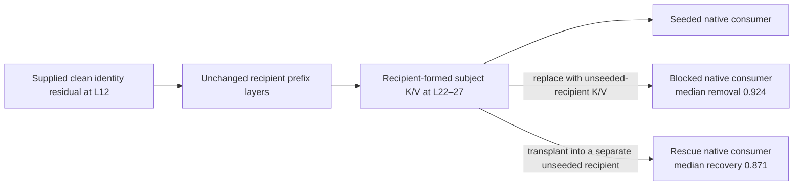

# Time-Formed Circuits in Transformers: Formation, Commitment, and Causal Use

Jacob Hollenbeck

## Abstract

A transformer mechanism can have a local write or read port while the state used there is formed through a longer ordered computation. We call this causal organization a time-formed circuit, identified by separating state formation from the authority of its product. Their anatomy distinguishes a source that seeds computation, an ordered formation interval, a committed store, and a downstream consumer. A local write can seed a computation whose stored support is distributed and whose read is concentrated. In Qwen2.5-1.5B, a supplied clean residual causes the recipient's unchanged remaining layers to form a late key/value record. Blocking the recipient-formed L22–27 record removes a median 0.924 of the seed-induced answer-logprob gain; independently transferring it into an unseeded recipient recovers 0.871. Exhaustive isolated-store sweeps distinguish formation from early intervention leakage and expose distributed necessity alongside strong late write ports. A diffusion transformer supplies a strict path-distributed subtype: in 15 setup/site-set cells sharing three baseline trajectories, no tested singleton attains the declared transfer or removal criterion, while whole-trajectory interventions attain both. Replayed image edits make the temporal organization visible: late source installation changes iris color while retaining more composition, whereas early installation changes composition without achieving the same color edit. Locality and temporal formation are compatible properties. The contribution is an interventionally grounded account of how controlling state acquires independent causal authority and is subsequently used. It motivates the architectural question of how recurring functional scaffolds support input- and state-dependent computations.

## 1. A circuit can be formed before it is read

A prompt helps construct causal state during execution that later computation depends on. Understanding the circuit requires tracing how that state is formed, committed, and consumed. The site where an intervention can seed an answer, the store that retains the resulting state, and the operation that reads it need not have the same causal support.

The central experiment follows that distinction in a decoder transformer. We write a clean animal-identity residual into a neutral recipient entering layer 12 of Qwen2.5-1.5B and let the model execute its remaining layers. The recipient forms its own late subject key/value state. Removing the formed L22–27 band before the answer reads it removes most of the upstream seed's effect. Transferring that same recipient-formed band into a separate, unseeded recipient restores most of the effect. The seeded recipient constructs the mediator; the independent rescue recipient receives that already formed state and computes its own answer through the unchanged suffix. This is a source → formation → store → consumer chain, measured with independent block and rescue interventions [E20].

**Figure 1. Formation and independent causal use in Qwen2.5-1.5B.** The late record comes from the seeded recipient rather than from a separately completed clean donor. Block and rescue operate after subject computation. Their ratios are medians of paired per-row answer-logprob effects with different numerators, each normalized by that row's seed gain; they are not complementary shares, probabilities, or unique mediation percentages. The source, execution settings, private-cache ownership, 42 row-level outcomes, and replay checks are retained in [the E20 record](../../../saturn/experiments/2026-09-30-full-layer-sweeps/FINDINGS-E20-mediation.md).

We call this organization a **time-formed circuit**. The term names a causal object whose construction history matters to its interpretation. A residual source intervention measures the ability to initiate that construction. An isolated key/value intervention measures the authority of already formed state. A read intervention measures the downstream operation that uses it. Collapsing those measurements into one answer to “where is the circuit?” loses the mechanism they jointly reveal.

The diffusion case makes the same question visible. A generated anime portrait can be restored to a captured execution state, receive a different internal source at chosen denoising calls, and continue through the native model. In the documented eye-color experiment, late installation produces violet irises while retaining more of the recipient composition; early installation changes composition while the irises remain blue [EDIT]. This is a target-assisted transplant of the target run’s complete contextual text stream at selected calls; it illustrates timing-dependent control with collateral. The useful control depends on both the installed operand and the history into which it is installed.

**Figure 2. A different future from the same captured past.** All edited branches resume the recipient checkpoint and use the unchanged FLUX.2 Klein denoiser, scheduler, and VAE. Early means denoising calls 0+1; late means calls 2+3; all-call means 0–3. These are denoising-call coordinates, not transformer layers. The intervention installs a complete target-derived contextual text stream at those calls. The late result is a useful appearance edit with visible collateral, rather than a guaranteed iris-only operation. The comparison illustrates temporal control; the separate whole-path assay in §6 establishes the strict path-distributed subtype.

This paper has one main claim: time-formed circuits can be identified by separating state construction from stored support and subsequent use. The apparent localization conflict is therefore expected: source writes, formed-store interventions, and read interventions localize different stages of one circuit. The transformer source-to-store experiments provide the main causal explanation. Diffusion adds a complementary support topology in which every tested singleton falls below the declared behavioral criteria while the complete trajectory controls the output. The [companion paper](../scaffolds-and-dynamic-circuits/bridge-paper.md) takes the next step: whether a reusable functional organization supports different dynamic computations over this formed state.

## 2. The operational object

### 2.1 State formation, commitment, and consumption

Fix a model checkpoint, an input contrast, a state interface, a site resolution, and an unchanged downstream consumer. Let execution advance along a declared ordered axis, with state transitions

\[
s_{t+1}=F_{\theta,t}(s_t,u_t),\qquad y=C_\theta(s_T).
\]

The axis can be layer depth during construction of a contextual transformer record, denoising calls during diffusion, or recurrent transitions in a state-space model. These axes are distinct; “time” does not imply a shared clock or tensor representation across them.

A **time-formed circuit** claim requires causal evidence that formation history matters at a declared native-state interface. We distinguish two evidence routes. In the **source-to-store route** used for Qwen, an earlier intervention changes a later recipient-formed record; an isolated block removes the source effect; and transplanting that record into a separate unseeded recipient independently rescues the effect. A separately intervened read adds evidence for the consumer role. In the **path-distributed route** used for FLUX, exhaustive singleton and whole-trajectory interventions at the same typed cut establish authority of the complete temporal path unavailable to any tested singleton under the declared criteria. Timing, native continuation, and carried-register interventions add formation/history evidence beyond that support profile. Generic execution order, cache append, or activation change without either kind of native-consumer evidence does not establish the class. E20 provides the primary mechanistic explanation; the FLUX matrix certifies only its stricter support subtype, not an independently mapped source-to-store mediator.

**Formation** names the computation that constructs the relevant state. **Commitment** names the acquisition of independent causal authority at a runtime interface, measured here by isolated block and rescue, rather than persistence in a cache alone. **Consumption** names the later use of that state. Commitment is relative to an interface and a read horizon: it does not imply that all later interventions are ineffective or that online weight learning has occurred.

The term “circuit” includes the causal relations among these stages. A stored tensor is a state component of the circuit; a successful local write is a port into it. The temporal claim concerns the evidenced construction and use of that state. It does not assert that a complete head-by-head graph has been mapped in every specimen.

### 2.2 Locality is a separate property

A mechanism can have locally decisive support at one interface and distributed support at another. A source residual can initiate formation. A late key/value write can install a coherent record directly. A small set of reading heads can consume it. The existence of one such local port does not determine the support of the other stages.

Accordingly, spatial locality and temporal formation are compatible axes. “Dynamic circuit” describes context- or state-dependent participation; it does not decide whether support is local, path-distributed, or mixed. We retain “space circuit” only as shorthand for locally decisive support at a declared grain, rather than as an exclusive alternative to time-formed computation. These examples do not yet supply a complete taxonomy of dynamic support across space, layer depth, denoising time, and recurrent transitions.

The **strict path-distributed subtype** adds four conditions at the same declared interface: no singleton is necessary, no singleton is sufficient, the whole path is necessary, and the whole path is sufficient. Necessity and sufficiency refer to stated behavioral criteria. Partial effects remain effects. The four conditions do not require nonlinearity and can be satisfied by a weighted additive mechanism. Temporal formation and the distribution of causal support therefore require separate evidence.

## 3. Following a source into its formed store

### 3.1 The Qwen mediation experiment

E20 uses Qwen/Qwen2.5-1.5B with frozen weights, CUDA FP32, eager attention, TF32 disabled, and seed 0. Fourteen single-token animal identities appear in three controlled contexts, giving 42 tokenization-compatible admitted rows. The neutral recipient uses `creature` in place of the target identity. Every row remains in the mediation analysis [E20].

At the subject position, a row-matched clean residual entering L12 is installed in the recipient. The recipient then computes its ordinary remaining prefix. Its subject K/V rows at L22–27 are captured as the proposed mediator. This choice matters: the mediator is generated by the seeded recipient, so its relationship to the source intervention is part of the experiment.

After the subject has finished computing, the block arm replaces the late band with the unseeded recipient's corresponding state. The rescue arm installs the seeded recipient's band into an otherwise unseeded recipient. Each suffix has a private deep-cloned cache, and the source hook is absent during suffix execution. The unchanged next-token distribution is the consumer.

Let the actual seed gain on row \(i\) be

\[
g_i=\log p_i(y\mid\mathrm{seed})-\log p_i(y\mid\mathrm{base}).
\]

Block removal and rescue recovery are calculated per row before aggregation:

\[
b_i=\frac{\log p_i(y\mid\mathrm{seed})-\log p_i(y\mid\mathrm{block})}{g_i},\qquad
r_i=\frac{\log p_i(y\mid\mathrm{rescue})-\log p_i(y\mid\mathrm{base})}{g_i}.
\]

All seed gains are positive, from 1.577 to 5.555 nats; their median is 3.515. These ratios are signed effect measures. Values above one mean suppression below baseline or recovery beyond the seed, rather than more than 100% of a unique causal contribution.

| Arm | Median fraction of seed effect retained | Target candidate top-1 | Target full-vocabulary top-1 |
|---|---:|---:|---:|
| Unseeded recipient | 0 | 3/42 | 2/42 |
| Residual seed at L12 | 1 | 42/42 | 38/42 |
| Seed + unseeded-recipient L22–27 block | 0.076 | 14/42 | 1/42 |
| Unseeded recipient + seeded L22–27 rescue | 0.871 | 37/42 | 37/42 |
| Seed + matched-width L16–21 block | 0.934 | 39/42 | 37/42 |
| Unseeded recipient + wrong-identity seeded band | −0.067 | 0/42 | 0/42 |

**Table 1. The source effect follows the recipient-formed late band.** Each retained-effect ratio uses that row’s actual positive seed gain as denominator before aggregation. Median block removal is 0.924, with item-bootstrap 95% interval [0.765, 1.030]; rescue recovery is 0.871 [0.850, 0.894]. An identity-cluster sensitivity bootstrap, retaining all three contexts for each resampled identity, gives [0.732, 1.075] and [0.835, 0.894], respectively. These intervals describe the controlled panel, whose rows share identities and context, rather than an independent population replication.

The wrong-identity mediator provides semantic discrimination: it authors its own identity on 37/42 rows under both candidate and full-vocabulary readouts. A matched-width earlier block removes only a median 0.066 of the seed gain. The earlier band is a timing comparison, not an assumed inert null; other routes can remain active.

Every block lowers target logprob. Per-row block-removal ratios range from 0.397 to 1.327, and per-row rescue-recovery ratios range from 0.695 to 1.055. The variation is informative. The late band carries most of the source effect in this organism, while remaining routes and different contextual basins prevent the result from being a unique-route decomposition.

### 3.2 What the experiment establishes

The independent rescue is the decisive counterpart to blocking: a record formed after a supplied source intervention has causal authority in another recipient. Reinstalling the original band after a block restores exact logits, but that arm is replay closure, not independent semantic rescue.

Together, source installation, recipient-native formation, late-band blocking, independent transplantation, and wrong-content transplantation establish a bounded source-to-store-to-consumer chain. They connect three quantities often treated as interchangeable: the ability to seed a computation, the necessity of its formed state, and the ability of that state to author the consumer's answer.

The claim is specific to this controlled identity panel and state cut. Formation is recipient-native after a supplied clean residual; it is not donor-free construction. The experiment identifies a formation interval and causal endpoint, while the internal carrier, writer, and edge path through that interval remains unresolved. It neither makes the band unique nor establishes the construction route of every natural donor computation. It provides direct evidence for the formation/commitment anatomy of time-formed circuits in a decoder transformer.

## 4. Formation windows and distributed stored support

E20 follows one supplied source into one later band. The exhaustive sweeps ask complementary questions: how broadly is the already formed store supported, and at which individual ports can coherent state be written directly?

### 4.1 A local source can initiate a longer construction

Moving a single residual write through depth maps a formation window. In Qwen2.5-1.5B identity, source writes remain near full normalized authorship through L22 and then decline: the reported L24 value is 0.57 and L27 is 0.37. Other decoder cells have different windows: SmolLM2 identity remains strong through L19 and drops to 0.07 at L23; Pythia-410M at step 16000 remains strong through L17 and drops to 0.01 at L22 [E16].

These curves identify where a supplied source can still produce the downstream result. They do not establish that the supplied layer alone contains all required causal support. The unchanged remaining computation performs the formation, and the independent E20 store intervention identifies a later mediator of that source effect.

An important protocol correction makes this distinction measurable. Replacing K/V during subject computation can change the subject's own attention and residual, which then writes into later layers. An apparent single-layer intervention therefore propagates into the construction process. E17 instead completes the subject prefix first, overwrites only its cached entries, and runs only later positions. This **isolated formed-store write** preserves the subject's already completed formation history [E17].

The correction removes striking early leakage. In Qwen2.5-1.5B identity, an in-forward L0 write of 0.985 becomes 0.009 under isolation. A genuine late isolated write remains: L23 reaches about 0.81. Thus early source authority, direct late-store authority, and intervention leakage are experimentally distinguishable.

### 4.2 Necessity and authorship have different profiles

Low singleton necessity alone could reflect a small backup pair. E19 therefore cuts every window start at widths 2, 3, 4, 6, and 8, and separately cuts each window's complement. The operator replaces the completed subject's K/V with the filler state before later positions consume it [E19].

| Cell | Rows | Best singleton necessity | Best width-3 necessity | Smallest tested width reaching 0.8 of whole-path necessity |
|---|---:|---:|---:|---|
| Qwen2.5-0.5B identity | 42 | 0.35 | 1.23 | 2: L20–21 reaches 0.99 |
| SmolLM2-1.7B identity | 34 | 0.31 | 0.67 | 4: L19–22 reaches 1.15 |
| SmolLM2-1.7B color | 27 | 0.10 | 0.42 | 6: L16–21 reaches 0.92 |
| Qwen2.5-1.5B identity | 42 | 0.08 | 0.23 | 6: L22–27 reaches 0.96 |
| Qwen2.5-1.5B color | 22 | 0.18 | 0.42 | 6: L22–27 reaches 0.89 |
| Gemma-2-2B identity | 42 | 0.08 | 0.18 | Not reached: L16–23 reaches 0.76 at width 8 |
| Gemma-2-2B color | 25 | 0.15 | 0.29 | 8: L18–25 reaches 0.84 |

**Table 2. Stored support varies from a backup pair to wider late bands.** Entries are median signed fractions of the corresponding whole-path logprob effect. Widths 5 and 7 were not swept, so reported widths are bounds on this tested grid. Negative effects and values above one remain in the raw record.

The Qwen2.5-0.5B identity result is an informative local case: two adjacent layers carry the effect. The stronger distributed-necessity identity cases in Qwen2.5-1.5B and Gemma require wider support than a three-layer backup. Their direct formed-store writes nevertheless remain strong at individual late layers, about 0.81 in both. Those cells belong to the broad formation/commitment account and do not satisfy the strict subtype's low-singleton-write condition.

Gemma adds a structured variation. Its positive identity write ports lie on sliding-window layers L16, L18, L20, and L22. The interleaved global layers can have negative individual effects yet contribute jointly to the wider band's necessity. On the short tested prompts, the sliding window already covers the context; reach alone does not explain the difference. This is evidence about learned layer roles in those cells, rather than a universal sliding-window law [E17, E19].

The original commit ledger compared source-write curves with sums of downstream store writes. The decoder curves have strongly correlated shapes, but individual write gains sum beyond the joint gain because coherent late writes overlap. We use this as a commit profile, not an exact conservation law. The source-mediated record, the redundant ports that can install it, and the support needed to remove it remain separate causal measurements.

## 5. Formed state and its read are different parts of the circuit

In E13, the answer's attention to the subject row is cut or restored at specified layers. Qwen2.5-1.5B identity has best-single-layer read necessity 0.074 of the whole-read effect; L23 single-layer restoration recovers 1.22 of that effect. A one-hot read of the exact subject row in the leading subject-reading head reaches normalized recovery 1.02 with target full-vocabulary top-1 on 88% of rows. Shuffled rows do not reproduce that result [E13].

In this Qwen identity cell, a store with distributed necessity has a concentrated read port. The local read accesses formed state. Its success does not imply that the formation and storage stages have the same locality.

E18 further shows that standardizing the subject's layer-0 key resolves the degenerate raw-cosine bucket used in the initial join experiment. A subject-referenced bucket identifies the row and a one-hot join can match the oracle at the commit layer. Query-derived semantic selection remains open: the tested predecessor-based query address fails to identify the subject in semantic identity, color, and coreference panels, while succeeding on surface repetition [E18]. The evidence identifies an executable read interface without claiming a complete query-to-address algorithm.

A later, separate Qwen2.5-1.5B experiment strengthens the formation account in contextual scenes. A supplied L12 identity seed yields target identity in 16/16 generated reads; transplanting the resulting recipient-formed L22–27 anchor into an unseeded recipient rescues identity in 16/16 [CONTEXT]. Fox/cat is the mechanics/discovery pilot; three further lexical scenes use the frozen design. These are correlated scene/order/binding contrasts under a different protocol, rather than 16 additional independent E20 items. The same experiment supplies the architectural bridge: changing only the native question changes the relevance of a byte-identical patch in the same parent store. We develop that selective-consumption result in the companion paper.

## 6. A diffusion transformer with strictly path-distributed support

### 6.1 The complete singleton and trajectory assay

FLUX.2 Klein 4B supplies a different topology of causal support. The tested checkpoint revision is `e7b7dc27f91deacad38e78976d1f2b499d76a294`, with BF16 execution, 256×256 output, four denoising calls, and guidance 1.0. Matched branches transplant target text-stream state for sufficiency or source state for counterfactual necessity, at one call or all four. The denoiser, scheduler, and decoder compute every endpoint [FLUX].

For image progress,

\[
P(I)=1-\frac{\operatorname{MAD}(I,I_{\rm target})}{\operatorname{MAD}(I_{\rm source},I_{\rm target})},
\]

the declared full-transfer criterion is \(P\geq0.90\), and the removal criterion after source replacement is \(P\leq0.15\). Every tested singleton is assessed with the same criteria as the whole path.

| Intervention question | Measured bound over three setups × five site sets |
|---|---:|
| Does any single-call target write attain full transfer? | Maximum P = 0.5620 |
| Does any single-call source replacement attain removal? | Minimum P = 0.20743 |
| Does the all-call target write attain full transfer? | Minimum P = 0.91309 |
| Does the all-call source replacement attain removal? | Maximum P = 0.01101 |

**Table 3. A strict path-distributed signature at the declared text-stream cuts.** The 15 setup/site-set combinations share three baseline runs. The full set of singleton measurements, zero-MAD no-ops, saved-distance arithmetic, report identities, and offline verifier are [bundled with the original paper](evidence/time-signature/README.md). Partial singleton effects, including 0.562 progress, remain visible.

A separate five-seed color panel extends the necessity half. Every single-call removal remains nearest the target, and all-call source interchange reaches the source on 5/5 seeds in both recorded route variants. All-call deletion is nearest null on 5/5 seeds in the historical carrier-swap arm and 4/5 in the residual-route arm; the norm-matched sham reaches null on 5/5 in both. Interchange therefore carries the semantic discrimination that deletion alone lacks. The five seeds are not five complete four-quadrant replications [FLUX].

FLUX is a transformer operating in a diffusion regime. Its denoising axis is different from the layer-depth construction axis of decoder K/V. The common class is time-formed causal organization; strict path distribution is the particular support profile demonstrated here.

### 6.2 Temporal authority and its interpretation

The diffusion dose panels show that nominal dose is not exchangeable across calls. Late double-dose schedules have substantially less target-image authority than all-call schedules with the matched nominal integral, and reversed net-zero schedules have opposite signed endpoint effects [TIME]. These observations show a time-dependent response. A time-varying weighted linear kernel can account for such effects, so we do not use them to certify nonlinearity.

Likewise, the strict matrix alone cannot distinguish weighted additive accumulation, redundancy, or adaptive re-derivation. It identifies path-distributed support at the intervention interface. Matched temporal schedules, carrier trajectories, mediation, and continuation add mechanistic information. Nonlinearity is an additional question when it matters to a particular claim, rather than a prerequisite for the class.

This ordering matters for interpretation: the diffusion result strengthens the class by exposing one support topology; it does not supply a definition that excludes the decoder's effective local write ports.

## 7. Rewind, change an operand, compute the future

The eye-color experiment captures a recipient diffusion checkpoint, installs a target-derived post-`joint.0` text output at specified calls, and executes the remaining native computation. Every sibling branch starts from the original recipient; edited siblings are not recycled as one another's parents [EDIT].

The early calls 0+1 reach whole-image progress 0.5772 while leaving visibly blue irises. The late calls 2+3 reach only 0.0689 whole-image progress but produce violet irises. Call 3 alone also produces violet eyes with lower whole-image displacement. The apparent disagreement is useful: whole-image target proximity measures resemblance to the complete target portrait, including its changed composition, and is not an eye-color or preservation score.

The intervention is target-assisted because its source sequence comes from a native target trajectory. It replaces the complete contextual text stream at the selected calls, rather than an independently isolated iris module. Hair highlights, clothing texture, expression, and facial details can also change. The established result is bounded temporal control of a visible attribute with measured and visible collateral.

A separate eye color × geometry closure assay crosses target/recipient current transformer program with target/recipient incoming scheduler register at a terminating boundary. Target program alone reaches eye-region projection 0.7124; target register alone reaches 0.4035; both reproduce the native joint RGB exactly [EDIT, closure record]. These are eye-region projections on that assay's native recipient-to-joint endpoint axis, not the whole-image progress used above. This establishes joint endpoint authority of the two declared operands; it is a factor contrast, not an independent mediation decomposition. The result gives the history a concrete state carrier: a correct current action can produce a different endpoint when applied to a different incoming register.

“Hardening” can describe this progression informally, but the measured terms are formation, commitment, and persistent influence. Earlier scene organization can constrain a later future while a particular appearance attribute remains editable. The effect is factor- and interface-specific, rather than an irreversible freeze of the entire image or a change in the model's weights.

## 8. What the anatomy explains, and where it varies

The source/store/read separation explains why successful local intervention and distributed causal dependence can coexist. An early residual restoration may author an answer by initiating later construction. A direct store transplant bypasses that construction. A read restoration consumes existing state. The results of these interventions answer different questions, even when their final answers agree.

It also changes the interpretation of instrument coverage. In the Gemma-2-2B comparison, feature-basis interchange with reconstruction error terms retained moves identity by at most about 0.08 of the native-state effect and color by roughly 0.31–0.42, while the native formed-state intervention has much larger authority [INSTRUMENT]. The operator and represented state differ; this is a bounded feature-basis coverage result. It does not establish that feature methods cannot measure temporal mechanisms or that all pointwise tools are inadequate. Exhaustive standard layer sweeps were themselves essential to finding concentrated write ports missed by earlier samples.

The class also admits different retention mechanisms. Mamba source writes and formed-state interventions reveal late retention/latch profiles, with dominant local writers. Those specimens do not satisfy the strict subtype. The recovered Falcon-H1 hybrid panel has attention-dominated formed-state dependence and weaker SSM writing; its source-formation window and retention clock remain unmeasured [VARIANTS]. We retain these as boundary profiles, rather than forcing every architecture into one certificate.

The broader trend is a separation of construction, retention, and use with family-local implementations. Qwen is the primary bounded causal-mechanism result. FLUX is the threshold-certified instance of the stricter path-distributed subtype: the reported setup/site-set cells satisfy the preregistered four-quadrant rule at the declared text-stream cuts. That certificate does not assign authority over the decoder result. The broader class and cross-architecture anatomy are supported working generalizations; a universal mechanism, complete circuit graph, or prevalence estimate across natural tasks is not established.

## 9. Method and evidentiary scope

Saturn exposes typed state boundaries, captures parent Frames or StateCuts, installs declared Acts, and runs the unchanged consumer. A replay restores retained state and recomputes the suffix. Future attention, residual updates, generated tokens, scheduler updates, and pixels are native computations under the altered state, rather than a recorded answer tape [RUNTIME].

The experimental record distinguishes four kinds of evidence: mechanics that validate intervention delivery and replay; instrument diagnostics that show what a representation or observable measures; signed trends across rows and contexts; and any explicitly bounded terminal certificate. A clean mechanics verifier does not certify semantic success. A missed transfer criterion retains its magnitude, direction, collateral, and control comparisons.

For E20, source/model identity, detached source tensors, private caches, finite values, explicit suffix positions, and split/full-forward parity are recorded. Maximum split/full-forward logit differences are about 3.8×10⁻⁵; recipient K/V reinstall and seeded-band block/restore are exact. Item and identity-cluster resampling are reported separately. The primary denominator is each row's actual positive seed gain, with denominator-sensitivity panels retaining all 42 rows.

The decoder sweep panels use controlled identity and color prompts, one execution seed, and heterogeneous admitted row counts. Best-of-window summaries follow exhaustive starts on the declared width grid; they are not exact minimum circuit sizes. Most consumer readouts are short next-token tests. The later contextual identity study adds freely generated four-token reads, while long autonomous reasoning remains a separate scope.

The diffusion assays fix checkpoint, seed or declared seed panel, precision, guidance, resolution, scheduler, and step schedule. Image-wide progress, source/target/null proximity, visual attribute observations, and eye-region projection are distinct observables. Target-derived payloads, supplied addresses, and native prompt-derived source construction are labeled explicitly.

This manuscript reuses existing runs and artifacts. No additional native model run is introduced by the rewrite. Raw results, historical retractions, and failed branches remain in their original records. Results from the author's excluded 2026-09-30 blind-certification and grail tooling are not used.

## 10. Relation to prior work

Transformer-circuit research already studies composed paths and cross-layer computation. Time-formed circuits are not a claim that previous work ignored execution order. The proposed addition is an operational causal category with separate source, formed-store, and consumer tests.

Geiger et al.'s causal-abstraction framework formalizes interventionally faithful higher-level accounts of model mechanisms [Geiger]. Our source, store, and consumer roles are a candidate causal decomposition at declared native-state interfaces, rather than a new general theory of intervention. Circuit Tracing studies prompt-specific feature interactions and distinguishes context-dependent local interactions from context-independent global weights [CircuitTracing]. The formation account complements that distinction by asking how a later state acquires independently testable authority, with live native attention and continuation at the declared cuts.

Meng et al.'s causal tracing identifies restoration sites involved in factual predictions and motivates ROME weight editing [Meng]. Our source intervention has related restorability semantics, but the new experiments distinguish a residual construction source from isolated native K/V support and connect that source to recipient-formed state. Hase et al. show that restoration-based localization can diverge from the best location for weight editing [Hase]. The anatomy here provides a candidate explanation for some such divergences, rather than a reproduction or general explanation of their weight-editing results.

Geva et al. identify enrichment of subject representations, relation propagation, and an attention-mediated extraction stage [Geva]. Agarwal reports early entity availability and later generation-controlling commitment across four decoder models [Agarwal]. These are direct predecessors for temporal staging. Our empirical additions are exhaustive isolated necessity and authorship profiles, window support, source-to-recipient-store mediation, and a separately intervened read interface. The new class claim is grounded in that causal decomposition and its explanatory use, rather than priority for late commitment alone.

Cheng and Zhang show failure of single-position task-state intervention alongside successful joint-position transfer [Cheng]. Their position axis differs from the depth-indexed formed store here, but the distributed-intervention lesson is shared. In diffusion, DifFRACT constructs timestep-conditioned feature-attribution graphs and uses temporal interventions [DifFRACT]. Temporal image control is therefore existing scientific context. Our diffusion contribution is the complete singleton/whole-trajectory necessity-and-sufficiency assay at native-state cuts, joined to replay and the construction/store/use account.

## 11. From time-formed circuits to functional scaffolds

The evidence makes a circuit's developmental history part of its causal anatomy. A locally effective source can cause later state to form; that state can have distributed necessity and concentrated write ports; its read can be localized and sensitive to the current query. Diffusion shows how a carried register and current program jointly determine a future, and how the timing of a write selects the kind of visible change obtained.

These observations support a next architectural question: how does a model reuse the organization that forms, addresses, and updates state while different prompts and current operations instantiate different causal computations within it?

The [companion bridge paper](../scaffolds-and-dynamic-circuits/bridge-paper.md) distinguishes an existing execution skeleton, prompt-formed contextual state, and dynamic semantic support. It investigates whether a recurring functional role graph organizes their interaction. The first paper establishes the formation and use of the causal object; the second develops the scaffold hypothesis and evaluates the evidence for reusable, context-sensitive organization.

## Evidence and references

Local links identify the scientific record and its code or raw artifacts. The original [space-and-time manuscript](paper.md) remains the broader dossier; its historical outline is not used to override completed corrections.

- **[E20]** [Residual seed → formed late K/V → native consumer](../../../saturn/experiments/2026-09-30-full-layer-sweeps/FINDINGS-E20-mediation.md), `job-e1f652e80f43`; [raw report](../../../saturn/experiments/2026-09-30-full-layer-sweeps/results/e20-qwen15-e1f652e80f43/report.json); [plan](../../../saturn/experiments/2026-09-30-full-layer-sweeps/PLAN-E20.md); [offline verifier](../../../saturn/experiments/2026-09-30-full-layer-sweeps/verify_e20.py).
- **[E16]** [Residual-write formation windows](../../../saturn/experiments/2026-09-30-full-layer-sweeps/FINDINGS-E16-residual-writes.md). Historical conservation and leakage interpretations are qualified by E17 and the current dossier; this paper uses the measured source curves.
- **[E17]** [Isolated formed-store writes](../../../saturn/experiments/2026-09-30-full-layer-sweeps/FINDINGS-E17-isolated-kv-writes.md); [worker](../../../saturn/experiments/2026-09-30-full-layer-sweeps/worker_panel.py); [collected reports](../../../saturn/experiments/2026-09-30-full-layer-sweeps/results/).
- **[E19]** [Window necessity and non-adjacent Gemma support](../../../saturn/experiments/2026-09-30-full-layer-sweeps/FINDINGS-E19-window-necessity.md).
- **[E13]** [Read cut and exact-row join](../../../saturn/experiments/2026-09-30-e13-time-circuit-read-join/FINDINGS.md); [read intervention worker](../../../saturn/experiments/2026-09-30-e13-time-circuit-read-join/worker_read_join.py).
- **[E18]** [Standardized bucket and semantic-address limitation](../../../saturn/experiments/2026-09-30-e18-bucket-join-time-reads/FINDINGS.md).
- **[CONTEXT]** [Recurring late interface and query-dependent state consumption](../../../saturn/experiments/2026-10-01-qwen-scaffold-context-poc/FINDINGS.md); [prospective plan](../../../saturn/experiments/2026-10-01-qwen-scaffold-context-poc/PLAN.md); [aggregate analysis](../../../saturn/experiments/2026-10-01-qwen-scaffold-context-poc/analysis/analysis.json); [worker](../../../saturn/experiments/2026-10-01-qwen-scaffold-context-poc/worker.py).
- **[FLUX]** [Pinned four-quadrant and five-seed necessity bundle](evidence/time-signature/README.md); [joint-region plan](../../../saturn/experiments/2026-09-30-flux2-joint01-time-accumulation/PLAN.md); [deletion correction](../../../saturn/experiments/2026-09-30-flux2-residual-deletion/FINDINGS.md).
- **[TIME]** [Integral Residual Dynamics, temporal kernels and the target-image observable correction](../integral-residual-dynamics/paper.md); [diffusion causal-clock demo](../../bfl/demos/diffusion-time-causal-clock.md).
- **[EDIT]** [Editing a Scene by Rewriting Its Execution](../../demos/scene-editing.md); [source-edit implementation](../../demos/artifacts/scene-editing/code/source_edit.py); [fresh reproduction](../../demos/artifacts/scene-editing/REPRODUCTION.md); [two-parent closure record](../../demos/artifacts/scene-editing/artifacts/closure/temporal-closure-summary.json).
- **[INSTRUMENT]** [Gemma circuit-tracer native-ablation and feature-interchange results](../../../saturn/experiments/2026-09-30-circuit-tracer-head-to-head/FINDINGS.md).
- **[VARIANTS]** [Corrected Mamba sweeps](../../../saturn/experiments/2026-09-30-mamba-full-layer-sweeps/FINDINGS.md); [recovered Falcon hybrid report and verifier](evidence/hybrid-attn-ssm/README.md).
- **[RUNTIME]** [Saturn state and native-consumer protocol](../../../saturn/docs/SATURN-BIBLE.md); [autoregressive runtime](../../../saturn/docs/AUTOREGRESSIVE-RUNTIME.md); [evidence-plane scope](../../../saturn/docs/EVIDENCE-PLANE.md).
- **[Meng]** Meng et al. (2022), [Locating and Editing Factual Associations in GPT](https://arxiv.org/abs/2202.05262).
- **[Hase]** Hase et al. (2023), [Does Localization Inform Editing?](https://arxiv.org/abs/2301.04213).
- **[Geva]** Geva et al. (2023), [Dissecting Recall of Factual Associations in Auto-Regressive Language Models](https://arxiv.org/abs/2304.14767).
- **[Agarwal]** Agarwal (2026), [Relation Before Entity: Deferred Commitment in Language Model Factual Recall](https://arxiv.org/abs/2609.17537).
- **[Cheng]** Cheng and Zhang (2026), [Single-Position Intervention Fails: Distributed Output Templates Drive In-Context Learning](https://arxiv.org/abs/2605.04061).
- **[DifFRACT]** Mazur et al. (2026), [DifFRACT: Diffusion Feature Reconstruction and Attribution for Circuit Tracing](https://arxiv.org/abs/2606.15796).
- **[Geiger]** Geiger et al. (2023; revised 2025), [Causal Abstraction: A Theoretical Foundation for Mechanistic Interpretability](https://arxiv.org/abs/2301.04709).
- **[CircuitTracing]** Ameisen et al. (2025), [Circuit Tracing: Revealing Computational Graphs in Language Models](https://www.transformer-circuits.pub/2025/attribution-graphs/methods.html).
