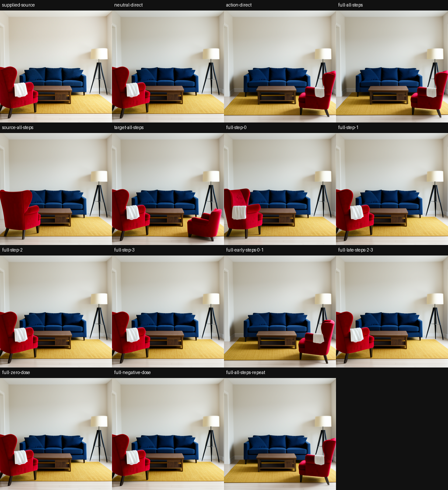

# Dynamic Circuits Loop Through a Stable Time Scaffold

Jacob Hollenbeck

*Submission manuscript, 2026-10-02 (rebuild). Companion to [Time-Formed Circuits in Transformers](../time-formed-circuits/paper.md), which establishes the circuit class this paper reuses.*

## Abstract

A model's output is controlled not by a static wiring diagram but by a dynamic circuit looping through a stable time scaffold. The scaffold is a reusable organization of causal roles — source, live reader or transition, writer, carried state, and native consumer — laid out along ordered execution; each step reads the carried state, writes new state, and shapes the next, while addresses, payloads, and timings vary per input. We identify it by intervening on recurring roles, not a fixed layer index. Three results risk the thesis directly: a byte-identical stored state takes different authority when only the question changes (16 of 16); a recipient-formed late key/value store authors the answer across three transformer families and at 7B, while a wrong-identity store authors the wrong identity; and pages formed jointly with their source match native behavior 6 of 6, against 1 of 6 for independent pages. It is executable: a prompt compiled once into a static source reproduces the native image byte-for-byte, 21 of 21 — parity the architecture guarantees, so the evidence is in the controls: wrong-source, wrong-sign, and unpaired installs fail. We state coverage per property, not uniform replication. The cross-family common graph ties a plain additive baseline, a blind depth-location rule failed while a fit-free attention locator predicted the band blind in two new families (Phi-2 6/6, OLMo-2 5/6), scene results are parity not task success, most results are single-seed, and the fixed lowering sits at its per-row interchange ceiling but transfers only moderately.

## 1. Introduction

A circuit in a neural network is usually read as a wiring diagram: a set of components whose activations, interchanged or ablated, change the output. The companion paper to this one shows that for factual recall this picture is incomplete. The state that controls the answer is not present at the input and read off by a fixed component; it is built across the ordered execution of the model, committed to a store, and only then consumed. We call that construction a time circuit.

This paper proposes that the time circuit is a scaffold through which dynamic circuits loop. On each step an operation does four things: it reads the present carried state, it acts through recurring writer and consumer roles, it changes the carried state, and it thereby influences the next operation. The machinery recurs across executions. The operations, sources, addresses, payloads, doses, and timings vary with each execution. The reusable organization of roles is the scaffold; the per-input computation loaded onto it — the source coalition, the address, the payload, the dose, the timing, and the participation that implement one computation — is the dynamic circuit, which the companion taxonomy calls a space circuit.

The word static needs care, because the scaffold is static in one sense only: the same causal responsibilities recur across the tested executions at a declared resolution, while the activations, addresses, and effective pathways still change. We therefore identify the scaffold not by a fixed location but by intervening on recurring roles and finding that they remain causally useful as prompts, payloads, and operations change. The scaffold is not one commit layer at a fixed index; location-fixedness of a late band is at most one weak symptom of it, and we treat it as such.

The time axis of the scaffold depends on the regime. In a diffusion model it is denoising time: a sequence of denoising operations forms a carrier that the remaining image computation consumes. In an autoregressive transformer it is depth through the layers plus token positions: formation through depth, commitment into a late key/value store, and a later read. In a state-space model it is the recurrent transition: ordered transitions transform carried state into new state that controls a later answer. The physical state, the clocks, and the distribution of causal support differ; the organization of responsibilities is what recurs.

**Thesis.** The computation that controls a model's output is organized as a reusable set of causal roles — a contextual source, a live reader or transition, a writer, carried state, and a native consumer — laid out along ordered execution; the machinery recurs across executions while the per-input dynamic circuit (which source, which address, which payload, which dose, which timing) loops through it, reading carried state, writing new state, and thereby shaping the next operation.

This thesis is a unification, and we state the mapping to prior work and claim only the delta. The staged, depth-structured organization is the causal counterpart of the staged recall of Geva et al. and the universal stages of inference of Lad et al.; the recurring reader re-weighted per operation is close to a function vector in the sense of Todd et al. and Hendel et al., read at a late site; the fact selecting a row is query-driven binding in the sense of Feng and Steinhardt; and a small set of components recurring across tasks is the reuse of Merullo et al. Our contribution is the combined causal anatomy — recurring infrastructure, changing semantic programs, carried state, separately tested source and consumer roles, and executable interfaces derived from that decomposition — and the demonstration that this anatomy recurs across a diffusion model, an autoregressive transformer, and a state-space model.

The claim matters for interpretation, and the exposed architecture already does practical work. The scene generator (Section 9) is the architecture written as a program: a prompt is compiled once into a static source, and the fixed interpreter consumes that source against the live carried image state and renders through the native decoder. Figure 1 is its proof sheet. A completely installed source reproduces the native image, a wrong source renders the other prompt's scene, and a wrong sign renders blank grey. Exact reproduction by itself is guaranteed by the architecture, because the prompt reaches the denoiser only through these keys, values, and pooled vector; what makes the roles real and separable is what the same machine does under controlled changes — the key acts as address and the value as payload, the time at which a source is installed decides which image properties it can change, and the current program and the carried image state are each incomplete without the other.

![Figure 1. The architecture written as a program (FLUX.2 Klein). A prompt is compiled once into a static source — paired keys and values at every cross-attention site plus pooled conditioning — and the fixed native interpreter consumes that source against the live carried image state. Left to right: the compiled source reproduces the native render exactly (MAE 0.0); a wrong source renders the other prompt's scene; a wrong sign renders blank grey; permuting token rows moves the image far less than the controls (MAE 4.6–22.8, against 54.5–94.3 for a wrong source and 60.0–89.3 for a wrong sign), because the key vector, not the row number, is the address. Exact reproduction is architectural custody; the controls carry the evidence.](figures/fig_scene_compiler_flux2.png)

The paper is organized around the architecture and seven properties of it; each has within-family causal evidence in at least two of the three families, with the coverage stated per property in the matrix at the end of Section 2. Section 2 states the proposed architecture, its roles, its functional form, and the levels of claim we keep separate. Sections 3 through 9 take the seven properties in turn: reusable interfaces host different computations; context and operation select the participation; state is formed over ordered execution and carried forward; newly written state changes later reads; the scaffold predicts held behavior; it lives in the trained weights; and it is executable as a model virtual machine. Section 10 reports what does not generalize. Sections 11 and 12 give related work and limitations. Section 13 collects a set of recent checks that test a proxy rather than the role graph, with their limits. Every quantity is measured through the unchanged native consumer — full-vocabulary logits or native greedy continuation for language models, the native scheduler, latent bridge, and decoder for diffusion. Effective sample sizes are stated per claim, because the replication unit is the context; most language-model and state-space results are single-seed under a prototype-first policy, and diffusion panels use two to five seeds.

## 2. The proposed architecture

A time circuit is the construction, carrying, and consumption of the state that controls a model's output, laid out along ordered execution. This paper takes the existence and causal authority of that circuit as established by the companion work and asks what is reusable about it and what is free.

The **scaffold** is the reusable organization of causal roles. Let a family-local execution expose candidate sites and causal relations. The roles are a contextual source, a current operation or address, a live reader or transition, a writer, a carried state, and a native consumer. A family-local lowering maps roles to sites, and the map can be partial and many-to-many. A role earns content only from native intervention consequences: a label read off a tensor shape, a line of architecture documentation, or the mere order of execution is a hypothesis, not a finding. To call a node a mediator we require a source lesion, a store lesion, and an independent downstream rescue; a bounded replacement or write assay establishes only the narrower causal role it actually tests.

The **dynamic circuit** is the free part: the source coalition, the address, the payload, the dose, the timing, and the participation that implement one computation on the scaffold for one execution. A concrete example runs through the paper. Eye color and eye geometry in a diffusion model reuse five to seven of the top eight consumer heads, while their selected source programs share only ten to fifteen of sixty-four rows across depth: the same consumer machinery is loaded with different source coalitions. Dynamic does not mean that weights change online; it means that the causal support used for one computation varies with the live input and history while remaining organized by a reusable set of roles.

We can make the definitions formal, following the causal-abstraction standard of Geiger et al. A lowering maps each role to a set of low-level sites — the map may be partial, many-to-many, and a role may lower to a band or a span — and an alignment reads role values off the low-level state at those sites. The pair is a **scaffold** over a context set, an operation set, and the time index if, for every role and every pair of contexts, intervening on the low-level sites commutes with intervening on the high-level role up to a tolerance, which is interchange-intervention accuracy. The force of the definition is the word fixed: the lowering and the alignment do not depend on the context, the operation, or the time step. The **dynamic circuit** for one context-and-operation is then the active edge set — the edges whose interventional effect on the output is non-zero — together with the realized values: the source rows, the address, the payload, the dose, and the timing. The thesis, formally, is that there exists one fixed lowering and alignment with high interchange-intervention accuracy across a broad context-by-operation range, while the active edge set and realized values vary with the input.

Two consequences shape how we read every result below. First, "static" means a fixed alignment, not a fixed layer index: a role that lowers to a band satisfies the definition even if the single layer with the largest effect moves inside that band from context to context, which is why we treat location-fixedness as a weak symptom rather than the criterion. Second, coordinates are not unique: for any invertible reparameterization of the state, the composed lowering and alignment are an equally valid scaffold, so there is no intrinsically canonical wiring diagram and our claims are about interventional behavior at declared sites, never about a unique graph. The practical test of a scaffold is therefore the swap-success rate of an interchange intervention, which is exactly what the model virtual machine of Section 9 measures. A direct measurement of this interchange-intervention accuracy for the fixed role lowering — on held contexts crossed with held operations, against a per-row re-fit ceiling taken over six overlapping candidate bands and against random-lowering and wrong-role floors — tests the fixed-scaffold claim (preregistered with hashes frozen before any job; the lowering frozen from earlier work at Qwen2.5-1.5B L22–27 and Gemma-2-2B L16–23; `saturn/experiments/2026-10-02-fixed-lowering-iia`). The decisive statistic supports the claim: the fixed lowering sits at the per-row ceiling, with fixed-over-ceiling 0.87 (CI 0.74 to 1.00) in Qwen and 1.00 in Gemma pooled over identity and color, so re-fitting the band per row buys at most 13% in Qwen and nothing in Gemma, while the wrong-role floor is 0.00 everywhere. Absolute transfer is only moderate, however — identity and color interchange accuracy is 0.57 and 0.76 in Qwen and 0.31 and 0.63 in Gemma, below the 0.75 target, with the misses concentrated on held exotic single-token animals and with the held size operation (4 admitted rows) and position (0 admitted) underpowered. The fixed-not-per-input claim is supported on its named statistic; a claim of high absolute interchange accuracy is not.

The functional form makes the loop explicit. Writing the carried state as z, the current operation as u, and the contextual source as s, one step of the scaffold is an address a, a written update w, a state transition, and a consumer read:

> a_t = A(s, u_t, z_t);  w_t = W(s, u_t, z_t, a_t);  z_{t+1} = T(z_t, w_t);  y_t = C(z_{t+1}, u_t).

The new state z_{t+1} is the carried state for the next step, which is the sense in which the dynamic circuit loops through the scaffold. In a state-space model one channel of a fixed mixer instantiates this directly, with a retention coefficient, a write, and a read: h_t = ρ_t ⊙ h_{t−1} + w_t, read through s_t = ⟨c_t, h_t⟩ + D u_t, where the cached convolution buffer helps determine the retention, write, and read coefficients together. The physical lowering of A, W, T, and C differs across families; the organization is what we test.

The sense in which the scaffold is **built over ordered execution** needs stating precisely, because one natural reading is not discriminating. The non-discriminating reading is "the store is absent from the early layers," which is true by the thesis itself and therefore predicted rather than evidence. The evidence we hold is the ordered dependency structure: a seeded late store authors the answer while the seed activation, a matched early band, and a held-out linear image of the seed do not (companion paper); an in-forward cut at the first layer leaks the whole of formation into the measurement while an isolated cut does not (0.985 against 0.009), which is why every store claim uses isolated cuts; a source's residual becomes an independently causal carried state only after formation (Section 5); and causal ancestry changes the meaning of carried state, so a state formed jointly with its source is not the same as the same tokens assembled independently (Section 9). The stronger question — where along execution the store is actually built — has now been tested correctly with a preregistered, band-internal design, and the answer refines the architecture: the late band is the commit and read-out zone, while the content is formed over the preceding depth and arrives at the band already present (Section 5).

We keep the levels of claim separate, because the architecture graph can be written down without data and most of the content is above that line.

| Level | What it says | Why it is insufficient alone |
|---|---|---|
| Architecture graph | Modules and state interfaces recur by construction | Can be written without data or learning |
| Fixed weights, dynamic activations | Inputs produce different activations under one checkpoint | True of almost every network |
| Recurring physical sites | Similar layers or steps carry high effect | May reflect depth, scale, or a generic bottleneck |
| Reusable causal interface | A prior-fixed interface has native causal authority on new contents or operations | Establishes reuse; need not identify every role |
| Mediated role edge | A source changes recipient-formed state whose block and rescue change the native endpoint | Requires formation, block, and independent rescue |
| Predictive role profile | A frozen role profile predicts held effects beyond a claim-matched generic account | Collected most cleanly for the relational reader |
| Learned organization | The profile depends on trained weight correspondence and is acquired in training | Weight disorder supports dependence; chronology needs an authentic trajectory |
| Dynamic semantic support | Input-specific support on the scaffold directs an unchanged native consumer | Requires semantic counterfactuals and per-row native endpoints |
| Cross-family role graph | Family-local lowerings instantiate one aligned topology | Requires within-family evidence first; forbids tensor equivalence |

A prospective role prediction separates discovery from evaluation: discovery cells rank sites, infer roles, and fit the family-local resolver; a held partition opens unused contexts or operations with the profile, site bindings, doses, preprocessing, metrics, and inclusion rules frozen in advance, and clean native competence may gate row eligibility only if the rule is frozen and uses no intervention outcome. Ineligible rows stay in the denominator as native-incompetent, not as scientific negatives. We label each result with the partitions it implemented.

The family coverage is uneven, and we state it per property rather than claiming uniform replication. State-space evidence is one family, Mamba (130M–2.8B); Property 6 (learned organization) is transformer-centric; and Property 5 (prediction) has no standalone diffusion prospective test.

| Property | Diffusion | Transformer | State-space (Mamba) |
|---|---|---|---|
| 1 reusable interfaces host computations | measured | measured | measured |
| 2 context/operation selects participation | measured | measured | measured |
| 3 state formed over ordered execution | measured | measured | measured |
| 4 written state changes later reads | measured | measured | measured |
| 5 predicts held behavior | none | prospective | prospective |
| 6 lives in trained weights | none | measured | none |
| 7 executable (scene generator / VM) | measured | measured | measured |

Cells read: *measured* = within-family causal evidence; *prospective* = a profile frozen before evaluation predicts held contexts; *none* = no within-family test. The transformer *prospective* cell now covers location too: a fit-free attention locator predicts the commit band blind in two new families, where an earlier depth-fraction rule failed (Section 7.1). The fixed-scaffold claim itself is tested directly by interchange-intervention accuracy of the frozen lowering (Section 2): the lowering sits at the per-row re-fit ceiling (fixed-over-ceiling 0.87 in Qwen, 1.00 in Gemma), supporting fixed-not-per-input, but absolute transfer on held items is only moderate, so high absolute accuracy is not claimed.

## 3. Property 1 — reusable interfaces host different computations

The first property is that one reusable interface carries several different computations, which is the scaffold recurring. It holds in all three families.

In diffusion the reusable interface is a recurring text-processing spine and a late image handoff. In FLUX.2 Klein 4B, radical paraphrases reuse the same ordered spine: causal profiles are more similar across different wordings of the same scene organization than across different organizations, at cosine 0.913 against 0.734, and the late image seam appears among the strongest support in eight of nine prompt families. A cup, an anime character, and an empty illuminated corridor use the shared substrate with different temporal profiles. The machinery recurs while the semantic program on it changes.

The dynamic part of this interface is concrete at the level of individual attributes. Eye color and eye geometry reuse five to seven of the top eight consumer heads while their selected source programs share only ten to fifteen of sixty-four rows across depth. Selecting the same consumer machinery does not automatically select the same operation; the source coalition and its binding to that machinery are what differ. The same reusable consumer hosts two different computations.

In a transformer one fixed late key/value interface serves several operations. In frozen Qwen2.5-1.5B the layer-22-to-27 attention key/value interface, fixed before transfer to new lexical scenes, carries color, position, and identity reads: replacing the queried fact's stored state redirects color answers in 16 of 16 rows, position answers in 12 of 16, and identity in all 11 readable patched continuations. One prior-fixed interface carries several operations; it does not follow that each read uses an identical microscopic circuit (single seed).

The transformer store role lowers onto a recurring late band across sizes and even onto a different block type in a hybrid. The commit sits at a recurring fractional depth — in a state-space model at layer 20 of 130M, layer 39 of 370M, and layer 44 of 2.8B, relative depth 0.69 to 0.83 — and at 7B the transformer store lands in a late band with every one of 40 fresh facts committing in layers 19 to 27. A recurring late band at a fixed relative depth may also reflect a generic depth bottleneck, so we take location-fixedness here as a weak symptom, not as discriminating evidence (Section 13). In Falcon-H1-0.5B, which interleaves attention and state-space blocks, the store role lowers onto the attention side: the late attention key/value store carries the identity read (effect −1.774, 17 of 22 flips, write authority 0.987) and color (−2.289), while the state-space store does not (−0.038, 2 of 22), and a concentrated state-space writer predicted by analogy to the pure Mamba case was not found and is disclosed as a failed prediction. The store role recurs; its physical lowering is family-specific.

In a state-space model one shared recurrent state serves two operations. In Mamba-130M one country-history state serves both reading a country's identity and reading its capital, delivered through the same late recurrent store. One recurrent interface, read two ways, is the state-space form of a reusable interface (single seed).

## 4. Property 2 — context and operation select the participation

The second property is that context and operation select which part of the scaffold participates — the dynamic circuit chosen per input. The cleanest demonstration holds the stored object fixed and changes only the question.

A byte-identical stored state acquires different authority under different questions. In Qwen2.5-1.5B we fix a late key/value store and its intervention bytes exactly — same parent state, same layer band, same positions, same tensor digests — and change only the native question. Asking for the patched fact rather than the other fact increases the patch's harm to the correct answer by a median 3.130 nats for color (positive in all 16 of 16 contrasts), 0.583 nats for position (16/16), and 3.021 nats for a position-to-color lookup (16/16), with 128 directional pairing checks passing. Context changes the causal authority of the same stored object; the participation is selected per input (Figure 2).

The state-space model shows the same with two operations on one history. Reading a country's identity and reading its capital draw on byte-identical carried state; delivering only the successor state's content changes the later answer in all 12 exact-qualified rows, while convolution-only and immediate-output-only controls retain the baseline. The operation selects which read the shared state supports (single seed).

The recurring reader is re-weighted by the operation, not rebuilt by the fact. The signed causal reader profile, measured per item on fresh facts in Qwen2.5-1.5B and Gemma-2-2B, holds together within an operation at cosine 0.74 to 0.99 (Qwen identity 0.749, color 0.735, capital 0.988; Gemma 0.895, 0.865, 0.807) and falls across operations: identity and the relational capital-of reader share only 0.204 in Qwen and 0.218 in Gemma, while the two surface read-back operations, identity and color, agree at 0.842 and 0.911, at or above the within-operation values. The reader is a fixed object that the operation tunes — the two read-back operations load one reader and the relational operation loads a distinct one (Figure 3). This per-item across-fact cosine is the robust statistic; a variance-ratio headline that an earlier draft used instead is an artifact of an under-sampled lexical-set fact factor and is discussed in Section 13.

At head and edge resolution the recurring reader resolves into shared value routes with operation-specific weights. A microscopic map in Qwen2.5-1.5B finds two recurring value routes — layer 23, head 0, value; layer 22, head 1, value — and both grouped-query reader groups participate; within a binding the profile recurs at cosine 0.947 for identity, 0.927 for color, 0.961 for relation, and across operations identity and relation share only 0.336. Identity loads the layer-23 route, relation loads the layer-22 route, and color loads both. What moves with the fact is which row is read: the raw attention mass over the target span across two facts holds at cosine 0.61 to 0.70, markedly less stable than the intervention-effect reader profile at 0.93 to 0.96, so the selected rows move while the reader holds (single seed).

The address-versus-payload split follows from an exact attention identity, which the diffusion scaffold then confirms. For a single head with attention weight α on the touched slot, changing the key can only re-weight the existing payloads — its effect is bounded by the difference between the slot value and the output and saturates as the weight is driven to one — while changing the value adds to the output linearly, gated by the existing attention weight. Subtracting the two single-operand effects leaves an interaction proportional to α(1−α)(E−1)/D times the value change, which is non-zero only when both operands change and the weight is strictly between zero and one, and positive along the value change when the new key raises attention. The identity therefore predicts a matched key-and-value edit to be superadditive and neither operand alone to repair a slot that carries the wrong payload. An SDXL factorial confirms the pattern: holding the live query fixed, the base key with base value gives image-axis progress 0.72139, the candidate key alone 0.66201, the candidate value alone 0.71808, and the matched pair 1.00000, so the key-by-value interaction is 0.3413 and positive, as the identity requires (Figure 4). We caveat that the progress statistic projects through many heads, steps, and a nonlinear renderer, so the identity predicts the qualitative pattern, not the scalar.

The identity also predicts that jointly permuting the key and value rows is exactly invariant, because softmax attention over a set with no positional term in the keys is invariant to a joint row permutation — so the token row is a basis coordinate, not the lookup address, and the key vector is the address. In SDXL the measured joint permutation is near-invariant but not exact: it gives image-axis progress 0.859 with the same semantics and altered composition, against 0.436 and 0.627 for key-only and value-only permutations and 0.358 and 0.413 for a wrong key and a wrong value. The exact-invariance theorem applies to cross-attention with no positional term in the keys, as in SDXL, so we treat the residual SDXL gap as an open check — not every row-indexed path may have been jointly permuted, and reduction-order non-associativity can amplify over the sampling trajectory — and flag that it should be run in double precision at one site before the 0.859 is cited as anything but near-invariant. FLUX.2's joint attention may assign positions to its text tokens, so exact invariance is not expected there; its row-permutation pixel error of 4.6 to 22.8 nonetheless stays well below the wrong-source (54.5 to 94.3) and wrong-sign (60.0 to 89.3) controls, with its maximum of 22.8 below the minimum wrong-source value of 54.5, so the key vector, not the row number, is the address.

The static-bus, dynamic-query split appears when two runs share a prompt but diverge in carried image state: the keys and values are byte-identical across scheduler calls, while the query of the edited run departs from the query of the base run at the same site as their carried states diverge — candidate-to-base query cosine 0.9999 at the first call and 0.8399 at a late call (block one 0.9901 to 0.8216). With the prompt's keys and values fixed, the address is generated by the carried state, which is the scaffold-versus-dynamic split made concrete: the weights and compiled keys and values are the fixed lowering, and the carried-state-generated attention over the query is the active edge set at that time. With routing frozen the network is linear in its payloads, so a conjunction requires routing that the carried state generates, which is why relations load on the carried state rather than on a fixed address ([Thm] in `reviews/dynamic-circuits-theory-2026-10-02.md`).

Combining operations introduces a dynamic circuit of its own. Color and geometry together require an interaction field beyond their independent sum; reversing its sign, changing its dose, or moving its addresses changes the native output, and the addressed dose response repeats across fresh seeds and changed prompt grammar. The conjunction has a consumer-visible role of its own, which establishes interaction authority without yet predicting an unseen combination because all measured factor corners were available to construct it.

## 5. Property 3 — state is formed over ordered execution and carried forward

The third property is the time axis itself: state is formed over ordered execution and carried into later computation. The companion paper establishes the quantitative mediation; this paper reports its breadth and its diffusion and state-space analogues.

The source-to-formed-store edge holds across three transformer families (four cells, including held-out identities) and at 7B. In Qwen2.5-1.5B a source seed entering an early layer acts largely through the subject's late key/value band: blocking that endogenous band removes a median 0.924 of the seed's answer-logprob effect, transplanting the band formed by the seeded recipient into an unseeded recipient recovers 0.871, and a wrong-identity band authors the wrong identity on 37 of 42 rows. The same block-and-rescue dissociation reproduces in two non-Qwen decoder families and on held-out identities — held-out Qwen block 0.728, rescue 0.713 (n=79); Gemma-2-2B 0.768, 0.985 (n=42); SmolLM2-1.7B 0.740, 0.910 (n=34), each with a matched earlier band removing far less and a wrong-identity transplant authoring the competitor — and it holds at 7B, where transplanting the seeded late band restores 0.770 of the seed gain while isolating it out removes 0.595 and a wrong-identity donor does nothing (−0.026, n=40). The block is lower at 7B only because the commit is redundantly spread across several late layers and a fixed six-layer mediator cannot capture a commit that leaks to the last layer; the rescue, which installs the whole band, is unaffected. The model itself forms the mediator after the source intervention, and its unchanged suffix supplies the answer (single seed per cell).

The model forms the consequential state during inference, for several payloads. In Qwen2.5-1.5B a supplied earlier residual seed at layer 11 or 12 runs through the recipient's remaining native layers and produces new late key/value state; installing that recipient-formed state independently rescues identity in 16 of 16 generated reads, and blocking it restores donor identity in all 14 available reads, while a fact-span patch at an earlier band gives the donor identity 0 of 15 — the early K/V transplant moves projections of an unformed residual, which is the signature of formation rather than a falsifier. The same source-to-state-to-answer path extends to Python return-value retrieval and literal copying, while alias resolution exposes a binding limit — transferring the source anchor alone can recover the wrong binding even when a complete residual seed recovers the requested value. A full sweep adds an asymmetry that fits distinct formation, commit, and consumption roles: no single layer carries more than about 8% of the removal effect, while a late isolated key/value write recovers about 81% of normalized answer-logprob gain, so the write port is concentrated while necessity extends across a wider band.

A preregistered band-internal test asked where along the band the store is built, and its decisive predictions failed in a way that refines the architecture rather than confirming the original reading. Three preregistered checks passed and are informative. No single band layer carries the store: the best single layer reaches 0.732 of full-band rescue in Qwen2.5-1.5B and 0.804 in Gemma-2-2B, below the 0.90 threshold, so the commit is distributed across the band (P1a, P1b pass). The band's own computation is not what forms the content: freezing the band layers' attention and MLP leaves the rescue intact (0.904 in Qwen, 1.023 in Gemma), so the content is already present in the residual at band entry and each band layer's key and value projections only commit it to the readable store (P2c pass). And the consumer reads at the subject position: cutting the consumer's attention to the subject collapses the rescue (0.871 to 0.010 in Qwen, 0.985 to 0.015 in Gemma) while cutting its attention to other positions does not (P3a-i and P3a-ii pass). The decisive predictions, however, failed: the prediction that the band's own computation builds the transplantable store (P2a) failed in both families and its falsifier F2 fired; P3b failed and F3b fired, so blocking the subject's reads of earlier positions leaves rescue intact, with only a small (~0.06) drop in Qwen; and P1c failed, so the depth ramp is non-monotone and non-additive. The honest reading is that the test refuted "built inside the band" and supports "committed at the band, formed before it". The positive evidence that the content forms over the preceding depth is the independent L11/L12 residual-seed leg — a seed run through the recipient's native layers rescues identity in 16 of 16 while an early key/value transplant gives 0 of 15 — not the pre-band subject-position freeze, which is uninformative (Section 13); where within the pre-band depth the content forms is not localized. In the role vocabulary the writer is the depth up to band entry, the commit is the band's projections, the carried state is the key/value cache, and the reader is the consumer's attention at the subject position — formation over ordered execution, committed at the late band, read later (prereg-frozen; decisive predictions falsified and the thesis refined; Qwen and Gemma; single seed).

In diffusion the time axis is denoising time, and the strongest evidence is that the timing of a write decides the kind of edit. Installing the same source state early in denoising changes composition and framing; installing it late changes iris color while keeping composition. That early-to-composition, late-to-color split is also what generic coarse-to-fine denoising predicts — coarse structure is unresolved only at high noise and fixed at low noise — so we read it as consistent with the architecture and as showing time-indexed authority, not as discriminating evidence. In a four-case reproduction the early eye-color arm reaches whole-image progress 0.5772 while leaving the eyes blue, and the late arm reaches only 0.0689 while visibly turning the irises violet; the final-call arm alone reaches violet eyes at progress 0.0289 and base RGB MAE 5.21. The same time-dependence appears as a source's authority varying with the denoising call: an SDXL base-key/value lesion at the first call moves the image by a mean absolute pixel error of 20.82 while the identical lesion at a late call moves it by only 2.15, so the earliest source binding carries the greatest downstream authority even though the native source remains in use later. Where on the schedule the dynamic circuit acts determines what it can change (Figures 5 and 6; single model, four matched cases, 56 reproduced images).

Carried history is a second state that must agree with the current program. At a final eye-color-by-geometry boundary, supplying the target current program alone reaches image-region progress 0.712, supplying the target carried register alone reaches 0.403, and supplying both reproduces the native endpoint exactly. These are progress measurements, not additive shares; their importance is that current computation and carried history can be changed separately and must agree for exact closure.

Object transport shows the time axis as a spatial-temporal conjunction across steps. In the chair experiment, writing only at the destination creates a second chair while leaving the original, and writing only at the source reinforces it, while coordinating both spatial regions across the early pair of steps moves the chair — no single step performs the move (Figure 7). The operation depends on a spatial conjunction and a state-dependent sequence.

A state-space model makes ordered execution especially visible, both as composition and as a carried source-to-writer map. In a bounded relation task with a demonstrated grammar, sequential recurrent transitions compose directional clauses into the expected diagonal on all three native-applicable rows, while adding the primitive endpoint states produces none; staged execution retains an intermediate state and matches direct native execution exactly, and the pattern replicates on the competent rows of two checkpoints. Separately, a development-frozen map of the layer-0 source output and the layer-18-to-20 writer state transfers to two fresh contexts: installing only the selected formed state changes the identity answer to donkey and produces a Vienna capital continuation, with selected-state effects of +4.59 and +7.65 nats, and restoring the selected state to base removes 90.3% and 91.6% of the source intervention's later effect. At this immediate cut the convolution component carries nearly all of the selected-state effect, so Mamba's inclusion rests on a convolution-dominant carried-state path at the tested cut, not a universal recurrent-memory mechanism (single seed).

The FLUX four-quadrant certificate belongs inside this account as one subtype rather than the criterion. At the declared FLUX.2 cuts no tested single step reaches the full-transfer or necessity criterion while the complete path reaches both, which establishes path-distributed temporal support across 15 setup-by-site combinations; a weighted-additive profile also passes all four quadrants, so the certificate buys less than its name suggests and we present it as evidence about a subtype, not proof of the architecture.

## 6. Property 4 — newly written state changes later reads

The fourth property closes the loop: state written at one step changes the native read at a later step. The evidence is single-seed and we present it as bounded.

A directed two-update path changes a later semantic answer. In Qwen2.5-1.5B, in a development organism and in one of three held city-and-country contexts, the model produces France and forms new memory while processing that prediction; with the visible France token and the earlier state held fixed, replacing the newly formed row with Germany state changes the later answer to Germany, zeroing it breaks the continuation to a function word, and reinstating it restores France. The other two held contexts are causal-but-incompetent or fail to form the target, so the competent held count is 1 of 3.

A route-to-write-to-future assay shows the write is exact and the later access is lawful. Changing layer-22 attention probabilities while retaining the recipient's live values changes the layer-23 key/value state; transferring only the new key reproduces the altered later attention exactly, while transferring only the values preserves the native attention, which is the expected key-query algebra of a genuine read. The total route effect is a small positive answer-margin gain, but the layer-23 contribution counteracts it while the complete layer-23-to-27 band transfers or removes the future effect exactly, across one development and three fresh held contexts, with all greedy answers unchanged. The scaffold carries interacting, signed contributions, and a single answer score can conceal that structure.

A four-cell history-by-row decomposition locates the authority. Crossing base and edited retained history with base and edited newly formed rows, the retained history outside the new row carries positive authority of +1.279 to +1.576 nats in all four held contexts while the complete new row opposes that direction, with a negative interaction and a positive total of +0.957 to +1.425 nats; every primary four-cell greedy answer stays the supplied base country. A one-parameter retained-history account predicts the three-arm effect vector better than serial-only and any-edit accounts in all four held contexts (mean context error 0.0995 against 2.7024 and 1.2574), and a two-parameter mixed account improves only marginally and does not identify a separate topology.

The loop recurs in both other families. In Mamba the selected state is consumed during the first supplied future token and becomes a distributed successor difference; installing that complete successor state alone reproduces the later logits, continuation, and next write exactly, and a fresh CPU identity context changes dog to cat through a native update with a +2.74-nat selected-state effect that is convolution-dominant (+2.79 nats convolution-only, −0.04 recurrent-only). In SDXL a native writer-to-successor-to-later-writer path holds on one development and one held prompt and seed: a stale writer intervention can match its immediate output while producing a different successor and later writers, and only complete live repair restores the native image exactly, so the incoming carried state remains consequential after an immediate writer match.

## 7. Property 5 — the scaffold predicts held behavior

The fifth property is prospective: a role profile frozen before evaluation predicts effects in contexts never opened. It is earned for the transformer relational reader (8 of 8 held contexts), the Mamba capital (8 of 8) and delayed-identity (4 of 4) readers, and — for the scaffold's location — a fit-free attention locator that predicts the commit band blind in two new families (Section 7.1); it is not a general property, and the misses are disclosed. The reader-profile freezes rest on a file-timestamp seal rather than a hashed preregistration, whereas the attention locator, the formation-over-time, and the clock retests carry frozen hashes and canaries.

In a transformer a frozen 24-coordinate reader profile predicts held relation contexts. We froze the signed profile and three competitors — an operation-blind mean, a wrong-operation profile, and a within-band coordinate permutation — before opening any held context, then evaluated on two lexical sets crossed with two templates and two orders. For relation the frozen profile beats every competitor in raw error in all eight contexts (mapped cosine 0.954 against the operation-blind 0.566, raw RMSE 0.029 against 0.149), winning seven of eight by signed shape in the all-row view and eight of eight competence-conditioned. The prediction is operation-specific: color retains the broad shape but misses its reader ordering (five of eight), identity does not separate from the operation-blind profile, and size is unavailable (eight correlated contexts; single seed; Figure 8).

In a state-space model a frozen 27-coordinate profile predicts held pairs. Frozen on a development context, it predicts two held country pairs and two delays: the capital reader beats operation-blind, wrong-operation, and coordinate-permuted competitors in all eight rows (mapped cosine 0.9941 against 0.9880) and a delayed identity reader in all four (0.9586 against 0.9102), with successor delivery changing the answer in all 12 qualified rows (single seed).

A prospectively matched cross-family core aligns one edge, with its limits. The single edge from formed carried state to the native consumer aligns across two diffusion rows and two state-space rows, with the two families' mean profiles matching at RMSE 0.0928 against 0.8526 under a permuted-role map, but with partial visual rescue on one diffusion factor and heterogeneous greedy rescue in Mamba. We report a suggestive common edge on a small denominator, not a shared graph, and the full common-graph null is in Section 10.

### 7.1 Predicting where the scaffold is

Predicting the location of the commit band is a harder prospective test than predicting a reader profile, and a rule fit to depth alone fails it blind. A frozen depth-fraction band — layers [round(0.75n), round(0.96n)) — missed entirely in Pythia-1.4B (GPT-NeoX), where the source-to-store dissociation instead relocated to a shallower band L13–17 (block 0.97, rescue 1.46, commit near L16; Section 10): what "static" as a fixed alignment, not a fixed layer index, predicts.

A fit-free locator recovers the band blind where the depth rule cannot, because it reads the model rather than fitting depth. The rationale is the formation-over-time result (Section 5): the consumer reads the formed store at the subject position only, so the commit band is where the consumer actually reads the subject — visible in a clean forward pass. We score each layer ℓ by R_ℓ = mean over admitted prompts of Σ_heads α_h(final→subject)·‖v_h(subject)·W_O,h‖, the attention-weighted value contribution from the final query position to the subject position, with the BOS/sink column excluded, and take a band around its peak. The statistic, three candidate band rules, and the single selection criterion were frozen with hashes before any R_ℓ was computed; the selected rule C is a round(0.25n) window centred on the argmax, chosen by highest mean IoU over the known cells (0.615 for C against 0.398).

In Phase A, retrospective on four known cells (Qwen-7B deferred for a RAM limit), the locator beats the fitted depth rule on mean band IoU, 0.615 against 0.490, and is decisive where depth fails: in Pythia-1.4B its peak lands on L16, the true commit (IoU 0.571 against depth's 0.000). It is not uniform — in Gemma-2-2B it is biased about three layers early and scores worse than depth (0.364 against 0.444), reported plainly.

Phase B is blind: for each model the predicted band was written to a hashed file one to two minutes before the intervention job that scored it was created (OLMo-2 frozen 11:02:14, job 11:04:01; Phi-2 frozen 11:35:47, job 11:36:42), then scored by the same six interventional checks (S1–S6) as the earlier blind prereg, with the depth band as a comparator. In Phi-2 (32 layers) the locator passes all six: its peak L23 is the true commit, and the predicted band carries the mediation (block 0.515, rescue 0.892) while the depth band is badly misplaced (block 0.065, rescue 0.519); the disclosed caveat is Phi-2's parallel-residual split-seed-versus-full parity of 3.6e-3, above the 1e-3 gate, while the exact-intervention canaries hold and the S1–S6 fractions are robust to it. In OLMo-2-1B it passes five of six; S5, which asks the commit to be distributed, fails because a single layer L13 carries 0.894 of the full-band 0.903 rescue — a near-single-layer commit on a 16-layer model, strong mediation not an artifact — and there the depth and locator bands nearly coincide, so OLMo-2 does not discriminate the two rules. The locator earns the prospective claim on scaffold location in two new families where the depth rule does not (n = 2 blind models; misses disclosed; Figure 9).

## 8. Property 6 — it lives in the trained weights

The sixth property is that the organization is installed by training, not a generic property of the architecture. The evidence is a weight-disorder dependence, a null-network control, a developmental trend, and a controlled continuation result, each with its bound. We keep learned-versus-architectural separate from fixed-and-shared: the executable results of Section 9 show the sites are fixed and shared, while this section carries the learned claim.

Disordering the trained value projections collapses the reader profile. Mild 5% and 20% row permutations of the layer-22 and layer-23 value projections leave the signed profile largely intact, but permuting all 256 rows of both projections changes the mapped cosine from 0.955 to 0.049 for relation, 0.838 to 0.110 for color, and 0.931 to 0.569 for identity. Native competence also falls, so this is a dependence result, not a behavior-matched null: the measured reader depends on the final-checkpoint row correspondence of two specific value projections, without dating when the organization was acquired (single seed).

The read-site organization is absent from untrained and shuffled networks, but those nulls are behaviorally dead, which bounds the claim. On an untrained and a weight-shuffled Qwen2.5-1.5B of identical shape, the coordinate structure that organizes the reader collapses, while permuting only the two value projections retains most of it; both nulls have native top-1 accuracy of 0 of 96. This shows the structure is learned, not that it is a scaffold rather than whatever any competent network would learn; the discriminating control is a competent non-scaffold network and is not run. We disclose a failed prediction: the frozen relational reader beats the operation-blind profile in the trained network by 0.512 and also in the random-initialized network by 0.350, which weakens the learned reading for that one operation and is reported rather than explained away.

The organization strengthens over learning and under controlled continuation, with a specificity caveat and no dated onset. A six-checkpoint Pythia trajectory shows a carrier's causal effect growing alongside competence. A controlled four-interval continuation series finds a transformer writer's effect growing (+0.445 against a matched-depth control near zero), but in the state-space family a wrong-label control also moves (+0.448), so the series shows that native updates can change formed-state authority without cleanly localizing the change; a four-checkpoint acquisition assay has exact source and formed-row closure but weak semantic endpoints and a stronger matched-depth control. None of these dates the pretraining onset of the specific final-checkpoint organization, which would need an authenticated earlier-weight trajectory and a same-assay comparison.

## 9. Property 7 — the model virtual machine is the architecture made executable

The seventh property is the engineering converse: the architecture is executable. If the roles are fixed and shared across inputs while only the dynamic circuit is chosen per input, then the per-input part should be compilable once and installed at the fixed sites, where the model's own unchanged consumer runs it. The scene generator and a model virtual machine do exactly this; the model virtual machine's state cuts are the carried state, its four cache planes are the roles, and its mount, fork, and swap operations load a per-input program onto a native consumer that always runs.

### 9.1 The scene generator as the architecture written as a program

The scene generator maps the architecture's functional form onto a diffusion model. A prompt is compiled once, before any target image exists, into a static source — paired keys and values at every cross-attention site plus pooled conditioning — written s_{k+1} = Φ(s_k, S) with the native renderer as the consumer I = R(s_T). The roles lower cleanly: the source is S, the live reader is the queries derived from the evolving residual, the writer is Φ updating the latent, the carried state is the latent plus scheduler history, and the consumer is the native latent bridge, VAE, and RGB conversion.

Exact source installation reproduces the native image, which is a custody check rather than a discovery because the source path is complete by construction (Section 12); the controls at the same site decide the claim. The SDXL compiled source reproduces the native prompt-conditioned image byte-for-byte for three previously unused prompts, and the roles replicate across seven specimens and five diffusion families (three SDXL-family specimens, FLUX.1, FLUX.2, Chroma, and Krea2) for 21 of 21 exact RGB endpoints with zero model loads. At the same sites, a wrong source renders the other prompt's scene and a wrong sign renders blank grey: across three FLUX.2 prompts the mean absolute pixel error is 54.5 to 94.3 for a wrong source, 60.0 to 89.3 for a wrong sign, 4.6 to 22.8 for a row permutation, and 0.0 for the complete source, and the SDXL wrong-sign arm is 94.29 (Figures 1 and 10). The address-versus-payload factorial of Section 4 is part of this system: the key selects where and the value supplies what, and neither isolated operand repairs a lesion that their matched pair repairs.

The engineering consequence is real but bounded. Caching the prompt-static source projections cuts the median measured forward time from 33.895 seconds to 28.407 seconds with RGB exact. But the 21 of 21 result is replay parity, not semantic task success — it reproduces the recorded native pipeline, mistakes included — and the compiled source is donor-derived, with no donor-free payload compiler, no instance binding, and no shared tensor binary across families (Section 12).

### 9.2 A model virtual machine on fixed consumers

The same decomposition is executable in language and state-space models once the carried state is externalized as addressable pages. Writing a correctly formed state into the fixed formation site authors the intended answer (median normalized effect 1.011 across 14 held facts), while the identical write at the wrong site does essentially nothing (−0.133) and a shuffled payload at the right site is destroyed (−0.607). Reading one addressed page from a backing archive larger than the context window answers the held question for the selected page in 4 of 4 cases and for an absent or mismatched page in 0 of 4. And the store is exactly externalizable and resumable: forking and replaying a transformer's late layers as external pages reproduces the native continuation bit-for-bit over a 32-token horizon, a serving process generates entirely from external pages while making no reads of the checkpoint's own tensors (0 of 96 checkpoint reads), and a state-space virtual-machine export and fresh-process native resume reproduce the parent closure, layer state, and logits exactly.

What is installed is an executable program, not a steering vector, which a hostile-inversion control proves. On a Boolean-function transplant into fresh language-model processes, a compiled XOR program produces the correct completion in 148 of 150 spans against 0 of 150 for native generation, and a hostile inverted XNOR program installed on the same machine executes the opposite semantics in 148 of 150 rows. An additive steering vector would not invert with the program.

The virtual machine also exhibits the time-formation property directly: causal ancestry changes the meaning of mounted state. Holding token lists and order fixed, pages formed jointly with their source match the native first-token top-1 on 6 of 6 panels, while pages assembled independently match on only 1 of 6, because the second page's hidden state had originally consumed the first source and positional relocation alone cannot reconstruct it. The virtual machine works because the scaffold is fixed and the state is formed in time; that is why correct installs reproduce native behavior and wrong-site, wrong-source, and wrong-sign installs fail.

## 10. What does not generalize

The within-family architecture is strong and prospectively confirmed; a single cross-family common graph is not, and we report the discriminating failures and the retractions plainly. The thesis — a reusable role scaffold per model with dynamic circuits looping through it — does not need a cross-family common graph and is not weakened by its failure.

A connected cross-family forecast ties plain addition exactly. Predicting the held connected effect from the role graph gives a mean absolute error of 0.015099 logit units against 0.014593 for an operation-blind constant and 0.014588 for a query-only account, and it ties a four-feature additive baseline to the digit at 0.015099, winning only 1 of 3 held contexts. A common role-matcher is indistinguishable from a depth null, costing 6.9125 against 6.9511, a gap of 0.0386, on opened outcomes. On these tests a shared cross-family graph cannot be told apart from addition or matched depth, which is the expected outcome if recall is itself an additive composition of independent mechanisms (Figure 11).

Several individual predictions were refuted and stay disclosed. A state-space four-quadrant state-cut certificate was retracted the same day as a two-layer sampling artifact, with the full sweep showing one concentrated writer. A SmolLM2-1.7B identity "time circuit" label was retracted under the full sweep (distinct from the valid SmolLM2 source-to-store result). A diffusion "deletion leaves the target" reading was corrected when a whole-region zero deletion was shown to reach the null image. An early oracle-assisted efficiency headline was retracted. The one mixture-of-experts test, a 30-billion-parameter model, produces an in-forward certificate that does not survive the isolated cut and sampled only two layers; it is a negative, and we report the scaffold as measured at and below 7B. A SDXL strict-time prediction and a hybrid concentrated state-space writer were both refuted, and an additive operation vector did not reproduce the operation weighting (a weak, unit-coefficient negative). A blind depth-fraction prediction of the commit band failed in a new family: in Pythia-1.4B (GPT-NeoX) the predicted late band carried almost nothing, while the source-to-formed-store-to-consumer dissociation reproduced at a shallower band (block 0.97, rescue 1.46), so the architecture's central dissociation extends to this fourth family even though its depth-location rule does not. A fit-free attention locator then predicted the band blind in two further families where the depth rule cannot (Phi-2 6/6, OLMo-2 5/6; Section 7.1; limits in Section 12).

One mechanism was reread rather than refuted, and a corrected retest now resolves it. The state-space commit is a depth-fixed write port whose write is the causal lever, not its near-stopped retention clock. An earlier clock dose that scaled the retention coefficient by one-half and two was inert by construction, because the writer's elapsed clock is so small (0.03 to 0.07 nats against 1 to 8 at other layers) that such a dose moves the carried term by at most about 7%; we therefore cite it as evidence neither for nor against the clock. A preregistered retest instead forced the writer's subject-state survival down to the network median, which required a decay exponent of 15 to 142, with the write arm matched in state-change norm against matched-layer and random-null controls. Releasing the retention never degrades the commit — it hurts in 0 of 6 cells and on identity actually raises the margin — the joint timestep lever acts through the write in all 6 cells and through retention in 0 of 6, and the lever is writer-specific in only 1 of 6; the prereg's own discriminator that retention should beat a matched write went 4 of 6 the other way, but only as a near-tie of at most 0.07 nats, so the verdict is unchanged: retention is not the commit lever. In the role vocabulary the Mamba commit lowers to the writer, with the transition's retention not load-bearing for these tasks; the retention-outlier correlation itself (survival 0.63 to 0.90) stands as a measured correlate, and this reread does not weaken the architecture, which requires a write that later reads consume, not a particular retention value.

## 11. Related work

The nearest predecessor to the scaffold is the staged, depth-structured view of inference. Lad et al. infer four universal stages at fixed relative depths across eight models, and Geva et al. separate subject enrichment, relation propagation, and extraction into stages ([Lad et al. 2024](https://arxiv.org/abs/2406.19384); [Geva et al. 2023](https://arxiv.org/abs/2304.14767)); Nanda et al.'s fact-finding sequence gives a concatenate-lookup-extract account, and iterative-inference lenses read the by-layer refinement directly ([Nanda et al. 2023](https://www.alignmentforum.org/posts/iGuwZTHWb6DFY3sKB/fact-finding-attempting-to-reverse-engineer-factual-recall); [Belrose et al. 2023](https://arxiv.org/abs/2303.08112)). Our delta is a reusable causal role scaffold with per-input dynamic circuits looping through it: we identify roles by signed intervention, show they are re-weighted and re-pointed per input, and measure the edges of the loop, rather than inferring stages from aggregate robustness or logit trajectories. Location-fixedness of a late band is the piece most continuous with this line, which is why we treat it as a weak symptom rather than the criterion.

Factual recall has a well-developed localization and editing literature; Meng et al. locate factual associations in mid-layer MLPs and edit them, and Hase et al. show localization and editing can come apart ([Meng et al. 2022](https://arxiv.org/abs/2202.05262); [Hase et al. 2023](https://arxiv.org/abs/2301.04213)). The closest contemporaneous work on when commitment happens by depth is [Agarwal 2026](https://arxiv.org/abs/2609.17537), who reports that relation information becomes generation-controlling before entity information; our account measures where the controlling state commits for readout rather than the order in which ingredients become available, and the weight-level dependence of the reader on specific value projections is in the spirit of [Stoehr et al. 2024](https://arxiv.org/abs/2403.19851).

Context-dependent binding and reusable operation carriers are the closest predecessors to the dynamic-circuit side. Feng and Steinhardt identify binding-identity representations through causal interventions; Todd et al. and Hendel et al. carry a reusable operation as a compact vector; Merullo et al. show a small set of task-general components reused across tasks ([Feng and Steinhardt 2023](https://arxiv.org/abs/2310.17191); [Todd et al. 2024](https://arxiv.org/abs/2310.15213); [Hendel et al. 2023](https://arxiv.org/abs/2310.15916); [Merullo et al. 2024](https://arxiv.org/abs/2310.08744)). Our same-parent assay adds how identical stored bytes acquire different authority under a changed query, our per-item reader cosine sharpens the reuse claim into a signed per-coordinate statement, and our hostile-inversion control shows the object at the fixed site is executable content rather than an additive direction.

Attribution-graph and automated-circuit methods are the tools the scaffold is partly invisible to; automated circuit discovery, prompt-local attribution graphs, and attention-level tracing recover input-specific feature graphs ([Conmy et al. 2023](https://arxiv.org/abs/2304.14997); [Ameisen et al. 2025](https://transformer-circuits.pub/2025/attribution-graphs/methods.html); [Kamath et al. 2025](https://transformer-circuits.pub/2025/attention-qk/index.html); [Lindsey et al. 2025](https://transformer-circuits.pub/2025/attribution-graphs/biology.html)). The companion paper shows one such method placing most subject influence at the first layer and seeing at most 0.10 to 0.21 of the effect in the commit band while a native store cut flips the answer 83% of the time: these tools find the dynamic circuit, and the scaffold is in the state they treat as an endpoint. Geiger et al.'s causal-abstraction framework supplies the standard against which the role graph is a candidate abstraction with incomplete alignment ([Geiger et al. 2021](https://arxiv.org/abs/2106.02997)).

The cross-architecture tests build on direct predecessors. Sharma et al. port causal tracing and ROME to Mamba ([Sharma et al. 2024](https://arxiv.org/abs/2404.03646)); Basu et al. localize diffusion knowledge with causal mediation ([Basu et al. 2023](https://arxiv.org/abs/2310.13730)); cross-attention editing and transcoder-based diffusion tracing establish that prompt binding and temporal organization are addressable, and the Pythia and Mamba families supply developmental and recurrent specimens ([Hertz et al. 2022](https://arxiv.org/abs/2208.01626); [Mazur et al. 2026](https://arxiv.org/abs/2606.15796); [Biderman et al. 2023](https://arxiv.org/abs/2304.01373); [Gu and Dao 2023](https://arxiv.org/abs/2312.00752)). Self-repair and the Hydra effect explain why a single removed component is often repaired downstream, which is why we measure whole bands ([McGrath et al. 2023](https://arxiv.org/abs/2307.15771)); whether the scaffold is shared across seeds is the universality question our Section 10 null leaves open ([Gurnee et al. 2024](https://arxiv.org/abs/2401.12181)); and whether recall is additive composition is the specific alternative the connected-forecast null cannot be told apart from ([Chughtai et al. 2024](https://arxiv.org/abs/2402.07321)). The scene generator's attention decomposition and latent-diffusion framing follow standard formulations ([Vaswani et al. 2017](https://arxiv.org/abs/1706.03762); [Rombach et al. 2022](https://arxiv.org/abs/2112.10752); [Podell et al. 2023](https://arxiv.org/abs/2307.01952)).

## 12. Limitations

The breadth is real but uneven. The role graph is measured most completely in Qwen2.5-1.5B and Gemma-2-2B; the source-to-store edge reproduces across three transformer families (four cells, including held-out identities) and at 7B, the state-space edges in Mamba-130M with commit-depth sweeps to 2.8B, the hybrid in one Falcon-H1-0.5B, and the diffusion edges across FLUX, SDXL, Chroma, and Krea. There is no positive result above 7B, and the cross-family common graph is a null. Effective sample sizes are small and correlated, the replication unit is the context rather than the intervention, and most language-model and state-space results are single-seed under a prototype-first policy with diffusion panels using two to five seeds. The blind location prediction (Section 7.1) rests on a thin denominator: two blind models (Phi-2, OLMo-2-1B), with Qwen-7B deferred for a RAM limit, a Gemma locator miss of about three layers, and base models only.

The scene and virtual-machine results carry specific caveats, and one is a point of principle. The 21-of-21 diffusion source-sufficiency result is architectural custody, not a discovery: the prompt enters the denoiser only through the text-encoder output projected into per-site keys and values plus pooled conditioning, so a compiled source is complete by construction and reproducing the native image checks that no hidden prompt path was missed rather than discovering a property of the weights. It is also replay parity, not semantic task success, and reproduces native mistakes as faithfully as successes. The discoveries on the diffusion side are instead the per-site key-and-value factorization (Section 4), the time-indexed authority of the source (the first-call SDXL lesion moves the image by 20.82 against 2.15 for a late-call lesion; Section 5), and temporal closure (program and carried register must agree; Section 5). By contrast, the sufficiency of a narrow late key/value band in a transformer is not architectural — the source residual continues past the band and every later position can attend at every layer — so its block-and-rescue result is an empirical property of the trained weights. The compiled programs are donor-derived and installed at host-supplied addresses, so there is no donor-free payload compiler, no instance binding, and no shared tensor binary across families; the external-page and caching results are mechanics-level, on single seeds, and not a production service.

Three controls that an earlier draft had marked as running have now run and are reported above: the band-internal formation test refined the late band to a commit and read-out zone (Section 5), the corrected state-space clock retest placed the commit on the write rather than the retention clock (Section 10), and the commit-location spread on untrained and shuffled networks tied the tight location to the trained weights (Section 13). What remains outstanding is a behaviorally competent non-scaffold network as the clean control for the learned claim, and a same-assay authentic-checkpoint trajectory to date when the organization is acquired. The direct interchange-intervention-accuracy test of the fixed lowering has now run (Section 2): the fixed lowering sits at the per-row re-fit ceiling (fixed-over-ceiling 0.87 in Qwen, 1.00 in Gemma), which supports fixed-not-per-input, but absolute transfer on held items is only moderate (identity and color 0.57 and 0.76 in Qwen, 0.31 and 0.63 in Gemma, below the 0.75 target), so a high-absolute-accuracy claim is not supported; the held size operation (four admitted rows) and position (none admitted) are underpowered.

One instrument defect bears on how much of this work to trust. An earlier feedback-and-selector instrument installed a custom attention function without its matching causal mask, so a multi-token query chunk could attend to future tokens — a correctness failure that nonetheless passed the instrument's own replay checks. That defect was confined to a retired instrument this paper does not rely on, and a corrected re-run of the affected routing measurement reproduced its qualitative effect under untouched eager execution with zero future attention in every preceding query row. The headline claims all run on stock Hugging Face eager execution, and the lesson is that a verification apparatus certifies that an instrument ran, not that its result is valid; the headline claims should be re-derived by independent groups on stock execution.

Several mechanistic questions remain open. We localize the store to a band and the reader to a set of coordinates, but not to a minimal set of heads or to the attention-versus-MLP split of the writer; we show the query re-points the reader but do not trace the query-to-row addressing algorithm, and a conventional learned lookup remains a compatible implementation; and learned-versus-architectural is separate from fixed-and-shared, with the chronology of acquisition unopened.

The deepest open problem is the dynamic circuit itself. The scaffold is predictable, but the per-input circuits that run on it are characterized in shape, not predicted in content: we do not predict which source rows a given attribute recruits in diffusion, nor the specific bindings and relations a prompt will carry in the residual and carried state. A token-keyed symbol table is the wrong coordinate system for them, because the key vector is the address rather than the token row and relations live in the carried state rather than at a fixed token; address-keyed symbol-table experiments that test this directly are running (`saturn/experiments/2026-10-02-sdxl-address-symbol-table`, `saturn/experiments/2026-10-02-qwen-address-symbol-table`), and we report no result.

## 13. Additional checks and their limits

A set of checks run this week were designed against a single commit-layer index or a lexical-set fact-variance ratio rather than against the role graph. None is used as spine evidence, and several do not discriminate the architecture from its alternative; the discriminating tests are the spine results, summarized here against the alternatives they rule out, with per-cell numbers and figures in Appendix D.

| Alternative account | Its prediction | Measured result |
|---|---|---|
| Generic bottleneck — any narrow band works | value-projection permutation leaves rescue; a wrong site works | collapse (0.955→0.049); wrong site −0.133 vs 1.011 |
| Per-input sites — no reuse | each operation needs its own reselected site | one fixed L22–27 hosts three operations; FLUX profile 0.913 same vs 0.734 different organization |
| Steering vector / additive | authority does not vary with the query; endpoint sums compose; no key-by-value interaction | 16/16 query selectivity; staged 3/3 vs endpoint-sum 0; interaction 0.341 |
| Bag-of-facts memory | mounting equals prefilling | 6/6 vs 1/6 |
| Read-off-source — no formation | an early key/value or a linear seed image rescues | it does not; a native-layer seed rescues 16/16 |
| Single-layer write | one layer is as good as the band | best single layer 0.73–0.80 of the band |

These proxies fail to discriminate for one shared reason. The commit-layer argmax is taken over a band that the formation-over-time test (Section 5) shows is a near-flat plateau, so its spread is ill-conditioned — the argmax of a flat six-layer band under measurement noise has an expected standard deviation near 1.7 layers by construction — and both the thesis and a scaffold-free account in which each context recruits its own layers predict a large spread; the lexical-set fact-variance ratio decomposes the same ill-conditioned locator. The random and shuffled nulls are behaviorally dead (top-1 0 of 96), showing learned-not-generic rather than scaffold structure, and the relational-reader margin even survived in the random-init net (+0.350, a disclosed failed prediction). The sliding-window type swap at a 17-token prompt is an exact no-op because the sliding mask equals the causal mask there (0.0 against 19.6 for a window-4 mask). The additive function-vector check is a weak, unit-coefficient, all-head negative (0 of 14 flips, +2.19 nats). The pre-band subject-position freeze cannot see formation inside the band or across positions, so it is uninformative. And the state-space A-only clock dose was inert by construction at a near-frozen clock (Section 10). The statistic the architecture needs is band-level interchange-intervention accuracy under a fixed lowering, now measured (Sections 2 and 12); the frozen locators, the write-window falsifier (a plateau artifact), the fresh-color retest, and the clean 20-country variance ratio are in Appendix D.

## 14. Conclusion

The computation that controls a model's output is a dynamic circuit looping through a stable time scaffold. The scaffold is a reusable organization of causal roles — a contextual source, a live reader, a writer, carried state, and a native consumer — laid out along ordered execution, identified by intervening on recurring roles and finding that they stay causally useful as prompts, payloads, and operations change. We measured seven properties of it across a diffusion model, an autoregressive transformer, and a state-space model, with the family coverage stated per property (Section 2): reusable interfaces host different computations; context and operation select the participation; state is formed over ordered execution and carried forward; newly written state changes later reads; the scaffold predicts held behavior; it lives in the trained weights; and it is executable as a scene generator and a model virtual machine, driven through the model's own unchanged consumer.

The free part of the computation is the dynamic circuit the input loads onto that scaffold: which source, which address, which payload, which dose, which timing. That dynamic circuit reads the carried state, writes new state, and shapes the next operation, which is the loop. The organization that hosts it is learned, bounded by the incompetence of the nulls that would otherwise falsify it, and the chronology of its acquisition is left open.

The consequence for interpretation is concrete. Standard attribution tools find the input-specific dynamic circuit near the embedding and are nearly blind to the carried store where the output is actually committed, so a circuit account that stops at the per-input graph describes the part of the computation the input chooses and misses the part the architecture fixes. A useful circuit map should describe where an operation enters, how context selects its operands, which state it changes, how long that state survives, and which consumer gives it behavioral authority. The honest boundary is that this holds within a model: the cross-family common graph that would make the scaffold universal ties a plain additive baseline and is reported as a null, the scene results are replay parity rather than semantic success, and the location-index checks that would reduce the scaffold to a layer number are reported, secondary, with their limits.

---

## Appendix A. Full evidence table

One row per experiment. Columns: property (and role-graph edge) · model family · model and size · effective n · key number · evidence status · record path (relative to `~/domains`). Lab identifiers and job IDs are confined to this appendix. `MEASURED` means every number traces to a FINDINGS file or result JSON from a final successful run; `RETRACTED`/`REFUTED`/`NULL`/`CORRECTED` items are disclosed, not used as positive support; `RUNNING` marks an outstanding control.

| Property / edge | Family | Model / size | n | Key number | Status | Record path |
|---|---|---|---|---|---|---|
| 1 reusable interface | diffusion | FLUX.2 Klein 4B | 7 families | same-organization profile 0.913 vs 0.734; late seam strongest 8/9 | MEASURED | `saturn/experiments/2026-08-26-flux-rosetta-format-ontology-recurrence/FINDINGS.md` (job-ce8c48e505c8) |
| 1 reusable interface (two ops, shared heads) | diffusion | FLUX.2 Klein 4B | 4 cases | eye color/geometry share 5–7 of top 8 heads; source rows share 10–15/64 | MEASURED | `research/demos/scene-editing.md` (job-eb10b3c02dc5) |
| 1 reusable interface | transformer | Qwen2.5-1.5B | 16/op | one L22–27 interface: color 16/16, position 12/16, identity 11/11 | MEASURED | `saturn/experiments/2026-10-01-qwen-scaffold-context-poc/FINDINGS.md` (job-08678fbc9188) |
| 1 reusable interface (store depth) | state-space | Mamba-130M/370M/2.8B | single seed | one late writer, rel depth 0.69–0.83 (L20/L39/L44) | MEASURED | `saturn/experiments/2026-09-30-mamba-full-layer-sweeps/FINDINGS.md` |
| 1 reusable interface (hybrid lowering) | hybrid attn+SSM | Falcon-H1-0.5B | 22 | attn K/V −1.774 (17/22), color −2.289; SSM −0.038 (2/22) | MEASURED (SSM writer not found) | `saturn/experiments/2026-10-01-e14-hybrid-attn-ssm/FINDINGS.md` (job-5efb5697631c) |
| 1 reusable interface (two ops) | state-space | Mamba-130M | 12 | one history serves identity and capital | MEASURED | `saturn/experiments/2026-10-02-mamba-operation-clock-debugger/FINDINGS.md` |
| 2 context selects participation | transformer | Qwen2.5-1.5B | 16/op, 128 checks | query-selective harm 3.130 / 0.583 / 3.021 nats, 16/16 | MEASURED | `saturn/experiments/2026-10-01-qwen-scaffold-context-poc/FINDINGS.md` (job-08678fbc9188) |
| 2 reader re-weighted (per-item cosine) | transformer | Qwen2.5-1.5B, Gemma-2-2B | 40 facts | within-op per-item 0.74–0.99; across-op id~capital 0.204/0.218; id~color 0.842/0.911 | MEASURED (prospective) | `saturn/experiments/2026-10-02-site-variance-decomposition/FINDINGS-addendum-draft.md` (draft record; job-9693441af910, job-756b971f9486) |
| 2 reader (head/edge map) | transformer | Qwen2.5-1.5B | 1 scene, 2 bindings | routes L23/KV0/V, L22/KV1/V; within-binding 0.947/0.927/0.961; cross-op 0.336 | MEASURED | `saturn/experiments/2026-10-01-qwen-head-edge-topology/FINDINGS.md`, `MAP.md` |
| 2 address vs payload | diffusion | SDXL | factorial | K-only 0.436, V-only 0.627, wrong-K 0.358, wrong-V 0.413, joint 0.859, compiled 1.000; K×V 0.3413; first-call lesion 20.82 vs late-call 2.15 | MEASURED | `research/demos/docs/scene-generator-paper.md` §5.2, `.../reports/binding.json`, `.../reports/qkv-factorial.json` |
| 2 static bus, dynamic query | diffusion | SDXL | 2 blocks | K/V byte-identical across calls; candidate-vs-base Q cosine 0.9999→0.8399 (block 1 0.9901→0.8216) as carried states diverge | MEASURED | `research/demos/docs/scene-generator-paper.md`, `.../scene-generator/sources/qkv-findings.md` |
| 2 conjunction interaction field | diffusion | FLUX.2 Klein 4B | dose sweep | signed dose response −0.2203/0/0.5315/1/1.1382; roll −0.0089 | MEASURED | `research/demos/artifacts/scene-editing/artifacts/closure/interaction-residual-causal-summary.json` |
| 3 source→store (mediation) | transformer | Qwen2.5-1.5B | 42 | block 0.924 / rescue 0.871 / wrong 37/42 | MEASURED (companion) | `saturn/experiments/2026-09-30-full-layer-sweeps/FINDINGS-E20-mediation.md` (job-e1f652e80f43) |
| 3 source→store (cross-family) | transformer | Gemma-2-2B / SmolLM2-1.7B / held-out Qwen | 42/34/79 | rescue 0.985/0.910/0.713, block 0.77/0.74/0.73, wrong −0.26/0.02/−0.04 | MEASURED | `saturn/experiments/2026-10-02-e20-cross-family/FINDINGS.md` (job-fab52bcf3cce, job-c128e07da015, job-a66b102614e3) |
| 3 source→store (7B scale) | transformer | Qwen2.5-7B (paged fp32) | 40 | rescue 0.770 / block 0.595 / wrong −0.026; commit L21 (0.778), 100% L19–27 | MEASURED | `saturn/experiments/2026-10-02-scale-9b-scaffold/PAPER-SECTION.md`, `results/e20_analysis_with_7b.json` (job-32fa0281137c, job-6cbbb78fb7e3) |
| 3 recipient formation | transformer | Qwen2.5-1.5B | 16/14 | L12 seed rescue 16/16, block 14/14; early-band patch donor 0/15 | MEASURED | `saturn/experiments/2026-10-01-qwen-scaffold-context-poc/FINDINGS.md` (line 62) |
| 3 recipient formation (generality) | transformer | Qwen2.5-1.5B | 2/2 | Python return value and literal copy; alias anchor-only limit | MEASURED | `saturn/experiments/2026-10-01-qwen-formation-replay/FINDINGS.md` |
| 3 formation over time (band-internal) | transformer | Qwen2.5-1.5B, Gemma-2-2B | 42/model | best single layer 0.732/0.804; freeze band attn+MLP 0.904/1.023 (P2a failed, F2 fired); cut consumer→subject 0.871→0.010, 0.985→0.015 | MEASURED (prereg; decisive P2a/P3b falsified, thesis refined) | `saturn/experiments/2026-10-02-formation-over-time/results/FOT_analysis.json`, `PREREG.md` (job-eaf503028c04, job-9acb76a12273) |
| 3 install timing | diffusion | FLUX.2 Klein 4B | 4 cases | early eye P 0.5772 (blue) vs late 0.0689 (violet); 56 images, 12 refs exact | MEASURED | `research/demos/scene-editing.md` (job-eb10b3c02dc5) |
| 3 temporal closure | diffusion | FLUX.2 Klein 4B | 1 boundary | program 0.712, register 0.403, both exact | MEASURED | `research/demos/artifacts/scene-editing/artifacts/closure/temporal-closure-summary.json` |
| 3 object transport | diffusion | FLUX.2 Klein 4B | 1 | destination duplicates, source reinforces, coordinated moves | MEASURED | `saturn/experiments/2026-09-20-flux2-transport-temporal-carrier/FINDINGS.md` |
| 3 transition composition | state-space | Mamba-130M (2 ckpts) | 3 rows | staged 3/3 vs endpoint-sum 0; staged = native exact | MEASURED | `saturn/experiments/2026-09-03-mamba-transition-conjunction-rosetta/FINDINGS.md`, `.../replication-rosetta/FINDINGS.md` |
| 3 source→writer joined path | state-space | Mamba-130M | 2 held | donkey +4.59 / Vienna +7.65; restore selected removes 90.3%/91.6% | MEASURED | `saturn/experiments/2026-10-01-connected-architecture/mamba/FINDINGS.md` |
| 3 commit = write, not clock (retest) | state-space | Mamba-130M/370M/2.8B | 6 cells | γ=15–142 dose: release hurts 0/6, dt via write 6/6 via retention 0/6, writer-specific 1/6; verdict RETENTION_NOT_COMMIT_LEVER | MEASURED (prereg) | `saturn/experiments/2026-10-02-mamba-clock-retest/FINDINGS.md` (job-ed83b7e7668d, job-3f20952d26c9, job-6225bc854a49) |
| 3 FLUX four-quadrant (subtype) | diffusion | FLUX.2 Klein 4B | 15 cells | single-step ≤0.56 vs all-step ≥0.91; additive also passes | MEASURED (subtype) | `saturn/experiments/2026-09-30-flux2-joint01-time-accumulation/FINDINGS.md` |
| 4 two-update feedback | transformer | Qwen2.5-1.5B | 1 of 3 held + dev | France→Germany; block→function word; reinstall→France | MEASURED | `saturn/experiments/2026-10-01-scaffold-confirmation/qwen-feedback/FINDINGS.md` |
| 4 route→write→future | transformer | Qwen2.5-1.5B (fp32) | 1 dev + 3 held | key-only exact attention; L23–27 band exact; L23 counteracts; no flip | MEASURED (prospective) | `saturn/experiments/2026-10-01-qwen-route-write-future-attribution/FINDINGS.md` |
| 4 history×row decomposition | transformer | Qwen2.5-1.5B | 4 held | history +1.28..+1.58; new row opposes; retained-history fit 0.0995 | MEASURED | `saturn/experiments/2026-10-01-scaffold-graph-identification/FINDINGS.md` (job-7610b9a5797d) |
| 4 successor state closure | state-space | Mamba-130M (+CPU) | 2 + 1 fresh | S2-only reproduces later exactly; CPU dog→cat +2.74 (conv-dominant) | MEASURED | `saturn/experiments/2026-10-01-connected-architecture/mamba/POST_HELD_FINDINGS.md`, `.../scaffold-graph-identification/mamba-cpu/FINDINGS.md` |
| 4 writer→successor→writer | diffusion | SDXL | 1 dev + 1 held | stale writer matches immediate output, diverges later; live repair exact | MEASURED | `saturn/experiments/2026-10-01-connected-architecture/diffusion/FINDINGS.md` |
| 5 frozen reader profile | transformer | Qwen2.5-1.5B | 8 contexts | relation mapped cos 0.954 vs 0.566, RMSE 0.029 vs 0.149, 8/8 raw; color misses 5/8 | MEASURED (prospective) | `saturn/experiments/2026-10-01-scaffold-confirmation/qwen-predictive/FINDINGS.md` |
| 5 frozen reader profile | state-space | Mamba-130M | 8 + 4 | capital mapped cos 0.9941 vs 0.9880 (8/8); delayed identity 0.9586 vs 0.9102 (4/4) | MEASURED (prospective) | `saturn/experiments/2026-10-02-mamba-operation-clock-debugger/FINDINGS.md` |
| 5 cross-family core | diffusion+SSM+transformer | FLUX + Mamba + Qwen | 2+2+1 | formed-state→consumer RMSE 0.0928 vs 0.8526; color reader misses 8/8 | MEASURED (suggestive edge) | `saturn/experiments/2026-10-01-scaffold-confirmation/cross-family/FINDINGS.md` |
| 5 locator (Phase A, retrospective) | transformer | Qwen2.5-1.5B / Gemma-2-2B / SmolLM2-1.7B / Pythia-1.4B | 4 cells | locator mean band IoU 0.615 vs depth 0.490; Pythia peak L16 = commit (0.571 vs 0.000); Gemma miss (0.364 vs 0.444) | MEASURED (retrospective) | `saturn/experiments/2026-10-02-attention-band-locator/results/phaseA_scorecard.json`, `FROZEN.json` (job-a4017fcd274a, job-ac0891da53b9, job-f7bc69af9028, job-7d7b288fd5fd) |
| 5 locator (Phase B, blind) | transformer | Phi-2 / OLMo-2-0425-1B | 2 blind | Phi-2 6/6 (peak L23 = commit; block 0.515 vs depth 0.065, rescue 0.892 vs 0.519; split-parity 3.6e-3); OLMo-2 5/6 (S5 distributed fail, L13 0.894 of 0.903; depth≈locator) | MEASURED (prospective; blind) | `saturn/experiments/2026-10-02-attention-band-locator/FINDINGS.md`, `results/phaseB_scorecard_{phi2,olmo2}.json` (phi2 job-0ca5805e6f29, job-fa12501ec51a, job-82518402e5f2; olmo2 job-42b944633154, job-64d85f63d7d5, job-9913a13c4800) |
| 6 weight disorder | transformer | Qwen2.5-1.5B | 4 contexts | full v_proj permute: relation 0.955→0.049, color 0.838→0.110, identity 0.931→0.569 | MEASURED | `saturn/experiments/2026-10-01-scaffold-confirmation/qwen-predictive/FINDINGS.md` |
| 6 null nets | transformer | Qwen2.5-1.5B (random/shuffled) | 1,152 cells | coord structure collapses; top-1 0/96; A-P4 random-init +0.350 (failed) | MEASURED (bounded: incompetent) | `saturn/experiments/2026-10-02-p2-reviewer-experiments/results/A_analysis.json` (job-48af2d6fc73c) |
| 6 developmental trajectory | transformer | Pythia (6 ckpts) | 6 | carrier effect grows with competence | MEASURED | `saturn/experiments/2026-10-01-scaffold-dynamic-circuits/development/FINDINGS.md` |
| 6 continuation training | transformer + SSM | Qwen2.5-1.5B, Mamba | 4 intervals | writer +0.445 vs matched-depth ~0; Mamba wrong-label +0.448 | MEASURED (specificity-limited) | `saturn/experiments/2026-10-02-native-role-learning-timeline/FINDINGS.md` (job-58b8ed5f2066) |
| 6 acquisition assay | Pythia/Qwen/Mamba | mixed | 4 ckpts | exact source/formed-row closure; weak semantic endpoints | MEASURED (weak) | `saturn/experiments/2026-10-01-connected-architecture/acquisition/FINDINGS.md` |
| 7 scene compiler | diffusion | 3 SDXL-family + FLUX.1/2 + Chroma + Krea2 (5 families) | 21/21 | byte-exact MAE 0.0; FLUX.2 wrong-source 54.5–94.3, wrong-sign 60.0–89.3, perm 4.6–22.8 (SDXL wrong-sign 94.29) | MEASURED (parity) | `research/demos/docs/scene-generator-paper.md`, `.../reports/cross-model-replication.json`, `.../reports/flux2-klein.json` (job-5b20cdbb0f15) |
| 7 static-cache systems value | diffusion | SDXL | 8 reps | 33.895 s → 28.407 s, RGB exact | MEASURED | `research/demos/artifacts/scene-generator/artifacts/reports/cache-benchmark.json` |
| 7 program not vector (XNOR) | transformer | Qwen2.5 / Qwen3 | 150 spans | XOR 148/150 vs 0/150; hostile XNOR inverts 148/150 | MEASURED | `obsidian/2026-08-17-151407-all-experiments-composite-survey.md` |
| 7 frozen-site install | transformer | Qwen2.5-1.5B | 14 held (6 competent) | right 1.011 vs wrong-site −0.133 vs shuffled −0.607 | MEASURED | `saturn/experiments/2026-10-01-scaffold-dynamic-circuits/ar/results/panel-02e83e9ae183/report.json` |
| 7 archive page read | transformer | Qwen2.5-0.5B | 2,048-page | selected 4/4, absent/wrong 0/4 | MEASURED | `saturn/experiments/2026-09-24-spectral-virtual-context/FINDINGS.md` |
| 7 exact externalize/resume | transformer + SSM | Qwen2.5-0.5B, Mamba-130M | 32/64 tok | 4/4+4/4 over 32 tok; Mamba 64/64; 0/96 checkpoint reads | MEASURED | `saturn/experiments/2026-09-30-source-frame-stack/FINDINGS.md` (job-b1df140ac26a); `saturn/docs/CAUSAL-CONTEXT-VM.md` |
| 7 ancestry changes meaning | transformer | Qwen2 | 6 panels | joint pages 6/6 vs independent 1/6 | MEASURED | `saturn/experiments/2026-09-25-book-index-two-source-coherence/FINDINGS.md` (job-e4471d27ec3c) |
| tool blindness (context) | transformer | Gemma-2-2B | 12+8 | attribution interchange ≤0.08 (0/20) vs native K/V cut 0.83 | MEASURED (companion) | `saturn/experiments/2026-09-30-circuit-tracer-head-to-head/FINDINGS.md` (job-03225ce474d1) |

### Disclosed retractions, refutations, and rereads (not positive support)

| Item | What happened | Record path |
|---|---|---|
| State-space four-quadrant certificate | RETRACTED same day (two-layer sampling artifact) | `saturn/experiments/2026-09-30-mamba-full-layer-sweeps/FINDINGS.md` |
| SmolLM2-1.7B identity "time circuit" label | RETRACTED (concentrated L19 writer); distinct from valid SmolLM2 source-to-store | `saturn/experiments/2026-09-30-isolated-swap-reruns/FINDINGS.md` |
| Diffusion "deletion leaves the target" | CORRECTED (whole-region zero deletion reaches null image) | `saturn/experiments/2026-09-30-flux2-residual-deletion/FINDINGS.md`, `2026-09-30-ablation-method-sensitivity` |
| Oracle-assisted efficiency headline | RETRACTED | `research/papers/scaffolds-and-dynamic-circuits/evidence-status-audit-2026-10-01.md` |
| Qwen3-30B-A3B (MoE) | NEGATIVE: in-forward certificate fails isolated cut; only >7B test | `saturn/experiments/2026-09-30-isolated-swap-reruns/FINDINGS.md` |
| Cross-family common graph | NULL (forecast ties addition; role-matcher gap 0.0386) | Section 10 sources |
| State-space "writer stops its clock" | REREAD and RESOLVED by aligned retest: commit is the write, retention a correlate | `saturn/experiments/2026-10-02-mamba-clock-retest/FINDINGS.md` |
| Earlier k∈{0.5,2} clock dose | SUPERSEDED (inert by construction); not cited either way | `saturn/experiments/2026-10-02-mamba-writer-clock-dose/FINDINGS.md` |
| Preregistered location-index checks | FAL-3 argmax artifact; variance-ratio under-sampled; sliding no-op; FV weak; pre-band freeze uninformative | Section 13 |
| Retired feedback instrument | causal-mask defect (future attention); routing re-run on stock eager | `saturn/experiments/2026-10-01-qwen-routing-mediation/FINDINGS.md` |
| Over-band formation; commit-location null | RESOLVED: formation over preceding depth, band is commit zone; tight location is weight-dependent | `saturn/experiments/2026-10-02-formation-over-time/results/FOT_analysis.json` |

## Appendix B. Methods

**Native consumer.** Every language-model claim is read from the unchanged full-vocabulary logits or native greedy continuation; every diffusion claim from the native scheduler, latent bridge, VAE, and RGB conversion. No probe or replacement head is substituted for the consumer.

**Numerics.** Prospective runs use stock Hugging Face eager attention, CUDA, float32, tf32 off, seed 0, model loaded once, branches run in process. Diffusion runs use the native pipeline precision for each family (BF16 for the SDXL and FLUX specimens) and report RGB equality by decoded-array and hash comparison. The 7B specimen is executed one decoder layer at a time to fit a 16 GB card, validated against the resident 1.5B writer layer as a canary.

**Admission.** A context enters a quantitative panel only if the clean model answers it correctly with a margin above a fixed threshold (clean top-1 equals the answer and clean-minus-filler log-probability at least 1.0). Non-admitted contexts are retained and excluded; the admitted count is the effective n.

**Gates.** Each prospective cell passes an isolated no-op, a residual-write no-op, and a cache-path parity check, or the cell is void. Store necessity is an isolated single-layer or whole-band key/value swap at the subject position; the read-site map is an isolated single cut at a (layer, key/value head, key-or-value) coordinate; the formation window is a single residual write of the clean subject state. Scene replay is qualified by exact decoded-RGB equality with sealed-source hashes; image-axis progress and mean absolute pixel error are diagnostics, not semantic certifications.

## Appendix C. Reproducibility

The prospective reader-profile prediction froze a 24-coordinate profile and three competitors before any held context was opened; the state-space 27-coordinate profile was frozen on a development context before the held pairs; the relational reader addendum froze its design by file timestamp before the run and its honest per-item within-operation cosines (0.74–0.99) are reported in the body. The scene-generator and scene-editing results seal source operands and hashes before rendering any native target, and are accompanied by offline verifiers that re-decode every image and recompute every measurement. Several freezes are evidenced by file modification time only, which the body states. Because all prospective results come from one toolchain that has demonstrated a silent correctness defect in a retired instrument, the headline claims should be re-derived by independent groups on stock Hugging Face eager execution.

## Appendix D. The location-index checks in full (reviewer controls)

These figures and the per-cell numbers support Section 13 and are placed here to keep the main text on the architecture. The commit-location invariance figure, the variance-decomposition panels, the null-variance split, the sliding-window swap, and the additive function-vector control are reviewer-requested controls; the variance-ratio panel from an earlier manuscript is removed as superseded (see `reviews/rebuild-notes.md`).

Per-cell numbers moved from Section 13. Under the post-hoc commit locator the band is input-invariant: Gemma-2-2B identity layer 22 (SD 0.00 across 42 facts), Qwen2.5-1.5B layer 23 (SD 1.16), the relational capital operation layer 22 (SD 0.00), and the 7B median layer 21 (SD 2.30, below the SD-greater-than-four falsifier); the trained per-fact spreads of 1.16 and 1.60 sit at or under the flat-plateau value, while the behaviorally incompetent untrained and shuffled networks spread at 8.56, 7.28, 10.03, and 10.22 — learned-not-generic, bounded by those nets' incompetence. The preregistered write-window falsifier (the standard deviation across facts of the residual-write argmax) exceeded its four-layer threshold in two of six cells (Qwen color 5.45, Gemma identity 4.01) because the write-gain curve is a near-flat early plateau that steps down at the commit; a second preregistered locator was silently replaced (argmax-of-necessity reported as a late-half necessity-argmin). A preregistered fresh-color retest re-froze all three locators prospectively and no color cell fired (Qwen 48 items over 27 colors, 2.84 / 1.44 / 1.76; Gemma 106 items over 54 colors, 3.44 / 0.90 / 0.97), with the Gemma identity canary's argmax still firing at 4.06 while its commit SD is 0.00, and the Qwen color count of 27 short of the frozen 40 disclosed as a deviation. The earlier "operation carries about eleven times the fact-like variance" headline is dropped: the clean 20-country relational design gives an operation-over-fact variance ratio of 2.65 in Qwen and 0.72 in Gemma, the Gemma value firing the noise-sensitive sum-of-squares falsifier; the robust statistic is the per-item reader cosine of Section 4.

