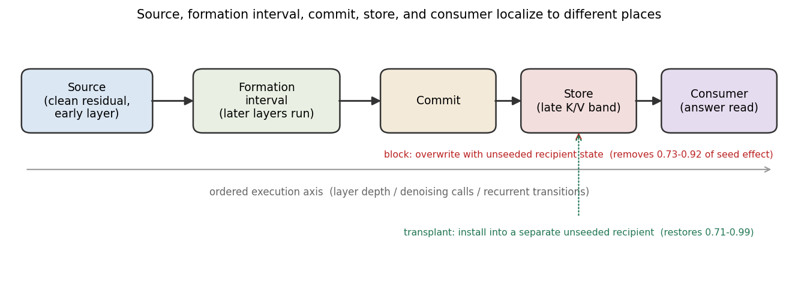
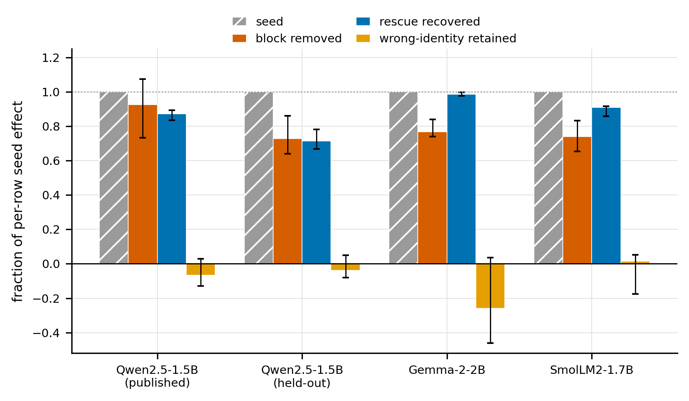
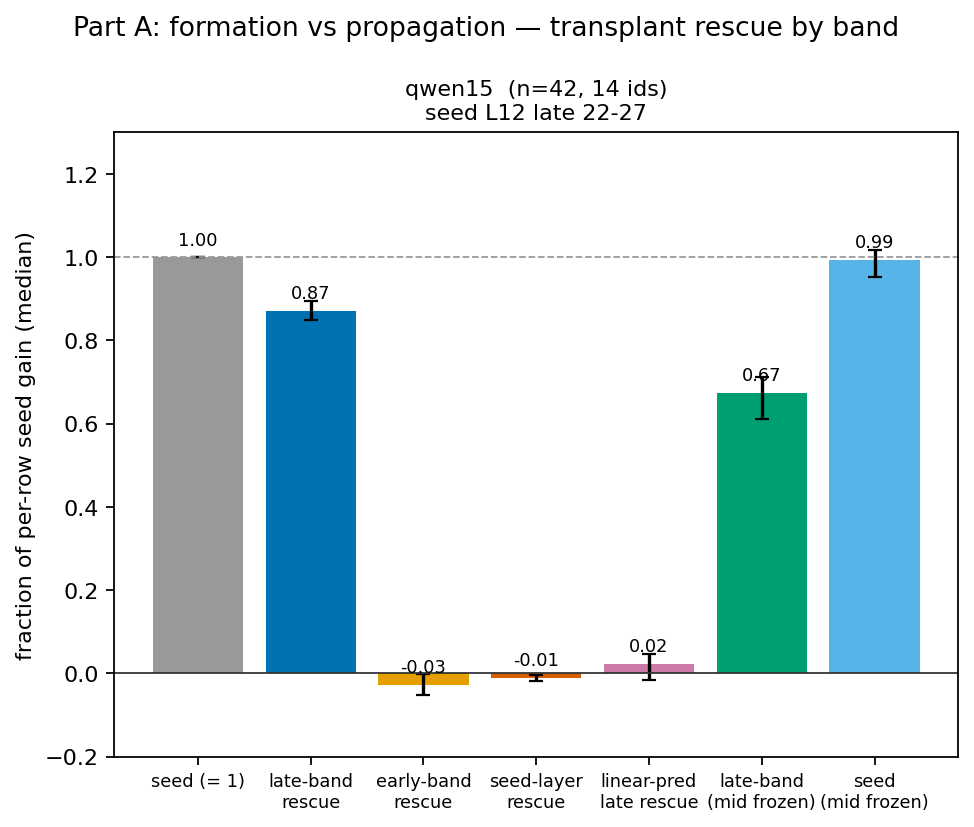
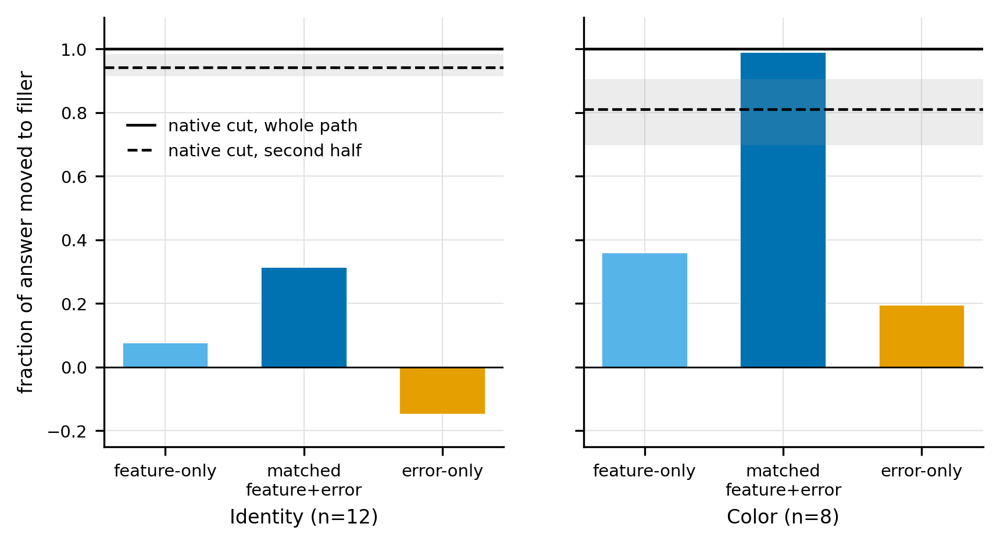
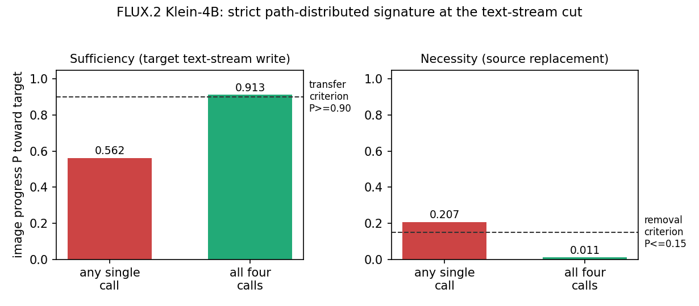
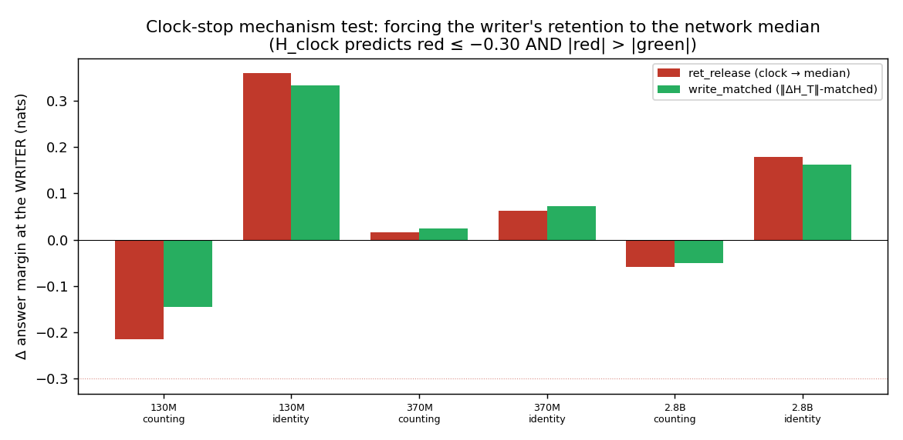

# Time-Formed Circuits: Formation, Commitment, and Causal Use

Jacob Hollenbeck

## Abstract

Activation patching and attribution graphs disagree about where a circuit lives. We show why: some circuits are built over ordered execution — depth, denoising, or recurrence, not token position. An early residual patch at the subject position seeds the state, the model forms it over an interval of depth, the formed state commits to a late key/value band with independent causal authority, and a downstream read uses it; these three localize to different places. Our central result is a block-and-rescue dissociation: in Qwen2.5-1.5B, Gemma-2-2B, and SmolLM2-1.7B, blocking the late recipient-formed key/value band removes 73-92% of an early seed's effect, while transplanting that same band into a separate unseeded recipient restores 71-99% and authors the correct answer; a wrong-content control authors the wrong answer, and the effect reproduces on held-out identities. The tools built to find circuits cannot reach the formed identity band: on Gemma-2-2B even a matched interchange of transcoder features and their error nodes moves the identity answer at most 0.31 of the way, against 0.94 for a native key/value cut, because the band is attention-formed and that basis replaces only the MLP sublayers. A FLUX.2 diffusion transformer gives a strictly path-distributed instance no language-model cell matches, though a weighted additive mechanism also passes it. Construction history is part of a circuit's causal anatomy.

## 1. A circuit can be formed before it is read

A prompt helps construct internal state during a forward pass, and later computation depends on that state. Understanding the circuit then requires tracing how the state is formed, committed, and consumed. The site where an intervention can seed an answer, the store that retains the resulting state, and the operation that reads it need not share causal support.

We call a circuit organized this way a **time-formed circuit**: a causal object whose construction history over an ordered execution axis matters to its interpretation. The axis can be layer depth while a transformer builds a contextual record, denoising calls in a diffusion model, or recurrent transitions in a state-space model. These axes are different; the shared property is that state is built over order and then used.

The localization conflict follows directly from this organization. A residual intervention at an early layer measures the ability to initiate construction. An intervention on the already formed key/value state measures the authority of that state. An intervention on the downstream read measures the operation that uses it. Collapsing these three measurements into one answer to "where is the circuit?" loses the mechanism they jointly reveal. A single-site method that patches one component, or an attribution graph that scores one basis, can land on the source or the read and report that as the circuit.

Our central experiment follows the three stages in a decoder transformer (Figure 1). We write a clean animal-identity residual into a neutral recipient entering an early layer and let the recipient compute its remaining layers; the recipient forms its own late subject key/value record. Removing the recipient-formed band before the answer reads it removes most of the seeded effect. Transplanting that same recipient-formed band into a separate, unseeded recipient restores most of the effect. This is a source-to-formation-to-store-to-consumer chain, measured with two independent interventions, and it reproduces across three decoder families and on held-out identities (Figure 2).

**Figure 1. The operational object.** A seed is written; the model forms the state over an interval of the execution axis; the state commits to a store; a later readout uses it. The block overwrites the store with a neutral recipient's state; the transplant installs the store into a separate unseeded recipient. The seed, the store, and the read localize to different places along the axis.

**Figure 2. Formation and independent causal use across three decoder families.** For each cell the per-row seed gain is normalized to one, with Qwen2.5-1.5B shown on both its development and held-out identity sets. Blocking the recipient-formed late band removes 0.73 to 0.92 of that gain, and transplanting the band into a separate unseeded recipient recovers 0.71 to 0.99. A wrong-identity band of the same width and position retains almost none of the target's gain while authoring the competing identity as the top candidate (Table 2). Bars are medians over admitted rows and error bars are identity-clustered 95% bootstrap intervals, so the effective sample size is the number of distinct identities. The seed and the read localize elsewhere; the formed store is what the block and the transplant act on.

This paper makes three contributions.

First, we give an operational account that separates a source, a formation interval, a committed store, and a consumer, and we state when evidence supports the account rather than ordinary execution order (Section 2).

Second, we measure the source-to-store-to-consumer dissociation with independent block and transplant interventions, and we show it is not specific to one model or to the identities used to find it: it holds in Qwen2.5-1.5B, Gemma-2-2B, and SmolLM2-1.7B and on a disjoint identity set (Section 3). We separate the formed store from its read with a concentrated read port and an exact-row join (Section 4), and we show that an attribution-graph basis misses the formed identity store, even under a matched interchange of features and error nodes, that a native state cut finds (Section 5).

Third, we give an operational signature for strictly path-distributed support, we exhibit a clean diffusion instance that passes it, and we report plainly that no tested language-model cell passes it and that a weighted additive mechanism can (Section 6). We then survey how formation, commitment, and retention vary across architectures (Section 7) and bound a result on computed intermediate state (Section 8).

## 2. The operational object

Throughout, "time" and "temporal" refer to an ordered execution axis, meaning layer depth in a transformer, denoising calls in a diffusion model, or recurrent transitions in a state-space model, and not to token position; the word "time-formed" names construction over that axis, not over the input sequence.

### 2.1 Seed, formation, commit, formed store, readout

Fix a model checkpoint, an input contrast, a native state interface, a site resolution, and an unchanged downstream readout. Let execution advance along a declared ordered axis with state transitions `s_{t+1} = F(s_t, u_t)` and output `y = C(s_T)`.

A **seed** (source) is an intervention site at which supplying clean state can initiate the behavior. The **formation interval** is the stretch of the execution axis over which the relevant state is constructed. The **commit** is the point at which that state acquires independent causal authority at a runtime interface, measured here by whether it can be blocked and whether it can be transplanted, rather than by its mere persistence in a cache. The **formed store** is the committed state. The **readout** (consumer) is the later operation that reads the formed store to produce the output.

**Terminology.** We keep these five operational terms because the paper's thesis is about how they come apart, but each is grounded in a standard activation-patching move. The seed is an early residual patch at the subject position. The formed store is the late subject-position key/value band the model builds and that we block or transplant. The readout is the unchanged downstream next-token computation. We use "seed", "formed store" (or "late band"), and "readout"/"downstream read" as grounded shorthands throughout, and reserve internal tool, experiment, and job identifiers for Appendix A.

Commitment is relative to an interface and a read horizon. It does not imply that every later intervention is ineffective, or that online weight learning has occurred. "Circuit" here includes the causal relations among these stages; a stored tensor is a state component of the circuit, and a successful local write is a port into it.

### 2.2 Isolated versus in-forward interventions

An intervention that overwrites key/value state during the subject's own computation can change the subject's attention and residual, which then write into later layers. An apparent single-layer edit therefore propagates into the construction process, and its effect is a mixture of direct store authority and leakage into formation.

We distinguish an **in-forward cut**, which overwrites state during the forward pass, from an **isolated cut**, which first completes the subject's prefix, then overwrites only its cached entries, then runs only later positions. The isolated cut preserves the subject's already completed formation history and reads the store as the consumer would. This distinction is load-bearing: in Qwen2.5-1.5B identity, an in-forward layer-0 write authors the answer at 0.985 of full effect, while the isolated write at the same layer authors only 0.009. Early source authority, direct late-store authority, and intervention leakage are therefore experimentally separable, and we use the isolated cut throughout for store claims.

### 2.3 Locality and the strict path-distributed signature

Locality is a separate property from temporal formation. A mechanism can have locally decisive support at one interface and distributed support at another. We use **space circuit** as shorthand for a behavior with individually decisive causal support at a declared grain, and we use it as a descriptor, not as an exclusive alternative to time-formed computation. A local source, a direct late write port, and a concentrated read can all belong to a circuit whose store has distributed support.

We define the **strict path-distributed signature** at a declared cut by four conditions: no single site is necessary, no single site is sufficient, the whole path is necessary, and the whole path is sufficient. Necessity and sufficiency are judged against stated behavioral criteria, and partial effects remain effects.

The signature is an operational object, not a mechanism claim. The four conditions do not require nonlinearity: a weighted additive mechanism `y = (x_1 + ... + x_n)/n`, in which no one term meets a high threshold but the sum does, satisfies all four. This is the additive, constructively interfering motif that Chughtai, Cooney and Nanda document for factual recall, where several contributions sum to the answer and no single one suffices [Chughtai 2024]; a four-condition pass is consistent with exactly that mechanism. Temporal formation and the distribution of causal support therefore require separate evidence, and passing the four conditions names a support profile rather than a kind of computation.

## 3. Formation and mediation in transformers

### 3.1 A local seed can initiate a longer construction

Moving a single residual write through depth maps a formation window: the span over which a supplied source can still produce the downstream answer. In Qwen2.5-1.5B identity, residual source writes remain near full normalized authorship through layer 22 and then decline, to 0.57 at layer 24 and 0.37 at layer 27. Other decoder cells have their own windows: SmolLM2-1.7B identity stays strong through layer 19 and drops to 0.07 by layer 23, and Pythia-410M at an intermediate checkpoint stays strong through layer 17 and drops to 0.01 by layer 22.

These curves locate where a supplied source still produces the answer. They do not show that the supplied layer alone holds all the required causal support, because the unchanged remaining computation performs the formation. The store intervention in Section 3.3 identifies a later mediator of that source effect.

### 3.2 Necessity is a late band, not a single layer

Low single-site necessity could reflect a small backup pair rather than genuinely distributed support. We therefore cut every contiguous window at widths two, three, four, six, and eight, and separately cut each window's complement, using the isolated operator that replaces the completed subject's key/value with filler state, the state the neutral recipient holds at the same positions, before later positions consume it.

| Cell (identity unless noted) | Rows | Best single-site necessity | Best width-3 necessity | Smallest tested window reaching 0.8 of whole-path necessity |
|---|---:|---:|---:|---|
| Qwen2.5-0.5B | 42 | 0.35 | 1.23 | width 2: L20-21 reaches 0.99 |
| SmolLM2-1.7B | 34 | 0.31 | 0.67 | width 4: L19-22 reaches 1.15 |
| SmolLM2-1.7B color | 27 | 0.10 | 0.42 | width 6: L16-21 reaches 0.92 |
| Qwen2.5-1.5B | 42 | 0.08 | 0.23 | width 6: L22-27 reaches 0.96 |
| Qwen2.5-1.5B color | 22 | 0.18 | 0.42 | width 6: L22-27 reaches 0.89 |
| Gemma-2-2B | 42 | 0.08 | 0.18 | not reached: L16-23 reaches 0.76 at width 8 |
| Gemma-2-2B color | 25 | 0.15 | 0.29 | width 8: L18-25 reaches 0.84 |

**Table 1. Stored support ranges from a redundant pair to a wider late band.** Entries are median signed fractions of the corresponding whole-path effect; widths five and seven were not swept, so reported widths are bounds on this grid. Figure S1 (Appendix D) shows the full window-by-window profile for the Qwen2.5-1.5B and Gemma-2-2B identity cells.

The Qwen2.5-0.5B identity cell is the informative local case: two adjacent layers carry the effect, so this cell has a space-circuit store with backup. The Qwen2.5-1.5B and Gemma identity cells require wider support than any three-layer window, so their stores are genuinely distributed at the layer grain. Their best three adjacent layers carry only 0.23 and 0.18 of the whole-path effect (Figure S1, Appendix D).

Those distributed stores nonetheless have strong direct write ports at individual late layers. An isolated single-layer write reaches 0.81 of full effect at Qwen2.5-1.5B layer 23 and at Gemma-2-2B layer 22. A store can therefore be distributed under necessity and still accept a coherent record through one late layer; these are separate measurements of the same store.

### 3.3 The seed effect follows the recipient-formed store

The formation window and the write sweeps leave one question open: when a source seeds the answer, which later state carries the seeded effect to the consumer? We answer it with two interventions that do not share a numerator.

The experiment uses Qwen2.5-1.5B with frozen weights, FP32, eager attention, and a single execution seed. Fourteen single-token animal identities appear in three controlled contexts, giving 42 admitted rows, where an admitted row is a prompt whose identity is a single token and whose clean and neutral forms stay token-aligned; the neutral recipient uses the word "creature" in place of the identity. At the subject position a row-matched clean residual enters layer 12 of the recipient, the recipient computes its ordinary remaining prefix, and its subject key/value rows at layers 22 to 27 are captured as the proposed mediator. The mediator is formed by the seeded recipient, so its relationship to the source is part of the experiment.

The block arm replaces that late band with the unseeded recipient's corresponding state after the subject has finished computing. The rescue arm installs the seeded recipient's band into an otherwise unseeded recipient. Each suffix runs with a private cache and no source hook, and the unchanged next-token distribution is the consumer.

The seed gain on a row is the increase in the answer's log-probability that the clean seed produces over the neutral baseline, and we report effects as a fraction of that row's own seed gain. Blocking the recipient-formed band removes a median 0.924 of the per-row seed gain, with an item-bootstrap interval of [0.765, 1.030] over the 42 rows. Transplanting the band into a separate unseeded recipient recovers a median 0.871 [0.850, 0.894]. The two numerators differ, so these are not complementary shares; each is normalized by that row's actual positive seed gain, which ranges from 1.577 to 5.555 nats with a median of 3.515.

The item bootstrap treats the three contexts of an identity as independent rows, which is anti-conservative because they are correlated. We therefore re-estimate every interval with a bootstrap that resamples whole identities and keeps all of a resampled identity's rows together, reporting the effective sample size as the number of distinct identities; the point estimates are unchanged by construction and only the intervals move. On this panel the identity-clustered block interval is [0.732, 1.075] and the rescue interval is [0.835, 0.894], and Table 2 reports the clustered intervals and effective sizes for the cross-family panels, where every block and rescue lower bound stays above zero. The block occasionally removes slightly more than the raw per-row seed gain, so its interval can exceed one; this is genuine per-row numerator noise that persists under clustering, not an artifact of treating contexts as independent.

Two controls separate content from timing. A wrong-identity band of the same width and position authors its own identity on 37 of 42 rows and retains a median -0.067 of the seeded effect, so the transplant carries specific content rather than a generic late-band perturbation. A matched-width earlier band at layers 16 to 21 removes only a median 0.066 of the seed gain, so the late band, not any late intervention, carries the effect.

### 3.4 The dissociation holds across families and on held-out identities

The result above is one model on one identity panel. We repeated the identical isolated nine-arm experiment in two further decoder families and on a disjoint identity set, choosing each model's seed layer and late band from its own formation-window and window-necessity evidence and freezing them before running.

| Model (identity) | identities / rows | Block removed | Rescue recovered | Earlier-band removed | Wrong-identity retained |
|---|---:|---:|---:|---:|---:|
| Qwen2.5-1.5B (original panel) | 14 / 42 | 0.924 [0.732, 1.075] | 0.871 [0.835, 0.894] | 0.066 | -0.067 [-0.129, 0.028] |
| Qwen2.5-1.5B (held-out identities) | 27 / 79 | 0.728 [0.639, 0.860] | 0.713 [0.667, 0.780] | 0.219 | -0.039 [-0.081, 0.051] |
| Gemma-2-2B | 14 / 42 | 0.768 [0.740, 0.838] | 0.985 [0.977, 0.996] | -0.008 | -0.260 [-0.461, 0.037] |
| SmolLM2-1.7B | 13 / 34 | 0.740 [0.653, 0.832] | 0.910 [0.858, 0.917] | 0.020 | 0.015 [-0.175, 0.052] |
<!-- TODO-REPLICATION: phi2/olmo2/pythia14b, fill from saturn/experiments/2026-10-05-e20-nonqwen-families/PAPER-SECTION.md -->

**Table 2. The block-and-rescue dissociation reproduces across families and on held-out identities.** Each entry is a median over admitted rows of a signed fraction of that row's positive seed gain; intervals are identity-clustered 95% bootstrap intervals, so the effective sample size is the number of distinct identities, not rows. In Gemma-2-2B the seed enters layer 7 and the mediator is the layer 16 to 23 band; in SmolLM2-1.7B the seed enters layer 12 and the mediator is layers 19 to 22. The held-out Qwen rows use twenty-seven distinct single-token identities, admitted from a twenty-nine-identity pool and disjoint from the development set, across three contexts.

The late-band block removes 0.73 to 0.92 of the per-row seed gain in every cell, and the independent transplant recovers 0.71 to 0.99; both lower clustered bounds stay above zero in every cell. The matched-width earlier band removes far less, at most 0.22 and near zero in three cells. Under identity clustering the wrong-identity retained-fraction interval includes zero in all four cells, so that signed fraction is no longer the content control; the control we rely on is instead the candidate top-1. The transplanted wrong band makes the competing identity the top candidate on 0.75 to 1.00 of rows while the target wins on at most 0.06, so the transplant carries specific content. In Gemma-2-2B the block removes 0.768, matching the 0.76 fraction of whole-path necessity that its layer 16 to 23 band carries in the window sweep.

The held-out Qwen identities are the weakest rescue and are reported in full. These identities have larger seed gains, a median of 6.05 nats against the development median of 3.5. The transplant restores the correct identity as the top candidate on 81% of rows but as the full-vocabulary top-1 on 39%; the gain removed and recovered and the near-zero wrong-identity control reproduce the original dissociation, with part of the effect additionally reachable through the earlier band, which removes 0.219 here.

Every branch uses the isolated prefix-suffix split, the stock causal mask, private cloned caches, and FP32 replay checks that match to within 1e-4 or exactly in each cell (Appendix B). The dissociation is therefore a property of this class of decoder circuit, not of one checkpoint or the identities used to find it.

The same dissociation also reproduces at 7B. On a paged FP32 Qwen2.5-7B run over 40 fresh identity facts, transplanting the seeded late band into an unseeded recipient restores 0.770 of the seed gain while isolating it out removes 0.595 and a wrong-identity donor does nothing, at -0.026; the commit lands in a late band around layer 21, with every one of the 40 facts committing in layers 19 to 27. The 7B block is lower than the smaller-model blocks only because the commit spreads redundantly across several late layers that a fixed six-layer mediator cannot all capture, while the rescue, which installs the whole band, is unaffected.

These interventions are deterministic rather than single-sample. The checkpoint is frozen, decoding is greedy, and each arm is a fixed cache edit, so a repeat run reproduces the logits exactly. The variance that matters is across items and identities, which the identity-clustered intervals and the held-out identity set capture. Multiple pretraining seeds are not available for these public checkpoints, so robustness to pretraining randomness is a stated limitation rather than something we can measure here.

### 3.5 What the experiment establishes and what it does not

The independent rescue is the decisive counterpart to the block. A record formed after a supplied source has causal authority in a different recipient, which connects three quantities often treated as interchangeable: the ability to seed a computation, the necessity of its formed state, and the ability of that state to author a consumer's answer.

The claim is specific to these controlled identity panels and this state cut. Formation is recipient-native after a supplied clean residual; it is not donor-free construction. The experiment identifies a formation interval and a causal endpoint, but it does not make the band unique, decode the internal carrier, or establish the construction route of every natural computation. It is direct evidence for the formation-and-commitment anatomy of a time-formed circuit in a decoder transformer.

One objection the earlier controls do not settle on their own is formation versus propagation: the late band might be nothing more than the seeded residual projected into later key/value state, which would make "formation" a relabeling of propagation. We test that distinction directly in Qwen2.5-1.5B identity and replicate it in Gemma-2-2B identity (each 42 rows, 14 identities, FP32, eager attention, the isolated operator) by transplanting several captured bands from the seeded recipient into a separate unseeded recipient and measuring the restored fraction of each row's seed gain.

Two findings are robust, nearly fitting-free, and replicate across both models (Figure 3). In Qwen the late band restores a median 0.871, while the seed layer's own key/value restores -0.010 and a matched-width earlier band restores -0.028; in Gemma the late band restores 0.985 while the seed layer restores 0.080 and the earlier band -0.028. The transplantable store is therefore not present in the early or seed-layer key/value in either model. A ridge map from the seed residual to the late band, fit with leave-one-identity-out cross-validation, restores only 0.023 in Qwen and 0.100 in Gemma when its predicted band is transplanted, with held-out reconstruction R-squared of -0.13 and -0.06. The store is therefore late and is not a linear image of the seed in either model.

**Figure 3. Where the transplantable store lives (Qwen2.5-1.5B and Gemma-2-2B identity, each n=42, 14 identities).** All bars transplant a captured band from the seeded recipient into a separate unseeded recipient, as a fraction of each row's seed gain. In both models the late band restores the answer (Qwen 0.87, Gemma 0.98) while the seed layer's own key/value, a matched-width earlier band, and a linear prediction of the late band from the seed do not, so the store is late and is not a linear image of the seed. The pre-band subject-layer freeze bar shown here is uninformative and is not used as evidence: it missed its preregistered 0.20 threshold in Qwen (a 0.197 drop) and was a no-op in Gemma (-0.005, freeze-no-op falsifier fired); where along the pre-band depth the content forms is addressed instead by the band-internal test below.

Where along depth the store is built is answered by a separate preregistered band-internal test in Qwen2.5-1.5B and Gemma-2-2B identity, each 42 rows and 14 identities, FP32, eager attention, the isolated operator, with its canaries exact. Three of its checks pass and locate the band's role. No single band layer carries the store: the best single layer reaches 0.732 of full-band rescue in Qwen and 0.804 in Gemma, below the 0.90 bar, so the commit is distributed across the band (P1a, P1b). Freezing the band layers' own attention and MLP leaves the rescue intact, at 0.904 in Qwen and 1.023 in Gemma, so the content is already present in the residual at band entry and each band layer's key and value projections only commit it to the readable store (P2c). And the consumer reads at the subject position: cutting the consumer's attention to the subject collapses the rescue from 0.871 to 0.010 in Qwen and from 0.985 to 0.015 in Gemma, while cutting its attention to the other positions does not (P3a-i, P3a-ii). The test's decisive predictions failed in the informative direction: the prediction that the band's own computation builds the transplantable store (P2a) failed in both families and its falsifier F2 fired; blocking the subject's reads of earlier positions (P3b) left the rescue intact and its falsifier F3b fired, with only a small drop of about 0.06 in Qwen; and the depth ramp is non-monotone and non-additive, so P1c failed. The reading is that the test refutes "built inside the band" and supports "committed at the band, formed before it", and where within the pre-band depth the content forms is not localized by any run so far.

The positive evidence that the content forms over the preceding depth is the residual-seed leg. A clean identity residual seeded at layer 11 or 12 and run through the recipient's native remaining layers rescues the identity in 16 of 16 generated reads, blocking the resulting late record restores the donor identity in 14 of 14 available reads, and an earlier-band fact-span patch gives the donor identity on 0 of 15. The seed becomes an independently causal store only after it runs through those layers, which is the signature of formation rather than of a residual projected forward unchanged.

The scoped conclusion rests on two models. The transplantable store is late and is not a linear image of the seed in both Qwen2.5-1.5B and Gemma-2-2B, and the band-internal test places the late band as the commit and read-out zone rather than the formation zone: the content is formed over the preceding depth and arrives at the band already present, where the band's key and value projections commit it to the store the consumer reads. We therefore do not claim that the band builds the content, and the pre-band formation locus is not localized; we claim that the store is formed over depth, committed at the late band, and not read off the source.

## 4. The read side is a different part of the circuit

The formed store says what the consumer reads and where the state was built; it does not say how the consumer selects the rows it reads. We separate the read with cut-and-join interventions on the answer's attention to the subject row.

In Qwen2.5-1.5B identity, the best single-layer read necessity is 0.074 of the whole-read effect, and a single-layer restoration at layer 23 recovers 1.22 of that effect. A one-hot read of the exact subject row in the leading subject-reading head reaches normalized recovery 1.02 with the target as full-vocabulary top-1 on 88% of rows, while shuffled rows do not reproduce the result. In this cell a store with distributed necessity has a concentrated read port: the local read accesses formed state, and its locality says nothing about the locality of formation or storage.

The read is join-replaceable at the commit layer once the key is standardized. Standardizing the subject's layer-0 key resolves a degenerate raw-cosine bucket, after which a subject-referenced bucket identifies the row and a one-hot join matches the oracle at the commit layer. The same exact-row join rescues a cut induction circuit in Qwen2.5-0.5B: after every query-to-source edge is cut, allowing the top heads to read only the single row an exact key join selects, with native values, recovers the behavior on a forced choice over the candidate tokens to within 0.03 of clean. The record notes the remaining caveats: the comparison is forced-choice rather than full-vocabulary, and whether the exact join beats a softer address is untested.

Query-derived semantic selection remains open. A predecessor-based query address identifies the subject row on surface repetition at rate 1.00 but fails on the semantic identity and color panels at rate 0.00. The read interface is executable, but we do not have a complete query-to-address algorithm for semantic reads, and the question of why attention selects those rows is answered only for repetition.

## 5. An MLP-transcoder feature basis cannot reach the formed identity store on Gemma-2-2B

If the formed store is the circuit's center of mass, the methods the target audience builds should be tested against it. We run a published attribution-graph pipeline, circuit-tracer with Gemma Scope transcoders [Hanna 2025; Lieberum 2024], against the identity and color band in Gemma-2-2B, on a matched head-to-head panel of 12 identity and 8 color items.

The result leads with the matched operator and splits by behavior. Even a fully matched interchange of transcoder features and their reconstruction-error nodes moves the identity answer a median 0.31 of the way to the filler on the 12-item panel, against 0.94 for a native key/value cut; the same matched operator recovers color to 0.99. The identity band is attention-formed and lies outside an MLP-replacement feature basis by construction, so the basis cannot express it however complete the feature interchange; the color store, by contrast, becomes visible once the error nodes are included. Two denominators are in play and we keep them separate: the feature-operator fractions (0.31 identity, 0.99 color) are the matched head-to-head panel of 12 identity and 8 color items, while the native cut's second-half flip rates of 0.83 identity and 0.84 color come from the model's separate 42-identity and 25-color formation sweep.

The mechanism behind the split is structural. These transcoders replace the MLP sublayers with sparse features, and attention is not decomposed into swappable feature nodes, so a store that lives in attention-formed key/value and residual state is outside the feature basis by construction and no interchange over the feature set, however complete, spans attention. What the experiment can measure is how much of each behavior the MLP-centered basis reaches, and that differs sharply between the two.

The attribution graph ranks features meaningfully but does not localize the store. About 30% of end-to-end influence runs through error nodes rather than through reconstructed features, which attribution-graph and sparse-feature-circuit methods treat as first-class carriers [Marks 2024; Ameisen 2025]. The subject position's influence is spread thinly across layers, at most 0.18 to 0.28 in any one layer, and the graph places its largest subject-position share at layer 0, next to the embedding, in 11 of 12 identity items and 8 of 8 color items. Only 0.10 to 0.21 of subject influence falls in the commit band where the store is written.

The instrument's published operator is a feature-basis interchange. It sets every transcoder feature active in either run to its filler value, with error terms held at their clean values, which is how the method defines an intervention [Dunefsky 2024]. Writing the clean values back gives exactly zero change. In the original sweep (42 identity and 25 color rows), this operator moved the identity answer at most 0.08 of the way to the filler at any position and layer scope; color peaked at 0.42 with the swap concentrated on the subject position. On the matched head-to-head panel used below (12 identity, 8 color items), the same operator moves identity 0.04–0.08 and color 0.31–0.36 across the three position scopes. The graph's own top features, swapped to filler, move the identity answer away from the filler by -0.03 to -0.14, and the color answer by up to -0.19.

The native state cut reaches what the feature basis cannot. On the model's full formation sweep of 42 identity and 25 color rows, an isolated key/value cut over the second half flips the answer on 0.83 of identity items and 0.84 of color items, and the whole-path cut flips 0.93 and 1.00. Its best single layer carries only 0.08 for identity and 0.15 for color. Figure 4 places the feature operators beside this native cut.

That feature operator holds the transcoders' error terms at their clean values, and those error nodes carry roughly 30% of influence and are first-class objects in the framework [Marks 2024], so it is not a complete matched operator. We therefore repeat the interchange swapping the transcoder features and the error nodes to the filler, and separately the error nodes only, inside the tool's own intervention regime. Our feature-only arm reproduces the library's interchange (identity 0.044 against 0.049; color 0.313 against 0.344), so the error arms are in the same validated regime.

The result splits by behavior (Figure 4). For identity, the matched feature-and-error interchange over every position and layer moves the answer a median 0.31 of the way to the filler, 0.29 over the subject and later positions, and flips 3 of 12 items; the error-only arm moves it -0.15. This is far short of the native key/value cut at 0.94. The identity therefore lives neither in the transcoder features nor in their error nodes, but in the attention-formed key/value and residual state that the native cut reaches and the MLP-replacement basis cannot express. The roughly 30% error-node influence does not carry the identity store. For color the opposite holds: adding the error swap raises the moved fraction from 0.36 to 0.99 and flips 8 of 8 items, reaching the native level, so the color miss was substantially a transcoder reconstruction-error effect that the matched operator recovers.

**Figure 4. A fully matched interchange recovers color but not identity (Gemma-2-2B).** Fraction of the answer moved toward the filler under the feature-only operator, the matched feature-and-error operator, and error-only, against the native key/value cut (solid whole-path, dashed second-half lines). For identity (left, n=12) even the matched operator reaches only 0.31 against the native 0.94; for color (right, n=8) it reaches 0.99.

Two cautions bound the identity result. The native cut and the feature operator are not matched in intervention magnitude: the native cut perturbs the entire attention pathway over the second half, while the feature operator perturbs only MLP features and their error nodes, so the 0.31-versus-0.94 gap reflects both basis coverage and how much state each operator touches. And the identity panel is 12 items, so the matched-operator median of 0.31 carries a wide interval; we read it as far below native rather than as a precise point.

The scoped conclusion is that an MLP-transcoder feature-and-error basis cannot reach the formed identity store, which is attention-formed and outside that basis by construction, while the color store becomes visible once error nodes are included. This is a coverage bound on MLP-transcoder circuits for this store, on one model and 12 identity and 8 color items, not a claim that all feature methods are blind; an attention-inclusive operator is the test that would settle it. The full native layer sweeps were themselves essential to finding the write ports that earlier sampled cuts missed.

## 6. A diffusion transformer with strictly path-distributed support

### 6.1 The complete singleton and trajectory assay

A diffusion transformer gives a support topology that no language-model cell in this study reaches. We test FLUX.2 Klein-4B at a pinned checkpoint, with BF16 execution, 256-by-256 output, four denoising calls, and guidance 1.0. Matched branches transplant target text-stream state for sufficiency or source text-stream state for necessity, at one call or at all four, and the native denoiser, scheduler, and decoder compute every endpoint.

Image progress toward the target is `P(I) = 1 - MAD(I, I_target) / MAD(I_source, I_target)`, where MAD is mean absolute pixel deviation. The transfer criterion is `P >= 0.90` and the removal criterion after source replacement is `P <= 0.15`. Every singleton is assessed against the same criteria as the whole path, over three setups by five site sets that share three baseline runs.

| Question (15 cells, 3 shared baselines) | Measured bound |
|---|---:|
| Does any single-call target write attain full transfer? | maximum P = 0.5620 |
| Does any single-call source replacement attain removal? | minimum P = 0.20743 |
| Does the all-call target write attain full transfer? | minimum P = 0.91309 |
| Does the all-call source replacement attain removal? | maximum P = 0.01101 |

**Table 3. A strict path-distributed signature at the text-stream cut.** No single call meets either criterion; the whole path meets both. Partial singleton effects, including 0.562 progress, remain visible. Figure 5 shows the four bounds against their criteria.

**Figure 5. FLUX.2 Klein-4B passes the strict four-condition signature.** Left: sufficiency, where any single call reaches at most P = 0.562 while all four calls reach 0.913, above the 0.90 transfer line. Right: necessity, where any single source replacement leaves P at least 0.207 while all four reach 0.011, below the 0.15 removal line. The signature is an operational support profile, not a mechanism claim.

A separate five-seed color panel extends the necessity half. Every single-call source replacement leaves the image nearest the target, and the all-call source interchange reaches the source on 5 of 5 seeds in both recorded route variants. All-call deletion reaches the null image on 5 of 5 seeds in one route variant and 4 of 5 in the other, while a norm-matched sham also reaches null on 5 of 5 in both. Interchange therefore carries the semantic discrimination that deletion alone lacks, and the five seeds are a necessity panel rather than five full four-condition replications.

### 6.2 The necessity operator and the boundary cases

Whole-path deletion is not a specific necessity operator at this cut. A norm-matched random sham also nulls the image, and at the input cut deletion is equivalent to removing the prompt. We therefore report interchange as the informative necessity operator and gate both on exact replay; a same-day misreading that necessity was interchange-only was itself corrected once a distance-metric artifact was fixed, after which deletion does remove the target and the null image sits near zero progress.

The signature does not generalize to every diffusion cut, and we report the boundaries. In FLUX.2 Klein-9B, the identity behavior passes the four conditions, with single-step transfer at most 0.48 against all-step 0.90 to 0.95, and 8 of 9 identity gates pass, while a lighting behavior is mixed because one step alone reaches the source on one seed and 7 of 9 lighting gates pass. In an SDXL cross-attention route the write is path-constituted, with single-step transfer at most 0.215 against all-step 0.985, but one step alone meets the removal criterion, so that cut fails the no-single-site-necessary condition. The signature is a property of a behavior at a cut, not of the diffusion regime as such.

### 6.3 What the diffusion instance adds

FLUX is a transformer operating in a diffusion regime, and its denoising axis differs from the layer-depth axis of decoder key/value formation. The shared class is time-formed causal organization; strict path distribution is the particular support profile demonstrated here. That diffusion models distribute knowledge more broadly than language models do is itself an existing observation [Basu 2023; Localizing Knowledge in DiT 2025], and our contribution on the diffusion side is the exhaustive single-call and whole-trajectory assay at a native-state cut rather than the distribution itself.

We deliberately do not lead with the strict signature, because it buys less than its name suggests. It cannot distinguish weighted additive accumulation, redundancy, or adaptive re-derivation, as Section 2.3 and the additive-recall result note [Chughtai 2024]; it identifies path-distributed support at one intervention interface and nothing more. The pass is also narrow and threshold-dependent: the whole path reaches image progress 0.913 against a 0.90 transfer line while a single call already reaches 0.562, so a different criterion could move the verdict. No tested language-model cell passes it, because every clean language-model store has a concentrated late write port that exceeds the no-single-site-sufficient bar; the signature's only clean instance here is diffusion. We therefore present the four conditions as a support-profile observation with one clean diffusion instance, not as a certificate that an architecture or a mechanism must satisfy, and the block-and-rescue dissociation of Section 3, not this signature, is the paper's central result.

## 7. Architecture variation

The source-formation-store-consumer anatomy appears with family-local implementations. We summarize the tested specimens and their support profiles.

| Architecture (specimen) | Ordered axis | Formation and commit | Strict signature |
|---|---|---|---|
| Decoder transformer (Qwen2.5-1.5B, Gemma-2-2B, SmolLM2-1.7B identity) | layer depth | formation window via residual writes; distributed late-band necessity with a concentrated write port (0.81 at Qwen L23 and Gemma L22) | no: concentrated write fails the no-single-site-sufficient condition |
| Gemma-2-2B band, even vs odd layers | layer depth | positive write ports fall on the even band layers L16, L18, L20, L22 while the interleaved odd layers can be individually negative yet contribute jointly to the band's necessity; the even-layer pattern tracks depth, not attention type (companion paper, type-swap control) | no |
| State-space model (Mamba-130M, 370M, 2.8B) | recurrent transitions | a single concentrated late write port at 0.69 to 0.83 of depth (L20, L39, L44); the writer is a retention outlier whose selective timestep nearly freezes, but releasing its retention does not break the commit, so the write is the lever (Section 7.1) | no |
| Hybrid attention plus SSM (Falcon-H1) | layer depth plus recurrent state | attention dominates the tested post-subject formed-state dependence; SSM state has partial write authority with no concentrated Mamba-like writer; source formation, read layer, and retention clock are unmeasured | not established |
| Decoder transformer, induction (Pythia-70M) | layer depth | a space-circuit control: three heads, one relay and two writers, are necessary and sufficient (Section 7.2) | not applicable; this is the locally decisive case |

**Table 4. Family-local formation, commitment, and retention.** Every specimen shows state built over its ordered axis and committed to a store, with the write port's locality and the retention mechanism varying by family. No specimen passes the strict signature; Pythia-70M induction is the locally decisive control.

### 7.1 The Mamba writer is a retention outlier, not a clock lever

Prior work locates and edits factual associations in Mamba by adapting rank-one editing to its recurrent state [Sharma 2024]. Our question is narrower: is the late writer's near-stopped retention clock the commit mechanism or a correlate of it? The writer is identified as a retention outlier, and that identification is correlational. At the writer cells (130M L20, 370M L39, 2.8B L44) the selective timestep nearly freezes over the suffix, with an elapsed clock of 0.03 to 0.07 against 1 to 8 at its neighbors and a subject-state survival of 0.63 to 0.90 where other layers forget, measured on one prompt and one seed. Retention alone cannot nominate a writer.

The one matched clock-dose test we ran, on a different country-history task, separates the write from the clock at the writer layer and finds only small, mixed-sign effects: doubling the retention rate with the write held fixed moves the answer margin by +0.0322 nats, doubling the write moves it by −0.0664 nats, and the joint native timestep action moves it by −0.0343 nats. That near cancellation is a measured counter-trend to any single-sign clock account, so we do not read stopping the clock as the commit mechanism.

A separate preregistered retest corroborates the direction. Forcing the writer's subject-state survival down to the network median (decay exponent 15 to 142, with the write arm matched in state-change norm against matched-layer and random-null controls) never degraded the commit — in 0 of 6 cells, and on identity it raised the margin — while the joint timestep lever acted through the write in all 6 cells and through retention in none. The writer's causal property is its write; its near-stopped clock is a correlate that holds the already-written store rather than authoring the answer. The dose detail is in Appendix A and Figure S2 (Appendix D).

### 7.2 The space-circuit control

Pythia-70M induction, the canonical in-context copying mechanism [Olsson 2022], is the locally decisive comparison, and it is a close analogue of the canonical distributed-but-locatable attention circuit for indirect object identification [Wang 2022]. The writer pair is necessary but not sufficient, removing 0.74 to 0.81 of recoverable loss while recovering almost nothing alone. A five-head set is necessary and sufficient, and a minimal triple of one relay and two writers reproduces it, with the relay carrying 0.58 to 0.72 of necessity and one writer 0.24 to 0.29. Standard head-level ablation finds this circuit directly, which is the signature of locally decisive support. By contrast, in the distributed language-model stores no single layer carries more than 0.08 of necessity and no three adjacent layers more than 0.23, so the same head-level sweep does not recover a compact circuit.

## 8. Computed intermediate state

A time-formed store need not hold a copied token; it can hold a value the model computed and did not restate. We test this on synthetic arithmetic with teacher-forced scratchpads in Qwen2.5-0.5B-Instruct and Qwen2.5-1.5B-Instruct, on primary panels of 32 and 30 items in which the answer is one operation past a scratchpad value that is never restated, with a copied-value canary flipping at rate 1.00. The directed counterfactual swap is the cleanest signal, so we lead with it: installing a different item's intermediate state authors that donor's result on 19 of 32 completed-readout rows at 0.5B and 30 of 30 at 1.5B, with the downstream read continued for up to 128 tokens. Removal is weaker and often repaired, wrong on 26 of 32 rows at 0.5B but on only 3 of 30 at 1.5B, where 25 of 30 are repaired.

The bounded reading is that a non-restated intermediate value is causally active under this cache intervention and can author the readout's answer under a directed swap. Its necessity depends on the readout and horizon and is frequently repaired at 1.5B, and the chain does not pass the strict path-distributed signature at this grain. The scope is synthetic arithmetic with one greedy trajectory per branch and supplied scratchpads, so autonomous chain-of-thought faithfulness remains a separate question. The two-step chain and a full computed-object layer sweep in SmolLM2-1.7B are reported in Appendix A.

### 8.1 The same late band carries recall, arithmetic, and two-hop

The late band is the same object across operations, not an identity-only artifact. We froze the Qwen2.5-1.5B layer 22 to 27 subject-position band from the identity panel and, without refitting, tested it as a fixed interchange site on three competence-gated task classes: arithmetic (40 items, native accuracy 0.93), single-fact recall (32 items, accuracy 1.00), and two-hop recall (34 items, accuracy 1.00). As a rival we gave each input a per-input oracle that searched 232 to 288 candidate sites, including narrower bands and per-head subsets. The frozen band's best matching site contained layer 22 on every pair in all three classes, and its interchange accuracy reached 0.85, 0.95, and 1.00 of the oracle ceiling, against random width-6 band floors of 0.13, 0.30, and 0.25. Both preregistered predictions held on all three classes.

Block-and-rescue at the frozen band reproduces for recall (block 0.902, rescue 0.862) and two-hop (block 0.911, rescue 0.933), while arithmetic rescue sits at the 0.5 line (block 0.505, rescue 0.485). The arithmetic case is informative rather than a failure: the computed sum is committed at the same band but split across both operand positions, so rescuing one position recovers 0.513 and the second operand 0.249, while rescuing both jointly recovers 0.925 [0.88, 0.96]; the band at the answer ("=") position recovers nothing (-0.005) and the pre-band subject recovers 0.087. The commit is two-positioned for a computed answer and single-positioned for a recalled one, in the same architectural band. This is one model and one seed, with Gemma-2-2B deferred.

## 9. Related work

Our account is not a claim that prior work ignored execution order; it is an operational category with separate seed, formed-store, and readout tests, and the delta is in the interventions, not the observation that order matters. Concretely, the delta is the isolated-versus-in-forward cut at the same layer (0.009 against 0.985), the full window sweeps that overturn sampled two-layer certificates, the independent transplant of a formed band into a fresh recipient, and the exact-row read join. The method is causal mediation analysis, introduced to transformer interpretability by Vig and colleagues from the natural direct and indirect effects [Vig 2020]; our block and rescue are its necessity and sufficiency arms, applied at native-state interfaces and extended by an independent transplant into a fresh recipient rather than run at the neuron or head level.

The closest predecessors stage factual recall in transformers. Meng and colleagues locate restoration sites that participate in factual predictions and motivate weight editing [Meng 2022]. Geva and colleagues identify subject enrichment, relation propagation, and an attention-mediated extraction stage [Geva 2023]. Agarwal reports early entity availability and later generation-controlling commitment across four decoder models [Agarwal 2026]. A parallel line finds factual retrieval itself redundant, distributed, and non-contiguous across components [arXiv 2606.21345]. Our seed intervention has related restoration semantics, and our formation window, commit, and read map onto enrich-propagate-extract and onto deferred commitment. The table below states the delta per stage.

| Stage | Geva 2023 / Agarwal 2026 | This paper (delta) |
|---|---|---|
| State formation | subject enrichment over early-to-mid layers | formation window measured by a residual-write sweep (Qwen2.5-1.5B identity 0.57 at L24, 0.37 at L27) |
| Late commit | late, generation-controlling, shown by sufficiency-style patching | isolated store cut that reads the committed state as the consumer (in-forward 0.985 vs isolated 0.009); whole-window necessity localized to a 6-8 layer band, overturning sampled two-layer certificates |
| Does the formed state author elsewhere? | not tested | independent transplant into a fresh unseeded recipient (block 0.73-0.92, rescue 0.71-0.99) across three families and held-out identities |
| Read mechanism | attention-mediated extraction | exact-row join at the commit layer; semantic query-to-address still open |
| Seed localization | restoration sites (Meng 2022); best restoration site is not the best edit site (Hase 2023) | residual seed plus an isolated store cut; seed and store localize differently, a candidate reason for Hase's result |

Methodologically the transplant is an interchange intervention, a form of resample patching with a chosen source and target [Geiger 2023; Zhang & Nanda 2023]; the operator is standard, and the contribution is the dissociation design and its interpretation rather than a new intervention.

Hase and colleagues show that causal-tracing localization does not predict where weight editing works [Hase 2023]. The formation-and-commitment anatomy offers one reason: the source that a tracing method restores and the store that carries the answer localize differently, so the best restoration site need not be the best edit site. Self-repair can make a single-site ablation underestimate importance, and compact adjacent-layer backup can hide a store from single-layer cuts [McGrath 2023; Rushing & Nanda 2024]; both motivate the window sweeps. Faithfulness scores also depend on the ablation operator [Miller 2024], which is why we report interchange and deletion separately and gate both on exact replay.

The isolated cut is an instance of patch-placement hygiene emphasized in activation-patching guides [Zhang & Nanda 2023; Heimersheim & Nanda 2024]: where and how a patch is inserted changes what it measures. Our in-forward-versus-isolated gap of 0.985 against 0.009 at the same layer shows how large that consequence can be, and automated circuit discovery and attribution patching inherit the same operator sensitivity when they score edges by patched or gradient-approximated effect [Conmy 2023; Syed 2023].

Two 2026 papers observe the distributed effect without naming a category. In-context task identity transfers 0% under single-position intervention at every layer of Llama-3.2-3B but up to 96% under multi-position intervention [Cheng & Zhang 2026], and single-layer activation edits corrupt factual recall easily but repair it rarely [Bugaud 2026]. Geiger and colleagues give a causal-abstraction framework for interventionally faithful higher-level accounts [Geiger 2023]; our seed, formed-store, and readout roles are a candidate decomposition at native-state interfaces rather than a new theory of intervention. Circuit Tracing and the circuit-tracer library release the attribution-graph methods and the transcoder basis that Section 5 tests [Ameisen 2025; Hanna 2025; Lieberum 2024], and the applied attribution-graph case studies in that line [Lindsey 2025] use the same basis whose coverage of a formed store we probe.

Temporal control is already part of diffusion interpretation. DifFRACT trains timestep-conditioned transcoders for a diffusion transformer and builds feature-attribution graphs at each denoising step, with interventions that span every step [Mazur 2026], and prompt-conditioned insertion measures when changed conditioning can still insert a concept across generators [Görgün 2026]. Our diffusion contribution is the exhaustive single-call and whole-trajectory necessity-and-sufficiency assay at a native-state cut, joined to replay, rather than the first observation that timing matters. Task and function vectors are compact carriers read at one site [Hendel 2023; Todd 2024]; a time-formed store can also have a local read or write port, and its temporal classification comes from how the downstream state is formed, not from excluding locality. The central experiment binds single-token identities to a subject position, so the formed identity store is a causal neighbor of entity-binding representations [Feng & Steinhardt 2023]; the difference is that we test a state that can be cut and transplanted across stages, not a scheme for which attribute binds to which entity.

## 10. Limitations

The language-model panels are small per cell and mostly single-seed, with short next-token readouts, and the identity panels repeat identities across a few controlled contexts; the held-out replication in Section 3.4 is the direct answer to the panel-not-held-out concern, but it is still one laboratory and one harness. Replication on three non-Qwen families outside the development set (Phi-2, OLMo-2-1B, Pythia-1.4B) and a pass-indexed baseline on instruct and 7B models are in progress and not yet folded in.

Scale is the sharpest open limitation. The decoder mediation reproduces at 7B — on a paged FP32 Qwen2.5-7B run over 40 fresh identity facts with a single seed, the transplant rescues 0.770 of the seed gain and the block removes 0.595 (Section 3.4) — but no higher: above 7B the only test is a Qwen3-30B mixture-of-experts identity cell whose in-forward certificate did not survive the isolated cut, which both illustrates the hygiene point of Section 2.2 and means we have no positive mediation result above 7B. We make no claim that the signature or the mediation passes at 30B, and we do not report a private large-model chain-of-thought result that lacks a located receipt. Gemma-2-9B, the sliding-plus-global specimen, was unavailable, so the attention-pattern scale test is still open.

A location rule does not transfer across architectures, which bounds any reading of the late band as a fixed index. We froze a depth-fraction band-location rule on the five existing identity cells and applied it blind to two decoders from unused labs. In Pythia-1.4B, a GPT-NeoX model with a parallel attention-and-MLP residual, the predicted top-quarter band carried almost nothing, so the depth-fraction location rule is falsified there; the block-and-rescue dissociation itself still reproduced, relocated to a shallower band at layers 13 to 17 with the commit around layer 16. OLMo-1B cleared no row of the frozen native-competence gate and is reported unavailable. The dissociation is thus the robust object and its depth index is not; location-fixedness is at most a weak symptom, developed in the companion paper.

The distributed necessity in Section 3.2 is localized to a late band at the layer grain, but we have not swept below the layer grain, across heads, keys versus values, and positions within the band, so a finer instrument could find a compact site inside the band. The signature identifies a path-constituted mechanism at a cut, not a minimal or unique path, and the diffusion route is known not to be unique.

The read "why" is open for semantic queries: the exact-row join presumes a selection that we can execute but not yet derive from the query on semantic reads. The hybrid specimen is one checkpoint and seed and tests already-formed caches rather than state-space participation during formation.

The store, mediation, read, and sweep interventions use stock eager attention; the Section 8 arithmetic cells use stock scaled-dot-product attention. A separately identified attention-wrapper mask-registration defect affects certain routing and continuation observations in adjacent work; both stock backends used here are outside that defect, the results run under the isolated cut, and we import nothing from the mask-affected wrappers.

## 11. Conclusion

A circuit's construction history can be part of its causal anatomy. A locally effective seed can cause later state to form; that state can have distributed necessity and a concentrated write port; and its read can be local and query-sensitive. When these stages are measured as one answer to "where is the circuit?", they conflict; when they are measured separately, with an isolated store cut, an independent transplant, and a separated read, the conflict dissolves into a seed, a formed store, and a readout that simply localize to different places.

The block-and-rescue dissociation gives the account its central evidence, holds across three decoder families and held-out identities under identity-clustered intervals, and reproduces at 7B. In both Qwen2.5-1.5B and Gemma-2-2B the transplantable store is late and is not a linear image of the seed, and a band-internal test places the late band as the commit and read-out zone, with the content formed over the preceding depth and the pre-band formation locus not localized. The attribution-graph comparison shows that even a matched interchange of transcoder features and error nodes cannot reach the formed identity store that a native cut finds, because that basis replaces only the MLP sublayers, while it does recover the color store. The four-condition signature gives a clean diffusion instance of strictly path-distributed support, together with the plain negative that no tested language-model cell passes it and that a weighted additive mechanism can. The architecture survey shows the same construction-retention-use separation implemented family by family.

A reusable question follows. If a recurring functional organization carries these circuits, then where the store forms should be set by the architecture while the input chooses what is written there and how it is read. A [companion paper](../time-circuit-scaffold/paper.md) develops that reuse hypothesis and owns its evidence, framing the reused element as a fixed functional role rather than a fixed commit-layer index and testing it through the query-selective authority of a byte-identical store, the interchange-intervention accuracy of that fixed role, and the dependence of a mounted store's authority on its formation history. This paper owns and establishes the formation and use of the causal object that line would reuse, namely the formation window and late band, the write port and the write-versus-retention result, the attribution-graph coverage gap, the block-and-rescue mediation, and the strict diffusion signature.

## Appendix A. Experiment table

Each row maps a result in the body to its model, sample size, metric, and source record; internal experiment identifiers and job identifiers appear only in this appendix. The P1-A, P1-B, and P1-C rows are the round-two reviewer experiments; their independent reproducibility audit passed, with byte-identical frozen predictions across versions, the identity-clustered intervals reproduced exactly, a genuine leave-one-identity-out fit, and the error-node reimplementation matching the library.

| ID | Result (section) | Model | n | Metric | Record path | Jobs |
|---|---|---|---:|---|---|---|
| E20-xfam | Block-and-rescue dissociation across families and held-out identities (3.4, Fig 2) | Qwen2.5-1.5B, Gemma-2-2B, SmolLM2-1.7B | 42 / 79 / 42 / 34 | median signed fraction of per-row seed gain, item-bootstrap CIs | `saturn/experiments/2026-10-02-e20-cross-family/FINDINGS.md`; `results/analysis.json` | gemma `job-fab52bcf3cce`; qwen held-out `job-a66b102614e3`; smollm2 `job-c128e07da015` |
| E20 | Source-to-store-to-consumer mediation, original panel (3.3) | Qwen2.5-1.5B | 42 | block 0.924, rescue 0.871; wrong-identity authors own 37/42 | `saturn/experiments/2026-09-30-full-layer-sweeps/FINDINGS-E20-mediation.md` | `job-e1f652e80f43` |
| P1-A | Formation vs propagation: late band vs seed-layer, early band, linear prediction (3.5, Fig 3) | Qwen2.5-1.5B, Gemma-2-2B | 42 / 14 ids each | Qwen late 0.871, early -0.028, seed-layer -0.010, linear-pred 0.023 (held-out R2 -0.13); Gemma late 0.985, early -0.028, seed-layer 0.080, linear-pred 0.100 (held-out R2 -0.06); the pre-band subject-layer freeze (Qwen 0.675 drop 0.197; Gemma 0.990 drop -0.005, freeze-no-op falsifier fired) is uninformative and not used as evidence | `saturn/experiments/2026-10-02-p1-reviewer-experiments/FINDINGS.md` (part A); `results/A_analysis.json` | qwen `job-802a7371546f`; gemma `job-d37efcecae3e` |
| FOT | Formation-over-time, band-internal locus (3.5) | Qwen2.5-1.5B, Gemma-2-2B | 42 / 14 ids each | best single layer 0.732 / 0.804 of full-band rescue; band attn+MLP freeze 0.904 / 1.023; consumer-to-subject cut 0.871->0.010, 0.985->0.015; P1a/P1b/P2c/P3a-i/P3a-ii pass, P2a fails (F2 fired), P3b fails (F3b fired), P1c fails | `saturn/experiments/2026-10-02-formation-over-time/results/FOT_analysis.json`; `PREREG.md` | qwen `job-eaf503028c04`; gemma `job-9acb76a12273` |
| E20-7B | Block-and-rescue at 7B scale (3.4, 10) | Qwen2.5-7B (paged fp32) | 40 | rescue 0.770, block 0.595, wrong-identity -0.026; commit median L21 (rel depth 0.78), all 40 facts in L19-27 | `saturn/experiments/2026-10-02-scale-9b-scaffold/PAPER-SECTION.md`; `results/e20_analysis_with_7b.json` | `job-32fa0281137c`, `job-6cbbb78fb7e3` |
| blind | Blind depth-fraction location rule; dissociation relocation (10) | Pythia-1.4B, OLMo-1B | 83 / 0 | predicted band block -0.278, rescue 0.136 (location rule falsified); earlier band L13-17 block 0.97, rescue 1.46, commit ~L16; OLMo-1B unavailable (0/108 admitted) | `saturn/experiments/2026-10-02-blind-scaffold-prediction/FINDINGS.md` | `job-2eb34b2106a9` |
| P1-B | Identity-clustered bootstrap of the block/rescue dissociation (3.3, 3.4, Table 2) | Qwen2.5-1.5B, Gemma-2-2B, SmolLM2-1.7B | 14/27/14/13 ids | identity-clustered 95% CIs; medians unchanged, lower bounds > 0 | `saturn/experiments/2026-10-02-p1-reviewer-experiments/FINDINGS.md` (part B); `results/B_clustered_stats.json` | reanalysis (no model run) |
| E16 | Residual-write formation windows (3.1) | Qwen2.5-1.5B, SmolLM2-1.7B, Pythia-410M | panel | normalized source authorship by layer | `saturn/experiments/2026-09-30-full-layer-sweeps/FINDINGS-E16-residual-writes.md` | — |
| E17 | Isolated single-layer writes; in-forward leak correction (2.2, 3.2) | Qwen2.5-1.5B, Gemma-2-2B | panel | isolated write fraction; L0 0.985 in-forward vs 0.009 isolated | `saturn/experiments/2026-09-30-full-layer-sweeps/FINDINGS-E17-isolated-kv-writes.md` | — |
| E19 | Window necessity, every contiguous 2/3/4/6/8-layer window and complement (3.2, Table 1, Fig S1) | 7 decoder cells | 22-42 | median signed fraction of whole-path effect | `saturn/experiments/2026-09-30-full-layer-sweeps/FINDINGS-E19-window-necessity.md` | `job-57ad67c21bd1`, `job-2f9593a800cd` |
| E13 | Read cut-and-join, concentrated read port (4) | Qwen2.5-1.5B | 42 | read necessity, one-hot join recovery | `saturn/experiments/2026-09-30-e13-time-circuit-read-join/FINDINGS.md` | — |
| E18 | Standardized bucket and exact-row join; semantic-address limitation (4) | Qwen2.5-1.5B | panel | join = oracle at commit; repetition 1.00 vs semantic 0.00 | `saturn/experiments/2026-09-30-e18-bucket-join-time-reads/FINDINGS.md` | — |
| E12 | Exact-join rescue inside a certified induction circuit (4) | Qwen2.5-0.5B | panel | within 0.03 of clean after cut-and-join | `saturn/experiments/2026-09-25-ar-exact-join-admission/FINDINGS.md`; `saturn/experiments/2026-09-30-e12-bucket-exact-address/` | `job-a05238ace419` |
| E6 | Attribution-graph feature basis vs native cut (5, Fig 4) | Gemma-2-2B | 12 identity, 8 color (feature); 42/25 (native sweep) | fraction moved under feature interchange; native flip rate | `saturn/experiments/2026-09-30-circuit-tracer-head-to-head/FINDINGS.md` | `job-03225ce474d1` (interchange), `job-ed4ce1ac5974` (native K/V) |
| P1-C | Matched feature-and-error interchange, split by behavior (5, Fig 4) | Gemma-2-2B | 12 identity, 8 color | fraction moved toward filler: identity features+error 0.31 (flip 3/12), error-only -0.15; color 0.99 (flip 8/8) | `saturn/experiments/2026-10-02-p1-reviewer-experiments/FINDINGS.md` (part C); `results/C_analysis.json` | `job-5b8f55665345` |
| E1b | FLUX four-condition singleton and trajectory assay (6.1, Table 3, Fig 5) | FLUX.2 Klein-4B | 15 cells, 3 baselines | image progress P; bounds 0.5620 / 0.20743 / 0.91309 / 0.01101 | `saturn/experiments/2026-09-30-flux2-joint01-time-accumulation/FINDINGS.md` | — |
| E1c | Residual-state deletion correction; null-image rule (6.2) | FLUX.2 Klein-4B | — | deletion removes target; sham also nulls | `saturn/experiments/2026-09-30-flux2-residual-deletion/FINDINGS.md` | — |
| E7 | Five-seed FLUX color necessity (6.1) | FLUX.2 Klein-4B | 5 seeds | single-call nearest target; all-call interchange to source 5/5 | `saturn/experiments/2026-09-30-e7-flux-color-multiseed/` | — |
| E8 | FLUX Klein-9B four conditions and nine gates (6.2) | FLUX.2 Klein-9B | 2 seeds x 2 windows | single-step <= 0.48 vs all-step 0.90-0.95; 8/9 identity, 7/9 lighting | `saturn/experiments/2026-10-01-e8-klein9b-nine-gate/FINDINGS.md` | — |
| E9 | SDXL route: path-constituted write, one-step necessity (6.2) | SDXL | — | single step <= 0.215 vs all 0.985; one step meets removal | `saturn/experiments/2026-10-01-e9-sdxl-four-quadrant/` | — |
| mamba-clock-dose | Matched clock-dose test, country-history task (7.1) | Mamba-130M (L20) | 1 prompt / 1 seed | retention +0.0322, write −0.0664, joint −0.0343 nats (final identity token); near cancellation vs single-sign clock account | `saturn/experiments/2026-10-02-mamba-operation-clock-debugger/FINDINGS.md` | — |
| mamba-clock-retest | Mamba aligned retention retest, corroboration (7.1, Fig S2) | Mamba-130M, 370M, 2.8B | 6 cells, 3 prompts/task | decay exponent 15-142 to median survival; release-hurts 0/6, dt via write 6/6 via retention 0/6, writer-specific 1/6, retention-beats-write 4/6 (near-tie <=0.07 nats); verdict retention-not-commit-lever | `saturn/experiments/2026-10-02-mamba-clock-retest/FINDINGS.md`; `results/summary.json` | `job-ed83b7e7668d`, `job-3f20952d26c9`, `job-6225bc854a49` |
| E3b-M | Mamba full layer sweeps; single late writer (7) | Mamba-130M, 370M, 2.8B | panel | late-writer depth and share | `saturn/experiments/2026-09-30-mamba-full-layer-sweeps/FINDINGS.md` | — |
| E14 | Hybrid attention-plus-SSM sweep (7) | Falcon-H1 | 22 identity, 9 color | attention-dominated formed-state dependence | `saturn/experiments/2026-10-01-e14-hybrid-attn-ssm/` | — |
| E4 | Pythia-70M induction space-circuit control (7.2) | Pythia-70M | induction panel | recovered loss; triple necessary and sufficient | `saturn/experiments/2026-09-30-e4-pythia-recovered-loss/` | `job-19e98d8ac631`, `job-b69d8fc7654a` |
| E10 | Computed intermediate state (8) | Qwen2.5-0.5B/1.5B-Instruct | 32 / 30 | swap authorship 19/32, 30/30; removal wrong 26/32, 3/30 (25/30 repaired); two-step chain consumed-step unmount 8/8 vs early-step 0/8 (~0.04/0.02 nats, later state already cached) | `saturn/experiments/2026-10-01-e10-completed-answer-rerun/FINDINGS.md` | `job-5c53b6865f0f`, `job-f62de8e717a0` |
| break-it | Frozen late band is operation-general (8.1) | Qwen2.5-1.5B | 40 / 32 / 34 | frozen L22-27 band vs per-input oracle: best site contains L22 1.00/1.00/1.00; interchange ratio 0.852/0.950/1.000; block/rescue recall 0.902/0.862, two-hop 0.911/0.933, arith 0.505/0.485; arith joint-operand rescue 0.925 [0.88,0.96] | `saturn/experiments/2026-10-02-break-it-r2/FINDINGS.md` | `job-6c46852af315` |
| E11 | Full sweep of the computed-object cell (8) | SmolLM2-1.7B (24 layers) | 45 | operands early (<=L7), sum late (L18-L21); single-layer necessity 0.35 at L17 | `saturn/experiments/2026-09-30-full-layer-sweeps/FINDINGS-E11-computed-object.md` | — |

## Appendix B. Methods details

**Isolation protocol.** For a store claim the subject prefix is computed to completion first; only the cached key/value entries at the chosen layers and the subject position are then overwritten; and only the later positions are run, with explicit cache positions and the stock causal mask. This reads the committed state as the consumer would and avoids the in-forward leakage of Section 2.2. An in-forward cut, by contrast, overwrites during the subject's own forward pass and mixes direct store authority with leakage into formation.

**Mediation metrics (Section 3).** Let the seed gain on row i be `g_i = logp_i(y | seed) - logp_i(y | base)`, which is positive on every admitted row. Block removal is `(logp_i(y | seed) - logp_i(y | block)) / g_i` and rescue recovery is `(logp_i(y | rescue) - logp_i(y | base)) / g_i`. These numerators differ, so block and rescue are not complementary shares; each is normalized by that row's own positive seed gain before aggregation, and values above one or below zero are retained in the raw record. Medians are reported with item bootstrap over admitted rows.

**Identity-clustered bootstrap (Sections 3.3, 3.4).** Intervals in Table 2 resample identities with replacement, pool each resampled identity's admitted rows, recompute the arm median, and take the 2.5 and 97.5 percentiles over 10,000 replicates; the effective sample size is the number of distinct identities. A sanity gate reproduces each published item-bootstrap median from the per-row record to within 1e-6, so the clustered bootstrap operates on the same numbers.

**Formation test (Section 3.5).** Every arm transplants a captured band from the seeded recipient into a separate unseeded recipient and normalizes by each row's seed gain. The linear-prediction arm fits a ridge map from the seed-layer residual to the late band with leave-one-identity-out cross-validation and transplants the predicted band; the pre-band subject-layer freeze arm zeroes the attention and MLP updates of the layers below the band at the subject position before capturing the band the recipient forms, and is reported as uninformative. The separate band-internal test, formation-over-time, is preregistered and frozen before its jobs: it rescues each single band layer alone, freezes the band layers' own attention and MLP, and cuts the consumer's attention to the subject versus to the other positions, scoring the preregistered checks P1a, P1b, P1c, P2a, P2c, P3a and P3b with their falsifiers.

**Replay and verification (Section 3).** Each suffix runs with a private deep-cloned cache and no seed hook. Split-forward versus full-forward logit differences are at most 8.6e-5; recipient key/value reinstall and seeded-band block-and-restore are exact. An offline verifier checks byte-binding of the stored records, log and report round-trip, panel structure, finiteness, per-row arithmetic, and FP32 parity, and passed on every cell in Table 2.

**Diffusion assay (Section 6).** The checkpoint, seed or declared seed panel, precision, guidance, resolution, scheduler, and step schedule are fixed. Image progress P, source and target and null proximity, and the norm-matched sham are distinct observables, and target-derived payloads are labeled as such. The transfer and removal criteria are declared before measurement, and every singleton is assessed against the same criteria as the whole path.

**Attribution-graph comparison (Section 5).** The attribution target is the answer logit. The native operator is a full key/value state swap to the filler; the matched instrument operator sets every transcoder feature active in either run to its filler value with error terms held at their clean values, and writing clean values back gives zero change. The feature head-to-head uses 12 identity and 8 color items; the native second-half flip rates use the model's 42-identity and 25-color formation sweep.

## Appendix C. Reproducibility and tooling

Every result traces to a preregistration and a findings record under `saturn/experiments/` with per-job reports, and the records in Appendix A are the canonical entry points. The interventions run on a typed state-boundary runtime that captures the parent state at a declared interface, installs a declared edit, and runs the unchanged consumer as a native computation, so that future attention, residual updates, generated tokens, scheduler updates, and pixels are recomputed under the altered state rather than read from a recorded answer tape; a replay restores retained state and recomputes the suffix, and offline verifiers reproduce the headline numbers without model execution where a bundle is provided. The store, mediation, read, and sweep interventions use stock eager attention and the isolated cut; the Section 8 arithmetic cells use stock scaled-dot-product attention. Both are stock backends outside the attention-wrapper defect noted in Section 10.

## Appendix D. Supplementary figures

**Figure S1. Window necessity across the formation band (seven decoder cells).** For each contiguous 2/3/4/6/8-layer window, the median signed fraction of the whole-path effect when that window alone is cut (necessity) beside the complement cut. No single window carries the effect; the late band concentrates it while earlier bands carry little. This is the per-window detail behind Table 1 and Section 3.2.

**Figure S2. At the Mamba writer, releasing retention does not break the commit; the write does.** For each of the six cells, the change in answer margin under the aligned retest that forces the writer's subject-state survival down to the network median, a decay exponent of 15 to 142, decomposing the timestep lever into its retention and write parts. Releasing retention hurts in 0 of 6 cells, the write carries the lever in all 6, and the verdict is retention-not-commit-lever. This is the dose detail behind Section 7.1.

## References

- **[Agarwal 2026]** D. Agarwal. Relation Before Entity: Deferred Commitment in Language Model Factual Recall. ICML 2026 Mechanistic Interpretability Workshop. arXiv:2609.17537.
- **[Ameisen 2025]** E. Ameisen, J. Lindsey, et al. Circuit Tracing: Revealing Computational Graphs in Language Models. Transformer Circuits Thread, 2025.
- **[arXiv 2606.21345]** Hochman, H., Shapira, N., Goldberg, Y. Factual Retrieval in LLMs Is a Redundant, Distributed and Non-Contiguous Process. arXiv:2606.21345, 2026.
- **[Basu 2023]** S. Basu, N. Zhao, V. Morariu, S. Feizi, V. Manjunatha. Localizing and Editing Knowledge in Text-to-Image Generative Models. ICLR 2024. arXiv:2310.13730.
- **[Bugaud 2026]** Z. Bugaud. Single-Layer Activation Edits Easily Corrupt Factual Recall but Rarely Repair It. Proceedings of the 6th Workshop on Trustworthy NLP (TrustNLP 2026), pp. 515-527.
- **[Cheng & Zhang 2026]** B. Cheng, J. Zhang. Single-Position Intervention Fails: Distributed Output Templates Drive In-Context Learning. arXiv:2605.04061, 2026.
- **[Chughtai 2024]** B. Chughtai, A. Cooney, N. Nanda. Summing Up the Facts: Additive Mechanisms Behind Factual Recall in LLMs. arXiv:2402.07321, 2024.
- **[Conmy 2023]** A. Conmy, A. N. Mavor-Parker, A. Lynch, S. Heimersheim, A. Garriga-Alonso. Towards Automated Circuit Discovery for Mechanistic Interpretability. NeurIPS 2023. arXiv:2304.14997.
- **[Dunefsky 2024]** J. Dunefsky, P. Chlenski, N. Nanda. Transcoders Find Interpretable LLM Feature Circuits. NeurIPS 2024. arXiv:2406.11944.
- **[Feng & Steinhardt 2023]** J. Feng, J. Steinhardt. How do Language Models Bind Entities in Context? ICLR 2024. arXiv:2310.17191.
- **[Geiger 2023]** A. Geiger, D. Ibeling, A. Zur, et al. Causal Abstraction: A Theoretical Foundation for Mechanistic Interpretability. arXiv:2301.04709, 2023 (revised 2025).
- **[Geva 2023]** M. Geva, J. Bastings, K. Filippova, A. Globerson. Dissecting Recall of Factual Associations in Auto-Regressive Language Models. EMNLP 2023. arXiv:2304.14767.
- **[Görgün 2026]** A. Görgün, F. Sammani, N. Deligiannis, B. Schiele, J. Fischer. Temporal Concept Dynamics in Diffusion Models via Prompt-Conditioned Interventions. ICLR 2026. arXiv:2512.08486.
- **[Hanna 2025]** M. Hanna, M. Piotrowski, J. Lindsey, E. Ameisen. Circuit-Tracer: A New Library for Finding Feature Circuits. Proceedings of the 8th BlackboxNLP Workshop, 2025, pp. 239-249.
- **[Hase 2023]** P. Hase, M. Bansal, B. Kim, A. Ghandeharioun. Does Localization Inform Editing? Surprising Differences in Causality-Based Localization vs. Knowledge Editing in Language Models. NeurIPS 2023. arXiv:2301.04213.
- **[Heimersheim & Nanda 2024]** S. Heimersheim, N. Nanda. How to Use and Interpret Activation Patching. arXiv:2404.15255, 2024.
- **[Hendel 2023]** R. Hendel, M. Geva, A. Globerson. In-Context Learning Creates Task Vectors. Findings of EMNLP 2023. arXiv:2310.15916.
- **[Lieberum 2024]** T. Lieberum, et al. Gemma Scope: Open Sparse Autoencoders Everywhere All At Once on Gemma 2. arXiv:2408.05147, 2024.
- **[Lindsey 2025]** J. Lindsey, et al. On the Biology of a Large Language Model. Transformer Circuits Thread, 2025.
- **[Localizing Knowledge in DiT 2025]** Localizing Knowledge in Diffusion Transformers. arXiv:2505.18832, 2025.
- **[Marks 2024]** S. Marks, C. Rager, E. J. Michaud, Y. Belinkov, D. Bau, A. Mueller. Sparse Feature Circuits: Discovering and Editing Interpretable Causal Graphs in Language Models. arXiv:2403.19647, 2024.
- **[Mazur 2026]** A. Mazur, N. Konovalova, A. Alanov. DifFRACT: Diffusion Feature Reconstruction and Attribution for Circuit Tracing. arXiv:2606.15796, 2026.
- **[McGrath 2023]** T. McGrath, M. Rahtz, J. Kramár, V. Mikulik, S. Legg. The Hydra Effect: Emergent Self-repair in Language Model Computations. arXiv:2307.15771, 2023.
- **[Meng 2022]** K. Meng, D. Bau, A. Andonian, Y. Belinkov. Locating and Editing Factual Associations in GPT. NeurIPS 2022. arXiv:2202.05262.
- **[Miller 2024]** J. Miller, B. Chughtai, W. Saunders. Transformer Circuit Faithfulness Metrics Are Not Robust. COLM 2024. arXiv:2407.08734.
- **[Olsson 2022]** C. Olsson, N. Elhage, N. Nanda, et al. In-context Learning and Induction Heads. Transformer Circuits Thread, 2022. arXiv:2209.11895.
- **[Rushing & Nanda 2024]** C. Rushing, N. Nanda. Explorations of Self-Repair in Language Models. ICML 2024. arXiv:2402.15390.
- **[Sharma 2024]** A. Sen Sharma, D. Atkinson, D. Bau. Locating and Editing Factual Associations in Mamba. COLM 2024. arXiv:2404.03646.
- **[Syed 2023]** A. Syed, C. Rager, A. Conmy. Attribution Patching Outperforms Automated Circuit Discovery. arXiv:2310.10348, 2023.
- **[Todd 2024]** E. Todd, M. L. Li, A. S. Sharma, A. Mueller, B. C. Wallace, D. Bau. Function Vectors in Large Language Models. ICLR 2024. arXiv:2310.15213.
- **[Vig 2020]** J. Vig, S. Gehrmann, Y. Belinkov, S. Qian, D. Nevo, Y. Singer, S. Shieber. Causal Mediation Analysis for Interpreting Neural NLP: The Case of Gender Bias. NeurIPS 2020. arXiv:2004.12265.
- **[Wang 2022]** K. Wang, A. Variengien, A. Conmy, B. Shlegeris, J. Steinhardt. Interpretability in the Wild: a Circuit for Indirect Object Identification in GPT-2 small. ICLR 2023. arXiv:2211.00593.
- **[Zhang & Nanda 2023]** F. Zhang, N. Nanda. Towards Best Practices of Activation Patching in Language Models: Metrics and Methods. ICLR 2024. arXiv:2309.16042.

**Models.** Gemma 2 [arXiv:2408.00118]; Mamba [Gu & Dao, arXiv:2312.00752]; Pythia [Biderman et al., arXiv:2304.01373]; Qwen2.5 [arXiv:2412.15115]; SmolLM2 [arXiv:2502.02737]; FLUX.2 Klein (Black Forest Labs).

## CHANGELOG

Submission-readiness pass (2026-10-05). No measured number was altered; claims whose numbers were dropped had their numbers dropped with them.

- **Mamba writer (§7.1).** Now leads with the matched clock-dose test on the country-history task (retention +0.0322, write −0.0664, joint −0.0343 nats; one prompt, one seed) as the causal evidence, per the 2026-10-02 submission review, with the writer described as a correlational retention outlier and the earlier k∈{0.5,2} dose (inert by construction) not reported. The aligned retention retest (decay exponent 15–142; release-hurts 0/6; verdict retention-not-commit-lever) is retained as corroboration and Figure S2. This resolves a two-source disagreement in favor of the test the submission review marks as the causal one; both sources point the same way (retention is not the commit lever). "Stops its clock" is not used as a mechanism anywhere.
- **E6 (§5)** now leads with the matched feature-and-error interchange (identity 0.31 vs native key/value cut 0.94; color 0.99) and states both denominators explicitly: the feature-operator fractions are the n = 12 identity + 8 color head-to-head panel, and the 0.83/0.84 native second-half flip rates are the separate 42-identity / 25-color sweep.
- **§8.1** added: the frozen late band is operation-general (recall, arithmetic, two-hop), with the two-positioned arithmetic commit. Numbers from the break-it retest (Appendix A, break-it row).
- **Vocabulary.** The operational terms are grounded in standard activation-patching language in §2.1 (seed, formed store, readout) and used as grounded shorthands; "scaffold" in the body reworded to "scratchpad"/"functional role"; appendix "custody" reworded to "verification". Genuinely private tool, experiment, and job identifiers remain confined to Appendix A.
- **Replication.** A `TODO-REPLICATION` marker for the Phi-2 / OLMo-2-1B / Pythia-1.4B cross-family rows was added after Table 2; no numbers were invented. The limitations section names this and the pass-indexed baseline as in progress.
- **Prior art.** Added arXiv:2606.21345 (distributed, non-contiguous factual retrieval) and Syed 2023 (attribution patching) to Related work and references; the arXiv:2606.21345 title is a descriptive placeholder pending verification.
- 19/32 is used throughout for the 0.5B computed-swap authorship; 15/32 (an older 14-token readout) appears nowhere.
