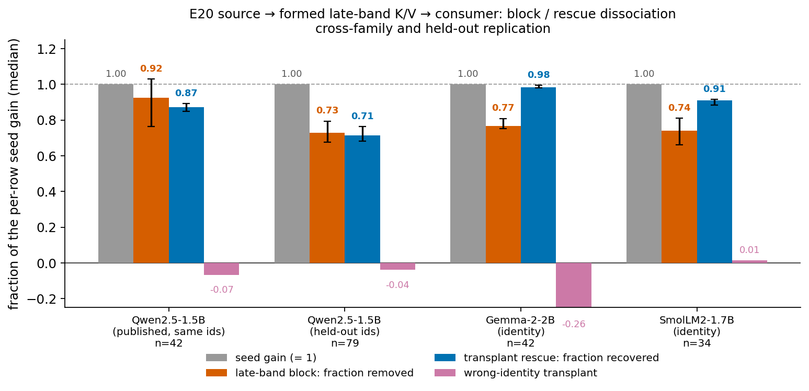
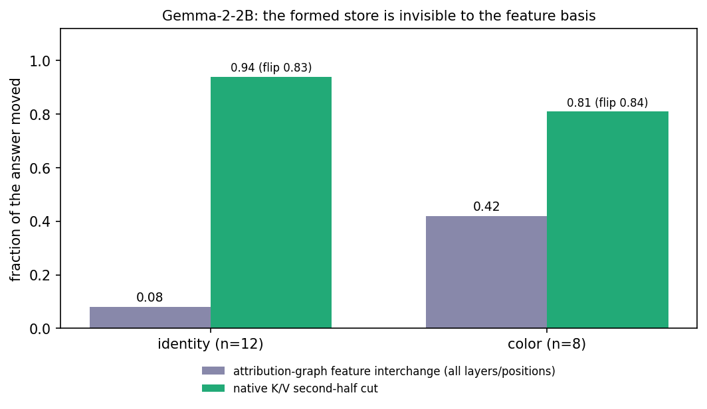
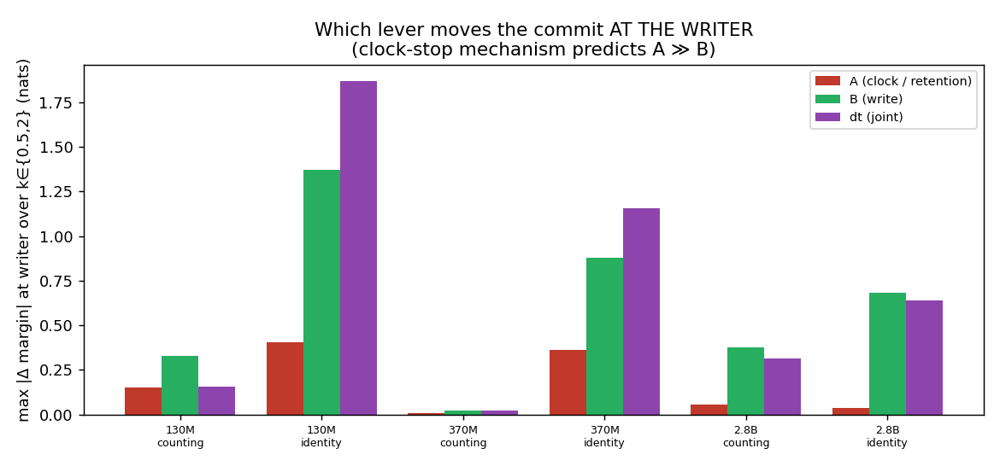

# Time-Formed Circuits: Formation, Commitment, and Causal Use

Jacob Hollenbeck

## Abstract

Single-site activation patching and attribution graphs often disagree about where a circuit lives. We argue that some circuits are organized over ordered execution: a source seeds internal state, the model forms it over an interval, commits it to a store with independent authority, and a later consumer reads it. Source, formed store, and read localize differently, so a single-site tool finds the source or the read and misses the formed store. In a decoder transformer, a clean identity residual written into a neutral recipient early makes the recipient's later layers form a late key/value record. Blocking that recipient-formed band removes most of the seed's effect on the answer; transplanting it into a separate unseeded recipient restores the answer. This block-and-rescue dissociation holds in three decoder families (Qwen2.5-1.5B, Gemma-2-2B, SmolLM2-1.7B): the block removes 0.73-0.92 of the per-row seed gain and the transplant recovers 0.71-0.99, with a wrong-content control authoring the wrong answer. It also reproduces on held-out identities. On Gemma-2-2B, an attribution-graph feature basis moves the identity answer at most 0.08 under feature interchange, while a native key/value cut flips 83%. A diffusion transformer gives a strictly path-distributed instance: no single denoising call meets the transfer or removal criterion while the whole trajectory meets both. No tested language-model cell passes that strict signature, and a weighted additive system can.

## 1. A circuit can be formed before it is read

A prompt helps construct internal state during a forward pass, and later computation depends on that state. Understanding the circuit then requires tracing how the state is formed, committed, and consumed. The site where an intervention can seed an answer, the store that retains the resulting state, and the operation that reads it need not share causal support.

We call a circuit organized this way a **time-formed circuit**: a causal object whose construction history over an ordered execution axis matters to its interpretation. The axis can be layer depth while a transformer builds a contextual record, denoising calls in a diffusion model, or recurrent transitions in a state-space model. These axes are different; the shared property is that state is built over order and then used.

The localization conflict follows directly from this organization. A residual intervention at an early layer measures the ability to initiate construction. An intervention on the already formed key/value state measures the authority of that state. An intervention on the consumer's read measures the operation that uses it. Collapsing these three measurements into one answer to "where is the circuit?" loses the mechanism they jointly reveal. A single-site method that patches one component, or an attribution graph that scores one basis, can land on the source or the read and report that as the circuit.

Our central experiment follows the three stages in a decoder transformer. We write a clean animal-identity residual into a neutral recipient entering an early layer and let the recipient compute its remaining layers; the recipient forms its own late subject key/value record. Removing the recipient-formed band before the answer reads it removes most of the seeded effect. Transplanting that same recipient-formed band into a separate, unseeded recipient restores most of the effect. This is a source-to-formation-to-store-to-consumer chain, measured with two independent interventions, and it reproduces across three decoder families and on held-out identities (Figure 1).

**Figure 1. Formation and independent causal use across three decoder families.** For each cell, the per-row seed gain is normalized to one. Blocking the recipient-formed late band removes 0.73 to 0.92 of that gain; transplanting the band into a separate unseeded recipient recovers 0.71 to 0.99; a matched-width earlier band removes little; and a wrong-identity band of the same width and position authors the wrong answer. The bars are medians over admitted rows with item-bootstrap intervals. The source and the read localize elsewhere; the formed store is what the block and the transplant act on.

This paper makes three contributions.

First, we give an operational account that separates a source, a formation interval, a committed store, and a consumer, and we state when evidence supports the account rather than ordinary execution order (Section 2).

Second, we measure the source-to-store-to-consumer dissociation with independent block and transplant interventions, and we show it is not specific to one model or to the identities used to find it: it holds in Qwen2.5-1.5B, Gemma-2-2B, and SmolLM2-1.7B and on a disjoint identity set (Section 3). We separate the formed store from its read with a concentrated read port and an exact-row join (Section 4), and we show that a published attribution-graph feature basis misses the store that a native state cut finds (Section 5).

Third, we give an operational signature for strictly path-distributed support, we exhibit a clean diffusion instance that passes it, and we report plainly that no tested language-model cell passes it and that a weighted additive mechanism can (Section 6). We then survey how formation, commitment, and retention vary across architectures (Section 7) and bound a result on computed intermediate state (Section 8).

## 2. The operational object

### 2.1 Source, formation, commit, store, consumer

Fix a model checkpoint, an input contrast, a native state interface, a site resolution, and an unchanged downstream consumer. Let execution advance along a declared ordered axis with state transitions `s_{t+1} = F(s_t, u_t)` and output `y = C(s_T)`.

A **source** is an intervention site at which supplying clean state can initiate the behavior. The **formation interval** is the stretch of the execution axis over which the relevant state is constructed. The **commit** is the point at which that state acquires independent causal authority at a runtime interface, measured here by whether it can be blocked and whether it can be transplanted, rather than by its mere persistence in a cache. The **store** is the committed state. The **consumer** is the later operation that reads the store to produce the output.

Commitment is relative to an interface and a read horizon. It does not imply that every later intervention is ineffective, or that online weight learning has occurred. "Circuit" here includes the causal relations among these stages; a stored tensor is a state component of the circuit, and a successful local write is a port into it.

### 2.2 Isolated versus in-forward interventions

An intervention that overwrites key/value state during the subject's own computation can change the subject's attention and residual, which then write into later layers. An apparent single-layer edit therefore propagates into the construction process, and its effect is a mixture of direct store authority and leakage into formation.

We distinguish an **in-forward cut**, which overwrites state during the forward pass, from an **isolated cut**, which first completes the subject's prefix, then overwrites only its cached entries, then runs only later positions. The isolated cut preserves the subject's already completed formation history and reads the store as the consumer would. This distinction is load-bearing: in Qwen2.5-1.5B identity, an in-forward layer-0 write authors the answer at 0.985 of full effect, while the isolated write at the same layer authors only 0.009. Early source authority, direct late-store authority, and intervention leakage are therefore experimentally separable, and we use the isolated cut throughout for store claims.

### 2.3 Locality and the strict path-distributed signature

Locality is a separate property from temporal formation. A mechanism can have locally decisive support at one interface and distributed support at another. We use **space circuit** as shorthand for a behavior with individually decisive causal support at a declared grain, and we use it as a descriptor, not as an exclusive alternative to time-formed computation. A local source, a direct late write port, and a concentrated read can all belong to a circuit whose store has distributed support.

We define the **strict path-distributed signature** at a declared cut by four conditions: no single site is necessary, no single site is sufficient, the whole path is necessary, and the whole path is sufficient. Necessity and sufficiency are judged against stated behavioral criteria, and partial effects remain effects.

The signature is an operational object, not a mechanism claim. The four conditions do not require nonlinearity: a weighted additive mechanism `y = (x_1 + ... + x_n)/n`, in which no one term meets a high threshold but the sum does, satisfies all four. Temporal formation and the distribution of causal support therefore require separate evidence, and passing the four conditions names a support profile rather than a kind of computation.

## 3. Formation and mediation in transformers

### 3.1 A local source can initiate a longer construction

Moving a single residual write through depth maps a formation window: the span over which a supplied source can still produce the downstream answer. In Qwen2.5-1.5B identity, residual source writes remain near full normalized authorship through layer 22 and then decline, to 0.57 at layer 24 and 0.37 at layer 27. Other decoder cells have their own windows: SmolLM2-1.7B identity stays strong through layer 19 and drops to 0.07 by layer 23, and Pythia-410M at an intermediate checkpoint stays strong through layer 17 and drops to 0.01 by layer 22.

These curves locate where a supplied source still produces the answer. They do not show that the supplied layer alone holds all the required causal support, because the unchanged remaining computation performs the formation. The store intervention in Section 3.3 identifies a later mediator of that source effect.

### 3.2 Necessity is a late band, not a single layer

Low single-site necessity could reflect a small backup pair rather than genuinely distributed support. We therefore cut every contiguous window at widths two, three, four, six, and eight, and separately cut each window's complement, using the isolated operator that replaces the completed subject's key/value with filler state before later positions consume it.

| Cell (identity unless noted) | Rows | Best single-site necessity | Best width-3 necessity | Smallest tested window reaching 0.8 of whole-path necessity |
|---|---:|---:|---:|---|
| Qwen2.5-0.5B | 42 | 0.35 | 1.23 | width 2: L20-21 reaches 0.99 |
| SmolLM2-1.7B | 34 | 0.31 | 0.67 | width 4: L19-22 reaches 1.15 |
| SmolLM2-1.7B color | 27 | 0.10 | 0.42 | width 6: L16-21 reaches 0.92 |
| Qwen2.5-1.5B | 42 | 0.08 | 0.23 | width 6: L22-27 reaches 0.96 |
| Qwen2.5-1.5B color | 22 | 0.18 | 0.42 | width 6: L22-27 reaches 0.89 |
| Gemma-2-2B | 42 | 0.08 | 0.18 | not reached: L16-23 reaches 0.76 at width 8 |
| Gemma-2-2B color | 25 | 0.15 | 0.29 | width 8: L18-25 reaches 0.84 |

**Table 1. Stored support ranges from a redundant pair to a wider late band.** Entries are median signed fractions of the corresponding whole-path effect; widths five and seven were not swept, so reported widths are bounds on this grid. Figure 2 shows the full window-by-window profile for the Qwen2.5-1.5B and Gemma-2-2B identity cells.

The Qwen2.5-0.5B identity cell is the informative local case: two adjacent layers carry the effect, so this cell has a space-circuit store with backup. The Qwen2.5-1.5B and Gemma identity cells require wider support than any three-layer window, so their stores are genuinely distributed at the layer grain. Their best three adjacent layers carry only 0.23 and 0.18 of the whole-path effect.

**Figure 2. Window necessity for the distributed cells.** Necessity of every contiguous window, by width and start, for Qwen2.5-1.5B and Gemma-2-2B identity, with the Gemma sliding-layer and global-layer sets shown separately. Error bars are 95% bootstrap intervals. The necessity is spread over a late band rather than concentrated at one layer.

Those distributed stores nonetheless have strong direct write ports at individual late layers. An isolated single-layer write reaches 0.81 of full effect at Qwen2.5-1.5B layer 23 and at Gemma-2-2B layer 22. A store can therefore be distributed under necessity and still accept a coherent record through one late layer; these are separate measurements of the same store.

### 3.3 The source effect follows the recipient-formed store

The formation window and the write sweeps leave one question open: when a source seeds the answer, which later state carries the seeded effect to the consumer? We answer it with two interventions that do not share a numerator.

The experiment uses Qwen2.5-1.5B with frozen weights, FP32, eager attention, and a single execution seed. Fourteen single-token animal identities appear in three controlled contexts, giving 42 admitted rows; the neutral recipient uses the word "creature" in place of the identity. At the subject position a row-matched clean residual enters layer 12 of the recipient, the recipient computes its ordinary remaining prefix, and its subject key/value rows at layers 22 to 27 are captured as the proposed mediator. The mediator is formed by the seeded recipient, so its relationship to the source is part of the experiment.

The block arm replaces that late band with the unseeded recipient's corresponding state after the subject has finished computing. The rescue arm installs the seeded recipient's band into an otherwise unseeded recipient. Each suffix runs with a private cache and no source hook, and the unchanged next-token distribution is the consumer.

Blocking the recipient-formed band removes a median 0.924 of the per-row seed gain, with an item-bootstrap interval of [0.765, 1.030] over the 42 rows. Transplanting the band into a separate unseeded recipient recovers a median 0.871 [0.850, 0.894]. The two numerators differ, so these are not complementary shares; each is normalized by that row's actual positive seed gain, which ranges from 1.577 to 5.555 nats with a median of 3.515.

Two controls separate content from timing. A wrong-identity band of the same width and position authors its own identity on 37 of 42 rows and retains a median -0.067 of the seeded effect, so the transplant carries specific content rather than a generic late-band perturbation. A matched-width earlier band at layers 16 to 21 removes only a median 0.066 of the seed gain, so the late band, not any late intervention, carries the effect.

### 3.4 The dissociation holds across families and on held-out identities

The result above is one model on one identity panel. We repeated the identical isolated nine-arm experiment in two further decoder families and on a disjoint identity set, choosing each model's seed layer and late band from its own formation-window and window-necessity evidence and freezing them before running.

| Model (identity) | n | Block removed | Rescue recovered | Earlier-band removed | Wrong-identity retained |
|---|---:|---:|---:|---:|---:|
| Qwen2.5-1.5B (original panel) | 42 | 0.924 [0.765, 1.030] | 0.871 [0.850, 0.894] | 0.066 | -0.067 |
| Qwen2.5-1.5B (held-out identities) | 79 | 0.728 [0.676, 0.795] | 0.713 [0.683, 0.764] | 0.219 | -0.039 |
| Gemma-2-2B | 42 | 0.768 [0.752, 0.809] | 0.985 [0.980, 0.995] | -0.008 | -0.260 |
| SmolLM2-1.7B | 34 | 0.740 [0.663, 0.812] | 0.910 [0.884, 0.917] | 0.020 | 0.015 |

**Table 2. The block-and-rescue dissociation reproduces across families and on held-out identities.** Each entry is a median over admitted rows of a signed fraction of that row's positive seed gain, with item-bootstrap intervals. In Gemma-2-2B the seed enters layer 7 and the mediator is the layer 16 to 23 band; in SmolLM2-1.7B the seed enters layer 12 and the mediator is layers 19 to 22. The held-out Qwen rows use twenty-nine single-token identities disjoint from the development set across three contexts.

The late-band block removes 0.73 to 0.92 of the per-row seed gain in every cell, and the independent transplant recovers 0.71 to 0.99. The matched-width earlier band removes far less, at most 0.22 and near zero in three cells, and the wrong-identity band authors the wrong answer, with target candidate top-1 at most 0.06 while the wrong-donor candidate wins on 0.75 to 1.00 of rows. In Gemma-2-2B the block removes 0.768, matching the 0.76 fraction of whole-path necessity that its layer 16 to 23 band carries in the window sweep.

The held-out Qwen identities are the weakest rescue and are reported in full. These identities have larger seed gains, a median of 6.05 nats against the development median of 3.5. The transplant restores the correct identity as the top candidate on 81% of rows but as the full-vocabulary top-1 on 39%; the gain removed and recovered and the near-zero wrong-identity control reproduce the original dissociation, with part of the effect additionally reachable through the earlier band, which removes 0.219 here.

Every branch uses the isolated prefix-suffix split, the stock causal mask, private cloned caches, and FP32 replay checks. Split-forward, reinstall, and restore mechanics match to within 1e-4 or exactly in each cell, and an artifact-only verifier passed six custody and arithmetic gates on every cell. The dissociation is therefore a property of this class of decoder circuit, not of one checkpoint or the identities used to find it.

### 3.5 What the experiment establishes and what it does not

The independent rescue is the decisive counterpart to the block. A record formed after a supplied source has causal authority in a different recipient, which connects three quantities often treated as interchangeable: the ability to seed a computation, the necessity of its formed state, and the ability of that state to author a consumer's answer.

The claim is specific to these controlled identity panels and this state cut. Formation is recipient-native after a supplied clean residual; it is not donor-free construction. The experiment identifies a formation interval and a causal endpoint, but it does not make the band unique, decode the internal carrier, or establish the construction route of every natural computation. It is direct evidence for the formation-and-commitment anatomy of a time-formed circuit in a decoder transformer.

## 4. The read side is a different part of the circuit

The formed store says what the consumer reads and where the state was built; it does not say how the consumer selects the rows it reads. We separate the read with cut-and-join interventions on the answer's attention to the subject row.

In Qwen2.5-1.5B identity, the best single-layer read necessity is 0.074 of the whole-read effect, and a single-layer restoration at layer 23 recovers 1.22 of that effect. A one-hot read of the exact subject row in the leading subject-reading head reaches normalized recovery 1.02 with the target as full-vocabulary top-1 on 88% of rows, while shuffled rows do not reproduce the result. In this cell a store with distributed necessity has a concentrated read port: the local read accesses formed state, and its locality says nothing about the locality of formation or storage.

The read is join-replaceable at the commit layer once the key is standardized. Standardizing the subject's layer-0 key resolves a degenerate raw-cosine bucket, after which a subject-referenced bucket identifies the row and a one-hot join matches the oracle at the commit layer. The same exact-row join rescues a cut induction circuit in Qwen2.5-0.5B: after every query-to-source edge is cut, allowing the top heads to read only the single row an exact key join selects, with native values, recovers the behavior to within 0.03 of clean.

Query-derived semantic selection remains open. A predecessor-based query address identifies the subject row on surface repetition at rate 1.00 but fails on semantic identity, color, and coreference panels at rate 0.00. The read interface is executable, but we do not have a complete query-to-address algorithm for semantic reads, and the question of why attention selects those rows is answered only for repetition.

## 5. Standard single-site tools miss the formed store

If the formed store is the circuit's center of mass, the methods that the target audience builds and uses should be tested against it. We run a published attribution-graph pipeline, circuit-tracer with Gemma Scope transcoders, against the identity and color store in Gemma-2-2B, on a head-to-head panel of 12 admitted identity items and 8 color items.

The attribution graph ranks features meaningfully but does not localize the store. About 30% of end-to-end influence runs through error nodes rather than through reconstructed features. The subject position's influence is spread thinly across layers, at most 0.18 to 0.28 in any one layer, and the graph places its largest subject-position share at layer 0, next to the embedding, in 11 of 12 identity items and 8 of 8 color items. Only 0.10 to 0.21 of subject influence falls in the commit band where the store is written.

The matched operator is the decisive comparison. Feature-basis interchange sets every transcoder feature active in either the clean or the filler run to its filler value, at chosen positions and layers, with error terms held at their clean values; this is the native state swap expressed in the instrument's own feature basis, and writing the clean values back gives exactly zero change. Under this matched operator, replacing every feature at every position and layer moves the identity answer at most 0.08 of the way toward the filler output, and the color answer 0.31 to 0.42 of the way. The graph's own top features, swapped to filler values, move the identity answer away from the filler, by -0.03 to -0.19.

The native state cut finds what the feature basis misses. On the model's full formation sweep of 42 identity and 25 color rows, an isolated key/value cut over the second half flips the answer on 0.83 of identity items and 0.84 of color items, and the whole-path cut flips 0.93 and 1.00; its best single layer carries only 0.08 for identity and 0.15 for color. Figure 5 places the matched feature interchange beside the native cut.

**Figure 5. The formed store is invisible to the feature basis.** Left bars: the fraction of the answer moved by all-layer, all-position feature interchange in the attribution-graph basis (identity at most 0.08, color 0.42). Right bars: the fraction moved by a native key/value second-half cut, with the candidate flip rate annotated (identity 0.94, flip 0.83; color 0.81, flip 0.84). The feature comparison is on 12 identity and 8 color items; the native flip rates are from the 42-identity and 25-color formation sweep.

The reading is specific and bounded. The identity is carried in the subject's residual stream and key/value state from the embedding onward, so it lives in what the transcoders do not reconstruct, their error terms, which the instrument holds at clean values during interventions. Color is partly visible and has the time-circuit shape, rising from single layers to the second half to all layers at about a third of the native magnitude. This is a bounded coverage result for one transcoder set on one model; it does not show that feature methods cannot measure temporal mechanisms, and the full native layer sweeps were themselves essential to finding the write ports that earlier sampled cuts missed.

## 6. A diffusion transformer with strictly path-distributed support

### 6.1 The complete singleton and trajectory assay

A diffusion transformer gives a support topology that no language-model cell in this study reaches. We test FLUX.2 Klein-4B at a pinned checkpoint, with BF16 execution, 256-by-256 output, four denoising calls, and guidance 1.0. Matched branches transplant target text-stream state for sufficiency or source text-stream state for necessity, at one call or at all four, and the native denoiser, scheduler, and decoder compute every endpoint.

Image progress toward the target is `P(I) = 1 - MAD(I, I_target) / MAD(I_source, I_target)`, where MAD is mean absolute pixel deviation. The transfer criterion is `P >= 0.90` and the removal criterion after source replacement is `P <= 0.15`. Every singleton is assessed against the same criteria as the whole path, over three setups by five site sets that share three baseline runs.

| Question (15 cells, 3 shared baselines) | Measured bound |
|---|---:|
| Does any single-call target write attain full transfer? | maximum P = 0.5620 |
| Does any single-call source replacement attain removal? | minimum P = 0.20743 |
| Does the all-call target write attain full transfer? | minimum P = 0.91309 |
| Does the all-call source replacement attain removal? | maximum P = 0.01101 |

**Table 3. A strict path-distributed signature at the text-stream cut.** No single call meets either criterion; the whole path meets both. Partial singleton effects, including 0.562 progress, remain visible. Figure 4 shows the four bounds against their criteria.

**Figure 4. FLUX.2 Klein-4B passes the strict four-condition signature.** Left: sufficiency, where any single call reaches at most P = 0.562 while all four calls reach 0.913, above the 0.90 transfer line. Right: necessity, where any single source replacement leaves P at least 0.207 while all four reach 0.011, below the 0.15 removal line. The signature is an operational support profile, not a mechanism claim.

A separate five-seed color panel extends the necessity half. Every single-call source replacement leaves the image nearest the target, and the all-call source interchange reaches the source on 5 of 5 seeds in both recorded route variants. All-call deletion reaches the null image on 5 of 5 seeds in one route variant and 4 of 5 in the other, while a norm-matched sham also reaches null on 5 of 5 in both. Interchange therefore carries the semantic discrimination that deletion alone lacks, and the five seeds are a necessity panel rather than five full four-condition replications.

### 6.2 The necessity operator and the boundary cases

Whole-path deletion is not a specific necessity operator at this cut. A norm-matched random sham also nulls the image, and at the input cut deletion is equivalent to removing the prompt. We therefore report interchange as the informative necessity operator and gate both on exact replay; a same-day misreading that necessity was interchange-only was itself corrected once a distance-metric artifact was fixed, after which deletion does remove the target and the null image sits near zero progress.

The signature does not generalize to every diffusion cut, and we report the boundaries. In FLUX.2 Klein-9B, the identity behavior passes the four conditions, with single-step transfer at most 0.48 against all-step 0.90 to 0.95, and 8 of 9 identity gates pass, while a lighting behavior is mixed because one step alone reaches the source on one seed and 7 of 9 lighting gates pass. In an SDXL cross-attention route the write is path-constituted, with single-step transfer at most 0.215 against all-step 0.985, but one step alone meets the removal criterion, so that cut fails the no-single-site-necessary condition. The signature is a property of a behavior at a cut, not of the diffusion regime as such.

### 6.3 What the diffusion instance adds

FLUX is a transformer operating in a diffusion regime, and its denoising axis differs from the layer-depth axis of decoder key/value formation. The shared class is time-formed causal organization; strict path distribution is the particular support profile demonstrated here, and it strengthens the account by exhibiting one clean support topology.

The strict signature alone cannot distinguish weighted additive accumulation, redundancy, or adaptive re-derivation, as Section 2.3 notes. It identifies path-distributed support at the intervention interface. No tested language-model cell passes it, because every clean language-model store has a concentrated late write port that exceeds the no-single-site-sufficient bar; the signature's only clean instance here is diffusion. We state this plainly so that the four conditions are read as an operational signature with a clean diffusion instance, not as a certificate that an architecture or a mechanism must satisfy.

## 7. Architecture variation

The source-formation-store-consumer anatomy appears with family-local implementations. We summarize the tested specimens and their support profiles.

| Architecture (specimen) | Ordered axis | Formation and commit | Strict signature |
|---|---|---|---|
| Decoder transformer (Qwen2.5-1.5B, Gemma-2-2B, SmolLM2-1.7B identity) | layer depth | formation window via residual writes; distributed late-band necessity with a concentrated write port (0.81 at Qwen L23 and Gemma L22) | no: concentrated write fails the no-single-site-sufficient condition |
| Gemma-2-2B sliding-window layers | layer depth | positive write ports on the sliding-window layers L16, L18, L20, L22; interleaved global layers can be individually negative yet contribute jointly to the band's necessity | no |
| State-space model (Mamba-130M, 370M, 2.8B) | recurrent transitions | a single concentrated late write port at 0.69 to 0.83 of depth (L20, L39, L44); the writer is a retention outlier whose selective timestep nearly freezes, but a matched clock-dose is not the causal lever (Section 7.1) | no |
| Hybrid attention plus SSM (Falcon-H1) | layer depth plus recurrent state | attention dominates the tested post-subject formed-state dependence; SSM state has partial write authority with no concentrated Mamba-like writer; source formation, read layer, and retention clock are unmeasured | not established |
| Decoder transformer, induction (Pythia-70M) | layer depth | a space-circuit control: three heads, one relay and two writers, are necessary and sufficient (Section 7.2) | not applicable; this is the locally decisive case |

**Table 4. Family-local formation, commitment, and retention.** Every specimen shows state built over its ordered axis and committed to a store, with the write port's locality and the retention mechanism varying by family. No specimen passes the strict signature; Pythia-70M induction is the locally decisive control.

### 7.1 The Mamba writer is a retention outlier, not a clock lever

The Mamba late writer is a retention outlier: on identity and counting prompts at the writer cells (130M L20, 370M L39, 2.8B L44) its selective timestep nearly freezes over the suffix, with an elapsed clock of 0.03 to 0.07 against 1 to 8 at its neighbors. An earlier reading treated stopping that clock as the commit mechanism, and a matched clock-dose test refutes that reading.

We apply three matched actions at the writer at dose factors 0.5 and 2, over three prompts per task: scaling retention only, scaling the input write only, and scaling both. In all six cells the retention action is the weakest of the three, with a largest answer-margin change of 0.01 to 0.40 nats, against 0.02 to 1.37 for the write action and 0.02 to 1.87 for the joint action. Releasing the writer's clock at dose 2 lowers its surviving-state fraction as expected, for example from 0.87 to 0.83 in the 2.8B identity cell, but does not collapse the answer; the margin change is positive in three of the six cells. The clock action is also not writer-specific: in the strongest retention outlier, 2.8B identity, clamping the clock at the neighbor layer 40 moves the answer more than at the writer layer 44, 0.36 against 0.04. The writer's causal property is its write; its near-stopped clock holds the already-written store rather than authoring the answer (Figure 6).

**Figure 6. At the Mamba writer, the write is the lever and the clock is not.** For each cell, the largest answer-margin change over the dose factors under the write-only, retention-only, and joint actions. The write action dominates the retention action in all six cells; the near-stopped clock is a correlate of the commit, not its cause.

### 7.2 The space-circuit control

Pythia-70M induction is the locally decisive comparison. The writer pair is necessary but not sufficient, removing 0.74 to 0.81 of recoverable loss while recovering almost nothing alone. A five-head set is necessary and sufficient, and a minimal triple of one relay and two writers reproduces it, with the relay carrying 0.58 to 0.72 of necessity and one writer 0.24 to 0.29. Standard head-level ablation finds this circuit directly, which is the signature of locally decisive support, against at most 0.18 of necessity per layer in the distributed language-model stores.

## 8. Computed intermediate state

A time-formed store need not hold a copied token; it can hold a value the model computed and did not restate. We test this on synthetic arithmetic with teacher-forced scaffolds in Qwen2.5-0.5B-Instruct and Qwen2.5-1.5B-Instruct, on primary panels of 32 and 30 non-copied single-intermediate items in which the answer is one operation past a scratchpad value that is never restated. The entire scaffold is prefilled before any cache intervention, and a copied-value canary flips at rate 1.00.

The directed counterfactual swap is the cleanest causal signal: installing a different item's intermediate state authors that donor's arithmetic result on 19 of 32 completed-consumer rows at 0.5B and 30 of 30 at 1.5B, with the native consumer continued for up to 128 tokens. Removal is weaker and often repaired: after mean-ablating the step's rows, the completed answer is wrong on 26 of 32 rows at 0.5B but only 3 of 30 at 1.5B, where the model repairs correctly on 25 of 30, with two rows unresolved at the token budget. A text-corrupted step also propagates arithmetically, so the state is used rather than merely present.

Specificity holds in two-step chains. Unmounting the consumed step changes 8 of 8 answers and its counterfactual swap authors 8 of 8 donor answers, while unmounting an early step changes 0 of 8, with mean absolute sequence-logprob changes of 0.037 and 0.015 nats. The later state was already cached, so this does not test whether it could be regenerated after the early step is removed.

The bounded reading is that a non-restated intermediate value is causally active under this cache intervention and can author the consumer's answer under a directed swap, while its necessity depends on the consumer and horizon and is frequently repaired at 1.5B. The chain does not pass the strict path-distributed signature at this grain. A full sweep of a related computed-object cell is consistent: operands are written early at carrier layers, at or before layer 7, and the computed sum is written late, from layer 18 to layer 21, with single-layer necessity 0.35. The scope is synthetic arithmetic with one greedy trajectory per branch and supplied scaffolds, so autonomous chain-of-thought faithfulness remains a separate question.

## 9. Related work

Our account is not a claim that prior work ignored execution order; it is an operational category with separate source, formed-store, and consumer tests, and the delta is in the interventions, not the observation that order matters.

The closest predecessors stage factual recall in transformers. Meng and colleagues locate restoration sites that participate in factual predictions and motivate weight editing [Meng 2022]. Geva and colleagues identify subject enrichment, relation propagation, and an attention-mediated extraction stage [Geva 2023]. Agarwal reports early entity availability and later generation-controlling commitment across four decoder models [Agarwal 2026]. Our source intervention has related restoration semantics, and our formation window, commit, and read map onto enrich-propagate-extract and onto deferred commitment. The additions are a store intervention that is isolated rather than in-forward, so it reads the committed state as the consumer would; full window sweeps that overturn sampled two-layer certificates and localize necessity to a late band; an independent transplant that shows the formed state authors a separate recipient's answer, now across three families and on held-out identities; and an exact-row read join that separates the read from the store.

Hase and colleagues show that causal-tracing localization does not predict where weight editing works [Hase 2023]. The formation-and-commitment anatomy offers one reason: the source that a tracing method restores and the store that carries the answer localize differently, so the best restoration site need not be the best edit site. Self-repair can make a single-site ablation underestimate importance, and compact adjacent-layer backup can hide a store from single-layer cuts [McGrath 2023; Rushing & Nanda 2024]; both motivate the window sweeps, and faithfulness scores depend on the ablation operator [Miller 2024], which is why we report interchange and deletion separately and gate both on exact replay.

Two 2026 papers observe the distributed effect without naming a category. In-context task identity transfers 0% under single-position intervention at every layer of Llama-3.2-3B but up to 96% under multi-position intervention [Cheng & Zhang 2026], and single-layer activation edits corrupt factual recall easily but repair it rarely [Bugaud 2026]. Geiger and colleagues give a causal-abstraction framework for interventionally faithful higher-level accounts [Geiger 2023]; our source, store, and consumer roles are a candidate decomposition at native-state interfaces rather than a new theory of intervention. Circuit Tracing and the circuit-tracer library release the attribution-graph methods and the transcoder basis that Section 5 tests [Ameisen 2025; Hanna 2025; Lieberum 2024].

Temporal control is already part of diffusion interpretation. DifFRACT trains timestep-conditioned transcoders for a diffusion transformer and builds feature-attribution graphs at each denoising step, with interventions that span every step [Mazur 2026], and prompt-conditioned insertion measures when changed conditioning can still insert a concept across generators [Görgün 2026]. Our diffusion contribution is the exhaustive single-call and whole-trajectory necessity-and-sufficiency assay at a native-state cut, joined to replay, rather than the first observation that timing matters. Task and function vectors are compact carriers read at one site [Hendel 2023; Todd 2024]; a time-formed store can also have a local read or write port, and its temporal classification comes from how the downstream state is formed, not from excluding locality.

## 10. Limitations

The language-model panels are small per cell and mostly single-seed, with short next-token readouts, and the identity panels repeat identities across a few controlled contexts; the held-out replication in Section 3.4 is the direct answer to the panel-not-held-out concern, but it is still one laboratory and one harness.

The strict signature is demonstrated at and below 4B parameters: FLUX.2 Klein-4B is the largest clean instance, and in a Qwen3-30B identity cell the in-forward certificate did not survive the isolated cut, so we make no claim that the signature or the mediation passes at 30B. We also do not report a private large-model chain-of-thought result that lacks a located receipt.

The distributed necessity in Section 3.2 is localized to a late band at the layer grain, but we have not swept below the layer grain, across heads, keys versus values, and positions within the band, so a finer instrument could find a compact site inside the band. The signature identifies a path-constituted mechanism at a cut, not a minimal or unique path, and the diffusion route is known not to be unique.

The read "why" is open for semantic queries: the exact-row join presumes a selection that we can execute but not yet derive from the query on semantic reads. The hybrid specimen is one checkpoint and seed and tests already-formed caches rather than state-space participation during formation.

These experiments use stock eager attention. A separately identified attention-wrapper mask-registration defect affects certain routing and continuation observations in adjacent work; the results reported here run under ordinary eager execution and the isolated cut, and are outside that defect, and we import nothing from the mask-affected wrappers.

## 11. Conclusion

A circuit's construction history can be part of its causal anatomy. A locally effective source can cause later state to form; that state can have distributed necessity and a concentrated write port; and its read can be local and query-sensitive. When these stages are measured as one answer to "where is the circuit?", they conflict; when they are measured separately, with an isolated store cut, an independent transplant, and a separated read, the conflict dissolves into a source, a formed store, and a consumer that simply localize to different places.

The block-and-rescue dissociation gives the account its central evidence and holds across three decoder families and on held-out identities. The attribution-graph comparison shows that a published feature basis sees the source at the embedding and in error nodes and misses the formed store that a native cut finds. The four-condition signature gives a clean diffusion instance of strictly path-distributed support, together with the plain negative that no tested language-model cell passes it and that a weighted additive mechanism can. The architecture survey shows the same construction-retention-use separation implemented family by family.

A reusable question follows. The store forms at an input-invariant depth while the input chooses what is written there and how it is read, which suggests that a recurring functional organization carries these circuits; a companion line of work develops that scaffold hypothesis, and this paper establishes the formation and use of the causal object it would reuse.

## Appendix A. Experiment table

Each row maps a result in the body to its model, sample size, metric, and source record; internal experiment identifiers and job identifiers appear only in this appendix.

| ID | Result (section) | Model | n | Metric | Record path | Jobs |
|---|---|---|---:|---|---|---|
| E20-xfam | Block-and-rescue dissociation across families and held-out identities (3.4, Fig 1) | Qwen2.5-1.5B, Gemma-2-2B, SmolLM2-1.7B | 42 / 79 / 42 / 34 | median signed fraction of per-row seed gain, item-bootstrap CIs | `saturn/experiments/2026-10-02-e20-cross-family/FINDINGS.md`; `results/analysis.json` | gemma `job-fab52bcf3cce`; qwen held-out `job-a66b102614e3`; smollm2 `job-c128e07da015` |
| E20 | Source-to-store-to-consumer mediation, original panel (3.3) | Qwen2.5-1.5B | 42 | block 0.924, rescue 0.871; wrong-identity authors own 37/42 | `saturn/experiments/2026-09-30-full-layer-sweeps/FINDINGS-E20-mediation.md` | `job-e1f652e80f43` |
| E16 | Residual-write formation windows (3.1) | Qwen2.5-1.5B, SmolLM2-1.7B, Pythia-410M | panel | normalized source authorship by layer | `saturn/experiments/2026-09-30-full-layer-sweeps/FINDINGS-E16-residual-writes.md` | — |
| E17 | Isolated single-layer writes; in-forward leak correction (2.2, 3.2) | Qwen2.5-1.5B, Gemma-2-2B | panel | isolated write fraction; L0 0.985 in-forward vs 0.009 isolated | `saturn/experiments/2026-09-30-full-layer-sweeps/FINDINGS-E17-isolated-kv-writes.md` | — |
| E19 | Window necessity, every contiguous 2/3/4/6/8-layer window and complement (3.2, Table 1, Fig 2) | 7 decoder cells | 22-42 | median signed fraction of whole-path effect | `saturn/experiments/2026-09-30-full-layer-sweeps/FINDINGS-E19-window-necessity.md` | `job-57ad67c21bd1`, `job-2f9593a800cd` |
| E13 | Read cut-and-join, concentrated read port (4) | Qwen2.5-1.5B | 42 | read necessity, one-hot join recovery | `saturn/experiments/2026-09-30-e13-time-circuit-read-join/FINDINGS.md` | — |
| E18 | Standardized bucket and exact-row join; semantic-address limitation (4) | Qwen2.5-1.5B | panel | join = oracle at commit; repetition 1.00 vs semantic 0.00 | `saturn/experiments/2026-09-30-e18-bucket-join-time-reads/FINDINGS.md` | — |
| E12 | Exact-join rescue inside a certified induction circuit (4) | Qwen2.5-0.5B | panel | within 0.03 of clean after cut-and-join | `saturn/experiments/2026-09-25-ar-exact-join-admission/FINDINGS.md`; `saturn/experiments/2026-09-30-e12-bucket-exact-address/` | `job-a05238ace419` |
| E6 | Attribution-graph feature basis vs native cut (5, Fig 5) | Gemma-2-2B | 12 identity, 8 color (feature); 42/25 (native sweep) | fraction moved under matched interchange; native flip rate | `saturn/experiments/2026-09-30-circuit-tracer-head-to-head/FINDINGS.md` | `job-03225ce474d1` (interchange), `job-ed4ce1ac5974` (native K/V) |
| E1b | FLUX four-condition singleton and trajectory assay (6.1, Table 3, Fig 4) | FLUX.2 Klein-4B | 15 cells, 3 baselines | image progress P; bounds 0.5620 / 0.20743 / 0.91309 / 0.01101 | `saturn/experiments/2026-09-30-flux2-joint01-time-accumulation/FINDINGS.md` | — |
| E1c | Residual-state deletion correction; null-image rule (6.2) | FLUX.2 Klein-4B | — | deletion removes target; sham also nulls | `saturn/experiments/2026-09-30-flux2-residual-deletion/FINDINGS.md` | — |
| E7 | Five-seed FLUX color necessity (6.1) | FLUX.2 Klein-4B | 5 seeds | single-call nearest target; all-call interchange to source 5/5 | `saturn/experiments/2026-09-30-e7-flux-color-multiseed/` | — |
| E8 | FLUX Klein-9B four conditions and nine gates (6.2) | FLUX.2 Klein-9B | 2 seeds x 2 windows | single-step <= 0.48 vs all-step 0.90-0.95; 8/9 identity, 7/9 lighting | `saturn/experiments/2026-10-01-e8-klein9b-nine-gate/FINDINGS.md` | — |
| E9 | SDXL route: path-constituted write, one-step necessity (6.2) | SDXL | — | single step <= 0.215 vs all 0.985; one step meets removal | `saturn/experiments/2026-10-01-e9-sdxl-four-quadrant/` | — |
| writer-clock-dose | Mamba write-vs-clock dose (7.1, Fig 6) | Mamba-130M, 370M, 2.8B | 3 prompts/task | largest answer-margin change over dose; write > clock 6/6 | `saturn/experiments/2026-10-02-mamba-writer-clock-dose/FINDINGS.md` | `job-baf14cd06dd2`, `job-cbb0e8a57f45`, `job-e55fc32a16ed` |
| E3b-M | Mamba full layer sweeps; single late writer (7) | Mamba-130M, 370M, 2.8B | panel | late-writer depth and share | `saturn/experiments/2026-09-30-mamba-full-layer-sweeps/FINDINGS.md` | — |
| E14 | Hybrid attention-plus-SSM sweep (7) | Falcon-H1 | 22 identity, 9 color | attention-dominated formed-state dependence | `saturn/experiments/2026-10-01-e14-hybrid-attn-ssm/` | — |
| E4 | Pythia-70M induction space-circuit control (7.2) | Pythia-70M | induction panel | recovered loss; triple necessary and sufficient | `saturn/experiments/2026-09-30-e4-pythia-recovered-loss/` | `job-19e98d8ac631`, `job-b69d8fc7654a` |
| E10 | Computed intermediate state (8) | Qwen2.5-0.5B/1.5B-Instruct | 32 / 30 | swap authorship 19/32, 30/30; removal wrong 26/32, 3/30 | `saturn/experiments/2026-10-01-e10-completed-answer-rerun/FINDINGS.md` | `job-5c53b6865f0f`, `job-f62de8e717a0` |
| E11 | Full sweep of the computed-object cell (8) | Qwen2.5-1.5B | 45 | operands early (<=L7), sum late (L18-L21); necessity 0.35 | `saturn/experiments/2026-09-30-full-layer-sweeps/FINDINGS-E11-computed-object.md` | — |

## Appendix B. Methods details

**Isolation protocol.** For a store claim the subject prefix is computed to completion first; only the cached key/value entries at the chosen layers and the subject position are then overwritten; and only the later positions are run, with explicit cache positions and the stock causal mask. This reads the committed state as the consumer would and avoids the in-forward leakage of Section 2.2. An in-forward cut, by contrast, overwrites during the subject's own forward pass and mixes direct store authority with leakage into formation.

**Mediation metrics (Section 3).** Let the seed gain on row i be `g_i = logp_i(y | seed) - logp_i(y | base)`, which is positive on every admitted row. Block removal is `(logp_i(y | seed) - logp_i(y | block)) / g_i` and rescue recovery is `(logp_i(y | rescue) - logp_i(y | base)) / g_i`. These numerators differ, so block and rescue are not complementary shares; each is normalized by that row's own positive seed gain before aggregation, and values above one or below zero are retained in the raw record. Medians are reported with item bootstrap over admitted rows.

**Replay and custody (Section 3).** Each suffix runs with a private deep-cloned cache and no source hook. Split-forward versus full-forward logit differences are at most 8.6e-5; recipient key/value reinstall and seeded-band block-and-restore are exact. An artifact-only verifier checks custody byte-binding, log and report round-trip, panel structure, finiteness, per-row arithmetic, and FP32 parity, and passed on every cell in Table 2.

**Diffusion assay (Section 6).** The checkpoint, seed or declared seed panel, precision, guidance, resolution, scheduler, and step schedule are fixed. Image progress P, source and target and null proximity, and the norm-matched sham are distinct observables, and target-derived payloads are labeled as such. The transfer and removal criteria are declared before measurement, and every singleton is assessed against the same criteria as the whole path.

**Attribution-graph comparison (Section 5).** The attribution target is the answer logit. The native operator is a full key/value state swap to the filler; the matched instrument operator sets every transcoder feature active in either run to its filler value with error terms held at their clean values, and writing clean values back gives zero change. The feature head-to-head uses 12 identity and 8 color items; the native second-half flip rates use the model's 42-identity and 25-color formation sweep.

## Appendix C. Reproducibility and tooling

Every result traces to a preregistration and a findings record under `saturn/experiments/` with per-job reports, and the records in Appendix A are the canonical entry points. The interventions run on a typed state-boundary runtime that captures the parent state at a declared interface, installs a declared edit, and runs the unchanged consumer as a native computation, so that future attention, residual updates, generated tokens, scheduler updates, and pixels are recomputed under the altered state rather than read from a recorded answer tape; a replay restores retained state and recomputes the suffix, and offline verifiers reproduce the headline numbers without model execution where a bundle is provided. All language-model interventions reported here use stock eager attention and the isolated cut.

## References

- **[Agarwal 2026]** D. Agarwal. Relation Before Entity: Deferred Commitment in Language Model Factual Recall. ICML 2026 Mechanistic Interpretability Workshop. arXiv:2609.17537.
- **[Ameisen 2025]** E. Ameisen, J. Lindsey, et al. Circuit Tracing: Revealing Computational Graphs in Language Models. Transformer Circuits Thread, 2025.
- **[Bugaud 2026]** Z. Bugaud. Single-Layer Activation Edits Easily Corrupt Factual Recall but Rarely Repair It. Proceedings of the 6th Workshop on Trustworthy NLP (TrustNLP 2026), pp. 515-527.
- **[Cheng & Zhang 2026]** B. Cheng, J. Zhang. Single-Position Intervention Fails: Distributed Output Templates Drive In-Context Learning. arXiv:2605.04061, 2026.
- **[Geiger 2023]** A. Geiger, et al. Causal Abstraction: A Theoretical Foundation for Mechanistic Interpretability. arXiv:2301.04709 (revised 2025).
- **[Geva 2023]** M. Geva, J. Bastings, K. Filippova, A. Globerson. Dissecting Recall of Factual Associations in Auto-Regressive Language Models. EMNLP 2023. arXiv:2304.14767.
- **[Görgün 2026]** A. Görgün, F. Sammani, N. Deligiannis, B. Schiele, J. Fischer. Temporal Concept Dynamics in Diffusion Models via Prompt-Conditioned Interventions. ICLR 2026. arXiv:2512.08486.
- **[Hanna 2025]** M. Hanna, M. Piotrowski, J. Lindsey, E. Ameisen. Circuit-Tracer: A New Library for Finding Feature Circuits. Proceedings of the 8th BlackboxNLP Workshop, 2025, pp. 239-249.
- **[Hase 2023]** P. Hase, M. Bansal, B. Kim, A. Ghandeharioun. Does Localization Inform Editing? Surprising Differences in Causality-Based Localization vs. Knowledge Editing in Language Models. NeurIPS 2023. arXiv:2301.04213.
- **[Hendel 2023]** R. Hendel, M. Geva, A. Globerson. In-Context Learning Creates Task Vectors. Findings of EMNLP 2023. arXiv:2310.15916.
- **[Lieberum 2024]** T. Lieberum, et al. Gemma Scope: Open Sparse Autoencoders Everywhere All At Once on Gemma 2. arXiv:2408.05147, 2024.
- **[Mazur 2026]** A. Mazur, N. Konovalova, A. Alanov. DifFRACT: Diffusion Feature Reconstruction and Attribution for Circuit Tracing. arXiv:2606.15796, 2026.
- **[McGrath 2023]** T. McGrath, M. Rahtz, J. Kramár, V. Mikulik, S. Legg. The Hydra Effect: Emergent Self-repair in Language Model Computations. arXiv:2307.15771, 2023.
- **[Meng 2022]** K. Meng, D. Bau, A. Andonian, Y. Belinkov. Locating and Editing Factual Associations in GPT. NeurIPS 2022. arXiv:2202.05262.
- **[Miller 2024]** J. Miller, B. Chughtai, W. Saunders. Transformer Circuit Faithfulness Metrics Are Not Robust. COLM 2024. arXiv:2407.08734.
- **[Rushing & Nanda 2024]** C. Rushing, N. Nanda. Explorations of Self-Repair in Language Models. ICML 2024. arXiv:2402.15390.
- **[Todd 2024]** E. Todd, M. L. Li, A. S. Sharma, A. Mueller, B. C. Wallace, D. Bau. Function Vectors in Large Language Models. ICLR 2024. arXiv:2310.15213.

**Models.** Gemma 2 [arXiv:2408.00118]; Mamba [Gu & Dao, arXiv:2312.00752]; Pythia [Biderman et al., arXiv:2304.01373]; Qwen2.5 [arXiv:2412.15115]; SmolLM2 [arXiv:2502.02737]; FLUX.2 Klein (Black Forest Labs).
