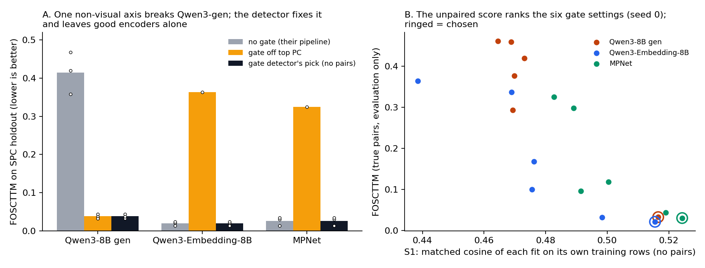
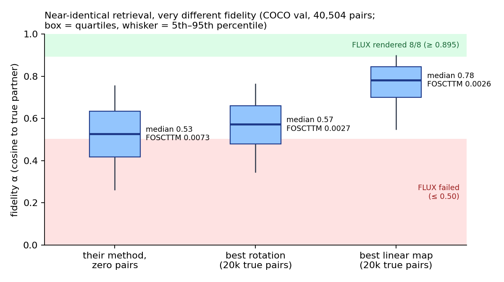

# Reading Is Not Authoring

**A hidden scaffold axis, an unpaired fix, and the rotation ceiling in unpaired cross-modal alignment.**
*A response to Schnaus, Dagès, Cremers, Wang and Isola, "Shared Geometry as a Rosetta Stone" (arXiv 2610.09411).*

> **How to read this report.**
> - **Labels.** *Measured* results cite a receipt under `experiments/results/`. *Inferred* marks a mechanism read
>   from measurements but not tested directly. *Post-hoc* marks a result found after a frozen test.
> - **How claims are judged.** On the direction and size of the measured effect against its noise
>   (slice-to-slice agreement, seed spread). Predictions were frozen before their runs, and each frozen bar's
>   outcome is reported. A bar decides only its own prediction. Only a proved inequality, a measured noise floor or
>   a consumer zone measured on FLUX (labelled as such) may decide a claim (§9).
> - **One placeholder** remains: E4, the consumer benchmark (§7), which is designed but not built.

## Abstract

Schnaus et al. show that separately trained vision and language encoders share enough geometry to be aligned by a
single rotation with no paired data. We confirm the premise on a new kind of pair. Zero-pair QAP recovers an
18-symbol correspondence between SmolLM2 and the text conditioner of a diffusion model, exactly, with their solver.
We then report three results that their evaluation does not show.

1. **A hidden scaffold axis, and an unpaired fix.** Their stored Qwen3-8B generative embeddings of long captions put
   13.8% of their variance on one axis that the image embedding barely predicts (R² 0.16, against 0.88–0.89 for
   MPNet and Qwen3-Embedding). The clipped CKA in their appendix hides this. Under their aligner, removing that one
   axis takes SPC holdout FOSCTTM from **0.415 ± 0.055 to 0.038 ± 0.006** over three seeds. Removing the top axis of
   MPNet or Qwen3-Embedding instead wrecks them, so it is not a blanket rule. A gate detector that uses **no pairs**
   chooses correctly in **9 of 9** encoder × seed cases. It gates off Qwen3-gen's axis, leaves the other two alone,
   and every choice is the best of the settings compared on true-pair FOSCTTM.
2. **Retrieval is not fidelity, and the rotation is the ceiling.** On COCO their zero-pair map retrieves almost
   perfectly (FOSCTTM 0.0073), yet its median cosine to the true partner is 0.53. Two oracle maps fitted on 20,000
   true pairs retrieve identically (FOSCTTM 0.0027 vs 0.0026) but differ by 0.21 in median fidelity (0.57 vs 0.78).
   The fidelity gap is not estimation: their zero-pair map is only 0.07 ± 0.03 below the best rotation. The
   orthogonality constraint costs three times that.
3. **A span ceiling for pair baselines.** Their linear and ASIF baselines provably score keys through a
   p-dimensional projection, so mean fidelity is at most sqrt(top-p eigen-energy). The bound holds on their data but
   is loose. With 5 pairs their method already retrieves better than both baselines do with 200.

Two of our ideas failed and are reported as such (§6). Token-centering the thinking preamble lowers CKA. Reading a
late layer instead of the last one helps by only 0.007–0.015 CKA, and not at all for thinking-mode pooling.



*Figure 1. **A.** SPC holdout FOSCTTM under their aligner. Bars are the mean over seeds; dots are individual seeds
(the control arms with the top PC gated off are seed 0 only). **B.** For each encoder, the unpaired score S1 of
each of the six gate settings against its true-pair FOSCTTM, at seed 0. The ringed setting is the one S1 chooses.
Receipts: `results/e5_scaffold_axis/e5_gates-*.json`.*

---

## 1. Summary

### 1.1 What we offer them

| finding | measured result | what they could change |
|---|---|---|
| A non-visual dominant axis in Qwen3 generative pooling (§3) | removing it: SPC FOSCTTM 0.415 → 0.038 (3 seeds) | run the unpaired gate detector before fitting: six fits instead of one |
| Clipped CKA hides that axis (§3.5) | clipped CKA 0.61–0.66 for all three encoders; linear CKA 0.43 for gen vs 0.63–0.66 | report linear CKA next to clipped CKA when predicting alignability |
| FOSCTTM does not measure fidelity (§4) | equal FOSCTTM (0.0027 / 0.0026), median α 0.57 vs 0.78 | report per-pair α next to FOSCTTM, especially for text-to-image use |
| The rotation, not the estimate, limits fidelity (§4.3) | estimation gap 0.07 ± 0.03; rotation constraint 0.21 | for generation, relax the rotation (for example a non-orthogonal correction on a few anchors); untested |
| Span ceiling of pair baselines (§5) | bound holds, loose; their method with 5 pairs retrieves better than the baselines with 200 | a proof of why their few-pair baselines need many pairs |

### 1.2 Every claim and its status

| # | claim | test | status |
|---|---|---|---|
| — | Their premise holds for a language model vs a diffusion conditioner, at the symbol level | E0 | **confirmed**: 18/18 at zero pairs |
| A\* | *(post-hoc)* One non-visual axis dominates Qwen3-gen embeddings; removing it fixes the alignment; an unpaired detector finds it | axis probe, E5, gates | **measured**: 0.415 → 0.038 over 3 seeds; detector correct in 9/9 |
| D | Near-zero FOSCTTM is compatible with low per-pair fidelity | E1, E1b | **supported**: equal-FOSCTTM oracles differ by 0.21 in α; the D1 formula is right in direction, off 3–30× in magnitude |
| C | Span-confined pair baselines: mean fidelity ≤ sqrt(top-p eigen-energy) | proof, E2 | **proved; holds on data**, but loose |
| E | Choosing pairs (vision-side medoids) helps | E2 | **baselines only**; no gain for their method |
| A | The thinking preamble dilutes CKA; token-centering removes it | E3 | **refuted**: centering lowers CKA in every thinking-on cell |
| B | A late, non-final layer aligns better | E3 | **supported, small**: +0.007–0.015 in 5 of 6 no-thinking cells; not for thinking mode |
| F | A consumer-grounded benchmark with causal ground truth | E4 | designed, not built |

---

## 2. Their premise on our data (measured, E0)

**Setting.**
- **Spaces.** Subject-row displacements (a subject row minus the template mean) of 18 animals × 4 distinct prompt
  prefixes. One space is SmolLM2-1.7B; the other is the Qwen3-4B text conditioner of FLUX.2 Klein 4B
  (7,680 dims). Source: our receipt `job-0706b0497903`.
- **Templates.** Six templates collapse to four, because causal models give bit-identical subject rows for templates
  that share the text before the subject.
- **Problem.** Maximize `Tr(K_A P K_B Pᵀ)` over permutations P with zero pairs, where K_A and K_B are the
  centered-cosine kernels of the class means. This is their CKA-matching objective.

Receipt: `experiments/results/e0_symbol_qap/e0_symbol_qap-20261009T180533.json`.

| quantity | value |
|---|---|
| off-diagonal kernel correlation across spaces | 0.890 |
| zero-pair correspondence, 2-opt with 2,000 restarts | **18/18**; 169 of 2,000 restarts find it, and it is the best objective found (23.5915) |
| zero-pair correspondence, MPOpt (their solver and costs) | **18/18** |
| each prefix alone (4 independent problems) | 18/18 on every prefix |
| Gaussian-geometry null (10 draws) | 0–2 / 18 |
| margin to the next local optimum / to the best single swap | 0.236 / 0.053 |
| seeded with k = 1, 2, 3, 5 anchors (accuracy on the rest, scipy FAQ) | 0.22, 0.29, 0.52, 0.72 (chance 0.06–0.08) |
| fully unpaired rows (animal and prefix unknown) | 41.7% (chance 5.6%); source rows cluster by prefix (ARI 0.019), native rows by animal (0.331) |

- **New pair type.** Their finding extends to a language model against a diffusion-model conditioner, at the
  granularity of individual symbols.
- **Checked causally.** The recovered correspondence is the one our anchored bridge uses, and that bridge authors
  held-out symbols through the image generator at native parity (progress 0.523–0.810 vs native 0.520–0.817).
- **Caveat.** The margin is thin, and 18 symbols is a small problem.

---

## 3. A hidden scaffold axis, and an unpaired fix

### 3.1 The axis (measured offline, post-hoc)

The question came out of the failure in §6.1. Their generative pooling aligns near chance on long captions, yet its
clipped CKA (0.607) is close to MPNet's (0.633); if the token-level preamble is not the cause, what is? We examined
their stored SPC embeddings directly: 4,096 rows of DINOv2-B and of each language model. Script
`experiments/e5_scaffold_axis/axis_probe.py`; receipt `results/e5_scaffold_axis/e5_axis_probe-20261009T191307.json`.

| SPC, first 4,096 rows | Qwen3-8B gen | Qwen3-Embedding-8B | MPNet |
|---|---:|---:|---:|
| clipped CKA (their appendix metric) | 0.608 | 0.659 | 0.636 |
| **linear CKA** | **0.433** | 0.657 | 0.633 |
| top language PC: share of variance | **13.8%** | 5.4% | 6.7% |
| held-out R² of top language PC from the image embedding | **0.16** | 0.89 | 0.88 |
| \|corr\| of top language PC with top image PC | **0.006** | 0.889 | 0.901 |
| corr of top language PC with paragraph length (n = 2,048) | 0.229 | −0.034 | 0.071 |
| **linear CKA after projecting out the top language PC** | **0.583 (↑)** | 0.498 (↓) | 0.466 (↓) |
| mutual 10-NN with the image embedding (n = 1,024) | **0.216** | 0.349 | 0.330 |

The opposite signs in the CKA-after-projection row are what this lemma predicts:

**Lemma A1 (scaffold dilution of CKA, exact in population).** Let X = R + S be zero-mean, with S independent of
(R, Y). Then

```
CKA(X, Y) = CKA(R, Y) · ||Σ_R||_F / ||Σ_R + Σ_S||_F  ≤  CKA(R, Y) / sqrt(1 + ρ²),   ρ = ||Σ_S||_F / ||Σ_R||_F,
```

with equality if and only if Σ_R Σ_S = 0.

*Proof.* Independence gives Cov(X, Y) = Cov(R, Y) and Cov(X) = Σ_R + Σ_S. Then
||Σ_R + Σ_S||_F² = ||Σ_R||² + ||Σ_S||² + 2 tr(Σ_R Σ_S), and tr(Σ_R Σ_S) ≥ 0 for positive semidefinite matrices. ∎

So removing a pure scaffold raises CKA, and removing an axis the image shares lowers it. Qwen3-gen's top axis
behaves as a scaffold: removing it raises linear CKA by 35%. The other two encoders' top axes are the image's own
top axis. The implied scaffold ratio for gen is ρ ≈ 0.9, from 0.583 / 0.433 = 1.35 ≈ sqrt(1 + ρ²).

### 3.2 Removing it fixes their aligner (measured, E5)

**Protocol.** Their `WassersteinProcrustes` with default settings. Training uses SPC minus the last 2,000 items,
as their two disjoint unpaired halves. FOSCTTM is computed on those 2,000. The axis is the top principal component
of the unpaired language training rows, projected out of every language row. Beast, seeds 0–2. Receipts:
`results/e5_scaffold_axis/e5_gates-*.json`, `e5_scaffold_axis-raw-drop1-*-seed{1,2}-*.json`.

| SPC holdout FOSCTTM | Qwen3-8B gen | Qwen3-Embedding-8B | MPNet |
|---|---:|---:|---:|
| their pipeline (no gate) | 0.415 ± 0.055 (0.419 / 0.358 / 0.467) | 0.019 (0.021 / 0.013 / 0.023) | 0.026 (0.030 / 0.034 / 0.014) |
| top language PC projected out | **0.038 ± 0.006** (0.033 / 0.044 / 0.037) | 0.364 (seed 0) | 0.325 (seed 0) |

- **The fix.** For Qwen3-gen the change is −0.377, about 7 seed SDs of the raw arm. FOSCTTM goes from near chance
  to about 4% of keys outranking the partner.
- **Not a blanket rule.** The same projection takes the two good encoders from about 0.02–0.03 to 0.33–0.36. That
  change is far beyond any seed noise we observed, so we did not re-seed it.
- **Mechanism (inferred from the sign pattern and §3.1).** Their aligner locks onto each space's dominant axis.
  For MPNet and Qwen3-Embedding that axis is the image's own top axis (|corr| 0.89–0.90), so it carries the
  alignment. For Qwen3-gen it is non-visual (|corr| 0.006), so the image's top axis is matched to a scaffold and
  the alignment collapses.

### 3.3 Finding the axis without pairs (measured)

**A first detector failed.** It took Hungarian pseudo-pairs from the raw fit and dropped any of the top-10
language PCs that the mapped image side could not predict (ridge R² < 0.3).
- **Result.** For Qwen3-gen it dropped PC 8, not PC 0, and FOSCTTM worsened from 0.407 to 0.484 (laptop, seed 0).
  For the two controls it correctly dropped nothing.
- **Cause (inferred).** The test is circular. On its pseudo-pairs the image side "predicts" the scaffold PC with
  R² 0.855, against 0.16 on true pairs. The pseudo-pairs come from a fit that had already rotated the image's top
  axis onto the scaffold, so the test certifies whatever the broken fit matched.

**A gate detector that works.** It is ported from our spectral dimension ladder. There, one learned gate per axis
drove every nuisance-axis gate to exactly 0 (61 of 61 at 64 axes), and the setting that scored best on discovery
data was kept. Those gates were trained on a supervised loss; here the only signal is the alignment, and gating
inside one fit is the circular trap above. So we port the second mechanism, **discovery selection**:
1. Fit once per gate setting: no gate, or gate off one of language PCs 0–4, estimated on unpaired rows.
2. Score each fit on its own training rows, with no true pair:
   - **S1** is the mean cosine of Hungarian-matched pairs: how well one rotation makes the two clouds coincide as
     sets.
   - **S2** is linear CKA over the matched pairs.
3. Keep the setting with the highest S1.

Script `experiments/e5_scaffold_axis/gates.py`; predictions G1–G3 were frozen in its header before any score
existed. Seed 0:

| gate setting | Qwen3-8B gen S1 | FOSCTTM | Qwen3-Emb-8B S1 | FOSCTTM | MPNet S1 | FOSCTTM |
|---|---:|---:|---:|---:|---:|---:|
| no gate | 0.473 | 0.419 | **0.516** | **0.021** | **0.524** | **0.030** |
| gate off PC0 | **0.517** | **0.033** | 0.439 | 0.364 | 0.483 | 0.325 |
| gate off PC1 | 0.464 | 0.460 | 0.469 | 0.337 | 0.489 | 0.297 |
| gate off PC2 | 0.470 | 0.377 | 0.476 | 0.168 | 0.500 | 0.118 |
| gate off PC3 | 0.469 | 0.293 | 0.476 | 0.100 | 0.519 | 0.043 |
| gate off PC4 | 0.469 | 0.459 | 0.498 | 0.032 | 0.492 | 0.096 |

Seeds 1–2, re-running each encoder's two highest-S1 settings:

| encoder | S1 choice | S1 margin over runner-up (seeds 0 / 1 / 2) | FOSCTTM, chosen vs runner-up |
|---|---|---|---|
| Qwen3-8B gen | gate off PC0 | 0.044 / 0.030 / 0.041 | 0.033–0.044 vs 0.358–0.467 |
| Qwen3-Embedding-8B | no gate | 0.017 / 0.023 / 0.013 | 0.013–0.023 vs 0.032–0.050 |
| MPNet | no gate | 0.005 / 0.023 / 0.021 | 0.014–0.034 vs 0.030–0.063 |

- **G1, the falsifier: holds.** S1 gates off PC0 for Qwen3-gen and nothing for the controls, in 9 of 9 encoder ×
  seed cases.
- **G2: holds.** Every S1 choice is also the best true-pair FOSCTTM among the settings compared: all six at
  seed 0, the top two at seeds 1–2.
- **G3: mixed.** S2 agrees except for MPNet at seed 0, where it picks gate-off-PC3 (FOSCTTM 0.043 vs 0.030).
- **S1 ranks all six settings.** Rank correlation of S1 with −FOSCTTM is 0.94, 0.94 and 0.77 (Qwen3-Embedding,
  MPNet, Qwen3-gen). For S2 it is 0.83, 0.89 and 0.26.
- **Earlier frozen predictions (E5 script).** P5a, that dropping the top PC lowers FOSCTTM for gen and raises it
  for the others, holds. P5b and P5c, that the pseudo-pair detector finds gen's axis and never hurts, are false
  (above).

### 3.4 Not a precision artifact (measured)

The Qwen3-8B-gen file is stored in fp32, although their loader docstring says bf16.
- **Large common direction.** Its rows share one: ‖mean of unit rows‖ ≈ 0.93, against 0.38–0.66 for the other
  files. Centering removes it in fp32 and leaves about 20 of 24 mantissa bits in the residual.
- **The bf16 files are far from swamping.** Per-coordinate |mean| / σ is 6–13, against the 835–2,371 at which, in
  our own work, rounding swamped a centered residual.
- **So the axis is real.** It is a property of the representation, not of storage.

### 3.5 What it means for their predictors

- **Clipped CKA hides the deficit.** Their App. D clipped CKA gives 0.61–0.66 for all three encoders, while linear
  CKA separates gen (0.433) from the others (0.63–0.66). Inferred: clipping bounds the dominant axis's large
  coordinates, so a predictor built on clipped CKA over-rates generative pooling.
- **Local geometry agrees.** Mutual 10-NN is 0.216 for gen against 0.33–0.35. This suggests the axis reorganizes
  neighborhoods, which Hungarian matching depends on.

---

## 4. Retrieval is not fidelity: the rotation ceiling

### 4.1 Why retrieval can be near-perfect while fidelity is low

**Proposition D1.** Let the keys ŷ_j and the mapped query q_i be unit vectors, with α_i = ⟨q_i, ŷ_i⟩ and
q_i = α_i ŷ_i + β_i u_i, where β_i = sqrt(1 − α_i²) and u_i ⟂ ŷ_i.
- **Exact condition.** Distractor j outranks the partner exactly when β_i ⟨u_i, ŷ_j⟩ > α_i (1 − c_ij), where
  c_ij = ⟨ŷ_i, ŷ_j⟩.
- **Approximation.** If u_i is uniform on a sphere of effective dimension d_eff orthogonal to ŷ_i, then

```
P(j outranks i) ≈ Φ̄( (α_i/β_i) · sqrt((d_eff − 1)(1 − c_ij)/(1 + c_ij)) ),
```

  which goes to 0 for any fixed α_i > 0 as d_eff grows. For example, with d_eff = 100 and c = 0.1, α = 0.3 gives
  P ≈ 0.003.

Retrieval is a margin property that improves with dimension; fidelity is not. A generator conditioned on q_i
receives only α_i of the true signal. Our FLUX.2 consumer measured three zones of direction fidelity:
- ≥ 0.895 rendered the target in 8 of 8 cells;
- ≤ 0.50 failed;
- 0.71–0.78 depended on target and seed.

Those zones belong to FLUX and serve here only as a reference scale.

### 4.2 Measured (E1, COCO val2014, DINOv2-B ↔ MPNet, their protocol)

Receipts: `results/e1_fidelity_gap/e1_fidelity_gap-20261009T200203.json` (seed 0, laptop) and
`e1_fidelity_gap-seed{1,2}-*.json` (Beast). The oracles are closed-form fits on 20,000 true pairs.

| map | FOSCTTM | median α | α 5th–95th pct | α ≥ 0.895 | α ≤ 0.50 |
|---|---:|---:|---|---:|---:|
| **their method, zero pairs** (seeds 0 / 1 / 2) | **0.0073** / 0.0259 / 0.0149 | **0.527** / 0.474 / 0.495 | 0.260–0.757 (seed 0) | **0.0%** (seed 0) | **43.3%** (seed 0) |
| their method, 10 known pairs (seed 0) | 0.0125 | 0.473 | 0.205–0.725 | 0.0% | 56.3% |
| their method, 100 known pairs (seed 0) | 0.0056 | 0.507 | 0.267–0.731 | 0.0% | 48.3% |
| best rotation (orthogonal oracle) | 0.0027 | 0.572 | 0.344–0.766 | 0.0% | 30.1% |
| best linear map (least-squares oracle) | **0.0026** | **0.781** | 0.547–0.901 | 6.5% | 2.8% |

Across seeds 0–2 the oracle rows agree within 0.001 (FOSCTTM 0.0026–0.0027; median α 0.571–0.572 and 0.781).



*Figure 2. Per-pair fidelity on 40,504 COCO validation pairs (seed 0). Shaded bands are the FLUX consumer's zones,
measured on a different consumer and space, shown for scale only.*

**Claim D: supported.**
- **Near-perfect retrieval.** Only 0.73% of keys outrank the true partner (seed 0).
- **Fidelity well below that.** The median cosine to the partner is 0.53. α² ≈ 0.28, so about 72% of a mapped
  vector's energy is not along its partner.
- **Equal retrieval, unequal fidelity.** The two oracles retrieve identically (0.0027 vs 0.0026) but differ by
  0.21 in median fidelity (0.572 vs 0.781). FOSCTTM cannot tell them apart.

### 4.3 Where the fidelity goes (measured)

| gap (median α) | from → to | size |
|---|---|---:|
| unpaired estimation | their zero-pair map → best rotation | **0.073 ± 0.026** (0.045 / 0.097 / 0.077 over seeds 0–2) |
| the rotation constraint | best rotation → best linear map | **0.210** |
| linearity and the rest | best linear map → 1 | 0.219 |

- **Their estimate is close to the best rotation.** With zero pairs it is within 0.07 ± 0.03 of a rotation
  fitted on 20,000 true pairs.
- **The ceiling is the rotation itself.** No single rotation puts any validation pair in FLUX's ≥ 0.895 zone.
  Relaxing orthogonality is worth three times the remaining estimation gap.
- **Few pairs cannot fix it.** While the map stays a rotation, pairs can only close the ~0.07 estimation gap. With
  10 or 100 pairs, fidelity was 0.473 and 0.507 (seed 0 each).
- **Consequence (inferred).** For a consumer that needs per-item fidelity, the lever is the map class, not better
  unpaired estimation. Candidates are a non-orthogonal correction fitted on a few anchors, or per-concept anchors
  as in our symbol work (one anchor per symbol lifted bridge fidelity to 0.93–0.99).

### 4.4 Checking Proposition D1 (measured, E1b)

Receipt `results/e1_fidelity_gap/e1_d1_check-20261009T211416.json`. Oracle maps were fitted on p true pairs, and
FOSCTTM was predicted from each map's median α and the residual's effective dimension (participation ratio) on
2,000 validation queries.

| map, p | median α | d_eff | predicted FOSCTTM | measured FOSCTTM |
|---|---:|---:|---:|---:|
| rotation, 20 | 0.109 | 85 | 0.189 | 0.138 |
| linear, 20 | 0.286 | 11 | 0.185 | 0.108 |
| rotation, 200 | 0.399 | 146 | 0.0047 | 0.0122 |
| rotation, 2,000 | 0.533 | 180 | 0.0002 | 0.0037 |
| rotation, 20,000 | 0.572 | 183 | 0.0001 | 0.0027 |
| linear, 20,000 | 0.781 | 69 | ≈ 0 | 0.0026 |

- **Magnitude: wrong where retrieval is good.** Below FOSCTTM ≈ 0.02 the formula underpredicts by 3–30×.
  Probable cause (inferred): it treats the residual as isotropic and ignores near-duplicate keys, which dominate
  the tail of the ranking. We use D1 only qualitatively.
- **Direction: right.** Retrieval depends on α/β and d_eff together. The linear map has much higher fidelity, but
  its residual lies in fewer directions (d_eff 69 vs 183), so it retrieves no better than the rotation.

---

## 5. Pair baselines: a span ceiling, and which pairs to label

**Notation.** ŷ is a centered, unit-normalized key. X̂_p and Ŷ_p are the p known pairs, V_p = rowspan(Ŷ_p), and P
is the projector onto V_p. λ_1 ≥ λ_2 ≥ … are the eigenvalues of Σ̂ = E[ŷŷᵀ], so Σλ = 1.

**Lemma C1 (span confinement, exact).** Their `linear` baseline is W = X̂_p⁺ Ŷ_p. Then x̂W = (x̂ X̂_p⁺) Ŷ_p ∈ V_p, so
sim(x, y) = ⟨x̂W, Pŷ⟩: keys are ranked using only their p-dimensional projection Pŷ. ASIF compares keys through
ŷŶ_pᵀ, which is also a function of Pŷ.

**Lemma C2 (fidelity ceiling).** For any map whose image lies in V_p,

```
E_i α_i ≤ E_i ||P ŷ_i|| ≤ sqrt(E_i ||P ŷ_i||²) = sqrt(tr(P Σ̂)) ≤ sqrt(Σ_{k≤p} λ_k).
```

*Proof.* Cauchy–Schwarz gives α_i ≤ ||Pŷ_i||; then Jensen; then Ky Fan's maximum principle. ∎

**Remarks.**
1. Their `orthogonal` baseline is informed by the data only on V_p. On the complement it is an arbitrary isometry
   from the SVD's completion, so the ceiling applies to it only heuristically.
2. Their own method with pairs is not span-confined, because the unpaired Procrustes term informs every direction.

**Measured (E2, COCO val, MPNet, one draw per p, random pairs as in their protocol).** Receipt
`results/e2_span_bound/e2_span_bound-20261009T222209.json`; the full ladder (p = 1 … 1,000, random and medoid) is in
the receipt.

| p | captured energy | Ky Fan max | ceiling sqrt(energy) | linear α | linear FOSCTTM | orthogonal α | orthogonal FOSCTTM | theirs α | theirs FOSCTTM |
|---:|---:|---:|---:|---:|---:|---:|---:|---:|---:|
| 1 | 0.016 | 0.080 | 0.127 | 0.038 | 0.422 | 0.007 | 0.462 | | |
| 5 | 0.085 | 0.266 | 0.291 | 0.144 | 0.228 | 0.035 | 0.333 | **0.498** | **0.0090** |
| 20 | 0.328 | 0.548 | 0.572 | 0.328 | 0.109 | 0.153 | 0.139 | **0.494** | **0.0075** |
| 50 | 0.572 | 0.768 | 0.756 | 0.444 | 0.048 | 0.262 | 0.052 | | |
| 200 | 0.889 | 0.962 | 0.943 | 0.515 | 0.016 | 0.405 | 0.013 | | |
| 1,000 | 1.000 | 1.000 | 1.000 | 0.426 | 0.018 | 0.506 | 0.005 | | |

- **C-i: the bound holds** in all 20 rows, as it must.
- **The bound is loose.** At p = 20 the linear baseline reaches 0.328 against a ceiling of 0.572.
- **C-iii: their method exceeds the ceiling** at p = 5 (0.498 vs 0.291) but not at p = 20 (0.494 vs 0.572). What
  matters more: with 5 pairs it retrieves better than both baselines do at p = 200 (0.009 vs 0.013–0.016).
- **Least squares overfits near p ≈ d.** Linear α falls from 0.515 (p = 200) to 0.426 (p = 1,000; span rank 766
  of 768). This is the interpolation regime of the pseudo-inverse.
- **Choosing pairs (Claim E) helps only the baselines.** Vision-side k-means medoids capture more energy than
  random pairs at every p ≤ 200 (0.085 → 0.128 at p = 5) and lower linear FOSCTTM at all of those p (0.228 → 0.161
  at p = 5). For their method, medoids gave 0.025 vs 0.009 at p = 5 and 0.0067 vs 0.0075 at p = 20. So pair
  selection is not a contribution to their method, and we did not spend seeds on it.

---

## 6. What did not work

### 6.1 Claim A: the thinking preamble does not dilute CKA (refuted, E3)

**What we tested.** Their generative pooling wraps each caption as "Imagine what it would look like to see:
{caption}" in Qwen3's chat template with thinking on. It decodes 128 greedy tokens and averages the final-layer
states that produce them. We predicted that the shared `<think>` preamble is a scaffold in Lemma A1's sense, and
that centering it away would raise CKA.

**Setup.**
- **Model and data.** Qwen3-1.7B in bf16 (the model of their Fig. 21 ladder), on the first 2,048 items of COCO
  train2014 (caption 0) and SPC, in their row order.
- **Row-order check.** Our MPNet embeddings match their stored rows: SPC cosine 1.000; COCO caption 0 retrieves
  its own row 95.7% of the time.
- **Metric.** Their clipped CKA against their stored DINOv2-B rows, per 1,024-item slice.
- **Replication.** Our pooling scores 0.591 on SPC against 0.607 for their stored 8B file.
- **Receipts and preregistration.** `results/e3_pooling_scaffold/job-9426423166f5/` and `job-5fd45e7c7f0d/`;
  `experiments/e3_pooling_scaffold/PREREG.md`.

| arm (final layer, clipped CKA) | COCO | SPC |
|---|---:|---:|
| their generative pooling (thinking on) | **0.623** | **0.591** |
| + token-centered | 0.602 | 0.573 |
| + leave-own-out frequent-token centering (post-hoc arm) | 0.609 | 0.581 |
| + position-centered (control) | 0.616 | 0.583 |
| thinking off | 0.587 | 0.548 |
| thinking off + token-centered | 0.591 | 0.571 |
| thinking off + leave-own-out centering | 0.595 | 0.575 |
| their mean pooling (all chat tokens) | 0.505 | 0.583 |
| mean pooling, caption tokens only | 0.506 | 0.596 |
| their stored MPNet (reference) | 0.687 | 0.633 |

| prediction | frozen bar | measured effect (COCO / SPC, paired per slice) | reading |
|---|---|---|---|
| A1: the first 12 generated tokens are shared by ≥ 90% of captions | true | 96–100% for each of the first 16 | preamble present |
| A2: token-centering beats theirs | false (0/4 cells) | −0.021 / −0.019 | opposite sign |
| A2′ *(post-hoc)*: leave-own-out centering beats theirs | false (0/4) | −0.015 / −0.010 | opposite sign |
| A3: best scaffold-removed arm gains ≥ 0.02 on SPC | false | −0.004 | no gain under any margin |
| A4: caption-token mean pooling ≥ all-token | true | +0.002 / +0.013 | SPC supported; COCO a tie |

- **Refuted on the sign, not on a margin.** Both slices agree in every cell, and every thinking-on centering arm
  moves CKA the wrong way.
- **Why.** The preamble is shared, but it is not independent of content. With thinking on, the model restates the
  caption inside its reasoning ("…what it would look like to see a close-up of bins of food that include broccoli
  and bread"), so centering removes signal.
- **Where Lemma A1's sign does appear.** With thinking off, centering helps in every cell (+0.004 to +0.027),
  because there the removed tokens are not a restatement. Thinking off still ends below thinking on.

### 6.2 Claim B: a late layer helps only a little (supported, small, E3)

| clipped CKA by depth (layer / 28) | 0.50 | 0.61 | 0.71 | 0.79 | 0.89 | 1.00 |
|---|---:|---:|---:|---:|---:|---:|
| COCO, their mean pooling | 0.328 | 0.341 | 0.332 | 0.468 | **0.516** | 0.505 |
| SPC, their mean pooling | 0.298 | 0.294 | 0.299 | 0.533 | **0.590** | 0.583 |
| COCO, caption-token mean pooling | 0.330 | 0.347 | 0.339 | 0.473 | **0.519** | 0.506 |
| SPC, caption-token mean pooling | 0.325 | 0.312 | 0.304 | 0.537 | 0.594 | **0.596** |
| COCO, generation, thinking off | 0.419 | 0.365 | 0.374 | 0.594 | **0.602** | 0.587 |
| SPC, generation, thinking off | 0.328 | 0.260 | 0.277 | 0.545 | **0.557** | 0.548 |
| COCO, generation, thinking on (theirs) | 0.412 | 0.358 | 0.367 | 0.589 | 0.621 | **0.623** |
| SPC, generation, thinking on (theirs) | 0.300 | 0.238 | 0.255 | 0.519 | 0.564 | **0.591** |

- **Direction: supported.** Depth 0.89 beats the final layer in 5 of 6 no-thinking cells, by +0.007 to +0.015 with
  both slices agreeing. That includes their own mean pooling on both corpora.
- **The frozen bars B1 and B2 failed** on the sixth cell, where 1.0 beats 0.89 by 0.002.
- **Thinking on: the final layer is best** (−0.002 / −0.027). For their best generative embedding, choosing a
  layer gives nothing.
- **Size: small.** Its effect on FOSCTTM is untested. CKA jumps between depth 0.71 and 0.79 in every arm
  (+0.13 to +0.27) and then plateaus, consistent with content formed late.

---

## 7. A consumer-grounded benchmark (designed, not built)

The design is in `experiments/e4_consumer_closure/DESIGN.md`:
1. Build a 200-symbol displacement bank (SmolLM2 ↔ Klein-Qwen).
2. Fit their unpaired aligner and record per-symbol α.
3. Render about 24 symbols spread over α through the frozen FLUX.2 Klein 4B, with a native ceiling, a shuffled sham
   and an exact no-op.
4. Predict that render progress rises with α. Report how much variance retrieval rank adds once α is known, with
   a bootstrap interval.

This would give an acceptance test for unpaired maps with causal ground truth. **[PENDING E4: not built.]**

---

## 8. Recommendations

| change | evidence | expected effect | status |
|---|---|---|---|
| Run the unpaired gate detector before fitting (six fits) | §3.3 | fixes Qwen3 generative pooling on long captions (0.415 → 0.038); leaves good encoders unchanged | measured on SPC holdout, 3 seeds; DCI, DOCCI and their COCO-val protocol untested |
| Report linear CKA next to clipped CKA | §3.5 | a predictor that stops over-rating generative pooling | measured on SPC |
| Report per-pair α next to FOSCTTM | §4.2 | separates maps that retrieval ranks as equal | measured (E1) |
| For text-to-image use, relax the rotation (for example a non-orthogonal correction on a few anchors) | §4.3 | higher per-item fidelity than any rotation | ceiling measured; correction untested |
| Read mean pooling at depth ≈ 0.9 | §6.2 | +0.007–0.015 clipped CKA | measured on CKA only |
| ~~Choose pairs as vision-side medoids~~ | §5 | helps only baselines | not a contribution |
| ~~Token-center the thinking preamble~~ | §6.1 | lowers CKA | refuted |

---

## 9. Methods and integrity

- **Their code, unchanged.** Splits, preprocessing, the aligner and FOSCTTM come from their library at commit
  `fdfad84`, so any difference from their numbers comes from the arm we change.
- **What we checked and do not claim.**
  - Their pipeline already centers and unit-normalizes both spaces.
  - Their QAP solver (MPOpt) reaches the optimum on our problem.
  - Their runs are bit-reproducible.

  Two suggestions we first considered, "center the embeddings" and "use a better solver", were dropped before any
  run.
- **Preregistration.** E3's predictions and both amendments are in `e3_pooling_scaffold/PREREG.md`. E5's and the
  gate detector's are in their script headers. Post-hoc arms are labelled.
- **How claims are judged (adopted 2026-10-09, before any E2, gate or seed result).** A claim is read from its
  effect against its noise; a frozen bar decides only its own prediction.
  - **Why.** Self-set round-number bars had decided claims in both directions. A "median α < 0.5" bar would have
    marked Claim D false at 0.527 but true at 0.473, on the same evidence. An "every cell" rule refuted Claim B
    on a 0.002 tie. A ≥ rule passed A4 on a +0.0006 margin.
  - **What was retired.** Those bars, plus a rank-correlation bar that was confounded by p.
  - **What we still report.** Every frozen outcome.
- **Seeds.** Three seeds (0–2) only for arms whose verdict noise could flip: the axis fix, the gate detector's two
  closest settings, and their zero-pair map in E1. Effects far beyond noise, failed arms, and baselines their
  method already beats were run once.
- **Hosts.** Fits ran on a laptop (macOS, torch 2.14) and on a Linux GPU host (torch 2.13). They agree to 1e-6 on
  small fits, but full-scale fits differ like seeds: Qwen3-gen at seed 0 gives raw 0.407 vs 0.419, and with the
  axis removed 0.036 vs 0.033. Every comparison above is made within one host.

## 10. Limits

- **One corpus for the axis.** The axis finding and the fix are on SPC, with a holdout protocol. Their paper
  validates SPC-trained maps on COCO val; that protocol, DCI and DOCCI are untested.
- **Scope of the gate detector.** It searches the top five language PCs and was tested on three encoders. A
  scaffold outside the top five, or one on the vision side, would be missed.
- **Model size in E3.** E3 used Qwen3-1.7B, not their 8B. The replication matches within 0.016 clipped CKA, but
  the token-level negative might not transfer to 8B.
- **Lemma A1 assumes independence.** The thinking preamble violates it, which is why A2 failed. The axis behaves as
  the lemma predicts, but the independence is inferred, not shown.
- **Consumer zones.** The 0.895 and 0.50 zones come from FLUX.2 Klein 4B direction fidelity on few cells and a
  different space. They are a reference scale, not a claim about their RAE.
- **Small E0.** E0 uses 18 symbols with a thin margin (0.053 to the best single swap).

## 11. Reproduce

See `experiments/README.md`. Laptop runs use `uv run python -m <module>`. Fleet runs use
`experiments/seeds/submit.py --plan {core,gates,gates-seeds}`, then `--collect`. Figures come from
`experiments/figures/make_figures.py`, which reads only the receipts.

## References

1. Schnaus, Dagès, Cremers, Wang, Isola. Shared Geometry as a Rosetta Stone: Cross-Modal Alignment Without Paired
   Data. arXiv 2610.09411, 2026.
2. Huh, Cheung, Wang, Isola. The Platonic Representation Hypothesis. ICML 2024.
3. Kornblith, Norouzi, Lee, Hinton. Similarity of Neural Network Representations Revisited. ICML 2019.
4. Hutschenreiter et al. Fusion Moves for Graph Matching. ICCV 2021 (MPOpt).
5. Ky Fan. On a theorem of Weyl concerning eigenvalues of linear transformations. PNAS 1949.
6. Our records: the FLUX encoder swap and symbol table (`obsidian/arcs/cross-conditioner-to-time-circuits.md`); the
   LM commit band (`research/papers/space-and-time-circuits/`); the spectral dimension ladder
   (`spf-wt-phaselock/domains/ml/spectral-native/docs/v4-dimension-ladder-findings.md`); rotation swamping
   (`research/papers/rounding-placement/`).
